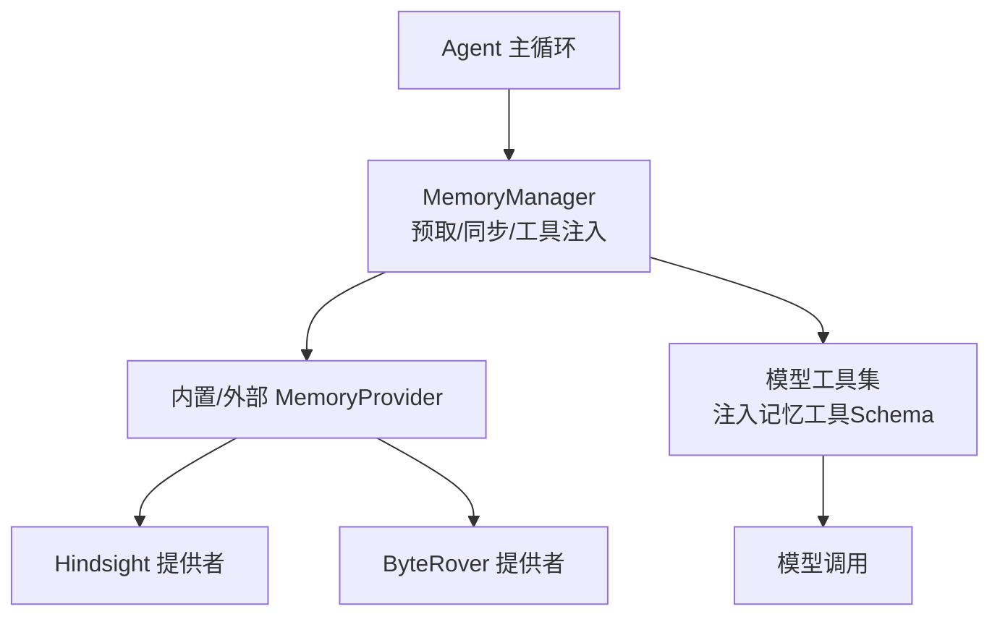
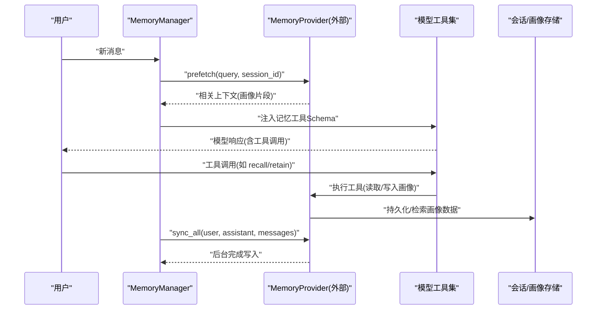
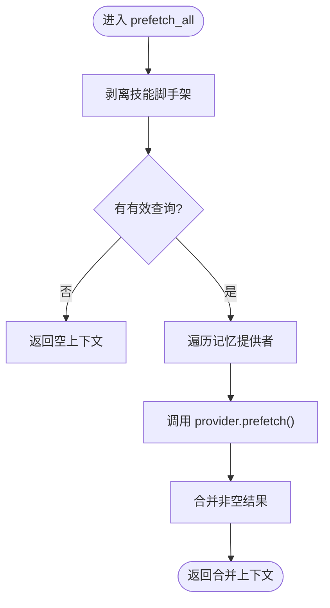
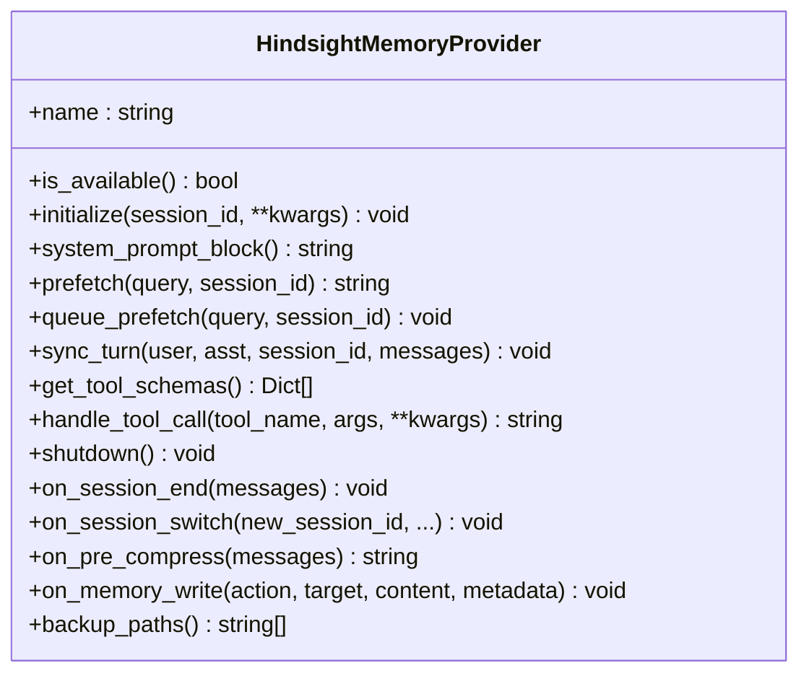
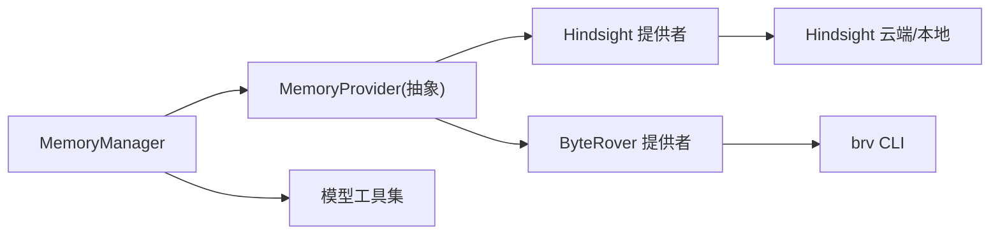

# 用户画像系统

<cite>
**本文引用的文件**
- [memory_manager.py](file://agent/memory_manager.py)
- [memory_provider.py](file://agent/memory_provider.py)
- [hindsight/__init__.py](file://plugins/memory/hindsight/__init__.py)
- [byterover/__init__.py](file://plugins/memory/byterover/__init__.py)
- [agent_init.py](file://agent/agent_init.py)
</cite>

## 目录
1. [简介](#简介)
2. [项目结构](#项目结构)
3. [核心组件](#核心组件)
4. [架构总览](#架构总览)
5. [详细组件分析](#详细组件分析)
6. [依赖关系分析](#依赖关系分析)
7. [性能考量](#性能考量)
8. [故障排查指南](#故障排查指南)
9. [结论](#结论)
10. [附录](#附录)

## 简介
本文件面向Hermes Agent的用户画像系统，系统性阐述如何从对话历史中构建、更新与查询用户画像，包括偏好提取、技能兴趣识别与工作习惯建模；说明画像更新的触发机制（实时学习与周期性重构）；解释隐私保护策略；并给出创建、更新、查询的典型流程示例。同时，文档将画像系统与工具推荐深度集成，展示如何利用画像提供个性化服务。内容兼顾初学者入门与高级用户的算法与数据分析细节。

## 项目结构
用户画像能力由“记忆管理器 + 可插拔记忆提供者”构成：
- 记忆管理器负责编排所有记忆提供者的预取、同步、工具注入与后台任务调度。
- 记忆提供者实现具体持久化与检索逻辑（如Hindsight、ByteRover），并通过统一接口暴露工具与上下文。
- 插件层提供多种后端实现，支持本地或云端模式、知识图谱、向量检索等。

图表来源
- [memory_manager.py:364-545](file://agent/memory_manager.py#L364-L545)
- [memory_provider.py:81-188](file://agent/memory_provider.py#L81-L188)
- [hindsight/__init__.py:681-800](file://plugins/memory/hindsight/__init__.py#L681-L800)
- [byterover/__init__.py:220-381](file://plugins/memory/byterover/__init__.py#L220-L381)

章节来源
- [memory_manager.py:1-24](file://agent/memory_manager.py#L1-L24)
- [memory_provider.py:1-32](file://agent/memory_provider.py#L1-L32)

## 核心组件
- 记忆管理器（MemoryManager）
  - 注册与管理多个记忆提供者（仅允许一个外部提供者）。
  - 在每轮对话前预取相关上下文（prefetch），并在完成后异步同步（sync_all）。
  - 将记忆提供者的工具Schema注入到模型工具集中，供模型按需调用。
  - 提供流式上下文清洗、系统提示块组装、后台任务调度与超时控制。
- 记忆提供者抽象（MemoryProvider）
  - 定义生命周期：initialize、system_prompt_block、prefetch、queue_prefetch、sync_turn、get_tool_schemas、handle_tool_call、shutdown。
  - 可选钩子：on_turn_start、on_session_end、on_session_switch、on_pre_compress、on_memory_write、backup_paths。
  - 提供“无意义提示词”过滤，避免对 trivial 输入进行不必要的记忆操作。
- Hindsight 提供者
  - 长期记忆、知识图谱、实体解析与多策略检索（语义搜索、关键词、实体图遍历、重排）。
  - 支持云/本地模式、预算控制、标签与观察范围配置、保留策略与异步写入。
  - 暴露 retain/recall/reflect 三类工具，用于存储、检索与综合推理。
- ByteRover 提供者
  - 通过 brv CLI 维护分层上下文树，支持模糊文本检索与LLM驱动搜索。
  - 暴露 query/curate/status 工具，支持自动抽取与压缩前数据冲刷。

章节来源
- [memory_manager.py:364-800](file://agent/memory_manager.py#L364-L800)
- [memory_provider.py:81-358](file://agent/memory_provider.py#L81-L358)
- [hindsight/__init__.py:305-354](file://plugins/memory/hindsight/__init__.py#L305-L354)
- [byterover/__init__.py:175-213](file://plugins/memory/byterover/__init__.py#L175-L213)

## 架构总览
下图展示了从用户输入到画像更新与查询的端到端流程，以及工具推荐如何基于画像提供个性化服务。

图表来源
- [memory_manager.py:525-694](file://agent/memory_manager.py#L525-L694)
- [memory_provider.py:132-188](file://agent/memory_provider.py#L132-L188)
- [hindsight/__init__.py:305-354](file://plugins/memory/hindsight/__init__.py#L305-L354)
- [byterover/__init__.py:380-440](file://plugins/memory/byterover/__init__.py#L380-L440)

## 详细组件分析

### 记忆管理器（MemoryManager）
- 角色与职责
  - 管理多个记忆提供者，限制仅一个外部提供者，避免工具冲突与状态混乱。
  - 每轮对话前预取相关上下文，拼接为带标记的内存上下文块，供模型参考。
  - 每轮对话后异步同步用户与助手内容，确保不阻塞主线程。
  - 将记忆提供者的工具Schema注入到模型工具集，使模型能主动调用记忆能力。
- 关键流程
  - 预取：strip skill脚手架 -> 遍历提供者 -> 并行/超时控制 -> 合并结果。
  - 同步：串行后台执行器 -> 兼容不同签名 -> 异常隔离。
  - 工具注入：规范化Schema -> 去重 -> 加入有效工具名集合。
  - 流式清洗：跨分片安全丢弃 memory-context 内部内容，防止泄露。
- 复杂度与性能
  - 预取与同步均考虑超时与后台执行，避免慢提供者阻塞交互。
  - 单工作线程序列化写路径，保证顺序性与资源可控。

图表来源
- [memory_manager.py:507-545](file://agent/memory_manager.py#L507-L545)

章节来源
- [memory_manager.py:364-800](file://agent/memory_manager.py#L364-L800)

### 记忆提供者抽象（MemoryProvider）
- 生命周期与钩子
  - initialize：建立连接/资源准备，支持profile/workspace/session等上下文。
  - system_prompt_block：静态提示块，辅助模型理解记忆能力。
  - prefetch/queue_prefetch：即时/延迟召回，支持并发会话与超时。
  - sync_turn：异步持久化本轮对话，支持messages参数以保留工具调用轨迹。
  - get_tool_schemas/handle_tool_call：暴露并处理记忆工具。
  - on_session_end/on_session_switch/on_pre_compress：会话边界与压缩前洞察提取。
  - on_memory_write：镜像内置记忆写入，便于外部提供者同步。
- 无意义提示词过滤
  - 使用正则匹配简短问候、确认语、斜杠命令等，跳过不必要的记忆操作，节省网络与计算开销。

章节来源
- [memory_provider.py:44-79](file://agent/memory_provider.py#L44-L79)
- [memory_provider.py:81-358](file://agent/memory_provider.py#L81-L358)

### Hindsight 提供者
- 能力概览
  - 长期记忆、知识图谱、实体解析与多策略检索。
  - 支持云/本地模式、预算控制、标签与观察范围、保留策略与异步写入。
  - 暴露 retain/recall/reflect 工具，分别用于存储、检索与综合推理。
- 配置与隐私
  - 配置文件优先级：profile-scoped config.json > 旧版共享config.json > 环境变量。
  - 敏感信息通过密钥获取与环境变量管理；嵌入式环境文件权限严格校验（0600）。
- 画像构建与更新
  - 通过 retain 将结构化事实与上下文持久化，结合标签与观察范围组织画像。
  - 通过 recall/reflect 召回相关画像片段，支撑个性化回答与工具推荐。
  - 支持 append 模式增量写入，减少覆盖风险并提升一致性。

图表来源
- [hindsight/__init__.py:681-800](file://plugins/memory/hindsight/__init__.py#L681-L800)
- [memory_provider.py:81-358](file://agent/memory_provider.py#L81-L358)

章节来源
- [hindsight/__init__.py:1-800](file://plugins/memory/hindsight/__init__.py#L1-L800)

### ByteRover 提供者
- 能力概览
  - 通过 brv CLI 维护分层上下文树，支持模糊文本检索与LLM驱动搜索。
  - 暴露 query/curate/status 工具，支持自动抽取与压缩前数据冲刷。
- 画像构建与更新
  - 通过 curate 将重要信息存入上下文树，按类别组织，便于后续检索。
  - 通过 query 检索历史知识、项目决策与用户偏好，形成画像片段。
  - 支持 on_memory_write 镜像内置记忆写入，保持多源一致。

章节来源
- [byterover/__init__.py:1-450](file://plugins/memory/byterover/__init__.py#L1-L450)

## 依赖关系分析
- 耦合与内聚
  - MemoryManager 与 MemoryProvider 解耦良好，通过抽象接口协作。
  - 各提供者独立实现，互不影响；外部提供者唯一限制避免冲突。
- 直接/间接依赖
  - MemoryManager 依赖工具集注册表与守护线程池，确保工具注入与后台任务稳定。
  - Hindsight/ByteRover 依赖各自运行时（云端API或本地CLI），具备可用性探测与降级策略。
- 外部集成点
  - 模型工具集：通过注入Schema，使模型能主动调用记忆能力。
  - 平台身份与Profile：支持按profile隔离存储与配置，保障多用户场景。

图表来源
- [memory_manager.py:364-800](file://agent/memory_manager.py#L364-L800)
- [memory_provider.py:81-358](file://agent/memory_provider.py#L81-L358)
- [hindsight/__init__.py:681-800](file://plugins/memory/hindsight/__init__.py#L681-L800)
- [byterover/__init__.py:220-381](file://plugins/memory/byterover/__init__.py#L220-L381)

章节来源
- [memory_manager.py:364-800](file://agent/memory_manager.py#L364-L800)
- [memory_provider.py:81-358](file://agent/memory_provider.py#L81-L358)

## 性能考量
- 预取与同步的超时控制
  - 外部提供者预取设置超时，避免阻塞主线程；失败时记录日志并继续其他提供者。
- 后台串行写入
  - 单工作线程序列化写路径，保证顺序性并降低资源竞争。
- 流式上下文清洗
  - 跨分片安全丢弃 memory-context 内部内容，避免泄露且不影响UI渲染。
- 无意义提示词过滤
  - 对 trivial 输入跳过记忆操作，减少不必要网络与计算开销。
- 可扩展性
  - 通过插件化提供者扩展新后端，不影响现有流程；唯一外部提供者限制避免冲突。

[本节提供通用指导，无需特定文件引用]

## 故障排查指南
- 常见问题定位
  - 预取超时：检查外部提供者健康状态与网络连通性；查看日志中的超时警告。
  - 工具冲突：若提供者工具名与核心工具冲突，会被拒绝注册；需重命名工具。
  - 写入失败：后台写入失败会记录警告；检查提供者队列与守护进程状态。
  - 流式泄露：确认 StreamingContextScrubber 正常工作，避免 memory-context 内容泄露。
- 诊断步骤
  - 启用调试日志，关注提供者名称与错误信息。
  - 检查配置与密钥是否正确加载（profile-scoped优先）。
  - 验证工具Schema是否被正确注入与路由。

章节来源
- [memory_manager.py:430-470](file://agent/memory_manager.py#L430-L470)
- [memory_manager.py:547-595](file://agent/memory_manager.py#L547-L595)
- [memory_manager.py:638-694](file://agent/memory_manager.py#L638-L694)
- [hindsight/__init__.py:565-620](file://plugins/memory/hindsight/__init__.py#L565-L620)

## 结论
Sparkii Agent 的用户画像系统通过统一的记忆管理器与可插拔提供者，实现了高效的对话历史分析、偏好提取与行为模式识别。系统支持实时学习与周期性重构，具备完善的隐私保护与性能优化策略。通过与模型工具集的深度集成，画像能力可直接服务于个性化推荐与智能决策。无论是初学者还是高级用户，均可基于该架构快速扩展与定制。

[本节总结性内容，无需特定文件引用]

## 附录

### 用户画像的创建、更新与查询示例（流程级）
- 创建画像
  - 通过 retain/curate 工具将用户偏好、技能兴趣与工作习惯持久化。
  - 使用标签与观察范围组织画像，便于后续检索与聚合。
- 更新画像
  - 每轮对话后，MemoryManager 调用 sync_turn 异步写入最新交互。
  - 支持增量写入（append模式）与压缩前冲刷，确保画像时效性。
- 查询画像
  - 通过 recall/query 工具检索相关画像片段，注入到系统提示或作为上下文。
  - 支持 reflect/综合推理，生成连贯的回答与建议。

章节来源
- [hindsight/__init__.py:305-354](file://plugins/memory/hindsight/__init__.py#L305-L354)
- [byterover/__init__.py:175-213](file://plugins/memory/byterover/__init__.py#L175-L213)
- [memory_manager.py:525-694](file://agent/memory_manager.py#L525-L694)

### 画像与工具推荐的深度集成
- 工具注入
  - MemoryManager 将记忆提供者的工具Schema注入到模型工具集，使模型能主动调用记忆能力。
- 个性化服务
  - 基于画像片段，模型可选择合适工具（如代码执行、文件操作、搜索等），提供定制化建议。
- 反馈闭环
  - 工具执行结果可作为新证据，进一步丰富画像与推荐策略。

章节来源
- [memory_manager.py:110-156](file://agent/memory_manager.py#L110-L156)
- [memory_manager.py:784-800](file://agent/memory_manager.py#L784-L800)

### 隐私保护机制
- 配置与密钥
  - 配置文件优先级与敏感信息通过密钥获取与环境变量管理。
  - 嵌入式环境文件权限严格校验（0600），防止明文密钥泄露。
- 数据最小化
  - 无意义提示词过滤，避免无关数据进入画像。
  - 流式上下文清洗，防止内部记忆内容泄露至UI。
- 隔离与审计
  - Profile-scoped 配置与存储，支持多用户隔离。
  - 工具调用与写入操作可追踪，便于审计与问题定位。

章节来源
- [hindsight/__init__.py:361-404](file://plugins/memory/hindsight/__init__.py#L361-L404)
- [hindsight/__init__.py:565-620](file://plugins/memory/hindsight/__init__.py#L565-L620)
- [memory_manager.py:174-179](file://agent/memory_manager.py#L174-L179)

### 初学者入门与高级算法要点
- 初学者
  - 理解记忆提供者抽象与生命周期，掌握基本工具调用流程。
  - 通过配置与工具，快速上手画像的创建与查询。
- 高级用户
  - 自定义提供者实现，扩展画像维度与检索策略。
  - 利用 on_pre_compress 与 on_session_end 进行洞察提取与总结。
  - 调优预算、标签与观察范围，平衡精度与成本。

[本节为概念性内容，无需特定文件引用]