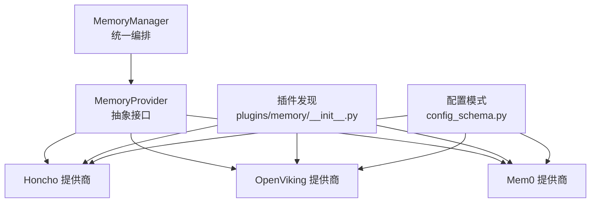
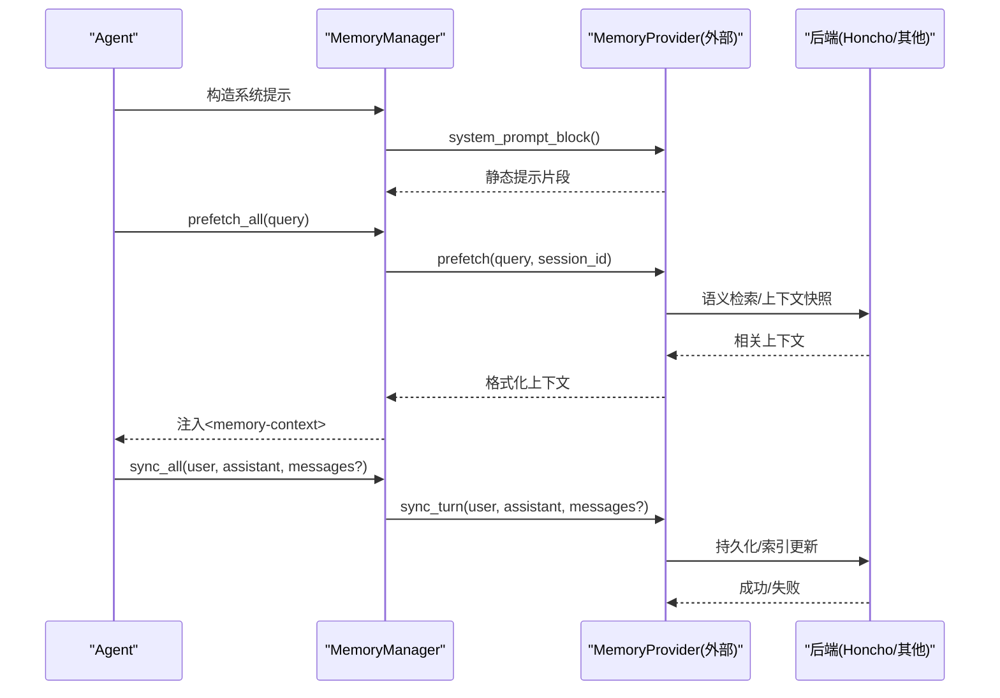
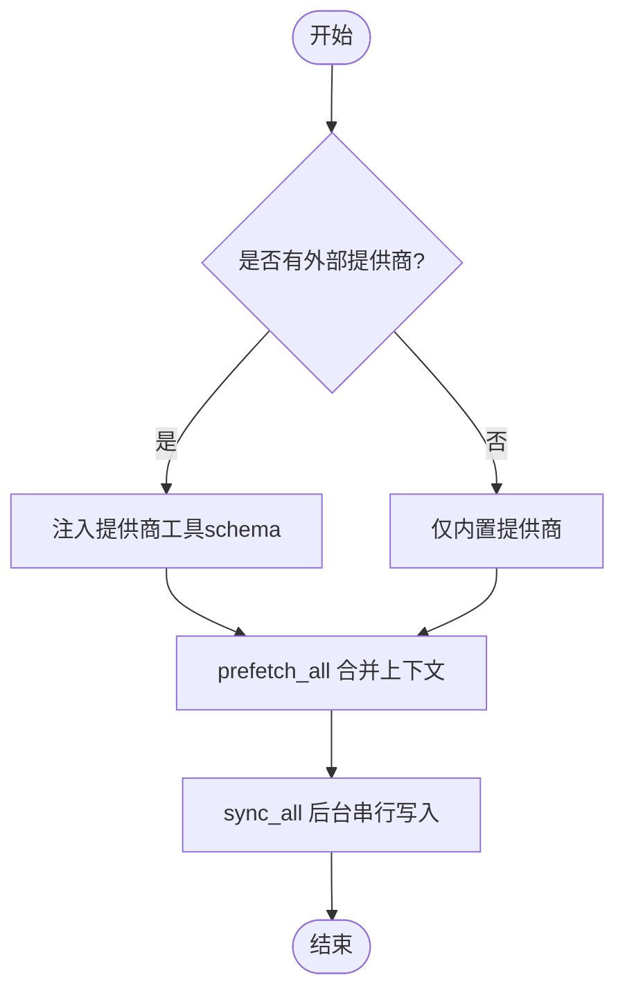
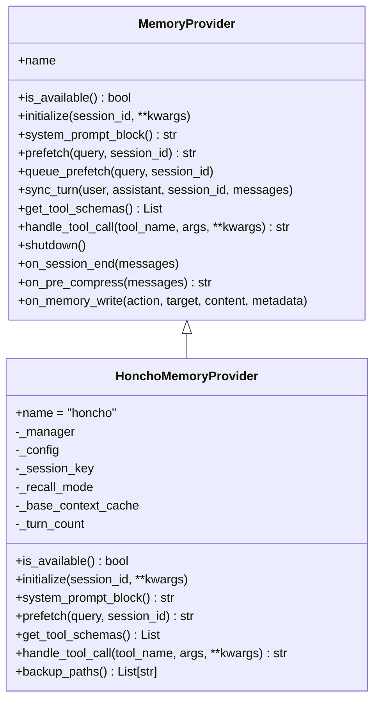
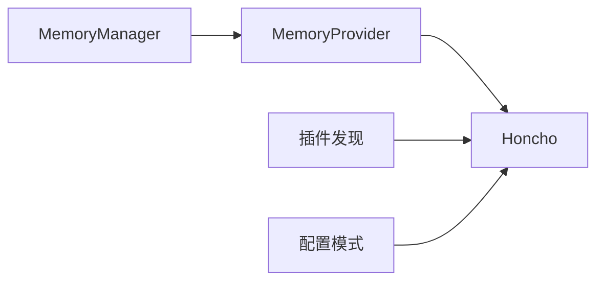

# 长期记忆系统

<cite>
**本文引用的文件**
- [agent/memory_manager.py](file://agent/memory_manager.py)
- [agent/memory_provider.py](file://agent/memory_provider.py)
- [plugins/memory/__init__.py](file://plugins/memory/__init__.py)
- [plugins/memory/config_schema.py](file://plugins/memory/config_schema.py)
- [plugins/memory/honcho/__init__.py](file://plugins/memory/honcho/__init__.py)
</cite>

## 目录
1. [简介](#简介)
2. [项目结构](#项目结构)
3. [核心组件](#核心组件)
4. [架构总览](#架构总览)
5. [详细组件分析](#详细组件分析)
6. [依赖关系分析](#依赖关系分析)
7. [性能与可扩展性](#性能与可扩展性)
8. [故障排查指南](#故障排查指南)
9. [结论](#结论)
10. [附录：使用示例与最佳实践](#附录使用示例与最佳实践)

## 简介
本文件面向Hermes Agent的长期记忆系统，系统性阐述其存储架构、语义索引构建、跨会话知识检索、用户画像构建、技能自动创建机制、记忆压缩与去重策略、外部记忆提供商集成（Honcho、OpenViking、Mem0等），以及与工具系统的深度集成方式。文档同时为初学者提供基础概念，并为高级用户提供存储架构与算法实现细节。

## 项目结构
长期记忆系统由“管理器 + 抽象接口 + 插件发现 + 具体提供商”构成：
- 管理器：统一编排内置与外部记忆提供者，负责预取、同步、工具注入、后台任务调度。
- 抽象接口：定义提供者的生命周期、工具暴露、钩子扩展点。
- 插件发现：扫描内置与用户安装的提供商，按配置激活唯一的外部提供商。
- 具体提供商：以Honcho为代表，实现语义搜索、对话式推理、持久化结论、上下文快照等能力；OpenViking、Mem0等通过相同接口接入。

**图表来源**
- [agent/memory_manager.py:364-800](file://agent/memory_manager.py#L364-L800)
- [agent/memory_provider.py:81-190](file://agent/memory_provider.py#L81-L190)
- [plugins/memory/__init__.py:90-140](file://plugins/memory/__init__.py#L90-L140)
- [plugins/memory/config_schema.py:94-145](file://plugins/memory/config_schema.py#L94-L145)
- [plugins/memory/honcho/__init__.py:237-336](file://plugins/memory/honcho/__init__.py#L237-L336)

**章节来源**
- [agent/memory_manager.py:1-120](file://agent/memory_manager.py#L1-L120)
- [plugins/memory/__init__.py:1-40](file://plugins/memory/__init__.py#L1-L40)

## 核心组件
- MemoryManager：单入口协调器，限制仅一个外部提供商，提供系统提示拼装、预取合并、回合后同步、工具注入与后台执行。
- MemoryProvider：抽象基类，定义initialize、prefetch、sync_turn、get_tool_schemas、handle_tool_call、shutdown及可选钩子（如on_session_end、on_pre_compress、on_memory_write）。
- 插件发现：扫描plugins/memory下内置与$SPARKII_HOME/plugins下用户安装提供商，支持register或继承MemoryProvider两种加载方式，并读取plugin.yaml描述。
- 配置模式：声明式字段定义，支持文本、选择、密钥、布尔、数字、JSON等类型，以及扁平JSON与主机块存储后端。

**章节来源**
- [agent/memory_manager.py:364-800](file://agent/memory_manager.py#L364-L800)
- [agent/memory_provider.py:81-190](file://agent/memory_provider.py#L81-L190)
- [plugins/memory/__init__.py:146-217](file://plugins/memory/__init__.py#L146-L217)
- [plugins/memory/config_schema.py:30-104](file://plugins/memory/config_schema.py#L30-L104)

## 架构总览
长期记忆系统在Agent运行期的关键流程如下：
- 启动阶段：根据memory.provider配置加载唯一外部提供商，注册到MemoryManager。
- 每轮前：MemoryManager调用各provider.prefetch(query, session_id)，合并结果并以安全围栏包裹注入系统提示。
- 每轮后：MemoryManager在后台线程中串行调用provider.sync_turn(user, assistant, messages?)，保证写入顺序。
- 工具集成：MemoryManager收集provider.get_tool_schemas()，规范化schema并注入到Agent工具集，供模型直接调用。

**图表来源**
- [agent/memory_manager.py:486-694](file://agent/memory_manager.py#L486-L694)
- [agent/memory_provider.py:123-170](file://agent/memory_provider.py#L123-L170)
- [plugins/memory/honcho/__init__.py:699-800](file://plugins/memory/honcho/__init__.py#L699-L800)

## 详细组件分析

### MemoryManager：统一编排与工具注入
- 只允许一个外部提供商：避免工具schema膨胀与冲突。
- 预取合并：对每个provider的结果进行拼接，过滤空结果，异常不阻断其他provider。
- 后台同步：使用单工作线程序列化写入，避免慢/卡死provider阻塞主循环；支持flush等待队列排空。
- 工具注入：从provider获取工具schema，标准化后追加到Agent工具集，并维护valid_tool_names。

**图表来源**
- [agent/memory_manager.py:110-156](file://agent/memory_manager.py#L110-L156)
- [agent/memory_manager.py:525-694](file://agent/memory_manager.py#L525-L694)

**章节来源**
- [agent/memory_manager.py:364-800](file://agent/memory_manager.py#L364-L800)

### MemoryProvider：抽象接口与扩展点
- 生命周期：initialize、system_prompt_block、prefetch、queue_prefetch、sync_turn、get_tool_schemas、handle_tool_call、shutdown。
- 可选钩子：on_turn_start、on_session_end、on_session_switch、on_pre_compress、on_delegation、backup_paths、get_config_schema/save_config。
- trivial prompt过滤：避免无意义输入触发网络请求与上下文污染。

**章节来源**
- [agent/memory_provider.py:44-79](file://agent/memory_provider.py#L44-L79)
- [agent/memory_provider.py:81-190](file://agent/memory_provider.py#L81-L190)
- [agent/memory_provider.py:195-358](file://agent/memory_provider.py#L195-L358)

### 插件发现与配置模式
- 插件发现：扫描内置与用户安装目录，优先内置；支持register或继承MemoryProvider两种方式；读取plugin.yaml描述。
- 配置模式：声明式字段，支持多种类型与存储后端（flat_json、honcho_host_block）；web端通用渲染与读写。

**章节来源**
- [plugins/memory/__init__.py:90-140](file://plugins/memory/__init__.py#L90-L140)
- [plugins/memory/__init__.py:146-217](file://plugins/memory/__init__.py#L146-L217)
- [plugins/memory/config_schema.py:30-104](file://plugins/memory/config_schema.py#L30-L104)
- [plugins/memory/config_schema.py:112-145](file://plugins/memory/config_schema.py#L112-L145)

### Honcho提供商：语义索引、用户画像与跨会话检索
- 工具集合：profile（卡片）、search（混合检索）、reasoning（对话式推理）、context（快照）、conclude（持久化结论）。
- 召回模式：context（自动注入）、tools（仅工具）、hybrid（两者结合）。
- 会话初始化：支持延迟初始化、首次等待预算、背景预热（dialectic prewarm）、迁移本地memories到远程会话。
- 预取逻辑：分层组装（base context + dialectic补充），缓存与刷新周期控制，首回合特殊处理。

**图表来源**
- [agent/memory_provider.py:81-190](file://agent/memory_provider.py#L81-L190)
- [plugins/memory/honcho/__init__.py:237-336](file://plugins/memory/honcho/__init__.py#L237-L336)
- [plugins/memory/honcho/__init__.py:699-800](file://plugins/memory/honcho/__init__.py#L699-L800)

**章节来源**
- [plugins/memory/honcho/__init__.py:36-230](file://plugins/memory/honcho/__init__.py#L36-L230)
- [plugins/memory/honcho/__init__.py:343-562](file://plugins/memory/honcho/__init__.py#L343-L562)
- [plugins/memory/honcho/__init__.py:656-800](file://plugins/memory/honcho/__init__.py#L656-L800)

### 用户画像构建过程
- 卡片（card）：短小精悍的“事实清单”，用于快速定位用户偏好、角色、沟通风格等。
- 表示（representation）：更丰富的用户画像，随对话积累逐步完善。
- 会话摘要（summary）：当前会话的关键信息聚合。
- AI自我表示/卡片：辅助AI理解自身身份与约束。
- 结论（conclusion）：持久化的推导事实，可被后续会话复用。

这些元素通过Honcho的context/profile/reasoning/conclude工具组合形成稳定的跨会话用户画像。

**章节来源**
- [plugins/memory/honcho/__init__.py:36-230](file://plugins/memory/honcho/__init__.py#L36-L230)
- [plugins/memory/honcho/__init__.py:627-654](file://plugins/memory/honcho/__init__.py#L627-L654)

### 技能自动创建机制
- 从经验中提取可复用的知识与最佳实践，转化为“结论”或“卡片”条目，沉淀到用户画像。
- 通过conclude工具写入稳定事实，配合reasoning工具进行综合问答，使代理在后续会话中自动应用这些知识。
- 结合on_session_end钩子可在会话结束时批量提取洞察，减少实时开销。

**章节来源**
- [plugins/memory/honcho/__init__.py:184-227](file://plugins/memory/honcho/__init__.py#L184-L227)
- [agent/memory_provider.py:204-212](file://agent/memory_provider.py#L204-L212)

### 记忆压缩与数据去重策略
- 压缩前置钩子：on_pre_compress允许提供商在上下文压缩前提取关键洞察，确保重要信息不被丢弃。
- trivial prompt过滤：避免无意义输入触发不必要的检索与写入。
- 去重与合并：通过结论（conclusion）的持久化与自愈合机制，重复或矛盾信息会随时间收敛；建议以“修正结论”替代删除，保持历史一致性。
- 空间优化：合理设置context_tokens、dialectic_cadence、injection_frequency等参数，控制上下文大小与频率。

**章节来源**
- [agent/memory_provider.py:258-268](file://agent/memory_provider.py#L258-L268)
- [agent/memory_provider.py:44-79](file://agent/memory_provider.py#L44-L79)
- [plugins/memory/honcho/__init__.py:184-227](file://plugins/memory/honcho/__init__.py#L184-L227)

### 外部记忆提供商集成（Honcho、OpenViking、Mem0）
- 统一接口：所有提供商实现MemoryProvider抽象，遵循相同的生命周期与工具暴露规范。
- 插件发现：通过plugins/memory目录扫描加载，支持内置与用户安装，按memory.provider配置激活唯一外部提供商。
- 配置模式：声明式字段便于UI渲染与读写，支持密钥与环境变量回退。
- OpenViking/Mem0：通过相同接口接入，具体实现细节由各提供商模块负责。

**章节来源**
- [plugins/memory/__init__.py:90-140](file://plugins/memory/__init__.py#L90-L140)
- [plugins/memory/config_schema.py:30-104](file://plugins/memory/config_schema.py#L30-L104)
- [agent/memory_provider.py:81-190](file://agent/memory_provider.py#L81-L190)

### 与工具系统的深度集成
- 工具注入：MemoryManager收集provider的工具schema，标准化后注入Agent工具集，供模型直接调用。
- 工具路由：保留核心工具名优先级，防止覆盖；冲突时记录警告并忽略。
- 工具调用：provider.handle_tool_call负责具体实现，返回JSON字符串结果。

**章节来源**
- [agent/memory_manager.py:110-156](file://agent/memory_manager.py#L110-L156)
- [agent/memory_manager.py:430-465](file://agent/memory_manager.py#L430-L465)
- [agent/memory_provider.py:172-188](file://agent/memory_provider.py#L172-L188)

## 依赖关系分析
- MemoryManager依赖MemoryProvider抽象，解耦具体实现。
- 插件发现模块依赖文件系统与配置，动态加载提供商。
- Honcho提供商依赖其客户端与会话管理，实现语义检索与用户建模。
- 配置模式模块提供声明式字段定义，驱动UI与后端读写。

**图表来源**
- [agent/memory_manager.py:364-800](file://agent/memory_manager.py#L364-L800)
- [plugins/memory/__init__.py:90-140](file://plugins/memory/__init__.py#L90-L140)
- [plugins/memory/config_schema.py:94-145](file://plugins/memory/config_schema.py#L94-L145)
- [plugins/memory/honcho/__init__.py:237-336](file://plugins/memory/honcho/__init__.py#L237-L336)

**章节来源**
- [agent/memory_manager.py:364-800](file://agent/memory_manager.py#L364-L800)
- [plugins/memory/__init__.py:90-140](file://plugins/memory/__init__.py#L90-L140)
- [plugins/memory/config_schema.py:94-145](file://plugins/memory/config_schema.py#L94-L145)
- [plugins/memory/honcho/__init__.py:237-336](file://plugins/memory/honcho/__init__.py#L237-L336)

## 性能与可扩展性
- 后台串行写入：避免慢provider阻塞主循环，提升响应性。
- 预取超时控制：外部provider预取设置超时，防止长时间等待影响用户体验。
- 懒初始化：tools-only模式下延迟初始化，减少启动开销。
- 缓存与刷新：base context缓存与周期性刷新，平衡实时性与成本。
- 可扩展性：新增提供商只需实现MemoryProvider接口，并通过插件发现机制加载。

**章节来源**
- [agent/memory_manager.py:624-757](file://agent/memory_manager.py#L624-L757)
- [plugins/memory/honcho/__init__.py:425-562](file://plugins/memory/honcho/__init__.py#L425-L562)
- [plugins/memory/honcho/__init__.py:699-800](file://plugins/memory/honcho/__init__.py#L699-L800)

## 故障排查指南
- 提供商不可用：检查is_available返回值与配置项（如api_key、base_url）。
- 预取超时：关注外部provider预取超时日志，调整timeout或cadence。
- 工具冲突：若工具名与核心工具冲突，会被忽略并记录警告，需重命名。
- 会话切换：on_session_switch钩子用于重置或更新会话状态，确保写入正确会话。
- 备份路径：通过backup_paths声明外部存储路径，确保备份命令能捕获。

**章节来源**
- [plugins/memory/honcho/__init__.py:306-336](file://plugins/memory/honcho/__init__.py#L306-L336)
- [agent/memory_manager.py:430-465](file://agent/memory_manager.py#L430-L465)
- [agent/memory_provider.py:214-256](file://agent/memory_provider.py#L214-L256)
- [agent/memory_provider.py:341-358](file://agent/memory_provider.py#L341-L358)

## 结论
Sparkii Agent的长期记忆系统通过统一的MemoryManager与MemoryProvider抽象，实现了灵活、可扩展的记忆存储与检索能力。Honcho提供商提供了强大的语义索引、用户画像与跨会话检索功能，结合工具系统与配置模式，为个性化服务提供了坚实基础。通过后台串行写入、预取超时、懒初始化等机制，系统在性能与可靠性之间取得了良好平衡。未来可通过更多外部提供商（OpenViking、Mem0等）进一步扩展生态。

## 附录：使用示例与最佳实践
- 写入记忆：通过provider的conclude工具写入持久化结论，或通过on_memory_write钩子镜像内置记忆写入。
- 查询记忆：使用search工具进行混合检索，或使用reasoning工具进行综合问答。
- 同步操作：MemoryManager在每轮后自动调用sync_turn，无需手动干预；可通过flush_pending等待队列排空。
- 最佳实践：
  - 合理设置recall_mode与injection_frequency，平衡上下文质量与成本。
  - 使用on_pre_compress提取关键洞察，避免重要信息丢失。
  - 定期审查结论与卡片，保持用户画像的准确性与简洁性。

**章节来源**
- [plugins/memory/honcho/__init__.py:184-227](file://plugins/memory/honcho/__init__.py#L184-L227)
- [agent/memory_manager.py:759-780](file://agent/memory_manager.py#L759-L780)
- [agent/memory_provider.py:258-268](file://agent/memory_provider.py#L258-L268)