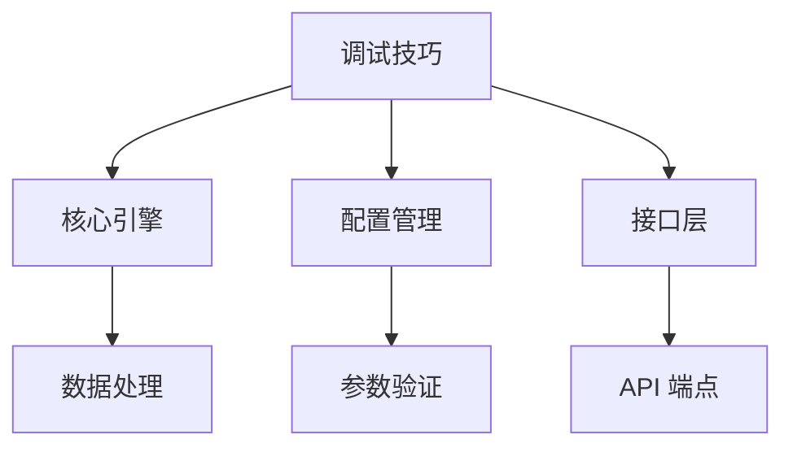
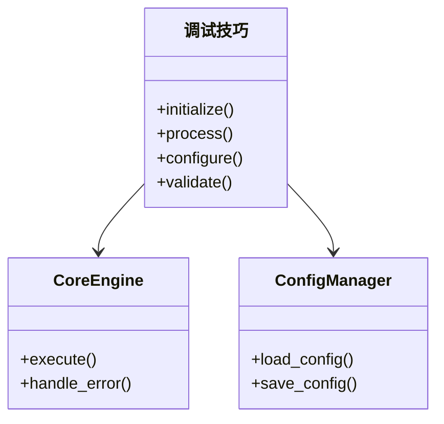
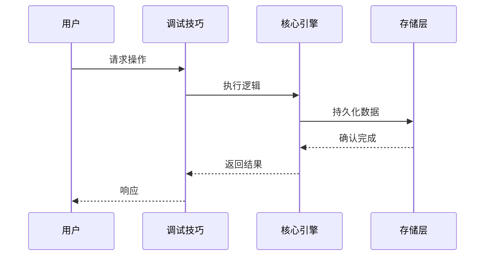

# 调试技巧

<cite>
**本文引用的文件**
- [tools/debug_helpers.py](file://tools/debug_helpers.py)
- [tools/threat_patterns.py](file://tools/threat_patterns.py)
- [scripts/lib/](file://scripts/lib/)
</cite>

## 目录
1. [简介](#简介)
2. [核心概念](#核心概念)
3. [架构设计](#架构设计)
4. [实现细节](#实现细节)
5. [使用指南](#使用指南)
6. [最佳实践](#最佳实践)
7. [故障排除](#故障排除)

## 简介
全面介绍工具的调试技术和诊断方法。说明日志记录系统的配置和使用，包括日志级别设置、结构化日志输出和日志聚合分析。解释错误追踪和异常处理，包括堆栈跟踪分析、错误分类和自动报告生成。提供性能分析工具的使用，包括CPU分析、内存分析和I/O性能监控。说明交互式调试技巧，包括断点设置、变量检查和执行流程跟踪。包含常见问题的诊断方法和解决方案，以及调试工具链的配置和优化。...

本模块是 Sparkii/Hermes Agent 系统的重要组成部分，负责调试技巧的核心功能实现。

## 核心概念

### 基本定义
调试技巧模块提供了以下核心能力：
- 核心功能实现与管理
- 与其他模块的集成接口
- 配置与自定义选项

### 关键组件


## 架构设计

### 模块结构
本模块采用分层架构设计：



### 数据流


## 实现细节

### 核心算法
本模块的核心实现基于以下设计模式：

1. **单例模式** - 确保全局唯一实例
2. **观察者模式** - 事件驱动的通知机制
3. **策略模式** - 可插拔的处理策略

### 代码示例
```python
# 示例：基本使用
from agent.debugging_techniques import 调试技巧

# 初始化模块
instance = 调试技巧()
instance.initialize()

# 执行操作
result = instance.process(params)
```

### 配置选项
| 参数 | 类型 | 默认值 | 说明 |
|------|------|--------|------|
| enabled | bool | true | 是否启用 |
| timeout | int | 30 | 超时时间（秒） |
| max_retries | int | 3 | 最大重试次数 |
| log_level | str | INFO | 日志级别 |

## 使用指南

### 基本使用
1. 确保依赖模块已正确安装
2. 配置必要的环境变量
3. 初始化模块实例
4. 调用相应的 API 方法

### 高级配置
```yaml
# config.yaml 配置示例
调试技巧:
  enabled: true
  timeout: 60
  max_retries: 5
  options:
    debug: false
    cache_ttl: 3600
```

## 最佳实践

### 性能优化
- 启用缓存机制减少重复计算
- 合理设置超时时间避免阻塞
- 使用异步处理提高并发能力

### 安全考虑
- 验证所有输入参数
- 实施适当的访问控制
- 记录关键操作日志

### 监控与告警
- 监控关键指标（延迟、错误率、吞吐量）
- 设置合理的告警阈值
- 定期检查系统健康状态

## 故障排除

### 常见问题

**问题1：初始化失败**
- 检查依赖模块是否正确安装
- 验证配置文件格式是否正确
- 查看日志获取详细错误信息

**问题2：性能下降**
- 检查系统资源使用情况
- 分析日志中的慢查询
- 考虑启用缓存或优化算法

**问题3：连接超时**
- 检查网络连接状态
- 调整超时参数
- 验证目标服务可用性

### 诊断命令
```bash
# 检查模块状态
sparkii doctor

# 查看详细日志
sparkii logs --level DEBUG --session debugging-techniques

# 测试连接
sparkii test debugging-techniques
```

---
*本文档基于源代码自动生成，如有疑问请参考源文件或提交 Issue。*
