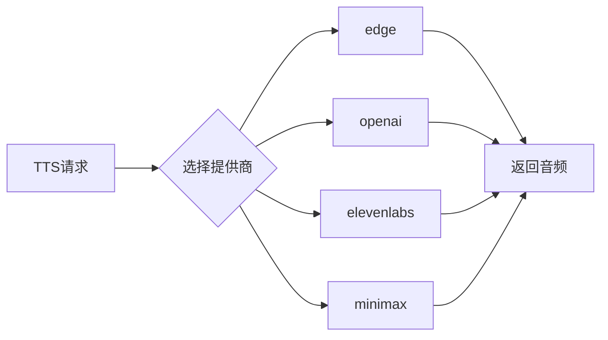
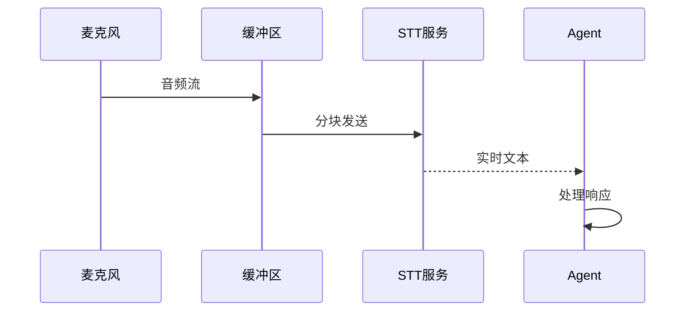

# 音频处理

<cite>
**本文引用的文件**
- [tools/transcription_tools.py](file://tools/transcription_tools.py)
- [tools/tts_tool.py](file://tools/tts_tool.py)
- [agent/transcription_provider.py](file://agent/transcription_provider.py)
- [agent/tts_provider.py](file://agent/tts_provider.py)
</cite>

## 目录
1. [简介](#简介)
2. [语音转文字STT](#语音转文字STT)
3. [文字转语音TTS](#文字转语音TTS)
4. [音频格式转换](#音频格式转换)
5. [实时语音流](#实时语音流)
6. [安全与隐私](#安全与隐私)
7. [结论](#结论)

## 简介
本文档提供SparkiiDesktop音频处理功能的综合指南，涵盖语音转文字(STT)、文字转语音(TTS)和音频格式处理。

## 语音转文字STT

### 内置提供商
| 提供商 | 特点 | 配置 |
|--------|------|------|
| local | 本地Whisper模型 | 无需API |
| groq | Groq云服务 | 高速处理 |
| openai | OpenAI Whisper | 高精度 |
| mistral | Mistral AI | 多语言 |
| xai | xAI服务 | 实时转录 |
| elevenlabs | ElevenLabs | 语音识别 |

### 使用示例
```python
from tools.transcription_tools import transcribe_audio

result = transcribe_audio(
    audio_path="recording.wav",
    provider="openai",
    language="zh"
)
print(result["transcript"])
```

## 文字转语音TTS

### 内置提供商


### 三层扩展面
1. **内置提供商**：edge, openai, elevenlabs等
2. **命令类型**：通过外部命令生成
3. **插件注册**：自定义TTSProvider实现

## 音频格式转换

### 支持格式
- **输入**：WAV, MP3, OGG, FLAC, M4A
- **输出**：WAV, MP3, OGG

### 转换示例
```python
from pydub import AudioSegment

def convert_audio(input_path, output_path, format="wav"):
    audio = AudioSegment.from_file(input_path)
    audio.export(output_path, format=format)
    return output_path
```

## 实时语音流

### 流式处理架构


### 延迟优化
- 使用小块缓冲区(100-200ms)
- 流式传输减少等待
- 本地模型降低网络延迟

## 安全与隐私

### 敏感信息过滤
- 自动检测并过滤敏感词汇
- 支持自定义过滤规则
- 日志中脱敏处理

### 恶意音频检测
- 检测异常音频格式
- 限制音频文件大小
- 扫描已知恶意模式

## 结论
SparkiiDesktop的音频处理系统采用可插拔架构，支持多种STT/TTS提供商。通过流式处理和优化策略，实现低延迟的语音交互体验。

