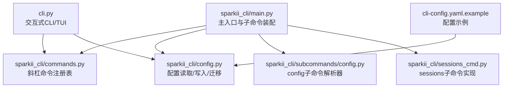
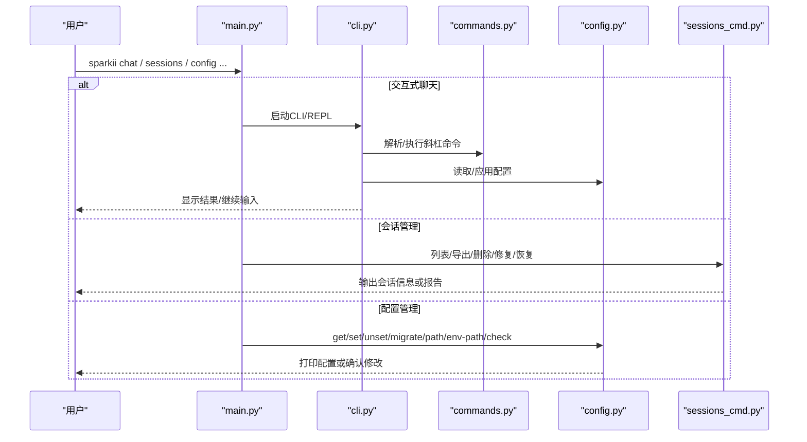
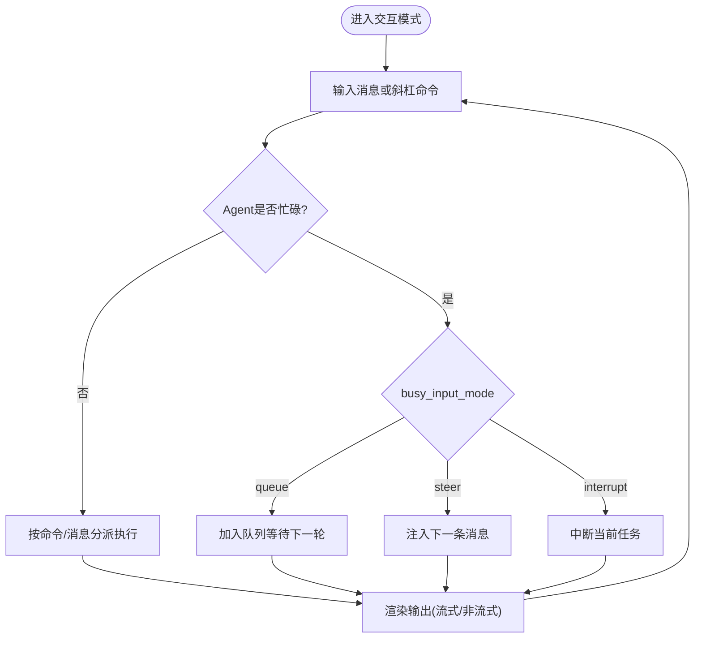
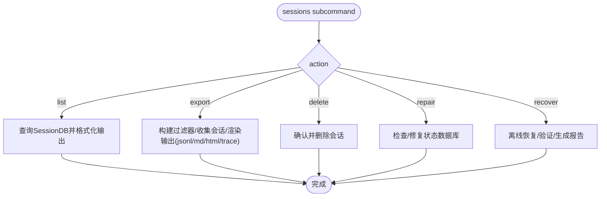
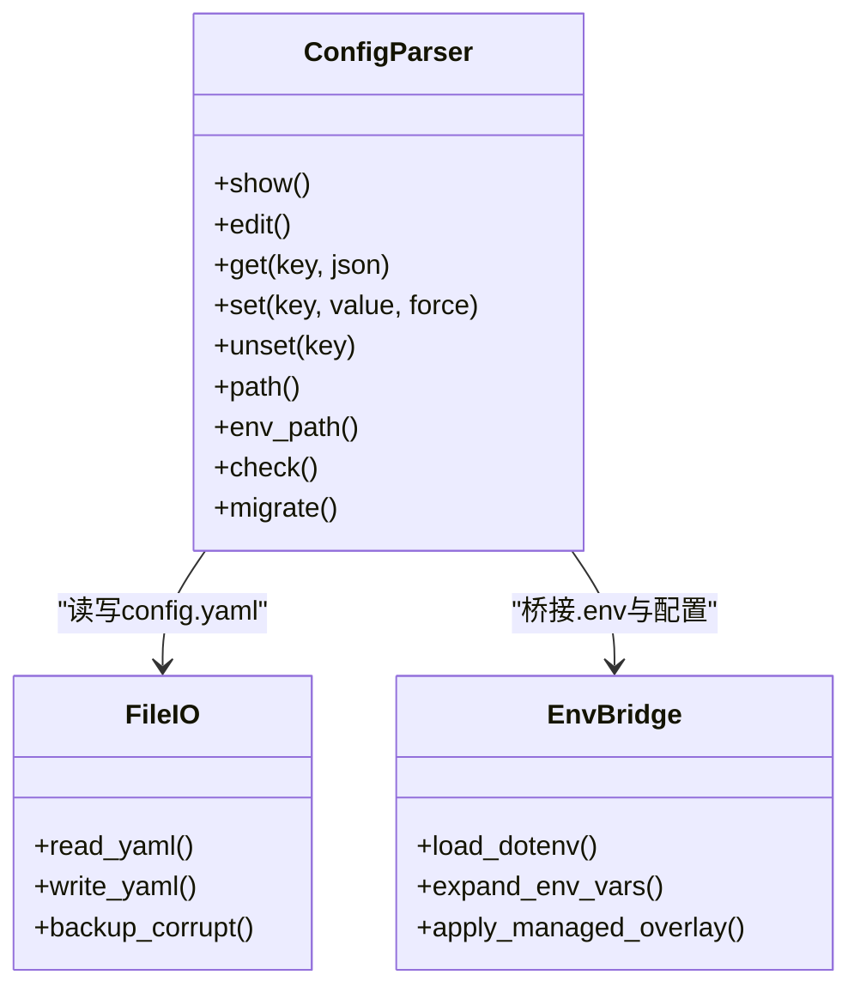
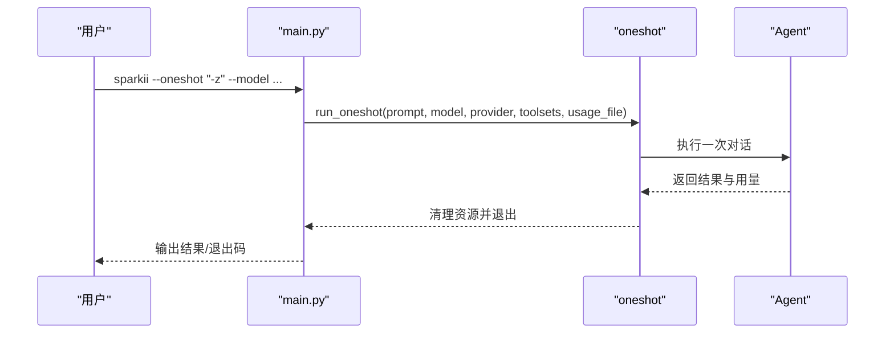
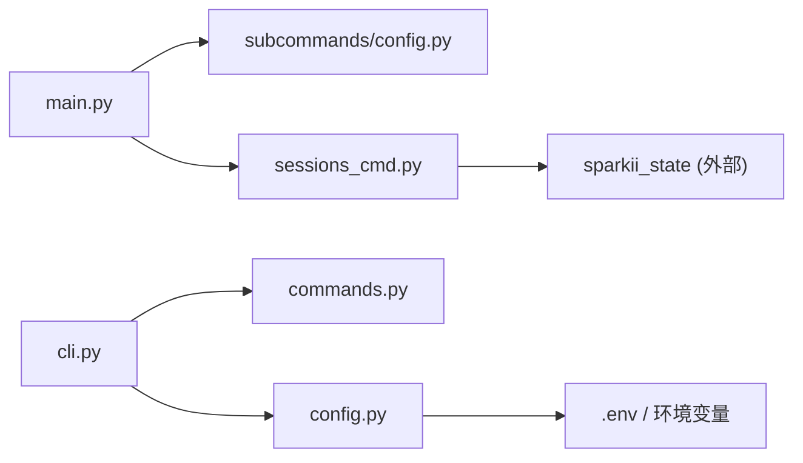

# CLI终端使用手册

<cite>
**本文引用的文件**
- [sparkii_cli/main.py](file://sparkii_cli/main.py)
- [cli.py](file://cli.py)
- [sparkii_cli/commands.py](file://sparkii_cli/commands.py)
- [sparkii_cli/config.py](file://sparkii_cli/config.py)
- [sparkii_cli/subcommands/config.py](file://sparkii_cli/subcommands/config.py)
- [sparkii_cli/sessions_cmd.py](file://sparkii_cli/sessions_cmd.py)
- [cli-config.yaml.example](file://cli-config.yaml.example)
</cite>

## 目录
1. [简介](#简介)
2. [项目结构](#项目结构)
3. [核心组件](#核心组件)
4. [架构总览](#架构总览)
5. [详细组件分析](#详细组件分析)
6. [依赖关系分析](#依赖关系分析)
7. [性能注意事项](#性能注意事项)
8. [故障排除指南](#故障排除指南)
9. [结论](#结论)
10. [附录](#附录)

## 简介
本手册面向Sparkii CLI（命令行界面）用户，系统讲解如何以终端方式与Sparkii Agent交互。内容涵盖：
- 基本命令语法与常用子命令：chat、sessions、config等
- 会话管理：创建、恢复、导出、删除、修复
- 配置设置：配置文件结构、环境变量、模型选择、工具集配置
- 命令行参数与选项：模型切换、工具集、会话恢复、一次性执行等
- 快捷键与终端界面操作：交互式聊天模式下的常用键位
- 常见使用场景示例：日常对话、批量任务、自动化工作流
- 故障排除与常见问题解答

## 项目结构
Sparkii CLI的入口与主要功能分布在以下模块：
- 主入口与启动流程：sparkii_cli/main.py
- 交互式CLI与提示符实现：cli.py
- 斜杠命令注册表与行为策略：sparkii_cli/commands.py
- 配置加载与管理：sparkii_cli/config.py、sparkii_cli/subcommands/config.py
- 会话管理命令：sparkii_cli/sessions_cmd.py
- 示例配置模板：cli-config.yaml.example

**图表来源**
- [sparkii_cli/main.py:439-485](file://sparkii_cli/main.py#L439-L485)
- [sparkii_cli/commands.py:102-345](file://sparkii_cli/commands.py#L102-L345)
- [sparkii_cli/config.py:694-700](file://sparkii_cli/config.py#L694-L700)
- [sparkii_cli/subcommands/config.py:12-68](file://sparkii_cli/subcommands/config.py#L12-L68)
- [sparkii_cli/sessions_cmd.py:58-233](file://sparkii_cli/sessions_cmd.py#L58-L233)
- [cli-config.yaml.example:24-65](file://cli-config.yaml.example#L24-L65)

**章节来源**
- [sparkii_cli/main.py:439-485](file://sparkii_cli/main.py#L439-L485)
- [cli.py:409-793](file://cli.py#L409-L793)
- [sparkii_cli/commands.py:102-345](file://sparkii_cli/commands.py#L102-L345)
- [sparkii_cli/config.py:694-700](file://sparkii_cli/config.py#L694-L700)
- [sparkii_cli/subcommands/config.py:12-68](file://sparkii_cli/subcommands/config.py#L12-L68)
- [sparkii_cli/sessions_cmd.py:58-233](file://sparkii_cli/sessions_cmd.py#L58-L233)
- [cli-config.yaml.example:24-65](file://cli-config.yaml.example#L24-L65)

## 核心组件
- 主入口与子命令装配：负责早期启动优化、环境检测、日志初始化、子命令解析器装配与分发。
- 交互式CLI：基于prompt_toolkit提供REPL体验，支持历史、补全、富文本输出、快捷键绑定。
- 斜杠命令系统：集中定义所有“/”命令及其行为策略（忙时处理、是否仅CLI可用等）。
- 配置系统：统一读取用户配置与项目配置，合并默认值与环境变量，提供get/set/unset/migrate等能力。
- 会话管理：列出、导出、删除、修复、恢复会话数据库，支持过滤、脱敏、HTML/JSONL/Markdown/Trace格式。

**章节来源**
- [sparkii_cli/main.py:439-485](file://sparkii_cli/main.py#L439-L485)
- [cli.py:409-793](file://cli.py#L409-L793)
- [sparkii_cli/commands.py:102-345](file://sparkii_cli/commands.py#L102-L345)
- [sparkii_cli/config.py:694-700](file://sparkii_cli/config.py#L694-L700)
- [sparkii_cli/sessions_cmd.py:58-233](file://sparkii_cli/sessions_cmd.py#L58-L233)

## 架构总览
下图展示从命令行到内部组件的调用路径：用户通过sparkii命令进入main.py，根据子命令路由到具体实现；交互式CLI通过cli.py提供REPL；斜杠命令由commands.py统一管理；配置由config.py加载并桥接到环境变量；会话管理由sessions_cmd.py实现。

**图表来源**
- [sparkii_cli/main.py:439-485](file://sparkii_cli/main.py#L439-L485)
- [cli.py:409-793](file://cli.py#L409-L793)
- [sparkii_cli/commands.py:102-345](file://sparkii_cli/commands.py#L102-L345)
- [sparkii_cli/config.py:694-700](file://sparkii_cli/config.py#L694-L700)
- [sparkii_cli/sessions_cmd.py:58-233](file://sparkii_cli/sessions_cmd.py#L58-L233)

## 详细组件分析

### 交互式聊天模式（sparkii chat）
- 启动方式：直接运行sparkii或sparkii chat进入交互模式。
- 快捷键与操作：
  - Enter发送消息；Shift+Enter换行；Ctrl+Enter在某些平台等效发送。
  - Backspace退格；上下方向键浏览历史；Tab补全命令与技能。
  - 在忙碌状态下可配置Enter行为：排队、注入消息或中断当前任务。
- 内置斜杠命令：/new、/stop、/status、/model、/reasoning、/voice、/compress、/resume、/history、/export等。
- 配置影响：display.busy_input_mode控制忙碌时的Enter行为；display.streaming控制流式输出；display.show_reasoning控制推理过程可见性。

**图表来源**
- [cli.py:409-793](file://cli.py#L409-L793)
- [sparkii_cli/commands.py:102-345](file://sparkii_cli/commands.py#L102-L345)

**章节来源**
- [cli.py:409-793](file://cli.py#L409-L793)
- [sparkii_cli/commands.py:102-345](file://sparkii_cli/commands.py#L102-L345)

### 会话管理（sparkii sessions）
- 列出会话：sparkii sessions list [--limit N] [--workspace 关键词]
- 导出会话：sparkii sessions export [--session-id ID] [--format jsonl|md|html|trace] [--output 路径] [--dry-run] [--redact/--no-redact]
- 删除会话：sparkii sessions delete --session-id ID [--yes]
- 修复与恢复：sparkii sessions repair [--check-only] [--no-backup]；sparkii sessions recover --source 源DB [--output 新DB] [--inspect-only] [--allow-partial]
- 过滤条件：时间范围、来源、标题、模型、提供商、消息数、Token/Cost范围、工具调用次数等。

**图表来源**
- [sparkii_cli/sessions_cmd.py:58-233](file://sparkii_cli/sessions_cmd.py#L58-L233)
- [sparkii_cli/sessions_cmd.py:313-779](file://sparkii_cli/sessions_cmd.py#L313-L779)

**章节来源**
- [sparkii_cli/sessions_cmd.py:58-233](file://sparkii_cli/sessions_cmd.py#L58-L233)
- [sparkii_cli/sessions_cmd.py:313-779](file://sparkii_cli/sessions_cmd.py#L313-L779)

### 配置管理（sparkii config）
- 查看配置：sparkii config show
- 编辑配置：sparkii config edit
- 读取值：sparkii config get [key] [--json]
- 设置值：sparkii config set [key] [value] [--force]
- 删除值：sparkii config unset [key]
- 路径与检查：sparkii config path / env-path / check / migrate
- 配置优先级：用户配置(~/.sparkii/config.yaml) > 项目配置(cli-config.yaml) > 环境变量 > 默认值；受管理作用域覆盖。

**图表来源**
- [sparkii_cli/subcommands/config.py:12-68](file://sparkii_cli/subcommands/config.py#L12-L68)
- [sparkii_cli/config.py:694-700](file://sparkii_cli/config.py#L694-L700)
- [cli.py:409-793](file://cli.py#L409-L793)

**章节来源**
- [sparkii_cli/subcommands/config.py:12-68](file://sparkii_cli/subcommands/config.py#L12-L68)
- [sparkii_cli/config.py:694-700](file://sparkii_cli/config.py#L694-L700)
- [cli.py:409-793](file://cli.py#L409-L793)

### 模型选择与工具集配置
- 模型选择：
  - 命令行：--model、--provider、--oneshot（一次性执行）
  - 配置：model.default、model.provider、model.base_url
  - 运行时：/model [model] [--provider name] [--global|--session] [--refresh]
- 工具集：
  - 命令行：--toolsets
  - 配置：terminal.backend（local/ssh/docker/singularity/modal/daytona）、docker_*、container_*等
  - 运行时：/tools list/enable/disable、/toolsets
- 环境变量桥接：
  - 终端相关：TERMINAL_ENV、TERMINAL_CWD、TERMINAL_TIMEOUT、TERMINAL_DOCKER_IMAGE等
  - 辅助任务：AUXILIARY_VISION_*、AUXILIARY_WEB_EXTRACT_*、AUXILIARY_APPROVAL_*
  - 安全与搜索：SPARKII_REDACT_SECRETS、SPARKII_CJK_FTS、SPARKII_SEARCH_SLOW_MS

**章节来源**
- [sparkii_cli/main.py:571-693](file://sparkii_cli/main.py#L571-L693)
- [cli.py:409-793](file://cli.py#L409-L793)
- [cli-config.yaml.example:224-336](file://cli-config.yaml.example#L224-L336)

### 会话恢复与一次性执行
- 会话恢复：
  - 修复：sparkii sessions repair [--check-only] [--no-backup]
  - 恢复：sparkii sessions recover --source <db> [--output <new_db>] [--inspect-only] [--allow-partial] [--report <path>]
- 一次性执行：
  - 命令行：--oneshot/-z，结合--model、--provider、--toolsets、--usage-file
  - 用途：脚本化单次问答，避免持久会话开销

**图表来源**
- [sparkii_cli/main.py:176-222](file://sparkii_cli/main.py#L176-L222)

**章节来源**
- [sparkii_cli/sessions_cmd.py:67-225](file://sparkii_cli/sessions_cmd.py#L67-L225)
- [sparkii_cli/main.py:176-222](file://sparkii_cli/main.py#L176-L222)

## 依赖关系分析
- main.py负责子命令装配，导入各subcommands构建器，形成统一的CLI接口。
- cli.py作为交互式前端，依赖commands.py的命令注册表与config.py的配置加载。
- sessions_cmd.py依赖sparkii_state进行会话数据库操作，并提供多种导出格式。
- config.py提供安全的配置读写、损坏备份、环境变量桥接与管理作用域覆盖。

**图表来源**
- [sparkii_cli/main.py:439-485](file://sparkii_cli/main.py#L439-L485)
- [cli.py:409-793](file://cli.py#L409-L793)
- [sparkii_cli/sessions_cmd.py:58-233](file://sparkii_cli/sessions_cmd.py#L58-L233)
- [sparkii_cli/config.py:694-700](file://sparkii_cli/config.py#L694-L700)

**章节来源**
- [sparkii_cli/main.py:439-485](file://sparkii_cli/main.py#L439-L485)
- [cli.py:409-793](file://cli.py#L409-L793)
- [sparkii_cli/sessions_cmd.py:58-233](file://sparkii_cli/sessions_cmd.py#L58-L233)
- [sparkii_cli/config.py:694-700](file://sparkii_cli/config.py#L694-L700)

## 性能注意事项
- 启动优化：main.py包含快速版本检测、TTY判断、鼠标残留抑制、IPv4偏好提前应用，减少冷启动开销。
- 配置缓存：config.py对读取的配置进行缓存，避免重复解析YAML与深度合并。
- 会话导出：大量会话导出建议使用--dry-run预览，合理设置过滤条件与输出路径，避免I/O瓶颈。
- 压缩与上下文：compression.threshold/target_ratio/protect_last_n等影响上下文大小与API成本，需根据模型窗口调优。
- 工具执行：terminal.backend与容器资源配置（CPU/内存/磁盘）直接影响任务执行性能与隔离性。

[本节为通用指导，不直接分析具体文件]

## 故障排除指南
- 配置解析失败：
  - 现象：启动时报错或忽略用户配置
  - 处理：检查~/.sparkii/config.yaml语法；系统会自动备份损坏文件；修复后重启
  - 参考：config.py中的备份与警告逻辑
- 会话数据库异常：
  - 现象：无法打开或列出会话
  - 处理：使用sessions repair检查并修复；必要时用recover离线恢复并生成报告
- 交互式模式无响应：
  - 现象：stdin非TTY导致阻塞
  - 处理：确保在真实终端运行；或使用--cli强制经典REPL；避免管道调用需要交互的命令
- 模型/提供商不可用：
  - 现象：请求失败或超时
  - 处理：检查model.provider/base_url/api_key；调整timeout/stale_timeout；查看logs
- 工具执行失败：
  - 现象：终端工具报错或权限不足
  - 处理：检查terminal.backend与sudo_password；容器镜像与卷挂载；网络与代理设置

**章节来源**
- [sparkii_cli/config.py:45-156](file://sparkii_cli/config.py#L45-L156)
- [sparkii_cli/sessions_cmd.py:67-225](file://sparkii_cli/sessions_cmd.py#L67-L225)
- [sparkii_cli/main.py:488-503](file://sparkii_cli/main.py#L488-L503)

## 结论
Sparkii CLI提供了强大的交互式聊天、会话管理与配置管理能力。通过合理的命令组合、配置与环境变量设置，用户可以高效完成日常对话、批量任务与自动化工作流。建议初学者从基础命令入手，逐步掌握高级配置与故障排除技巧。

[本节为总结，不直接分析具体文件]

## 附录

### 常用命令速查
- 聊天与交互
  - sparkii / sparkii chat：进入交互模式
  - /new、/stop、/status、/model、/reasoning、/voice、/compress、/resume、/history、/export
- 会话管理
  - sparkii sessions list [--limit N] [--workspace 关键词]
  - sparkii sessions export [--session-id ID] [--format jsonl|md|html|trace] [--output 路径] [--dry-run] [--redact/--no-redact]
  - sparkii sessions delete --session-id ID [--yes]
  - sparkii sessions repair [--check-only] [--no-backup]
  - sparkii sessions recover --source <db> [--output <new_db>] [--inspect-only] [--allow-partial]
- 配置管理
  - sparkii config show/edit/get/set/unset/path/env-path/check/migrate

**章节来源**
- [sparkii_cli/commands.py:102-345](file://sparkii_cli/commands.py#L102-L345)
- [sparkii_cli/sessions_cmd.py:58-233](file://sparkii_cli/sessions_cmd.py#L58-L233)
- [sparkii_cli/subcommands/config.py:12-68](file://sparkii_cli/subcommands/config.py#L12-L68)

### 配置文件结构与关键项
- 模型配置：model.default、model.provider、model.base_url
- 终端配置：terminal.backend、cwd、timeout、lifetime_seconds、docker_*、container_*
- 压缩配置：compression.enabled、threshold、target_ratio、protect_last_n
- 辅助模型：auxiliary.vision/web_extract/tts_audio_tags/title_generation/session_search/compression
- 安全与搜索：security.redact_secrets、sessions.cjk_fts、sessions.search_slow_ms

**章节来源**
- [cli-config.yaml.example:24-65](file://cli-config.yaml.example#L24-L65)
- [cli-config.yaml.example:224-336](file://cli-config.yaml.example#L224-L336)
- [cli-config.yaml.example:425-565](file://cli-config.yaml.example#L425-L565)
- [cli-config.yaml.example:580-686](file://cli-config.yaml.example#L580-L686)

### 环境变量要点
- 终端：TERMINAL_ENV、TERMINAL_CWD、TERMINAL_TIMEOUT、TERMINAL_DOCKER_IMAGE、TERMINAL_DOCKER_VOLUMES等
- 辅助任务：AUXILIARY_VISION_*、AUXILIARY_WEB_EXTRACT_*、AUXILIARY_APPROVAL_*
- 安全与搜索：SPARKII_REDACT_SECRETS、SPARKII_CJK_FTS、SPARKII_SEARCH_SLOW_MS
- 调试与模式：SPARKII_TUI、SPARKII_IGNORE_USER_CONFIG、SPARKII_HOME

**章节来源**
- [cli.py:659-793](file://cli.py#L659-L793)

### 常见使用场景示例
- 日常对话：sparkii chat，使用/模型切换、/reasoning控制思考级别、/compress压缩上下文
- 批量任务：sparkii sessions export --filter ... --format jsonl --output ./exports.jsonl
- 自动化工作流：sparkii --oneshot "-z" --model "openai/gpt-4o" --toolsets terminal,web --usage-file usage.json
- 会话恢复：sparkii sessions recover --source state.db --output recovered.db --inspect-only

**章节来源**
- [sparkii_cli/sessions_cmd.py:313-779](file://sparkii_cli/sessions_cmd.py#L313-L779)
- [sparkii_cli/main.py:176-222](file://sparkii_cli/main.py#L176-L222)