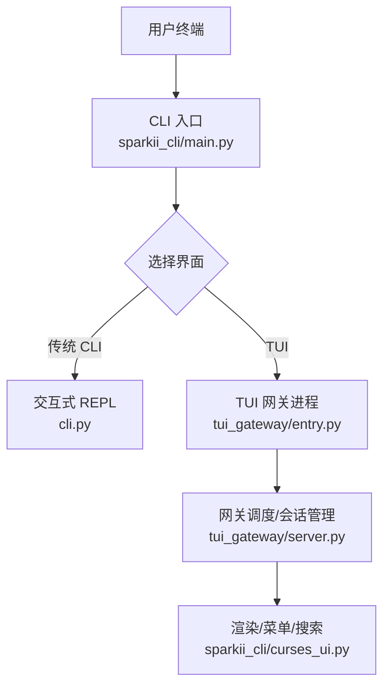
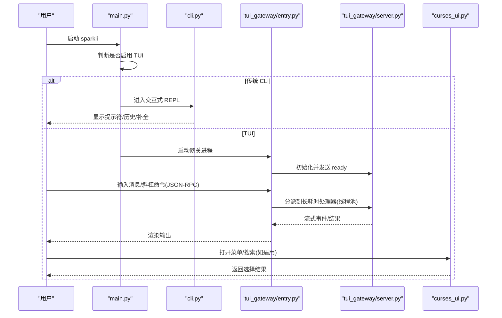
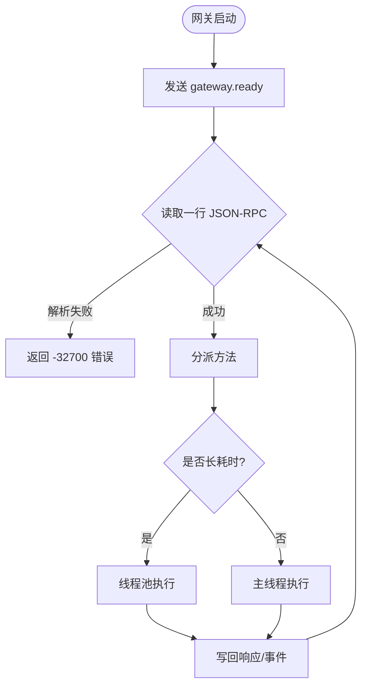
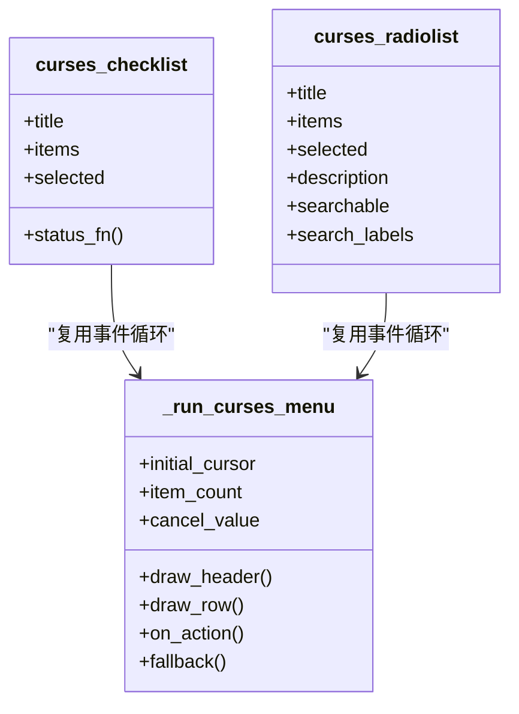
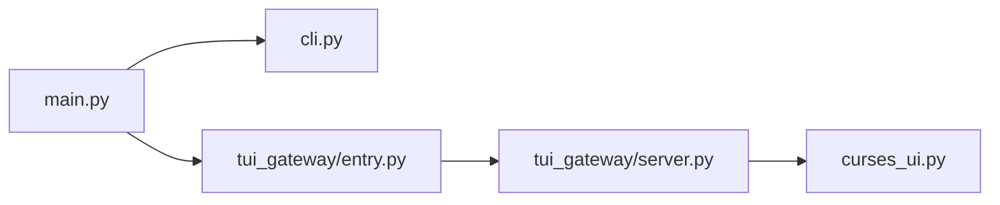

# 交互模式操作

<cite>
**本文引用的文件**
- [sparkii_cli/main.py](file://sparkii_cli/main.py)
- [cli.py](file://cli.py)
- [tui_gateway/entry.py](file://tui_gateway/entry.py)
- [tui_gateway/server.py](file://tui_gateway/server.py)
- [sparkii_cli/curses_ui.py](file://sparkii_cli/curses_ui.py)
</cite>

## 目录
1. [简介](#简介)
2. [项目结构](#项目结构)
3. [核心组件](#核心组件)
4. [架构总览](#架构总览)
5. [详细组件分析](#详细组件分析)
6. [依赖关系分析](#依赖关系分析)
7. [性能注意事项](#性能注意事项)
8. [故障排除指南](#故障排除指南)
9. [结论](#结论)
10. [附录](#附录)

## 简介
本指南面向使用“交互模式”的用户与集成者，覆盖以下主题：
- CLI 终端界面快捷键与操作方式
- 聊天模式下消息输入、命令执行、结果查看等操作流程
- TUI（文本用户界面）与传统 CLI 模式的区别及切换方法
- 高级交互技巧：批量操作、脚本集成、自动化流程
- 界面定制与个性化设置
- 错误处理与调试信息查看
- 常见问题与故障排除

## 项目结构
交互模式由“命令行入口 + 可选 TUI 网关 + 渲染/菜单组件”构成。启动时根据环境或参数决定进入传统 CLI 还是 TUI；TUI 通过 JSON-RPC 与后端服务通信，支持流式输出与斜杠命令。

图示来源
- [sparkii_cli/main.py:311-338](file://sparkii_cli/main.py#L311-L338)
- [cli.py:59-90](file://cli.py#L59-L90)
- [tui_gateway/entry.py:421-487](file://tui_gateway/entry.py#L421-L487)
- [tui_gateway/server.py:184-200](file://tui_gateway/server.py#L184-L200)
- [sparkii_cli/curses_ui.py:446-624](file://sparkii_cli/curses_ui.py#L446-L624)

章节来源
- [sparkii_cli/main.py:311-338](file://sparkii_cli/main.py#L311-L338)
- [tui_gateway/entry.py:421-487](file://tui_gateway/entry.py#L421-L487)

## 核心组件
- CLI 入口与界面选择：负责早期判断是否启用 TUI，并路由到对应模式。
- 传统 CLI 交互：基于 prompt_toolkit 的固定输入区 TUI，提供历史、补全、快捷键绑定。
- TUI 网关：独立进程，接收 JSON-RPC 请求，分派到长耗时处理器，维护会话与流式输出。
- 菜单与筛选：curses 多选/单选列表，支持模糊搜索与键盘导航。

章节来源
- [sparkii_cli/main.py:311-338](file://sparkii_cli/main.py#L311-L338)
- [cli.py:59-90](file://cli.py#L59-L90)
- [tui_gateway/server.py:184-200](file://tui_gateway/server.py#L184-L200)
- [sparkii_cli/curses_ui.py:446-624](file://sparkii_cli/curses_ui.py#L446-L624)

## 架构总览
下图展示从启动到交互的关键路径，包括 TUI 与 CLI 的分流、网关的长任务分流以及渲染层。

图示来源
- [sparkii_cli/main.py:311-338](file://sparkii_cli/main.py#L311-L338)
- [tui_gateway/entry.py:421-487](file://tui_gateway/entry.py#L421-L487)
- [tui_gateway/server.py:184-200](file://tui_gateway/server.py#L184-L200)
- [sparkii_cli/curses_ui.py:446-624](file://sparkii_cli/curses_ui.py#L446-L624)

## 详细组件分析

### 界面选择与模式切换（CLI vs TUI）
- 决策优先级：显式 --cli 强制 CLI；显式 --tui 或环境变量启用 TUI；非交互式终端自动回退 CLI；配置文件中的 display.interface 可设默认值。
- 鼠标残留抑制：在导入阶段提前关闭鼠标追踪，避免启动期乱码。
- 快速版本与恢复：支持极速版本查询与中断安装恢复，保证启动鲁棒性。

章节来源
- [sparkii_cli/main.py:311-338](file://sparkii_cli/main.py#L311-L338)
- [sparkii_cli/main.py:341-371](file://sparkii_cli/main.py#L341-L371)
- [sparkii_cli/main.py:76-102](file://sparkii_cli/main.py#L76-L102)

### 传统 CLI 交互（prompt_toolkit）
- 输入区域：固定高度输入框，支持多行编辑、历史记录、补全菜单。
- 快捷键：方向键移动光标、Ctrl+Enter 换行、Shift+Enter 提交、Backspace 删除、Tab 触发补全等（具体以运行时提示为准）。
- 输出：富文本/ANSI 高亮，支持表格与代码块渲染。

章节来源
- [cli.py:59-90](file://cli.py#L59-L90)

### TUI 网关（JSON-RPC 与服务端）
- 启动流程：写入 ready 事件、预热模型选择缓存、监听 stdin 读取 JSON-RPC。
- 长耗时处理：将慢操作（如 exec、resume、compress、skills.manage 等）放入线程池，避免阻塞主循环。
- 信号与退出：捕获 SIGTERM/SIGHUP/SIGINT 等，记录堆栈并优雅关闭会话，必要时硬退出防止死锁。
- 侧车发布：可选将事件镜像到 Dashboard WebSocket。

图示来源
- [tui_gateway/entry.py:421-487](file://tui_gateway/entry.py#L421-L487)
- [tui_gateway/server.py:184-200](file://tui_gateway/server.py#L184-L200)

章节来源
- [tui_gateway/entry.py:48-172](file://tui_gateway/entry.py#L48-L172)
- [tui_gateway/entry.py:233-253](file://tui_gateway/entry.py#L233-L253)
- [tui_gateway/server.py:184-200](file://tui_gateway/server.py#L184-L200)

### 菜单与搜索（curses）
- 多选/单选：统一的事件循环，支持滚动、状态栏、颜色对。
- 键盘导航：上下移动、空格切换、回车确认、ESC/q 取消。
- 搜索：按 / 进入搜索模式，支持模糊匹配与多词 AND 逻辑；无匹配时提示“No matches”。
- 兼容性：非 TTY 或 curses 不可用时回退为编号列表。

图示来源
- [sparkii_cli/curses_ui.py:446-624](file://sparkii_cli/curses_ui.py#L446-L624)
- [sparkii_cli/curses_ui.py:627-715](file://sparkii_cli/curses_ui.py#L627-L715)
- [sparkii_cli/curses_ui.py:718-800](file://sparkii_cli/curses_ui.py#L718-L800)

章节来源
- [sparkii_cli/curses_ui.py:302-337](file://sparkii_cli/curses_ui.py#L302-L337)
- [sparkii_cli/curses_ui.py:372-438](file://sparkii_cli/curses_ui.py#L372-L438)
- [sparkii_cli/curses_ui.py:446-624](file://sparkii_cli/curses_ui.py#L446-L624)

### 聊天模式下的常用操作
- 消息输入：在 CLI/TUI 输入框中键入自然语言或指令，回车发送；支持多行输入与历史回溯。
- 命令执行：使用斜杠命令（如 /model、/tools、/sessions 等），由网关分派到对应处理器；长耗时命令不会阻塞其他交互。
- 结果查看：流式输出逐步刷新；支持展开/折叠详情（思考过程、工具调用、子代理、活动日志等）。
- 批量操作：通过会话列表、技能管理等命令进行批量配置或执行；结合脚本化调用实现自动化。

章节来源
- [tui_gateway/server.py:184-200](file://tui_gateway/server.py#L184-L200)

### 高级交互技巧
- 批量操作：利用会话浏览、技能管理、模型选择等命令组合完成批量任务。
- 脚本集成：通过 JSON-RPC 协议与 TUI 网关交互，或在 CI/管道中以非交互模式运行一次性任务。
- 自动化流程：结合 cron、工作流与外部系统，将聊天能力编排进端到端流水线。

章节来源
- [tui_gateway/entry.py:421-487](file://tui_gateway/entry.py#L421-L487)

### 界面定制与个性化设置
- 皮肤与显示：可通过配置项调整皮肤、紧凑模式、流式输出开关、持久化输出行数等。
- 行为偏好：压缩阈值、最大轮次、忙时输入模式、是否显示推理过程等。
- 环境变量：部分行为可通过环境变量覆盖（例如超时、IPv4 优先、重定向敏感信息等）。

章节来源
- [cli.py:439-521](file://cli.py#L439-L521)

### 错误处理与调试信息
- 崩溃日志：网关未处理异常会写入本地日志文件，并在 stderr 输出一行摘要，便于快速定位。
- 信号处理：捕获终止信号并记录线程堆栈，确保会话数据尽可能落盘。
- 退出原因：网关退出时会记录原因（如管道断开、解析失败等），辅助排查。

章节来源
- [tui_gateway/server.py:62-132](file://tui_gateway/server.py#L62-L132)
- [tui_gateway/entry.py:89-172](file://tui_gateway/entry.py#L89-L172)
- [tui_gateway/entry.py:233-253](file://tui_gateway/entry.py#L233-L253)

## 依赖关系分析
- main.py 负责早期界面选择与启动优化，决定进入 cli.py 或 tui_gateway。
- cli.py 提供 prompt_toolkit 驱动的交互体验。
- tui_gateway/entry.py 作为网关进程，负责 JSON-RPC 收发与生命周期管理。
- tui_gateway/server.py 负责方法分派、会话管理与长耗时任务隔离。
- curses_ui.py 提供跨平台一致的菜单与搜索体验。

图示来源
- [sparkii_cli/main.py:311-338](file://sparkii_cli/main.py#L311-L338)
- [cli.py:59-90](file://cli.py#L59-L90)
- [tui_gateway/entry.py:421-487](file://tui_gateway/entry.py#L421-L487)
- [tui_gateway/server.py:184-200](file://tui_gateway/server.py#L184-L200)
- [sparkii_cli/curses_ui.py:446-624](file://sparkii_cli/curses_ui.py#L446-L624)

章节来源
- [sparkii_cli/main.py:311-338](file://sparkii_cli/main.py#L311-L338)
- [tui_gateway/entry.py:421-487](file://tui_gateway/entry.py#L421-L487)

## 性能注意事项
- 长耗时命令分流：避免阻塞主循环，提升交互响应速度。
- 启动预热：在空闲窗口预取模型列表缓存，减少首次打开延迟。
- 鼠标残留抑制：启动前关闭鼠标追踪，避免启动期乱码与额外开销。
- 非 TTY 快速回退：在非交互式环境中直接返回取消值，避免挂起。

章节来源
- [tui_gateway/server.py:184-200](file://tui_gateway/server.py#L184-L200)
- [tui_gateway/entry.py:446-458](file://tui_gateway/entry.py#L446-L458)
- [sparkii_cli/main.py:341-371](file://sparkii_cli/main.py#L341-L371)
- [sparkii_cli/curses_ui.py:498-502](file://sparkii_cli/curses_ui.py#L498-L502)

## 故障排除指南
- 无法进入 TUI：检查是否处于非交互式终端或被显式 --cli 强制；确认 display.interface 配置与环境变量。
- 菜单无响应：确认终端支持 curses；若不支持将回退为编号列表。
- 网关频繁退出：查看崩溃日志与退出原因；关注 SIGPIPE/SIGTERM 等信号处理。
- 命令卡顿：识别是否为长耗时命令；可在后台执行或通过批处理方式处理。
- 输出乱码：确认 UTF-8 环境与终端编码；必要时禁用鼠标追踪或调整终端类型。

章节来源
- [sparkii_cli/main.py:311-338](file://sparkii_cli/main.py#L311-L338)
- [sparkii_cli/curses_ui.py:498-502](file://sparkii_cli/curses_ui.py#L498-L502)
- [tui_gateway/server.py:62-132](file://tui_gateway/server.py#L62-L132)
- [tui_gateway/entry.py:89-172](file://tui_gateway/entry.py#L89-L172)

## 结论
本项目提供了灵活的交互模式：传统 CLI 适合脚本化与轻量场景；TUI 提供更丰富的可视化与流式体验。通过合理的命令分流、启动优化与完善的错误处理，能够在多种环境下稳定高效地工作。建议根据实际场景选择合适的界面与配置，并结合批量与自动化能力提升效率。

## 附录
- 快捷键速查（常见）：
  - 上下移动：↑/↓ 或 k/j
  - 选择/切换：空格
  - 确认：回车
  - 取消：ESC 或 q
  - 搜索：/
  - 清空搜索：Ctrl+U
  - 多行输入：Shift+Enter
  - 提交：Ctrl+Enter
- 相关配置项（示例）：
  - 显示：compact、streaming、show_reasoning、skin
  - 代理：max_turns、system_prompt
  - 终端：env_type、cwd、lifetime_seconds、docker_image
  - 浏览器：inactivity_timeout、record_sessions
  - 压缩：enabled、threshold、min_tail_user_messages

章节来源
- [sparkii_cli/curses_ui.py:372-438](file://sparkii_cli/curses_ui.py#L372-L438)
- [cli.py:439-521](file://cli.py#L439-L521)