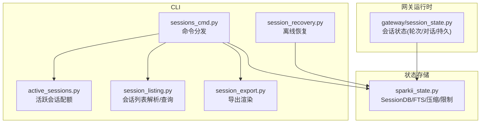
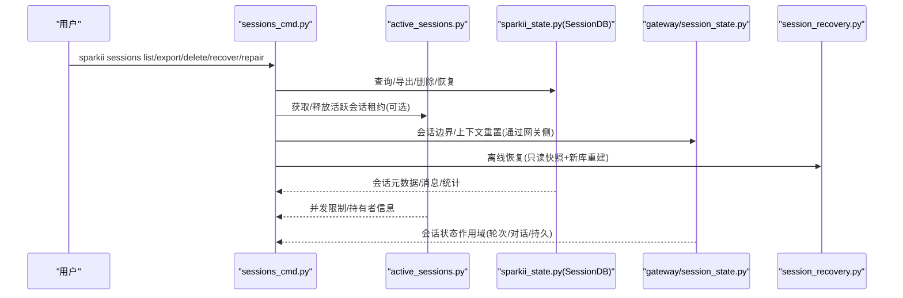
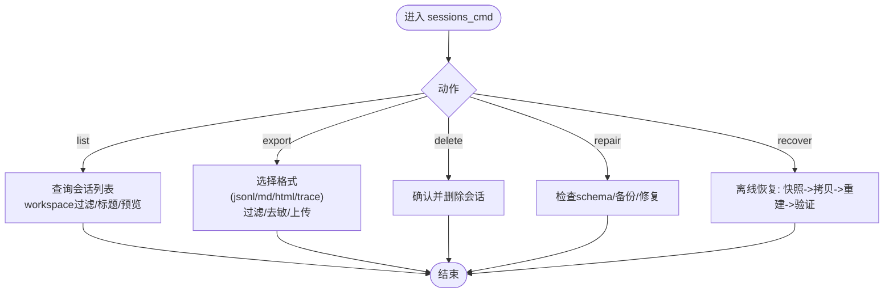
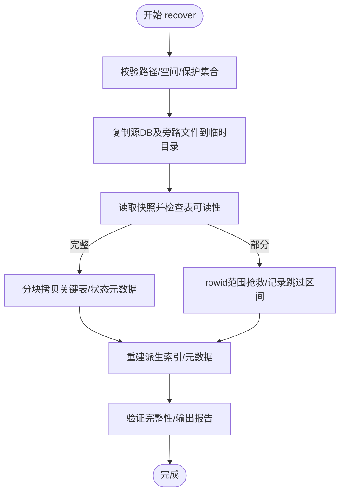
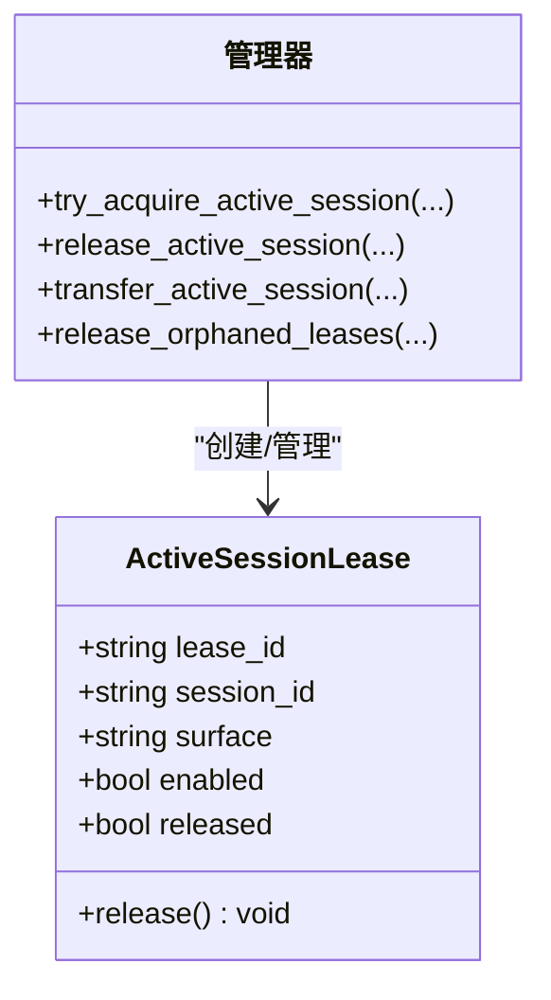
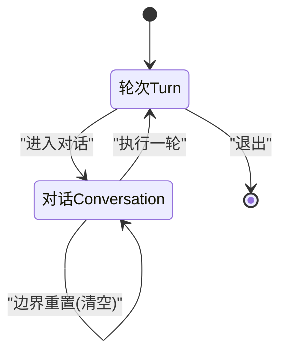
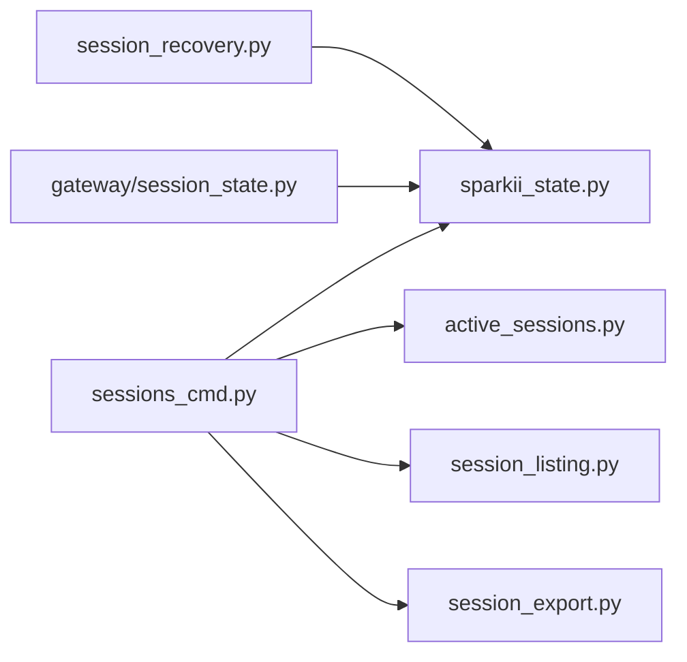

# 会话管理

<cite>
**本文引用的文件**
- [sparkii_cli/sessions_cmd.py](file://sparkii_cli/sessions_cmd.py)
- [sparkii_cli/session_recovery.py](file://sparkii_cli/session_recovery.py)
- [sparkii_cli/active_sessions.py](file://sparkii_cli/active_sessions.py)
- [sparkii_cli/session_listing.py](file://sparkii_cli/session_listing.py)
- [sparkii_cli/session_export.py](file://sparkii_cli/session_export.py)
- [sparkii_state.py](file://sparkii_state.py)
- [gateway/session_state.py](file://gateway/session_state.py)
</cite>

## 目录
1. [简介](#简介)
2. [项目结构](#项目结构)
3. [核心组件](#核心组件)
4. [架构总览](#架构总览)
5. [详细组件分析](#详细组件分析)
6. [依赖关系分析](#依赖关系分析)
7. [性能考虑](#性能考虑)
8. [故障排查指南](#故障排查指南)
9. [结论](#结论)
10. [附录](#附录)

## 简介
本文件系统性说明 Sparkii（Hermes）的会话管理能力，覆盖多会话创建、切换、恢复与清理；详解 sparkii sessions 命令族（列表、导出、修复、恢复、删除等）；解释会话状态持久化机制与上下文保持原理；给出多会话工作流最佳实践（项目隔离、任务分离）；提供会话数据备份与恢复方法；并说明会话与配置文件的关系，以及如何通过会话实现不同工作环境与配置。

## 项目结构
围绕“会话管理”的关键代码分布在 CLI 层、状态存储层与网关运行时层：
- CLI 层：提供用户可见的命令入口与交互流程（sessions_cmd、session_recovery、active_sessions、session_listing、session_export）。
- 状态存储层：SQLite 持久化会话元数据、消息历史、模型配置与搜索索引（sparkii_state）。
- 网关运行时层：维护会话级运行态（turn/conversation/persistent），协调跨进程活跃会话配额与会话边界重置（gateway/session_state）。

**图表来源**
- [sparkii_cli/sessions_cmd.py:58-120](file://sparkii_cli/sessions_cmd.py#L58-L120)
- [sparkii_cli/session_recovery.py:1-11](file://sparkii_cli/session_recovery.py#L1-L11)
- [sparkii_cli/active_sessions.py:271-334](file://sparkii_cli/active_sessions.py#L271-L334)
- [sparkii_cli/session_listing.py:45-88](file://sparkii_cli/session_listing.py#L45-L88)
- [sparkii_cli/session_export.py:41-60](file://sparkii_cli/session_export.py#L41-L60)
- [sparkii_state.py:1-15](file://sparkii_state.py#L1-L15)
- [gateway/session_state.py:1-34](file://gateway/session_state.py#L1-L34)

**章节来源**
- [sparkii_cli/sessions_cmd.py:58-120](file://sparkii_cli/sessions_cmd.py#L58-L120)
- [sparkii_cli/session_recovery.py:1-11](file://sparkii_cli/session_recovery.py#L1-L11)
- [sparkii_cli/active_sessions.py:271-334](file://sparkii_cli/active_sessions.py#L271-L334)
- [sparkii_cli/session_listing.py:45-88](file://sparkii_cli/session_listing.py#L45-L88)
- [sparkii_cli/session_export.py:41-60](file://sparkii_cli/session_export.py#L41-L60)
- [sparkii_state.py:1-15](file://sparkii_state.py#L1-L15)
- [gateway/session_state.py:1-34](file://gateway/session_state.py#L1-L34)

## 核心组件
- 会话数据库 SessionDB（sparkii_state.py）：基于 SQLite+WAL，提供会话元数据、消息历史、FTS5 全文检索、压缩拆分链、导出/恢复接口与安全限制（最大可恢复/导出消息数）。
- 活跃会话配额（active_sessions.py）：跨进程记录当前打开的聊天表面（CLI/TUI/Gateway），支持并发上限控制、租约获取/释放/转移与僵尸清理。
- 会话列表与过滤（session_listing.py）：统一解析 /sessions 参数、按源/标题/搜索过滤、排除未命名会话、限制返回条数。
- 会话导出（session_export.py）：将会话渲染为 JSONL/Markdown/QMD，支持仅导出用户提示、统计计数、时间戳标准化。
- 离线恢复（session_recovery.py）：非破坏性复制源数据库到临时工作目录，校验表结构与可读性，分块拷贝关键表，重建派生索引，输出验证报告。
- 会话状态（gateway/session_state.py）：以 TurnState/ConversationState/PersistentState 三层次组织会话运行期状态，明确生命周期与作用域。

**章节来源**
- [sparkii_state.py:1-15](file://sparkii_state.py#L1-L15)
- [sparkii_state.py:87-125](file://sparkii_state.py#L87-L125)
- [sparkii_cli/active_sessions.py:271-334](file://sparkii_cli/active_sessions.py#L271-L334)
- [sparkii_cli/session_listing.py:45-88](file://sparkii_cli/session_listing.py#L45-L88)
- [sparkii_cli/session_export.py:41-60](file://sparkii_cli/session_export.py#L41-L60)
- [sparkii_cli/session_recovery.py:1-11](file://sparkii_cli/session_recovery.py#L1-L11)
- [gateway/session_state.py:51-178](file://gateway/session_state.py#L51-L178)

## 架构总览
下图展示从 CLI 命令到状态存储与网关运行时的调用关系，以及离线恢复的安全路径。

**图表来源**
- [sparkii_cli/sessions_cmd.py:58-120](file://sparkii_cli/sessions_cmd.py#L58-L120)
- [sparkii_cli/active_sessions.py:271-334](file://sparkii_cli/active_sessions.py#L271-L334)
- [sparkii_cli/session_recovery.py:357-378](file://sparkii_cli/session_recovery.py#L357-L378)
- [gateway/session_state.py:51-178](file://gateway/session_state.py#L51-L178)

## 详细组件分析

### 会话命令：sparkii sessions
- 列表（list）：默认隐藏第三方工具会话，可按 workspace 过滤，显示标题/预览/最近活跃/ID。
- 导出（export）：支持 jsonl/markdown/html/trace 等格式；支持 --only user-prompts、--dry-run、--redact、--upload；批量导出需至少一个过滤条件。
- 删除（delete）：确认式删除会话及其消息。
- 修复（repair）：检查并修复状态数据库 schema，必要时生成备份并引导离线恢复。
- 恢复（recover）：非破坏性离线恢复，支持 --inspect-only、--allow-partial、进度回调与报告输出。

**图表来源**
- [sparkii_cli/sessions_cmd.py:58-120](file://sparkii_cli/sessions_cmd.py#L58-L120)
- [sparkii_cli/sessions_cmd.py:239-312](file://sparkii_cli/sessions_cmd.py#L239-L312)
- [sparkii_cli/sessions_cmd.py:313-778](file://sparkii_cli/sessions_cmd.py#L313-L778)
- [sparkii_cli/sessions_cmd.py:780-800](file://sparkii_cli/sessions_cmd.py#L780-L800)

**章节来源**
- [sparkii_cli/sessions_cmd.py:58-120](file://sparkii_cli/sessions_cmd.py#L58-L120)
- [sparkii_cli/sessions_cmd.py:239-312](file://sparkii_cli/sessions_cmd.py#L239-L312)
- [sparkii_cli/sessions_cmd.py:313-778](file://sparkii_cli/sessions_cmd.py#L313-L778)
- [sparkii_cli/sessions_cmd.py:780-800](file://sparkii_cli/sessions_cmd.py#L780-L800)

### 会话恢复：离线、安全、可验证
- 安全前置：不直接打开源数据库，先复制到临时工作目录；校验磁盘空间、避免覆盖源或 WAL/SHM/Journal 旁路文件。
- 可观测性：逐表拷贝进度回调；对损坏页采用 rowid 范围二分抢救；跳过不可读范围并记录。
- 结果验证：重建派生 FTS 与迁移元数据；输出 JSON 报告，支持部分恢复模式。

**图表来源**
- [sparkii_cli/session_recovery.py:91-128](file://sparkii_cli/session_recovery.py#L91-L128)
- [sparkii_cli/session_recovery.py:164-237](file://sparkii_cli/session_recovery.py#L164-L237)
- [sparkii_cli/session_recovery.py:240-270](file://sparkii_cli/session_recovery.py#L240-L270)
- [sparkii_cli/session_recovery.py:357-378](file://sparkii_cli/session_recovery.py#L357-L378)
- [sparkii_cli/session_recovery.py:380-445](file://sparkii_cli/session_recovery.py#L380-L445)
- [sparkii_cli/session_recovery.py:508-663](file://sparkii_cli/session_recovery.py#L508-L663)

**章节来源**
- [sparkii_cli/session_recovery.py:1-11](file://sparkii_cli/session_recovery.py#L1-L11)
- [sparkii_cli/session_recovery.py:91-128](file://sparkii_cli/session_recovery.py#L91-L128)
- [sparkii_cli/session_recovery.py:164-237](file://sparkii_cli/session_recovery.py#L164-L237)
- [sparkii_cli/session_recovery.py:240-270](file://sparkii_cli/session_recovery.py#L240-L270)
- [sparkii_cli/session_recovery.py:357-378](file://sparkii_cli/session_recovery.py#L357-L378)
- [sparkii_cli/session_recovery.py:380-445](file://sparkii_cli/session_recovery.py#L380-L445)
- [sparkii_cli/session_recovery.py:508-663](file://sparkii_cli/session_recovery.py#L508-L663)

### 活跃会话与并发控制
- 租约模型：每个会话可获取一个 ActiveSessionLease，包含 session_id、surface、pid、started_at 等。
- 并发上限：通过 max_concurrent_sessions 配置限制；达到上限时拒绝新请求并提示占用方。
- 清理策略：基于进程存活检测与 PID 启动时间比对，回收僵尸租约；支持显式释放与转移。

**图表来源**
- [sparkii_cli/active_sessions.py:257-334](file://sparkii_cli/active_sessions.py#L257-L334)
- [sparkii_cli/active_sessions.py:337-427](file://sparkii_cli/active_sessions.py#L337-L427)

**章节来源**
- [sparkii_cli/active_sessions.py:271-334](file://sparkii_cli/active_sessions.py#L271-L334)
- [sparkii_cli/active_sessions.py:337-427](file://sparkii_cli/active_sessions.py#L337-L427)

### 会话列表与过滤
- 参数解析：支持 list/browse/all/full/search/find 等关键字，自动区分目标与查询。
- 查询策略：默认按 source 限定，排除未命名会话；支持搜索匹配标题/ID；限制返回条数并排序。
- 格式化：为网关消息平台提供紧凑 Markdown 风格列表。

**章节来源**
- [sparkii_cli/session_listing.py:8-42](file://sparkii_cli/session_listing.py#L8-L42)
- [sparkii_cli/session_listing.py:45-88](file://sparkii_cli/session_listing.py#L45-L88)
- [sparkii_cli/session_listing.py:91-118](file://sparkii_cli/session_listing.py#L91-L118)

### 会话导出与归档
- 格式：JSONL（单行对象）、Markdown/QMD（人类可读）、HTML（自包含）、Trace（JSONL 追踪，支持上传）。
- 过滤：支持 only=user-prompts 仅导出用户提示；支持 dry-run 预览；支持 redact 脱敏。
- 清单：Markdown 导出附带 manifest 条目，便于后续审计与回溯。

**章节来源**
- [sparkii_cli/session_export.py:21-60](file://sparkii_cli/session_export.py#L21-L60)
- [sparkii_cli/session_export.py:74-118](file://sparkii_cli/session_export.py#L74-L118)
- [sparkii_cli/session_export.py:120-178](file://sparkii_cli/session_export.py#L120-L178)
- [sparkii_cli/session_export.py:181-287](file://sparkii_cli/session_export.py#L181-L287)

### 会话状态与上下文保持
- 三层作用域：
  - TurnState：单次运行轮次状态（agent、busy_ack、lease token），每轮结束清空。
  - ConversationState：对话级状态（模型/推理/服务等级覆盖、队列事件、侧车备注、语音上下文等），在对话边界（/new、/resume、压缩耗尽重置等）清空。
  - PersistentState：长生命周期状态（审批、待处理指令、原生图片路径、运行代数、健康检查失败次数等），不受常规边界重置影响。
- 会话边界：通过网关侧逻辑在 /new、/resume、压缩/过期等场景触发 ConversationState.clear()，确保上下文隔离。

**图表来源**
- [gateway/session_state.py:51-178](file://gateway/session_state.py#L51-L178)

**章节来源**
- [gateway/session_state.py:51-178](file://gateway/session_state.py#L51-L178)

## 依赖关系分析
- CLI 层依赖 sparkii_state.SessionDB 进行会话读写；依赖 active_sessions 进行并发控制；依赖 session_listing 解析参数与查询；依赖 session_export 渲染输出。
- 离线恢复依赖 sparkii_state 常量与 Schema，但不直接打开源数据库，而是通过临时副本与 sqlite3 连接进行只读扫描与写入新库。
- 网关运行时通过 SessionState 管理会话上下文，并在边界处与持久化层交互（如新建会话、恢复会话）。

**图表来源**
- [sparkii_cli/sessions_cmd.py:58-120](file://sparkii_cli/sessions_cmd.py#L58-L120)
- [sparkii_cli/session_recovery.py:23-28](file://sparkii_cli/session_recovery.py#L23-L28)
- [gateway/session_state.py:1-34](file://gateway/session_state.py#L1-L34)

**章节来源**
- [sparkii_cli/sessions_cmd.py:58-120](file://sparkii_cli/sessions_cmd.py#L58-L120)
- [sparkii_cli/session_recovery.py:23-28](file://sparkii_cli/session_recovery.py#L23-L28)
- [gateway/session_state.py:1-34](file://gateway/session_state.py#L1-L34)

## 性能考虑
- 会话数据库使用 WAL 模式提升并发读取能力，适合 Gateway 多平台并发访问。
- FTS5 全文检索加速跨会话消息搜索，但需注意重建与维护成本。
- 导出与恢复采用分块拷贝与进度回调，降低内存峰值并提升可观测性。
- 活跃会话配额避免资源争用，防止过多并发导致系统过载。
- 会话压缩与拆分通过 parent_session_id 链管理，控制上下文大小与恢复成本。

[本节为通用指导，无需具体文件引用]

## 故障排查指南
- 数据库无法打开：优先使用 repair 检查 schema，若失败则使用 recover 进行离线恢复，并查看 JSON 报告定位问题表与跳过范围。
- 恢复失败或数据不完整：启用 --allow-partial 进行部分恢复，结合 inspect-only 评估可恢复性；检查磁盘空间与工作目录权限。
- 并发限制被拒绝：检查 max_concurrent_sessions 配置与当前活跃会话持有者，等待空闲或释放租约。
- 会话列表为空或不符合预期：确认 source 过滤、是否包含未命名会话、搜索关键词与 limit 设置。
- 导出内容异常：核对格式与过滤参数，必要时启用 redact 或仅导出用户提示以缩小范围。

**章节来源**
- [sparkii_cli/sessions_cmd.py:67-120](file://sparkii_cli/sessions_cmd.py#L67-L120)
- [sparkii_cli/sessions_cmd.py:122-225](file://sparkii_cli/sessions_cmd.py#L122-L225)
- [sparkii_cli/active_sessions.py:99-114](file://sparkii_cli/active_sessions.py#L99-L114)
- [sparkii_cli/session_listing.py:45-88](file://sparkii_cli/session_listing.py#L45-L88)
- [sparkii_cli/session_export.py:21-60](file://sparkii_cli/session_export.py#L21-L60)

## 结论
Sparkii 的会话管理以 SQLite 为核心，结合 CLI 命令、活跃会话配额与网关会话状态，提供了健壮的创建、切换、恢复与清理能力。通过离线恢复与严格的安全前置，保障数据完整性；通过导出与过滤，满足审计与复用需求。建议在生产环境中合理配置并发上限、定期导出与备份，并结合项目隔离与任务分离的最佳实践，最大化多会话协作效率。

[本节为总结，无需具体文件引用]

## 附录

### 多会话工作流最佳实践
- 项目隔离：为不同项目使用不同的 source/workspace 标签，便于列表过滤与审计。
- 任务分离：将复杂任务拆分为多个短会话，减少上下文膨胀与恢复成本。
- 会话命名：为会话设置标题，提高列表可读性与检索效率。
- 定期导出：对重要会话导出 Markdown/HTML/Trace，便于归档与分享。
- 并发控制：根据环境资源调整 max_concurrent_sessions，避免资源争用。

[本节为通用指导，无需具体文件引用]

### 会话数据备份与恢复方法
- 备份：使用 export 命令导出 JSONL/Markdown/HTML；或使用 recover --inspect-only 评估可恢复性。
- 恢复：使用 recover 命令将损坏数据库恢复到新库，审阅报告后替换或迁移。
- 修复：使用 repair 尝试修复 schema；若失败，走离线恢复路径。

**章节来源**
- [sparkii_cli/sessions_cmd.py:67-120](file://sparkii_cli/sessions_cmd.py#L67-L120)
- [sparkii_cli/sessions_cmd.py:122-225](file://sparkii_cli/sessions_cmd.py#L122-L225)
- [sparkii_cli/session_recovery.py:357-378](file://sparkii_cli/session_recovery.py#L357-L378)

### 会话与配置文件的关系
- 会话限制：通过 sessions.max_resume_messages 与 sessions.max_export_messages 控制安全阈值。
- 并发上限：通过 max_concurrent_sessions（或 gateway.max_concurrent_sessions）控制活跃会话数量。
- 工作区绑定：会话可通过 workspace_key 关联 Git 仓库根或当前工作目录，便于按项目筛选。

**章节来源**
- [sparkii_state.py:91-125](file://sparkii_state.py#L91-L125)
- [sparkii_cli/active_sessions.py:24-70](file://sparkii_cli/active_sessions.py#L24-L70)
- [sparkii_cli/sessions_cmd.py:246-258](file://sparkii_cli/sessions_cmd.py#L246-L258)