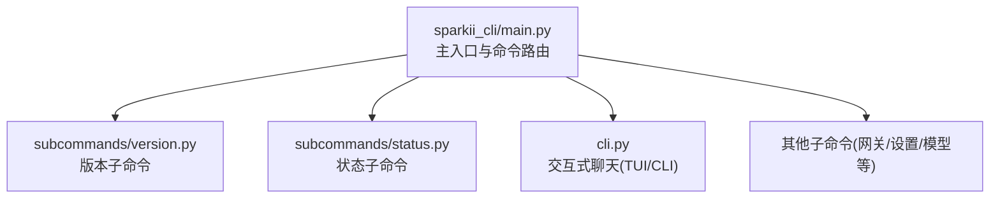
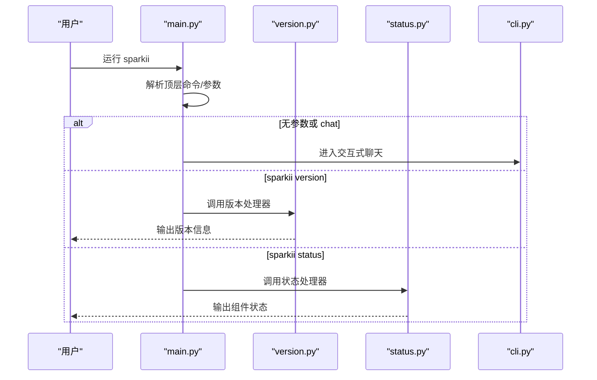
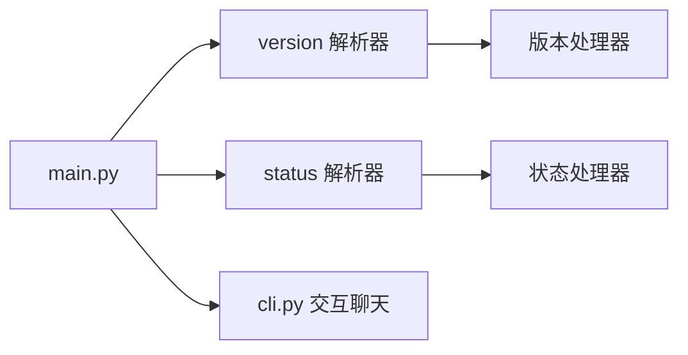

# 基本命令使用

<cite>
**本文引用的文件**
- [sparkii_cli/main.py](file://sparkii_cli/main.py)
- [sparkii_cli/subcommands/version.py](file://sparkii_cli/subcommands/version.py)
- [sparkii_cli/subcommands/status.py](file://sparkii_cli/subcommands/status.py)
- [cli.py](file://cli.py)
</cite>

## 目录
1. [简介](#简介)
2. [项目结构](#项目结构)
3. [核心组件](#核心组件)
4. [架构总览](#架构总览)
5. [详细组件分析](#详细组件分析)
6. [依赖关系分析](#依赖关系分析)
7. [性能注意事项](#性能注意事项)
8. [故障排查指南](#故障排查指南)
9. [结论](#结论)
10. [附录：常用命令速查与示例](#附录：常用命令速查与示例)

## 简介
本章节面向初学者，系统说明 Sparkii CLI 的基本命令使用方法，重点覆盖以下命令：
- sparkii chat：启动交互式聊天模式（默认行为）
- sparkii version：查看版本信息
- sparkii status：检查系统/组件状态

文档将解释每个命令的功能、参数选项、使用场景，并给出常见用法示例。同时说明命令行参数的优先级与覆盖规则，帮助你快速上手并高效使用。

## 项目结构
Sparkii CLI 的入口在 main.py，负责解析顶层命令与子命令、加载配置与环境、选择 TUI/CLI 界面以及调度具体子命令处理器。version 与 status 等子命令通过独立的 subcommands 模块注册到主解析器中；交互式聊天模式由 cli.py 提供。

图表来源
- [sparkii_cli/main.py:439-485](file://sparkii_cli/main.py#L439-L485)
- [sparkii_cli/subcommands/version.py:12-18](file://sparkii_cli/subcommands/version.py#L12-L18)
- [sparkii_cli/subcommands/status.py:12-28](file://sparkii_cli/subcommands/status.py#L12-L28)

章节来源
- [sparkii_cli/main.py:439-485](file://sparkii_cli/main.py#L439-L485)
- [sparkii_cli/subcommands/version.py:12-18](file://sparkii_cli/subcommands/version.py#L12-L18)
- [sparkii_cli/subcommands/status.py:12-28](file://sparkii_cli/subcommands/status.py#L12-L28)

## 核心组件
- 命令入口与路由：main.py 负责解析顶层命令，挂载各子命令解析器，并在需要时进入交互模式或调用子命令处理器。
- 版本命令：subcommands/version.py 定义 sparkii version 的解析器与处理器绑定。
- 状态命令：subcommands/status.py 定义 sparkii status 的解析器与处理器绑定，支持 --all 与 --deep 等选项。
- 交互聊天：cli.py 提供基于 prompt_toolkit 的交互式终端界面，支持工具集、技能、会话管理等。

章节来源
- [sparkii_cli/main.py:439-485](file://sparkii_cli/main.py#L439-L485)
- [sparkii_cli/subcommands/version.py:12-18](file://sparkii_cli/subcommands/version.py#L12-L18)
- [sparkii_cli/subcommands/status.py:12-28](file://sparkii_cli/subcommands/status.py#L12-L28)
- [cli.py:1-13](file://cli.py#L1-L13)

## 架构总览
下图展示了从命令行到具体处理的流程：用户输入 sparkii <command>，main.py 解析后分发到对应子命令或进入交互模式。

图表来源
- [sparkii_cli/main.py:439-485](file://sparkii_cli/main.py#L439-L485)
- [sparkii_cli/subcommands/version.py:12-18](file://sparkii_cli/subcommands/version.py#L12-L18)
- [sparkii_cli/subcommands/status.py:12-28](file://sparkii_cli/subcommands/status.py#L12-L28)
- [cli.py:1-13](file://cli.py#L1-L13)

## 详细组件分析

### 命令：sparkii chat（交互式聊天）
- 功能：启动交互式聊天模式，支持对话、工具调用、会话管理、模型切换等。
- 启动方式：
  - 直接运行 sparkii（默认进入交互模式）
  - 显式运行 sparkii chat
- 关键特性：
  - 自动检测是否适合 TUI（终端能力），必要时回退到 CLI 模式
  - 支持通过配置与环境变量控制行为（如显示、压缩、代理等）
  - 可结合 --model、--provider、--toolsets、--resume、--skills、--usage-file、--in、--continue 等参数进行一次性或会话级控制
- 典型用法示例：
  - 启动对话：sparkii
  - 指定模型与工具集：sparkii chat --model <模型名> --toolsets web,terminal
  - 继续上次会话：sparkii chat --resume
  - 仅执行一次提示：sparkii --oneshot "你的问题"

章节来源
- [sparkii_cli/main.py:1-44](file://sparkii_cli/main.py#L1-L44)
- [sparkii_cli/main.py:311-338](file://sparkii_cli/main.py#L311-L338)
- [sparkii_cli/main.py:519-693](file://sparkii_cli/main.py#L519-L693)
- [cli.py:1-13](file://cli.py#L1-L13)

### 命令：sparkii version
- 功能：打印当前安装的 Sparkii Agent 版本信息。
- 参数：无额外参数。
- 典型用法示例：
  - 查看版本：sparkii version

章节来源
- [sparkii_cli/subcommands/version.py:12-18](file://sparkii_cli/subcommands/version.py#L12-L18)

### 命令：sparkii status
- 功能：显示 Sparkii 各组件的状态与健康情况。
- 参数：
  - --all：显示更多细节（敏感信息已脱敏）
  - --deep：执行深度检查（可能耗时较长）
- 典型用法示例：
  - 基础状态：sparkii status
  - 详细状态：sparkii status --all
  - 深度检查：sparkii status --deep

章节来源
- [sparkii_cli/subcommands/status.py:12-28](file://sparkii_cli/subcommands/status.py#L12-L28)

### 参数优先级与覆盖规则
- 配置文件优先级：
  - 用户配置 ~/.sparkii/config.yaml（可通过环境变量跳过）
  - 项目级配置 cli-config.yaml（作为回退）
  - 环境变量优先于配置文件
- 早期决策（TUI/CLI 选择）：
  - 显式 --cli 强制经典 REPL
  - 显式 --tui 或 SPARKII_TUI=1 启用 TUI
  - 非交互式终端（管道/重定向）不会启动 TUI
  - 若以上均未命中，则读取 display.interface 配置决定
- 会话恢复与工作区：
  - 支持按工作区（Git 仓库根或当前目录）恢复最近会话
  - 支持通过标题或 ID 恢复会话，并自动跟随压缩链到最新延续点
- 一次性执行：
  - 使用 --oneshot 传入提示词后立即执行并退出，便于脚本化

章节来源
- [cli.py:409-790](file://cli.py#L409-L790)
- [sparkii_cli/main.py:311-338](file://sparkii_cli/main.py#L311-L338)
- [sparkii_cli/main.py:1322-1375](file://sparkii_cli/main.py#L1322-L1375)
- [sparkii_cli/main.py:1489-1526](file://sparkii_cli/main.py#L1489-L1526)

## 依赖关系分析
- main.py 在启动阶段导入并注册各子命令解析器（包括 version、status 等），并将它们挂载到子命令表。
- version 与 status 子命令分别在其模块中定义解析器与处理器绑定。
- 交互聊天由 cli.py 提供，main.py 根据环境判断是否进入该模式。

图表来源
- [sparkii_cli/main.py:439-485](file://sparkii_cli/main.py#L439-L485)
- [sparkii_cli/subcommands/version.py:12-18](file://sparkii_cli/subcommands/version.py#L12-L18)
- [sparkii_cli/subcommands/status.py:12-28](file://sparkii_cli/subcommands/status.py#L12-L28)
- [cli.py:1-13](file://cli.py#L1-L13)

章节来源
- [sparkii_cli/main.py:439-485](file://sparkii_cli/main.py#L439-L485)
- [sparkii_cli/subcommands/version.py:12-18](file://sparkii_cli/subcommands/version.py#L12-L18)
- [sparkii_cli/subcommands/status.py:12-28](file://sparkii_cli/subcommands/status.py#L12-L28)
- [cli.py:1-13](file://cli.py#L1-L13)

## 性能注意事项
- 启动优化：
  - 早期路径避免不必要的导入，减少冷启动时间
  - 对 TUI 的启动做快速判定，避免在非交互式环境中浪费资源
- 会话恢复：
  - 按工作区查找最近会话，避免全局扫描带来的开销
- 深度检查：
  - sparkii status --deep 可能触发更耗时的健康检查，按需使用

章节来源
- [sparkii_cli/main.py:311-338](file://sparkii_cli/main.py#L311-L338)
- [sparkii_cli/subcommands/status.py:12-28](file://sparkii_cli/subcommands/status.py#L12-L28)

## 故障排查指南
- 无法进入 TUI：
  - 确认终端为交互式（非管道/重定向）
  - 使用 --cli 强制经典 REPL，或使用 --tui 显式启用 TUI
  - 检查 SPARKII_TUI 环境变量
- 会话恢复异常：
  - 检查工作区是否为 Git 仓库根或当前目录
  - 尝试通过标题或 ID 恢复会话
- 状态检查失败：
  - 使用 --all 获取更多上下文
  - 使用 --deep 进行深度诊断（注意耗时）

章节来源
- [sparkii_cli/main.py:311-338](file://sparkii_cli/main.py#L311-L338)
- [sparkii_cli/main.py:1322-1375](file://sparkii_cli/main.py#L1322-L1375)
- [sparkii_cli/subcommands/status.py:12-28](file://sparkii_cli/subcommands/status.py#L12-L28)

## 结论
通过 sparkii chat、sparkii version、sparkii status 等基础命令，你可以快速启动对话、查看版本信息与系统状态。理解参数优先级与覆盖规则有助于在不同环境下稳定地获得预期行为。建议初学者先从简单命令入手，逐步掌握模型选择、工具集配置与会话管理。

## 附录：常用命令速查与示例
- 启动对话
  - sparkii
  - sparkii chat
- 查看版本
  - sparkii version
- 检查状态
  - sparkii status
  - sparkii status --all
  - sparkii status --deep
- 一次性执行
  - sparkii --oneshot "你的问题"
- 指定模型与工具集
  - sparkii chat --model <模型名> --toolsets web,terminal
- 继续上次会话
  - sparkii chat --resume