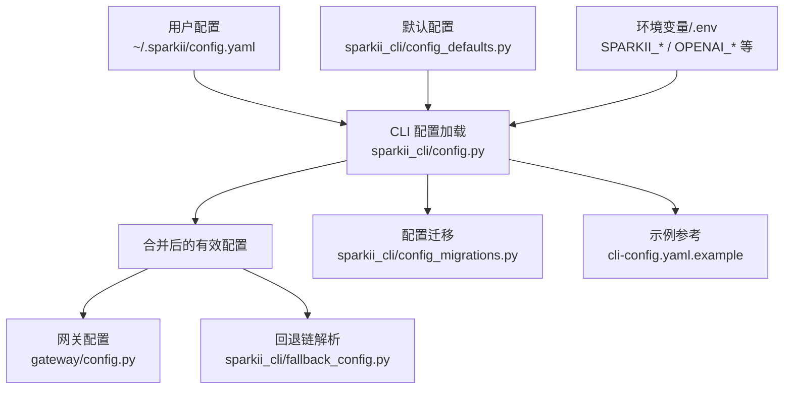
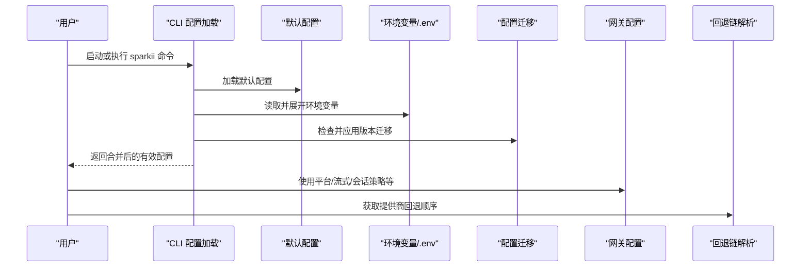
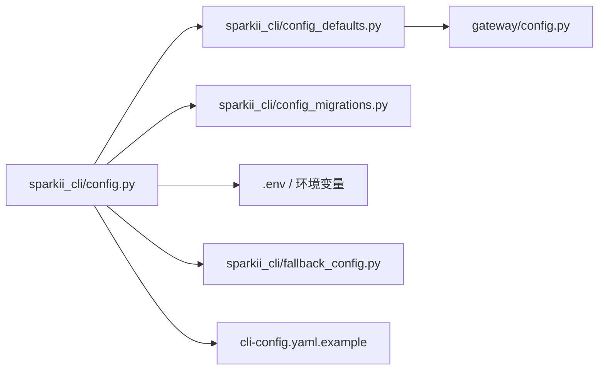

# 配置设置

<cite>
**本文引用的文件**
- [sparkii_cli/config.py](file://sparkii_cli/config.py)
- [sparkii_cli/config_defaults.py](file://sparkii_cli/config_defaults.py)
- [gateway/config.py](file://gateway/config.py)
- [cli-config.yaml.example](file://cli-config.yaml.example)
- [sparkii_cli/config_migrations.py](file://sparkii_cli/config_migrations.py)
- [sparkii_cli/fallback_config.py](file://sparkii_cli/fallback_config.py)
</cite>

## 目录
1. [简介](#简介)
2. [项目结构](#项目结构)
3. [核心组件](#核心组件)
4. [架构总览](#架构总览)
5. [详细组件分析](#详细组件分析)
6. [依赖关系分析](#依赖关系分析)
7. [性能考量](#性能考量)
8. [故障排查指南](#故障排查指南)
9. [结论](#结论)
10. [附录](#附录)

## 简介
本指南聚焦 Sparkii Agent 的配置体系，围绕 config.yaml 的结构、环境变量与优先级、多环境策略、常用场景示例、验证与错误处理、迁移与备份、以及热重载机制进行系统化说明。内容基于仓库中的配置加载、默认值、网关配置、迁移脚本与示例配置文件整理而成，帮助你在开发、测试与生产环境中安全、稳定地管理配置。

## 项目结构
Sparkii 的配置由多个模块协同完成：
- CLI 配置加载与持久化：负责读取 ~/.sparkii/config.yaml、合并默认值、写入 .env、解析环境变量、并发安全与缓存、损坏配置备份等。
- 默认配置定义：集中提供 DEFAULT_CONFIG，作为所有配置的基线。
- 网关配置：负责平台（Telegram/Discord/Slack 等）的启用、通道、流式输出、会话重置策略等。
- 配置迁移：按版本逐步升级旧配置结构，清理废弃键，保证向后兼容。
- 回退链解析：将 fallback_providers/fallback_model 统一为可执行的提供商回退顺序。
- 示例配置：提供完整的 cli-config.yaml.example，覆盖模型、终端、压缩、辅助任务、流式输出等常见选项。

图表来源
- [sparkii_cli/config.py:1-120](file://sparkii_cli/config.py#L1-L120)
- [sparkii_cli/config_defaults.py:1-120](file://sparkii_cli/config_defaults.py#L1-L120)
- [gateway/config.py:1-120](file://gateway/config.py#L1-L120)
- [sparkii_cli/config_migrations.py:1-120](file://sparkii_cli/config_migrations.py#L1-L120)
- [sparkii_cli/fallback_config.py:1-120](file://sparkii_cli/fallback_config.py#L1-L120)
- [cli-config.yaml.example:1-120](file://cli-config.yaml.example#L1-L120)

章节来源
- [sparkii_cli/config.py:1-120](file://sparkii_cli/config.py#L1-L120)
- [sparkii_cli/config_defaults.py:1-120](file://sparkii_cli/config_defaults.py#L1-L120)
- [gateway/config.py:1-120](file://gateway/config.py#L1-L120)
- [sparkii_cli/config_migrations.py:1-120](file://sparkii_cli/config_migrations.py#L1-L120)
- [sparkii_cli/fallback_config.py:1-120](file://sparkii_cli/fallback_config.py#L1-L120)
- [cli-config.yaml.example:1-120](file://cli-config.yaml.example#L1-L120)

## 核心组件
- 配置加载器（CLI）：负责从 config.yaml 读取并合并默认值，支持线程安全的读写、损坏备份、解析失败告警、环境变量展开、安装方式检测、容器模式等。
- 默认配置（DEFAULT_CONFIG）：提供 model、agent、terminal、browser、compression、tool_output、mcp 等全量默认项，确保无配置时系统仍可运行。
- 网关配置：管理平台启用、主频道、会话重置策略、流式输出、端口绑定校验、通知行为等。
- 配置迁移：按版本号执行迁移步骤，清理废弃键、重命名字段、添加新默认项，避免破坏旧配置。
- 回退链解析：将 legacy 的 fallback_model 与新的 fallback_providers 合并为有序的回退列表，便于多提供商容灾。
- 示例配置：提供完整可复制的模板，涵盖模型、终端、压缩、辅助任务、流式输出、记忆、会话重置等。

章节来源
- [sparkii_cli/config.py:1-120](file://sparkii_cli/config.py#L1-L120)
- [sparkii_cli/config_defaults.py:1-200](file://sparkii_cli/config_defaults.py#L1-L200)
- [gateway/config.py:1-200](file://gateway/config.py#L1-L200)
- [sparkii_cli/config_migrations.py:1-200](file://sparkii_cli/config_migrations.py#L1-L200)
- [sparkii_cli/fallback_config.py:1-120](file://sparkii_cli/fallback_config.py#L1-L120)
- [cli-config.yaml.example:1-200](file://cli-config.yaml.example#L1-L200)

## 架构总览
配置在启动时被加载、合并、验证，并在运行时按需热重载。整体流程如下：

图表来源
- [sparkii_cli/config.py:1-120](file://sparkii_cli/config.py#L1-L120)
- [sparkii_cli/config_defaults.py:1-120](file://sparkii_cli/config_defaults.py#L1-L120)
- [gateway/config.py:1-120](file://gateway/config.py#L1-L120)
- [sparkii_cli/config_migrations.py:1-120](file://sparkii_cli/config_migrations.py#L1-L120)
- [sparkii_cli/fallback_config.py:1-120](file://sparkii_cli/fallback_config.py#L1-L120)

## 详细组件分析

### 配置结构与主要配置项
config.yaml 的核心结构包括：
- model：默认模型、提供商选择、base_url、请求头、超时等。
- providers：命名提供商覆盖，支持 per-model 超时、stale_timeout 等。
- terminal：后端（local/ssh/docker/singularity/modal/daytona）、工作目录、资源限制、卷挂载、网络隔离等。
- browser：浏览器引擎、超时、CDP、对话框策略、Camofox 管理等。
- compression：上下文压缩触发阈值、保留尾部比例、保护消息数、重试次数、主动修剪、微压缩等。
- tool_output：终端输出与 read_file 分页限制。
- mcp：MCP 服务器发现超时、自动重载开关。
- auxiliary：辅助任务（图像分析、网页摘要、标题生成、压缩、搜索等）的提供商与模型选择。
- memory：持久记忆（MEMORY.md/USER.md）字符上限、提示间隔、退出刷新策略。
- session_reset：会话重置策略（none/idle/daily/both）。
- streaming：流式输出到平台的传输模式、编辑间隔、缓冲区阈值、光标样式等。
- database：SQLite journal_mode、WAL 参数。
- web：web_search/web_extract 后端与字符限制。

章节来源
- [cli-config.yaml.example:1-800](file://cli-config.yaml.example#L1-L800)
- [sparkii_cli/config_defaults.py:1-800](file://sparkii_cli/config_defaults.py#L1-L800)

### 环境变量设置方法与优先级规则
- 环境变量来源：
  - 进程环境（os.environ），如 OPENAI_API_KEY、ANTHROPIC_API_KEY、GATEWAY_MULTIPLEX_PROFILES 等。
  - 用户 .env 文件（~/.sparkii/.env），用于存放密钥与敏感信息。
  - 配置项中通过 ${VAR} 语法引用环境变量。
- 优先级规则（通用原则）：
  - 环境变量 > 用户配置（config.yaml）> 默认配置（DEFAULT_CONFIG）。
  - 对于网关特定开关（如 GATEWAY_MULTIPLEX_PROFILES），若值为未识别字符串则忽略并回退到 config.yaml。
  - 某些关键路径（如 provider 的 key_env）通过 secret_scope 解析，以支持多 profile 隔离。
- 写保护与环境变量黑名单：
  - 写 .env 时会拒绝危险的环境变量名（如 LD_PRELOAD、PYTHONPATH、PATH、SHELL、BROWSER、EDITOR、VISUAL、GIT_SSH_COMMAND、SPARKII_HOME、SPARKII_PROFILE、SPARKII_CONFIG、SPARKII_ENV 等），防止通过仪表板写入影响子进程执行或运行时位置。
  - 已存在于 .env 的变量仍会生效，黑名单仅作用于“写入”路径。

章节来源
- [sparkii_cli/config.py:158-234](file://sparkii_cli/config.py#L158-L234)
- [gateway/config.py:40-75](file://gateway/config.py#L40-L75)
- [sparkii_cli/fallback_config.py:14-40](file://sparkii_cli/fallback_config.py#L14-L40)

### 不同环境的配置策略（开发/测试/生产）
- 开发环境：
  - 可使用本地终端后端（local），开启更多调试与日志；适当提高 MCP 发现超时以容忍慢服务冷启动。
  - 可启用流式输出以便快速反馈；压缩阈值可略低以控制上下文增长。
- 测试环境：
  - 建议使用容器后端（docker/singularity/modal/daytona）隔离执行；限制 CPU/内存/磁盘；关闭不必要的网络访问。
  - 对工具调用增加循环护栏（warnings_enabled/hard_stop_enabled）以避免死循环消耗资源。
- 生产环境：
  - 严格限制并发会话数（max_concurrent_sessions），启用会话重置策略（idle/daily/both）控制成本。
  - 使用回退链（fallback_providers）实现提供商容灾；合理设置 API 最大重试次数与超时。
  - 谨慎启用流式输出与进度通知，避免对用户造成噪音；必要时调整 edit_interval/buffer_threshold。
  - 数据库 journal_mode 根据文件系统特性选择 wal/delete；必要时调整 WAL 大小限制。

章节来源
- [sparkii_cli/config_defaults.py:270-400](file://sparkii_cli/config_defaults.py#L270-L400)
- [sparkii_cli/config_defaults.py:595-798](file://sparkii_cli/config_defaults.py#L595-L798)
- [gateway/config.py:485-540](file://gateway/config.py#L485-L540)
- [cli-config.yaml.example:220-340](file://cli-config.yaml.example#L220-L340)

### 常用配置场景示例
- API 密钥设置：
  - 在 .env 中设置 OPENAI_API_KEY、ANTHROPIC_API_KEY 等；或通过 providers 的 key_env 引用环境变量。
  - 自定义提供商可通过 base_url + api_key/key_env 配置，支持 extra_headers。
- 模型提供商配置：
  - 设置 model.default 与 model.provider；或使用 providers 命名覆盖 per-model 超时与 stale 检测。
  - 使用 fallback_providers 构建回退链，提升可用性。
- 工具集启用：
  - 通过 toolsets 指定启用的工具集合；禁用不需要的工具以减少上下文与风险。
  - 使用 tool_loop_guardrails 控制重复失败与无进展时的警告与硬停止。
- 流式输出：
  - 在 streaming 中设置 enabled/transport/edit_interval/buffer_threshold/cursor；平台差异由 gateway/config 处理。
- 上下文压缩：
  - 调整 compression.threshold/target_ratio/protect_last_n/max_attempts/proactive_prune_tokens/micro_compact 等，平衡延迟与成本。

章节来源
- [cli-config.yaml.example:20-160](file://cli-config.yaml.example#L20-L160)
- [cli-config.yaml.example:380-580](file://cli-config.yaml.example#L380-L580)
- [cli-config.yaml.example:790-800](file://cli-config.yaml.example#L790-L800)
- [sparkii_cli/config_defaults.py:595-798](file://sparkii_cli/config_defaults.py#L595-L798)
- [gateway/config.py:720-800](file://gateway/config.py#L720-L800)

### 配置的验证机制与错误处理
- YAML 解析失败：
  - 当 config.yaml 无法解析时，系统会记录警告、stderr 输出，并将损坏文件备份为时间戳后缀的 .bak；同时回退到默认配置以保证运行。
  - 同一损坏文件的重复解析会被去重告警，避免刷屏。
- 类型与范围校验：
  - 网关配置中对布尔、浮点、整数、正整数等进行强制转换与边界检查；非法值记录警告并回退默认。
  - 平台端口绑定校验：某些平台仅在特定模式下绑定端口，二次配置会阻止冲突。
- 环境变量黑名单：
  - 写 .env 时拒绝危险变量名，防止注入或劫持子进程执行。
- 迁移失败与降级：
  - 迁移步骤只修改必要字段；若某步失败，尽量保持配置可用并记录警告。

章节来源
- [sparkii_cli/config.py:45-156](file://sparkii_cli/config.py#L45-L156)
- [gateway/config.py:94-190](file://gateway/config.py#L94-L190)
- [gateway/config.py:376-418](file://gateway/config.py#L376-L418)
- [sparkii_cli/config_migrations.py:40-70](file://sparkii_cli/config_migrations.py#L40-L70)

### 配置迁移与备份最佳实践
- 迁移策略：
  - 系统维护版本化的迁移步骤（v12→v13→...→v33），按升序执行；低于支持底层的配置不再自动迁移，需手动更新或重新初始化。
  - 迁移会清理废弃键（如 LLM_MODEL/OPENAI_MODEL）、重命名字段（write_mode → write_approval）、添加新默认项（curator/display.interim_assistant_messages）。
- 备份建议：
  - 每次重大变更前备份 ~/.sparkii/config.yaml 与 .env；损坏文件会自动生成 .corrupt.<ts>.bak，可用于对比修复。
  - 使用 sparkii config set/get/unset 进行细粒度变更，避免直接编辑导致格式错误。
- 回滚与恢复：
  - 若迁移后出现异常，可回退到最近一次备份；必要时运行 setup wizard 重新生成配置。

章节来源
- [sparkii_cli/config_migrations.py:40-120](file://sparkii_cli/config_migrations.py#L40-L120)
- [sparkii_cli/config_migrations.py:146-220](file://sparkii_cli/config_migrations.py#L146-L220)
- [sparkii_cli/config_migrations.py:221-339](file://sparkii_cli/config_migrations.py#L221-L339)
- [sparkii_cli/config_migrations.py:383-473](file://sparkii_cli/config_migrations.py#L383-L473)
- [sparkii_cli/config_migrations.py:474-686](file://sparkii_cli/config_migrations.py#L474-L686)
- [sparkii_cli/config.py:45-156](file://sparkii_cli/config.py#L45-L156)

### 配置文件的热重载机制与生效时机
- 热重载触发：
  - MCP 服务器发现与工具表面在配置变化时可自动重载；也可通过命令显式触发（如 /reload-mcp）。
  - 配置加载器内部维护缓存（基于文件 mtime/size），当文件被原子替换（atomic_yaml_write）后会失效并重新加载。
- 生效时机：
  - 首次加载：进程启动时合并默认值、环境变量、迁移结果，得到有效配置。
  - 运行时重载：检测到配置变更后，重建工具表面与提供商缓存；注意重载可能使提供商 prompt 缓存失效，带来额外开销。
- 注意事项：
  - 频繁重载会影响长上下文/高推理模型的响应延迟；建议在非高峰时段批量调整配置。
  - 某些配置（如 platform 端口绑定）在启动时校验，运行时修改可能导致冲突。

章节来源
- [sparkii_cli/config_defaults.py:506-543](file://sparkii_cli/config_defaults.py#L506-L543)
- [sparkii_cli/config.py:235-260](file://sparkii_cli/config.py#L235-L260)
- [gateway/config.py:720-800](file://gateway/config.py#L720-L800)

## 依赖关系分析
配置模块之间的依赖关系如下：

图表来源
- [sparkii_cli/config.py:1-120](file://sparkii_cli/config.py#L1-L120)
- [sparkii_cli/config_defaults.py:1-120](file://sparkii_cli/config_defaults.py#L1-L120)
- [gateway/config.py:1-120](file://gateway/config.py#L1-L120)
- [sparkii_cli/config_migrations.py:1-120](file://sparkii_cli/config_migrations.py#L1-L120)
- [sparkii_cli/fallback_config.py:1-120](file://sparkii_cli/fallback_config.py#L1-L120)
- [cli-config.yaml.example:1-120](file://cli-config.yaml.example#L1-L120)

章节来源
- [sparkii_cli/config.py:1-120](file://sparkii_cli/config.py#L1-L120)
- [sparkii_cli/config_defaults.py:1-120](file://sparkii_cli/config_defaults.py#L1-L120)
- [gateway/config.py:1-120](file://gateway/config.py#L1-L120)
- [sparkii_cli/config_migrations.py:1-120](file://sparkii_cli/config_migrations.py#L1-L120)
- [sparkii_cli/fallback_config.py:1-120](file://sparkii_cli/fallback_config.py#L1-L120)
- [cli-config.yaml.example:1-120](file://cli-config.yaml.example#L1-L120)

## 性能考量
- 上下文压缩：
  - 合理设置 threshold/target_ratio/protect_last_n，避免过早或过晚压缩导致用户体验下降或成本上升。
  - 对大窗口模型（512K/1M）可启用 proactive_prune_tokens 减少历史冗余。
- 并发与会话：
  - max_concurrent_sessions 与 max_live_sessions 控制活跃会话数量，防止内存压力。
  - agent.agent_cache.memory_high_mb 与 evictions 策略影响提示缓存命中率。
- 流式输出：
  - edit_interval/buffer_threshold 影响平台渲染节奏；过高会导致延迟，过低可能造成频繁编辑。
- 数据库：
  - WAL 模式适合大多数场景；NFS/SMB 等弱 fsync 文件系统建议切换为 DELETE。
- 提供商回退：
  - fallback_providers 提升可用性，但会增加首跳失败重试开销；合理排序与超时能降低影响。

[本节为通用指导，无需具体文件分析]

## 故障排查指南
- 配置解析失败：
  - 查看 stderr 与日志中的警告；检查 ~/.sparkii/config.yaml 是否有语法错误；使用备份文件对比修复。
- 环境变量无效：
  - 确认变量名不在黑名单中；检查 .env 是否被正确加载；使用 sparkii config get 查看解析结果。
- 平台端口冲突：
  - 检查 platforms 中是否重复绑定端口；根据平台模式（webhook/callback）调整配置。
- 提供商认证失败：
  - 确认 api_key/key_env 是否正确；检查 base_url 与超时设置；使用 fallback_providers 提升容错。
- 流式输出异常：
  - 调整 transport/enabled/edit_interval/buffer_threshold；检查平台是否支持 draft 流式。

章节来源
- [sparkii_cli/config.py:45-156](file://sparkii_cli/config.py#L45-L156)
- [gateway/config.py:376-418](file://gateway/config.py#L376-L418)
- [gateway/config.py:720-800](file://gateway/config.py#L720-L800)
- [sparkii_cli/config_migrations.py:146-220](file://sparkii_cli/config_migrations.py#L146-L220)

## 结论
Sparkii 的配置体系以 config.yaml 为核心，结合环境变量与默认配置，提供灵活、健壮且可迁移的设置能力。通过合理的优先级规则、严格的验证与错误处理、完善的迁移与备份机制，以及针对多环境的优化策略，用户可以在开发、测试与生产环境中安全高效地管理配置。建议在生产部署中重点关注并发控制、回退链、压缩策略与流式输出调优，并结合监控与日志持续优化。

[本节为总结性内容，无需具体文件分析]

## 附录
- 常用命令：
  - sparkii config get/set/unset：查询与修改配置项。
  - sparkii config edit：打开编辑器修改 config.yaml。
  - sparkii setup：重新生成配置（谨慎使用，会覆盖现有配置）。
- 参考文件：
  - cli-config.yaml.example：完整示例，覆盖模型、终端、压缩、辅助任务、流式输出等。
  - gateway/config.py：平台与流式输出的详细配置与校验逻辑。
  - sparkii_cli/config_migrations.py：版本化迁移步骤，了解历史变更与兼容性。

[本节为补充信息，无需具体文件分析]