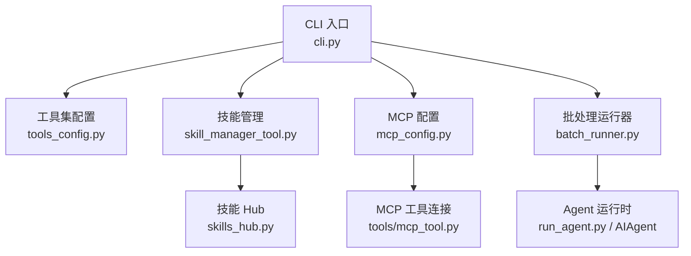
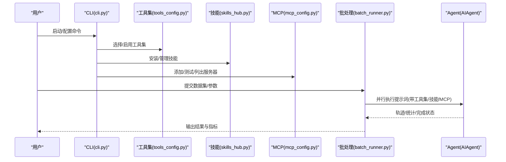
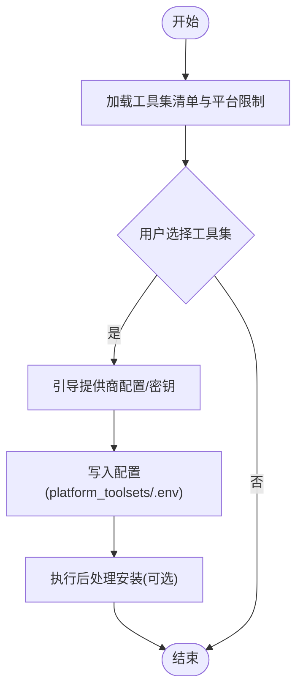
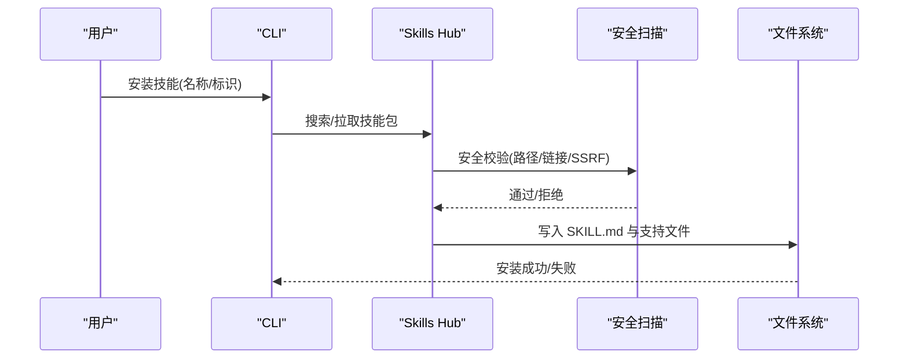
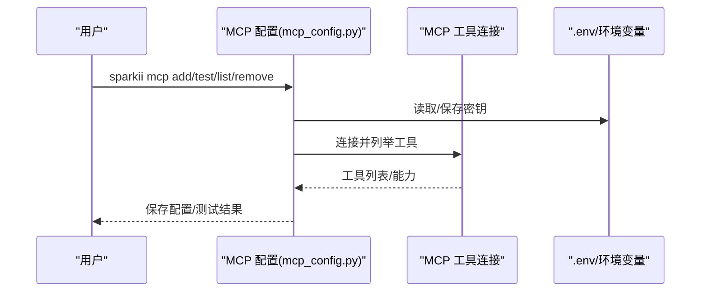
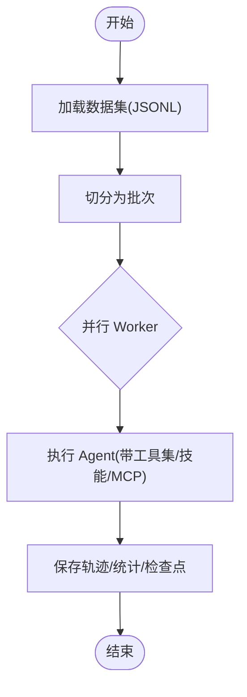
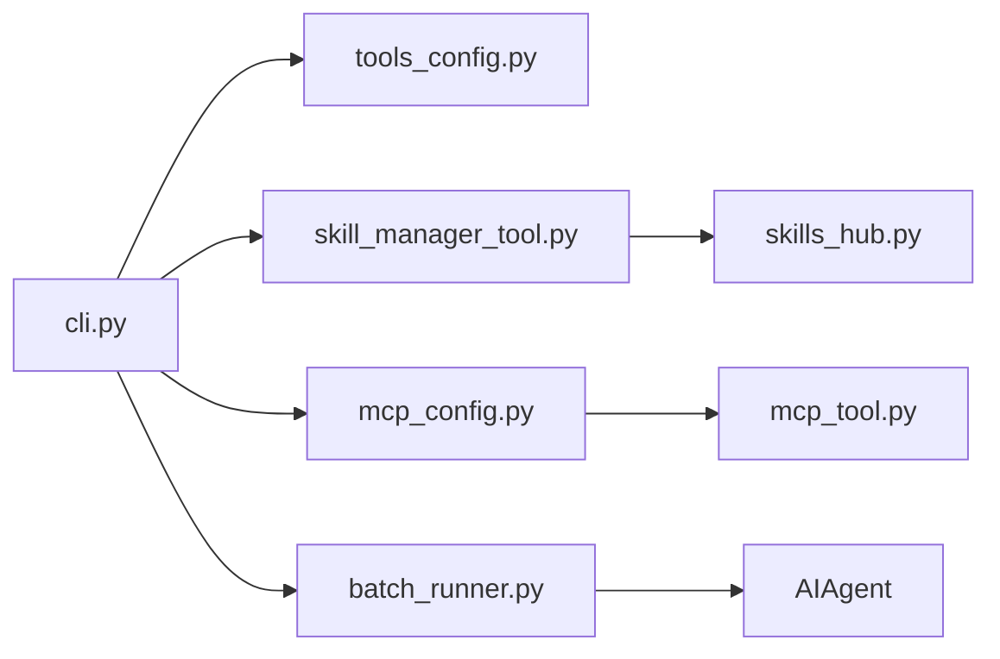

# 高级用法

<cite>
**本文引用的文件**
- [README.md](file://README.md)
- [cli.py](file://cli.py)
- [tools/skill_manager_tool.py](file://tools/skill_manager_tool.py)
- [sparkii_cli/mcp_config.py](file://sparkii_cli/mcp_config.py)
- [sparkii_cli/tools_config.py](file://sparkii_cli/tools_config.py)
- [batch_runner.py](file://batch_runner.py)
- [tools/skills_hub.py](file://tools/skills_hub.py)
- [sparkii_cli/skills_config.py](file://sparkii_cli/skills_config.py)
</cite>

## 目录
1. [简介](#简介)
2. [项目结构](#项目结构)
3. [核心组件](#核心组件)
4. [架构总览](#架构总览)
5. [详细组件分析](#详细组件分析)
6. [依赖关系分析](#依赖关系分析)
7. [性能考量](#性能考量)
8. [故障排查指南](#故障排查指南)
9. [结论](#结论)
10. [附录](#附录)

## 简介
本指南面向高级用户与企业场景，聚焦以下主题：工具集管理、技能安装与管理、MCP 服务器配置与测试、自定义工具/技能的编写与部署、批处理模式与脚本化使用、性能优化与最佳实践、企业级部署与管理选项、与其他工具的集成与 API 调用示例、监控日志与调试、安全配置与权限管理。内容基于仓库中的 CLI、工具集、技能系统、MCP 配置、批处理运行器等实现进行说明，并提供可操作的流程与图示。

## 项目结构
围绕“工具集—技能—MCP—批处理”的主线，关键模块分布如下：
- CLI 入口与配置加载：负责环境初始化、配置合并、环境变量桥接与安全开关设置
- 工具集配置：统一启用/禁用工具集、引导提供商配置、平台相关能力
- 技能系统：本地技能管理、Hub 源（GitHub）拉取、安全扫描与锁定保护
- MCP 配置：添加/删除/测试/列出 MCP 服务器，支持 OAuth、Bearer 认证与环境变量插值
- 批处理运行器：并行执行提示词、轨迹保存、统计聚合、断点续跑
- 技能 Hub：多来源适配器、安全校验、SSRF/重定向防护、信任等级与审计

图表来源
- [cli.py:409-793](file://cli.py#L409-L793)
- [sparkii_cli/tools_config.py:91-165](file://sparkii_cli/tools_config.py#L91-L165)
- [tools/skill_manager_tool.py:154-173](file://tools/skill_manager_tool.py#L154-L173)
- [sparkii_cli/mcp_config.py:78-150](file://sparkii_cli/mcp_config.py#L78-L150)
- [batch_runner.py:529-640](file://batch_runner.py#L529-L640)

章节来源
- [README.md:105-183](file://README.md#L105-L183)
- [cli.py:409-793](file://cli.py#L409-L793)

## 核心组件
- 工具集管理：通过统一配置界面选择并启用工具集，自动引导提供商密钥与后处理安装；支持按平台区分默认与限制
- 技能系统：本地创建/编辑/补丁/删除技能，支持从 Hub 拉取并安全扫描，提供锁定与归档策略
- MCP 服务器：交互式添加/测试/列出/移除，支持 HTTP 与 stdio 传输、OAuth/Bearer 认证、环境变量插值
- 批处理模式：JSONL 数据集驱动，按批次并行执行，轨迹持久化、统计聚合、断点续跑
- 安全与权限：路径白名单、链接/联合目录检测、SSRF 防护、审计日志、隔离工作区

章节来源
- [sparkii_cli/tools_config.py:91-165](file://sparkii_cli/tools_config.py#L91-L165)
- [tools/skill_manager_tool.py:154-173](file://tools/skill_manager_tool.py#L154-L173)
- [sparkii_cli/mcp_config.py:78-150](file://sparkii_cli/mcp_config.py#L78-L150)
- [batch_runner.py:529-640](file://batch_runner.py#L529-L640)
- [tools/skills_hub.py:294-338](file://tools/skills_hub.py#L294-L338)

## 架构总览
下图展示从 CLI 到工具集、技能、MCP、批处理的交互关系，以及数据流向与关键控制点。

图表来源
- [cli.py:409-793](file://cli.py#L409-L793)
- [sparkii_cli/tools_config.py:91-165](file://sparkii_cli/tools_config.py#L91-L165)
- [tools/skills_hub.py:294-338](file://tools/skills_hub.py#L294-L338)
- [sparkii_cli/mcp_config.py:78-150](file://sparkii_cli/mcp_config.py#L78-L150)
- [batch_runner.py:529-640](file://batch_runner.py#L529-L640)

## 详细组件分析

### 工具集管理（启用/禁用/提供商配置）
- 功能要点
  - 集中注册工具集与显示标签，支持按平台限制与默认关闭集合
  - 首次启用时引导提供商配置（如 TTS/STT/Web/图像/视频生成等），写入配置与 .env
  - 支持插件扩展的工具集注册与去重
- 关键流程
  - 读取平台与工具集清单 → 用户勾选 → 写入 platform_toolsets → 触发后处理安装
- 企业建议
  - 通过受管范围或配置文件集中下发默认工具集
  - 对敏感工具集（如代码执行、浏览器自动化）默认关闭，按需开启

图表来源
- [sparkii_cli/tools_config.py:91-165](file://sparkii_cli/tools_config.py#L91-L165)
- [sparkii_cli/tools_config.py:316-735](file://sparkii_cli/tools_config.py#L316-L735)

章节来源
- [sparkii_cli/tools_config.py:91-165](file://sparkii_cli/tools_config.py#L91-L165)
- [sparkii_cli/tools_config.py:316-735](file://sparkii_cli/tools_config.py#L316-L735)

### 技能安装与管理（本地与 Hub）
- 功能要点
  - 本地技能目录结构与读写保护（名称/描述/前导 YAML frontmatter 校验）
  - Hub 源（GitHub）搜索/拉取/预览，支持信任等级与审计日志
  - 安全扫描与隔离：拒绝危险路径、SSRF 防护、重定向限制、链接/联合目录检测
- 关键流程
  - 搜索/挑选 → 下载为 Bundle → 安全校验 → 安装到 skills 目录 → 记录锁与审计
- 企业建议
  - 仅允许可信源（内置/官方/已验证仓库），开启安全扫描
  - 使用锁定与归档策略防止误删，保留变更历史

图表来源
- [tools/skill_manager_tool.py:154-173](file://tools/skill_manager_tool.py#L154-L173)
- [tools/skills_hub.py:294-338](file://tools/skills_hub.py#L294-L338)
- [tools/skills_hub.py:130-153](file://tools/skills_hub.py#L130-L153)

章节来源
- [tools/skill_manager_tool.py:154-173](file://tools/skill_manager_tool.py#L154-L173)
- [tools/skills_hub.py:294-338](file://tools/skills_hub.py#L294-L338)
- [tools/skills_hub.py:130-153](file://tools/skills_hub.py#L130-L153)

### MCP 服务器配置与测试
- 功能要点
  - 添加/删除/列出/测试 MCP 服务器，支持 HTTP 与 stdio 传输
  - 认证方式：OAuth 2.1 PKCE、Bearer Token（存储于 .env，配置中引用）
  - 环境变量插值：在连接前解析 ${VAR}，避免明文泄露
- 关键流程
  - 输入服务器信息 → 安全校验 → 连接探测 → 工具发现 → 选择性启用 → 保存配置
- 企业建议
  - 强制使用环境变量承载密钥，禁止硬编码
  - 对可疑命令/参数进行拦截，最小化暴露面

图表来源
- [sparkii_cli/mcp_config.py:78-150](file://sparkii_cli/mcp_config.py#L78-L150)
- [sparkii_cli/mcp_config.py:254-378](file://sparkii_cli/mcp_config.py#L254-L378)
- [sparkii_cli/mcp_config.py:415-617](file://sparkii_cli/mcp_config.py#L415-L617)

章节来源
- [sparkii_cli/mcp_config.py:78-150](file://sparkii_cli/mcp_config.py#L78-L150)
- [sparkii_cli/mcp_config.py:254-378](file://sparkii_cli/mcp_config.py#L254-L378)
- [sparkii_cli/mcp_config.py:415-617](file://sparkii_cli/mcp_config.py#L415-L617)

### 批处理模式与脚本化使用
- 功能要点
  - JSONL 数据集驱动，批量并行执行，支持容器镜像覆盖与任务隔离
  - 轨迹保存、工具使用统计、推理覆盖率统计、断点续跑
  - 支持按分布采样工具集，便于评测与回归
- 关键流程
  - 加载数据集 → 切分批次 → 并行 worker → 保存轨迹/统计 → 更新检查点
- 企业建议
  - 使用只读工作区与最小权限账户运行
  - 合理设置并发与超时，结合资源配额与监控告警

图表来源
- [batch_runner.py:529-640](file://batch_runner.py#L529-L640)
- [batch_runner.py:644-777](file://batch_runner.py#L644-L777)

章节来源
- [batch_runner.py:529-640](file://batch_runner.py#L529-L640)
- [batch_runner.py:644-777](file://batch_runner.py#L644-L777)

### 自定义工具与技能编写与部署
- 自定义工具
  - 遵循现有工具接口与注册机制，确保 schema 正确、错误返回一致
  - 使用工具后端辅助与沙箱隔离，避免越权访问
- 自定义技能
  - 遵循 SKILL.md 前导 YAML 规范，包含 name/description 与正文指令
  - 将脚本/模板/参考放入允许的子目录（references/templates/scripts/assets）
  - 通过 skill_manage 或 Hub 发布，配合安全扫描与锁定保护
- 部署建议
  - 使用组织镜像/私有 Hub，限制来源与版本
  - 在 CI 中执行 lint/安全扫描，通过后再发布

章节来源
- [tools/skill_manager_tool.py:527-635](file://tools/skill_manager_tool.py#L527-L635)
- [tools/skills_hub.py:130-153](file://tools/skills_hub.py#L130-L153)

### 监控、日志与调试
- 日志
  - CLI 启动即初始化日志，会话与错误日志分离，便于定位问题
- 监控
  - 批处理输出工具使用统计与推理覆盖率，便于评估模型与工具效果
- 调试
  - 使用 verbose 模式、断点续跑、逐条重试；MCP 测试命令快速验证连通性

章节来源
- [cli.py:796-800](file://cli.py#L796-L800)
- [batch_runner.py:125-241](file://batch_runner.py#L125-L241)
- [sparkii_cli/mcp_config.py:721-782](file://sparkii_cli/mcp_config.py#L721-L782)

### 安全配置与权限管理
- 路径与文件安全
  - 严格校验技能名/类别/路径，拒绝绝对路径与遍历
  - 检测符号链接/联合目录，防止 rmtree 逃逸
- 网络与 SSRF
  - 使用安全 HTTP 客户端，限制重定向次数，阻断内网地址
- 认证与密钥
  - MCP 密钥存 .env，配置中引用环境变量；Bearer 头模板标准化
- 企业治理
  - 启用安全扫描、审计日志、锁定与归档策略；最小权限原则

章节来源
- [tools/skill_manager_tool.py:200-271](file://tools/skill_manager_tool.py#L200-L271)
- [tools/skills_hub.py:294-338](file://tools/skills_hub.py#L294-L338)
- [sparkii_cli/mcp_config.py:153-196](file://sparkii_cli/mcp_config.py#L153-L196)

## 依赖关系分析
- CLI 依赖工具集配置、技能管理与 MCP 配置
- 技能管理依赖 Hub 源与安全扫描
- 批处理依赖 Agent 运行时与工具集/技能/MCP
- MCP 配置依赖工具连接与环境变量插值

图表来源
- [cli.py:409-793](file://cli.py#L409-L793)
- [sparkii_cli/tools_config.py:91-165](file://sparkii_cli/tools_config.py#L91-L165)
- [tools/skill_manager_tool.py:154-173](file://tools/skill_manager_tool.py#L154-L173)
- [sparkii_cli/mcp_config.py:78-150](file://sparkii_cli/mcp_config.py#L78-L150)
- [batch_runner.py:529-640](file://batch_runner.py#L529-L640)
- [tools/skills_hub.py:294-338](file://tools/skills_hub.py#L294-L338)

章节来源
- [cli.py:409-793](file://cli.py#L409-L793)
- [sparkii_cli/tools_config.py:91-165](file://sparkii_cli/tools_config.py#L91-L165)
- [tools/skill_manager_tool.py:154-173](file://tools/skill_manager_tool.py#L154-L173)
- [sparkii_cli/mcp_config.py:78-150](file://sparkii_cli/mcp_config.py#L78-L150)
- [batch_runner.py:529-640](file://batch_runner.py#L529-L640)
- [tools/skills_hub.py:294-338](file://tools/skills_hub.py#L294-L338)

## 性能考量
- 批处理并发
  - 根据 CPU/内存/IO 调整 worker 数量，避免过度竞争
  - 使用容器镜像预热与缓存，减少冷启动开销
- 工具与模型
  - 合理选择模型与提供商，利用路由与排序策略降低延迟与成本
  - 对耗时工具（浏览器/视频生成）设置超时与重试上限
- 资源隔离
  - 使用独立工作区与只读挂载，避免 I/O 争用
  - 限制子进程资源（CPU/内存/磁盘），防止雪崩

[本节为通用指导，不直接分析具体文件]

## 故障排查指南
- MCP 连接失败
  - 检查认证类型与密钥是否正确，确认环境变量插值生效
  - 使用测试命令查看连接时间与工具列表
- 技能安装失败
  - 检查安全扫描报告与审计日志，确认路径与链接是否被拒绝
  - 核对 SKILL.md 前导 YAML 与正文格式
- 批处理中断
  - 查看检查点与批次输出，确认已完成条目
  - 使用 resume 模式继续未完成任务

章节来源
- [sparkii_cli/mcp_config.py:721-782](file://sparkii_cli/mcp_config.py#L721-L782)
- [tools/skills_hub.py:294-338](file://tools/skills_hub.py#L294-L338)
- [batch_runner.py:690-777](file://batch_runner.py#L690-L777)

## 结论
通过工具集管理、技能系统与 MCP 配置的协同，Sparkii Agent 提供了强大的可扩展能力。结合批处理模式与完善的监控日志，可在企业环境中实现稳定、可控、可观测的自动化流程。遵循安全与权限最佳实践，可有效降低风险并提升整体效率。

## 附录
- 常用命令参考
  - 工具集：sparkii tools（启用/禁用/配置）
  - 技能：sparkii skills（全局/平台维度切换）
  - MCP：sparkii mcp add/list/test/remove/login
  - 批处理：python batch_runner.py --dataset_file=... --batch_size=... --run_name=...
- 配置位置
  - 用户配置：~/.sparkii/config.yaml
  - 环境变量：~/.sparkii/.env（MCP 密钥等）
  - 技能目录：~/.sparkii/skills/

章节来源
- [sparkii_cli/skills_config.py:150-203](file://sparkii_cli/skills_config.py#L150-L203)
- [sparkii_cli/mcp_config.py:78-150](file://sparkii_cli/mcp_config.py#L78-L150)
- [batch_runner.py:529-640](file://batch_runner.py#L529-L640)