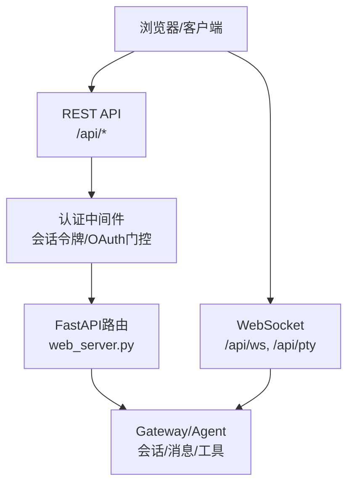
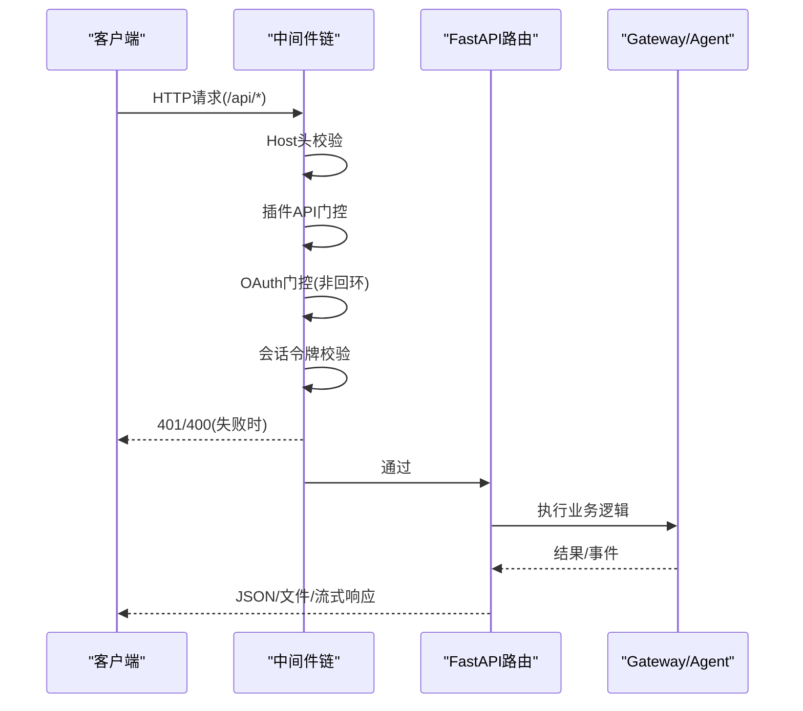
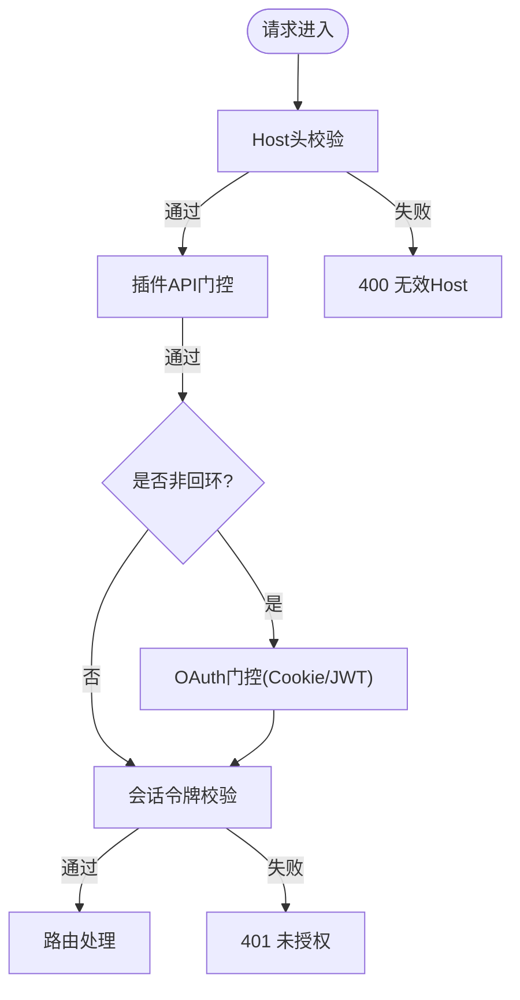
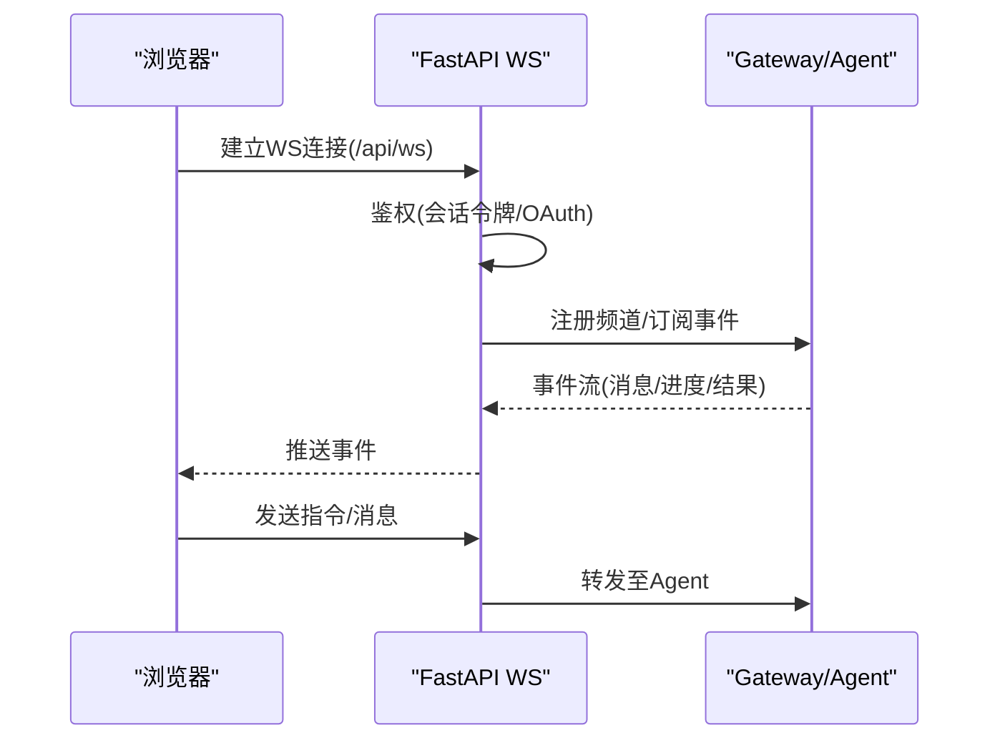
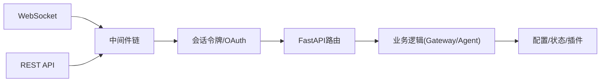

# API集成

<cite>
**本文引用的文件**
- [web_server.py](file://sparkii_cli/web_server.py)
- [auth.py](file://sparkii_cli/auth.py)
- [gateway_authz_mixin.py](file://gateway/authz_mixin.py)
- [dashboard_auth_nous.py](file://plugins/dashboard_auth/nous/__init__.py)
</cite>

## 目录
1. [简介](#简介)
2. [项目结构](#项目结构)
3. [核心组件](#核心组件)
4. [架构总览](#架构总览)
5. [详细组件分析](#详细组件分析)
6. [依赖关系分析](#依赖关系分析)
7. [性能考虑](#性能考虑)
8. [故障排查指南](#故障排查指南)
9. [结论](#结论)
10. [附录](#附录)

## 简介
本指南面向希望集成Web仪表板API的开发者，系统说明REST与WebSocket接口、认证授权机制、会话管理、消息发送、工具调用、状态查询等核心能力，并提供错误处理、测试调试、性能优化与最佳实践建议。本仓库通过FastAPI提供Web仪表板后端，内置会话令牌鉴权与可选OAuth门控；同时暴露WebSocket用于实时通信（如PTY终端、事件流）。

## 项目结构
- Web服务入口与路由：位于sparkii_cli/web_server.py，基于FastAPI，提供静态前端托管与/api/* REST端点，以及/ws、/pty等WebSocket端点。
- 认证与授权：
  - 本地回环模式：使用进程内会话令牌（X-Hermes-Session-Token或Authorization: Bearer）保护敏感接口。
  - 网关/OAuth模式：通过插件化的仪表板认证门控（如Nous Portal OAuth）进行Cookie+JWT校验。
  - 平台级授权策略由gateway/authz_mixin.py维护，控制不同平台/渠道的消息准入。
- 外部提供商认证：sparkii_cli/auth.py集中管理多提供商的API密钥与OAuth流程（如OpenAI、Anthropic、xAI等），供Agent运行时使用。

**图示来源**
- [web_server.py:313-671](file://sparkii_cli/web_server.py#L313-L671)
- [web_server.py:538-671](file://sparkii_cli/web_server.py#L538-L671)

**章节来源**
- [web_server.py:313-671](file://sparkii_cli/web_server.py#L313-L671)

## 核心组件
- FastAPI应用与生命周期：定义app实例、中间件链、健康自检、自动归档、PTY回收等后台任务。
- 认证中间件链：
  - Host头校验：防止DNS重绑定攻击。
  - 插件API运行时门控：按启用/禁用动态拦截/api/plugins/*。
  - OAuth门控：非回环绑定下强制OAuth登录。
  - 会话令牌校验：对/api/*（除白名单）要求X-Hermes-Session-Token或Bearer。
  - Token认证通道：为特定路由提供无交互Bearer认证。
- 健康监控：记录未处理异常与5xx，周期性自测受保护端点可用性。
- WebSocket支持：/api/ws与/ai/pty用于实时通信与伪终端交互。

**章节来源**
- [web_server.py:217-313](file://sparkii_cli/web_server.py#L217-L313)
- [web_server.py:398-671](file://sparkii_cli/web_server.py#L398-L671)
- [web_server.py:688-817](file://sparkii_cli/web_server.py#L688-L817)

## 架构总览
下图展示请求从客户端到后端的完整路径，包括认证、路由、业务处理与响应返回。

**图示来源**
- [web_server.py:538-671](file://sparkii_cli/web_server.py#L538-L671)
- [web_server.py:688-817](file://sparkii_cli/web_server.py#L688-L817)

## 详细组件分析

### 认证与授权机制
- 会话令牌（本地回环）：
  - 通过X-Hermes-Session-Token或Authorization: Bearer传递。
  - 仅对/api/*生效，部分下载链接支持?token=查询参数。
- OAuth门控（非回环）：
  - 当绑定为非回环地址时启用，需完成登录并设置HttpOnly Cookie。
  - 支持Nous Portal OAuth（authorization code + PKCE），JWT验证与刷新令牌轮换。
- 平台级授权：
  - gateway/authz_mixin.py实现入站消息授权策略，结合环境变量、配对白名单、平台策略决定允许/拒绝。

**图示来源**
- [web_server.py:538-671](file://sparkii_cli/web_server.py#L538-L671)
- [dashboard_auth_nous.py:179-302](file://plugins/dashboard_auth/nous/__init__.py#L179-L302)

**章节来源**
- [web_server.py:398-671](file://sparkii_cli/web_server.py#L398-L671)
- [dashboard_auth_nous.py:179-302](file://plugins/dashboard_auth/nous/__init__.py#L179-L302)
- [gateway_authz_mixin.py:386-783](file://gateway/authz_mixin.py#L386-L783)

### REST API概览
- 基础URL：http(s)://{host}:{port}/api
- 认证方式：
  - 本地回环：X-Hermes-Session-Token或Authorization: Bearer <token>
  - 非回环：先完成OAuth登录，后续请求携带Cookie
- 公共路径：/api/status等少数只读端点无需认证（详见内部白名单）
- 典型端点类别（以功能划分，具体路径见源码路由）：
  - 会话管理：创建/列出/删除会话，查询会话状态
  - 消息发送：向当前会话发送用户消息，触发Agent执行
  - 工具调用：通过会话上下文间接调用工具（由Agent编排）
  - 状态查询：仪表盘健康、运行态、配置Schema等
- 响应格式：JSON为主，文件下载返回二进制流，部分端点支持流式响应

注意：为避免泄露实现细节，本节不列出具体路径与方法签名；请参考“章节来源”中的路由与中间件位置定位实际端点。

**章节来源**
- [web_server.py:398-671](file://sparkii_cli/web_server.py#L398-L671)
- [web_server.py:688-817](file://sparkii_cli/web_server.py#L688-L817)

### WebSocket接口
- 用途：
  - /api/ws：聊天/事件流，支持实时消息推送与订阅
  - /api/pty：伪终端交互，适合远程命令执行与日志流
- 特性：
  - 事件通道：服务端按通道ID广播事件，客户端订阅对应频道
  - 流式响应：长连接持续推送增量数据
  - 安全：复用REST的认证中间件链（会话令牌或OAuth）
- 连接流程：建立WS连接→鉴权→选择频道→接收/发送事件

**图示来源**
- [web_server.py:538-671](file://sparkii_cli/web_server.py#L538-L671)

**章节来源**
- [web_server.py:538-671](file://sparkii_cli/web_server.py#L538-L671)

### 主要API端点功能说明
- 会话管理
  - 创建会话：初始化新对话上下文
  - 列出会话：分页获取历史会话列表
  - 删除会话：清理指定会话
  - 查询状态：获取会话运行状态、消息计数等
- 消息发送
  - 发送消息：向活跃会话追加用户消息，触发Agent推理与工具调用
  - 取消/中断：终止正在执行的Agent任务
- 工具调用
  - 通过Agent编排间接调用工具（如文件操作、搜索、代码执行等）
  - 工具结果以事件形式流式返回
- 状态查询
  - 仪表盘健康：最近错误数、自检状态
  - 运行时状态：Gateway/Agent是否就绪、负载情况
  - 配置Schema：动态生成UI字段类型与选项

提示：以上为功能分类说明，具体HTTP方法与路径请根据实际路由实现确认。

**章节来源**
- [web_server.py:688-817](file://sparkii_cli/web_server.py#L688-L817)

### 错误处理与异常管理
- 统一中间件记录未处理异常与5xx响应，便于健康检查与告警
- 常见错误码：
  - 400：无效Host头、参数错误
  - 401：未授权（缺少或无效会话令牌/OAuth）
  - 404：插件未启用或不存在
  - 5xx：服务端异常（由健康模块统计）
- 诊断信息：健康快照包含最近错误时间、自检状态，便于排障

**章节来源**
- [web_server.py:688-817](file://sparkii_cli/web_server.py#L688-L817)

## 依赖关系分析
- web_server.py依赖：
  - FastAPI/Starlette：路由、中间件、WebSocket
  - 配置与状态：读取/写入配置、环境、运行时状态
  - 插件系统：动态挂载插件API路由
- 认证依赖：
  - 本地令牌：进程内随机令牌注入SPA
  - OAuth：Nous Portal JWT验证、JWKS缓存、刷新令牌轮换
- 平台授权：
  - gateway/authz_mixin.py：跨平台入站消息授权策略

**图示来源**
- [web_server.py:538-671](file://sparkii_cli/web_server.py#L538-L671)
- [dashboard_auth_nous.py:179-302](file://plugins/dashboard_auth/nous/__init__.py#L179-L302)

**章节来源**
- [web_server.py:538-671](file://sparkii_cli/web_server.py#L538-L671)
- [dashboard_auth_nous.py:179-302](file://plugins/dashboard_auth/nous/__init__.py#L179-L302)

## 性能考虑
- 启动预热：在lifespan中预导入重型模块，避免首次请求卡顿
- 并发与锁：聊天参数解析、PTY会话管理等使用异步锁串行化关键路径
- 资源回收：后台任务定期回收空闲/僵尸PTY会话与过期会话
- 健康自检：周期性调用受保护端点，快速发现死锁或DB问题
- CORS限制：仅允许localhost/127.0.0.1，减少不必要开销与风险

**章节来源**
- [web_server.py:171-268](file://sparkii_cli/web_server.py#L171-L268)
- [web_server.py:217-313](file://sparkii_cli/web_server.py#L217-L313)

## 故障排查指南
- 401未授权
  - 检查是否携带正确的X-Hermes-Session-Token或Bearer
  - 非回环环境需完成OAuth登录并持有有效Cookie
- 400无效Host
  - 确保请求Host与服务器绑定地址一致（含IPv6与端口）
- 插件API 404
  - 确认插件已启用且名称匹配
- 健康自检失败
  - 查看最近错误计数与自检状态，定位具体端点问题

**章节来源**
- [web_server.py:538-671](file://sparkii_cli/web_server.py#L538-L671)
- [web_server.py:688-817](file://sparkii_cli/web_server.py#L688-L817)

## 结论
本仓库提供了完善的Web仪表板API体系：基于FastAPI的REST与WebSocket接口、灵活的认证授权（本地令牌与OAuth）、健壮的健康自检与错误统计、以及可扩展的插件与平台授权策略。开发者可据此快速集成会话管理、消息发送、工具调用与状态查询等功能，并通过最佳实践保障性能与安全。

## 附录

### 认证与授权要点
- 本地回环模式：使用X-Hermes-Session-Token或Authorization: Bearer
- 非回环模式：完成OAuth登录后使用Cookie
- 平台授权：依据环境变量与配对白名单控制接入

**章节来源**
- [web_server.py:398-671](file://sparkii_cli/web_server.py#L398-L671)
- [gateway_authz_mixin.py:386-783](file://gateway/authz_mixin.py#L386-L783)

### WebSocket使用要点
- 连接端点：/api/ws（事件流）、/api/pty（伪终端）
- 鉴权：复用REST认证中间件
- 事件：按频道订阅，支持流式推送

**章节来源**
- [web_server.py:538-671](file://sparkii_cli/web_server.py#L538-L671)

### 外部提供商认证（Agent运行时）
- 支持多种提供商的API密钥与OAuth流程（如OpenAI、Anthropic、xAI等）
- 集中管理凭据与刷新策略，供Agent调用外部模型服务

**章节来源**
- [auth.py:1-150](file://sparkii_cli/auth.py#L1-L150)