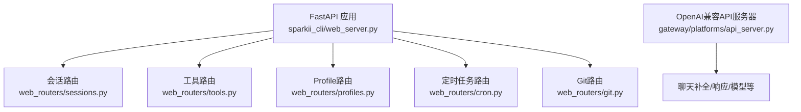
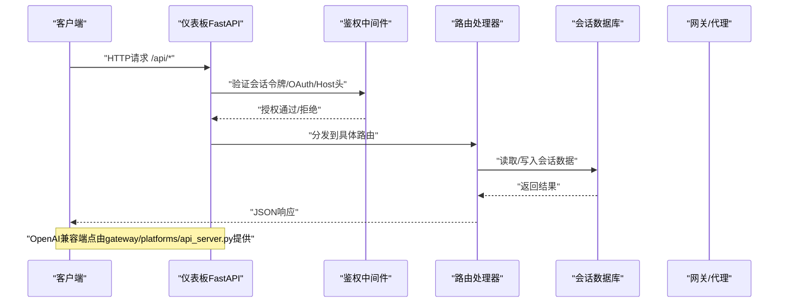
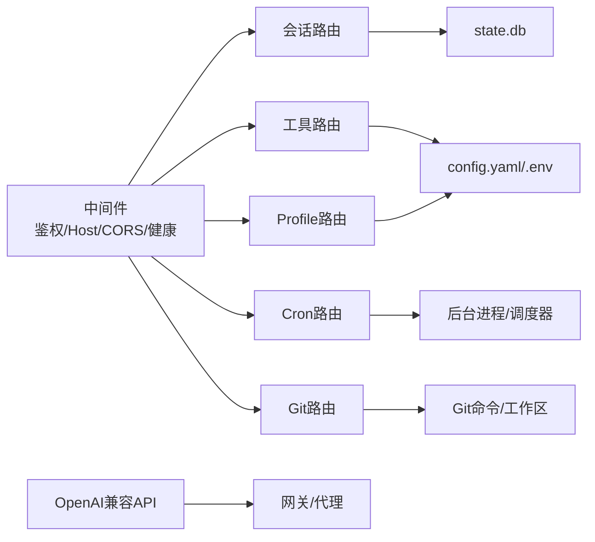

# REST API接口

<cite>
**本文引用的文件**
- [web_server.py](file://sparkii_cli/web_server.py)
- [sessions.py](file://sparkii_cli/web_routers/sessions.py)
- [tools.py](file://sparkii_cli/web_routers/tools.py)
- [profiles.py](file://sparkii_cli/web_routers/profiles.py)
- [cron.py](file://sparkii_cli/web_routers/cron.py)
- [git.py](file://sparkii_cli/web_routers/git.py)
- [api_server.py](file://gateway/platforms/api_server.py)
</cite>

## 目录
1. [简介](#简介)
2. [项目结构](#项目结构)
3. [核心组件](#核心组件)
4. [架构总览](#架构总览)
5. [详细组件分析](#详细组件分析)
6. [依赖关系分析](#依赖关系分析)
7. [性能考虑](#性能考虑)
8. [故障排查指南](#故障排查指南)
9. [结论](#结论)
10. [附录](#附录)

## 简介
本文件面向Web仪表板与外部客户端，系统化说明Sparkii Agent提供的REST API。内容覆盖会话管理、消息发送（文本/图片/文件）、工具调用、配置管理、定时任务、Git操作以及OpenAI兼容的API服务器端点。文档包含：
- 所有HTTP端点的URL路径、支持的HTTP方法、请求参数与响应格式
- 认证与安全机制（会话令牌、OAuth门控、Host头校验）
- 版本控制策略与向后兼容性保证
- 错误处理与状态码约定
- 最佳实践与性能优化建议

## 项目结构
Web仪表板的FastAPI服务由主应用与多个路由模块组成：
- 主应用负责生命周期、中间件（CORS、鉴权、健康监控）、静态资源与前端页面
- 路由模块按功能拆分：会话、工具、配置（Profile）、定时任务、Git等
- 网关侧提供OpenAI兼容的API服务器，暴露聊天补全、响应、模型列表等标准接口

**图表来源**
- [web_server.py:313-378](file://sparkii_cli/web_server.py#L313-L378)
- [sessions.py:53-167](file://sparkii_cli/web_routers/sessions.py#L53-L167)
- [tools.py:57-183](file://sparkii_cli/web_routers/tools.py#L57-L183)
- [profiles.py:79-227](file://sparkii_cli/web_routers/profiles.py#L79-L227)
- [cron.py:52-122](file://sparkii_cli/web_routers/cron.py#L52-L122)
- [git.py:32-139](file://sparkii_cli/web_routers/git.py#L32-L139)
- [api_server.py:1-29](file://gateway/platforms/api_server.py#L1-L29)

**章节来源**
- [web_server.py:313-378](file://sparkii_cli/web_server.py#L313-L378)

## 核心组件
- 认证与安全
  - 会话令牌：通过请求头或查询参数进行鉴权，支持回退到Bearer模式
  - OAuth门控：非回环绑定启用OAuth或密码门控；回环绑定使用注入的会话令牌
  - Host头校验：防止DNS重绑定攻击，仅接受绑定的主机名
  - CORS：限制为本地回环域名
- 健康与自测
  - 健康中间件记录未处理异常与5xx
  - 周期性自测调用受保护的会话列表端点，反馈健康状态
- 路由组织
  - 会话：列表、搜索、详情、消息、导出、批量删除、归档清理等
  - 工具：工具集枚举、配置、模型选择、环境变量保存、终端后端选择、计算机使用权限
  - Profile：创建、激活、重命名、删除、SOUL描述、自动描述、导入导出
  - 定时任务：作业CRUD、运行历史、触发、蓝图实例化、投递目标
  - Git：仓库状态、分支、工作树、审查、提交、推送、PR创建
  - OpenAI兼容：聊天补全、响应、模型列表、能力探测、运行生命周期

**章节来源**
- [web_server.py:398-468](file://sparkii_cli/web_server.py#L398-L468)
- [web_server.py:538-671](file://sparkii_cli/web_server.py#L538-L671)
- [web_server.py:698-800](file://sparkii_cli/web_server.py#L698-L800)

## 架构总览
Web仪表板与OpenAI兼容API服务器共同构成对外HTTP面：
- Web仪表板：面向桌面/浏览器UI，提供会话、工具、配置、定时任务、Git等操作型API
- OpenAI兼容API：面向第三方客户端（如Open WebUI、LobeChat），提供标准化聊天与模型接口

**图表来源**
- [web_server.py:538-671](file://sparkii_cli/web_server.py#L538-L671)
- [sessions.py:53-167](file://sparkii_cli/web_routers/sessions.py#L53-L167)
- [api_server.py:1-29](file://gateway/platforms/api_server.py#L1-L29)

## 详细组件分析

### 会话管理API
- 列出会话
  - GET /api/sessions
  - 查询参数：limit(0-100)、offset(≥0)、min_messages(≥0)、archived(exclude/only/include)、order(created/recent)、source、sources、exclude_sources、cwd_prefix、full(bool)、profile
  - 响应：{sessions[], total, limit, offset}
- 搜索会话
  - GET /api/sessions/search
  - 查询参数：q、limit(≤100)、profile、source、sources、exclude_sources
  - 响应：{results[]}
- 获取会话详情
  - GET /api/sessions/{session_id}?profile=...
  - 响应：会话对象（含profile、is_default_profile等）
- 获取会话消息
  - GET /api/sessions/{session_id}/messages?profile=...&limit=&offset=&order=(oldest|latest)
  - 响应：{session_id, messages[], pagination{limit, offset, order, returned}}
- 导出会话
  - GET /api/sessions/{session_id}/export?profile=...
  - 响应：流式JSON（metadata + messages）
- 批量删除
  - POST /api/sessions/bulk-delete
  - 请求体：{ids[], profile?}
  - 响应：{ok, deleted}
- 清空空会话
  - DELETE /api/sessions/empty?profile=...
  - 响应：{ok, deleted}
- 统计
  - GET /api/sessions/stats?profile=...
  - 响应：{total, active_store, archived, messages, by_source{}}
- 删除单个会话
  - DELETE /api/sessions/{session_id}?profile=...
  - 响应：{ok, already_absent?}
- 更新会话（重命名/归档/置顶）
  - PATCH /api/sessions/{session_id}
  - 请求体：{title?, archived?, pinned?, profile?}
  - 响应：{ok, title?, archived?, pinned?}
- 最新后代会话
  - GET /api/sessions/{session_id}/latest-descendant?profile=...
  - 响应：{requested_session_id, session_id, path[], changed}
- 修剪会话
  - POST /api/sessions/prune
  - 请求体：{profile?, filters...}
  - 响应：根据实现返回删除计数或确认

**章节来源**
- [sessions.py:53-167](file://sparkii_cli/web_routers/sessions.py#L53-L167)
- [sessions.py:169-392](file://sparkii_cli/web_routers/sessions.py#L169-L392)
- [sessions.py:395-788](file://sparkii_cli/web_routers/sessions.py#L395-L788)

### 消息发送API（OpenAI兼容）
- 聊天补全
  - POST /v1/chat/completions
  - 请求体：遵循OpenAI Chat Completions格式，支持text/image_url/input_image等多模态内容；可携带provider/model/model_options等运行时覆盖
  - 响应：标准补全响应；可选SSE流式
- 响应API
  - POST /v1/responses
  - GET /v1/responses/{response_id}
  - DELETE /v1/responses/{response_id}
  - 支持previous_response_id维持上下文；X-Hermes-Session-Key用于长期记忆作用域
- 模型列表
  - GET /v1/models
  - 响应：虚拟模型与别名列表
- 能力探测
  - GET /v1/capabilities
  - 响应：机器可读的能力清单
- 运行生命周期
  - POST /v1/runs → 202 {run_id}
  - GET /v1/runs/{run_id}
  - GET /v1/runs/{run_id}/events (SSE)
  - POST /v1/runs/{run_id}/approval
  - POST /v1/runs/{run_id}/stop
- 多租户前缀（当启用multiplex_profiles）
  - /p/<profile>/v1/...

注意：
- 多模态内容规范化：仅支持text与image_url/input_image；不支持inline file/file_id
- 字符串长度与数组大小有上限保护
- 布尔值解析兼容字符串形式（true/false/yes/no/1/0/on/off）

**章节来源**
- [api_server.py:1-29](file://gateway/platforms/api_server.py#L1-L29)
- [api_server.py:221-244](file://gateway/platforms/api_server.py#L221-L244)
- [api_server.py:477-666](file://gateway/platforms/api_server.py#L477-L666)

### 工具调用API
- 工具集枚举
  - GET /api/tools/toolsets?profile=...
  - 响应：[{name, label, description, platform, platform_label, enabled, available, configured, tools[]}]
- 切换工具集
  - PUT /api/tools/toolsets/{name}?profile=...
  - 请求体：{enabled, profile?}
  - 响应：{ok, name, platform, enabled}
- 工具集配置
  - GET /api/tools/toolsets/{name}/config?profile=...
  - 响应：{name, has_category, providers[], active_provider, ...}
- 工具集模型
  - GET /api/tools/toolsets/{name}/models?provider=&profile=...
  - 响应：{name, has_models, provider, plugin, models[], current, default}
- 选择模型
  - PUT /api/tools/toolsets/{name}/model?profile=...
  - 请求体：{model, provider?, profile?}
  - 响应：{ok, name, model, plugin}
- 选择提供者
  - PUT /api/tools/toolsets/{name}/provider?profile=...
  - 请求体：{provider, capability?(search|extract), profile?}
  - 响应：{ok, name, provider, capability?, needs_nous_auth?, feature?}
- 保存环境变量（API密钥）
  - PUT /api/tools/toolsets/{name}/env?profile=...
  - 请求体：{env{}, profile?}
  - 响应：{ok, name, saved[], skipped[], is_set{}}
- 后安装钩子
  - POST /api/tools/toolsets/{name}/post-setup?profile=...
  - 请求体：{key, profile?}
  - 响应：{ok, pid, name, key}
- 终端后端
  - GET /api/tools/terminal/backends?profile=...
  - 响应：{active, backends[]}
  - PUT /api/tools/terminal/backend?profile=...
  - 请求体：{backend, profile?}
  - 响应：{ok, backend}
- 计算机使用
  - GET /api/tools/computer-use/status?profile=...
  - POST /api/tools/computer-use/permissions/grant?profile=...
  - 响应：平台相关状态或后台进程PID

**章节来源**
- [tools.py:57-183](file://sparkii_cli/web_routers/tools.py#L57-L183)
- [tools.py:186-299](file://sparkii_cli/web_routers/tools.py#L186-L299)
- [tools.py:301-417](file://sparkii_cli/web_routers/tools.py#L301-L417)
- [tools.py:419-559](file://sparkii_cli/web_routers/tools.py#L419-L559)
- [tools.py:561-668](file://sparkii_cli/web_routers/tools.py#L561-L668)
- [tools.py:670-785](file://sparkii_cli/web_routers/tools.py#L670-L785)

### 配置管理API（Profile）
- 列出Profile
  - GET /api/profiles
  - 响应：{profiles[]}
- 创建Profile
  - POST /api/profiles
  - 请求体：{name, clone_from?, clone_all?, no_skills?, description?, provider?, model?, mcp_servers?, keep_skills?, hub_skills[]}
  - 响应：{ok, name, path, model_set, mcp_written, skills_disabled, hub_installs[]}
- 统一会话列表（跨Profile）
  - GET /api/profiles/sessions?limit=&offset=&min_messages=&archived=&order=&profile=all|name&source=&sources=&exclude_sources=&full=
  - 响应：{sessions[], total, profile_totals{}, limit, offset, errors[]}
- 侧边栏聚合
  - GET /api/profiles/sessions/sidebar?recents_profile=&recents_limit=&recents_exclude=&cron_limit=&messaging_limit=&messaging_exclude=
  - 响应：{recents:{sessions[], profiles_truncated{}}, cron:{sessions[]}, messaging:{sessions[], total}, errors[]}
- 活跃Profile
  - GET /api/profiles/active
  - 响应：{active, current}
  - POST /api/profiles/active
  - 请求体：{name}
  - 响应：{ok, active}
- Profile元信息
  - GET /api/profiles/{name}/setup-command
  - POST /api/profiles/{name}/open-terminal
  - PATCH /api/profiles/{name}
  - 请求体：{new_name}
  - 响应：{ok, name, path}
  - DELETE /api/profiles/{name}
  - 响应：{ok, path}
- SOUL描述
  - GET /api/profiles/{name}/soul
  - 响应：{content, exists}
  - PUT /api/profiles/{name}/soul
  - 请求体：{content}
  - 响应：{ok}
- 角色描述
  - PUT /api/profiles/{name}/description
  - 请求体：{description}
  - 响应：{ok, description, description_auto}
- 模型设置
  - PUT /api/profiles/{name}/model
  - 请求体：{provider, model}
  - 响应：{ok, provider, model}
- 自动描述
  - POST /api/profiles/{name}/describe-auto
  - 请求体：{overwrite}
  - 响应：{ok, reason, description, description_auto}
- 导入导出
  - POST /api/profiles/{name}/export
  - 请求体：{output?, extra_files?}
  - 响应：{ok, archive}
  - POST /api/profiles/import
  - 请求体：{archive, name?}
  - 响应：{ok, path}

**章节来源**
- [profiles.py:79-227](file://sparkii_cli/web_routers/profiles.py#L79-L227)
- [profiles.py:229-370](file://sparkii_cli/web_routers/profiles.py#L229-L370)
- [profiles.py:373-517](file://sparkii_cli/web_routers/profiles.py#L373-L517)
- [profiles.py:519-740](file://sparkii_cli/web_routers/profiles.py#L519-L740)
- [profiles.py:742-800](file://sparkii_cli/web_routers/profiles.py#L742-L800)

### 定时任务API（Cron）
- 作业管理
  - GET /api/cron/jobs?profile=all|name
  - GET /api/cron/jobs/{job_id}?profile=...
  - POST /api/cron/jobs
  - 请求体：{...}
  - PUT /api/cron/jobs/{job_id}
  - 请求体：{...}
  - DELETE /api/cron/jobs/{job_id}
- 运行历史
  - GET /api/cron/jobs/{job_id}/runs?profile=...&limit=20
- 控制
  - POST /api/cron/jobs/{job_id}/pause
  - POST /api/cron/jobs/{job_id}/resume
  - POST /api/cron/jobs/{job_id}/trigger
- 投递目标
  - GET /api/cron/delivery-targets
  - 响应：{targets[]}
- 蓝图
  - GET /api/cron/blueprints
  - 响应：{blueprints[]}
  - POST /api/cron/blueprints/instantiate
  - 请求体：{blueprint, values, profile=default}
  - 响应：作业创建结果
- 外部触发（NAS→Agent）
  - POST /api/cron/fire
  - 认证：Bearer JWT（由Chronos签发）
  - 请求体：{job_id}
  - 响应：202 {status:"accepted", job_id} 或 200 {status:"gone", job_id}

**章节来源**
- [cron.py:52-122](file://sparkii_cli/web_routers/cron.py#L52-L122)
- [cron.py:125-182](file://sparkii_cli/web_routers/cron.py#L125-L182)
- [cron.py:184-246](file://sparkii_cli/web_routers/cron.py#L184-L246)

### Git操作API
- 状态与工作区
  - GET /api/git/status?path=...
  - GET /api/git/worktrees?path=...
  - GET /api/git/branches?path=...
  - GET /api/git/base-branches?path=...
- 审查与差异
  - GET /api/git/review/list?path=&scope=&base=
  - GET /api/git/review/diff?path=&file=&scope=&base=&staged=
  - GET /api/git/file-diff?path=&file=
  - GET /api/git/review/commit-context?path=
  - GET /api/git/review/rev-parse?path=&ref=
  - GET /api/git/review/ship-info?path=
- 提交与推送
  - POST /api/git/review/stage
  - POST /api/git/review/unstage
  - POST /api/git/review/revert
  - POST /api/git/review/commit
  - POST /api/git/review/push
  - POST /api/git/review/create-pr
- 工作树与分支
  - POST /api/git/worktree/add
  - POST /api/git/worktree/remove
  - POST /api/git/branch/switch

**章节来源**
- [git.py:32-139](file://sparkii_cli/web_routers/git.py#L32-L139)

## 依赖关系分析
- 路由与中间件
  - FastAPI应用注册CORS、Host头校验、鉴权中间件、插件API门控、健康监控
  - 路由模块通过late-binding访问web_server中的辅助函数与常量，避免循环依赖
- 数据访问
  - 会话与Profile路由直接读写SQLite state.db（读路径尽量只读，写路径在事务中执行）
  - 工具与Profile配置持久化到config.yaml与.env
- 外部集成
  - OpenAI兼容API服务器通过aiohttp提供HTTP服务，内部调用网关/代理执行agent任务
  - Cron外部触发通过JWT鉴权，后台异步执行作业

**图表来源**
- [web_server.py:373-671](file://sparkii_cli/web_server.py#L373-L671)
- [sessions.py:53-167](file://sparkii_cli/web_routers/sessions.py#L53-L167)
- [tools.py:57-183](file://sparkii_cli/web_routers/tools.py#L57-L183)
- [profiles.py:79-227](file://sparkii_cli/web_routers/profiles.py#L79-L227)
- [cron.py:52-122](file://sparkii_cli/web_routers/cron.py#L52-L122)
- [git.py:32-139](file://sparkii_cli/web_routers/git.py#L32-L139)
- [api_server.py:1-29](file://gateway/platforms/api_server.py#L1-L29)

**章节来源**
- [web_server.py:373-671](file://sparkii_cli/web_server.py#L373-L671)

## 性能考虑
- 分页与限流
  - 会话列表默认limit=20，最大100；搜索limit最大100；跨Profile列表最大500
  - 消息分页默认最近页，limit上限500，避免加载整个对话
- 只读优化
  - 列表与搜索使用只读连接；大会话导出采用键集分页（after_id）
- 并发与线程池
  - 耗时I/O（DB/配置/子进程）通过asyncio.to_thread或run_in_executor执行，避免阻塞事件循环
- 缓存与预热
  - 启动时预导入重型模块，减少首次请求冷启动延迟
- 资源限制
  - 多模态输入限制文本长度与数组大小；请求体大小限制（OpenAI兼容API默认10MB）
- 健康与自测
  - 健康中间件记录异常；周期性自测确保受保护端点可用

[本节为通用指导，不直接分析具体文件]

## 故障排查指南
- 常见错误
  - 401 Unauthorized：缺少或无效会话令牌；非回环绑定需OAuth登录
  - 400 Bad Request：参数校验失败（如archived/order取值、未知toolset/env键）
  - 404 Not Found：会话不存在、Profile不存在、蓝图未知
  - 422 Unprocessable Entity：蓝图字段校验失败
  - 500 Internal Server Error：内部异常（DB/配置/子进程失败）
- 诊断要点
  - 检查Host头是否匹配绑定地址
  - 确认CORS允许的来源
  - 查看健康端点与自测结果
  - 关注日志中的“profile session read failed”警告
- 恢复步骤
  - 修正请求参数或认证头
  - 重试受保护端点并携带正确令牌
  - 对长时间运行的任务（post-setup/permissions grant）轮询其状态

**章节来源**
- [web_server.py:398-468](file://sparkii_cli/web_server.py#L398-L468)
- [web_server.py:538-671](file://sparkii_cli/web_server.py#L538-L671)
- [profiles.py:41-59](file://sparkii_cli/web_routers/profiles.py#L41-L59)

## 结论
本API体系以FastAPI为核心，结合模块化路由与严格的鉴权中间件，提供完整的Web仪表板能力与OpenAI兼容接口。通过分页、只读优化、线程池与预热策略保障性能；通过明确的错误码与健壮性设计提升可用性。建议客户端遵循分页与限流约定，谨慎处理认证与Host头，利用健康与自测端点进行运维监控。

[本节为总结，不直接分析具体文件]

## 附录

### 认证与安全
- 会话令牌
  - 头部：X-Hermes-Session-Token
  - 回退：Authorization: Bearer <token>
  - 部分下载端点支持查询参数token
- OAuth门控
  - 非回环绑定启用；回环绑定使用注入令牌
- Host头校验
  - 仅接受绑定地址或回环别名
- CORS
  - 仅允许localhost/127.0.0.1

**章节来源**
- [web_server.py:398-468](file://sparkii_cli/web_server.py#L398-L468)
- [web_server.py:538-566](file://sparkii_cli/web_server.py#L538-L566)
- [web_server.py:644-671](file://sparkii_cli/web_server.py#L644-L671)

### 版本控制与兼容性
- 仪表板API
  - 通过路由与参数白名单保持向后兼容；新增字段通常可选
- OpenAI兼容API
  - 遵循OpenAI协议；对布尔值与多模态内容做宽松解析以提升兼容性
- 多租户前缀
  - 启用multiplex_profiles时，通过/p/<profile>/前缀隔离不同Profile

**章节来源**
- [api_server.py:221-244](file://gateway/platforms/api_server.py#L221-L244)
- [api_server.py:1-29](file://gateway/platforms/api_server.py#L1-L29)

### 最佳实践
- 使用分页与最小必要字段（full=false）减少负载
- 优先使用只读端点进行浏览与搜索
- 对长任务使用后台进程+状态轮询模式
- 严格校验请求参数，避免非法值导致400
- 在非回环部署中使用OAuth门控，避免暴露敏感端点

[本节为通用指导，不直接分析具体文件]