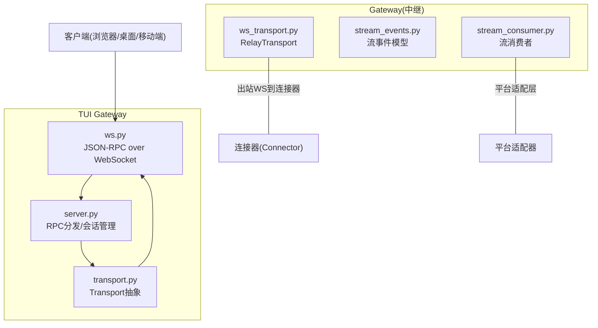
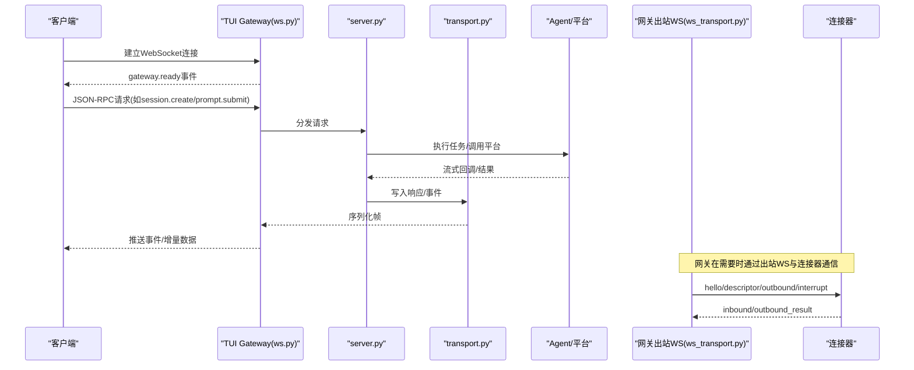
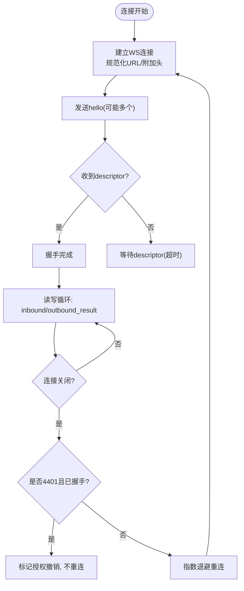
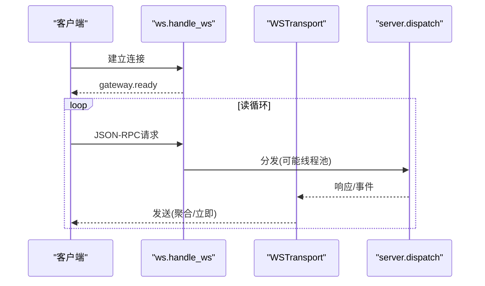
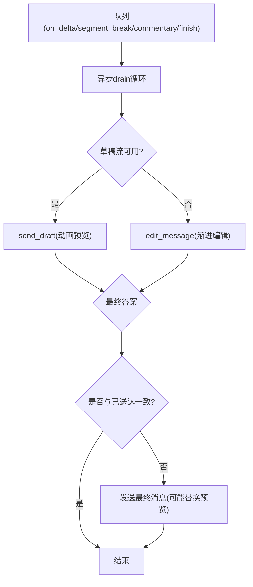
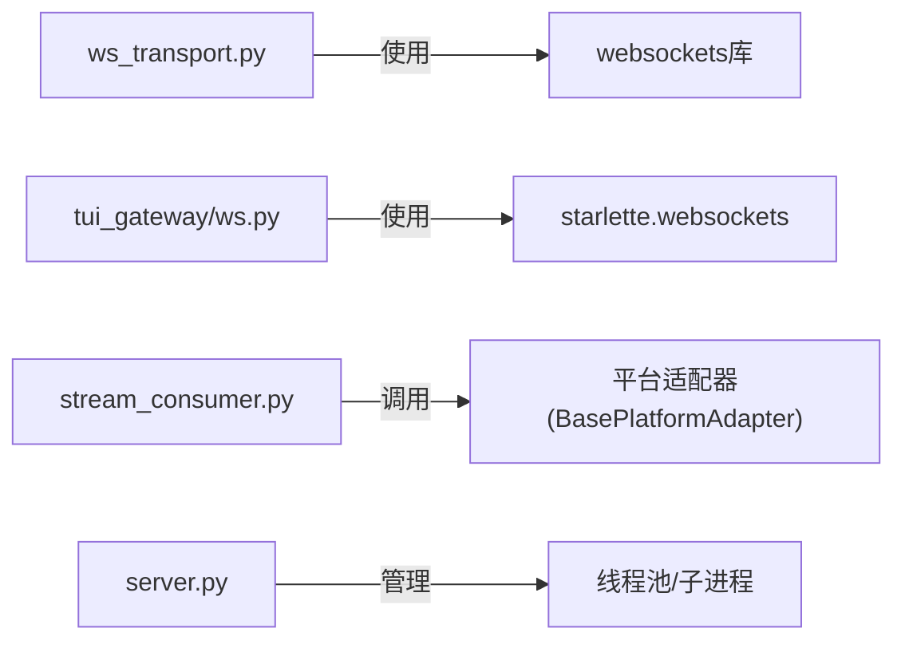

# WebSocket实时通信

<cite>
**本文引用的文件**
- [gateway/relay/ws_transport.py](file://gateway/relay/ws_transport.py)
- [tui_gateway/ws.py](file://tui_gateway/ws.py)
- [tui_gateway/transport.py](file://tui_gateway/transport.py)
- [gateway/stream_events.py](file://gateway/stream_events.py)
- [gateway/stream_consumer.py](file://gateway/stream_consumer.py)
- [tui_gateway/server.py](file://tui_gateway/server.py)
</cite>

## 目录
1. [简介](#简介)
2. [项目结构](#项目结构)
3. [核心组件](#核心组件)
4. [架构总览](#架构总览)
5. [详细组件分析](#详细组件分析)
6. [依赖关系分析](#依赖关系分析)
7. [性能考虑](#性能考虑)
8. [故障排查指南](#故障排查指南)
9. [结论](#结论)
10. [附录：客户端实现要点与示例指引](#附录客户端实现要点与示例指引)

## 简介
本指南面向需要在系统中接入WebSocket实时通信的开发者，覆盖连接建立、握手协议、消息格式、流式响应、事件订阅/发布、连接管理与重连、错误处理与恢复策略，以及性能优化与调试方法。系统包含两类WebSocket能力：
- 网关到连接器（Connector）的出站WebSocket：用于跨平台消息中继、能力协商、请求/响应与中断控制。
- TUI Gateway的JSON-RPC over WebSocket：用于桌面端/前端与后端服务进行双向RPC调用与事件推送。

## 项目结构
与WebSocket相关的关键模块分布如下：
- 网关侧出站WebSocket传输：负责与连接器建立WS连接、握手、帧收发、重连、鉴权等。
- TUI Gateway WebSocket服务端：接收客户端连接、处理JSON-RPC请求、推送事件、流式token聚合与发送。
- 传输抽象：统一stdio与WS的写入接口，便于同一调度逻辑复用。
- 流式事件模型：定义结构化事件类型，供消费端按平台渲染。
- 流式消费者：将同步回调转为异步任务，逐步编辑或发送消息，支持草稿流、溢出拆分、最终一致性等。

**图表来源**
- [tui_gateway/ws.py:1-477](file://tui_gateway/ws.py#L1-L477)
- [tui_gateway/transport.py:1-220](file://tui_gateway/transport.py#L1-L220)
- [tui_gateway/server.py:1-800](file://tui_gateway/server.py#L1-L800)
- [gateway/relay/ws_transport.py:1-903](file://gateway/relay/ws_transport.py#L1-L903)
- [gateway/stream_events.py:1-172](file://gateway/stream_events.py#L1-L172)
- [gateway/stream_consumer.py:1-800](file://gateway/stream_consumer.py#L1-L800)

**章节来源**
- [tui_gateway/ws.py:1-477](file://tui_gateway/ws.py#L1-L477)
- [tui_gateway/transport.py:1-220](file://tui_gateway/transport.py#L1-L220)
- [tui_gateway/server.py:1-800](file://tui_gateway/server.py#L1-L800)
- [gateway/relay/ws_transport.py:1-903](file://gateway/relay/ws_transport.py#L1-L903)
- [gateway/stream_events.py:1-172](file://gateway/stream_events.py#L1-L172)
- [gateway/stream_consumer.py:1-800](file://gateway/stream_consumer.py#L1-L800)

## 核心组件
- 出站WebSocket传输（RelayTransport）
  - 负责与连接器建立WS连接、发送hello并等待descriptor能力描述、发送outbound请求并等待outbound_result、处理inbound事件、中断、缓冲翻转（going_idle）、断线重连、授权撤销检测（4401）。
- TUI Gateway WebSocket服务端
  - 接受连接、发送gateway.ready事件、解析JSON-RPC请求、分发到server.dispatch、写回响应或事件；对高频token事件做聚合与Nagle禁用，保障低延迟。
- 传输抽象（Transport）
  - 统一write/close接口，支持StdioTransport与TeeTransport，使同一调度逻辑可复用于不同I/O通道。
- 流式事件模型（Stream Events）
  - 定义MessageChunk/MessageStop/Commentary/ToolCallChunk/ToolCallFinished/LongToolHint/GatewayNotice等结构化事件，解耦“内容”和“呈现”。
- 流式消费者（GatewayStreamConsumer）
  - 将同步回调转为异步任务，按平台能力选择草稿流或渐进编辑，处理溢出拆分、最终一致性、去重、思考标签过滤等。

**章节来源**
- [gateway/relay/ws_transport.py:339-903](file://gateway/relay/ws_transport.py#L339-L903)
- [tui_gateway/ws.py:70-477](file://tui_gateway/ws.py#L70-L477)
- [tui_gateway/transport.py:66-220](file://tui_gateway/transport.py#L66-L220)
- [gateway/stream_events.py:41-172](file://gateway/stream_events.py#L41-L172)
- [gateway/stream_consumer.py:156-800](file://gateway/stream_consumer.py#L156-L800)

## 架构总览
下图展示从客户端到TUI Gateway再到Agent/平台的整体数据流，以及网关到连接器的出站WS链路。

**图表来源**
- [tui_gateway/ws.py:286-477](file://tui_gateway/ws.py#L286-L477)
- [tui_gateway/server.py:184-296](file://tui_gateway/server.py#L184-L296)
- [tui_gateway/transport.py:100-220](file://tui_gateway/transport.py#L100-L220)
- [gateway/relay/ws_transport.py:441-541](file://gateway/relay/ws_transport.py#L441-L541)

## 详细组件分析

### 出站WebSocket传输（RelayTransport）
- 连接与握手
  - URL规范化为ws(s)://…/relay；可选携带Authorization头（基于每实例密钥生成令牌）。
  - 发送hello（含platform/botId），等待descriptor能力描述；支持多身份（Phase 1.5）。
- 请求/响应
  - outbound请求携带requestId，阻塞等待匹配的outbound_result；超时返回失败。
- 入站事件
  - 解析inbound为MessageEvent，支持上下文、回复引用、平台命令归一化等。
- 缓冲翻转与休眠
  - going_idle切换为仅缓冲投递；go_dormant配合scale-to-zero挂起，唤醒后重拨并回放缓冲。
- 重连与授权撤销
  - 非预期关闭触发指数退避重连；若收到4401且已握手成功，则视为授权撤销，停止重连。

**图表来源**
- [gateway/relay/ws_transport.py:69-95](file://gateway/relay/ws_transport.py#L69-L95)
- [gateway/relay/ws_transport.py:441-541](file://gateway/relay/ws_transport.py#L441-L541)
- [gateway/relay/ws_transport.py:609-678](file://gateway/relay/ws_transport.py#L609-L678)
- [gateway/relay/ws_transport.py:731-800](file://gateway/relay/ws_transport.py#L731-L800)

**章节来源**
- [gateway/relay/ws_transport.py:69-95](file://gateway/relay/ws_transport.py#L69-L95)
- [gateway/relay/ws_transport.py:339-541](file://gateway/relay/ws_transport.py#L339-L541)
- [gateway/relay/ws_transport.py:567-724](file://gateway/relay/ws_transport.py#L567-L724)
- [gateway/relay/ws_transport.py:609-678](file://gateway/relay/ws_transport.py#L609-L678)
- [gateway/relay/ws_transport.py:731-800](file://gateway/relay/ws_transport.py#L731-L800)

### TUI Gateway WebSocket服务端
- 连接生命周期
  - 接受连接、禁用Nagle、发送gateway.ready（含skin与change_events标志）。
- 请求处理
  - 读取文本行，解析JSON-RPC；异常返回标准错误码；慢方法走线程池避免阻塞读循环。
- 流式token聚合
  - 高频delta事件（message/reasoning/thinking.delta）聚合缓冲，定时批量发送，降低事件循环开销。
- 写路径保护
  - 线程安全写、锁保护、超时保护、错误日志与关闭状态标记。

**图表来源**
- [tui_gateway/ws.py:286-477](file://tui_gateway/ws.py#L286-L477)
- [tui_gateway/ws.py:70-256](file://tui_gateway/ws.py#L70-L256)
- [tui_gateway/server.py:184-296](file://tui_gateway/server.py#L184-L296)

**章节来源**
- [tui_gateway/ws.py:70-256](file://tui_gateway/ws.py#L70-L256)
- [tui_gateway/ws.py:286-477](file://tui_gateway/ws.py#L286-L477)
- [tui_gateway/server.py:184-296](file://tui_gateway/server.py#L184-L296)

### 传输抽象（Transport）
- StdioTransport：向stdout逐行输出JSON，区分“对端消失”与真实IO错误。
- TeeTransport：主通道+若干旁路广播，保证主通道优先，旁路失败不影响主流程。
- 上下文绑定：通过contextvars在当前请求上下文中绑定当前Transport，确保多线程/协程正确路由。

**章节来源**
- [tui_gateway/transport.py:66-220](file://tui_gateway/transport.py#L66-L220)

### 流式事件模型（Stream Events）
- 消息类：MessageChunk（增量文本）、MessageStop（段落结束/最终结束）、Commentary（完整中间消息）。
- 工具调用类：ToolCallChunk（开始/进行中）、ToolCallFinished（结束，含时长/成功标志）。
- 控制类：LongToolHint（长耗时提示）、GatewayNotice（网关控制消息）。
- 设计原则：事件只描述“发生了什么”，不决定“如何呈现”，由网关根据平台能力渲染。

**章节来源**
- [gateway/stream_events.py:41-172](file://gateway/stream_events.py#L41-L172)

### 流式消费者（GatewayStreamConsumer）
- 输入：来自Agent的同步回调（on_delta/on_segment_break/on_commentary/finish）。
- 处理：队列+异步任务，按平台能力选择草稿流或渐进编辑；处理溢出拆分、最终一致性、去重、思考标签过滤。
- 输出：通过平台适配器发送/编辑消息；必要时删除预览消息并以最终消息替代。

**图表来源**
- [gateway/stream_consumer.py:156-800](file://gateway/stream_consumer.py#L156-L800)

**章节来源**
- [gateway/stream_consumer.py:156-800](file://gateway/stream_consumer.py#L156-L800)

## 依赖关系分析
- ws_transport.py依赖websockets库（可选导入），提供出站WS能力。
- tui_gateway/ws.py依赖Starlette的WebSocket（可选导入），兼容不同环境。
- stream_consumer.py依赖平台适配器接口（BasePlatformAdapter），以统一方式发送/编辑消息。
- server.py维护RPC线程池、会话、子进程（slash worker）等资源，确保长时间操作不阻塞读循环。

**图表来源**
- [gateway/relay/ws_transport.py:46-51](file://gateway/relay/ws_transport.py#L46-L51)
- [tui_gateway/ws.py:62-67](file://tui_gateway/ws.py#L62-L67)
- [gateway/stream_consumer.py:27-34](file://gateway/stream_consumer.py#L27-L34)
- [tui_gateway/server.py:184-296](file://tui_gateway/server.py#L184-L296)

**章节来源**
- [gateway/relay/ws_transport.py:46-51](file://gateway/relay/ws_transport.py#L46-L51)
- [tui_gateway/ws.py:62-67](file://tui_gateway/ws.py#L62-L67)
- [gateway/stream_consumer.py:27-34](file://gateway/stream_consumer.py#L27-L34)
- [tui_gateway/server.py:184-296](file://tui_gateway/server.py#L184-L296)

## 性能考虑
- 出站WS（RelayTransport）
  - 超时配置：握手与outbound均有超时，避免阻塞。
  - 重连策略：指数退避，避免雪崩；授权撤销（4401）后不再重连。
  - 缓冲翻转：going_idle/go_dormant减少活跃连接时的负载，支持scale-to-zero。
- TUI Gateway
  - 禁用Nagle：小帧即时发出，保持token节奏。
  - Token聚合：高频delta事件聚合发送，降低事件循环与GIL竞争。
  - 线程池：慢方法走线程池，避免阻塞读循环。
- 流式消费者
  - 草稿流优先：原生草稿动画体验更好；失败自动降级为渐进编辑。
  - 溢出拆分：超长内容拆分为多条消息，最终一致性替换预览。
  - 自适应退避：连续编辑失败时调整间隔，避免被限流。

[本节为通用指导，无需特定文件来源]

## 故障排查指南
- 连接问题
  - 检查URL规范化是否正确（scheme与路径），确认连接器挂载路径为/relay。
  - 若启用鉴权，确认gateway_id与upgrade_secret配置正确。
- 握手失败
  - 观察descriptor是否按时到达；检查hello中platform/botId是否匹配。
- 授权撤销（4401）
  - 若握手成功后收到4401，视为凭证撤销，应停止重连并上报“已禁用”状态。
- 请求超时
  - outbound请求超过超时未收到outbound_result，需检查网络与连接器状态。
- TUI Gateway
  - 解析错误：返回标准JSON-RPC错误码，查看日志中的payload前缀。
  - 写失败：关注peer断开、socket错误、超时等日志，确认客户端存活。
  - 慢方法阻塞：确认是否命中长方法列表，必要时调整线程池大小。

**章节来源**
- [gateway/relay/ws_transport.py:69-95](file://gateway/relay/ws_transport.py#L69-L95)
- [gateway/relay/ws_transport.py:441-541](file://gateway/relay/ws_transport.py#L441-L541)
- [gateway/relay/ws_transport.py:731-800](file://gateway/relay/ws_transport.py#L731-L800)
- [tui_gateway/ws.py:339-477](file://tui_gateway/ws.py#L339-L477)
- [tui_gateway/server.py:184-296](file://tui_gateway/server.py#L184-L296)

## 结论
本系统提供了两套WebSocket能力：面向连接器的出站WS用于跨平台消息中继与能力协商；面向客户端的JSON-RPC over WebSocket用于实时交互与事件推送。通过结构化流事件与消费者，系统在多平台上实现了稳定、高效、可扩展的实时通信。建议在生产环境中合理配置超时、重连与鉴权参数，并结合日志与监控持续优化性能与稳定性。

[本节为总结性内容，无需特定文件来源]

## 附录：客户端实现要点与示例指引
- JavaScript（浏览器）
  - 使用WebSocket API连接到TUI Gateway的WS端点；监听gateway.ready事件；发送JSON-RPC请求并处理响应/事件；对高频delta事件做节流与渲染。
  - 参考：[tui_gateway/ws.py:286-477](file://tui_gateway/ws.py#L286-L477)
- Python（脚本/服务）
  - 使用websockets库连接出站WS（连接器）；发送hello并等待descriptor；发送outbound并等待outbound_result；处理inbound与interrupt。
  - 参考：[gateway/relay/ws_transport.py:441-724](file://gateway/relay/ws_transport.py#L441-L724)
- Node.js（服务/桥接）
  - 作为中间层转发JSON-RPC与事件；聚合高频delta；实现重试与重连；记录指标与日志。
  - 参考：[tui_gateway/ws.py:70-256](file://tui_gateway/ws.py#L70-L256)

[本节为通用指引，具体代码示例请参照上述文件路径中的实现模式]