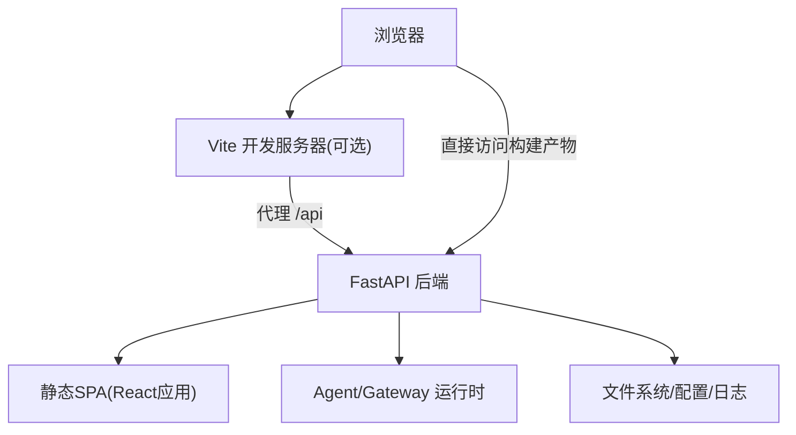
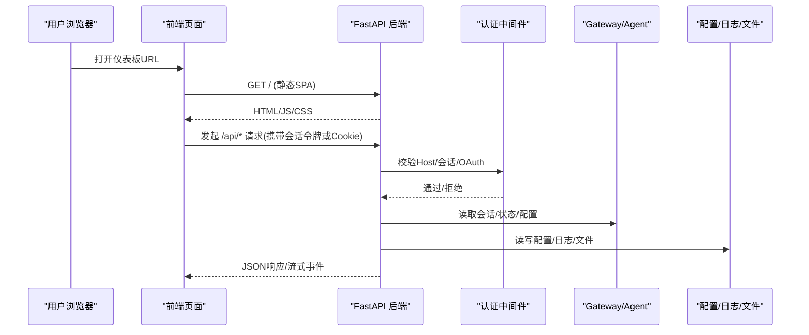
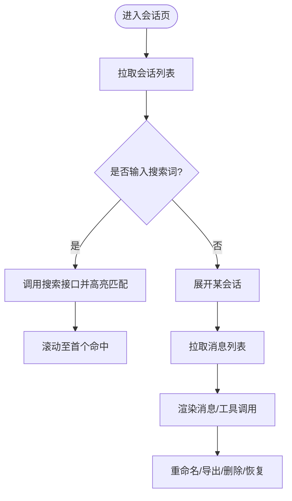
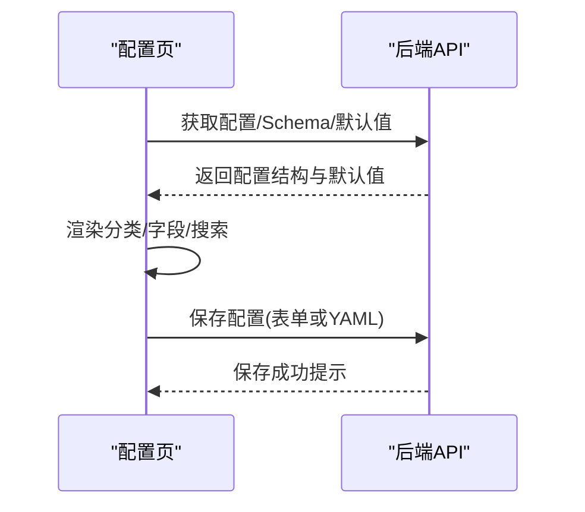
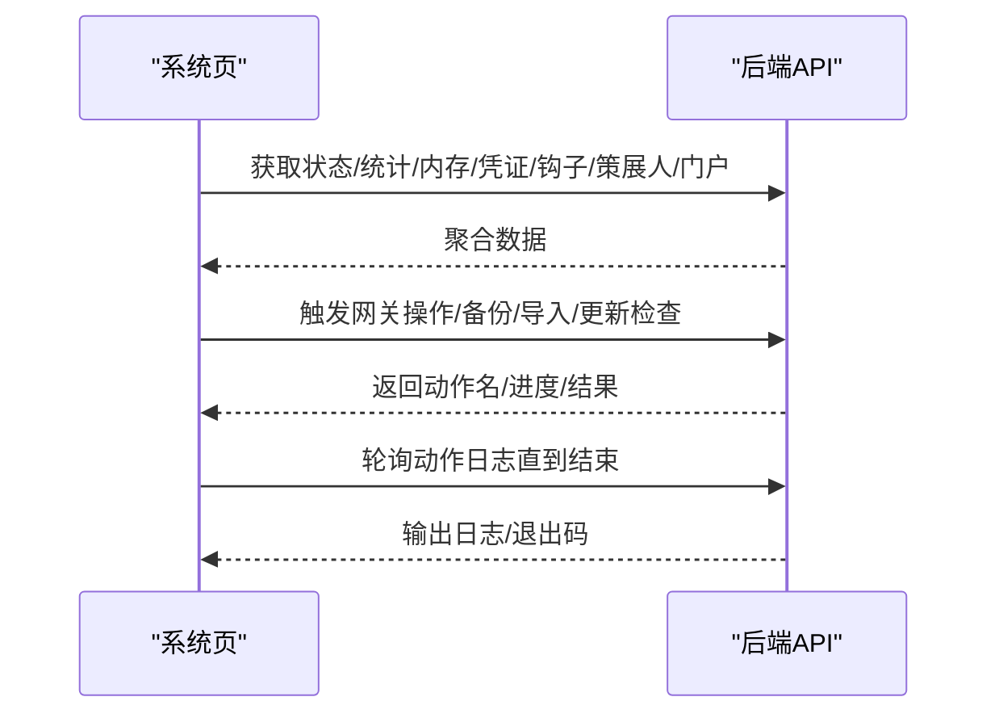
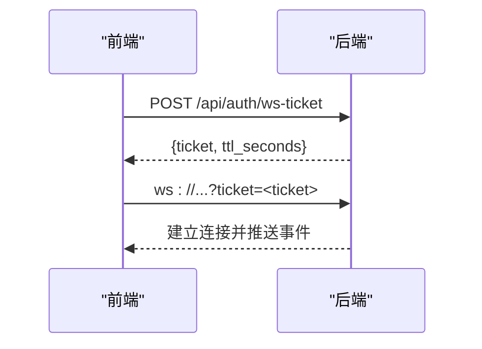
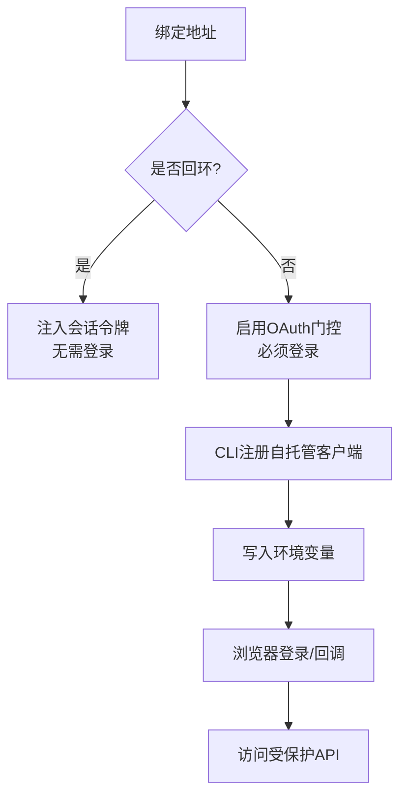
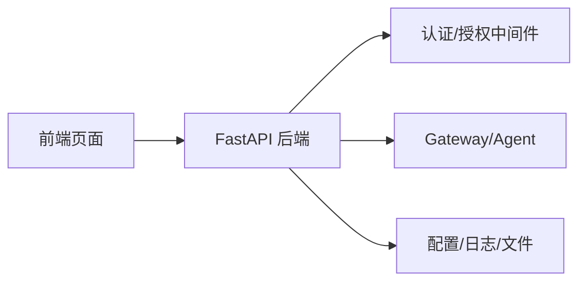

# Web仪表板使用指南

<cite>
**本文引用的文件**
- [web/README.md](file://web/README.md)
- [sparkii_cli/web_server.py](file://sparkii_cli/web_server.py)
- [web/src/lib/api.ts](file://web/src/lib/api.ts)
- [web/src/pages/SessionsPage.tsx](file://web/src/pages/SessionsPage.tsx)
- [web/src/pages/ConfigPage.tsx](file://web/src/pages/ConfigPage.tsx)
- [web/src/pages/SystemPage.tsx](file://web/src/pages/SystemPage.tsx)
- [sparkii_cli/dashboard_register.py](file://sparkii_cli/dashboard_register.py)
- [sparkii_cli/dashboard_auth/__init__.py](file://sparkii_cli/dashboard_auth/__init__.py)
</cite>

## 目录
1. [简介](#简介)
2. [项目结构](#项目结构)
3. [核心组件](#核心组件)
4. [架构总览](#架构总览)
5. [详细组件分析](#详细组件分析)
6. [依赖关系分析](#依赖关系分析)
7. [性能与可用性](#性能与可用性)
8. [故障排查指南](#故障排查指南)
9. [结论](#结论)
10. [附录：API速查与安全配置](#附录api速查与安全配置)

## 简介
本指南面向通过浏览器访问 Sparkii Web 仪表板的用户，覆盖本地与远程部署的访问方式、会话管理、实时监控、配置管理、模型切换、工具调用结果查看、日志与系统状态、以及安全与权限等主题。文档基于仓库中的前端页面、后端服务与安全中间件实现进行说明，并提供可操作的步骤与最佳实践。

## 项目结构
Web 仪表板由前后端两部分组成：
- 前端：Vite + React + TypeScript，提供会话、配置、系统监控等页面。
- 后端：FastAPI 服务，提供 REST API、WebSocket 实时通道、静态 SPA 资源托管与安全鉴权中间件。

图表来源
- [web/README.md:11-36](file://web/README.md#L11-L36)
- [sparkii_cli/web_server.py:313-378](file://sparkii_cli/web_server.py#L313-L378)

章节来源
- [web/README.md:11-36](file://web/README.md#L11-L36)

## 核心组件
- Web 服务与路由：提供静态页面、REST API、WebSocket 事件通道、健康自检与自动归档等后台任务。
- 认证与授权：支持回环模式（注入会话令牌）与非回环模式（OAuth 门控），并限制 Host 头防 DNS 重绑定。
- 前端 API 客户端：统一封装 fetch 请求、会话令牌注入、Gated 模式的 WS ticket 获取与 URL 构建。
- 页面模块：会话管理、配置编辑、系统监控、日志查看、模型与工具管理等。

章节来源
- [sparkii_cli/web_server.py:313-378](file://sparkii_cli/web_server.py#L313-L378)
- [web/src/lib/api.ts:102-183](file://web/src/lib/api.ts#L102-L183)
- [web/src/lib/api.ts:190-283](file://web/src/lib/api.ts#L190-L283)

## 架构总览
下图展示浏览器到后端的请求路径、认证流程与数据流向。

图表来源
- [sparkii_cli/web_server.py:398-468](file://sparkii_cli/web_server.py#L398-L468)
- [sparkii_cli/web_server.py:538-671](file://sparkii_cli/web_server.py#L538-L671)
- [web/src/lib/api.ts:102-183](file://web/src/lib/api.ts#L102-L183)

## 详细组件分析

### 访问与启动
- 本地开发
  - 启动后端服务：运行命令以开启 FastAPI 服务。
  - 启动前端开发服务器：安装依赖并运行 dev 命令，默认代理 /api 到后端。
  - 打开终端输出的 Vite URL（通常为 localhost 端口）。
- 生产/远程部署
  - 构建前端产物并交由后端作为静态资源提供。
  - 非回环绑定（如 0.0.0.0）将启用 OAuth 门控；需完成注册与登录。

章节来源
- [web/README.md:11-36](file://web/README.md#L11-L36)
- [sparkii_cli/web_server.py:313-378](file://sparkii_cli/web_server.py#L313-L378)

### 会话管理（创建、查看、搜索）
- 列表与分页：支持按来源分类（聊天/自动化）、分页浏览、批量选择。
- 展开详情：点击会话行加载消息列表，支持 Markdown 渲染与工具调用折叠查看。
- 搜索与高亮：输入关键词对消息内容进行搜索匹配并滚动至首个命中位置。
- 操作：重命名、导出、删除、在聊天中恢复继续对话。

图表来源
- [web/src/pages/SessionsPage.tsx:464-759](file://web/src/pages/SessionsPage.tsx#L464-L759)
- [web/src/lib/api.ts:372-459](file://web/src/lib/api.ts#L372-L459)

章节来源
- [web/src/pages/SessionsPage.tsx:464-759](file://web/src/pages/SessionsPage.tsx#L464-L759)
- [web/src/lib/api.ts:372-459](file://web/src/lib/api.ts#L372-L459)

### 配置管理（动态表单与YAML）
- 动态字段：根据后端 schema 渲染分组与字段，支持类别筛选与搜索。
- 保存与重置：支持保存当前配置、按范围重置为默认值、导入/导出 JSON。
- 原始 YAML：可切换到原始 YAML 视图并直接保存。

图表来源
- [web/src/pages/ConfigPage.tsx:164-222](file://web/src/pages/ConfigPage.tsx#L164-L222)
- [web/src/pages/ConfigPage.tsx:279-306](file://web/src/pages/ConfigPage.tsx#L279-L306)
- [web/src/lib/api.ts:511-575](file://web/src/lib/api.ts#L511-L575)

章节来源
- [web/src/pages/ConfigPage.tsx:164-222](file://web/src/pages/ConfigPage.tsx#L164-L222)
- [web/src/pages/ConfigPage.tsx:279-306](file://web/src/pages/ConfigPage.tsx#L279-L306)
- [web/src/lib/api.ts:511-575](file://web/src/lib/api.ts#L511-L575)

### 模型切换与工具调用
- 模型信息/选项：查询可用模型、辅助模型、MOA 配置，设置模型分配。
- 工具集：查看/启停工具集、选择提供者、设置环境变量、执行后置脚本。
- 会话内工具调用：在会话消息中查看工具调用名称、参数与结果。

章节来源
- [web/src/lib/api.ts:515-559](file://web/src/lib/api.ts#L515-L559)
- [web/src/lib/api.ts:738-800](file://web/src/lib/api.ts#L738-L800)
- [web/src/pages/SessionsPage.tsx:197-237](file://web/src/pages/SessionsPage.tsx#L197-L237)

### 实时监控与系统状态
- 系统概览：网关状态、版本更新检查、内存/凭证池/钩子/策展人/门户状态。
- 生命周期控制：启动/停止/重启网关，查看后台动作日志。
- 备份与导入：创建备份、下载、从上传或路径导入（含确认流程）。
- 调试分享：一键生成脱敏链接便于问题定位。

图表来源
- [web/src/pages/SystemPage.tsx:255-285](file://web/src/pages/SystemPage.tsx#L255-L285)
- [web/src/pages/SystemPage.tsx:287-305](file://web/src/pages/SystemPage.tsx#L287-L305)
- [web/src/pages/SystemPage.tsx:393-462](file://web/src/pages/SystemPage.tsx#L393-L462)
- [web/src/pages/SystemPage.tsx:491-509](file://web/src/pages/SystemPage.tsx#L491-L509)

章节来源
- [web/src/pages/SystemPage.tsx:255-285](file://web/src/pages/SystemPage.tsx#L255-L285)
- [web/src/pages/SystemPage.tsx:287-305](file://web/src/pages/SystemPage.tsx#L287-L305)
- [web/src/pages/SystemPage.tsx:393-462](file://web/src/pages/SystemPage.tsx#L393-L462)
- [web/src/pages/SystemPage.tsx:491-509](file://web/src/pages/SystemPage.tsx#L491-L509)

### WebSocket 实时通信
- Gated 模式：先通过 REST 获取一次性 ticket，再用于 WS 升级。
- 回环模式：直接使用注入的会话令牌。
- 统一构建：前端封装了 WS URL 构建与鉴权参数注入。

图表来源
- [web/src/lib/api.ts:190-225](file://web/src/lib/api.ts#L190-L225)
- [web/src/lib/api.ts:227-283](file://web/src/lib/api.ts#L227-L283)

章节来源
- [web/src/lib/api.ts:190-225](file://web/src/lib/api.ts#L190-L225)
- [web/src/lib/api.ts:227-283](file://web/src/lib/api.ts#L227-L283)

### 安全配置与权限管理
- 回环模式：仅允许 localhost/127.0.0.1/::1，注入临时会话令牌，适合本机使用。
- 非回环模式：强制启用 OAuth 门控，需完成注册与登录；禁止不安全的 --insecure 绕过。
- Host 头校验：防止 DNS 重绑定攻击。
- 公共路径白名单：仅最小化只读接口对外暴露。
- 自托管仪表盘注册：通过 CLI 自动向门户注册客户端并写入环境变量。

图表来源
- [sparkii_cli/web_server.py:461-491](file://sparkii_cli/web_server.py#L461-L491)
- [sparkii_cli/web_server.py:538-671](file://sparkii_cli/web_server.py#L538-L671)
- [sparkii_cli/dashboard_register.py:230-428](file://sparkii_cli/dashboard_register.py#L230-L428)
- [sparkii_cli/dashboard_auth/__init__.py:1-49](file://sparkii_cli/dashboard_auth/__init__.py#L1-L49)

章节来源
- [sparkii_cli/web_server.py:461-491](file://sparkii_cli/web_server.py#L461-L491)
- [sparkii_cli/web_server.py:538-671](file://sparkii_cli/web_server.py#L538-L671)
- [sparkii_cli/dashboard_register.py:230-428](file://sparkii_cli/dashboard_register.py#L230-L428)
- [sparkii_cli/dashboard_auth/__init__.py:1-49](file://sparkii_cli/dashboard_auth/__init__.py#L1-L49)

## 依赖关系分析
- 前端依赖后端 API：所有页面通过统一的 API 客户端发起请求，处理 401 跳转登录与令牌刷新。
- 后端依赖 Gateway/Agent：读取会话、状态、配置、日志等。
- 安全中间件链：Host 头校验 → OAuth 门控 → 会话令牌校验 → 插件路由启用/禁用检查。

图表来源
- [web/src/lib/api.ts:102-183](file://web/src/lib/api.ts#L102-L183)
- [sparkii_cli/web_server.py:538-671](file://sparkii_cli/web_server.py#L538-L671)

章节来源
- [web/src/lib/api.ts:102-183](file://web/src/lib/api.ts#L102-L183)
- [sparkii_cli/web_server.py:538-671](file://sparkii_cli/web_server.py#L538-L671)

## 性能与可用性
- 冷启动优化：后端启动时预加载关键模块，避免首次请求阻塞事件循环。
- 健康自检：周期性对受保护接口发起内部请求，反馈组件健康状态。
- 自动归档：后台定时清理过期会话，降低存储压力。
- 前端缓存与懒加载：会话详情按需加载，减少首屏负担。

章节来源
- [sparkii_cli/web_server.py:171-234](file://sparkii_cli/web_server.py#L171-L234)
- [sparkii_cli/web_server.py:771-800](file://sparkii_cli/web_server.py#L771-L800)

## 故障排查指南
- 401 未授权
  - 回环模式：可能是会话令牌过期，前端会尝试重新加载页面以获取新令牌。
  - Gated 模式：检查 Cookie 会话是否有效，必要时重新登录。
- Host 头错误
  - 确保浏览器访问的主机名与服务绑定的主机一致，避免 DNS 重绑定。
- 无法访问受保护接口
  - 确认已正确注册自托管仪表盘并写入环境变量，且服务已重启生效。
- 日志与诊断
  - 使用系统页的动作日志查看器跟踪后台任务（备份、导入、更新等）。
  - 使用调试分享功能生成脱敏链接以便协作排障。

章节来源
- [web/src/lib/api.ts:123-183](file://web/src/lib/api.ts#L123-L183)
- [sparkii_cli/web_server.py:538-566](file://sparkii_cli/web_server.py#L538-L566)
- [web/src/pages/SystemPage.tsx:93-164](file://web/src/pages/SystemPage.tsx#L93-L164)
- [web/src/pages/SystemPage.tsx:491-509](file://web/src/pages/SystemPage.tsx#L491-L509)

## 结论
Sparkii Web 仪表板提供了完整的会话管理、配置编辑、系统监控与实时通信能力，并通过严格的安全策略保障本地与远程使用的安全性。建议在生产环境启用 OAuth 门控，结合定期备份与日志审计，确保稳定可靠运行。

## 附录：API速查与安全配置

### 常用 API 端点（前端封装）
- 会话
  - 列表/详情/消息/统计/导出/导入/修剪/批量删除/重命名
- 配置与环境
  - 获取/保存配置、获取 Schema/默认值、原始 YAML 读写、环境变量增删改查
- 模型与工具
  - 模型信息/选项/分配、辅助模型/MOA 配置、工具集启停/配置/环境变量
- 系统
  - 状态/统计/内存/凭证池/钩子/策展人/门户、网关生命周期、备份/导入、更新检查
- 认证
  - 获取身份、登出、WS Ticket

章节来源
- [web/src/lib/api.ts:337-800](file://web/src/lib/api.ts#L337-L800)

### 安全配置要点
- 绑定地址
  - 回环地址：localhost/127.0.0.1/::1，无需登录。
  - 非回环地址：强制启用 OAuth 门控，必须登录。
- Host 头校验
  - 仅接受与服务绑定主机匹配的 Host 头，防御 DNS 重绑定。
- 公共路径白名单
  - 仅最小化只读接口对外暴露，其他 /api/* 均需鉴权。
- 自托管仪表盘注册
  - 使用 CLI 自动注册客户端并写入环境变量，随后在服务端重启后生效。

章节来源
- [sparkii_cli/web_server.py:461-491](file://sparkii_cli/web_server.py#L461-L491)
- [sparkii_cli/web_server.py:538-671](file://sparkii_cli/web_server.py#L538-L671)
- [sparkii_cli/dashboard_register.py:230-428](file://sparkii_cli/dashboard_register.py#L230-L428)