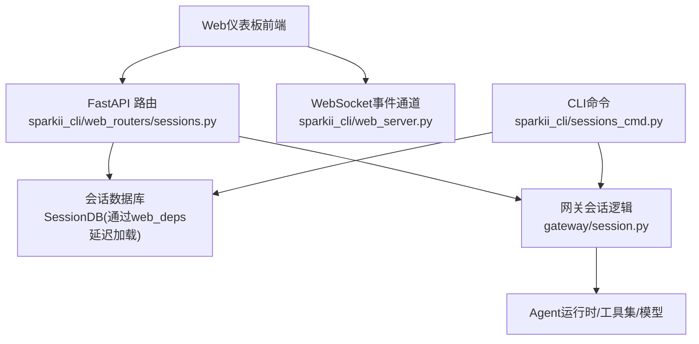
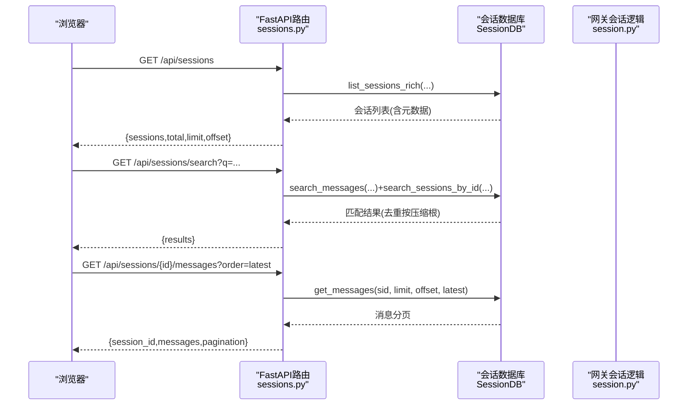
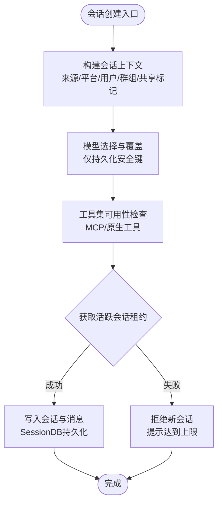
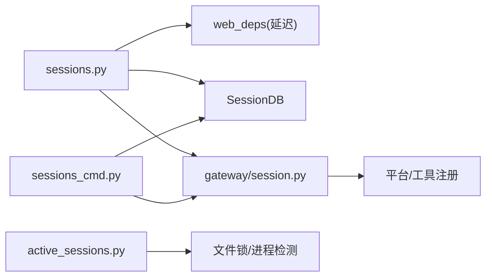

# 会话创建

<cite>
**本文引用的文件**
- [sparkii_cli/web_routers/sessions.py](file://sparkii_cli/web_routers/sessions.py)
- [gateway/session.py](file://gateway/session.py)
- [sparkii_cli/active_sessions.py](file://sparkii_cli/active_sessions.py)
- [sparkii_cli/sessions_cmd.py](file://sparkii_cli/sessions_cmd.py)
- [sparkii_cli/web_server.py](file://sparkii_cli/web_server.py)
</cite>

## 目录
1. [简介](#简介)
2. [项目结构](#项目结构)
3. [核心组件](#核心组件)
4. [架构总览](#架构总览)
5. [详细组件分析](#详细组件分析)
6. [依赖关系分析](#依赖关系分析)
7. [性能注意事项](#性能注意事项)
8. [故障排查指南](#故障排查指南)
9. [结论](#结论)
10. [附录](#附录)

## 简介
本指南面向Web仪表板用户，聚焦“会话创建”相关能力与最佳实践。内容涵盖：
- 基本会话创建流程（从前端到后端、再到网关的调用链）
- 会话命名规范与元数据约定
- 模型选择界面操作要点
- 高级配置选项（工具集选择、系统提示词、上下文参数等）
- 不同会话类型的初始化方式（普通对话、批量任务、自动化工作流）
- 会话模板与预设的使用方法
- 错误处理与常见问题解决方案

说明：本仓库未提供“新建会话”的直接REST端点；会话通常由平台入口（如CLI/TUI、消息平台、Cron任务或自动化流程）触发并持久化。Web仪表板侧主要提供会话列表、搜索、详情、重命名、归档、导出、删除等管理能力。因此，本节将基于现有代码梳理“如何创建合适的会话”以及“如何在仪表板中管理与复用”。

## 项目结构
围绕会话创建与管理的关键路径如下：
- Web路由层：提供会话查询、搜索、管理接口（列表、详情、消息、重命名、归档、导入、统计、删除等）。
- 网关层：负责会话上下文构建、动态系统提示注入、会话键与ID映射、自动续期策略等。
- 活跃会话租约：跨进程并发控制，避免过多会话同时运行导致资源耗尽。
- CLI命令：提供会话恢复、修复、导出、删除等操作，便于运维与批量处理。
- Web服务：FastAPI后端，承载静态页面与API，并在桌面模式下启动内置调度器。

图表来源
- [sparkii_cli/web_routers/sessions.py:53-166](file://sparkii_cli/web_routers/sessions.py#L53-L166)
- [sparkii_cli/web_routers/sessions.py:169-392](file://sparkii_cli/web_routers/sessions.py#L169-L392)
- [sparkii_cli/web_routers/sessions.py:555-652](file://sparkii_cli/web_routers/sessions.py#L555-L652)
- [gateway/session.py:148-346](file://gateway/session.py#L148-L346)
- [sparkii_cli/web_server.py:1-10](file://sparkii_cli/web_server.py#L1-L10)

章节来源
- [sparkii_cli/web_routers/sessions.py:53-166](file://sparkii_cli/web_routers/sessions.py#L53-L166)
- [sparkii_cli/web_routers/sessions.py:169-392](file://sparkii_cli/web_routers/sessions.py#L169-L392)
- [sparkii_cli/web_routers/sessions.py:555-652](file://sparkii_cli/web_routers/sessions.py#L555-L652)
- [gateway/session.py:148-346](file://gateway/session.py#L148-L346)
- [sparkii_cli/web_server.py:1-10](file://sparkii_cli/web_server.py#L1-L10)

## 核心组件
- Web会话路由：提供会话列表、搜索、详情、消息分页、重命名/归档/置顶、导入、统计、删除等能力。
- 网关会话上下文：定义会话来源、平台信息、多用户共享、动态系统提示注入、模型覆盖持久化键白名单等。
- 活跃会话租约：跨进程并发限制，防止过多会话同时占用资源。
- CLI会话命令：支持修复、恢复、导出、删除、归档等，便于批量与离线维护。
- Web服务：FastAPI后端，集成CORS、静态资源、事件通道，并在桌面模式启动cron调度。

章节来源
- [sparkii_cli/web_routers/sessions.py:53-166](file://sparkii_cli/web_routers/sessions.py#L53-L166)
- [gateway/session.py:148-346](file://gateway/session.py#L148-L346)
- [sparkii_cli/active_sessions.py:271-334](file://sparkii_cli/active_sessions.py#L271-L334)
- [sparkii_cli/sessions_cmd.py:227-312](file://sparkii_cli/sessions_cmd.py#L227-L312)
- [sparkii_cli/web_server.py:1-10](file://sparkii_cli/web_server.py#L1-L10)

## 架构总览
下图展示从Web仪表板发起会话相关请求时的典型调用链，包括列表、搜索、详情与消息读取。

图表来源
- [sparkii_cli/web_routers/sessions.py:53-166](file://sparkii_cli/web_routers/sessions.py#L53-L166)
- [sparkii_cli/web_routers/sessions.py:169-392](file://sparkii_cli/web_routers/sessions.py#L169-L392)
- [sparkii_cli/web_routers/sessions.py:601-652](file://sparkii_cli/web_routers/sessions.py#L601-L652)

## 详细组件分析

### 会话创建流程（从入口到持久化）
- 入口来源：会话可由CLI/TUI、消息平台（如Slack/Discord）、Cron任务或自动化工作流触发。这些入口在网关层构造会话上下文并生成会话键与ID。
- 上下文构建：网关根据来源平台、聊天类型、用户/群组信息、是否多用户共享等，构建会话上下文，并动态注入系统提示中的上下文片段。
- 模型与工具：会话可携带模型覆盖（仅允许持久化的键），工具集由平台与MCP注册情况决定。
- 并发控制：通过活跃会话租约限制同时运行的会话数量，避免资源耗尽。

图表来源
- [gateway/session.py:148-346](file://gateway/session.py#L148-L346)
- [gateway/session.py:748-770](file://gateway/session.py#L748-L770)
- [sparkii_cli/active_sessions.py:271-334](file://sparkii_cli/active_sessions.py#L271-L334)

章节来源
- [gateway/session.py:148-346](file://gateway/session.py#L148-L346)
- [gateway/session.py:748-770](file://gateway/session.py#L748-L770)
- [sparkii_cli/active_sessions.py:271-334](file://sparkii_cli/active_sessions.py#L271-L334)

### 会话命名规范与元数据
- 标题与预览：会话可设置标题用于展示；列表与搜索返回中包含预览字段，便于快速识别。
- 来源与模型：每条会话记录包含source与model字段，便于筛选与统计。
- 时间戳与活动：started_at、last_active、ended_at用于排序与活跃度判断。
- 归档与置顶：支持软归档与置顶，便于长期保留重要会话。

章节来源
- [sparkii_cli/web_routers/sessions.py:53-166](file://sparkii_cli/web_routers/sessions.py#L53-L166)
- [sparkii_cli/web_routers/sessions.py:555-575](file://sparkii_cli/web_routers/sessions.py#L555-L575)
- [sparkii_cli/web_routers/sessions.py:683-719](file://sparkii_cli/web_routers/sessions.py#L683-L719)

### 模型选择界面操作
- 模型覆盖持久化：仅允许持久化安全的模型覆盖键（如model、provider、base_url），敏感信息不写入会话文件。
- 运行时解析：重启后凭据通过运行时提供者重新解析，确保安全性。
- 工具集影响：某些平台（如Slack/Discord）的工具可用性会影响系统提示中的能力说明。

章节来源
- [gateway/session.py:748-770](file://gateway/session.py#L748-L770)
- [gateway/session.py:360-443](file://gateway/session.py#L360-L443)

### 高级配置选项
- 工具集选择：通过平台工具集与MCP服务器注册情况决定可用工具；系统提示会如实反映当前会话的能力边界。
- 系统提示词：网关会在系统提示中注入会话上下文（来源、平台、多用户标记、交付目标等），保证Agent理解上下文。
- 上下文参数：会话上下文包含平台、聊天类型、用户/群组、线程、作用域、是否多用户共享等，驱动路由与行为。

章节来源
- [gateway/session.py:479-745](file://gateway/session.py#L479-L745)
- [gateway/session.py:148-346](file://gateway/session.py#L148-L346)

### 不同会话类型的初始化
- 普通对话：由CLI/TUI或消息平台直接发起，进入标准会话生命周期。
- 批量任务：可通过CLI导出/归档/清理进行批处理；也可通过Cron定时任务触发。
- 自动化工作流：桌面模式下Web服务会启动内置cron调度器，支持定时任务执行。

章节来源
- [sparkii_cli/sessions_cmd.py:227-312](file://sparkii_cli/sessions_cmd.py#L227-L312)
- [sparkii_cli/web_server.py:150-168](file://sparkii_cli/web_server.py#L150-L168)

### 会话模板与预设
- 模板化建议：由于没有直接的“新建会话”端点，推荐通过CLI或自动化脚本以固定参数（模型、工具集、系统提示）创建会话，形成“模板”。
- 预设复用：使用相同的来源与上下文参数组合，配合会话标题与归档策略，实现可复用的会话模板。
- 导出与导入：支持导出单个或多会话为JSON/Markdown/HTML，便于分享与复用；也支持导入已导出的会话。

章节来源
- [sparkii_cli/web_routers/sessions.py:448-471](file://sparkii_cli/web_routers/sessions.py#L448-L471)
- [sparkii_cli/sessions_cmd.py:313-438](file://sparkii_cli/sessions_cmd.py#L313-L438)

## 依赖关系分析
- Web路由依赖延迟加载的web_helpers，避免循环依赖并保持测试兼容性。
- 网关会话模块依赖平台注册、工具注册与配置加载，动态决定能力与提示。
- 活跃会话租约依赖文件系统锁与进程存活检测，确保跨进程一致性。
- CLI命令依赖状态数据库与恢复工具，提供离线修复与迁移能力。

图表来源
- [sparkii_cli/web_routers/sessions.py:25-50](file://sparkii_cli/web_routers/sessions.py#L25-L50)
- [gateway/session.py:360-443](file://gateway/session.py#L360-L443)
- [sparkii_cli/active_sessions.py:129-179](file://sparkii_cli/active_sessions.py#L129-L179)
- [sparkii_cli/sessions_cmd.py:227-312](file://sparkii_cli/sessions_cmd.py#L227-L312)

章节来源
- [sparkii_cli/web_routers/sessions.py:25-50](file://sparkii_cli/web_routers/sessions.py#L25-L50)
- [gateway/session.py:360-443](file://gateway/session.py#L360-L443)
- [sparkii_cli/active_sessions.py:129-179](file://sparkii_cli/active_sessions.py#L129-L179)
- [sparkii_cli/sessions_cmd.py:227-312](file://sparkii_cli/sessions_cmd.py#L227-L312)

## 性能注意事项
- 列表与搜索分页：列表默认限制条数，搜索对FTS查询进行前缀通配与去重，避免大结果集拖慢响应。
- 消息分页：消息接口强制分页，默认返回最新一页，防止超大会话导致内存压力。
- 导出流式：单会话导出采用流式传输，按主键分页拉取消息，降低峰值内存。
- 并发限制：活跃会话租约限制最大并发会话数，避免资源争用。

章节来源
- [sparkii_cli/web_routers/sessions.py:53-166](file://sparkii_cli/web_routers/sessions.py#L53-L166)
- [sparkii_cli/web_routers/sessions.py:169-392](file://sparkii_cli/web_routers/sessions.py#L169-L392)
- [sparkii_cli/web_routers/sessions.py:601-652](file://sparkii_cli/web_routers/sessions.py#L601-L652)
- [sparkii_cli/web_routers/sessions.py:722-781](file://sparkii_cli/web_routers/sessions.py#L722-L781)
- [sparkii_cli/active_sessions.py:271-334](file://sparkii_cli/active_sessions.py#L271-L334)

## 故障排查指南
- 会话不存在：详情与消息接口在找不到会话时返回404；删除接口对已缺失ID视为幂等成功。
- 搜索失败：搜索接口捕获异常并返回统一错误；请检查查询字符串与过滤条件。
- 并发超限：当活跃会话达到上限时，新会话会被拒绝并返回提示信息；需等待其他会话结束或调整并发限制。
- 数据库问题：CLI提供修复与恢复命令，可在离线模式下重建或验证会话数据库。

章节来源
- [sparkii_cli/web_routers/sessions.py:555-575](file://sparkii_cli/web_routers/sessions.py#L555-L575)
- [sparkii_cli/web_routers/sessions.py:655-680](file://sparkii_cli/web_routers/sessions.py#L655-L680)
- [sparkii_cli/web_routers/sessions.py:169-392](file://sparkii_cli/web_routers/sessions.py#L169-L392)
- [sparkii_cli/active_sessions.py:271-334](file://sparkii_cli/active_sessions.py#L271-L334)
- [sparkii_cli/sessions_cmd.py:67-225](file://sparkii_cli/sessions_cmd.py#L67-L225)

## 结论
- 会话创建主要由网关与入口（CLI/平台/Cron/自动化）完成；Web仪表板侧重会话的管理与复用。
- 通过合理的命名、模型覆盖、工具集与上下文配置，可以创建符合场景的会话。
- 利用导出/导入与CLI批处理能力，可实现会话模板与预设的落地。
- 关注并发限制与性能优化，确保大规模会话下的稳定性。

## 附录
- 常用操作速查：
  - 列出会话：GET /api/sessions
  - 搜索会话：GET /api/sessions/search
  - 查看会话详情：GET /api/sessions/{id}
  - 读取消息：GET /api/sessions/{id}/messages
  - 重命名/归档/置顶：PATCH /api/sessions/{id}
  - 导入会话：POST /api/sessions/import
  - 删除会话：DELETE /api/sessions/{id}
  - 批量删除：POST /api/sessions/bulk-delete
  - 清理空会话：DELETE /api/sessions/empty
  - 统计信息：GET /api/sessions/stats

章节来源
- [sparkii_cli/web_routers/sessions.py:53-166](file://sparkii_cli/web_routers/sessions.py#L53-L166)
- [sparkii_cli/web_routers/sessions.py:169-392](file://sparkii_cli/web_routers/sessions.py#L169-L392)
- [sparkii_cli/web_routers/sessions.py:395-520](file://sparkii_cli/web_routers/sessions.py#L395-L520)
- [sparkii_cli/web_routers/sessions.py:523-575](file://sparkii_cli/web_routers/sessions.py#L523-L575)
- [sparkii_cli/web_routers/sessions.py:655-719](file://sparkii_cli/web_routers/sessions.py#L655-L719)