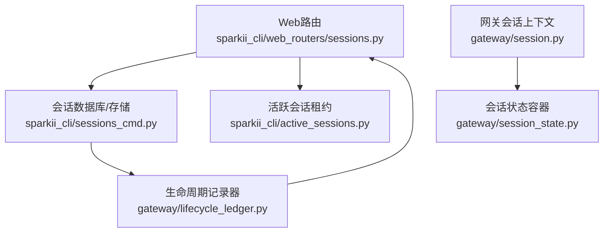
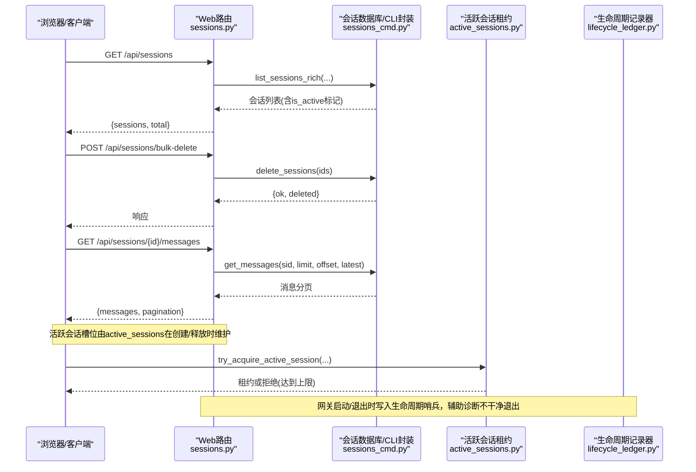
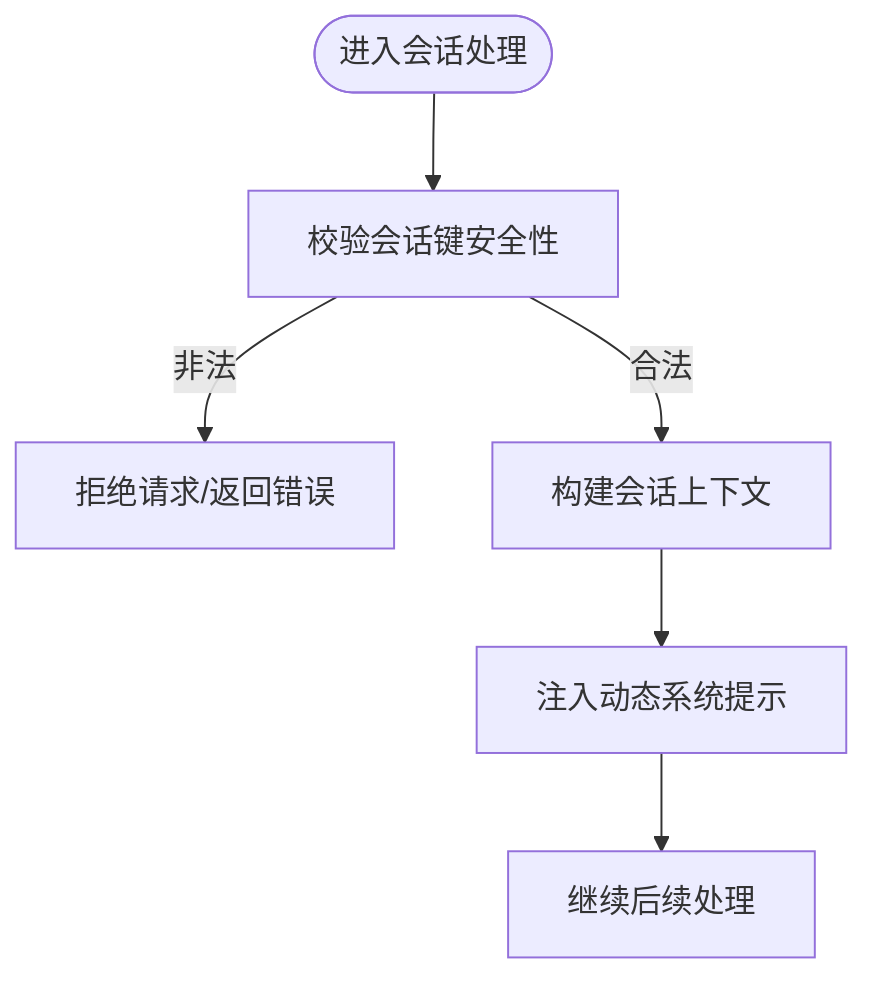
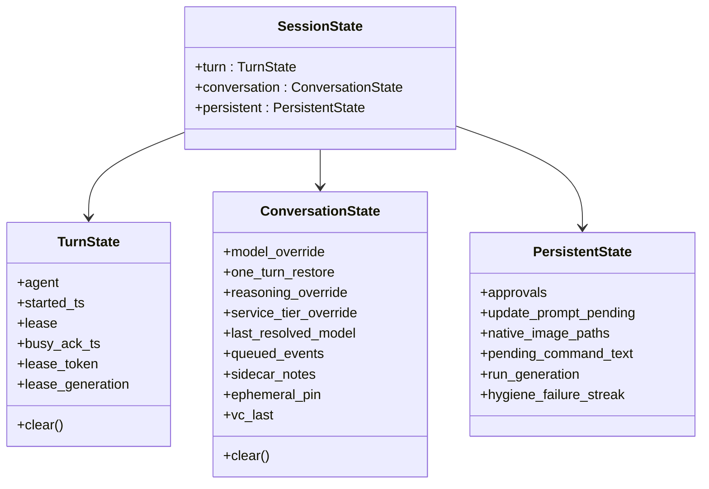
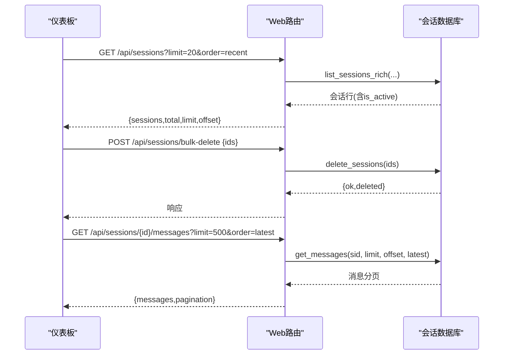
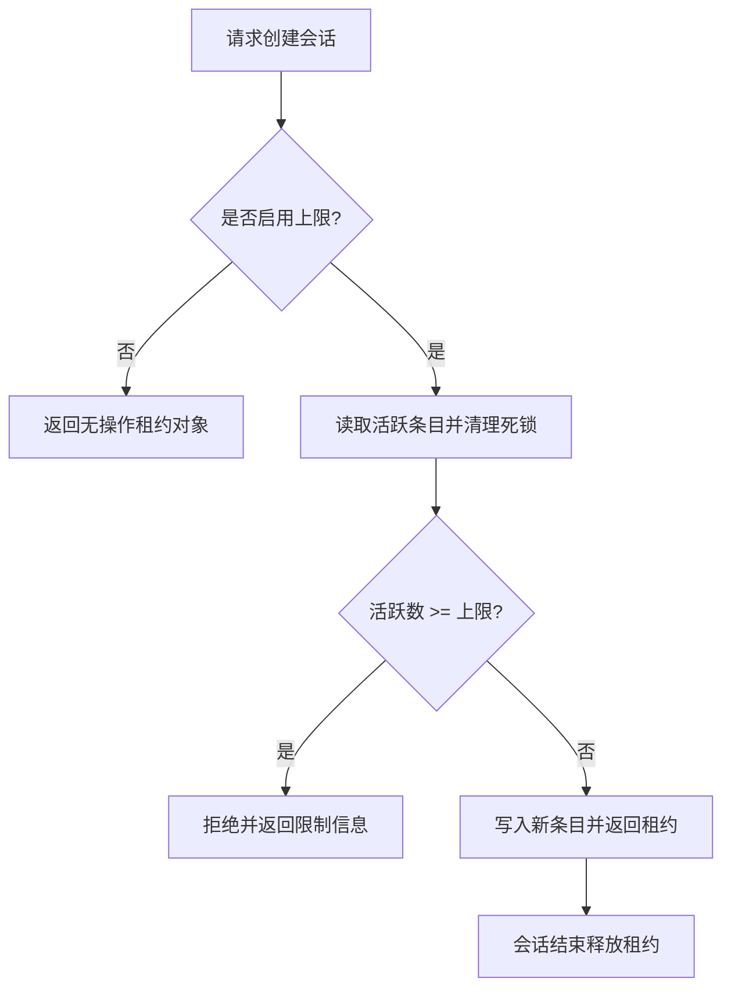
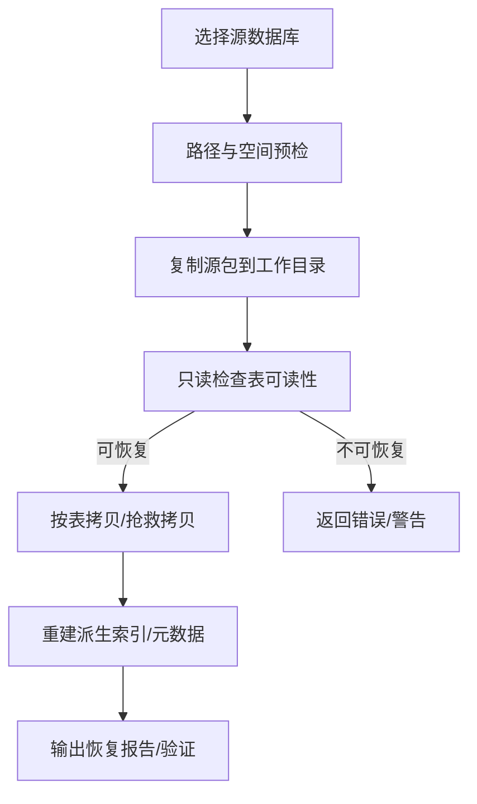
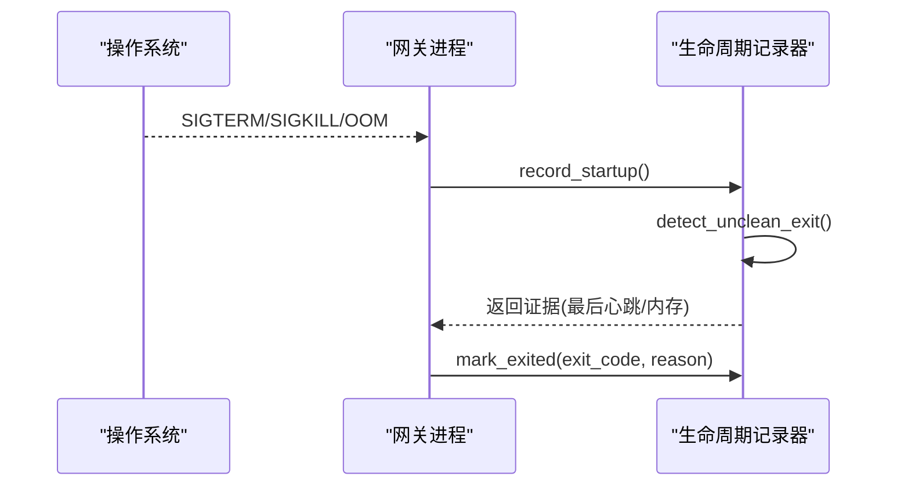
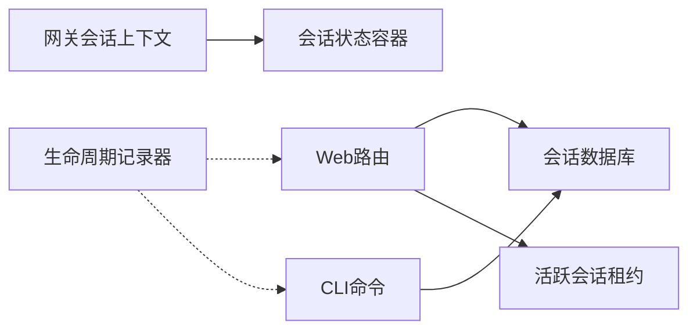

# 会话生命周期管理

<cite>
**本文引用的文件**
- [gateway/session.py](file://gateway/session.py)
- [gateway/session_state.py](file://gateway/session_state.py)
- [sparkii_cli/web_routers/sessions.py](file://sparkii_cli/web_routers/sessions.py)
- [sparkii_cli/active_sessions.py](file://sparkii_cli/active_sessions.py)
- [sparkii_cli/sessions_cmd.py](file://sparkii_cli/sessions_cmd.py)
- [sparkii_cli/session_recovery.py](file://sparkii_cli/session_recovery.py)
- [gateway/lifecycle_ledger.py](file://gateway/lifecycle_ledger.py)
</cite>

## 目录
1. [简介](#简介)
2. [项目结构](#项目结构)
3. [核心组件](#核心组件)
4. [架构总览](#架构总览)
5. [详细组件分析](#详细组件分析)
6. [依赖关系分析](#依赖关系分析)
7. [性能考虑](#性能考虑)
8. [故障排查指南](#故障排查指南)
9. [结论](#结论)
10. [附录](#附录)

## 简介
本指南面向Web仪表板与后端服务，系统化说明“会话”的完整生命周期：创建、激活、暂停（空闲/限流）、恢复、终止与清理；并覆盖状态监控、批量操作、自动管理策略（空闲超时、内存优化、自动清理）以及恢复与故障恢复能力。文档同时给出最佳实践与性能优化建议，帮助你在生产环境中稳定、高效地管理大量并发会话。

## 项目结构
围绕会话生命周期，关键代码分布在以下模块：
- 网关层会话上下文与持久化键：定义会话来源、上下文注入、会话键安全校验等。
- 会话状态容器：将每会话的多层状态（轮次、对话、持久）结构化组织，避免历史散乱字典带来的边界漂移问题。
- Web路由：提供会话列表、搜索、详情、消息分页、批量删除、导入导出、统计等API。
- 跨进程活跃会话租约：维护当前打开的会话槽位，支持上限控制与回收。
- CLI命令：提供修复、恢复、导出、删除、归档等离线或批处理能力。
- 生命周期记录器：记录不干净退出证据，辅助定位OOM或强制杀进程等问题。

图表来源
- [sparkii_cli/web_routers/sessions.py:53-166](file://sparkii_cli/web_routers/sessions.py#L53-L166)
- [sparkii_cli/sessions_cmd.py:227-312](file://sparkii_cli/sessions_cmd.py#L227-L312)
- [sparkii_cli/active_sessions.py:271-334](file://sparkii_cli/active_sessions.py#L271-L334)
- [gateway/session.py:148-346](file://gateway/session.py#L148-L346)
- [gateway/session_state.py:51-178](file://gateway/session_state.py#L51-L178)
- [gateway/lifecycle_ledger.py:224-268](file://gateway/lifecycle_ledger.py#L224-L268)

章节来源
- [sparkii_cli/web_routers/sessions.py:53-166](file://sparkii_cli/web_routers/sessions.py#L53-L166)
- [gateway/session.py:148-346](file://gateway/session.py#L148-L346)
- [gateway/session_state.py:51-178](file://gateway/session_state.py#L51-L178)
- [sparkii_cli/active_sessions.py:271-334](file://sparkii_cli/active_sessions.py#L271-L334)
- [sparkii_cli/sessions_cmd.py:227-312](file://sparkii_cli/sessions_cmd.py#L227-L312)
- [gateway/lifecycle_ledger.py:224-268](file://gateway/lifecycle_ledger.py#L224-L268)

## 核心组件
- 会话上下文与会话源：描述消息来源、平台、聊天类型、线程、作用域等，用于动态系统提示注入与路由。
- 会话状态容器：按“轮次/对话/持久”三层组织状态，明确各字段的生命周期与作用域，避免竞态与泄漏。
- Web会话路由：提供会话查询、搜索、详情、消息分页、批量删除、导入导出、统计等接口。
- 活跃会话租约：跨进程维护当前活跃会话槽位，支持上限控制、死锁清理与转移。
- 会话恢复与修复：离线非破坏性恢复损坏的会话数据库，支持部分恢复与验证报告。
- 生命周期记录器：记录上次运行是否干净退出，结合心跳内存快照辅助诊断OOM或强制终止。

章节来源
- [gateway/session.py:148-346](file://gateway/session.py#L148-L346)
- [gateway/session_state.py:51-178](file://gateway/session_state.py#L51-L178)
- [sparkii_cli/web_routers/sessions.py:53-166](file://sparkii_cli/web_routers/sessions.py#L53-L166)
- [sparkii_cli/active_sessions.py:271-334](file://sparkii_cli/active_sessions.py#L271-L334)
- [sparkii_cli/session_recovery.py:357-378](file://sparkii_cli/session_recovery.py#L357-L378)
- [gateway/lifecycle_ledger.py:224-268](file://gateway/lifecycle_ledger.py#L224-L268)

## 架构总览
下图展示从Web请求到会话状态变更与持久化的主流程，包括列表、搜索、批量删除、导出等典型路径。

图表来源
- [sparkii_cli/web_routers/sessions.py:53-166](file://sparkii_cli/web_routers/sessions.py#L53-L166)
- [sparkii_cli/web_routers/sessions.py:395-445](file://sparkii_cli/web_routers/sessions.py#L395-L445)
- [sparkii_cli/web_routers/sessions.py:601-652](file://sparkii_cli/web_routers/sessions.py#L601-L652)
- [sparkii_cli/active_sessions.py:271-334](file://sparkii_cli/active_sessions.py#L271-L334)
- [gateway/lifecycle_ledger.py:224-268](file://gateway/lifecycle_ledger.py#L224-L268)

## 详细组件分析

### 会话上下文与会话键安全
- 会话来源与会话上下文：集中描述消息来源、平台、聊天类型、线程、作用域等，用于动态系统提示注入与路由决策。
- 会话键安全校验：对可能引发路径穿越的非法值进行拦截，确保会话标识不会逃逸到文件系统路径中。
- 自动继续新鲜度窗口：通过环境变量控制重启后自动恢复的时间窗口，避免恢复过旧的“僵尸会话”。

图表来源
- [gateway/session.py:109-146](file://gateway/session.py#L109-L146)
- [gateway/session.py:148-346](file://gateway/session.py#L148-L346)
- [gateway/session.py:40-58](file://gateway/session.py#L40-L58)

章节来源
- [gateway/session.py:109-146](file://gateway/session.py#L109-L146)
- [gateway/session.py:148-346](file://gateway/session.py#L148-L346)
- [gateway/session.py:40-58](file://gateway/session.py#L40-L58)

### 会话状态容器（轮次/对话/持久）
- 轮次状态：每个运行的网关轮次持有代理实例、开始时间、租约、忙确认等，并在轮次结束时清理。
- 对话状态：跨轮次但随对话边界重置，包含模型/推理/服务层级覆盖、队列事件、侧边笔记、语音通道上下文等。
- 持久状态：独立生命周期，如待审批、更新提示等待、原生图片路径、挂起命令文本、运行代数、压缩失败连串计数等。

图表来源
- [gateway/session_state.py:51-178](file://gateway/session_state.py#L51-L178)

章节来源
- [gateway/session_state.py:51-178](file://gateway/session_state.py#L51-L178)

### Web会话路由（列表/搜索/详情/消息/批量/导出/统计）
- 列表：支持分页、排序、来源过滤、归档显示控制，自动计算“是否活跃”（未结束且最近活动在一定阈值内）。
- 搜索：基于ID与FTS内容检索，去重按压缩血缘根，优先ID匹配，结果合并为逻辑会话视图。
- 详情与消息：解析会话ID，获取会话与消息分页，默认按最新页加载，防止大会话拖垮前端。
- 批量删除：限制单次最多500个ID，事务内删除，未知ID静默跳过，子会话不级联删除。
- 导入：接收导出的会话数据，按profile导入。
- 导出：流式输出单个会话的元数据与消息，使用键集分页避免OFFSET开销。
- 统计：会话总数、活跃存储数、归档数、消息数、按来源分布。

图表来源
- [sparkii_cli/web_routers/sessions.py:53-166](file://sparkii_cli/web_routers/sessions.py#L53-L166)
- [sparkii_cli/web_routers/sessions.py:169-392](file://sparkii_cli/web_routers/sessions.py#L169-L392)
- [sparkii_cli/web_routers/sessions.py:395-445](file://sparkii_cli/web_routers/sessions.py#L395-L445)
- [sparkii_cli/web_routers/sessions.py:601-652](file://sparkii_cli/web_routers/sessions.py#L601-L652)
- [sparkii_cli/web_routers/sessions.py:722-781](file://sparkii_cli/web_routers/sessions.py#L722-L781)
- [sparkii_cli/web_routers/sessions.py:523-552](file://sparkii_cli/web_routers/sessions.py#L523-L552)

章节来源
- [sparkii_cli/web_routers/sessions.py:53-166](file://sparkii_cli/web_routers/sessions.py#L53-L166)
- [sparkii_cli/web_routers/sessions.py:169-392](file://sparkii_cli/web_routers/sessions.py#L169-L392)
- [sparkii_cli/web_routers/sessions.py:395-445](file://sparkii_cli/web_routers/sessions.py#L395-L445)
- [sparkii_cli/web_routers/sessions.py:601-652](file://sparkii_cli/web_routers/sessions.py#L601-L652)
- [sparkii_cli/web_routers/sessions.py:722-781](file://sparkii_cli/web_routers/sessions.py#L722-L781)
- [sparkii_cli/web_routers/sessions.py:523-552](file://sparkii_cli/web_routers/sessions.py#L523-L552)

### 活跃会话租约与上限控制
- 租约申请：尝试获取一个活跃会话槽位，若超过配置上限则拒绝并返回提示信息。
- 租约释放：会话结束时释放槽位，支持转移与孤儿清理。
- 死锁清理：定期清理已死亡进程的租约条目，避免长期占用。

图表来源
- [sparkii_cli/active_sessions.py:271-334](file://sparkii_cli/active_sessions.py#L271-L334)
- [sparkii_cli/active_sessions.py:337-417](file://sparkii_cli/active_sessions.py#L337-L417)

章节来源
- [sparkii_cli/active_sessions.py:271-334](file://sparkii_cli/active_sessions.py#L271-L334)
- [sparkii_cli/active_sessions.py:337-417](file://sparkii_cli/active_sessions.py#L337-L417)

### 会话恢复与修复
- 离线非破坏性恢复：复制源数据库及其附属文件到临时工作目录，重建目标库，避免直接修改源。
- 表拷贝与容错：支持正常拷贝与rowid范围抢救模式，遇到损坏页面时二分重试并记录跳过范围。
- 元数据重建：state_meta中的生成键在新库重建，用户自定义键保留。
- 验证与报告：输出恢复报告，支持仅检查模式或部分恢复模式。

图表来源
- [sparkii_cli/session_recovery.py:91-128](file://sparkii_cli/session_recovery.py#L91-L128)
- [sparkii_cli/session_recovery.py:240-270](file://sparkii_cli/session_recovery.py#L240-L270)
- [sparkii_cli/session_recovery.py:380-445](file://sparkii_cli/session_recovery.py#L380-L445)
- [sparkii_cli/session_recovery.py:508-663](file://sparkii_cli/session_recovery.py#L508-L663)
- [sparkii_cli/session_recovery.py:666-743](file://sparkii_cli/session_recovery.py#L666-L743)
- [sparkii_cli/session_recovery.py:357-378](file://sparkii_cli/session_recovery.py#L357-L378)

章节来源
- [sparkii_cli/session_recovery.py:91-128](file://sparkii_cli/session_recovery.py#L91-L128)
- [sparkii_cli/session_recovery.py:240-270](file://sparkii_cli/session_recovery.py#L240-L270)
- [sparkii_cli/session_recovery.py:380-445](file://sparkii_cli/session_recovery.py#L380-L445)
- [sparkii_cli/session_recovery.py:508-663](file://sparkii_cli/session_recovery.py#L508-L663)
- [sparkii_cli/session_recovery.py:666-743](file://sparkii_cli/session_recovery.py#L666-L743)
- [sparkii_cli/session_recovery.py:357-378](file://sparkii_cli/session_recovery.py#L357-L378)

### 生命周期记录与不干净退出诊断
- 启动时检测上次运行是否干净退出，若发现不干净退出，记录最后心跳与内存快照，并写入诊断日志。
- 每次干净退出时更新哨兵，便于下次启动识别。
- 提供容器启动时的上次退出标签读取，辅助编排与排障。

图表来源
- [gateway/lifecycle_ledger.py:224-268](file://gateway/lifecycle_ledger.py#L224-L268)
- [gateway/lifecycle_ledger.py:271-301](file://gateway/lifecycle_ledger.py#L271-L301)
- [gateway/lifecycle_ledger.py:304-324](file://gateway/lifecycle_ledger.py#L304-L324)

章节来源
- [gateway/lifecycle_ledger.py:224-268](file://gateway/lifecycle_ledger.py#L224-L268)
- [gateway/lifecycle_ledger.py:271-301](file://gateway/lifecycle_ledger.py#L271-L301)
- [gateway/lifecycle_ledger.py:304-324](file://gateway/lifecycle_ledger.py#L304-L324)

## 依赖关系分析
- Web路由依赖会话数据库访问与活跃会话租约，形成“查询/写操作 -> 数据库 -> 租约/审计”的链路。
- 会话上下文与会话状态容器被网关内部广泛使用，保证状态一致性与边界清晰。
- 恢复工具链与CLI命令解耦于运行时，提供离线修复与迁移能力。
- 生命周期记录器独立于业务路径，仅在启动/退出时写入，不影响主流程性能。

图表来源
- [sparkii_cli/web_routers/sessions.py:53-166](file://sparkii_cli/web_routers/sessions.py#L53-L166)
- [gateway/session.py:148-346](file://gateway/session.py#L148-L346)
- [gateway/session_state.py:51-178](file://gateway/session_state.py#L51-L178)
- [sparkii_cli/sessions_cmd.py:227-312](file://sparkii_cli/sessions_cmd.py#L227-L312)
- [gateway/lifecycle_ledger.py:224-268](file://gateway/lifecycle_ledger.py#L224-L268)

章节来源
- [sparkii_cli/web_routers/sessions.py:53-166](file://sparkii_cli/web_routers/sessions.py#L53-L166)
- [gateway/session.py:148-346](file://gateway/session.py#L148-L346)
- [gateway/session_state.py:51-178](file://gateway/session_state.py#L51-L178)
- [sparkii_cli/sessions_cmd.py:227-312](file://sparkii_cli/sessions_cmd.py#L227-L312)
- [gateway/lifecycle_ledger.py:224-268](file://gateway/lifecycle_ledger.py#L224-L268)

## 性能考虑
- 列表与搜索分页：默认限制返回条数，搜索采用FTS并按血缘根去重，避免大会话拖垮前端。
- 消息导出：使用键集分页（after_id）替代OFFSET，降低大会话导出成本。
- 活跃会话上限：通过配置文件限制最大并发会话，防止资源耗尽。
- 自动继续新鲜度窗口：限制重启后可恢复的会话时间范围，减少无效恢复。
- 磁盘空间预检：恢复前评估工作目录与输出目录可用空间，避免中途失败。
- 批量删除上限：限制单次批量删除数量，避免长时间锁定数据库写连接。

章节来源
- [sparkii_cli/web_routers/sessions.py:53-166](file://sparkii_cli/web_routers/sessions.py#L53-L166)
- [sparkii_cli/web_routers/sessions.py:169-392](file://sparkii_cli/web_routers/sessions.py#L169-L392)
- [sparkii_cli/web_routers/sessions.py:722-781](file://sparkii_cli/web_routers/sessions.py#L722-L781)
- [sparkii_cli/active_sessions.py:271-334](file://sparkii_cli/active_sessions.py#L271-L334)
- [gateway/session.py:40-58](file://gateway/session.py#L40-L58)
- [sparkii_cli/session_recovery.py:164-237](file://sparkii_cli/session_recovery.py#L164-L237)
- [sparkii_cli/web_routers/sessions.py:395-445](file://sparkii_cli/web_routers/sessions.py#L395-L445)

## 故障排查指南
- 无法列出会话或列表为空：检查会话数据库是否可打开，必要时执行修复命令。
- 搜索不到会话：确认FTS索引是否可用，或尝试按ID精确匹配。
- 批量删除失败：检查传入ID数量是否超限，或是否存在权限/锁竞争。
- 导出卡顿或内存高：确认是否使用了键集分页，避免全量加载。
- 活跃会话上限告警：查看当前持有槽位的表面（桌面/CLI/网关），释放闲置会话。
- 不干净退出：查看生命周期记录器生成的诊断日志，结合最后心跳内存快照判断是否为OOM。
- 数据库损坏：使用恢复工具进行离线检查与部分恢复，生成报告后再决定是否安装。

章节来源
- [sparkii_cli/sessions_cmd.py:67-120](file://sparkii_cli/sessions_cmd.py#L67-L120)
- [sparkii_cli/web_routers/sessions.py:169-392](file://sparkii_cli/web_routers/sessions.py#L169-L392)
- [sparkii_cli/web_routers/sessions.py:395-445](file://sparkii_cli/web_routers/sessions.py#L395-L445)
- [sparkii_cli/web_routers/sessions.py:722-781](file://sparkii_cli/web_routers/sessions.py#L722-L781)
- [sparkii_cli/active_sessions.py:271-334](file://sparkii_cli/active_sessions.py#L271-L334)
- [gateway/lifecycle_ledger.py:224-268](file://gateway/lifecycle_ledger.py#L224-L268)
- [sparkii_cli/session_recovery.py:357-378](file://sparkii_cli/session_recovery.py#L357-L378)

## 结论
本指南梳理了Web仪表板会话生命周期的关键实现与使用方式，涵盖创建、激活、暂停、恢复、终止与清理的全链路，并提供状态监控、批量操作、自动管理与恢复能力。遵循最佳实践与性能优化建议，可在大规模并发场景下稳定运行。建议在部署时合理设置活跃会话上限、自动继续新鲜度窗口与恢复空间预留，并结合生命周期记录器与恢复工具完善运维闭环。

## 附录
- 常用API参考：
  - 列表：GET /api/sessions
  - 搜索：GET /api/sessions/search
  - 详情：GET /api/sessions/{session_id}
  - 消息：GET /api/sessions/{session_id}/messages
  - 批量删除：POST /api/sessions/bulk-delete
  - 导入：POST /api/sessions/import
  - 导出：GET /api/sessions/{session_id}/export
  - 统计：GET /api/sessions/stats

章节来源
- [sparkii_cli/web_routers/sessions.py:53-166](file://sparkii_cli/web_routers/sessions.py#L53-L166)
- [sparkii_cli/web_routers/sessions.py:169-392](file://sparkii_cli/web_routers/sessions.py#L169-L392)
- [sparkii_cli/web_routers/sessions.py:395-445](file://sparkii_cli/web_routers/sessions.py#L395-L445)
- [sparkii_cli/web_routers/sessions.py:601-652](file://sparkii_cli/web_routers/sessions.py#L601-L652)
- [sparkii_cli/web_routers/sessions.py:722-781](file://sparkii_cli/web_routers/sessions.py#L722-L781)
- [sparkii_cli/web_routers/sessions.py:523-552](file://sparkii_cli/web_routers/sessions.py#L523-L552)