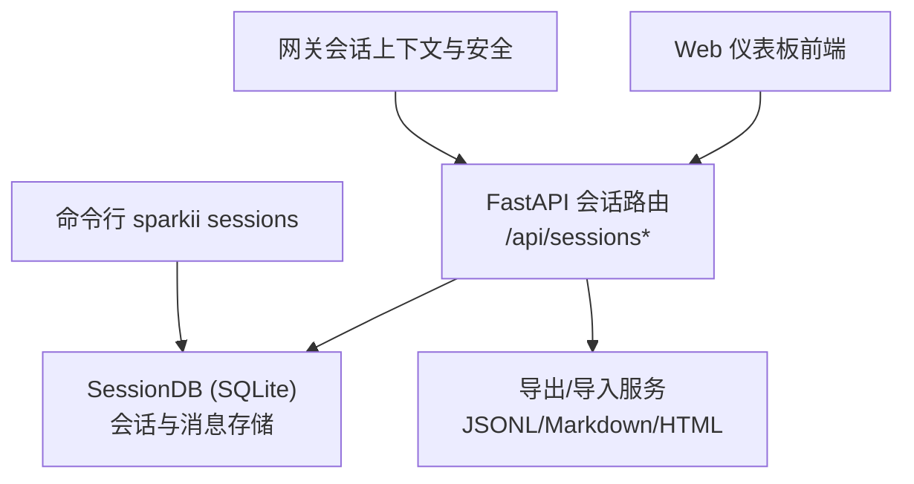
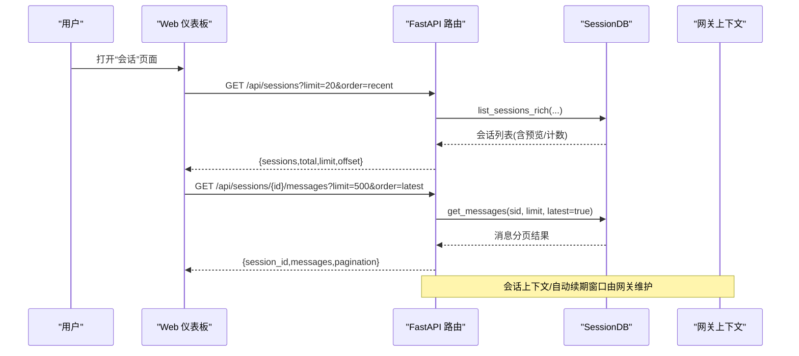
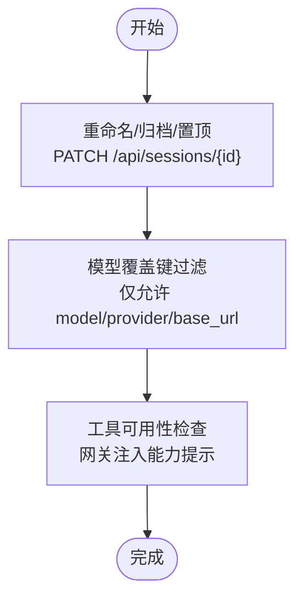
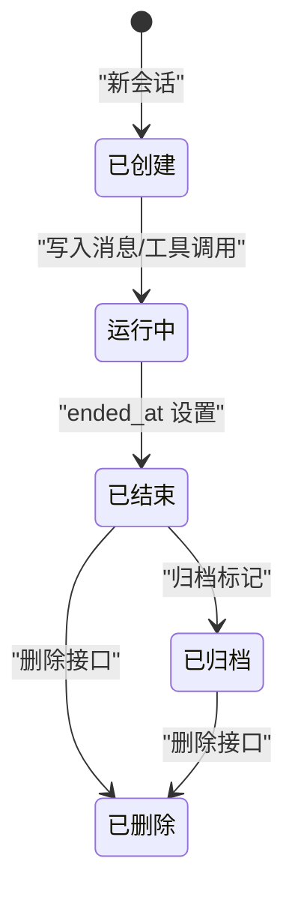
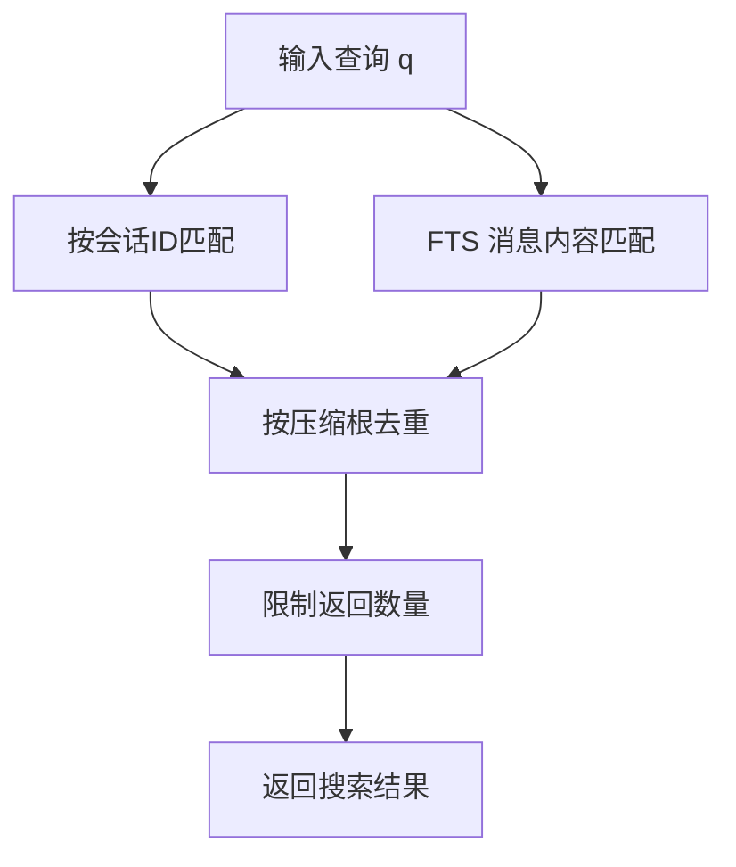
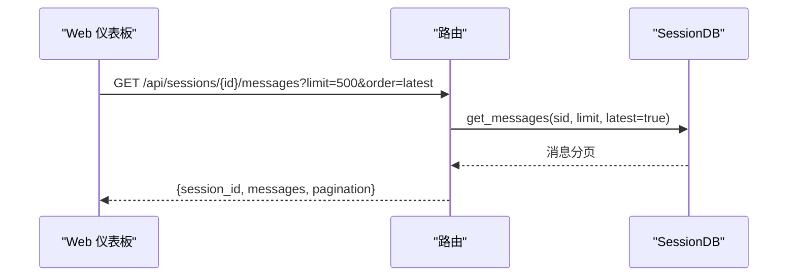
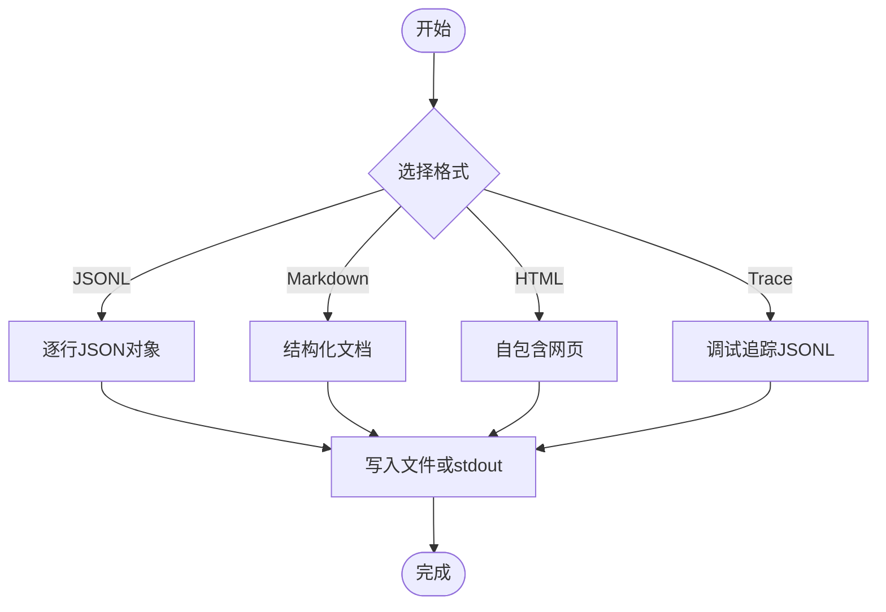
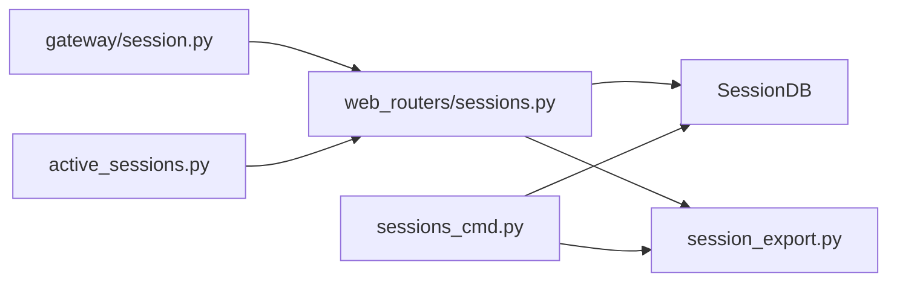

# 会话管理

<cite>
**本文引用的文件**
- [sparkii_cli/web_routers/sessions.py](file://sparkii_cli/web_routers/sessions.py)
- [sparkii_cli/session_listing.py](file://sparkii_cli/session_listing.py)
- [sparkii_cli/session_filters.py](file://sparkii_cli/session_filters.py)
- [sparkii_cli/session_export.py](file://sparkii_cli/session_export.py)
- [sparkii_cli/sessions_cmd.py](file://sparkii_cli/sessions_cmd.py)
- [gateway/session.py](file://gateway/session.py)
- [sparkii_cli/active_sessions.py](file://sparkii_cli/active_sessions.py)
</cite>

## 目录
1. [简介](#简介)
2. [项目结构](#项目结构)
3. [核心组件](#核心组件)
4. [架构总览](#架构总览)
5. [详细组件分析](#详细组件分析)
6. [依赖关系分析](#依赖关系分析)
7. [性能考虑](#性能考虑)
8. [故障排查指南](#故障排查指南)
9. [结论](#结论)
10. [附录](#附录)

## 简介
本指南面向Web仪表板用户，系统化说明如何创建、管理、查看与导出导入对话会话，涵盖会话命名、模型选择、工具集配置、生命周期（创建/暂停/恢复/删除）、历史会话浏览与搜索过滤、消息与工具调用记录查看、导入导出格式、共享协作建议以及性能优化与最佳实践。内容基于后端API与CLI能力映射到Web仪表板的典型使用方式，帮助高效管理与使用各类对话会话。

## 项目结构
Web仪表板的会话管理由FastAPI路由层提供REST接口，底层通过SessionDB访问SQLite持久化存储；同时提供搜索、分页、批量操作与流式导出等能力。CLI侧提供会话列表、导出、清理、恢复等命令，便于自动化与批处理。网关层负责会话上下文注入、自动续期窗口、安全校验与平台特性提示。

**图示来源**
- [sparkii_cli/web_routers/sessions.py:53-166](file://sparkii_cli/web_routers/sessions.py#L53-L166)
- [sparkii_cli/web_routers/sessions.py:169-392](file://sparkii_cli/web_routers/sessions.py#L169-L392)
- [sparkii_cli/web_routers/sessions.py:722-781](file://sparkii_cli/web_routers/sessions.py#L722-L781)
- [sparkii_cli/sessions_cmd.py:239-312](file://sparkii_cli/sessions_cmd.py#L239-L312)
- [gateway/session.py:748-770](file://gateway/session.py#L748-L770)

**章节来源**
- [sparkii_cli/web_routers/sessions.py:53-166](file://sparkii_cli/web_routers/sessions.py#L53-L166)
- [sparkii_cli/web_routers/sessions.py:169-392](file://sparkii_cli/web_routers/sessions.py#L169-L392)
- [sparkii_cli/sessions_cmd.py:239-312](file://sparkii_cli/sessions_cmd.py#L239-L312)
- [gateway/session.py:748-770](file://gateway/session.py#L748-L770)

## 核心组件
- Web会话路由：提供会话列表、搜索、详情、消息、重命名/归档/置顶、批量删除、空会话清理、统计、导出与修剪等接口。
- 会话列出与过滤：统一解析查询参数、分页、排序、来源过滤与未命名会话显示策略。
- 时间/过滤解析：将用户友好的时长或绝对时间转换为内部时间戳，构建修剪/归档过滤器。
- 导出渲染：支持JSONL、Markdown、HTML与trace格式，支持仅导出用户提示。
- 活跃会话租约：跨进程并发会话上限控制与租约释放，避免资源耗尽。
- 网关会话上下文：动态系统提示注入、自动续期窗口、安全校验与平台能力提示。

**章节来源**
- [sparkii_cli/web_routers/sessions.py:53-166](file://sparkii_cli/web_routers/sessions.py#L53-L166)
- [sparkii_cli/web_routers/sessions.py:169-392](file://sparkii_cli/web_routers/sessions.py#L169-L392)
- [sparkii_cli/session_filters.py:82-180](file://sparkii_cli/session_filters.py#L82-L180)
- [sparkii_cli/session_export.py:21-60](file://sparkii_cli/session_export.py#L21-L60)
- [sparkii_cli/active_sessions.py:271-334](file://sparkii_cli/active_sessions.py#L271-L334)
- [gateway/session.py:748-770](file://gateway/session.py#L748-L770)

## 架构总览
Web仪表板通过REST API与后端交互，后端以SQLite为持久化存储，提供会话CRUD、消息分页、全文检索、批量操作与流式导出。CLI侧复用同一数据源，实现批量导出、修剪、恢复等运维能力。网关层在会话上下文中注入平台信息、能力提示与安全策略，并维护自动续期窗口。

**图示来源**
- [sparkii_cli/web_routers/sessions.py:53-166](file://sparkii_cli/web_routers/sessions.py#L53-L166)
- [sparkii_cli/web_routers/sessions.py:601-652](file://sparkii_cli/web_routers/sessions.py#L601-L652)
- [gateway/session.py:31-58](file://gateway/session.py#L31-L58)

## 详细组件分析

### 会话创建与配置（命名、模型、工具集）
- 会话命名：通过重命名接口更新标题，支持清空标题、设置置顶与归档。
- 模型选择：可持久化的模型覆盖键包含模型名、提供商与基础URL；敏感字段（如密钥）不写入会话。
- 工具集配置：工具可用性由运行时注册与凭据决定；网关会在系统提示中注入平台能力提示，确保不会承诺不可用的工具。

**图示来源**
- [sparkii_cli/web_routers/sessions.py:683-719](file://sparkii_cli/web_routers/sessions.py#L683-L719)
- [gateway/session.py:748-770](file://gateway/session.py#L748-L770)
- [gateway/session.py:479-745](file://gateway/session.py#L479-L745)

**章节来源**
- [sparkii_cli/web_routers/sessions.py:683-719](file://sparkii_cli/web_routers/sessions.py#L683-L719)
- [gateway/session.py:748-770](file://gateway/session.py#L748-L770)
- [gateway/session.py:479-745](file://gateway/session.py#L479-L745)

### 会话生命周期管理（创建、暂停、恢复、删除）
- 创建：新会话由上游平台或CLI触发，网关维护会话键与ID映射，支持自动续期窗口。
- 暂停/恢复：会话结束会记录ended_at与last_active；可通过最近活动判断是否处于活跃状态。
- 删除：支持单条删除、批量删除、清理空会话；删除后子会话成为孤儿，不在DB级联删除。
- 自动归档：列表接口会执行可能的自动归档逻辑，保持列表整洁。

**图示来源**
- [sparkii_cli/web_routers/sessions.py:53-166](file://sparkii_cli/web_routers/sessions.py#L53-L166)
- [sparkii_cli/web_routers/sessions.py:395-445](file://sparkii_cli/web_routers/sessions.py#L395-L445)
- [sparkii_cli/web_routers/sessions.py:492-520](file://sparkii_cli/web_routers/sessions.py#L492-L520)
- [gateway/session.py:31-58](file://gateway/session.py#L31-L58)

**章节来源**
- [sparkii_cli/web_routers/sessions.py:53-166](file://sparkii_cli/web_routers/sessions.py#L53-L166)
- [sparkii_cli/web_routers/sessions.py:395-445](file://sparkii_cli/web_routers/sessions.py#L395-L445)
- [sparkii_cli/web_routers/sessions.py:492-520](file://sparkii_cli/web_routers/sessions.py#L492-L520)
- [gateway/session.py:31-58](file://gateway/session.py#L31-L58)

### 历史会话浏览、搜索与过滤
- 列表浏览：支持分页、排序（按创建时间或最近活动）、来源过滤、最小消息数过滤、归档显示策略。
- 搜索：支持按会话ID与FTS消息内容搜索，自动压缩链去重，优先返回直接ID匹配。
- 过滤：支持older_than/newer_than/before/after等时间窗口，title_like、end_reason、cwd前缀、消息数/Token/成本/工具调用次数范围等。

**图示来源**
- [sparkii_cli/web_routers/sessions.py:169-392](file://sparkii_cli/web_routers/sessions.py#L169-L392)
- [sparkii_cli/session_filters.py:82-180](file://sparkii_cli/session_filters.py#L82-L180)

**章节来源**
- [sparkii_cli/web_routers/sessions.py:169-392](file://sparkii_cli/web_routers/sessions.py#L169-L392)
- [sparkii_cli/session_filters.py:82-180](file://sparkii_cli/session_filters.py#L82-L180)

### 会话内容查看与编辑（消息历史、上下文、工具调用记录）
- 消息历史：支持分页加载最新或最早消息，默认返回最新一页，避免全量加载导致内存压力。
- 上下文信息：网关在系统提示中注入平台、渠道、用户信息与能力提示，帮助模型理解上下文。
- 工具调用记录：消息中包含tool角色条目，导出时以折叠块展示工具名称与内容。

**图示来源**
- [sparkii_cli/web_routers/sessions.py:601-652](file://sparkii_cli/web_routers/sessions.py#L601-L652)
- [gateway/session.py:479-745](file://gateway/session.py#L479-L745)
- [sparkii_cli/session_export.py:181-217](file://sparkii_cli/session_export.py#L181-L217)

**章节来源**
- [sparkii_cli/web_routers/sessions.py:601-652](file://sparkii_cli/web_routers/sessions.py#L601-L652)
- [gateway/session.py:479-745](file://gateway/session.py#L479-L745)
- [sparkii_cli/session_export.py:181-217](file://sparkii_cli/session_export.py#L181-L217)

### 导入导出功能（多格式交换）
- 导出：支持JSONL、Markdown、HTML与trace格式；可仅导出用户提示；HTML为自包含文件，适合分享。
- 导入：支持从仪表板或CLI导出的会话JSON进行导入，适用于迁移与备份恢复。
- 批量导出：支持按过滤器导出多个会话，输出到文件或标准输出。

**图示来源**
- [sparkii_cli/session_export.py:21-60](file://sparkii_cli/session_export.py#L21-L60)
- [sparkii_cli/sessions_cmd.py:313-437](file://sparkii_cli/sessions_cmd.py#L313-L437)
- [sparkii_cli/web_routers/sessions.py:722-781](file://sparkii_cli/web_routers/sessions.py#L722-L781)

**章节来源**
- [sparkii_cli/session_export.py:21-60](file://sparkii_cli/session_export.py#L21-L60)
- [sparkii_cli/sessions_cmd.py:313-437](file://sparkii_cli/sessions_cmd.py#L313-L437)
- [sparkii_cli/web_routers/sessions.py:722-781](file://sparkii_cli/web_routers/sessions.py#L722-L781)

### 共享与协作建议
- 通过HTML导出生成自包含文件，便于离线分享与审阅。
- 使用Markdown导出结构化对话，便于版本管理与评审。
- 对于团队协作，建议使用统一的会话命名规范与标签（通过标题），并结合来源过滤快速定位。
- 对敏感内容，可在导出时启用脱敏（CLI支持redact选项）。

[本节为概念性指导，不直接分析具体文件]

### 性能优化与最佳实践
- 列表与搜索分页：合理设置limit与offset，避免一次性加载过多数据。
- 消息分页：默认加载最新一页，减少大会话的传输与渲染开销。
- 搜索去重：按压缩根去重，避免重复会话命中影响结果质量。
- 并发与会话上限：通过活跃会话租约控制最大并发会话，防止资源耗尽。
- 自动归档：利用自动归档保持列表整洁，减少无关会话干扰。

**章节来源**
- [sparkii_cli/web_routers/sessions.py:53-166](file://sparkii_cli/web_routers/sessions.py#L53-L166)
- [sparkii_cli/web_routers/sessions.py:169-392](file://sparkii_cli/web_routers/sessions.py#L169-L392)
- [sparkii_cli/active_sessions.py:271-334](file://sparkii_cli/active_sessions.py#L271-L334)

## 依赖关系分析
- Web路由依赖SessionDB进行读写，依赖导出模块进行格式化输出。
- CLI命令复用SessionDB与导出模块，提供批处理能力。
- 网关层提供会话上下文与安全策略，影响系统提示与工具可用性。
- 活跃会话租约模块保障跨进程并发控制，避免资源竞争。

**图示来源**
- [sparkii_cli/web_routers/sessions.py:53-166](file://sparkii_cli/web_routers/sessions.py#L53-L166)
- [sparkii_cli/session_export.py:21-60](file://sparkii_cli/session_export.py#L21-L60)
- [sparkii_cli/sessions_cmd.py:239-312](file://sparkii_cli/sessions_cmd.py#L239-L312)
- [gateway/session.py:748-770](file://gateway/session.py#L748-L770)
- [sparkii_cli/active_sessions.py:271-334](file://sparkii_cli/active_sessions.py#L271-L334)

**章节来源**
- [sparkii_cli/web_routers/sessions.py:53-166](file://sparkii_cli/web_routers/sessions.py#L53-L166)
- [sparkii_cli/session_export.py:21-60](file://sparkii_cli/session_export.py#L21-L60)
- [sparkii_cli/sessions_cmd.py:239-312](file://sparkii_cli/sessions_cmd.py#L239-L312)
- [gateway/session.py:748-770](file://gateway/session.py#L748-L770)
- [sparkii_cli/active_sessions.py:271-334](file://sparkii_cli/active_sessions.py#L271-L334)

## 性能考虑
- 列表接口限制最大页数，避免无界查询拖垮数据库。
- 搜索接口对FTS查询进行前缀扩展与去重，提升命中率与结果质量。
- 消息导出采用键集分页，避免OFFSET在大表上的O(n²)代价。
- 活跃会话租约限制并发，防止过多会话占用资源。
- 自动归档与修剪减少无效会话对列表与搜索的影响。

[本节提供通用性能建议，不直接分析具体文件]

## 故障排查指南
- 列表接口错误：检查archived与order参数合法性，确认profile作用域。
- 搜索失败：确认查询非空，检查FTS索引与来源过滤是否正确。
- 消息加载缓慢：调整limit与order，避免全量加载；关注会话大小。
- 并发限制：当达到活跃会话上限时，等待其他会话结束或调整max_concurrent_sessions。
- 导出失败：确认格式支持与输出路径权限；trace导出需脱敏成功。

**章节来源**
- [sparkii_cli/web_routers/sessions.py:53-166](file://sparkii_cli/web_routers/sessions.py#L53-L166)
- [sparkii_cli/web_routers/sessions.py:169-392](file://sparkii_cli/web_routers/sessions.py#L169-L392)
- [sparkii_cli/web_routers/sessions.py:601-652](file://sparkii_cli/web_routers/sessions.py#L601-L652)
- [sparkii_cli/active_sessions.py:271-334](file://sparkii_cli/active_sessions.py#L271-L334)

## 结论
通过Web仪表板的会话管理功能，用户可以便捷地创建、命名、配置模型与工具集，管理会话生命周期，浏览与搜索历史会话，查看消息与工具调用记录，并以多种格式导入导出。结合活跃会话并发控制与自动归档/修剪机制，能够高效维护大量会话，满足个人与团队协作需求。遵循分页、去重与脱敏等最佳实践，可进一步提升性能与安全性。

[本节为总结性内容，不直接分析具体文件]

## 附录
- 常用API参考：
  - 列表：GET /api/sessions
  - 搜索：GET /api/sessions/search
  - 详情：GET /api/sessions/{id}
  - 消息：GET /api/sessions/{id}/messages
  - 重命名/归档/置顶：PATCH /api/sessions/{id}
  - 批量删除：POST /api/sessions/bulk-delete
  - 空会话清理：DELETE /api/sessions/empty
  - 统计：GET /api/sessions/stats
  - 导出：GET /api/sessions/{id}/export
  - 修剪：POST /api/sessions/prune
- CLI命令参考：
  - 列表：sparkii sessions list
  - 导出：sparkii sessions export --format jsonl|md|html|trace
  - 删除：sparkii sessions delete
  - 修剪/归档：sparkii sessions prune/archive

[本节为参考性内容，不直接分析具体文件]