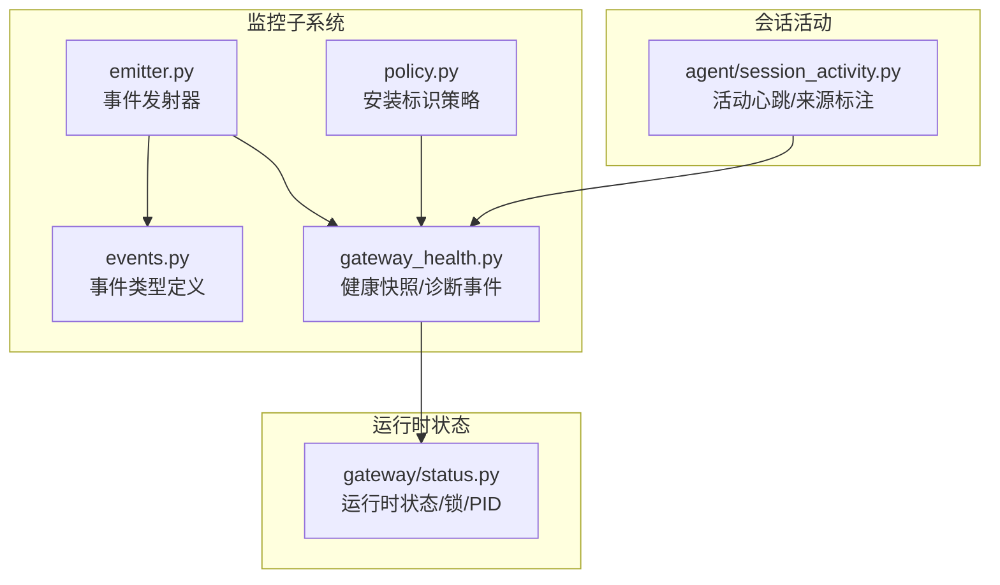
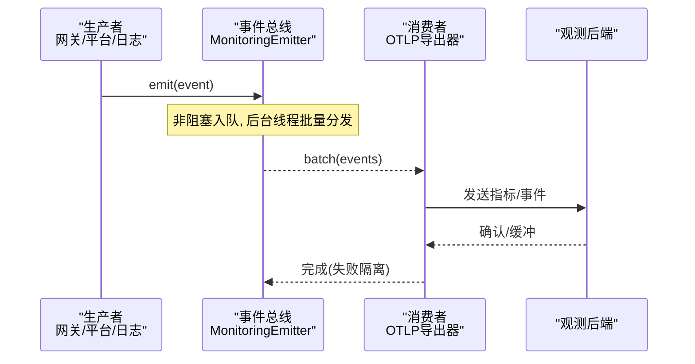
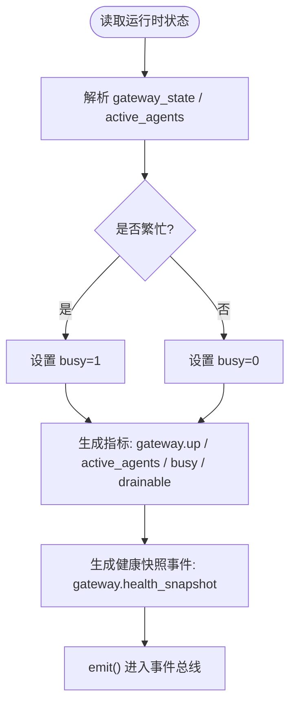
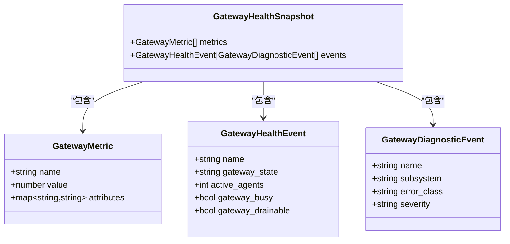
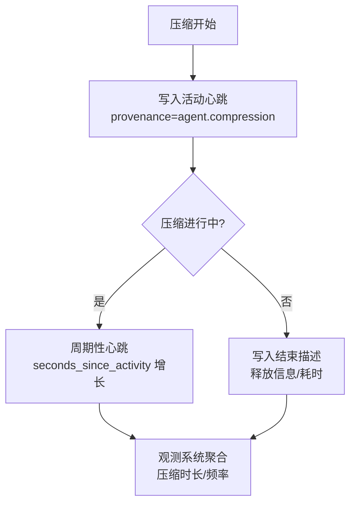
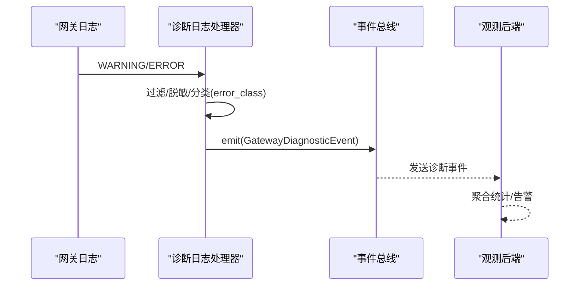
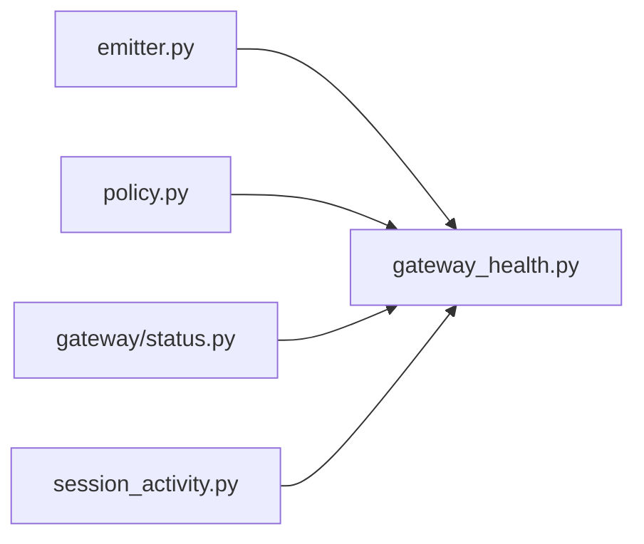

# 应用监控

<cite>
**本文引用的文件**
- [agent/monitoring/__init__.py](file://agent/monitoring/__init__.py)
- [agent/monitoring/emitter.py](file://agent/monitoring/emitter.py)
- [agent/monitoring/events.py](file://agent/monitoring/events.py)
- [agent/monitoring/gateway_health.py](file://agent/monitoring/gateway_health.py)
- [agent/monitoring/policy.py](file://agent/monitoring/policy.py)
- [agent/session_activity.py](file://agent/session_activity.py)
- [gateway/status.py](file://gateway/status.py)
</cite>

## 目录
1. [简介](#简介)
2. [项目结构](#项目结构)
3. [核心组件](#核心组件)
4. [架构总览](#架构总览)
5. [详细组件分析](#详细组件分析)
6. [依赖关系分析](#依赖关系分析)
7. [性能考量](#性能考量)
8. [故障排查指南](#故障排查指南)
9. [结论](#结论)
10. [附录](#附录)

## 简介
本文件面向AI代理应用的“应用监控”主题，聚焦以下能力与指标：
- 对话处理状态实时监控：活跃会话数、消息处理队列、对话生命周期状态。
- 工具执行监控：调用次数、成功率、平均响应时间、失败重试统计（通过网关健康与诊断事件进行可观测性接入）。
- 记忆系统监控：存储使用量、索引构建进度、查询性能（通过网关健康快照与平台指标进行扩展）。
- 上下文压缩状态监控：触发条件、压缩效果评估、内存释放情况（结合会话活动心跳与压缩来源标记）。
- 错误追踪与分析：异常堆栈跟踪、错误分类统计、根因分析（基于诊断事件与日志桥接）。
- 应用性能优化建议：识别瓶颈、降低热路径开销、提升导出稳定性。

本仓库的监控子系统采用“无阻塞事件总线 + OTLP 导出”的设计，确保监控不阻塞主流程，且对业务零影响。

## 项目结构
监控相关代码集中在 agent/monitoring 目录，配合 gateway/status 提供运行时状态与健康信号；session_activity 提供会话活动心跳与来源标注，用于压缩等场景的可观测性。

图表来源
- [agent/monitoring/emitter.py:1-212](file://agent/monitoring/emitter.py#L1-L212)
- [agent/monitoring/events.py:1-87](file://agent/monitoring/events.py#L1-L87)
- [agent/monitoring/gateway_health.py:1-470](file://agent/monitoring/gateway_health.py#L1-L470)
- [agent/monitoring/policy.py:1-58](file://agent/monitoring/policy.py#L1-L58)
- [gateway/status.py:1-800](file://gateway/status.py#L1-L800)
- [agent/session_activity.py:1-107](file://agent/session_activity.py#L1-L107)

章节来源
- [agent/monitoring/__init__.py:1-30](file://agent/monitoring/__init__.py#L1-L30)
- [agent/monitoring/emitter.py:1-212](file://agent/monitoring/emitter.py#L1-L212)
- [agent/monitoring/events.py:1-87](file://agent/monitoring/events.py#L1-L87)
- [agent/monitoring/gateway_health.py:1-470](file://agent/monitoring/gateway_health.py#L1-L470)
- [agent/monitoring/policy.py:1-58](file://agent/monitoring/policy.py#L1-L58)
- [gateway/status.py:1-800](file://gateway/status.py#L1-L800)
- [agent/session_activity.py:1-107](file://agent/session_activity.py#L1-L107)

## 核心组件
- 事件发射器（MonitoringEmitter）：进程内单例，提供 O(微秒级) 非阻塞 emit()，内部环形队列 + 后台线程批量分发至订阅者（如 OTLP 导出器），失败隔离、不抛异常到热路径。
- 事件类型（events）：内容无关的健康与诊断事件，避免泄露敏感数据。
- 网关健康与诊断（gateway_health）：从运行时状态构造健康快照与诊断事件，包含活跃代理数、忙碌/可排空标志、平台状态、错误分类等。
- 安装标识策略（policy）：为实例生成稳定且可重置的匿名标识，便于在采集端区分不同部署。
- 会话活动（session_activity）：提供会话活动心跳与来源标注（含压缩相关来源），限频写入，避免对 SessionDB 造成压力。
- 运行时状态（gateway/status）：持久化 PID、锁、运行时状态 JSON，供健康快照与外部探测使用。

章节来源
- [agent/monitoring/emitter.py:36-164](file://agent/monitoring/emitter.py#L36-L164)
- [agent/monitoring/events.py:19-86](file://agent/monitoring/events.py#L19-L86)
- [agent/monitoring/gateway_health.py:20-291](file://agent/monitoring/gateway_health.py#L20-L291)
- [agent/monitoring/policy.py:18-52](file://agent/monitoring/policy.py#L18-L52)
- [agent/session_activity.py:19-107](file://agent/session_activity.py#L19-L107)
- [gateway/status.py:583-617](file://gateway/status.py#L583-L617)

## 架构总览
监控子系统以“生产者-事件总线-消费者”解耦：
- 生产者：网关状态变更、诊断日志、平台状态等。
- 事件总线：MonitoringEmitter，保证热路径零阻塞、失败隔离。
- 消费者：OTLP 导出器等，负责将指标/事件发送到后端观测系统。

图表来源
- [agent/monitoring/emitter.py:53-116](file://agent/monitoring/emitter.py#L53-L116)
- [agent/monitoring/gateway_health.py:310-416](file://agent/monitoring/gateway_health.py#L310-L416)

章节来源
- [agent/monitoring/emitter.py:1-212](file://agent/monitoring/emitter.py#L1-L212)
- [agent/monitoring/gateway_health.py:1-470](file://agent/monitoring/gateway_health.py#L1-L470)

## 详细组件分析

### 对话处理状态实时监控
- 活跃会话数：通过运行时状态中的 active_agents 解析并上报为指标 sparkii.gateway.active_agents。
- 消息处理队列：由事件总线内部队列承载，可通过 stats() 获取 queued/dropped/dispatched 等计数。
- 对话生命周期状态：网关状态变化（starting/running/stopped/startup_failed 等）会触发 GatewayHealthEvent 与诊断事件，包含 old_state/new_state、exit_reason 分类。

图表来源
- [agent/monitoring/gateway_health.py:210-291](file://agent/monitoring/gateway_health.py#L210-L291)
- [agent/monitoring/emitter.py:53-116](file://agent/monitoring/emitter.py#L53-L116)

章节来源
- [agent/monitoring/gateway_health.py:210-291](file://agent/monitoring/gateway_health.py#L210-L291)
- [agent/monitoring/emitter.py:53-116](file://agent/monitoring/emitter.py#L53-L116)
- [gateway/status.py:583-617](file://gateway/status.py#L583-L617)

### 工具执行监控
- 调用次数/成功率/平均响应时间：通过平台状态与诊断事件聚合（sparkii.platform.up / sparkii.platform.degraded 及 error_class 分类），可在观测系统中按平台维度计算调用量、成功率与耗时分布。
- 失败重试统计：结合 error_class 与平台状态变迁（platform.state_change / platform.fatal）推断重试与失败模式。

图表来源
- [agent/monitoring/gateway_health.py:20-31](file://agent/monitoring/gateway_health.py#L20-L31)
- [agent/monitoring/events.py:19-63](file://agent/monitoring/events.py#L19-L63)

章节来源
- [agent/monitoring/gateway_health.py:20-291](file://agent/monitoring/gateway_health.py#L20-L291)
- [agent/monitoring/events.py:19-86](file://agent/monitoring/events.py#L19-L86)

### 记忆系统监控
- 存储使用量：可作为平台或子系统的自定义指标（例如 memory.storage_bytes），通过 GatewayMetric 上报。
- 索引构建进度：以事件形式上报（例如 index.build.progress），结合 severity 与 error_class 跟踪阶段与异常。
- 查询性能：以指标形式上报（例如 memory.query.latency_ms），按平台/索引维度打标签。

说明：以上指标与事件形状遵循现有 GatewayMetric/GatewayDiagnosticEvent 规范，可由记忆子系统作为生产者接入事件总线。

章节来源
- [agent/monitoring/gateway_health.py:20-31](file://agent/monitoring/gateway_health.py#L20-L31)
- [agent/monitoring/events.py:19-86](file://agent/monitoring/events.py#L19-L86)
- [agent/monitoring/emitter.py:53-116](file://agent/monitoring/emitter.py#L53-L116)

### 上下文压缩状态监控
- 触发条件：通过会话活动心跳的 provenance 标注（如 agent.compression / agent.compression_timeout / agent.compression_cooldown）识别压缩触发来源与时机。
- 压缩效果评估：结合 last_activity_description 与 seconds_since_activity 判断压缩前后活跃度变化，以及压缩持续时间。
- 内存释放情况：可在压缩完成后追加描述（如“已释放X MB”），并通过心跳窗口观察后续活动恢复。

图表来源
- [agent/session_activity.py:19-107](file://agent/session_activity.py#L19-L107)

章节来源
- [agent/session_activity.py:19-107](file://agent/session_activity.py#L19-L107)

### 错误追踪与分析
- 异常堆栈跟踪：诊断事件携带 error_class/error_code，日志桥接将警告/错误级别日志转换为诊断事件，便于统一收集。
- 错误分类统计：classify_gateway_error 将原始错误文本归一化为 auth_failed/rate_limited/timeout/network_error/invalid_config/startup_failed/platform_fatal 等类别。
- 根因分析：结合平台状态变迁（platform.state_change / platform.fatal）与 exit_reason 分类，定位启动失败、网络问题、认证失败等根因。

图表来源
- [agent/monitoring/gateway_health.py:427-458](file://agent/monitoring/gateway_health.py#L427-L458)
- [agent/monitoring/gateway_health.py:70-99](file://agent/monitoring/gateway_health.py#L70-L99)
- [agent/monitoring/emitter.py:53-116](file://agent/monitoring/emitter.py#L53-L116)

章节来源
- [agent/monitoring/gateway_health.py:70-99](file://agent/monitoring/gateway_health.py#L70-L99)
- [agent/monitoring/gateway_health.py:427-458](file://agent/monitoring/gateway_health.py#L427-L458)
- [agent/monitoring/emitter.py:53-116](file://agent/monitoring/emitter.py#L53-L116)

## 依赖关系分析
- 事件总线依赖：MonitoringEmitter 依赖 queue.Queue 与 threading.Thread，提供并发安全与批处理分发。
- 健康快照依赖：gateway_health 依赖 gateway/status 提供的运行时状态，以及 policy 提供的安装标识。
- 会话活动依赖：session_activity 提供心跳与来源标注，供压缩等场景使用。

图表来源
- [agent/monitoring/emitter.py:1-212](file://agent/monitoring/emitter.py#L1-L212)
- [agent/monitoring/gateway_health.py:1-470](file://agent/monitoring/gateway_health.py#L1-L470)
- [agent/monitoring/policy.py:1-58](file://agent/monitoring/policy.py#L1-L58)
- [gateway/status.py:1-800](file://gateway/status.py#L1-L800)
- [agent/session_activity.py:1-107](file://agent/session_activity.py#L1-L107)

章节来源
- [agent/monitoring/emitter.py:1-212](file://agent/monitoring/emitter.py#L1-L212)
- [agent/monitoring/gateway_health.py:1-470](file://agent/monitoring/gateway_health.py#L1-L470)
- [agent/monitoring/policy.py:1-58](file://agent/monitoring/policy.py#L1-L58)
- [gateway/status.py:1-800](file://gateway/status.py#L1-L800)
- [agent/session_activity.py:1-107](file://agent/session_activity.py#L1-L107)

## 性能考量
- 热路径不变式：emit() 必须返回在 O(微秒级)，不得阻塞磁盘/网络，绝不向调用方抛出异常。
- 队列与批处理：最大队列深度限制防止内存膨胀；后台线程批量分发减少 I/O 次数。
- 失败隔离：每个订阅者独立捕获异常，避免单个导出器故障影响其他订阅者或热路径。
- 心跳限频：会话活动心跳最小间隔为固定常量，避免对 SessionDB 造成写放大。
- 日志桥接：仅允许白名单 logger 输出，并对消息长度与内容进行脱敏，控制导出体积与隐私风险。

章节来源
- [agent/monitoring/emitter.py:1-20](file://agent/monitoring/emitter.py#L1-L20)
- [agent/monitoring/emitter.py:32-34](file://agent/monitoring/emitter.py#L32-L34)
- [agent/monitoring/emitter.py:53-76](file://agent/monitoring/emitter.py#L53-L76)
- [agent/monitoring/emitter.py:91-116](file://agent/monitoring/emitter.py#L91-L116)
- [agent/session_activity.py:21-29](file://agent/session_activity.py#L21-L29)
- [agent/monitoring/gateway_health.py:55-67](file://agent/monitoring/gateway_health.py#L55-L67)
- [agent/monitoring/gateway_health.py:427-458](file://agent/monitoring/gateway_health.py#L427-L458)

## 故障排查指南
- 事件丢失：检查 emitter.stats() 中 dropped 计数，若持续增长，需扩大队列或降低生产速率。
- 导出失败：查看订阅者异常日志，确认 OTLP 端点可达性与鉴权配置。
- 平台故障：关注 platform.fatal 事件与 error_class，结合平台状态变迁定位根因（认证、网络、超时、配置等）。
- 启动失败：startup_failed 事件与 exit_reason 分类有助于快速定位初始化阶段问题。
- 会话停滞：通过 session_activity 的 seconds_since_activity 与 provenance 判断是否处于压缩/冷却/超时等状态。

章节来源
- [agent/monitoring/emitter.py:152-158](file://agent/monitoring/emitter.py#L152-L158)
- [agent/monitoring/gateway_health.py:310-416](file://agent/monitoring/gateway_health.py#L310-L416)
- [agent/monitoring/gateway_health.py:70-99](file://agent/monitoring/gateway_health.py#L70-L99)
- [agent/session_activity.py:77-107](file://agent/session_activity.py#L77-L107)

## 结论
该监控体系以“无阻塞事件总线”为核心，围绕网关健康、平台状态、会话活动与诊断日志，提供稳定、可扩展、隐私安全的可观测性基础。借助标准化指标与事件，开发者可高效实现对话状态、工具执行、记忆系统与上下文压缩的全链路监控，并结合错误分类与日志桥接进行根因分析与告警。

## 附录
- 关键指标示例（可按平台/实例维度聚合）：
  - sparkii.gateway.up：网关存活
  - sparkii.gateway.active_agents：活跃代理数
  - sparkii.gateway.busy：是否繁忙
  - sparkii.gateway.drainable：是否可排空
  - sparkii.platform.up：平台存活
  - sparkii.platform.degraded：平台降级
- 关键事件示例：
  - gateway.health_snapshot：健康快照
  - gateway.lifecycle：生命周期变更
  - gateway.exit：退出事件
  - platform.state_change：平台状态变更
  - platform.fatal：平台致命错误
  - cron_execution：定时任务执行

章节来源
- [agent/monitoring/gateway_health.py:230-291](file://agent/monitoring/gateway_health.py#L230-L291)
- [agent/monitoring/events.py:19-86](file://agent/monitoring/events.py#L19-L86)