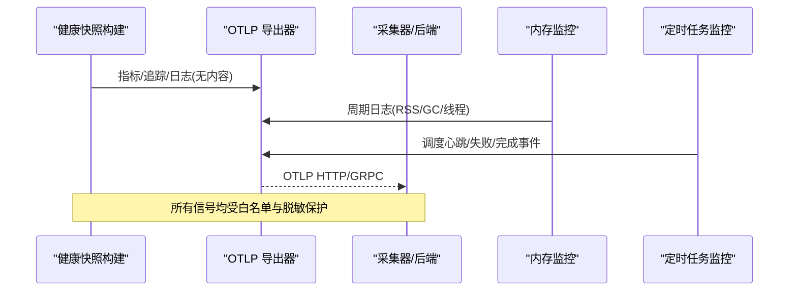
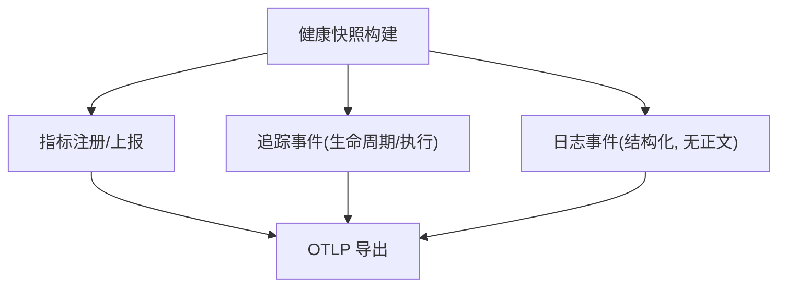
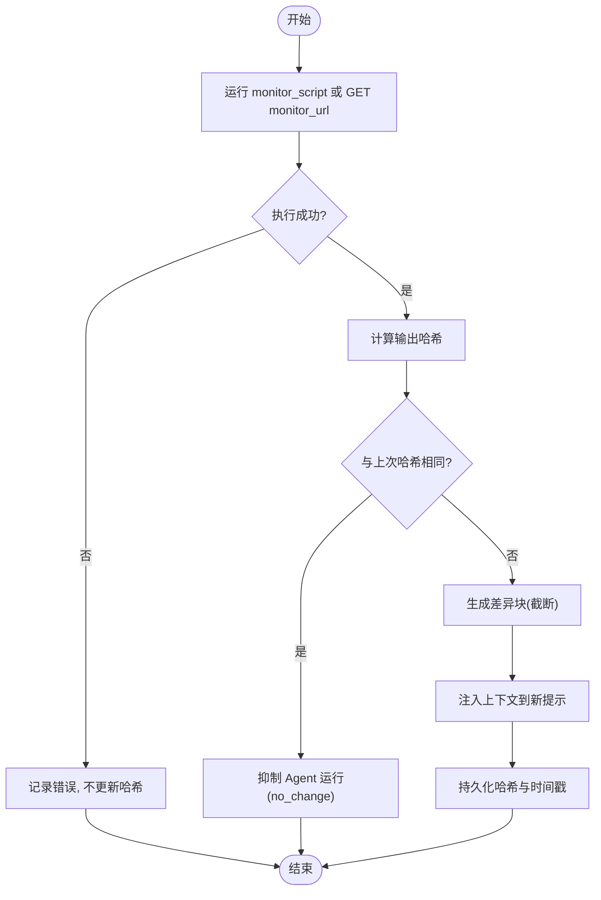
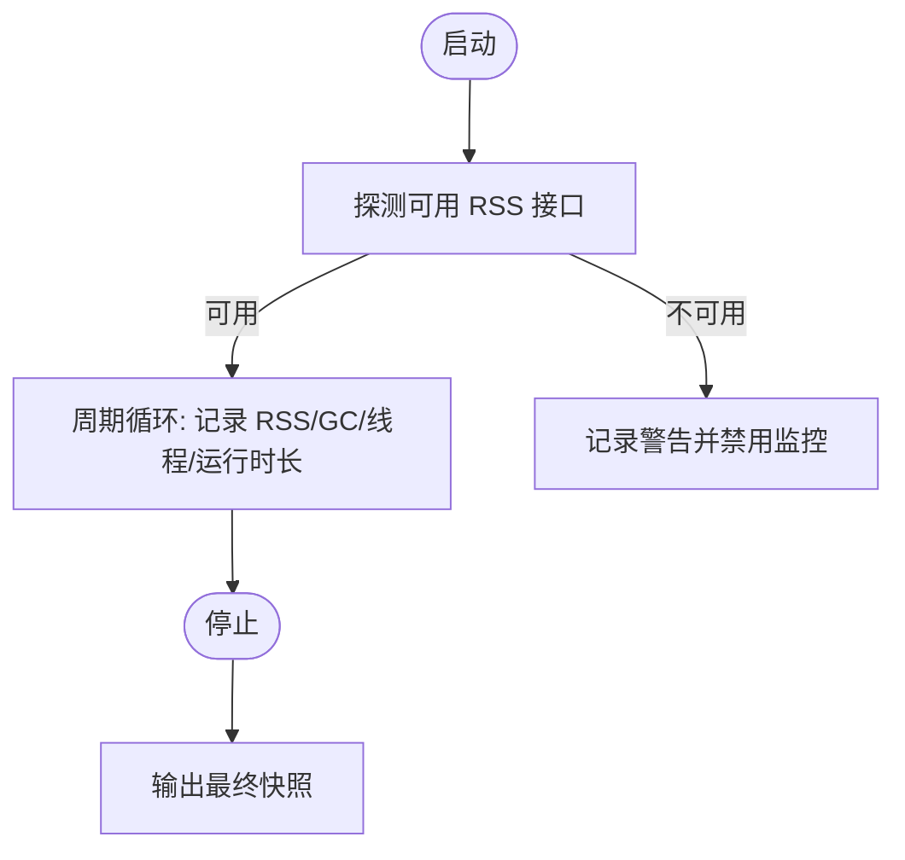
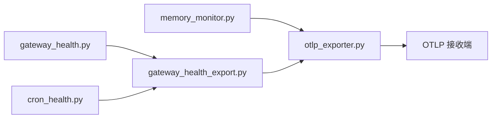

# 监控仪表板

<cite>
**本文引用的文件**
- [agent/monitoring/__init__.py](file://agent/monitoring/__init__.py)
- [agent/monitoring/gateway_health.py](file://agent/monitoring/gateway_health.py)
- [agent/monitoring/cron_health.py](file://agent/monitoring/cron_health.py)
- [agent/monitoring/gateway_health_export.py](file://agent/monitoring/gateway_health_export.py)
- [agent/monitoring/otlp_exporter.py](file://agent/monitoring/otlp_exporter.py)
- [cron/monitor.py](file://cron/monitor.py)
- [gateway/memory_monitor.py](file://gateway/memory_monitor.py)
- [sparkii_cli/subcommands/monitoring.py](file://sparkii_cli/subcommands/monitoring.py)
- [docs/observability/monitoring.md](file://docs/observability/monitoring.md)
- [plugins/dashboard_auth/basic/__init__.py](file://plugins/dashboard_auth/basic/__init__.py)
</cite>

## 目录
1. [简介](#简介)
2. [项目结构](#项目结构)
3. [核心组件](#核心组件)
4. [架构总览](#架构总览)
5. [详细组件分析](#详细组件分析)
6. [依赖关系分析](#依赖关系分析)
7. [性能考量](#性能考量)
8. [故障排查指南](#故障排查指南)
9. [结论](#结论)
10. [附录](#附录)

## 简介
本指南面向运维与平台工程师，聚焦 Web 仪表板的“监控”能力：如何启用、查看与分析系统运行状态（网关健康、定时任务、内存等），以及如何通过指标、日志与事件进行告警与排障。该监控面以“无内容”为设计原则，仅导出服务健康、生命周期、调度与健康快照等可操作信号，不携带提示词、消息、工具参数/结果或会话历史等内容。

## 项目结构
监控相关代码主要分布在以下模块：
- 网关健康与导出：agent/monitoring 下的健康快照构建与 OTLP 导出
- 定时任务监控：cron/monitor.py 提供基于脚本/URL 的变更检测与上下文注入
- 内存监控：gateway/memory_monitor.py 周期性记录进程 RSS/GC/线程数
- CLI 检查：sparkii_cli/subcommands/monitoring.py 暴露 monitoring status
- 文档与配置说明：docs/observability/monitoring.md 给出启用方式、指标清单与告警建议
- 仪表板认证：plugins/dashboard_auth/basic/__init__.py 提供用户名/密码登录

```mermaid
graph TB
subgraph "网关监控"
GH["gateway_health.py<br/>构建网关健康快照"]
GE["gateway_health_export.py<br/>注册指标/导出"]
OE["otlp_exporter.py<br/>OTLP 发送(指标/追踪/日志)"]
end
subgraph "定时任务监控"
CM["cron/monitor.py<br/>脚本/URL 变更检测"]
end
subgraph "内存监控"
MM["gateway/memory_monitor.py<br/>RSS/GC/线程周期日志"]
end
subgraph "CLI"
CLI["sparkii_cli/subcommands/monitoring.py<br/>monitoring status"]
end
subgraph "文档"
DOC["docs/observability/monitoring.md<br/>启用/指标/告警"]
end
subgraph "仪表板认证"
BA["plugins/dashboard_auth/basic/__init__.py<br/>用户名/密码登录"]
end
GH --> GE --> OE
CM --> GE
MM --> OE
CLI --> GE
BA --> GE
```

图表来源
- [agent/monitoring/gateway_health.py:1-200](file://agent/monitoring/gateway_health.py#L1-L200)
- [agent/monitoring/gateway_health_export.py:1-200](file://agent/monitoring/gateway_health_export.py#L1-L200)
- [agent/monitoring/otlp_exporter.py:1-200](file://agent/monitoring/otlp_exporter.py#L1-L200)
- [cron/monitor.py:1-213](file://cron/monitor.py#L1-L213)
- [gateway/memory_monitor.py:1-231](file://gateway/memory_monitor.py#L1-L231)
- [sparkii_cli/subcommands/monitoring.py:1-37](file://sparkii_cli/subcommands/monitoring.py#L1-L37)
- [docs/observability/monitoring.md:1-305](file://docs/observability/monitoring.md#L1-L305)
- [plugins/dashboard_auth/basic/__init__.py:1-492](file://plugins/dashboard_auth/basic/__init__.py#L1-L492)

章节来源
- [docs/observability/monitoring.md:1-305](file://docs/observability/monitoring.md#L1-L305)
- [agent/monitoring/__init__.py:1-30](file://agent/monitoring/__init__.py#L1-L30)

## 核心组件
- 网关健康与导出
  - 健康快照：收集网关/平台状态、活跃代理、后台工作、委托计数等指标
  - 导出通道：通过 OTLP 将指标、追踪、日志发送到采集器或后端
  - 安全边界：所有属性值经过白名单与脱敏处理，确保“无内容”
- 定时任务监控
  - 变更检测：对 monitor_script 或 monitor_url 的输出做哈希比对，仅在变化时触发后续 Agent 执行并注入差异上下文
  - 持久化：上次输出哈希与时间戳写入作业状态；旧输出用于生成 diff
- 内存监控
  - 周期日志：每 N 分钟输出单行结构化日志，包含 RSS、GC 计数、线程数、运行时长
  - 健壮性：在不可用时降级为警告并关闭监控，不影响主流程
- CLI 检查
  - monitoring status：查看监控开关、导出端点、脱敏策略等
- 仪表板认证
  - 基本认证：支持用户名+密码登录，HMAC 签名令牌，无外部 IDP

章节来源
- [agent/monitoring/gateway_health.py:1-200](file://agent/monitoring/gateway_health.py#L1-L200)
- [agent/monitoring/gateway_health_export.py:1-200](file://agent/monitoring/gateway_health_export.py#L1-L200)
- [agent/monitoring/otlp_exporter.py:1-200](file://agent/monitoring/otlp_exporter.py#L1-L200)
- [cron/monitor.py:1-213](file://cron/monitor.py#L1-L213)
- [gateway/memory_monitor.py:1-231](file://gateway/memory_monitor.py#L1-L231)
- [sparkii_cli/subcommands/monitoring.py:1-37](file://sparkii_cli/subcommands/monitoring.py#L1-L37)
- [plugins/dashboard_auth/basic/__init__.py:1-492](file://plugins/dashboard_auth/basic/__init__.py#L1-L492)

## 架构总览
监控数据流从“健康快照构建”到“OTLP 导出”，再进入采集器/后端（如 OpenTelemetry Collector、DataDog）。定时任务与内存监控作为补充信号源汇入同一导出通道。



图表来源
- [agent/monitoring/gateway_health_export.py:1-200](file://agent/monitoring/gateway_health_export.py#L1-L200)
- [agent/monitoring/otlp_exporter.py:1-200](file://agent/monitoring/otlp_exporter.py#L1-L200)
- [gateway/memory_monitor.py:1-231](file://gateway/memory_monitor.py#L1-L231)
- [cron/monitor.py:1-213](file://cron/monitor.py#L1-L213)

## 详细组件分析

### 网关健康与导出（指标/追踪/日志）
- 指标（gauges）
  - 网关：up/state/busy/drainable/active_agents/background_work/background_delegations/restart_requested
  - 平台：up/degraded（带受限 error_code）
  - 定时任务：心跳、最近成功年龄、运行中作业数、超时作业数、catch-up 次数
- 追踪（traces）
  - 网关生命周期：starting -> running -> draining -> stopped/startup_failed/exit
  - 定时任务执行：claimed/running/completed/failed/unknown（含错误分类、投递结果）
- 日志（logs）
  - 仅导出结构化诊断事件（子系统、严重级别、错误类、错误码），不导出渲染后的日志正文



图表来源
- [agent/monitoring/gateway_health.py:1-200](file://agent/monitoring/gateway_health.py#L1-L200)
- [agent/monitoring/gateway_health_export.py:1-200](file://agent/monitoring/gateway_health_export.py#L1-L200)
- [agent/monitoring/otlp_exporter.py:1-200](file://agent/monitoring/otlp_exporter.py#L1-L200)

章节来源
- [docs/observability/monitoring.md:15-41](file://docs/observability/monitoring.md#L15-L41)
- [agent/monitoring/gateway_health_export.py:1-200](file://agent/monitoring/gateway_health_export.py#L1-L200)

### 定时任务监控（变更检测与上下文注入）
- 工作原理
  - 每次 tick 先运行 monitor_script 或 GET monitor_url，计算输出字节哈希
  - 与上次哈希比较：未变化则抑制 Agent 运行；变化则注入“差异块 + 新输出”后正常执行
  - 源失败视为 ERROR，不更新哈希，避免误报
- 持久化
  - job.monitor_state.last_output_hash / last_changed_at
  - OUTPUT_DIR/<job_id>/monitor_last_output.txt 保存上次输出用于 diff
- 限制与安全
  - URL 请求有超时与大小限制；diff 与新输出长度上限



图表来源
- [cron/monitor.py:1-213](file://cron/monitor.py#L1-L213)

章节来源
- [cron/monitor.py:1-213](file://cron/monitor.py#L1-L213)

### 内存监控（RSS/GC/线程）
- 功能
  - 后台守护线程周期性输出单行结构化日志，便于 grep 定位泄漏趋势
  - 启动时输出基线，关闭前输出最终快照
- 实现要点
  - 优先使用 resource.getrusage，回退 psutil；任一不可用则降级并跳过
  - 记录 GC 计数与活动线程数，辅助判断线程泄漏
- 配置
  - 通过 logging.memory_monitor 控制间隔（默认 5 分钟）



图表来源
- [gateway/memory_monitor.py:1-231](file://gateway/memory_monitor.py#L1-L231)

章节来源
- [gateway/memory_monitor.py:1-231](file://gateway/memory_monitor.py#L1-L231)

### CLI 检查（monitoring status）
- 用途
  - 查看监控开关、导出端点、脱敏策略等当前姿态
- 入口
  - sparkii_cli/subcommands/monitoring.py 提供 monitoring 子命令与 status 动作

章节来源
- [sparkii_cli/subcommands/monitoring.py:1-37](file://sparkii_cli/subcommands/monitoring.py#L1-L37)
- [docs/observability/monitoring.md:57-67](file://docs/observability/monitoring.md#L57-L67)

### 仪表板认证（用户名/密码）
- 特点
  - 无外部 IDP、无数据库；会话为 HMAC 签名令牌
  - 支持环境变量覆盖配置；推荐预计算 scrypt 哈希
- 安全
  - 常量时间比较防时序攻击；secret 缺失时生成随机密钥（多进程/重启场景需固定 secret）

章节来源
- [plugins/dashboard_auth/basic/__init__.py:1-492](file://plugins/dashboard_auth/basic/__init__.py#L1-L492)

## 依赖关系分析
- 组件耦合
  - gateway_health_export 聚合多个健康读取器（网关、平台、定时任务）并统一注册指标名
  - otlp_exporter 负责跨指标/追踪/日志的统一发送，受白名单与脱敏约束
  - cron/monitor 与 memory_monitor 作为独立信号源，通过日志/事件接入导出通道
- 外部依赖
  - OpenTelemetry SDK（可选，首次使用时懒加载）
  - 可选 psutil（当 resource 不可用时）



图表来源
- [agent/monitoring/gateway_health_export.py:1-200](file://agent/monitoring/gateway_health_export.py#L1-L200)
- [agent/monitoring/otlp_exporter.py:1-200](file://agent/monitoring/otlp_exporter.py#L1-L200)
- [gateway/memory_monitor.py:1-231](file://gateway/memory_monitor.py#L1-L231)

章节来源
- [docs/observability/monitoring.md:15-41](file://docs/observability/monitoring.md#L15-L41)
- [agent/monitoring/gateway_health_export.py:1-200](file://agent/monitoring/gateway_health_export.py#L1-L200)

## 性能考量
- 热路径零阻塞：emitter 为 fire-and-forget 队列，不会阻塞网关主流程
- 最佳实践
  - 合理设置监控导出间隔与采样，避免后端拥塞
  - 使用采集器的批处理与重试策略，降低网络抖动影响
  - 对指标名与属性键进行白名单管理，减少无效传输
- 资源占用
  - 内存监控线程为守护线程，异常被吞掉不影响主进程
  - 定时任务监控对 URL/脚本调用施加超时与大小限制，防止拖慢调度

[本节为通用指导，无需特定文件引用]

## 故障排查指南
- 常见问题定位
  - 网关/平台状态：关注 sparkii.gateway.up / sparkii.platform.up / sparkii.platform.degraded
  - 调度健康：hermes_cron_scheduler_heartbeat_age_seconds、last_success_age_seconds、jobs_overdue
  - 内存泄漏：grep “[MEMORY]” 观察 RSS 增长趋势与 GC/线程数
  - 定时任务失败：查看 cron 执行生命周期 span 中的错误分类与投递结果
- 快速验证
  - 使用 monitoring status 检查导出姿态
  - 本地冒烟：通过脚本捕获 OTLP 流量并验证指标/追踪/日志是否到达后端

章节来源
- [docs/observability/monitoring.md:97-155](file://docs/observability/monitoring.md#L97-L155)
- [gateway/memory_monitor.py:1-231](file://gateway/memory_monitor.py#L1-L231)
- [cron/monitor.py:1-213](file://cron/monitor.py#L1-L213)

## 结论
本监控体系以“无内容”为核心约束，提供网关健康、定时任务与内存等关键指标的可视化与告警基础。通过 OTLP 标准协议对接主流观测平台，结合 CLI 检查与本地冒烟脚本，可快速验证端到端链路。建议在部署侧完善采集器白名单与告警规则，形成稳定的可观测闭环。

[本节为总结性内容，无需特定文件引用]

## 附录

### 启用与配置（示例）
- 在配置文件中启用网关健康导出与 OTLP 导出
- 指定 OTLP 端点与环境头变量（值不落盘）
- 使用 monitoring status 校验当前姿态

章节来源
- [docs/observability/monitoring.md:43-67](file://docs/observability/monitoring.md#L43-L67)

### 指标与告警建议（PromQL 风格示例）
- 网关/平台可用性、调度心跳与超时、作业逾期、catch-up 增加等
- 建议按 service.instance.id 分组视图，区分显式 down 与缺失系列

章节来源
- [docs/observability/monitoring.md:97-155](file://docs/observability/monitoring.md#L97-L155)

### 定时任务监控使用要点
- 确保 monitor_script 输出稳定（排序、去除时间戳等）
- 合理设置 URL 超时与响应体大小限制
- 关注 last_output_hash 与 last_changed_at 的变化

章节来源
- [cron/monitor.py:1-213](file://cron/monitor.py#L1-L213)

### 内存监控使用要点
- 定期 grep “[MEMORY]” 获取时间序列
- 关注 RSS 单调上升、GC 计数激增、线程数持续增长等迹象

章节来源
- [gateway/memory_monitor.py:1-231](file://gateway/memory_monitor.py#L1-L231)

### 仪表板认证配置要点
- 推荐使用预计算的 scrypt 哈希
- 多进程/需跨重启保持会话时，固定 secret
- 可通过环境变量覆盖配置项

章节来源
- [plugins/dashboard_auth/basic/__init__.py:1-492](file://plugins/dashboard_auth/basic/__init__.py#L1-L492)