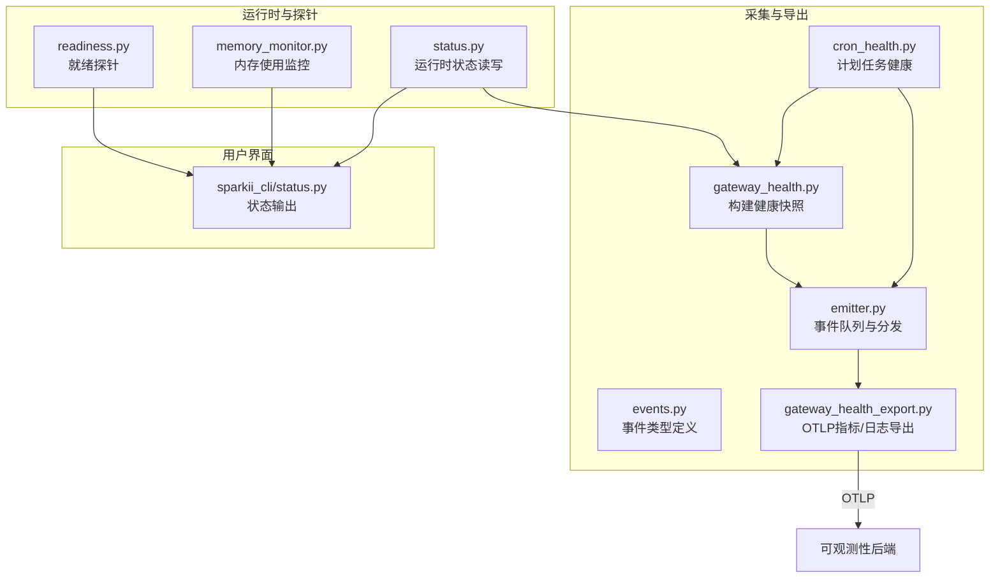
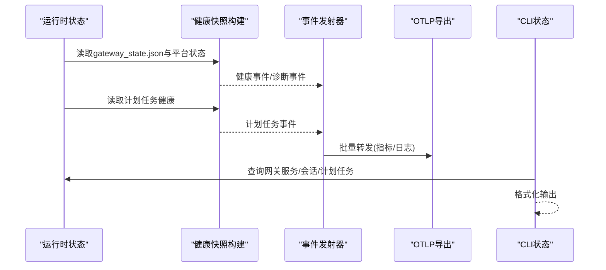
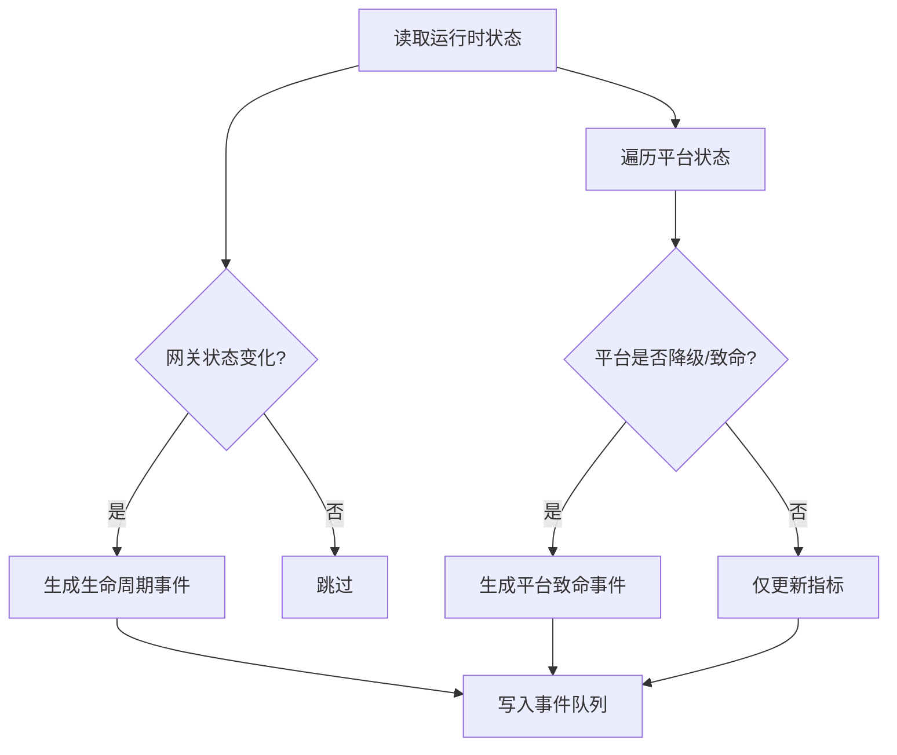
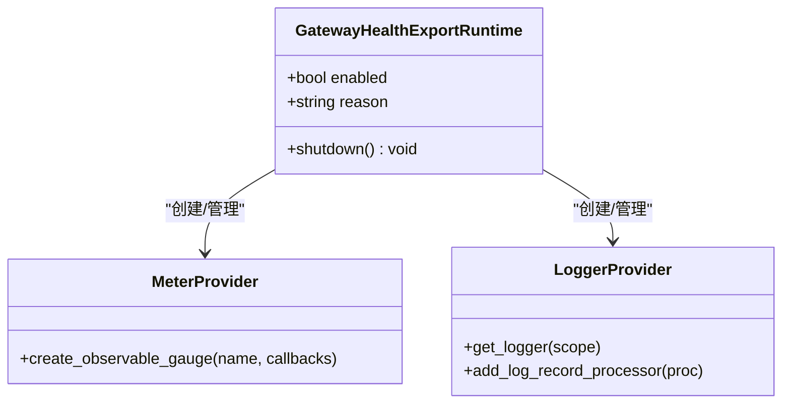
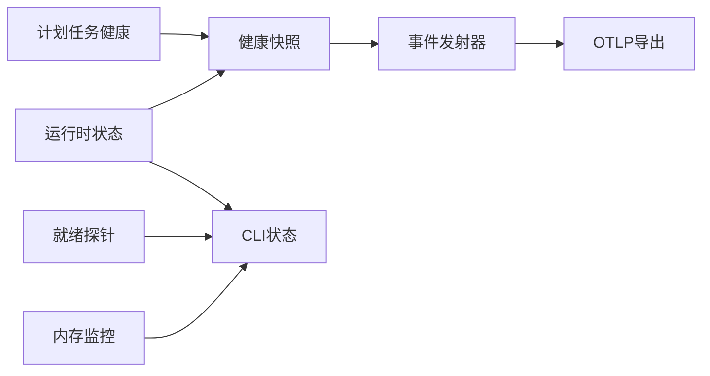

# 系统监控

<cite>
**本文引用的文件**
- [gateway_health.py](file://agent/monitoring/gateway_health.py)
- [gateway_health_export.py](file://agent/monitoring/gateway_health_export.py)
- [emitter.py](file://agent/monitoring/emitter.py)
- [events.py](file://agent/monitoring/events.py)
- [cron_health.py](file://agent/monitoring/cron_health.py)
- [memory_monitor.py](file://gateway/memory_monitor.py)
- [readiness.py](file://gateway/readiness.py)
- [status.py](file://gateway/status.py)
- [sparkii_cli/status.py](file://sparkii_cli/status.py)
</cite>

## 目录
1. [简介](#简介)
2. [项目结构](#项目结构)
3. [核心组件](#核心组件)
4. [架构总览](#架构总览)
5. [详细组件分析](#详细组件分析)
6. [依赖关系分析](#依赖关系分析)
7. [性能考量](#性能考量)
8. [故障排查指南](#故障排查指南)
9. [结论](#结论)
10. [附录](#附录)

## 简介
本文件面向运维与平台工程团队，系统化说明本仓库中的“系统监控”能力：包括网关健康、资源使用（内存、磁盘）、计划任务健康、就绪探针、指标导出与事件流。文档覆盖以下目标：
- 实时监控面板所需的关键指标来源与含义（如活跃代理数、平台连接状态、后台工作负载等）
- 网关服务健康查看方法（连接状态、响应时间、错误率等关键指标的获取路径）
- 系统负载监控要点（进程数量、线程使用情况、文件描述符限制等）
- 资源使用趋势分析与容量规划建议（历史数据、峰值识别、告警阈值）
- 告警配置思路（阈值设置、通知方式、规则定制）
- 性能瓶颈识别与优化建议

## 项目结构
监控相关代码主要分布在两个区域：
- agent/monitoring：负责采集、归一化、事件发射与OTLP导出（指标与诊断日志）
- gateway：提供运行时状态、内存监控、就绪探针等底层能力
- sparkii_cli/status：提供命令行视图，便于快速检查环境、网关与服务状态

**图表来源**
- [gateway_health.py:210-291](file://agent/monitoring/gateway_health.py#L210-L291)
- [cron_health.py:148-192](file://agent/monitoring/cron_health.py#L148-L192)
- [emitter.py:36-117](file://agent/monitoring/emitter.py#L36-L117)
- [events.py:19-79](file://agent/monitoring/events.py#L19-L79)
- [gateway_health_export.py:417-468](file://agent/monitoring/gateway_health_export.py#L417-L468)
- [status.py:583-593](file://gateway/status.py#L583-L593)
- [memory_monitor.py:83-127](file://gateway/memory_monitor.py#L83-L127)
- [readiness.py:89-119](file://gateway/readiness.py#L89-L119)
- [sparkii_cli/status.py:547-577](file://sparkii_cli/status.py#L547-L577)

**章节来源**
- [gateway_health.py:210-291](file://agent/monitoring/gateway_health.py#L210-L291)
- [gateway_health_export.py:417-468](file://agent/monitoring/gateway_health_export.py#L417-L468)
- [emitter.py:36-117](file://agent/monitoring/emitter.py#L36-L117)
- [events.py:19-79](file://agent/monitoring/events.py#L19-L79)
- [cron_health.py:148-192](file://agent/monitoring/cron_health.py#L148-L192)
- [memory_monitor.py:83-127](file://gateway/memory_monitor.py#L83-L127)
- [readiness.py:89-119](file://gateway/readiness.py#L89-L119)
- [status.py:583-593](file://gateway/status.py#L583-L593)
- [sparkii_cli/status.py:547-577](file://sparkii_cli/status.py#L547-L577)

## 核心组件
- 健康快照与事件
  - 网关健康快照：聚合网关运行态、平台状态、活跃代理数、忙碌/可排空标志、重启请求等，并生成健康事件与诊断事件。
  - 计划任务健康快照：心跳年龄、最近成功年龄、追赶次数、启用/运行/逾期任务数。
- 事件总线
  - 无阻塞事件队列+后台派发线程；支持批量订阅、失败隔离、丢弃计数与统计。
- OTLP导出
  - 指标：周期性读取快照，注册为可观察Gauge，按间隔上报。
  - 诊断日志：将网关诊断事件映射为OTLP日志记录，保留受控的源日志器作为scope。
- 运行时状态
  - 持久化gateway_state.json，包含PID、状态、平台信息、更新时间等。
- 内存监控
  - 周期打印RSS、GC计数、线程数、运行时长，便于发现慢泄漏。
- 就绪探针
  - 对状态数据库、配置文件、磁盘空间、网关状态、后台队列等进行非破坏性探测，返回整体与健康子项状态。
- CLI状态
  - 汇总展示环境、密钥、认证、网关服务、计划任务、会话等信息，便于快速定位问题。

**章节来源**
- [gateway_health.py:210-291](file://agent/monitoring/gateway_health.py#L210-L291)
- [cron_health.py:148-192](file://agent/monitoring/cron_health.py#L148-L192)
- [emitter.py:36-117](file://agent/monitoring/emitter.py#L36-L117)
- [gateway_health_export.py:417-468](file://agent/monitoring/gateway_health_export.py#L417-L468)
- [memory_monitor.py:83-127](file://gateway/memory_monitor.py#L83-L127)
- [readiness.py:89-119](file://gateway/readiness.py#L89-L119)
- [sparkii_cli/status.py:547-577](file://sparkii_cli/status.py#L547-L577)

## 架构总览
下图展示了从运行时状态到指标/日志导出的完整链路，以及CLI如何消费这些能力进行状态展示。

**图表来源**
- [gateway_health.py:210-291](file://agent/monitoring/gateway_health.py#L210-L291)
- [cron_health.py:148-192](file://agent/monitoring/cron_health.py#L148-L192)
- [emitter.py:36-117](file://agent/monitoring/emitter.py#L36-L117)
- [gateway_health_export.py:417-468](file://agent/monitoring/gateway_health_export.py#L417-L468)
- [sparkii_cli/status.py:547-577](file://sparkii_cli/status.py#L547-L577)

## 详细组件分析

### 网关健康与诊断
- 健康快照
  - 指标：网关是否在线、活跃代理数、忙碌/可排空标志、重启请求、平台上下线与健康度。
  - 事件：生命周期变更、平台致命错误、启动失败等。
- 错误分类
  - 基于文本模式将错误归类为认证失败、限流、超时、网络错误、配置无效、启动失败、平台致命等，便于告警与检索。
- 日志桥接
  - 仅允许网关域日志进入诊断通道，并对消息进行脱敏与长度限制。

**图表来源**
- [gateway_health.py:210-291](file://agent/monitoring/gateway_health.py#L210-L291)
- [gateway_health.py:70-119](file://agent/monitoring/gateway_health.py#L70-L119)
- [gateway_health.py:427-458](file://agent/monitoring/gateway_health.py#L427-L458)

**章节来源**
- [gateway_health.py:210-291](file://agent/monitoring/gateway_health.py#L210-L291)
- [gateway_health.py:70-119](file://agent/monitoring/gateway_health.py#L70-L119)
- [gateway_health.py:427-458](file://agent/monitoring/gateway_health.py#L427-L458)

### 计划任务健康
- 指标：调度器心跳年龄、最近成功年龄、追赶次数、启用/运行/逾期任务数。
- 执行事件：任务开始/完成/失败的生命周期投影，包含耗时、投递结果、错误分类。

**章节来源**
- [cron_health.py:148-192](file://agent/monitoring/cron_health.py#L148-L192)
- [cron_health.py:90-129](file://agent/monitoring/cron_health.py#L90-L129)

### 事件发射器（无阻塞队列）
- 设计原则：emit()必须微秒级返回、不阻塞、永不抛异常；队列满时丢弃最旧事件，保证最新优先。
- 后台线程批量派发至订阅者（OTLP指标/日志），单个订阅者失败不影响其他订阅者与热路径。
- 提供flush、stats、close等工具方法用于测试与优雅关闭。

**章节来源**
- [emitter.py:36-117](file://agent/monitoring/emitter.py#L36-L117)
- [emitter.py:132-164](file://agent/monitoring/emitter.py#L132-L164)

### OTLP导出（指标与诊断日志）
- 指标导出
  - 周期性读取运行时快照，注册为可观察Gauge，按配置间隔上报。
  - 指标集合包含网关健康、平台健康、后台工作负载、计划任务健康等。
- 诊断日志导出
  - 订阅事件流，将网关诊断事件转换为OTLP日志记录，保留受控的source_logger作为scope。
- 资源属性
  - 安全白名单的资源标签与实例ID哈希，避免泄露敏感信息。

**图表来源**
- [gateway_health_export.py:101-165](file://agent/monitoring/gateway_health_export.py#L101-L165)
- [gateway_health_export.py:417-468](file://agent/monitoring/gateway_health_export.py#L417-L468)
- [gateway_health_export.py:485-556](file://agent/monitoring/gateway_health_export.py#L485-L556)

**章节来源**
- [gateway_health_export.py:417-468](file://agent/monitoring/gateway_health_export.py#L417-L468)
- [gateway_health_export.py:485-556](file://agent/monitoring/gateway_health_export.py#L485-L556)

### 运行时状态与就绪探针
- 运行时状态
  - 持久化gateway_state.json，包含PID、网关状态、平台信息、更新时间等，供健康与诊断模块读取。
- 就绪探针
  - 检查状态数据库可读性、配置文件合法性、磁盘使用率、网关状态、后台队列深度等，返回整体与分项状态。

**章节来源**
- [status.py:583-593](file://gateway/status.py#L583-L593)
- [readiness.py:89-119](file://gateway/readiness.py#L89-L119)

### 内存监控
- 周期打印RSS、GC计数、线程数、运行时长，便于发现慢泄漏。
- 支持在启动、关闭等关键阶段输出基线与最终快照。

**章节来源**
- [memory_monitor.py:83-127](file://gateway/memory_monitor.py#L83-L127)
- [memory_monitor.py:139-193](file://gateway/memory_monitor.py#L139-L193)

### CLI状态输出
- 展示环境、API密钥、认证、网关服务、计划任务、会话、插槽占用等信息，便于快速定位问题。
- 支持深度检查（如OpenRouter可达性、端口占用）。

**章节来源**
- [sparkii_cli/status.py:547-577](file://sparkii_cli/status.py#L547-L577)
- [sparkii_cli/status.py:687-718](file://sparkii_cli/status.py#L687-L718)

## 依赖关系分析
- 健康快照依赖运行时状态与平台状态；计划任务健康依赖调度器与作业加载。
- 事件发射器解耦生产与消费，OTLP导出作为消费者之一。
- 就绪探针与内存监控独立于事件流，直接提供本地可观测能力。
- CLI状态通过调用运行时状态与计划任务接口，形成统一视图。

**图表来源**
- [gateway_health.py:210-291](file://agent/monitoring/gateway_health.py#L210-L291)
- [cron_health.py:148-192](file://agent/monitoring/cron_health.py#L148-L192)
- [emitter.py:36-117](file://agent/monitoring/emitter.py#L36-L117)
- [gateway_health_export.py:417-468](file://agent/monitoring/gateway_health_export.py#L417-L468)
- [readiness.py:89-119](file://gateway/readiness.py#L89-L119)
- [memory_monitor.py:83-127](file://gateway/memory_monitor.py#L83-L127)
- [sparkii_cli/status.py:547-577](file://sparkii_cli/status.py#L547-L577)

**章节来源**
- [gateway_health.py:210-291](file://agent/monitoring/gateway_health.py#L210-L291)
- [cron_health.py:148-192](file://agent/monitoring/cron_health.py#L148-L192)
- [emitter.py:36-117](file://agent/monitoring/emitter.py#L36-L117)
- [gateway_health_export.py:417-468](file://agent/monitoring/gateway_health_export.py#L417-L468)
- [readiness.py:89-119](file://gateway/readiness.py#L89-L119)
- [memory_monitor.py:83-127](file://gateway/memory_monitor.py#L83-L127)
- [sparkii_cli/status.py:547-577](file://sparkii_cli/status.py#L547-L577)

## 性能考量
- 事件发射器采用无阻塞队列与批量派发，确保热路径不受影响；队列满时丢弃最旧事件，保护系统稳定性。
- OTLP导出使用周期性读取与批处理处理器，降低网络开销。
- 内存监控以固定间隔输出结构化行，避免频繁IO；在启动与关闭时输出基线与最终快照，便于对比。
- 就绪探针使用只读查询与短超时，避免对正常写入造成竞争。

[本节为通用指导，不直接分析具体文件]

## 故障排查指南
- 网关健康
  - 关注平台致命事件与错误分类（认证失败、限流、超时、网络错误、配置无效、启动失败等），结合生命周期事件定位状态变迁。
- 计划任务
  - 检查心跳年龄与最近成功年龄，确认调度器是否存活；逾期任务数上升需排查依赖或资源瓶颈。
- 内存与线程
  - 通过内存监控输出的RSS、GC计数、线程数判断是否存在慢泄漏或线程泄漏；关注启动与关闭时的基线与最终值。
- 磁盘与配置
  - 就绪探针中磁盘使用率超过阈值会标记为降级；配置文件解析失败也会标记降级。
- CLI快速诊断
  - 使用状态命令查看网关服务、计划任务、会话与插槽占用；必要时开启深度检查验证外部可达性与端口占用。

**章节来源**
- [gateway_health.py:70-119](file://agent/monitoring/gateway_health.py#L70-L119)
- [cron_health.py:148-192](file://agent/monitoring/cron_health.py#L148-L192)
- [memory_monitor.py:83-127](file://gateway/memory_monitor.py#L83-L127)
- [readiness.py:61-87](file://gateway/readiness.py#L61-L87)
- [sparkii_cli/status.py:547-577](file://sparkii_cli/status.py#L547-L577)

## 结论
本仓库提供了完整的系统监控能力：从运行时状态采集、健康快照构建、事件总线分发，到OTLP指标与诊断日志导出，辅以内存监控与就绪探针，形成端到端的可观测闭环。运维人员可据此搭建实时监控面板、制定告警规则、开展趋势分析与容量规划，并通过CLI快速定位问题。

[本节为总结性内容，不直接分析具体文件]

## 附录

### 关键指标与含义（来自健康快照与计划任务健康）
- 网关健康
  - sparkii.gateway.up：网关是否在线
  - sparkii.gateway.active_agents：活跃代理数
  - sparkii.gateway.busy：是否忙碌
  - sparkii.gateway.drainable：是否可排空
  - sparkii.gateway.restart_requested：是否请求重启
  - sparkii.platform.up / sparkii.platform.degraded：平台上下线与降级
  - sparkii.gateway.background_work / background_delegations：后台工作负载与委托数
- 计划任务健康
  - sparkii.cron.scheduler.heartbeat_age_seconds：心跳年龄
  - sparkii.cron.scheduler.last_success_age_seconds：最近成功年龄
  - sparkii.cron.scheduler.catch_up_occurrences：追赶次数
  - sparkii.cron.jobs.enabled / running / overdue：启用/运行/逾期任务数

**章节来源**
- [gateway_health.py:230-239](file://agent/monitoring/gateway_health.py#L230-L239)
- [gateway_health_export.py:437-454](file://agent/monitoring/gateway_health_export.py#L437-L454)
- [cron_health.py:148-192](file://agent/monitoring/cron_health.py#L148-L192)

### 告警配置建议（基于现有指标）
- 阈值设置
  - 平台降级/致命：sparkii.platform.degraded=1持续N分钟
  - 网关离线：sparkii.gateway.up=0持续N分钟
  - 计划任务心跳停滞：sparkii.cron.scheduler.heartbeat_age_seconds > 阈值
  - 逾期任务：sparkii.cron.jobs.overdue > 0
- 通知方式
  - 通过OTLP后端接入告警系统（如Prometheus Alertmanager、Grafana Alerting等），将指标与日志事件路由至通知渠道。
- 规则定制
  - 结合错误分类（auth_failed、rate_limited、timeout、network_error、invalid_config、startup_failed、platform_fatal）细化告警规则与降噪策略。

[本节为通用指导，不直接分析具体文件]

### 性能瓶颈识别与优化建议
- 内存增长
  - 依据内存监控输出的RSS与GC计数趋势，识别慢泄漏；在启动/关闭基线与最终值之间对比，定位异常增长区间。
- 线程与并发
  - 线程数异常增长可能指示泄漏；结合活跃代理数与后台工作负载评估并发压力。
- 磁盘与I/O
  - 就绪探针中磁盘使用率接近阈值时应扩容或清理；状态数据库只读探针应避免竞争。
- 网络与外部依赖
  - 错误分类中网络错误与超时占比高时，应检查网络连通性、DNS、证书与上游服务SLA。

[本节为通用指导，不直接分析具体文件]