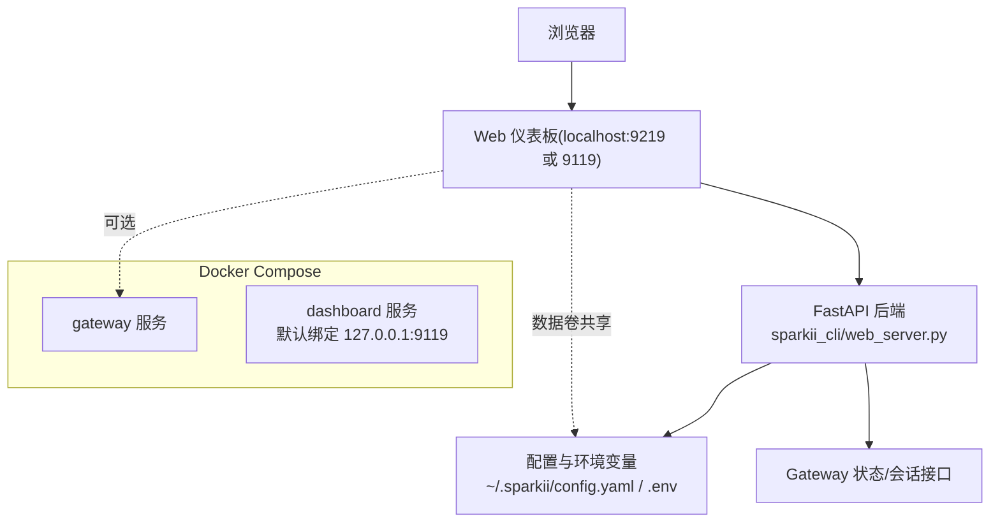
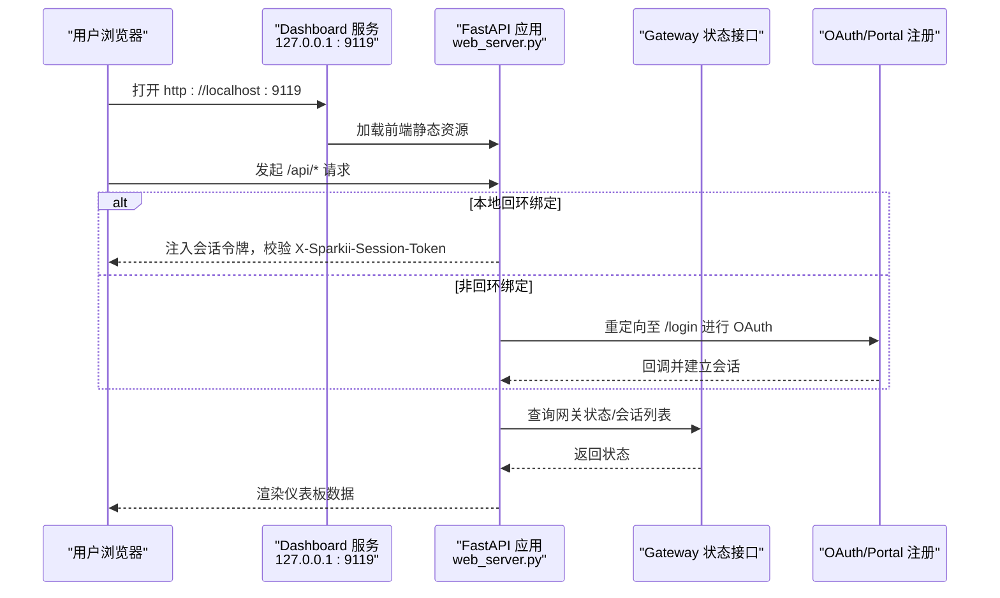
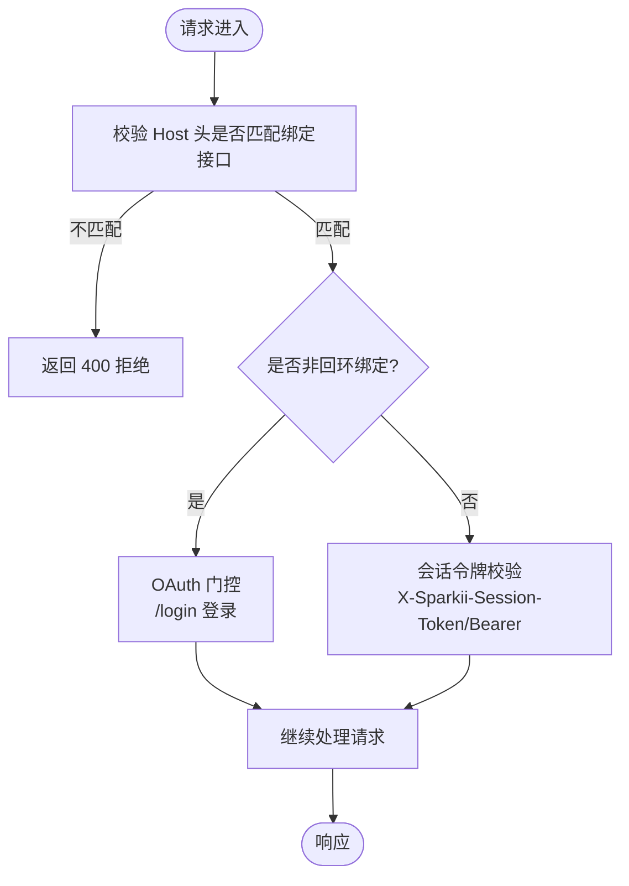
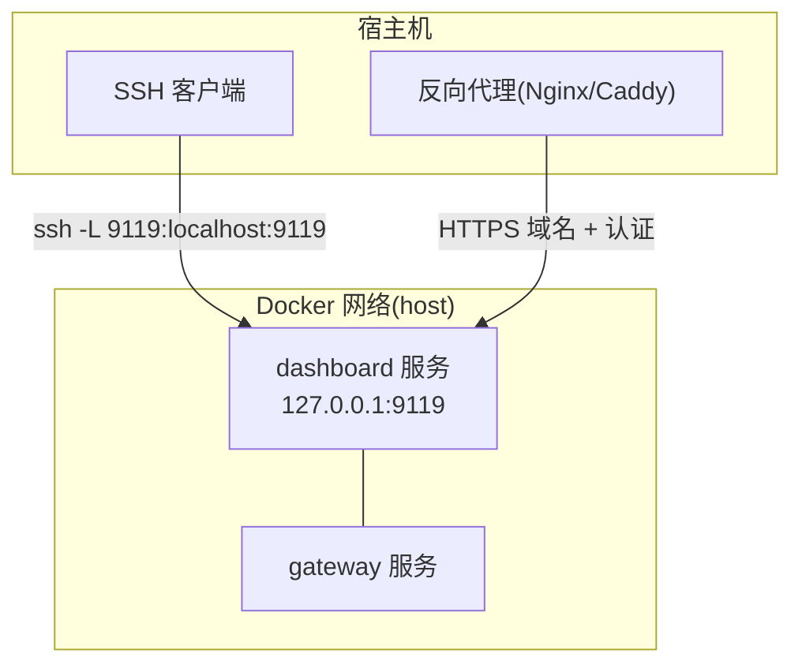
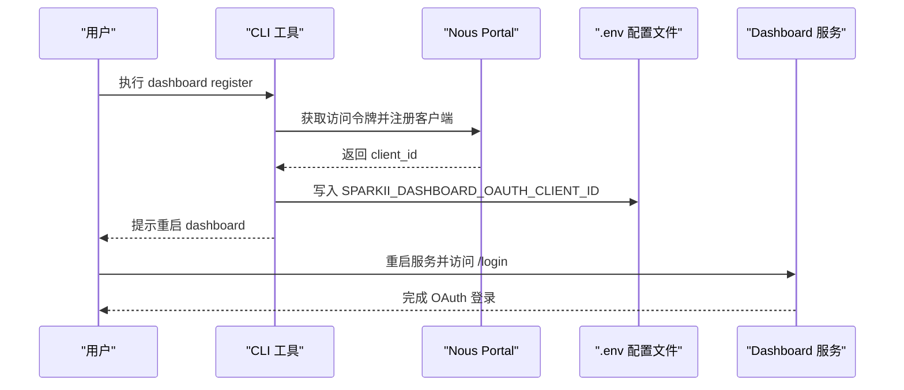
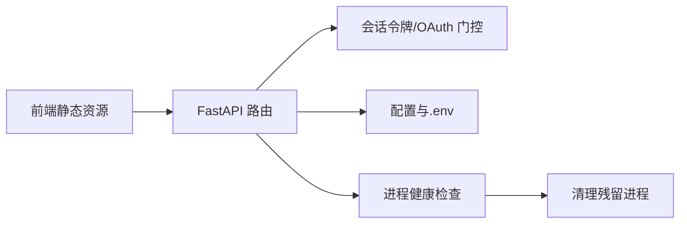

# 访问与设置

<cite>
**本文引用的文件**
- [README.md](file://README.md)
- [docker-compose.yml](file://docker-compose.yml)
- [Dockerfile](file://Dockerfile)
- [web_server.py](file://sparkii_cli/web_server.py)
- [dashboard_procs.py](file://sparkii_cli/dashboard_procs.py)
- [dashboard_register.py](file://sparkii_cli/dashboard_register.py)
- [main.py](file://sparkii_cli/main.py)
- [config.py](file://sparkii_cli/config.py)
- [entrypoint.sh](file://docker/entrypoint.sh)
- [main-wrapper.sh](file://docker/main-wrapper.sh)
</cite>

## 目录
1. [简介](#简介)
2. [项目结构](#项目结构)
3. [核心组件](#核心组件)
4. [架构总览](#架构总览)
5. [详细组件分析](#详细组件分析)
6. [依赖关系分析](#依赖关系分析)
7. [性能考虑](#性能考虑)
8. [故障排查指南](#故障排查指南)
9. [结论](#结论)
10. [附录](#附录)

## 简介
本指南面向首次使用 Sparkii Web 仪表板的用户，说明如何启动服务、访问本地或远程界面、完成首次初始化（认证与基础配置），以及在 Docker 容器化部署、本地开发环境、生产环境等不同场景下的访问方式。同时提供网络与安全相关配置建议（端口、防火墙、反向代理、SSL）以及常见问题排查方法，帮助新用户快速成功访问并使用 Web 仪表板。

## 项目结构
Sparkii 的 Web 仪表板由后端 FastAPI 服务与前端静态资源组成，可通过 CLI 命令启动，也可通过 Docker Compose 以独立 dashboard 服务运行。关键要点：
- 默认监听回环地址（如 127.0.0.1），适合本地安全访问；如需远程访问，应通过 SSH 隧道或反向代理并启用认证。
- 内置会话令牌认证（本地模式）或 OAuth 门控（非回环绑定）。
- Docker 镜像内预构建前端资源，并通过 s6-overlay 管理多进程（gateway、dashboard 等）。

图表来源
- [docker-compose.yml:63-76](file://docker-compose.yml#L63-L76)
- [web_server.py:313-378](file://sparkii_cli/web_server.py#L313-L378)

章节来源
- [docker-compose.yml:1-77](file://docker-compose.yml#L1-L77)
- [Dockerfile:336-380](file://Dockerfile#L336-L380)
- [web_server.py:313-378](file://sparkii_cli/web_server.py#L313-L378)

## 核心组件
- Web 服务器与路由：基于 FastAPI，提供 REST API、WebSocket 与静态页面托管，支持 CORS、Host 头校验、会话令牌与 OAuth 门控。
- 进程管理：检测并清理残留的 dashboard/serve 进程，避免更新前后端不匹配导致鉴权失败。
- 注册与认证：支持将自托管仪表板注册到 Nous Portal，自动写入环境变量，并在非回环绑定下启用登录门控。
- 配置管理：集中读取 config.yaml 与 .env，提供解析失败保护与备份机制。

章节来源
- [web_server.py:313-671](file://sparkii_cli/web_server.py#L313-L671)
- [dashboard_procs.py:28-145](file://sparkii_cli/dashboard_procs.py#L28-L145)
- [dashboard_register.py:230-428](file://sparkii_cli/dashboard_register.py#L230-L428)
- [config.py:45-156](file://sparkii_cli/config.py#L45-L156)

## 架构总览
下图展示从浏览器到后端的请求路径，包括本地回环模式与非回环模式的认证差异，以及 Docker Compose 中 dashboard 服务的默认绑定策略。

图表来源
- [web_server.py:398-471](file://sparkii_cli/web_server.py#L398-L471)
- [web_server.py:538-671](file://sparkii_cli/web_server.py#L538-L671)
- [dashboard_register.py:230-428](file://sparkii_cli/dashboard_register.py#L230-L428)
- [docker-compose.yml:63-76](file://docker-compose.yml#L63-L76)

## 详细组件分析

### Web 服务器与认证流程
- 默认监听与绑定：CLI 启动时默认在 127.0.0.1:9219 启动；Docker Compose 中的 dashboard 服务默认绑定 127.0.0.1:9119。
- 认证策略：
  - 本地回环模式：通过注入的会话令牌（X-Sparkii-Session-Token 或 Bearer）校验敏感接口。
  - 非回环模式：强制启用 OAuth 门控，需通过 /login 登录。
- Host 头校验：防止 DNS 重绑定攻击，仅接受与绑定接口匹配的 Host。
- CORS：限制为 localhost/127.0.0.1 来源，避免跨站读取配置与密钥。

图表来源
- [web_server.py:472-565](file://sparkii_cli/web_server.py#L472-L565)
- [web_server.py:398-471](file://sparkii_cli/web_server.py#L398-L471)
- [web_server.py:373-378](file://sparkii_cli/web_server.py#L373-L378)

章节来源
- [web_server.py:313-671](file://sparkii_cli/web_server.py#L313-L671)

### Docker Compose 与容器化部署
- 服务模型：包含 gateway 与 dashboard 两个服务，均使用 host 网络模式，便于直接暴露端口。
- Dashboard 绑定：默认绑定 127.0.0.1，禁止外部直连；推荐通过 SSH 隧道或反向代理访问。
- 数据卷：挂载 ~/.sparkii 到容器内 /opt/data，保证配置与状态持久化。
- 入口点：使用 s6-overlay 的 /init 作为 PID 1，执行阶段钩子与主程序包装器。

图表来源
- [docker-compose.yml:30-76](file://docker-compose.yml#L30-L76)
- [Dockerfile:424-457](file://Dockerfile#L424-L457)
- [main-wrapper.sh:1-92](file://docker/main-wrapper.sh#L1-L92)

章节来源
- [docker-compose.yml:1-77](file://docker-compose.yml#L1-L77)
- [Dockerfile:336-457](file://Dockerfile#L336-L457)
- [main-wrapper.sh:1-92](file://docker/main-wrapper.sh#L1-L92)
- [entrypoint.sh:1-29](file://docker/entrypoint.sh#L1-L29)

### 首次访问初始化流程
- 本地模式：直接访问 http://localhost:9119（Docker）或 http://localhost:9219（CLI），前端注入会话令牌，无需额外登录。
- 远程模式：若绑定到公网或局域网，必须启用 OAuth 门控，先访问 /login 完成登录。
- 注册仪表板：可使用 dashboard register 命令自动在 Nous Portal 注册自托管客户端，并写入环境变量；随后重启 dashboard 生效。

图表来源
- [dashboard_register.py:230-428](file://sparkii_cli/dashboard_register.py#L230-L428)
- [web_server.py:644-671](file://sparkii_cli/web_server.py#L644-L671)

章节来源
- [dashboard_register.py:230-428](file://sparkii_cli/dashboard_register.py#L230-L428)
- [web_server.py:644-671](file://sparkii_cli/web_server.py#L644-L671)

### 不同部署模式的访问方式
- 本地开发环境：
  - CLI 启动：默认 http://localhost:9219，适用于本机调试。
  - 注意事项：确保端口未被占用；CORS 仅允许 localhost/127.0.0.1。
- Docker 容器化部署：
  - 使用 docker-compose 启动 dashboard 服务，默认 127.0.0.1:9119。
  - 远程访问：通过 SSH 隧道或反向代理，不要直接暴露 0.0.0.0。
- 生产环境：
  - 建议使用反向代理（Nginx/Caddy）提供 HTTPS 与认证。
  - 保持 dashboard 绑定回环地址，仅代理可被外网访问。

章节来源
- [web_server.py:313-378](file://sparkii_cli/web_server.py#L313-L378)
- [docker-compose.yml:63-76](file://docker-compose.yml#L63-L76)

### 网络与安全配置
- 端口与绑定：
  - 本地：9219（CLI）或 9119（Docker dashboard）。
  - 绑定地址：默认 127.0.0.1，禁止直接对外暴露。
- 防火墙：
  - 仅放行必要的入站端口（如反向代理的 443）。
  - 不建议开放 9119/9219 到公网。
- 反向代理与 SSL：
  - 在 Nginx/Caddy 中配置域名、HTTPS 证书与基础认证。
  - 将 /api/* 转发到 127.0.0.1:9119，保留 Host 头。
- 跨域请求：
  - 默认仅允许 localhost/127.0.0.1；如需自定义来源，请谨慎评估安全风险。

章节来源
- [web_server.py:373-378](file://sparkii_cli/web_server.py#L373-L378)
- [web_server.py:472-565](file://sparkii_cli/web_server.py#L472-L565)
- [docker-compose.yml:63-76](file://docker-compose.yml#L63-L76)

### 浏览器兼容性
- 现代浏览器：Chrome、Edge、Firefox、Safari 的最新稳定版本均可正常使用。
- 功能要求：支持 WebSocket、ES Modules、Fetch API。
- 建议：保持浏览器更新至最新版本以获得最佳兼容性与安全性。

[本节为通用指导，不直接分析具体文件]

## 依赖关系分析
- 前端与后端：前端静态资源由后端托管，通过 FastAPI 的 StaticFiles 提供服务。
- 认证链路：本地模式依赖会话令牌；远程模式依赖 OAuth 门控与 Portal 注册。
- 进程管理：更新或重启时需清理残留进程，避免前后端版本不一致导致的鉴权失败。

图表来源
- [web_server.py:313-378](file://sparkii_cli/web_server.py#L313-L378)
- [dashboard_procs.py:28-145](file://sparkii_cli/dashboard_procs.py#L28-L145)

章节来源
- [web_server.py:313-671](file://sparkii_cli/web_server.py#L313-L671)
- [dashboard_procs.py:28-145](file://sparkii_cli/dashboard_procs.py#L28-L145)

## 性能考虑
- 冷启动优化：后端在生命周期启动时预热关键模块，减少首次请求延迟。
- 资源限制：合理设置反向代理的请求体大小与超时时间，避免大文件上传阻塞。
- 日志与健康检查：利用 /api/status 监控组件健康，结合系统日志定位问题。

章节来源
- [web_server.py:217-268](file://sparkii_cli/web_server.py#L217-L268)
- [web_server.py:688-800](file://sparkii_cli/web_server.py#L688-L800)

## 故障排查指南
- 端口冲突：
  - 现象：无法启动或访问被占用。
  - 解决：更换端口或停止占用进程；确认 CLI 与 Docker 端口不冲突。
- SSL 证书配置：
  - 现象：浏览器提示不安全连接。
  - 解决：在反向代理中配置有效证书，并确保域名解析正确。
- 跨域请求失败：
  - 现象：控制台报 CORS 错误。
  - 解决：确保来自 localhost/127.0.0.1；如需扩展来源，请评估风险并调整配置。
- 认证失败（401）：
  - 现象：API 调用返回未授权。
  - 解决：检查会话令牌是否正确注入；远程模式需完成 /login 登录。
- 进程残留导致不匹配：
  - 现象：更新后前端可用但 API 报错。
  - 解决：使用进程管理工具清理残留 dashboard/serve 进程并重启。

章节来源
- [web_server.py:398-471](file://sparkii_cli/web_server.py#L398-L471)
- [dashboard_procs.py:147-342](file://sparkii_cli/dashboard_procs.py#L147-L342)
- [config.py:45-156](file://sparkii_cli/config.py#L45-L156)

## 结论
通过本指南，您可以快速启动并访问 Sparkii Web 仪表板，理解本地与远程访问的差异，掌握首次初始化的认证与配置流程，并在不同部署模式下安全地暴露服务。遵循网络与安全最佳实践，可有效避免常见访问问题，确保新用户顺利上手。

## 附录
- 常用命令参考：
  - 启动 CLI 仪表板：默认 http://localhost:9219。
  - Docker Compose 启动 dashboard：默认 http://localhost:9119。
  - 注册仪表板客户端：使用 dashboard register 命令，按提示完成配置。
- 文档入口：
  - 快速开始、配置、消息网关、安全、工具与技能、记忆、MCP 集成、定时任务、上下文文件、架构、贡献指南、CLI 参考、环境变量等详见官方文档站点。

章节来源
- [README.md:105-184](file://README.md#L105-L184)