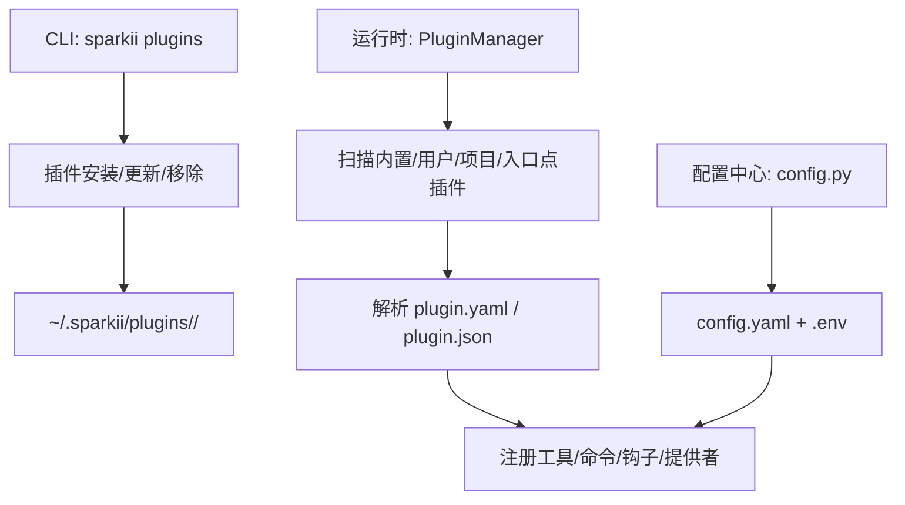
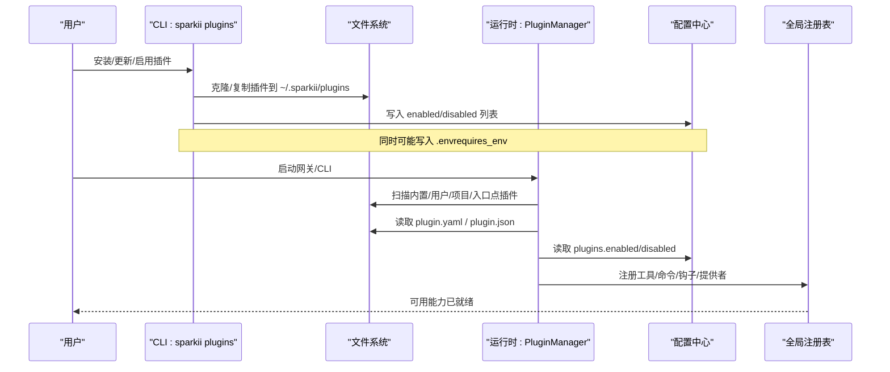
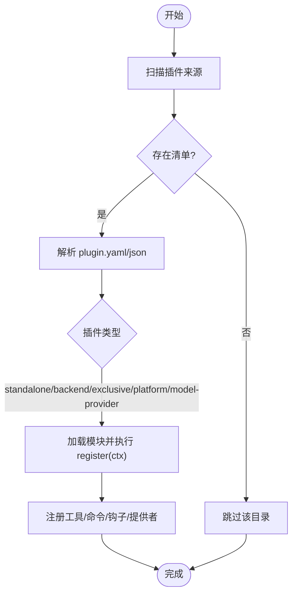
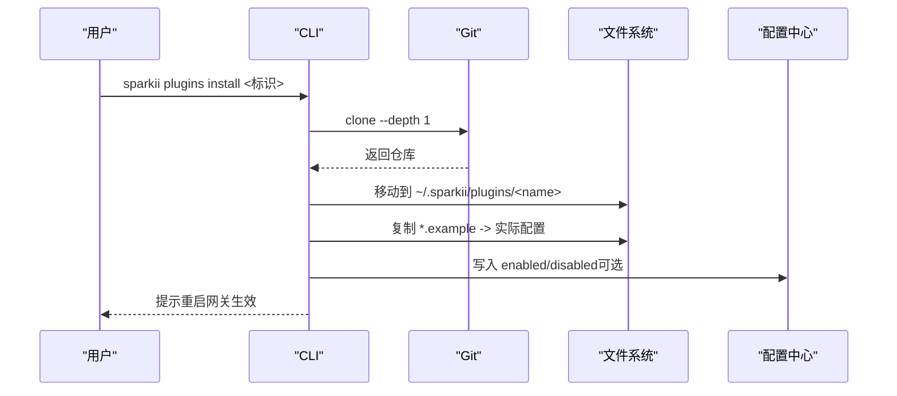
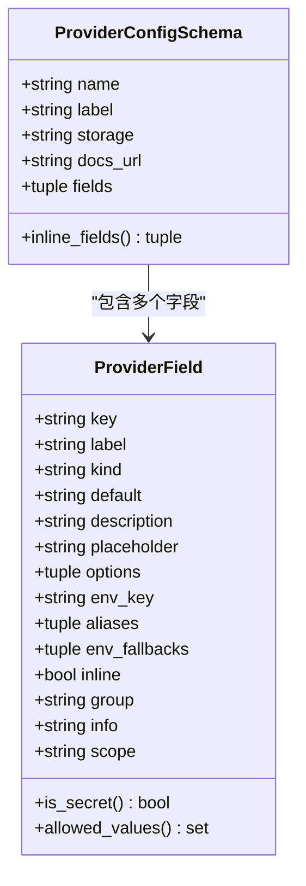
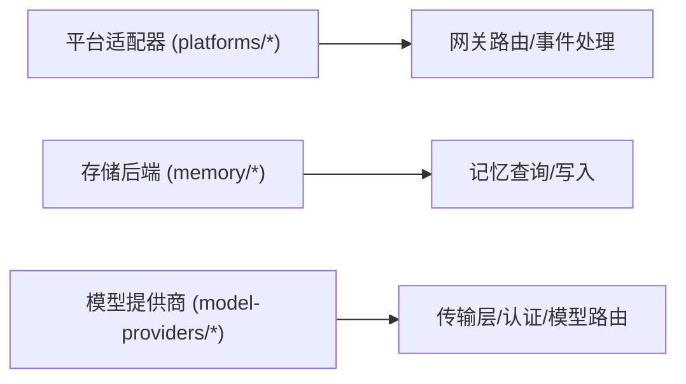
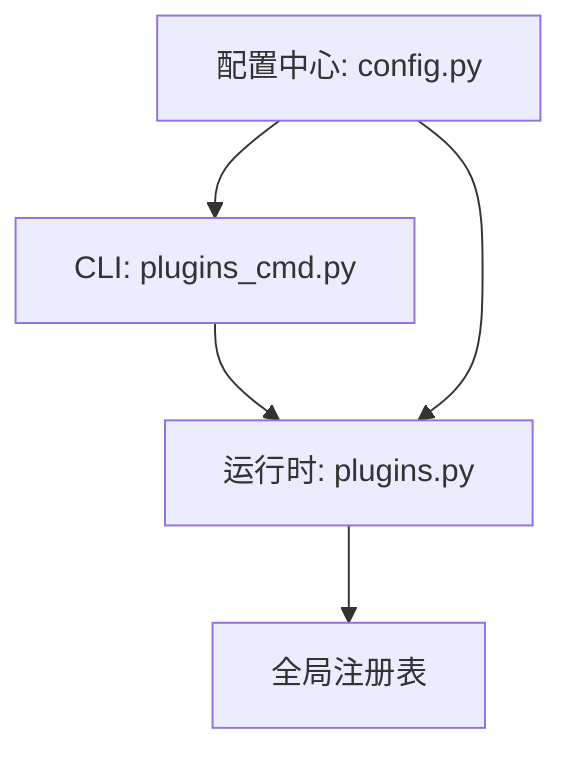

# 插件配置

<cite>
**本文引用的文件**
- [sparkii_cli/plugins.py](file://sparkii_cli/plugins.py)
- [sparkii_cli/plugins_cmd.py](file://sparkii_cli/plugins_cmd.py)
- [plugins/plugin_utils.py](file://plugins/plugin_utils.py)
- [sparkii_cli/config.py](file://sparkii_cli/config.py)
- [plugins/model-providers/README.md](file://plugins/model-providers/README.md)
- [plugins/memory/config_schema.py](file://plugins/memory/config_schema.py)
</cite>

## 目录
1. [简介](#简介)
2. [项目结构](#项目结构)
3. [核心组件](#核心组件)
4. [架构总览](#架构总览)
5. [详细组件分析](#详细组件分析)
6. [依赖关系分析](#依赖关系分析)
7. [性能考虑](#性能考虑)
8. [故障排查指南](#故障排查指南)
9. [结论](#结论)
10. [附录](#附录)

## 简介
本文件面向希望扩展系统能力的用户与开发者，系统性说明如何发现、安装、启用/禁用、配置和验证各类插件（内置与第三方），涵盖：
- 插件清单与生命周期钩子
- 配置文件结构与参数（API 密钥、连接参数、权限）
- 平台适配器（消息平台、存储后端、模型提供商等）的配置方法
- 冲突解决与版本兼容性管理
- 导入导出与批量管理
- 验证与测试能力

目标是让用户在不深入源码的情况下，也能安全、可靠地扩展系统功能。

## 项目结构
插件系统由 CLI 层、运行时加载器、插件包与配置中心共同组成：
- CLI 层负责安装、更新、移除、列出插件，以及交互式引导环境变量
- 运行时加载器负责扫描并加载插件、注册工具/命令/钩子/提供者
- 插件包提供 manifest（plugin.yaml/json）、实现代码与可选的示例配置
- 配置中心统一读取 config.yaml 与 .env，并提供校验与备份机制

图表来源
- [sparkii_cli/plugins_cmd.py:584-667](file://sparkii_cli/plugins_cmd.py#L584-L667)
- [sparkii_cli/plugins.py:56-67](file://sparkii_cli/plugins.py#L56-L67)
- [sparkii_cli/plugins.py:307-362](file://sparkii_cli/plugins.py#L307-L362)
- [sparkii_cli/config.py:45-156](file://sparkii_cli/config.py#L45-L156)

章节来源
- [sparkii_cli/plugins_cmd.py:584-667](file://sparkii_cli/plugins_cmd.py#L584-L667)
- [sparkii_cli/plugins.py:56-67](file://sparkii_cli/plugins.py#L56-L67)
- [sparkii_cli/plugins.py:307-362](file://sparkii_cli/plugins.py#L307-L362)
- [sparkii_cli/config.py:45-156](file://sparkii_cli/config.py#L45-L156)

## 核心组件
- 插件清单与元数据
  - 每个插件需包含 manifest（plugin.yaml 或 plugin.json），声明名称、版本、描述、作者、所需环境变量、提供的工具/钩子、插件类型（standalone/backend/exclusive/platform/model-provider）等。
- 插件上下文与注册能力
  - 通过 PluginContext 暴露 register_tool/register_command/register_*_provider 等方法，将插件能力注入到全局注册表。
- 插件生命周期钩子
  - 支持 pre/post 工具调用、LLM 调用前后、会话生命周期、网关分发前、审批流程、看板任务状态变更等钩子。
- 插件发现与优先级
  - 从四个来源发现插件：内置、用户目录、项目目录、pip 入口点；同名时后者覆盖前者。
- 启用/禁用策略
  - 通过 config.yaml 的 plugins.enabled 白名单与 plugins.disabled 黑名单控制加载；默认 opt-in。
- 环境变量与密钥管理
  - 插件可声明 requires_env；安装时交互式收集并写入 ~/.sparkii/.env；敏感字段以掩码提示。
- 配置模式与持久化
  - 部分插件（如记忆提供者）使用声明式配置模式（ProviderConfigSchema），由 Web 服务统一渲染与读写。

章节来源
- [sparkii_cli/plugins.py:136-219](file://sparkii_cli/plugins.py#L136-L219)
- [sparkii_cli/plugins.py:307-362](file://sparkii_cli/plugins.py#L307-L362)
- [sparkii_cli/plugins.py:368-800](file://sparkii_cli/plugins.py#L368-L800)
- [sparkii_cli/plugins_cmd.py:312-401](file://sparkii_cli/plugins_cmd.py#L312-L401)
- [plugins/memory/config_schema.py:43-104](file://plugins/memory/config_schema.py#L43-L104)

## 架构总览
下图展示插件从发现到启用的端到端流程，以及配置与环境变量的作用点。

图表来源
- [sparkii_cli/plugins_cmd.py:584-667](file://sparkii_cli/plugins_cmd.py#L584-L667)
- [sparkii_cli/plugins.py:56-67](file://sparkii_cli/plugins.py#L56-L67)
- [sparkii_cli/plugins.py:231-274](file://sparkii_cli/plugins.py#L231-L274)
- [sparkii_cli/plugins.py:307-362](file://sparkii_cli/plugins.py#L307-L362)

## 详细组件分析

### 插件发现与加载
- 来源与优先级
  - 内置插件、用户插件、项目插件、pip 入口点；同名后者优先覆盖。
- 清单解析
  - 优先解析 plugin.yaml/yml，其次兼容 portable 的 plugin.json。
- 类型与用途
  - standalone：独立插件，需显式启用
  - backend：为现有核心工具提供后端（如图像生成）
  - exclusive：类别内仅一个活跃提供者（如记忆）
  - platform：网关消息平台适配器
  - model-provider：模型提供商资料卡
- 调试日志
  - 设置 SPARKII_PLUGINS_DEBUG=1 可输出详细的发现与加载日志。

图表来源
- [sparkii_cli/plugins.py:56-67](file://sparkii_cli/plugins.py#L56-L67)
- [sparkii_cli/plugins_cmd.py:264-288](file://sparkii_cli/plugins_cmd.py#L264-L288)
- [sparkii_cli/plugins.py:307-362](file://sparkii_cli/plugins.py#L307-L362)

章节来源
- [sparkii_cli/plugins.py:56-67](file://sparkii_cli/plugins.py#L56-L67)
- [sparkii_cli/plugins_cmd.py:264-288](file://sparkii_cli/plugins_cmd.py#L264-L288)
- [sparkii_cli/plugins.py:307-362](file://sparkii_cli/plugins.py#L307-L362)

### 插件安装、启用与禁用
- 安装
  - 支持 Git URL、owner/repo 简写、浏览器链接、子目录指定；安装后自动复制 *.example 配置文件（若不存在）。
- 环境变量
  - 根据 requires_env 提示缺失变量，支持掩码输入并保存到 ~/.sparkii/.env。
- 启用/禁用
  - 安装后可选择立即启用；或通过 config.yaml 的 plugins.enabled/disabled 管理。
- 更新/移除
  - 支持 git pull 更新并清理旧字节码；支持按名移除。

图表来源
- [sparkii_cli/plugins_cmd.py:584-667](file://sparkii_cli/plugins_cmd.py#L584-L667)
- [sparkii_cli/plugins_cmd.py:670-729](file://sparkii_cli/plugins_cmd.py#L670-L729)
- [sparkii_cli/plugins_cmd.py:312-401](file://sparkii_cli/plugins_cmd.py#L312-L401)

章节来源
- [sparkii_cli/plugins_cmd.py:584-667](file://sparkii_cli/plugins_cmd.py#L584-L667)
- [sparkii_cli/plugins_cmd.py:670-729](file://sparkii_cli/plugins_cmd.py#L670-L729)
- [sparkii_cli/plugins_cmd.py:312-401](file://sparkii_cli/plugins_cmd.py#L312-L401)

### 插件配置结构与参数
- 清单字段
  - name/version/description/author/requires_env/provides_tools/provides_hooks/kind/key/portable/skill_namespace 等。
- 环境变量与密钥
  - requires_env 支持字符串或对象（含 name/description/url/secret），安装时交互式收集并保存至 .env。
- 权限与覆盖
  - 插件可通过 register_tool(..., override=True) 替换内置工具，但需要显式在 config.yaml 中开启 allow_tool_override。
- 配置模式（以记忆提供者为例）
  - 通过 ProviderConfigSchema 声明字段类型（text/select/secret/bool/number/json）、选项、是否机密、存储位置（flat_json 或 honcho_host_block）等，Web 界面统一渲染与读写。

图表来源
- [plugins/memory/config_schema.py:43-104](file://plugins/memory/config_schema.py#L43-L104)
- [plugins/memory/config_schema.py:94-104](file://plugins/memory/config_schema.py#L94-L104)

章节来源
- [sparkii_cli/plugins.py:307-362](file://sparkii_cli/plugins.py#L307-L362)
- [sparkii_cli/plugins_cmd.py:312-401](file://sparkii_cli/plugins_cmd.py#L312-L401)
- [plugins/memory/config_schema.py:43-104](file://plugins/memory/config_schema.py#L43-L104)

### 平台适配器配置（消息平台、存储后端、模型提供商）
- 消息平台（platforms/*）
  - 作为 platform 类型插件，通常随内置自动可用；用户安装的 platform 插件仍受 enabled 白名单限制。
- 存储后端（memory/*）
  - 通过 ProviderConfigSchema 声明配置项，Web 服务统一读写；支持 host/root 作用域与别名/环境回退。
- 模型提供商（model-providers/*）
  - 每个子目录是一个 ProviderProfile 插件，注册后由认证、配置、模型元数据等模块自动装配；用户目录同名覆盖内置。

图表来源
- [plugins/model-providers/README.md:17-26](file://plugins/model-providers/README.md#L17-L26)
- [plugins/memory/config_schema.py:112-144](file://plugins/memory/config_schema.py#L112-L144)

章节来源
- [plugins/model-providers/README.md:17-26](file://plugins/model-providers/README.md#L17-L26)
- [plugins/memory/config_schema.py:112-144](file://plugins/memory/config_schema.py#L112-L144)

### 生命周期钩子与扩展点
- 支持的钩子包括：工具调用前后、终端输出转换、工具结果转换、LLM 输出/调用前后、验证前、API 请求前后、会话生命周期、子代理生命周期、网关分发前、审批流程、看板任务状态变更等。
- 插件通过 register 回调向宿主注册这些钩子，宿主在相应时机触发。

章节来源
- [sparkii_cli/plugins.py:136-219](file://sparkii_cli/plugins.py#L136-L219)

### 并发与单例安全
- 插件应避免进程级懒加载单例的竞态条件；可使用提供的 lazy_singleton 装饰器或 SingletonSlot 类，确保线程安全的延迟初始化与重置。

章节来源
- [plugins/plugin_utils.py:1-136](file://plugins/plugin_utils.py#L1-L136)

### 冲突解决与版本兼容性
- 冲突解决
  - 同名插件：后发现的覆盖先发现的（用户/项目 > 内置）。
  - 工具覆盖：需显式允许 allow_tool_override，否则拒绝。
  - 唯一性类别：exclusive 类型仅允许一个活跃提供者。
- 版本兼容
  - 清单版本 manifest_version 受安装器支持上限限制；超出时会提示升级。
  - 模型提供商注册采用“最后写入者胜”的策略，便于用户覆盖内置。

章节来源
- [sparkii_cli/plugins.py:16-20](file://sparkii_cli/plugins.py#L16-L20)
- [sparkii_cli/plugins.py:439-520](file://sparkii_cli/plugins.py#L439-L520)
- [sparkii_cli/plugins_cmd.py:540-556](file://sparkii_cli/plugins_cmd.py#L540-L556)
- [plugins/model-providers/README.md:24-26](file://plugins/model-providers/README.md#L24-L26)

### 导入导出与批量管理
- 导出
  - 当前配置可通过配置中心查看与导出（例如使用配置命令查看当前值），结合 .env 与 config.yaml 进行迁移。
- 导入
  - 将目标环境的 config.yaml 与 .env 复制到新环境即可复用插件启用状态与密钥。
- 批量管理
  - 通过编辑 config.yaml 的 plugins.enabled/disabled 列表，或使用 CLI 的 enable/disable 操作进行批量开关。

章节来源
- [sparkii_cli/config.py:45-156](file://sparkii_cli/config.py#L45-L156)
- [sparkii_cli/plugins_cmd.py:732-800](file://sparkii_cli/plugins_cmd.py#L732-L800)

## 依赖关系分析
- CLI 与运行时
  - CLI 负责安装/更新/移除与交互引导；运行时负责扫描、解析清单、注册能力。
- 配置中心
  - 提供配置读取、错误恢复（损坏备份）、环境变量保护（禁止危险变量写入）等。
- 插件与注册表
  - 插件通过 PluginContext 将工具/命令/钩子/提供者注入全局注册表，供宿主调度。

图表来源
- [sparkii_cli/plugins_cmd.py:584-667](file://sparkii_cli/plugins_cmd.py#L584-L667)
- [sparkii_cli/plugins.py:307-362](file://sparkii_cli/plugins.py#L307-L362)
- [sparkii_cli/config.py:45-156](file://sparkii_cli/config.py#L45-L156)

章节来源
- [sparkii_cli/plugins_cmd.py:584-667](file://sparkii_cli/plugins_cmd.py#L584-L667)
- [sparkii_cli/plugins.py:307-362](file://sparkii_cli/plugins.py#L307-L362)
- [sparkii_cli/config.py:45-156](file://sparkii_cli/config.py#L45-L156)

## 性能考虑
- 懒加载与缓存
  - 使用 lazy_singleton/SingletonSlot 避免重复初始化昂贵资源，减少内存与连接泄漏风险。
- 字节码清理
  - 插件更新后清理 __pycache__，避免旧代码残留导致行为不一致。
- 配置解析失败防护
  - 配置解析失败会备份损坏文件并回退到默认配置，保证系统可用性。

章节来源
- [plugins/plugin_utils.py:43-136](file://plugins/plugin_utils.py#L43-L136)
- [sparkii_cli/plugins_cmd.py:697-703](file://sparkii_cli/plugins_cmd.py#L697-L703)
- [sparkii_cli/config.py:45-156](file://sparkii_cli/config.py#L45-L156)

## 故障排查指南
- 插件未显示/未加载
  - 检查是否在 plugins.enabled 白名单中，或被 plugins.disabled 黑名单屏蔽。
  - 确认插件目录包含有效的 plugin.yaml/json 与 __init__.py。
  - 开启 SPARKII_PLUGINS_DEBUG=1 查看详细发现与加载日志。
- 环境变量缺失
  - 运行安装流程重新提示补全 requires_env；或直接编辑 ~/.sparkii/.env。
- 工具覆盖被拒
  - 如需覆盖内置工具，需在 config.yaml 中为对应插件开启 allow_tool_override。
- 配置解析失败
  - 查看控制台与日志中的警告信息；系统已自动备份损坏的 config.yaml，修复后重启生效。

章节来源
- [sparkii_cli/plugins.py:231-274](file://sparkii_cli/plugins.py#L231-L274)
- [sparkii_cli/plugins.py:87-127](file://sparkii_cli/plugins.py#L87-L127)
- [sparkii_cli/plugins_cmd.py:312-401](file://sparkii_cli/plugins_cmd.py#L312-L401)
- [sparkii_cli/plugins.py:439-520](file://sparkii_cli/plugins.py#L439-L520)
- [sparkii_cli/config.py:45-156](file://sparkii_cli/config.py#L45-L156)

## 结论
通过统一的清单、注册表与配置体系，本插件系统实现了：
- 多来源插件发现与覆盖机制
- 细粒度的启用/禁用与权限控制
- 声明式配置与敏感信息管理
- 丰富的扩展点（工具、命令、钩子、提供者）
- 健壮的错误恢复与调试能力

遵循本文档的流程与最佳实践，用户可以安全、高效地扩展系统能力，并在复杂环境中保持稳定的运行体验。

## 附录
- 常用路径
  - 用户插件目录：~/.sparkii/plugins/
  - 配置文件：~/.sparkii/config.yaml
  - 环境变量：~/.sparkii/.env
- 常用命令
  - 安装：sparkii plugins install <标识>
  - 更新：sparkii plugins update <名称>
  - 移除：sparkii plugins remove <名称>
  - 启用/禁用：编辑 config.yaml 的 plugins.enabled/disabled
- 调试
  - 设置 SPARKII_PLUGINS_DEBUG=1 获取详细日志