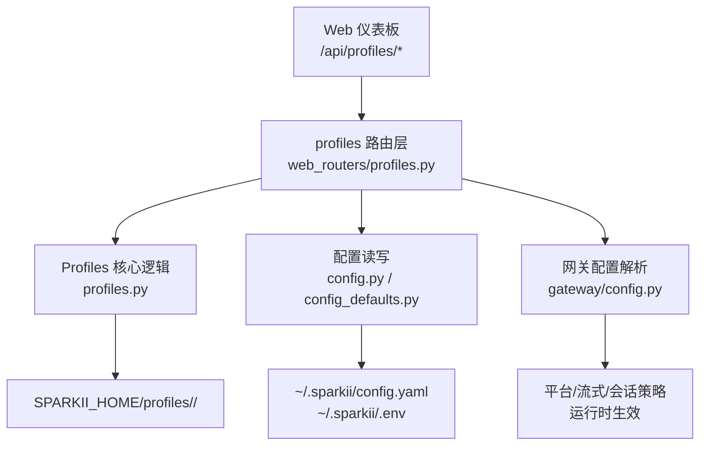
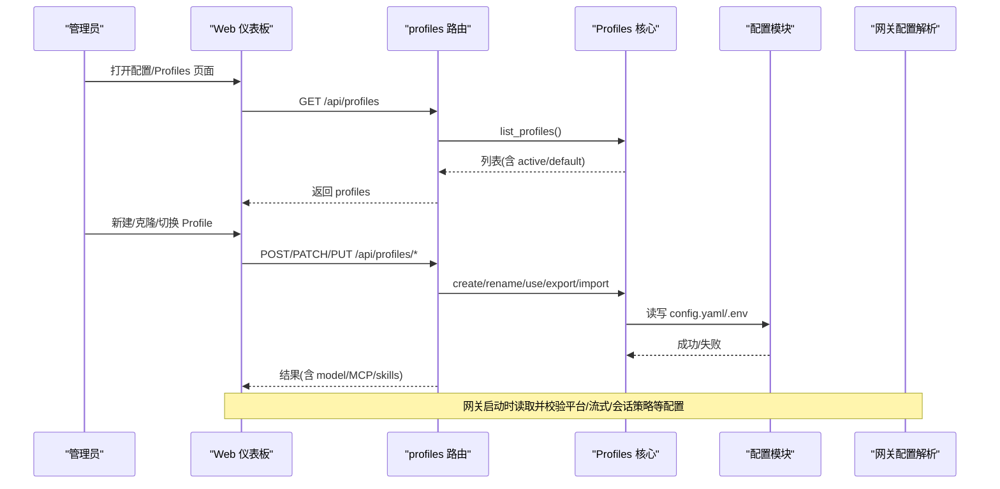
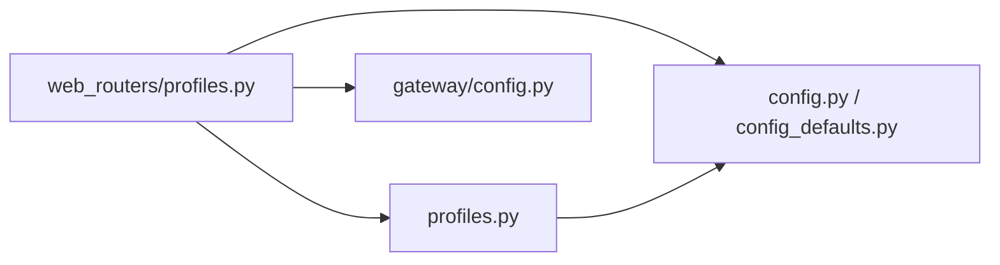

# 系统配置

<cite>
**本文引用的文件**
- [sparkii_cli/config.py](file://sparkii_cli/config.py)
- [sparkii_cli/config_defaults.py](file://sparkii_cli/config_defaults.py)
- [gateway/config.py](file://gateway/config.py)
- [sparkii_cli/profiles.py](file://sparkii_cli/profiles.py)
- [sparkii_cli/web_routers/profiles.py](file://sparkii_cli/web_routers/profiles.py)
</cite>

## 目录
1. [简介](#简介)
2. [项目结构](#项目结构)
3. [核心组件](#核心组件)
4. [架构总览](#架构总览)
5. [详细组件分析](#详细组件分析)
6. [依赖关系分析](#依赖关系分析)
7. [性能考虑](#性能考虑)
8. [故障排查指南](#故障排查指南)
9. [结论](#结论)
10. [附录](#附录)

## 简介
本文件面向管理员，系统化说明如何通过 Web 仪表板与 CLI 进行系统级配置管理，覆盖基础设置、性能参数调优、资源限制、配置验证与错误处理、多配置方案（Profiles）的创建/切换/比较/迁移，以及备份与恢复操作。目标是帮助管理员安全、高效地维护系统运行状态与行为。

## 项目结构
围绕“系统配置”的关键代码分布在以下模块：
- 配置加载、默认值、环境变量注入与安全写入：sparkii_cli/config.py、sparkii_cli/config_defaults.py
- 网关侧平台/流式/会话策略等运行时配置解析与校验：gateway/config.py
- 多配置方案（Profiles）生命周期与文件系统布局：sparkii_cli/profiles.py
- Web 仪表板路由（创建/切换/导出导入/模型设置等）：sparkii_cli/web_routers/profiles.py

图表来源
- [sparkii_cli/web_routers/profiles.py:373-800](file://sparkii_cli/web_routers/profiles.py#L373-L800)
- [sparkii_cli/profiles.py:267-800](file://sparkii_cli/profiles.py#L267-L800)
- [sparkii_cli/config.py:694-700](file://sparkii_cli/config.py#L694-L700)
- [gateway/config.py:420-708](file://gateway/config.py#L420-L708)

章节来源
- [sparkii_cli/web_routers/profiles.py:373-800](file://sparkii_cli/web_routers/profiles.py#L373-L800)
- [sparkii_cli/profiles.py:267-800](file://sparkii_cli/profiles.py#L267-L800)
- [sparkii_cli/config.py:694-700](file://sparkii_cli/config.py#L694-L700)
- [gateway/config.py:420-708](file://gateway/config.py#L420-L708)

## 核心组件
- 配置中心与默认值
  - 默认配置集中定义，包含模型、工具集、数据库、并发会话上限、Agent 缓存、终端容器资源、压缩策略、MCP 发现超时等关键开关与阈值。
  - 配置文件路径与 .env 路径统一由配置模块提供，便于跨进程一致读取。
- 网关配置解析器
  - 负责平台连接、主频道、会话重置策略、流式输出等运行时配置的规范化与校验。
- Profiles 管理
  - 每个 Profile 是独立的 SPARKII_HOME 子目录，拥有独立的 config.yaml、.env、会话、技能、日志等。
  - 支持克隆、别名脚本、导出/导入、描述与角色设定、模型与 MCP 服务器设置。
- Web 仪表板路由
  - 暴露 /api/profiles/* 系列接口，用于创建、切换、导出/导入、设置模型、自动描述生成等。

章节来源
- [sparkii_cli/config_defaults.py:7-800](file://sparkii_cli/config_defaults.py#L7-L800)
- [sparkii_cli/config.py:694-700](file://sparkii_cli/config.py#L694-L700)
- [gateway/config.py:420-708](file://gateway/config.py#L420-L708)
- [sparkii_cli/profiles.py:267-800](file://sparkii_cli/profiles.py#L267-L800)
- [sparkii_cli/web_routers/profiles.py:373-800](file://sparkii_cli/web_routers/profiles.py#L373-L800)

## 架构总览
下图展示从 Web 仪表板到配置与 Profiles 的调用链，以及运行时生效点。

图表来源
- [sparkii_cli/web_routers/profiles.py:373-800](file://sparkii_cli/web_routers/profiles.py#L373-L800)
- [sparkii_cli/profiles.py:267-800](file://sparkii_cli/profiles.py#L267-L800)
- [sparkii_cli/config.py:694-700](file://sparkii_cli/config.py#L694-L700)
- [gateway/config.py:420-708](file://gateway/config.py#L420-L708)

## 详细组件分析

### 配置加载、默认值与环境变量
- 默认配置项（节选）
  - 模型与提供商：model, providers, fallback_providers
  - 会话与缓存：max_concurrent_sessions, max_live_sessions, agent.agent_cache.*
  - 终端与容器资源：terminal.container_cpu/memory/disk/persistent/volumes/shm/network/run_as_host_user
  - 压缩策略：compression.threshold/target_ratio/protect_last_n/micro_compact/proactive_prune_*
  - MCP：mcp_discovery_timeout, mcp.auto_reload_on_config_change
  - 工具输出限制：tool_output.max_bytes/max_lines/max_line_length
- 配置文件位置
  - 主配置：~/.sparkii/config.yaml
  - 密钥与环境：~/.sparkii/.env
- 环境变量注入与安全写入
  - 通过配置模块在加载时展开 ${VAR} 引用；对 .env 写入有严格的黑名单（如 LD_PRELOAD、PATH、PYTHONPATH、SPARKII_HOME 等），防止通过仪表板执行任意命令或劫持运行时。
- 并发与缓存
  - 使用线程锁保护 YAML 读写；按文件 mtime/size 缓存已展开的配置，避免重复解析。

章节来源
- [sparkii_cli/config_defaults.py:7-800](file://sparkii_cli/config_defaults.py#L7-L800)
- [sparkii_cli/config.py:45-156](file://sparkii_cli/config.py#L45-L156)
- [sparkii_cli/config.py:158-234](file://sparkii_cli/config.py#L158-L234)
- [sparkii_cli/config.py:235-260](file://sparkii_cli/config.py#L235-L260)
- [sparkii_cli/config.py:694-700](file://sparkii_cli/config.py#L694-L700)

### 网关配置解析与校验
- 平台与主频道
  - HomeChannel 数据类封装平台、聊天 ID、名称、线程 ID 等，并提供序列化/反序列化。
  - PlatformConfig 控制平台启用、令牌、回复线程模式、重启通知、输入指示器等。
- 会话重置策略
  - SessionResetPolicy 支持 daily/idle/both/none，并支持后台进程最大年龄豁免。
- 流式输出
  - StreamingConfig 支持 transport/auto/edit/off、编辑间隔、缓冲区阈值、最终消息替换策略等。
- 端口绑定与条件模式
  - PORT_BINDING_PLATFORM_VALUES 与 CONDITIONAL_MODES 确保多 Profile 复用监听时的冲突检测。

章节来源
- [gateway/config.py:420-708](file://gateway/config.py#L420-L708)
- [gateway/config.py:376-418](file://gateway/config.py#L376-L418)

### Profiles 管理与文件系统布局
- 目录结构
  - 每个 Profile 位于 SPARKII_HOME/profiles/<name>/，包含 memories、sessions、skills、skins、logs、plans、workspace、cron、home 等。
- 克隆与排除
  - --clone 复制 config.yaml、.env、SOUL.md 及 memories 中的关键文件；--clone-all 全量复制但排除历史/运行时/基础设施目录。
- 别名与包装脚本
  - 可在 ~/.local/bin 下创建 wrapper 脚本，快速以指定 Profile 运行 sparkii。
- 活跃 Profile
  - active_profile 文件记录粘性默认 Profile；API 可查询与设置。

章节来源
- [sparkii_cli/profiles.py:39-127](file://sparkii_cli/profiles.py#L39-L127)
- [sparkii_cli/profiles.py:267-384](file://sparkii_cli/profiles.py#L267-L384)
- [sparkii_cli/profiles.py:438-508](file://sparkii_cli/profiles.py#L438-L508)
- [sparkii_cli/profiles.py:625-734](file://sparkii_cli/profiles.py#L625-L734)

### Web 仪表板路由（Profiles）
- 常用接口
  - GET /api/profiles：列出所有 Profile
  - POST /api/profiles：创建/克隆 Profile（支持 clone_from、clone_all、no_skills、description、keep_skills、hub_skills）
  - GET/POST /api/profiles/active：获取/设置粘性默认 Profile
  - PATCH /api/profiles/{name}：重命名
  - DELETE /api/profiles/{name}：删除
  - PUT /api/profiles/{name}/model：设置模型与提供商
  - PUT /api/profiles/{name}/soul：更新人格文档
  - POST /api/profiles/{name}/describe-auto：自动生成角色描述
  - POST /api/profiles/{name}/export：导出为归档
  - POST /api/profiles/import：导入归档
- 会话聚合
  - /api/profiles/sessions 与 /api/profiles/sessions/sidebar 提供跨 Profile 的会话列表与侧边栏切片，读优化且带分页与过滤。

章节来源
- [sparkii_cli/web_routers/profiles.py:79-370](file://sparkii_cli/web_routers/profiles.py#L79-L370)
- [sparkii_cli/web_routers/profiles.py:373-800](file://sparkii_cli/web_routers/profiles.py#L373-L800)

### 配置验证机制与错误处理
- YAML 解析失败
  - 捕获异常后回退到默认配置，并尝试将损坏的 config.yaml 备份为时间戳后缀的 .bak；同时向日志与标准错误输出告警。
- 环境变量写入白名单/黑名单
  - 拒绝写入可能影响进程执行或运行时定位的环境变量（如 LD_*、PYTHON*、PATH、SPARKII_* 等），防止通过仪表板造成安全风险。
- 网关配置规范化
  - 对布尔、整型、浮点、枚举等字段进行严格转换与范围检查，非法值记录警告并回退到安全默认。

章节来源
- [sparkii_cli/config.py:45-156](file://sparkii_cli/config.py#L45-L156)
- [sparkii_cli/config.py:158-234](file://sparkii_cli/config.py#L158-L234)
- [gateway/config.py:26-191](file://gateway/config.py#L26-L191)

### 多配置方案（Profiles）最佳实践
- 场景划分
  - 开发/测试/生产隔离：不同 Profile 独立配置、凭据与会话。
  - 团队角色隔离：不同模型、工具集、技能组合。
- 创建与克隆
  - 新 Profile 建议基于 default 克隆，保留必要配置与技能；必要时使用 clone_all 完整复制工作区。
- 切换与别名
  - 使用 profile use 设置粘性默认；为常用 Profile 创建别名脚本以便快速切换。
- 模型与 MCP
  - 通过仪表板为 Profile 设置主模型与提供商；按需配置 MCP 服务器。
- 描述与路由
  - 为 Profile 编写清晰的角色描述，辅助看板任务路由。

章节来源
- [sparkii_cli/profiles.py:39-127](file://sparkii_cli/profiles.py#L39-L127)
- [sparkii_cli/web_routers/profiles.py:373-800](file://sparkii_cli/web_routers/profiles.py#L373-L800)

### 配置备份与恢复
- 损坏配置自动备份
  - 当 config.yaml 无法解析时，系统会尝试将其备份为时间戳后缀的 .bak 文件，便于后续对比修复。
- Profile 导出/导入
  - 通过仪表板导出 Profile 为归档文件；导入时可选择目标名称，实现跨环境迁移。
- 注意事项
  - 导出默认排除敏感与运行时文件（如 state.db、.env、日志等），保证归档便携性。
  - 导入前请确认目标环境兼容性与权限。

章节来源
- [sparkii_cli/config.py:45-156](file://sparkii_cli/config.py#L45-L156)
- [sparkii_cli/profiles.py:199-247](file://sparkii_cli/profiles.py#L199-L247)
- [sparkii_cli/web_routers/profiles.py:749-800](file://sparkii_cli/web_routers/profiles.py#L749-L800)

## 依赖关系分析
- 模块耦合
  - Web 路由依赖 profiles 核心逻辑与配置模块；profiles 核心逻辑依赖配置模块进行 config.yaml/.env 读写。
  - 网关配置解析与平台插件相互协作，确保运行时行为正确。
- 外部依赖
  - SQLite（会话存储）、YAML（配置）、操作系统 API（文件/进程）。
- 潜在循环依赖
  - 通过延迟导入（late binding）避免循环引用，例如路由中延迟加载 web_server 助手。

图表来源
- [sparkii_cli/web_routers/profiles.py:23-77](file://sparkii_cli/web_routers/profiles.py#L23-L77)
- [sparkii_cli/profiles.py:267-800](file://sparkii_cli/profiles.py#L267-L800)
- [sparkii_cli/config.py:694-700](file://sparkii_cli/config.py#L694-L700)
- [gateway/config.py:420-708](file://gateway/config.py#L420-L708)

章节来源
- [sparkii_cli/web_routers/profiles.py:23-77](file://sparkii_cli/web_routers/profiles.py#L23-L77)
- [sparkii_cli/profiles.py:267-800](file://sparkii_cli/profiles.py#L267-L800)
- [sparkii_cli/config.py:694-700](file://sparkii_cli/config.py#L694-L700)
- [gateway/config.py:420-708](file://gateway/config.py#L420-L708)

## 性能考虑
- 配置加载缓存
  - 基于文件 mtime/size 的内存缓存减少重复解析开销；原子写入产生新 inode，自动失效缓存。
- 会话与压缩
  - 合理设置 compression.threshold/target_ratio/protect_last_n，平衡上下文长度与成本；micro_compact 可分摊压缩成本。
- 并发与会话上限
  - max_concurrent_sessions 与 max_live_sessions 控制全局并发与内存占用；agent_cache 调整 LRU 大小与内存预算。
- 终端容器资源
  - terminal.container_cpu/memory/disk 限制沙箱资源，避免单会话耗尽主机资源。
- 流式输出
  - streaming.edit_interval/buffer_threshold 影响用户体验与后端压力，需根据平台特性调优。

章节来源
- [sparkii_cli/config.py:235-260](file://sparkii_cli/config.py#L235-L260)
- [sparkii_cli/config_defaults.py:23-800](file://sparkii_cli/config_defaults.py#L23-L800)
- [gateway/config.py:720-800](file://gateway/config.py#L720-L800)

## 故障排查指南
- 配置解析失败
  - 现象：服务启动或刷新配置时报错并回退默认配置。
  - 处理：查看最近的 .bak 备份文件，修正 YAML 语法后重启。
- 环境变量写入被拒
  - 现象：通过仪表板设置 .env 键时报错。
  - 处理：确认键名不在黑名单内；如需修改受限键，直接编辑 ~/.sparkii/.env。
- 平台端口冲突
  - 现象：多 Profile 同时启用端口绑定平台导致启动失败。
  - 处理：仅允许默认 Profile 绑定端口；其他 Profile 通过 URL 前缀访问。
- 会话卡顿或超时
  - 现象：长任务无响应或长时间无输出。
  - 处理：调整 gateway_timeout/gateway_notify_interval/session_stall_timeout；检查压缩与工具输出限制。

章节来源
- [sparkii_cli/config.py:45-156](file://sparkii_cli/config.py#L45-L156)
- [sparkii_cli/config.py:158-234](file://sparkii_cli/config.py#L158-L234)
- [gateway/config.py:376-418](file://gateway/config.py#L376-L418)
- [sparkii_cli/config_defaults.py:31-277](file://sparkii_cli/config_defaults.py#L31-L277)

## 结论
本系统提供了完善的配置管理能力：统一的默认配置、安全的配置加载与写入、灵活的 Profiles 隔离与迁移、健壮的验证与错误处理，以及面向性能的调优选项。管理员可通过 Web 仪表板与 CLI 协同完成日常运维，确保系统稳定、安全、高效运行。

## 附录
- 常用配置项速查（节选）
  - 模型与提供商：model, providers, fallback_providers
  - 会话与缓存：max_concurrent_sessions, max_live_sessions, agent.agent_cache.*
  - 终端与容器：terminal.container_cpu/memory/disk/persistent/docker_volumes/docker_shm_size
  - 压缩：compression.threshold/target_ratio/protect_last_n/micro_compact/proactive_prune_*
  - MCP：mcp_discovery_timeout, mcp.auto_reload_on_config_change
  - 工具输出：tool_output.max_bytes/max_lines/max_line_length
  - 流式：streaming.enabled/transport/edit_interval/buffer_threshold/fresh_final_after_seconds
  - 会话重置：session_reset.mode/at_hour/idle_minutes/notify/bg_process_max_age_hours

章节来源
- [sparkii_cli/config_defaults.py:7-800](file://sparkii_cli/config_defaults.py#L7-L800)
- [gateway/config.py:420-800](file://gateway/config.py#L420-L800)