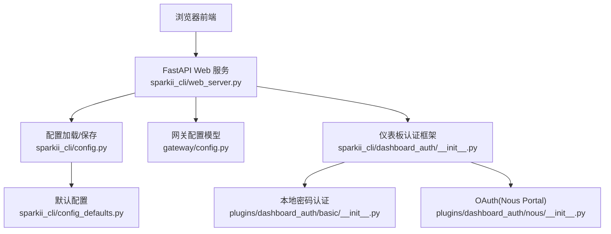
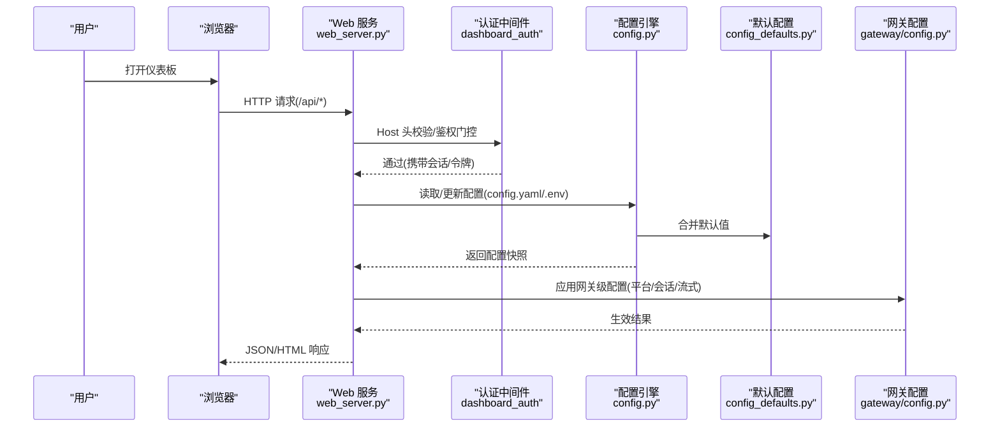
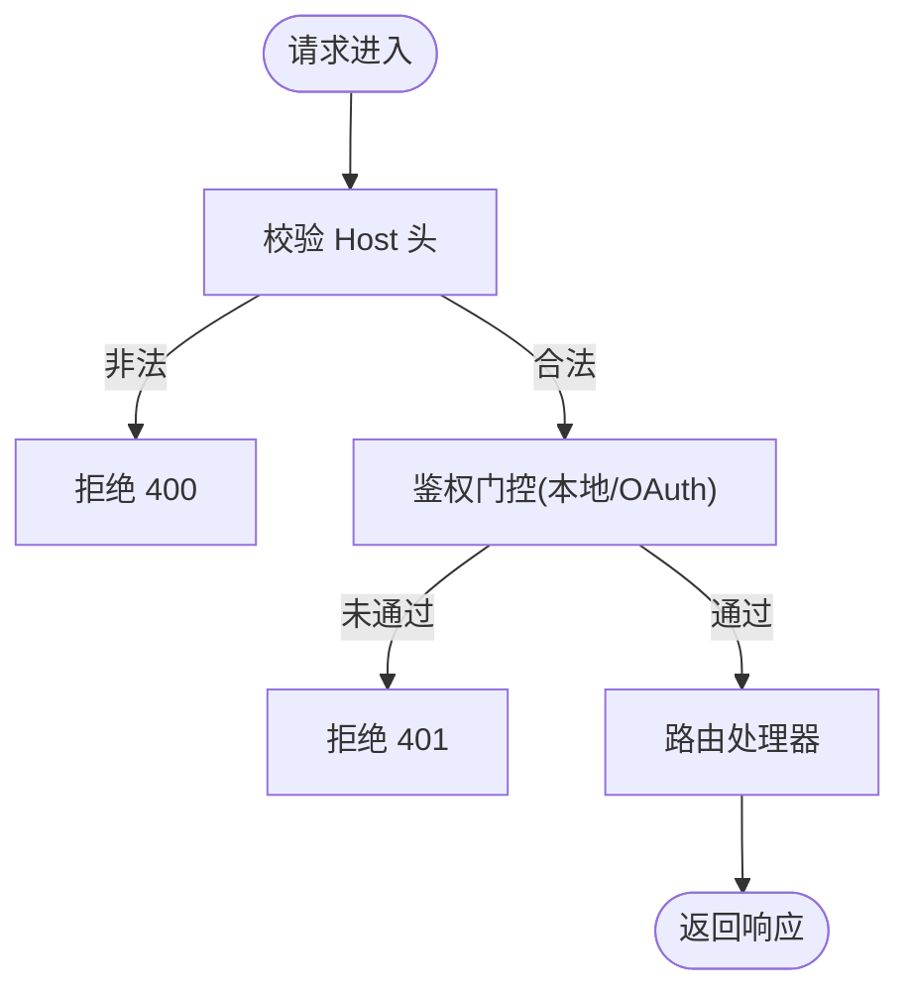
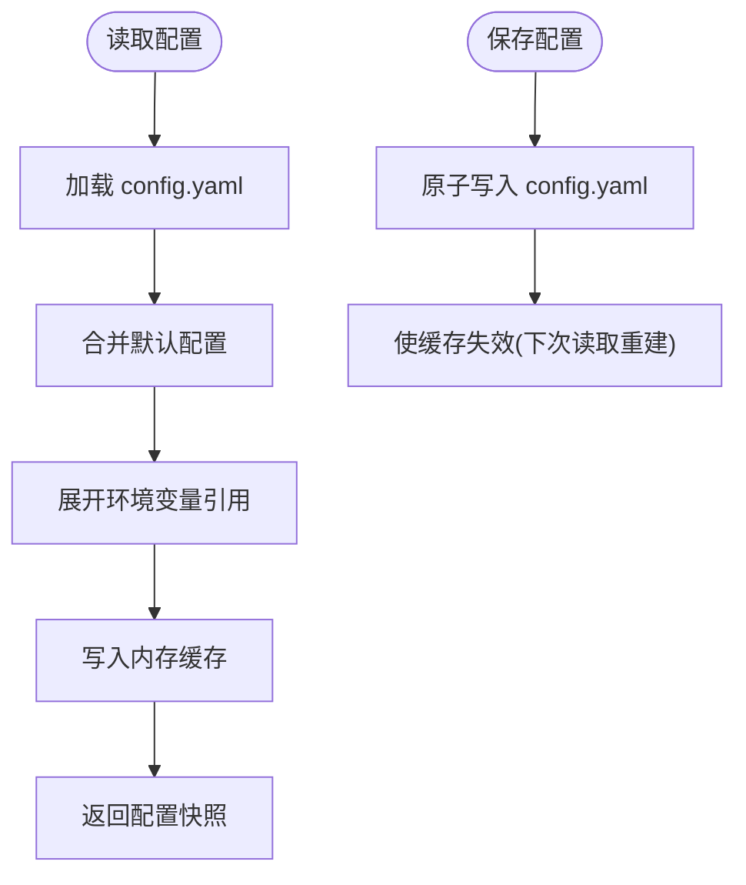
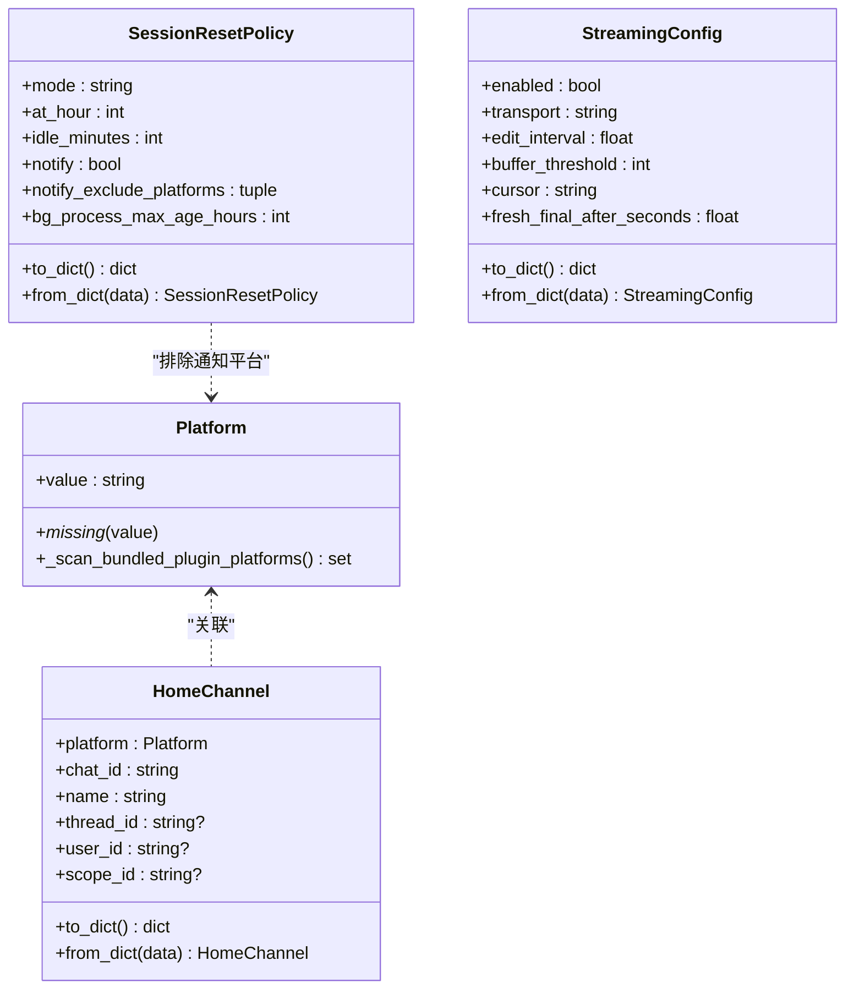
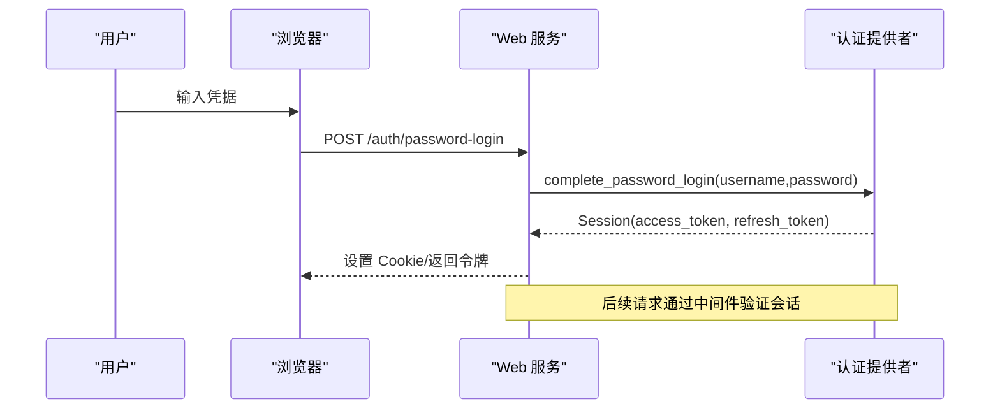
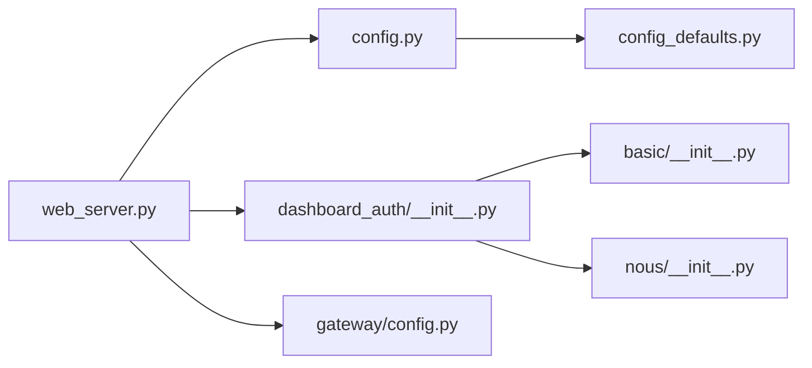

# 配置管理

<cite>
**本文引用的文件**
- [sparkii_cli/config.py](file://sparkii_cli/config.py)
- [sparkii_cli/config_defaults.py](file://sparkii_cli/config_defaults.py)
- [gateway/config.py](file://gateway/config.py)
- [sparkii_cli/web_server.py](file://sparkii_cli/web_server.py)
- [sparkii_cli/dashboard_auth/__init__.py](file://sparkii_cli/dashboard_auth/__init__.py)
- [plugins/dashboard_auth/basic/__init__.py](file://plugins/dashboard_auth/basic/__init__.py)
- [plugins/dashboard_auth/nous/__init__.py](file://plugins/dashboard_auth/nous/__init__.py)
</cite>

## 目录
1. [简介](#简介)
2. [项目结构](#项目结构)
3. [核心组件](#核心组件)
4. [架构总览](#架构总览)
5. [详细组件分析](#详细组件分析)
6. [依赖关系分析](#依赖关系分析)
7. [性能考虑](#性能考虑)
8. [故障排查指南](#故障排查指南)
9. [结论](#结论)
10. [附录](#附录)

## 简介
本指南面向管理员，提供通过 Web 仪表板进行系统配置的完整使用手册。内容涵盖：
- 基础设置、高级参数调优与安全配置
- 配置文件查看、编辑、备份与恢复
- 不同配置项的作用与影响（性能、安全、集成）
- 多配置方案的管理（切换、比较、迁移）
- 插件与扩展的配置（第三方服务 API 密钥、连接参数）
- 配置验证与错误检查
- 最佳实践与常见问题解决方案

目标是让管理员能够高效、安全地管理和维护系统配置。

## 项目结构
Web 仪表板的配置管理由以下关键模块协作完成：
- Web 服务层：FastAPI 后端提供 REST/WS 接口，承载前端页面与 API
- 配置加载与持久化：统一读取 config.yaml/.env，合并默认值与环境变量，原子写入
- 网关配置：平台接入、会话策略、流式输出等运行时配置
- 仪表板认证：支持本地密码登录或 OAuth（Nous Portal），非回环绑定强制鉴权
- 插件体系：可扩展的认证提供者与平台适配器

图表来源
- [sparkii_cli/web_server.py:1-120](file://sparkii_cli/web_server.py#L1-L120)
- [sparkii_cli/config.py:1-120](file://sparkii_cli/config.py#L1-L120)
- [gateway/config.py:1-120](file://gateway/config.py#L1-L120)
- [sparkii_cli/dashboard_auth/__init__.py:1-49](file://sparkii_cli/dashboard_auth/__init__.py#L1-L49)
- [plugins/dashboard_auth/basic/__init__.py:1-60](file://plugins/dashboard_auth/basic/__init__.py#L1-L60)
- [plugins/dashboard_auth/nous/__init__.py:1-70](file://plugins/dashboard_auth/nous/__init__.py#L1-L70)
- [sparkii_cli/config_defaults.py:1-40](file://sparkii_cli/config_defaults.py#L1-L40)

章节来源
- [sparkii_cli/web_server.py:1-120](file://sparkii_cli/web_server.py#L1-L120)
- [sparkii_cli/config.py:1-120](file://sparkii_cli/config.py#L1-L120)
- [gateway/config.py:1-120](file://gateway/config.py#L1-L120)
- [sparkii_cli/dashboard_auth/__init__.py:1-49](file://sparkii_cli/dashboard_auth/__init__.py#L1-L49)
- [plugins/dashboard_auth/basic/__init__.py:1-60](file://plugins/dashboard_auth/basic/__init__.py#L1-L60)
- [plugins/dashboard_auth/nous/__init__.py:1-70](file://plugins/dashboard_auth/nous/__init__.py#L1-L70)
- [sparkii_cli/config_defaults.py:1-40](file://sparkii_cli/config_defaults.py#L1-L40)

## 核心组件
- Web 服务与路由
  - 提供静态资源与 REST/WS 接口，集中处理配置读写、会话、插件管理等
  - 内置中间件：Host 头校验、CORS、鉴权门控、健康自检
- 配置引擎
  - 统一加载 config.yaml/.env，合并默认值，支持缓存与并发安全
  - 原子写入，损坏时自动备份并提示修复
- 网关配置
  - 平台接入（消息通道）、会话重置策略、流式输出、端口绑定规则等
- 仪表板认证
  - 本地密码认证（无外部依赖）与 OAuth（Nous Portal）两种模式
  - 非回环绑定强制鉴权，防止未授权访问
- 插件与扩展
  - 可插拔认证提供者；平台适配器动态发现与注册

章节来源
- [sparkii_cli/web_server.py:313-672](file://sparkii_cli/web_server.py#L313-L672)
- [sparkii_cli/config.py:45-156](file://sparkii_cli/config.py#L45-L156)
- [gateway/config.py:272-418](file://gateway/config.py#L272-L418)
- [sparkii_cli/dashboard_auth/__init__.py:1-49](file://sparkii_cli/dashboard_auth/__init__.py#L1-L49)
- [plugins/dashboard_auth/basic/__init__.py:201-327](file://plugins/dashboard_auth/basic/__init__.py#L201-L327)
- [plugins/dashboard_auth/nous/__init__.py:153-380](file://plugins/dashboard_auth/nous/__init__.py#L153-L380)

## 架构总览
下图展示从浏览器到配置存储的端到端流程，包括鉴权、配置读写与网关配置生效路径。

图表来源
- [sparkii_cli/web_server.py:373-672](file://sparkii_cli/web_server.py#L373-L672)
- [sparkii_cli/config.py:235-260](file://sparkii_cli/config.py#L235-L260)
- [sparkii_cli/config_defaults.py:7-40](file://sparkii_cli/config_defaults.py#L7-L40)
- [gateway/config.py:420-708](file://gateway/config.py#L420-L708)

## 详细组件分析

### Web 服务与鉴权
- 安全边界
  - 仅允许 localhost/127.0.0.1/::1 的 Host 头，防止 DNS 重绑定攻击
  - CORS 限制为本地源，避免跨站读取配置
  - 非回环绑定强制启用鉴权门控（OAuth 或本地密码）
- 会话与令牌
  - 本地模式注入临时会话令牌，受保护端点需携带专用头
  - 网关模式使用 Cookie+Provider 会话，支持刷新与注销
- 健康自检
  - 周期性对受保护端点发起内部请求，记录错误计数与状态

图表来源
- [sparkii_cli/web_server.py:467-566](file://sparkii_cli/web_server.py#L467-L566)
- [sparkii_cli/web_server.py:644-672](file://sparkii_cli/web_server.py#L644-L672)
- [sparkii_cli/web_server.py:771-800](file://sparkii_cli/web_server.py#L771-L800)

章节来源
- [sparkii_cli/web_server.py:373-672](file://sparkii_cli/web_server.py#L373-L672)
- [sparkii_cli/web_server.py:771-800](file://sparkii_cli/web_server.py#L771-L800)

### 配置加载与持久化
- 文件位置
  - 主配置：~/.sparkii/config.yaml
  - 密钥与环境变量：~/.sparkii/.env
- 加载流程
  - 读取用户配置与默认配置，深度合并
  - 解析环境变量引用，支持进程内缓存与失效机制
  - 并发安全：线程锁保护 YAML 读写与缓存
- 损坏保护
  - 解析失败时自动备份损坏文件，保留用户覆盖内容
  - 输出明确警告，建议修复后重启
- 写入安全
  - 原子替换写入，避免部分写入导致不一致
  - 禁止通过仪表板写入危险的环境变量名（如 LD_PRELOAD、PATH 等）

图表来源
- [sparkii_cli/config.py:235-260](file://sparkii_cli/config.py#L235-L260)
- [sparkii_cli/config.py:45-156](file://sparkii_cli/config.py#L45-L156)
- [sparkii_cli/config.py:198-233](file://sparkii_cli/config.py#L198-L233)

章节来源
- [sparkii_cli/config.py:45-156](file://sparkii_cli/config.py#L45-L156)
- [sparkii_cli/config.py:198-233](file://sparkii_cli/config.py#L198-L233)
- [sparkii_cli/config.py:235-260](file://sparkii_cli/config.py#L235-L260)

### 网关配置与平台接入
- 平台枚举与动态发现
  - 内置平台与插件平台均支持，未知名称在已注册插件下动态创建成员
- 端口绑定规则
  - 某些平台会绑定监听端口（如 webhook、api_server），在多 Profile 模式下需避免冲突
- 会话重置策略
  - 支持按日、空闲时长、两者结合或禁用自动重置
- 流式输出
  - 传输模式选择（auto/draft/edit/off），编辑间隔与缓冲阈值可调

图表来源
- [gateway/config.py:272-418](file://gateway/config.py#L272-L418)
- [gateway/config.py:420-541](file://gateway/config.py#L420-L541)
- [gateway/config.py:720-800](file://gateway/config.py#L720-L800)

章节来源
- [gateway/config.py:272-418](file://gateway/config.py#L272-L418)
- [gateway/config.py:420-541](file://gateway/config.py#L420-L541)
- [gateway/config.py:720-800](file://gateway/config.py#L720-L800)

### 仪表板认证（本地密码与 OAuth）
- 本地密码认证
  - 无需外部 IDP，基于 scrypt 哈希与 HMAC 签名令牌
  - 支持配置用户名、密码或预计算哈希、签名密钥与会话 TTL
  - 常量时间比较，防时序侧信道
- OAuth（Nous Portal）
  - 授权码+PKCE，RS256 JWT 校验，JWKS 缓存
  - 支持刷新令牌轮换，过期或重用检测触发重新登录
  - 客户端 ID 格式校验与实例 ID 交叉验证

图表来源
- [plugins/dashboard_auth/basic/__init__.py:201-327](file://plugins/dashboard_auth/basic/__init__.py#L201-L327)
- [plugins/dashboard_auth/nous/__init__.py:179-380](file://plugins/dashboard_auth/nous/__init__.py#L179-L380)
- [sparkii_cli/dashboard_auth/__init__.py:1-49](file://sparkii_cli/dashboard_auth/__init__.py#L1-L49)

章节来源
- [plugins/dashboard_auth/basic/__init__.py:201-327](file://plugins/dashboard_auth/basic/__init__.py#L201-L327)
- [plugins/dashboard_auth/nous/__init__.py:179-380](file://plugins/dashboard_auth/nous/__init__.py#L179-L380)
- [sparkii_cli/dashboard_auth/__init__.py:1-49](file://sparkii_cli/dashboard_auth/__init__.py#L1-L49)

### 默认配置与高级参数
- 数据库与缓存
  - SQLite journal_mode 默认 WAL，可调整 autocheckpoint/journal_size_limit
  - Agent 缓存大小、空闲 TTL、内存高水位与驱逐策略
- 终端与容器
  - 后端类型、超时、字体、环境透传、容器镜像与资源限制
  - Docker 卷挂载、网络隔离、共享内存大小、以宿主用户运行等
- 压缩与上下文
  - 压缩阈值、目标比例、保护最近消息数、主动修剪策略
  - 微压缩、卫生压缩、摘要失败处理、Codex 特定行为
- 工具与输出
  - 工具输出截断、循环守卫、Web 搜索/提取后端、浏览器引擎

章节来源
- [sparkii_cli/config_defaults.py:7-40](file://sparkii_cli/config_defaults.py#L7-L40)
- [sparkii_cli/config_defaults.py:279-396](file://sparkii_cli/config_defaults.py#L279-L396)
- [sparkii_cli/config_defaults.py:595-798](file://sparkii_cli/config_defaults.py#L595-L798)

## 依赖关系分析
- Web 服务依赖配置引擎与认证框架
- 配置引擎依赖默认配置与环境变量
- 网关配置依赖平台枚举与动态插件发现
- 认证框架依赖具体提供者（本地/OAuth）

图表来源
- [sparkii_cli/web_server.py:60-100](file://sparkii_cli/web_server.py#L60-L100)
- [sparkii_cli/config.py:1-40](file://sparkii_cli/config.py#L1-L40)
- [sparkii_cli/dashboard_auth/__init__.py:1-49](file://sparkii_cli/dashboard_auth/__init__.py#L1-L49)
- [plugins/dashboard_auth/basic/__init__.py:1-60](file://plugins/dashboard_auth/basic/__init__.py#L1-L60)
- [plugins/dashboard_auth/nous/__init__.py:1-70](file://plugins/dashboard_auth/nous/__init__.py#L1-L70)
- [gateway/config.py:1-40](file://gateway/config.py#L1-L40)

章节来源
- [sparkii_cli/web_server.py:60-100](file://sparkii_cli/web_server.py#L60-L100)
- [sparkii_cli/config.py:1-40](file://sparkii_cli/config.py#L1-L40)
- [sparkii_cli/dashboard_auth/__init__.py:1-49](file://sparkii_cli/dashboard_auth/__init__.py#L1-L49)
- [plugins/dashboard_auth/basic/__init__.py:1-60](file://plugins/dashboard_auth/basic/__init__.py#L1-L60)
- [plugins/dashboard_auth/nous/__init__.py:1-70](file://plugins/dashboard_auth/nous/__init__.py#L1-L70)
- [gateway/config.py:1-40](file://gateway/config.py#L1-L40)

## 性能考虑
- 配置加载缓存
  - 基于文件 mtime/size 的缓存，减少重复解析与合并开销
  - 写操作产生新 inode，自动失效缓存，保证一致性
- 并发安全
  - 使用 RLock 串行化配置读写，避免 libyaml 并发问题
- 流式输出调优
  - 编辑间隔与缓冲阈值影响用户体验与速率限制
- 压缩策略
  - 阈值与目标比例平衡上下文长度与成本
  - 主动修剪与微压缩降低长会话的累积开销

章节来源
- [sparkii_cli/config.py:235-260](file://sparkii_cli/config.py#L235-L260)
- [gateway/config.py:710-800](file://gateway/config.py#L710-L800)
- [sparkii_cli/config_defaults.py:595-798](file://sparkii_cli/config_defaults.py#L595-L798)

## 故障排查指南
- 配置解析失败
  - 现象：仪表板无法加载配置，回退到默认值
  - 处理：检查 config.yaml 语法，查看自动生成的 .bak 备份，修复后重启
- 环境变量写入被拒
  - 现象：尝试写入 PATH、LD_PRELOAD 等危险变量失败
  - 处理：通过直接编辑 ~/.sparkii/.env 或使用支持的配置键
- 认证失败
  - 本地密码：确认用户名/密码哈希与 secret 配置正确
  - OAuth：检查 client_id 格式、Portal URL、JWKS 可达性
- 端口冲突
  - 现象：多 Profile 下平台监听端口冲突
  - 处理：确保仅默认 Profile 启用端口绑定平台

章节来源
- [sparkii_cli/config.py:45-156](file://sparkii_cli/config.py#L45-L156)
- [sparkii_cli/config.py:198-233](file://sparkii_cli/config.py#L198-L233)
- [plugins/dashboard_auth/basic/__init__.py:335-492](file://plugins/dashboard_auth/basic/__init__.py#L335-L492)
- [plugins/dashboard_auth/nous/__init__.py:545-672](file://plugins/dashboard_auth/nous/__init__.py#L545-L672)
- [gateway/config.py:376-418](file://gateway/config.py#L376-L418)

## 结论
通过 Web 仪表板，管理员可以安全、便捷地完成系统配置管理。借助统一的配置引擎、严格的鉴权机制与灵活的插件体系，系统既满足日常运维需求，又具备扩展性与可维护性。建议遵循最小权限原则、定期备份配置、合理调优性能参数，并在生产环境中启用强认证与网络隔离。

## 附录
- 常用配置键参考
  - 数据库：journal_mode、wal_autocheckpoint、journal_size_limit
  - 终端：backend、timeout、docker_image、container_cpu/memory/disk
  - 压缩：threshold、target_ratio、protect_last_n、proactive_prune_tokens
  - 流式：transport、edit_interval、buffer_threshold
- 最佳实践
  - 使用环境变量管理敏感信息，避免明文存储在配置文件中
  - 启用压缩与主动修剪，控制长会话上下文增长
  - 在生产环境启用 OAuth 或本地密码认证，并限制绑定地址
  - 定期备份 config.yaml 与 .env，建立变更审计流程