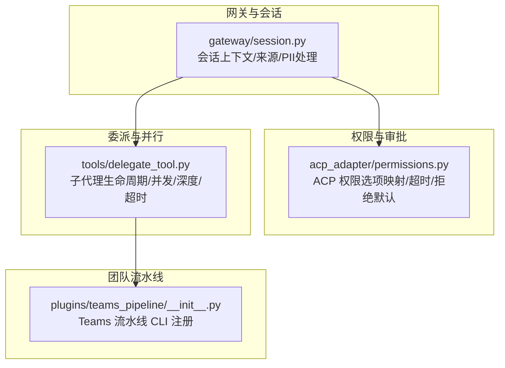
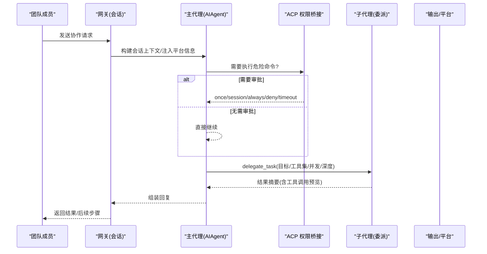
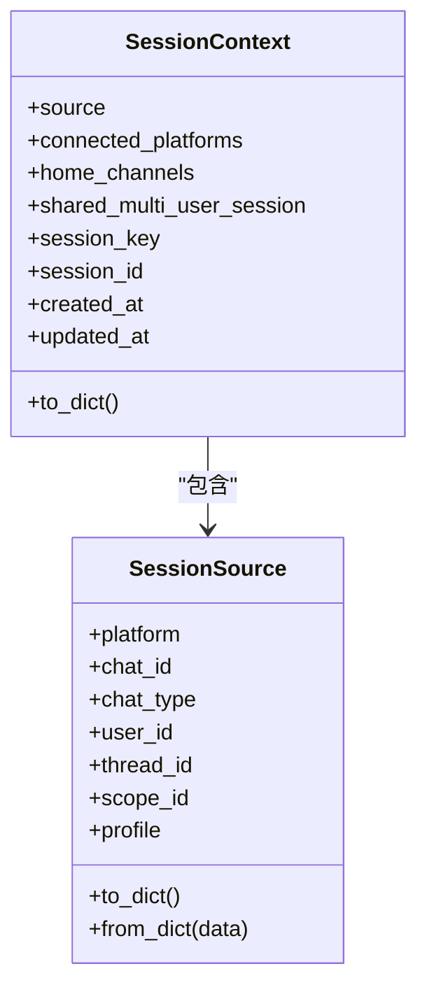
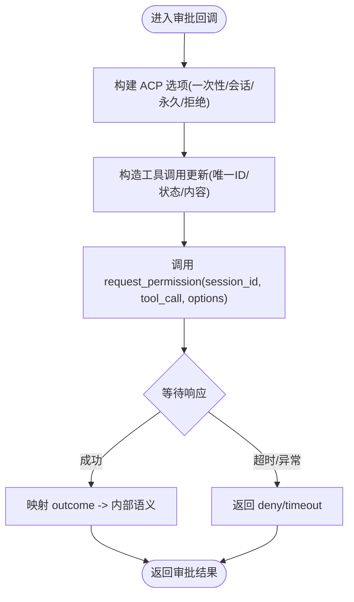
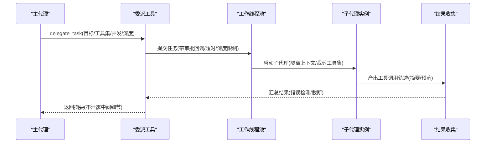
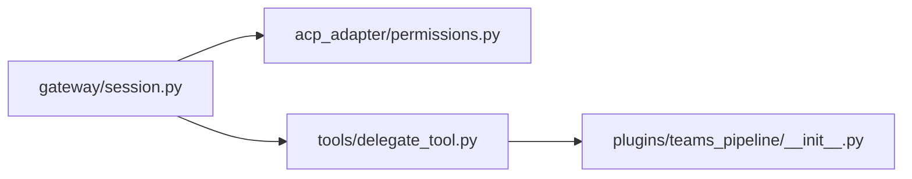

# 团队协作工作流

<cite>
**本文引用的文件**
- [README.md](file://README.md)
- [AGENTS.md](file://AGENTS.md)
- [gateway/session.py](file://gateway/session.py)
- [acp_adapter/permissions.py](file://acp_adapter/permissions.py)
- [tools/delegate_tool.py](file://tools/delegate_tool.py)
- [plugins/teams_pipeline/__init__.py](file://plugins/teams_pipeline/__init__.py)
</cite>

## 目录
1. [简介](#简介)
2. [项目结构](#项目结构)
3. [核心组件](#核心组件)
4. [架构总览](#架构总览)
5. [详细组件分析](#详细组件分析)
6. [依赖关系分析](#依赖关系分析)
7. [性能与容量规划](#性能与容量规划)
8. [故障排查指南](#故障排查指南)
9. [结论](#结论)
10. [附录：企业级配置示例与部署要点](#附录企业级配置示例与部署要点)

## 简介
本指南面向企业团队，围绕“共享会话与工作空间、权限与访问控制、协作规则、任务委派与协调、审计日志与合规、外部工具集成、监控与管理”等主题，提供可落地的配置与实践建议。内容基于代码库中的网关会话管理、ACP 权限桥接、子代理委派、以及 Teams 流水线插件等能力进行说明，帮助团队在 Hermes Agent 之上构建安全、可审计、可扩展的协作工作流。

## 项目结构
Hermes Agent 以“核心窄腰 + 边缘扩展”的方式组织：核心负责会话、消息路由、工具调度与安全边界；平台适配、技能、插件、MCP 服务位于边缘，按需启用。团队协作相关的关键位置包括：
- 网关会话与上下文：gateway/session.py
- 危险命令审批与 ACP 权限桥接：acp_adapter/permissions.py
- 子代理委派与并发控制：tools/delegate_tool.py
- 团队会议流水线（Teams）CLI 入口：plugins/teams_pipeline/__init__.py
- 全局文档与开发约定：AGENTS.md、README.md

图表来源
- [gateway/session.py:148-346](file://gateway/session.py#L148-L346)
- [acp_adapter/permissions.py:18-107](file://acp_adapter/permissions.py#L18-L107)
- [tools/delegate_tool.py:48-135](file://tools/delegate_tool.py#L48-L135)
- [plugins/teams_pipeline/__init__.py:12-23](file://plugins/teams_pipeline/__init__.py#L12-L23)

章节来源
- [AGENTS.md:263-309](file://AGENTS.md#L263-L309)
- [README.md:105-183](file://README.md#L105-L183)

## 核心组件
- 会话与上下文：维护消息来源、平台信息、多用户会话标记、PII 脱敏、动态系统提示注入，确保跨平台一致性与隐私保护。
- 权限与审批：通过 ACP 将危险命令审批选项映射为内部语义，支持一次性/会话/永久允许或拒绝，并具备超时与失败降级策略。
- 委派与协调：子代理隔离执行、继承工具集但屏蔽敏感工具、支持并发度与嵌套深度控制、可中断与引导（steer），并提供活跃子代理观测。
- 团队流水线：以插件形式暴露 Teams 会议流水线操作 CLI，便于编排与审计。

章节来源
- [gateway/session.py:148-346](file://gateway/session.py#L148-L346)
- [acp_adapter/permissions.py:18-107](file://acp_adapter/permissions.py#L18-L107)
- [tools/delegate_tool.py:48-135](file://tools/delegate_tool.py#L48-L135)
- [plugins/teams_pipeline/__init__.py:12-23](file://plugins/teams_pipeline/__init__.py#L12-L23)

## 架构总览
下图展示一次“团队任务委派 + 审批 + 会话上下文”的典型调用链：网关收到消息后构建会话上下文，必要时触发危险命令审批（ACP），随后可能委派子代理执行具体任务，并在完成后汇总结果。

图表来源
- [gateway/session.py:479-745](file://gateway/session.py#L479-L745)
- [acp_adapter/permissions.py:110-183](file://acp_adapter/permissions.py#L110-L183)
- [tools/delegate_tool.py:137-324](file://tools/delegate_tool.py#L137-L324)

## 详细组件分析

### 会话与上下文（gateway/session.py）
- 会话来源 SessionSource：记录平台、聊天类型、线程、作用域（workspace/guild）、是否机器人、是否通过上游中继投递等，用于路由、上下文注入与隔离。
- 会话上下文 SessionContext：聚合来源、已连接平台、主页频道、是否多用户共享会话、会话键/ID、时间戳等，用于动态系统提示注入。
- PII 脱敏与不可信文本净化：对平台名称、用户名、聊天名等进行哈希或单行化，避免注入攻击；对 Discord/Slack 等平台做差异化处理。
- 动态系统提示：根据平台特性注入可用能力说明、交付目标（origin/local/平台首页频道）等，保证模型行为与能力一致。

图表来源
- [gateway/session.py:148-346](file://gateway/session.py#L148-L346)

章节来源
- [gateway/session.py:148-346](file://gateway/session.py#L148-L346)
- [gateway/session.py:479-745](file://gateway/session.py#L479-L745)

### 权限与审批（acp_adapter/permissions.py）
- 选项映射：将 ACP 的 allow_once/allow_session/allow_always/deny/deny_always 映射为内部 once/session/always/deny。
- 工具调用更新：为每次审批生成唯一的 tool_call 标识，附带命令与描述，便于 UI 呈现与审计。
- 回调封装：创建审批回调，支持超时与异常降级（默认拒绝），并将结果回传给调用方。

图表来源
- [acp_adapter/permissions.py:18-107](file://acp_adapter/permissions.py#L18-L107)
- [acp_adapter/permissions.py:110-183](file://acp_adapter/permissions.py#L110-L183)

章节来源
- [acp_adapter/permissions.py:18-107](file://acp_adapter/permissions.py#L18-L107)
- [acp_adapter/permissions.py:110-183](file://acp_adapter/permissions.py#L110-L183)

### 委派与协调（tools/delegate_tool.py）
- 子代理隔离：每个子代理拥有独立会话、任务 ID、终端会话与文件缓存，父上下文仅看到委派调用与结果摘要。
- 工具集裁剪：子代理继承父工具集，但屏蔽敏感工具（如 delegate_task、memory、send_message、cronjob 等）。
- 并发与深度：支持 max_concurrent_children、max_spawn_depth、child_timeout_seconds 等配置，防止资源滥用。
- 运行期控制：支持暂停/恢复新委派、中断子代理、向运行中子代理注入引导（steer）、列出活跃子代理。
- 可观测性：提取最近工具调用结果作为预览，便于 TUI/网关层展示。

图表来源
- [tools/delegate_tool.py:48-135](file://tools/delegate_tool.py#L48-L135)
- [tools/delegate_tool.py:137-324](file://tools/delegate_tool.py#L137-L324)
- [tools/delegate_tool.py:326-501](file://tools/delegate_tool.py#L326-L501)

章节来源
- [tools/delegate_tool.py:48-135](file://tools/delegate_tool.py#L48-L135)
- [tools/delegate_tool.py:137-324](file://tools/delegate_tool.py#L137-L324)
- [tools/delegate_tool.py:326-501](file://tools/delegate_tool.py#L326-L501)

### 团队会议流水线（plugins/teams_pipeline/__init__.py）
- 以插件方式注册 CLI 命令 teams-pipeline，用于检查与操作 Microsoft Teams 会议流水线（作业列表、回放、Graph 订阅维护等）。
- 该插件不暴露模型工具，而是通过终端工具由代理调用，符合“最小核心表面”的设计原则。

章节来源
- [plugins/teams_pipeline/__init__.py:12-23](file://plugins/teams_pipeline/__init__.py#L12-L23)

## 依赖关系分析
- 会话上下文是网关侧的基础设施，为审批与委派提供上下文与隔离依据。
- 审批模块依赖 ACP SDK 的能力探测与选项构造，并与主流程解耦，便于替换或扩展。
- 委派模块依赖工具集注册与运行时配置，同时与 TUI/网关的观测与控制面交互（暂停/中断/引导）。
- Teams 流水线插件通过 CLI 注册接入，保持与核心解耦，便于独立演进。

图表来源
- [gateway/session.py:148-346](file://gateway/session.py#L148-L346)
- [acp_adapter/permissions.py:18-107](file://acp_adapter/permissions.py#L18-L107)
- [tools/delegate_tool.py:48-135](file://tools/delegate_tool.py#L48-L135)
- [plugins/teams_pipeline/__init__.py:12-23](file://plugins/teams_pipeline/__init__.py#L12-L23)

章节来源
- [AGENTS.md:263-309](file://AGENTS.md#L263-L309)

## 性能与容量规划
- 并发与成本：子代理并发数越高，API 成本线性增长；建议从默认值起步，逐步调优并配合预算与超时控制。
- 嵌套深度：默认扁平委派（depth=1），如需多级编排需显式开启并评估成本与复杂度。
- 超时与心跳：子代理默认无硬超时，可通过 child_timeout_seconds 设置上限；结合心跳与不活跃检测避免僵尸任务。
- 上下文缓存：会话上下文与系统提示尽量稳定，避免每轮变化导致缓存失效。

章节来源
- [tools/delegate_tool.py:587-753](file://tools/delegate_tool.py#L587-L753)
- [gateway/session.py:479-745](file://gateway/session.py#L479-L745)

## 故障排查指南
- 审批超时：当 ACP 未在规定时间内响应时，回调会返回 timeout，上层应区分“用户拒绝”和“超时”，以便重试或告警。
- 子代理被拒：若子代理因工具集裁剪或深度限制无法执行，检查 delegation.* 配置与角色（leaf/orchestrator）。
- 并发超限：当达到最大并发时，新的异步委派会被拒绝；考虑降低并发或改为同步执行。
- 会话上下文异常：检查 SessionSource 的 scope/profile 是否正确，避免跨工作区误路由。

章节来源
- [acp_adapter/permissions.py:110-183](file://acp_adapter/permissions.py#L110-L183)
- [tools/delegate_tool.py:587-753](file://tools/delegate_tool.py#L587-L753)
- [gateway/session.py:148-346](file://gateway/session.py#L148-L346)

## 结论
通过将“会话上下文、权限审批、委派协调、团队流水线”组合起来，可以在 Hermes Agent 上构建企业级协作工作流：以会话为单位隔离与追踪，以 ACP 实现细粒度审批，以委派实现并行与解耦，以插件扩展团队专属流程。配合合理的并发、深度与超时策略，可在保障安全与成本可控的前提下提升团队协作效率。

## 附录：企业级配置示例与部署要点
- 共享会话与工作空间
  - 使用 SessionSource.scope_id 划分工作区/团队范围，确保跨平台消息路由到正确的会话命名空间。
  - 在多用户场景下，利用 shared_multi_user_session 标记，避免在系统提示中固定单一用户身份。
- 权限管理与访问控制
  - 通过 acp_adapter.permissions 统一审批语义，默认拒绝未知选项，超时视为非用户拒绝。
  - 子代理默认禁止危险命令，如需自动化批处理可显式开启 subagent_auto_approve 并记录审计日志。
- 协作规则
  - 委派前明确目标、工具集与约束（并发、深度、超时），并在结果中保留关键元数据（参数键、目标路径/URL 脱敏）。
  - 使用 steer 机制在不中断子代理的情况下注入临时指令，适合迭代式协作。
- 审计日志与合规
  - 审批回调与子代理工具调用轨迹均具备结构化摘要，便于导出与审计。
  - 会话上下文对不可信文本进行净化与长度限制，降低提示注入风险。
- 外部工具集成
  - 通过 MCP 与服务端工具按需启用，避免污染核心工具集。
  - 使用 plugins/teams_pipeline 等插件对接 Teams 等办公平台，保持核心精简。
- 监控与管理
  - 使用 list_active_subagents、interrupt_subagent、set_spawn_paused 等接口进行运行期治理。
  - 结合网关日志与 TUI/仪表盘观察任务进度与错误。

章节来源
- [gateway/session.py:148-346](file://gateway/session.py#L148-L346)
- [acp_adapter/permissions.py:18-107](file://acp_adapter/permissions.py#L18-L107)
- [tools/delegate_tool.py:137-324](file://tools/delegate_tool.py#L137-L324)
- [plugins/teams_pipeline/__init__.py:12-23](file://plugins/teams_pipeline/__init__.py#L12-L23)
- [AGENTS.md:263-309](file://AGENTS.md#L263-L309)
- [README.md:105-183](file://README.md#L105-L183)