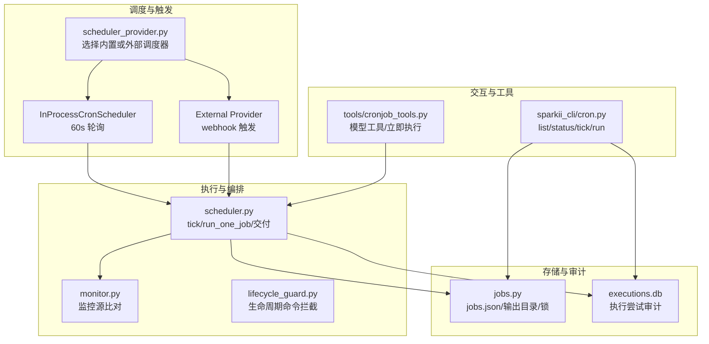
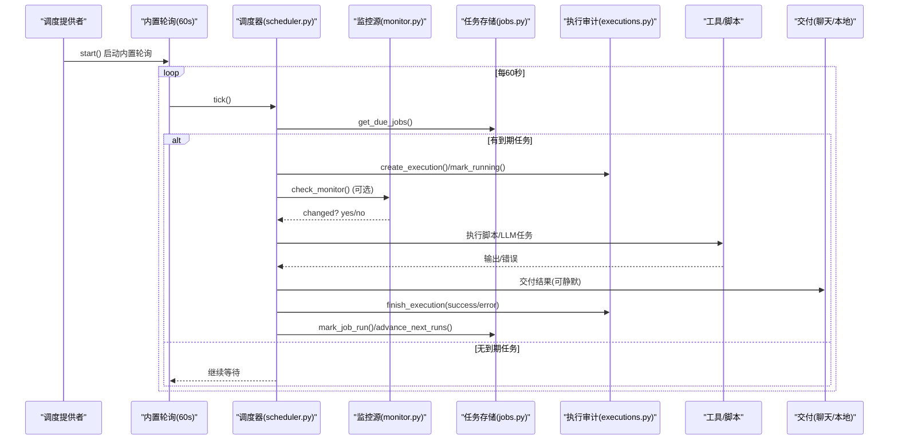
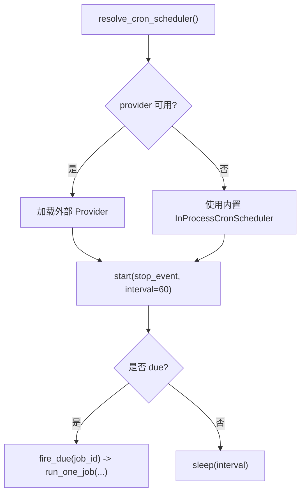
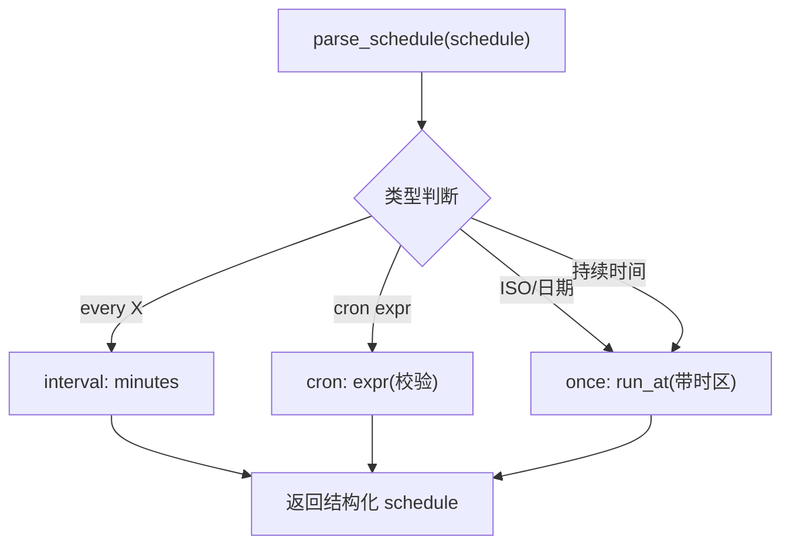
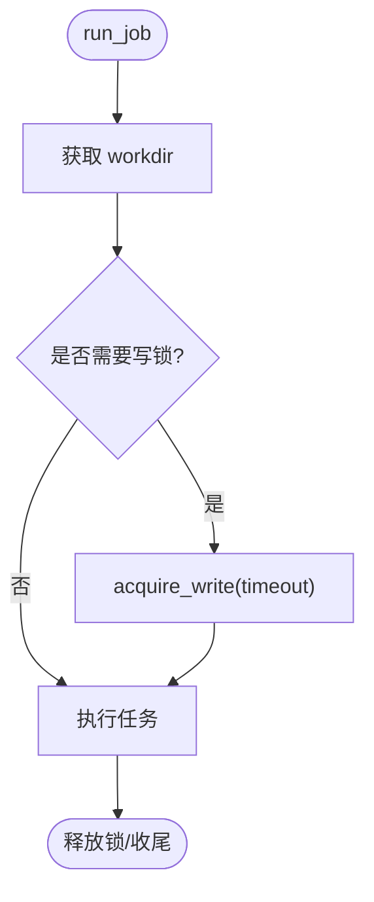
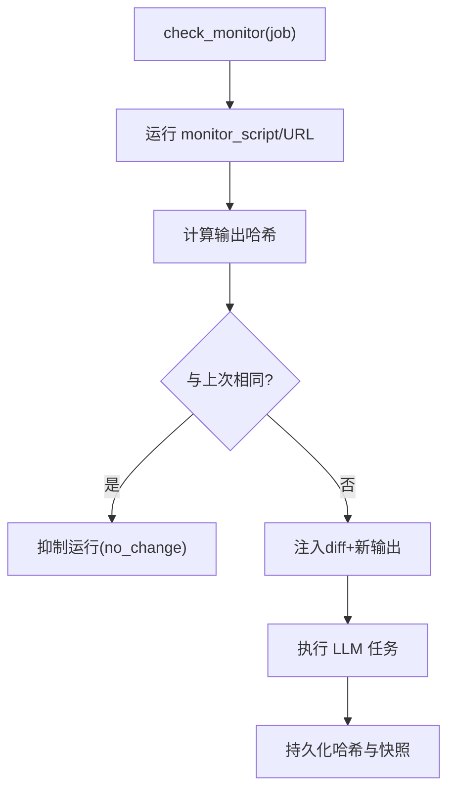
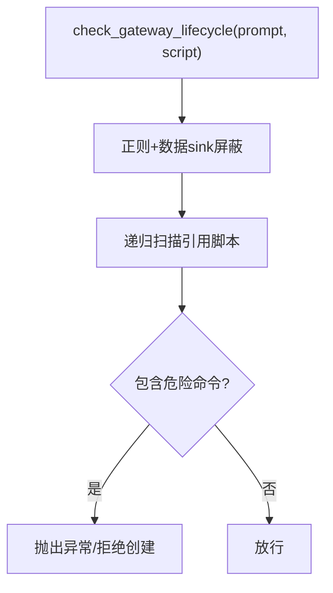
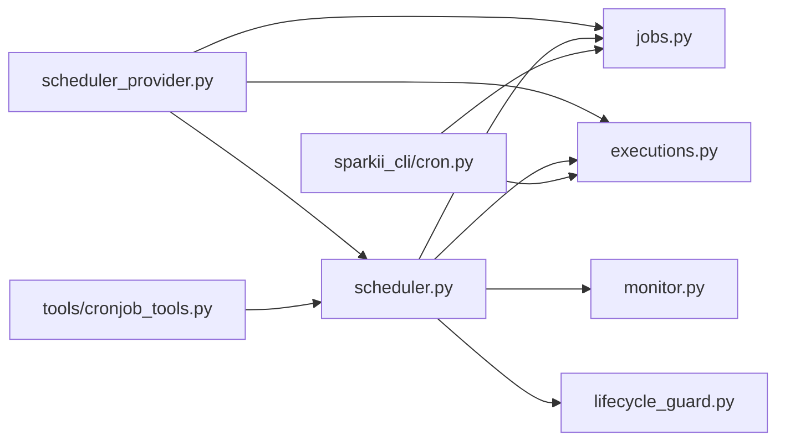

# 定时任务工作流

<cite>
**本文引用的文件**
- [scheduler.py](file://cron/scheduler.py)
- [jobs.py](file://cron/jobs.py)
- [executions.py](file://cron/executions.py)
- [monitor.py](file://cron/monitor.py)
- [lifecycle_guard.py](file://cron/lifecycle_guard.py)
- [scheduler_provider.py](file://cron/scheduler_provider.py)
- [cronjob_tools.py](file://tools/cronjob_tools.py)
- [sparkii_cli/cron.py](file://sparkii_cli/cron.py)
</cite>

## 目录
1. [简介](#简介)
2. [项目结构](#项目结构)
3. [核心组件](#核心组件)
4. [架构总览](#架构总览)
5. [详细组件分析](#详细组件分析)
6. [依赖关系分析](#依赖关系分析)
7. [性能与并发](#性能与并发)
8. [故障排查与恢复](#故障排查与恢复)
9. [结论](#结论)
10. [附录：常用配置与示例](#附录：常用配置与示例)

## 简介
本指南面向需要构建、调度与运维定时任务（Cron）的工程师，覆盖以下主题：
- Cron 调度器使用方法：任务创建、调度表达式配置、执行环境设置
- 触发条件：时间间隔、特定时间点、事件驱动（外部调度器）
- 执行环境：环境变量、权限、资源限制与工作目录隔离
- 常见任务示例：数据备份、日志清理、监控检查、自动报告生成
- 任务依赖与顺序控制：串行、并行、条件分支
- 监控与日志：执行历史、运行状态、失败告警
- 故障恢复与重试：中断恢复、幂等设计、去重与防抖

本仓库实现了“内置进程内 60s 轮询”的调度器，同时提供可扩展的外部调度器接口，支持多 Profile 隔离、安全扫描、监控源比对、持久化审计与跨进程锁。

## 项目结构
定时任务子系统位于 cron 目录，配合 CLI 工具与工具层封装，形成“调度—执行—存储—监控—CLI”的完整闭环。

图表来源
- [scheduler_provider.py:132-169](file://cron/scheduler_provider.py#L132-L169)
- [scheduler_provider.py:172-368](file://cron/scheduler_provider.py#L172-L368)
- [scheduler.py:1-120](file://cron/scheduler.py#L1-L120)
- [jobs.py:1-120](file://cron/jobs.py#L1-L120)
- [executions.py:1-63](file://cron/executions.py#L1-L63)
- [sparkii_cli/cron.py:99-207](file://sparkii_cli/cron.py#L99-L207)
- [cronjob_tools.py:600-797](file://tools/cronjob_tools.py#L600-L797)

章节来源
- [scheduler_provider.py:132-169](file://cron/scheduler_provider.py#L132-L169)
- [scheduler_provider.py:172-368](file://cron/scheduler_provider.py#L172-L368)
- [scheduler.py:1-120](file://cron/scheduler.py#L1-L120)
- [jobs.py:1-120](file://cron/jobs.py#L1-L120)
- [executions.py:1-63](file://cron/executions.py#L1-L63)
- [sparkii_cli/cron.py:99-207](file://sparkii_cli/cron.py#L99-L207)
- [cronjob_tools.py:600-797](file://tools/cronjob_tools.py#L600-L797)

## 核心组件
- 调度提供者（Provider）：决定何时触发任务，支持内置 60s 轮询与外部 webhook 触发
- 调度器核心：负责查找到期任务、构建执行上下文、执行并交付结果
- 任务存储：jobs.json 持久化任务定义、下次运行时间、状态；输出文件按 job_id 组织
- 执行审计：SQLite executions.db 记录每次尝试的生命周期与结果
- 监控源：可选脚本或 URL，仅当输出变化时触发 LLM 任务
- 安全守卫：阻止在任务中直接调用网关生命周期命令，防止重启循环
- CLI 与工具：提供列表、状态、手动运行、创建/编辑任务等能力

章节来源
- [scheduler_provider.py:27-129](file://cron/scheduler_provider.py#L27-L129)
- [scheduler.py:1-120](file://cron/scheduler.py#L1-L120)
- [jobs.py:1-120](file://cron/jobs.py#L1-L120)
- [executions.py:1-63](file://cron/executions.py#L1-L63)
- [monitor.py:1-30](file://cron/monitor.py#L1-L30)
- [lifecycle_guard.py:1-34](file://cron/lifecycle_guard.py#L1-L34)
- [sparkii_cli/cron.py:99-207](file://sparkii_cli/cron.py#L99-L207)
- [cronjob_tools.py:600-797](file://tools/cronjob_tools.py#L600-L797)

## 架构总览
下图展示从“调度触发”到“执行与交付”的主流程，以及关键的安全与监控点。

图表来源
- [scheduler_provider.py:172-368](file://cron/scheduler_provider.py#L172-L368)
- [scheduler.py:1-120](file://cron/scheduler.py#L1-L120)
- [jobs.py:587-709](file://cron/jobs.py#L587-L709)
- [executions.py:135-196](file://cron/executions.py#L135-L196)
- [monitor.py:147-194](file://cron/monitor.py#L147-L194)

## 详细组件分析

### 调度提供者与轮询
- 内置 InProcessCronScheduler：阻塞式 60s 循环，支持 can_dispatch 门控、多 Profile 复用、心跳与错误记录
- 外部 Provider：通过 webhook 调用 fire_due，走同一 run_one_job 路径，保证行为一致
- 解析策略：优先使用配置的 provider，不可用则回退至内置

图表来源
- [scheduler_provider.py:132-169](file://cron/scheduler_provider.py#L132-L169)
- [scheduler_provider.py:172-368](file://cron/scheduler_provider.py#L172-L368)

章节来源
- [scheduler_provider.py:27-129](file://cron/scheduler_provider.py#L27-L129)
- [scheduler_provider.py:132-169](file://cron/scheduler_provider.py#L132-L169)
- [scheduler_provider.py:172-368](file://cron/scheduler_provider.py#L172-L368)

### 任务存储与调度表达式
- jobs.json：存储任务定义、下次运行时间、状态、重复次数、交付目标等
- 输出目录：~/.sparkii/cron/output/{job_id}/{timestamp}.md
- 调度表达式解析：
  - 一次性：持续时间（如 30m）、ISO 时间戳
  - 周期性：every X（间隔）、标准 cron 表达式（需 croniter）
- 时区处理：将 naive 时间转换为 Sparkii 配置时区，避免误判
- 容错窗口：one-shot 允许短暂延迟后仍触发

图表来源
- [jobs.py:587-709](file://cron/jobs.py#L587-L709)

章节来源
- [jobs.py:1-120](file://cron/jobs.py#L1-L120)
- [jobs.py:587-709](file://cron/jobs.py#L587-L709)

### 执行环境与权限
- 工作目录隔离：workdir 通过写锁保护 TERMINAL_CWD 全局变量，避免并发污染
- 权限与安全：
  - jobs.json 与输出目录采用严格权限
  - 原子写入与所有权保留（root 重写场景）
  - 脚本路径必须相对且位于 scripts 目录，禁止绝对路径与 ~ 展开
- 环境变量：
  - 各平台 home target 通过环境变量注入（如 TELEGRAM_HOME_CHANNEL）
  - 超时与心跳由 SPARKII_CRON_TIMEOUT 控制
- 资源限制：
  - 并发线程池（并行/串行）
  - 锁超时与不活动超时，避免死锁与长挂

图表来源
- [scheduler.py:464-604](file://cron/scheduler.py#L464-L604)
- [jobs.py:523-585](file://cron/jobs.py#L523-L585)
- [cronjob_tools.py:517-553](file://tools/cronjob_tools.py#L517-L553)

章节来源
- [scheduler.py:464-604](file://cron/scheduler.py#L464-L604)
- [jobs.py:523-585](file://cron/jobs.py#L523-L585)
- [cronjob_tools.py:517-553](file://tools/cronjob_tools.py#L517-L553)

### 监控源（变更检测）
- monitor_script/monitor_url：先运行监控源，计算输出哈希并与上次比较
- 未变化：抑制 LLM 运行与交付，记录 silent no_change
- 已变化：注入 diff 与新输出到 prompt，正常执行
- 失败：视为 ERROR，不更新哈希，避免误报

图表来源
- [monitor.py:147-194](file://cron/monitor.py#L147-L194)

章节来源
- [monitor.py:1-30](file://cron/monitor.py#L1-L30)
- [monitor.py:147-194](file://cron/monitor.py#L147-L194)

### 安全与生命周期保护
- 阻止在任务中直接调用网关生命周期命令（restart/stop/pkill/systemctl/launchctl），防止 SIGTERM 重启循环
- 对脚本引用进行递归扫描，限制深度与大小，跳过二进制文件
- 数据 sink 参数屏蔽（grep/rg/sqlite3 等）以避免误报

图表来源
- [lifecycle_guard.py:98-104](file://cron/lifecycle_guard.py#L98-L104)
- [lifecycle_guard.py:567-613](file://cron/lifecycle_guard.py#L567-L613)
- [lifecycle_guard.py:665-715](file://cron/lifecycle_guard.py#L665-L715)

章节来源
- [lifecycle_guard.py:1-34](file://cron/lifecycle_guard.py#L1-L34)
- [lifecycle_guard.py:98-104](file://cron/lifecycle_guard.py#L98-L104)
- [lifecycle_guard.py:567-613](file://cron/lifecycle_guard.py#L567-L613)
- [lifecycle_guard.py:665-715](file://cron/lifecycle_guard.py#L665-L715)

### CLI 与工具
- CLI：list/status/tick/run/remove/pause/resume/notepad/history
- 模型工具：cronjob(action='create/update/run/list...')，支持立即执行与心跳保活
- 提供“守护进程未运行”提示，便于用户安装/启动 gateway

章节来源
- [sparkii_cli/cron.py:99-207](file://sparkii_cli/cron.py#L99-L207)
- [sparkii_cli/cron.py:344-461](file://sparkii_cli/cron.py#L344-L461)
- [sparkii_cli/cron.py:548-593](file://sparkii_cli/cron.py#L548-L593)
- [cronjob_tools.py:600-797](file://tools/cronjob_tools.py#L600-L797)

## 依赖关系分析
- scheduler_provider 依赖 scheduler 与 jobs/executions，解耦触发与执行
- scheduler 依赖 jobs（任务存储）、executions（审计）、monitor（监控源）、lifecycle_guard（安全）
- CLI 与 tools 通过统一 API 访问 jobs/executions，再委托 scheduler 执行

图表来源
- [scheduler_provider.py:132-169](file://cron/scheduler_provider.py#L132-L169)
- [scheduler.py:1-120](file://cron/scheduler.py#L1-L120)
- [jobs.py:1-120](file://cron/jobs.py#L1-L120)
- [executions.py:1-63](file://cron/executions.py#L1-L63)
- [monitor.py:1-30](file://cron/monitor.py#L1-L30)
- [lifecycle_guard.py:1-34](file://cron/lifecycle_guard.py#L1-L34)
- [sparkii_cli/cron.py:99-207](file://sparkii_cli/cron.py#L99-L207)
- [cronjob_tools.py:600-797](file://tools/cronjob_tools.py#L600-L797)

章节来源
- [scheduler_provider.py:132-169](file://cron/scheduler_provider.py#L132-L169)
- [scheduler.py:1-120](file://cron/scheduler.py#L1-L120)
- [jobs.py:1-120](file://cron/jobs.py#L1-L120)
- [executions.py:1-63](file://cron/executions.py#L1-L63)
- [monitor.py:1-30](file://cron/monitor.py#L1-L30)
- [lifecycle_guard.py:1-34](file://cron/lifecycle_guard.py#L1-L34)
- [sparkii_cli/cron.py:99-207](file://sparkii_cli/cron.py#L99-L207)
- [cronjob_tools.py:600-797](file://tools/cronjob_tools.py#L600-L797)

## 性能与并发
- 并行池：非侵入式任务并行执行，避免阻塞 ticker
- 串行池：修改环境的任务串行执行，保证顺序一致性
- 读/写锁：TERMINAL_CWD 的读写互斥，避免工作目录污染
- 锁超时：跨进程 .jobs.lock 与 CWD 锁均设超时，避免永久阻塞
- 心跳与成功标记：区分“存活但失败”和“真正运行”，提升可观测性

章节来源
- [scheduler.py:330-648](file://cron/scheduler.py#L330-L648)
- [jobs.py:101-115](file://cron/jobs.py#L101-L115)
- [jobs.py:270-373](file://cron/jobs.py#L270-L373)
- [scheduler_provider.py:235-271](file://cron/scheduler_provider.py#L235-L271)

## 故障排查与恢复
- 执行审计：executions.db 记录 claimed/running/completed/failed/unknown，支持分页查询
- 中断恢复：重启后将无法确认所有者的进行中尝试标记为 unknown，避免误判
- 心跳与错误：ticker_heartbeat 与 last_success 用于判断轮询健康度；记录最近一次 tick 错误
- 常见问题：
  - Gateway 未运行：CLI 会提示安装/启动
  - 权限问题：jobs.json 被 root 重写导致 gateway 用户无权访问
  - 锁竞争：跨进程锁超时降级为进程内锁，保持调度器存活
  - 外部 Provider：不期望 ticker 心跳，应关注 webhook 与 provider 状态

章节来源
- [executions.py:199-233](file://cron/executions.py#L199-L233)
- [executions.py:236-281](file://cron/executions.py#L236-L281)
- [sparkii_cli/cron.py:227-342](file://sparkii_cli/cron.py#L227-L342)
- [jobs.py:270-373](file://cron/jobs.py#L270-L373)

## 结论
该定时任务系统提供了健壮、可扩展、安全的 Cron 能力：
- 内置 60s 轮询 + 外部 Provider 扩展，满足多种部署形态
- 完善的调度表达式解析与时区处理，支持一次性与周期性任务
- 严格的权限、路径与环境隔离，保障执行安全
- 监控源与审计日志，便于变更检测与问题定位
- CLI 与工具链完善，便于日常管理与自动化集成

建议在生产环境中结合监控源与审计日志，合理设置超时与锁阈值，并通过外部 Provider 实现高可用与水平扩展。

## 附录：常用配置与示例

### 调度表达式与触发机制
- 一次性：
  - 持续时间：如 30m、2h、1d
  - 指定时间：ISO 时间戳（带时区）
- 周期性：
  - 间隔：every 30m、every 2h
  - Cron 表达式：标准 5/6 字段（需 croniter）
- 事件驱动：
  - 外部 Provider 通过 webhook 调用 fire_due，触发 run_one_job

章节来源
- [jobs.py:587-709](file://cron/jobs.py#L587-L709)
- [scheduler_provider.py:101-129](file://cron/scheduler_provider.py#L101-L129)

### 执行环境配置
- 工作目录：workdir 隔离，受写锁保护
- 环境变量：
  - 平台 home target 通过环境变量注入（如 TELEGRAM_HOME_CHANNEL）
  - 超时：SPARKII_CRON_TIMEOUT
- 权限：
  - 脚本路径必须相对且位于 scripts 目录
  - jobs.json 与输出目录严格权限
- 资源限制：
  - 并行/串行线程池
  - 锁超时与不活动超时

章节来源
- [scheduler.py:464-604](file://cron/scheduler.py#L464-L604)
- [jobs.py:523-585](file://cron/jobs.py#L523-L585)
- [cronjob_tools.py:517-553](file://tools/cronjob_tools.py#L517-L553)

### 常见任务示例
- 数据备份：
  - 使用 monitor_url 监控数据库导出状态，仅在变化时触发备份
  - 使用 workdir 隔离备份目录，避免污染其他任务
- 日志清理：
  - 周期性任务清理旧日志，注意权限与磁盘空间
  - 使用 no_agent 模式直接执行脚本，减少 LLM 开销
- 监控检查：
  - 使用 monitor_script 采集指标，对比哈希决定是否通知
  - 结合 deliver 配置，将告警发送到指定平台
- 自动报告生成：
  - 周期性任务聚合数据，生成报告并投递到聊天或邮件

章节来源
- [monitor.py:147-194](file://cron/monitor.py#L147-L194)
- [jobs.py:587-709](file://cron/jobs.py#L587-L709)
- [scheduler.py:1-120](file://cron/scheduler.py#L1-L120)

### 任务依赖与顺序控制
- 串行执行：修改环境的任务通过串行池保证顺序
- 并行执行：独立任务通过并行池提高吞吐
- 条件分支：基于 monitor 输出变化决定是否执行 LLM 任务
- 去重与防抖：
  - 火种 TTL 与 running set 防止重复执行
  - 跨进程锁避免并发写入冲突

章节来源
- [scheduler.py:330-648](file://cron/scheduler.py#L330-L648)
- [jobs.py:270-373](file://cron/jobs.py#L270-L373)
- [monitor.py:147-194](file://cron/monitor.py#L147-L194)

### 监控与日志
- CLI：
  - list：列出任务与状态
  - status：查看 ticker 心跳与错误
  - runs：查看执行历史
- 审计：
  - executions.db：记录每次尝试的状态与错误
  - usage_audit.jsonl：令牌消耗审计

章节来源
- [sparkii_cli/cron.py:99-207](file://sparkii_cli/cron.py#L99-L207)
- [executions.py:236-281](file://cron/executions.py#L236-L281)
- [scheduler.py:651-678](file://cron/scheduler.py#L651-L678)

### 故障恢复与重试
- 中断恢复：重启后将无法确认所有者的进行中尝试标记为 unknown
- 幂等设计：
  - 火种 TTL 与 CAS 确保最多一次执行
  - 输出目录与审计记录避免重复处理
- 重试策略：
  - 外部 Provider 可实现自定义重试逻辑
  - 内置调度器通过 next_run_at 推进下一次执行

章节来源
- [executions.py:199-233](file://cron/executions.py#L199-L233)
- [scheduler_provider.py:101-129](file://cron/scheduler_provider.py#L101-L129)
- [jobs.py:587-709](file://cron/jobs.py#L587-L709)