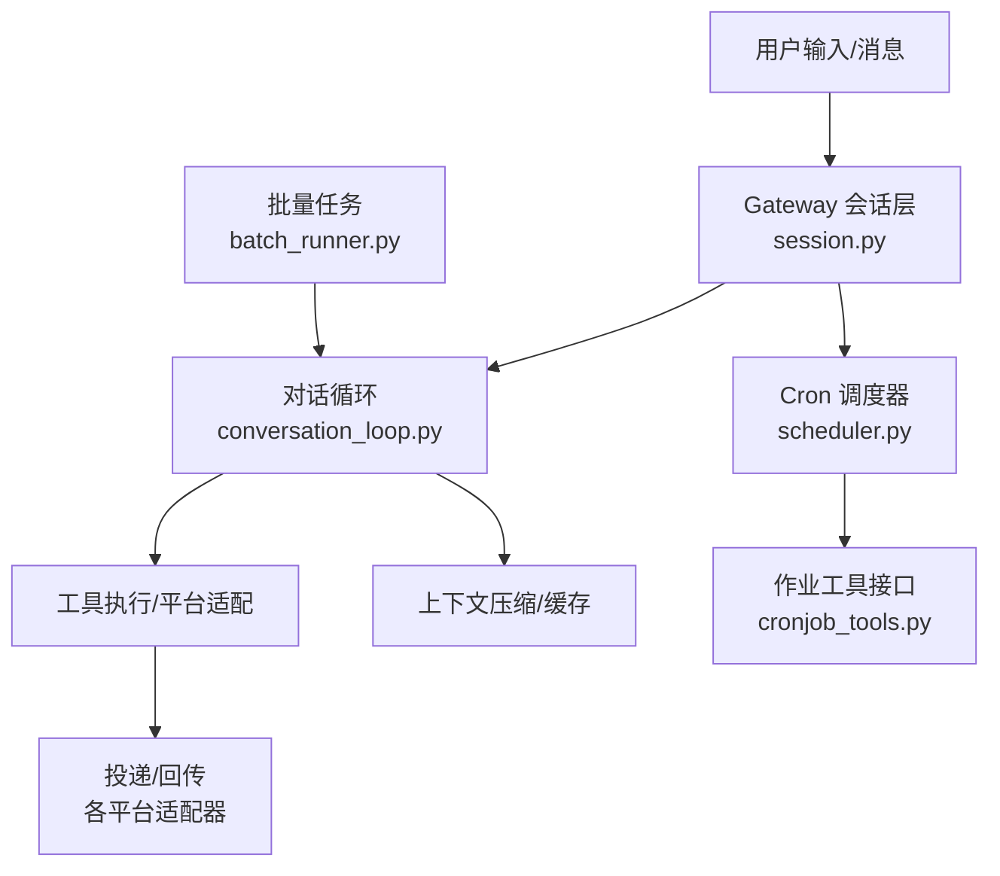
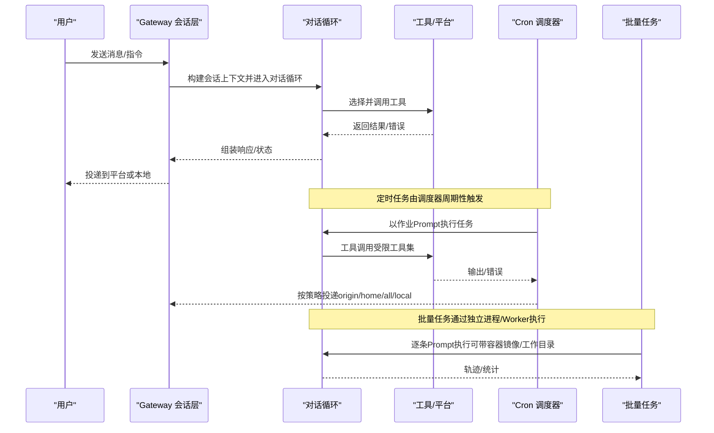
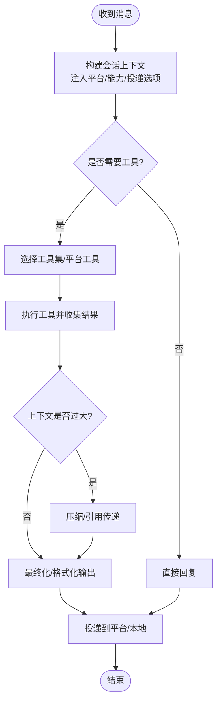
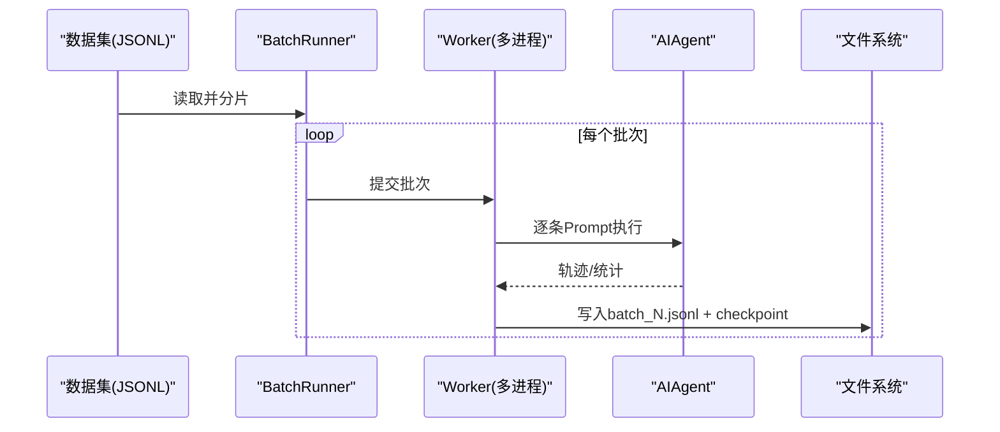
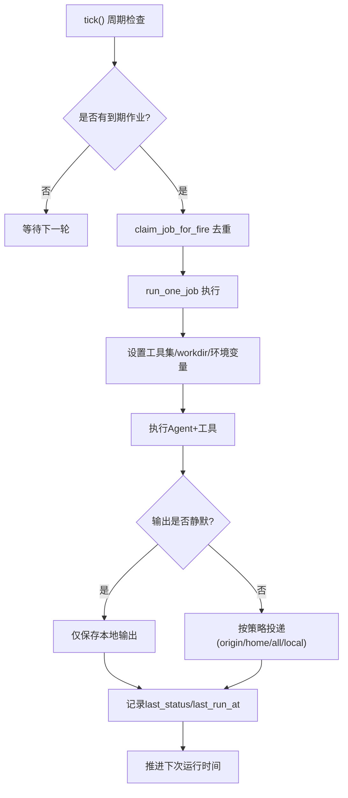
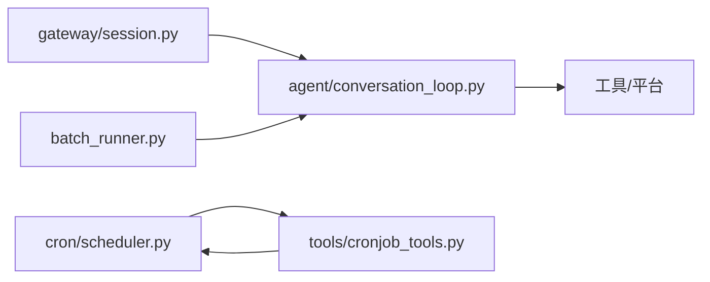

# 常用工作流指南

<cite>
**本文引用的文件**
- [README.md](file://README.md)
- [cron/scheduler.py](file://cron/scheduler.py)
- [tools/cronjob_tools.py](file://tools/cronjob_tools.py)
- [batch_runner.py](file://batch_runner.py)
- [agent/conversation_loop.py](file://agent/conversation_loop.py)
- [gateway/session.py](file://gateway/session.py)
</cite>

## 目录
1. [简介](#简介)
2. [项目结构](#项目结构)
3. [核心组件](#核心组件)
4. [架构总览](#架构总览)
5. [详细组件分析](#详细组件分析)
6. [依赖关系分析](#依赖关系分析)
7. [性能与资源管理](#性能与资源管理)
8. [故障排除指南](#故障排除指南)
9. [结论](#结论)
10. [附录：配置示例与最佳实践](#附录配置示例与最佳实践)

## 简介
本指南面向日常对话、批量任务、定时任务以及复杂自动化工作流的构建与运维。内容覆盖快速开始、上下文管理、工具调用最佳实践；批量数据处理（文件处理、数据转换、代码生成）的自动化配置；Cron 调度器、触发条件与执行环境；多工具/平台协作的复杂流程；团队协作（共享会话、权限、审计日志）；以及性能优化与资源管理建议。所有说明均基于仓库内实现，提供可追溯的源码路径以便深入查阅。

## 项目结构
围绕“工作流”的关键模块分布如下：
- 对话与会话：gateway/session.py 负责会话来源、上下文注入、跨平台路由与 PII 脱敏；agent/conversation_loop.py 驱动单轮对话循环（模型调用、工具分发、压缩、重试、后处理）。
- 定时任务：cron/scheduler.py 提供 tick 调度、并发/串行池、锁、静默输出、投递目标解析等；tools/cronjob_tools.py 暴露 Cron 作业管理工具（创建/更新/运行/查询），并内置安全扫描与脚本路径校验。
- 批量任务：batch_runner.py 提供并行批处理、断点续跑、轨迹保存、工具使用统计聚合。
- 入口与概览：README.md 给出安装、CLI/Gateway 启动、文档导航等。

图表来源
- [gateway/session.py:148-347](file://gateway/session.py#L148-L347)
- [agent/conversation_loop.py:1-100](file://agent/conversation_loop.py#L1-L100)
- [cron/scheduler.py:1-100](file://cron/scheduler.py#L1-L100)
- [tools/cronjob_tools.py:1-120](file://tools/cronjob_tools.py#L1-L120)
- [batch_runner.py:1-60](file://batch_runner.py#L1-L60)

章节来源
- [README.md:105-183](file://README.md#L105-L183)
- [gateway/session.py:148-347](file://gateway/session.py#L148-L347)
- [agent/conversation_loop.py:1-100](file://agent/conversation_loop.py#L1-L100)
- [cron/scheduler.py:1-100](file://cron/scheduler.py#L1-L100)
- [tools/cronjob_tools.py:1-120](file://tools/cronjob_tools.py#L1-L120)
- [batch_runner.py:1-60](file://batch_runner.py#L1-L60)

## 核心组件
- 会话与上下文（gateway/session.py）
  - SessionSource/SessionContext：描述消息来源、平台、频道、线程、角色授权、多用户共享会话等，用于动态系统提示注入与投递路由。
  - build_session_context_prompt：将平台信息、可用能力、投递选项注入到系统提示中，支持 PII 脱敏。
- 对话循环（agent/conversation_loop.py）
  - 单轮对话主循环：模型调用、工具分发、重试/退避、上下文压缩、最终化、计费/配额提示、中断恢复等。
- Cron 调度器（cron/scheduler.py）
  - tick 周期检查、并发/串行执行池、读写锁保护工作目录、静默标记、投递目标解析、失败摘要、用量审计。
- Cron 作业工具（tools/cronjob_tools.py）
  - 作业创建/更新/运行/列表/删除；作业 Prompt 安全扫描（防注入、防泄露）、脚本路径白名单校验、base_url 限制、心跳保活。
- 批量任务（batch_runner.py）
  - 数据集加载、分片、并行 Worker、断点续跑、轨迹保存、工具使用统计与推理覆盖率统计。

章节来源
- [gateway/session.py:148-347](file://gateway/session.py#L148-L347)
- [agent/conversation_loop.py:1-100](file://agent/conversation_loop.py#L1-L100)
- [cron/scheduler.py:1-100](file://cron/scheduler.py#L1-L100)
- [tools/cronjob_tools.py:1-120](file://tools/cronjob_tools.py#L1-L120)
- [batch_runner.py:1-60](file://batch_runner.py#L1-L60)

## 架构总览
下图展示从用户输入到工具执行、再到定时任务与批量任务的端到端流程。

图表来源
- [gateway/session.py:479-745](file://gateway/session.py#L479-L745)
- [agent/conversation_loop.py:1-100](file://agent/conversation_loop.py#L1-L100)
- [cron/scheduler.py:1-100](file://cron/scheduler.py#L1-L100)
- [tools/cronjob_tools.py:600-797](file://tools/cronjob_tools.py#L600-L797)
- [batch_runner.py:244-526](file://batch_runner.py#L244-L526)

## 详细组件分析

### 日常对话工作流（快速开始、上下文管理、工具调用）
- 快速开始
  - 通过 CLI 或 Gateway 启动，选择模型/工具集，开始对话。参考 README 中的命令与文档链接。
- 上下文管理
  - 会话来源、平台能力、Home Channel、多用户会话等信息在系统提示中注入，使 Agent 知道“在哪里、能做什么、如何投递”。
  - 支持 PII 脱敏（对允许的平台），避免敏感信息进入模型。
- 工具调用最佳实践
  - 根据平台能力启用工具集；避免在不可用平台上承诺无法完成的操作。
  - 注意工具参数大小与流式超时，必要时拆分调用。
  - 遇到配额/计费耗尽时，遵循引导提示切换提供商或充值。

图表来源
- [gateway/session.py:479-745](file://gateway/session.py#L479-L745)
- [agent/conversation_loop.py:1-100](file://agent/conversation_loop.py#L1-L100)

章节来源
- [README.md:105-183](file://README.md#L105-L183)
- [gateway/session.py:479-745](file://gateway/session.py#L479-L745)
- [agent/conversation_loop.py:1-100](file://agent/conversation_loop.py#L1-L100)

### 批量任务执行流程（文件处理、数据转换、代码生成）
- 数据准备
  - JSONL 数据集，每行包含 prompt（可选 image/docker_image/cwd）。
- 执行与容错
  - 分片并行执行，支持断点续跑（checkpoint.json），失败项可重试。
  - 每个任务可指定容器镜像与工作目录，隔离执行环境。
- 产出与统计
  - 轨迹保存为 batch_N.jsonl，附带工具使用统计与推理覆盖率统计。
  - 自动丢弃无推理的样本（可按需调整）。

图表来源
- [batch_runner.py:244-526](file://batch_runner.py#L244-L526)
- [batch_runner.py:529-800](file://batch_runner.py#L529-L800)

章节来源
- [batch_runner.py:1-60](file://batch_runner.py#L1-L60)
- [batch_runner.py:244-526](file://batch_runner.py#L244-L526)
- [batch_runner.py:529-800](file://batch_runner.py#L529-L800)

### 定时任务与工作流（Cron 调度器、触发条件、执行环境）
- 调度机制
  - 后台线程周期性 tick，检查到期作业并执行；支持并发池与串行池，保证工作目录隔离与顺序性。
- 触发条件
  - 支持 schedule/repeat/next_run_at 等字段；支持手动立即执行与去重（claim）。
- 执行环境
  - 作业工具集受策略限制（禁用 cronjob/messaging/clarify/memory 等）；MCP 服务器按需合并。
  - 支持 workdir 隔离；TERMINAL_CWD 读写锁防止交叉污染。
- 投递与审计
  - 支持 origin/home/all/local 投递；[SILENT] 静默输出；用量审计写入 JSONL。

图表来源
- [cron/scheduler.py:1-100](file://cron/scheduler.py#L1-L100)
- [cron/scheduler.py:167-253](file://cron/scheduler.py#L167-L253)
- [cron/scheduler.py:330-468](file://cron/scheduler.py#L330-L468)
- [cron/scheduler.py:578-604](file://cron/scheduler.py#L578-L604)
- [tools/cronjob_tools.py:600-797](file://tools/cronjob_tools.py#L600-L797)

章节来源
- [cron/scheduler.py:1-100](file://cron/scheduler.py#L1-L100)
- [cron/scheduler.py:167-253](file://cron/scheduler.py#L167-L253)
- [cron/scheduler.py:330-468](file://cron/scheduler.py#L330-L468)
- [cron/scheduler.py:578-604](file://cron/scheduler.py#L578-L604)
- [tools/cronjob_tools.py:600-797](file://tools/cronjob_tools.py#L600-L797)

### 复杂工作流（多工具/平台协作）
- 组合策略
  - 通过会话上下文告知 Agent 当前平台能力与 Home Channel，使其在单次对话中编排多个工具（如先搜索、再处理、最后投递）。
  - 利用 Cron 作业将长耗时任务异步化，并通过 deliver=origin/home/all/local 控制结果去向。
- 安全与边界
  - Cron Prompt 严格扫描（防注入/防泄露），脚本路径限制在 ~/.hermes/scripts/ 下；base_url 限制防止凭证外泄。
- 可观测性
  - 用量审计、失败摘要、静默标记、投递镜像（mirror_delivery）便于追踪与排障。

章节来源
- [gateway/session.py:479-745](file://gateway/session.py#L479-L745)
- [tools/cronjob_tools.py:260-313](file://tools/cronjob_tools.py#L260-L313)
- [tools/cronjob_tools.py:437-553](file://tools/cronjob_tools.py#L437-L553)
- [cron/scheduler.py:101-151](file://cron/scheduler.py#L101-L151)

### 团队协作工作流（共享会话、权限管理、审计日志）
- 共享会话
  - SessionContext.shared_multi_user_session 标识多用户会话；平台特定行为（如 Slack/Discord）在系统提示中明确约束。
- 权限与范围
  - SessionSource.role_authorized、scope_id/guild_id 用于跨域隔离与授权判定；deliver 目标需匹配已知平台集合，防止环境变量枚举。
- 审计与合规
  - Cron 用量审计 JSONL、失败摘要、静默输出；PII 脱敏在允许平台生效。

章节来源
- [gateway/session.py:148-347](file://gateway/session.py#L148-L347)
- [gateway/session.py:479-745](file://gateway/session.py#L479-L745)
- [cron/scheduler.py:255-283](file://cron/scheduler.py#L255-L283)
- [cron/scheduler.py:651-677](file://cron/scheduler.py#L651-L677)

## 依赖关系分析
- 会话层依赖对话循环进行实际处理；对话循环依赖工具与平台适配器。
- Cron 调度器依赖作业工具接口与平台投递能力；作业工具依赖调度器的运行与状态管理。
- 批量任务通过独立进程调用对话循环，产出轨迹与统计。

图表来源
- [gateway/session.py:148-347](file://gateway/session.py#L148-L347)
- [agent/conversation_loop.py:1-100](file://agent/conversation_loop.py#L1-L100)
- [cron/scheduler.py:1-100](file://cron/scheduler.py#L1-L100)
- [tools/cronjob_tools.py:1-120](file://tools/cronjob_tools.py#L1-L120)
- [batch_runner.py:1-60](file://batch_runner.py#L1-L60)

章节来源
- [gateway/session.py:148-347](file://gateway/session.py#L148-L347)
- [agent/conversation_loop.py:1-100](file://agent/conversation_loop.py#L1-L100)
- [cron/scheduler.py:1-100](file://cron/scheduler.py#L1-L100)
- [tools/cronjob_tools.py:1-120](file://tools/cronjob_tools.py#L1-L120)
- [batch_runner.py:1-60](file://batch_runner.py#L1-L60)

## 性能与资源管理
- 对话循环
  - 上下文压缩与引用传递减少 token 消耗；前缀缓存复用系统提示提升命中率。
  - 自适应退避与重试降低瞬时失败影响；中断恢复避免重复计算。
- Cron 调度
  - 并发/串行池分离，读写锁保护工作目录；静默输出减少不必要投递；用量审计辅助成本核算。
- 批量任务
  - 多进程并行、断点续跑、按内容跳过已完成项；容器镜像与工作目录隔离，避免相互干扰。
- 通用建议
  - 合理设置最大迭代次数与 token 上限；按需启用工具集；对长耗时任务优先采用 Cron 异步化。

章节来源
- [agent/conversation_loop.py:1-100](file://agent/conversation_loop.py#L1-L100)
- [cron/scheduler.py:330-468](file://cron/scheduler.py#L330-L468)
- [cron/scheduler.py:578-604](file://cron/scheduler.py#L578-L604)
- [batch_runner.py:244-526](file://batch_runner.py#L244-L526)

## 故障排除指南
- 对话中断/截断
  - 若出现流式超时或输出被截断，对话循环会追加继续提示，避免重复无效调用。
- 配额/计费耗尽
  - 当提供商报告额度耗尽时，系统会输出引导信息，包括充值链接与临时切换提供商的建议。
- Cron 失败与静默
  - 失败摘要会过滤噪声（限流、超时、认证错误），并将详情保存在输出目录；[SILENT] 标记可抑制投递但保留本地审计。
- 脚本路径与 base_url 限制
  - 脚本必须位于 ~/.hermes/scripts/ 相对路径；base_url 覆盖需满足同源或自定义 BYOK 策略，否则拒绝。

章节来源
- [agent/conversation_loop.py:195-273](file://agent/conversation_loop.py#L195-L273)
- [agent/conversation_loop.py:442-530](file://agent/conversation_loop.py#L442-L530)
- [cron/scheduler.py:101-151](file://cron/scheduler.py#L101-L151)
- [tools/cronjob_tools.py:437-553](file://tools/cronjob_tools.py#L437-L553)

## 结论
本指南基于仓库实现，系统化梳理了日常对话、批量任务、定时任务与复杂工作流的关键路径与最佳实践。借助会话上下文、工具集策略、Cron 调度与批量执行能力，可在多平台环境下构建稳定、可观测、可扩展的自动化流程。建议在生产环境中结合用量审计、失败摘要与静默策略，持续优化成本与可靠性。

## 附录：配置示例与最佳实践
- 快速开始
  - 安装与启动：参考 README 的安装与入门命令。
  - 选择模型与工具：使用 CLI 命令配置模型与工具集。
- 上下文管理
  - 在系统提示中查看平台能力与投递选项；在多用户会话中使用平台特定的提及规则。
- 工具调用
  - 仅在已启用的工具集范围内调用；对大输出任务拆分调用以避免流式超时。
- 批量任务
  - 准备 JSONL 数据集；设置 batch_size、num_workers、distribution；使用 --resume 断点续跑。
- Cron 任务
  - 定义 schedule/repeat/deliver；使用 deliver=origin/home/all/local 控制投递；关注失败摘要与用量审计。
- 安全与合规
  - 脚本路径限制在白名单目录；base_url 覆盖需符合策略；启用 PII 脱敏（允许平台）。

章节来源
- [README.md:105-183](file://README.md#L105-L183)
- [gateway/session.py:479-745](file://gateway/session.py#L479-L745)
- [batch_runner.py:244-526](file://batch_runner.py#L244-L526)
- [cron/scheduler.py:101-151](file://cron/scheduler.py#L101-L151)
- [tools/cronjob_tools.py:437-553](file://tools/cronjob_tools.py#L437-L553)