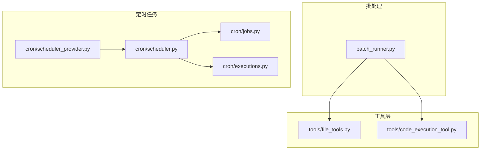
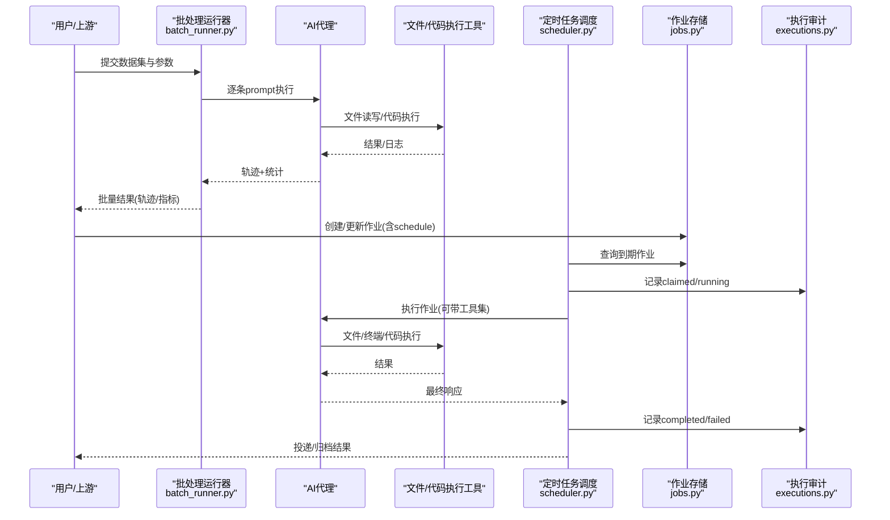
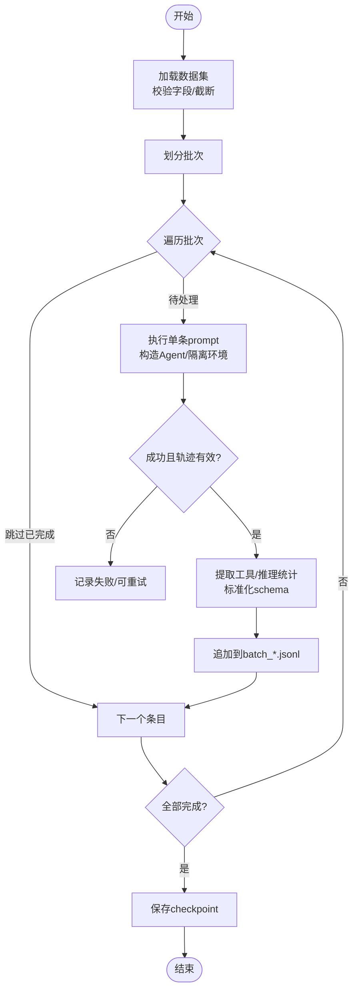
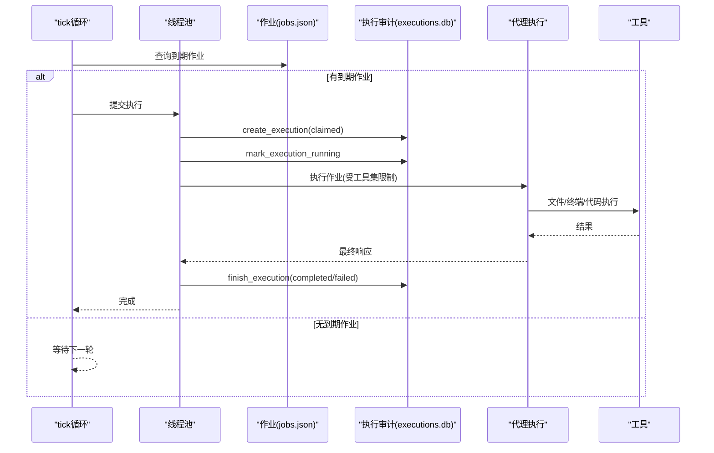
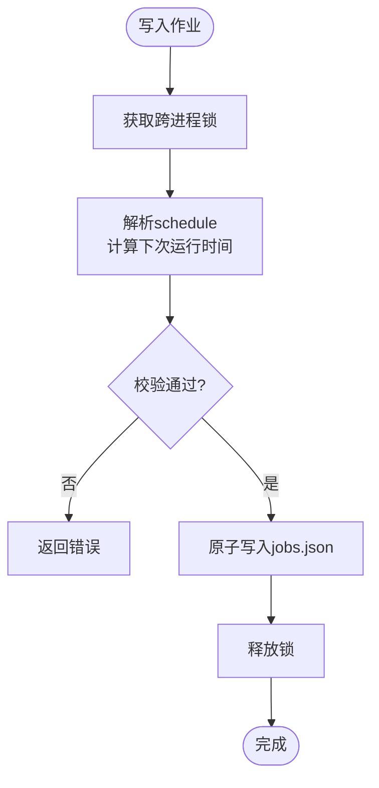
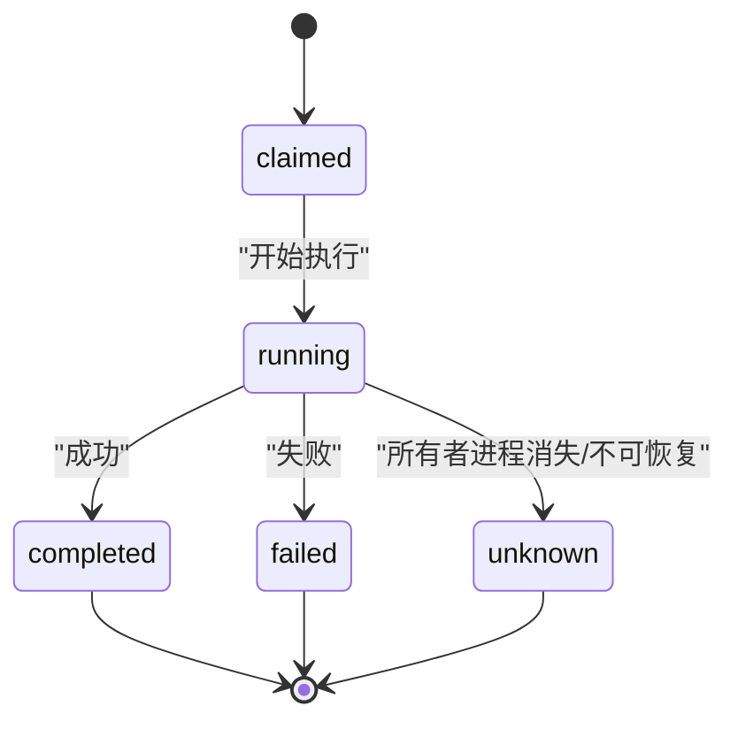
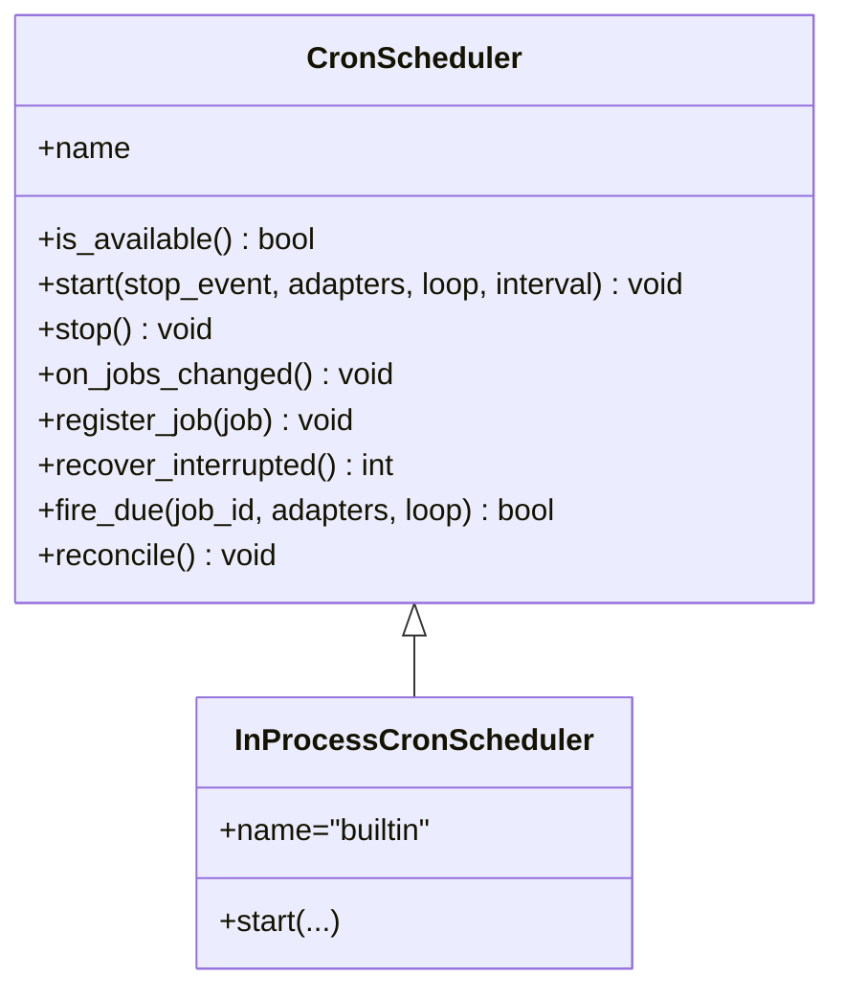
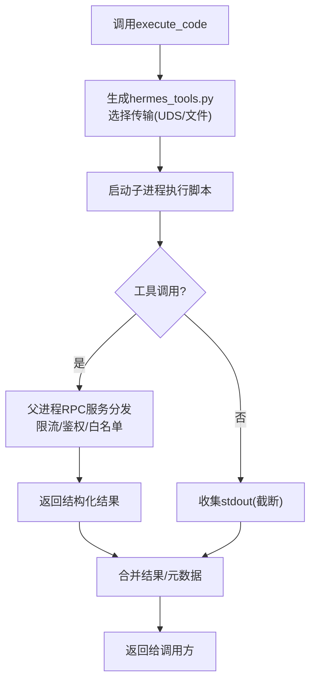
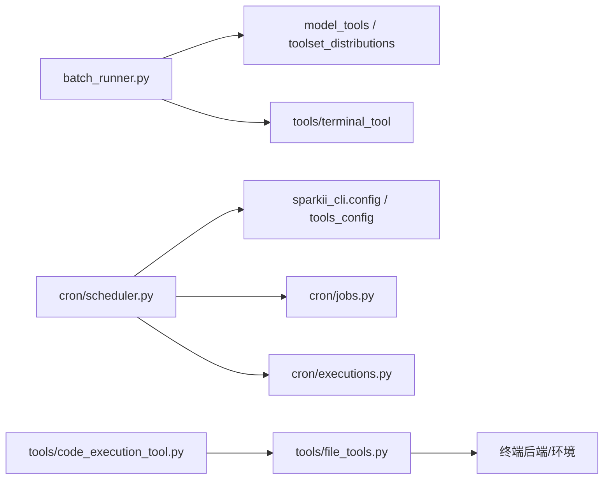

# 批量任务工作流

<cite>
**本文引用的文件**
- [batch_runner.py](file://batch_runner.py)
- [cron/scheduler.py](file://cron/scheduler.py)
- [cron/jobs.py](file://cron/jobs.py)
- [cron/executions.py](file://cron/executions.py)
- [cron/scheduler_provider.py](file://cron/scheduler_provider.py)
- [tools/file_tools.py](file://tools/file_tools.py)
- [tools/code_execution_tool.py](file://tools/code_execution_tool.py)
</cite>

## 目录
1. [简介](#简介)
2. [项目结构](#项目结构)
3. [核心组件](#核心组件)
4. [架构总览](#架构总览)
5. [详细组件分析](#详细组件分析)
6. [依赖关系分析](#依赖关系分析)
7. [性能考虑](#性能考虑)
8. [故障排除指南](#故障排除指南)
9. [结论](#结论)
10. [附录：配置与示例](#附录配置与示例)

## 简介
本指南面向“批量任务工作流”的设计、配置与落地，覆盖以下目标：
- 如何设计并配置批量任务：任务定义、参数传递、错误处理、断点续跑。
- 文件处理自动化：批量重命名、格式转换、数据清洗等。
- 代码生成与重构：模板使用、批量修改、版本控制集成。
- 数据转换与分析：CSV 处理、API 数据获取、报告生成。
- 任务调度与管理：并行执行、进度监控、结果收集。
- 提供完整配置示例与故障排除指南，确保高效自动化重复性任务。

本仓库提供了两类关键能力：
- 批处理运行器：用于对数据集进行批量推理与轨迹保存，支持断点续跑、工具使用统计、容器镜像隔离等。
- 定时任务系统（Cron）：提供作业存储、调度、执行、持久化审计与投递，支持并行/串行池、锁机制、多 Profile 复用。

## 项目结构
围绕批量任务工作流的关键目录与文件：
- 批处理入口与编排：batch_runner.py
- 定时任务调度与执行：cron/scheduler.py、cron/jobs.py、cron/executions.py、cron/scheduler_provider.py
- 文件与代码执行工具：tools/file_tools.py、tools/code_execution_tool.py

图表来源
- [batch_runner.py:244-397](file://batch_runner.py#L244-L397)
- [cron/scheduler.py:1-120](file://cron/scheduler.py#L1-L120)
- [cron/jobs.py:578-709](file://cron/jobs.py#L578-L709)
- [cron/executions.py:135-196](file://cron/executions.py#L135-L196)
- [cron/scheduler_provider.py:172-271](file://cron/scheduler_provider.py#L172-L271)

章节来源
- [batch_runner.py:244-397](file://batch_runner.py#L244-L397)
- [cron/scheduler.py:1-120](file://cron/scheduler.py#L1-L120)
- [cron/jobs.py:578-709](file://cron/jobs.py#L578-L709)
- [cron/executions.py:135-196](file://cron/executions.py#L135-L196)
- [cron/scheduler_provider.py:172-271](file://cron/scheduler_provider.py#L172-L271)

## 核心组件
- 批处理运行器（BatchRunner）
  - 负责加载数据集、分片成批次、并行执行、轨迹保存、工具使用统计、断点续跑。
  - 支持按任务维度注入容器镜像与工作目录，实现环境隔离。
- 定时任务调度器（Scheduler）
  - 周期性扫描到期作业，提交到线程池执行；维护运行中集合、中断标记、心跳与失败记录。
  - 提供作业存储、解析 schedule、并发安全写入、输出目录管理。
  - 提供执行审计表（executions.db），记录每次尝试的状态流转。
- 调度提供者（Scheduler Provider）
  - 抽象触发时机（何时执行），内置为进程内 60s 轮询；可替换外部提供者。
- 文件与代码执行工具
  - file_tools：路径解析、读写保护、设备路径拦截、大文件分页读取、敏感路径拒绝。
  - code_execution_tool：沙箱执行 Python 脚本，通过 UDS 或文件 RPC 调用受限工具集，限制环境变量与资源。

章节来源
- [batch_runner.py:529-639](file://batch_runner.py#L529-L639)
- [cron/scheduler.py:334-468](file://cron/scheduler.py#L334-L468)
- [cron/jobs.py:578-709](file://cron/jobs.py#L578-L709)
- [cron/executions.py:135-196](file://cron/executions.py#L135-L196)
- [cron/scheduler_provider.py:27-129](file://cron/scheduler_provider.py#L27-L129)
- [tools/file_tools.py:152-400](file://tools/file_tools.py#L152-L400)
- [tools/code_execution_tool.py:62-79](file://tools/code_execution_tool.py#L62-L79)

## 架构总览
下图展示从“任务定义”到“执行与结果收集”的端到端流程，涵盖批处理与定时任务两条主线。

图表来源
- [batch_runner.py:244-397](file://batch_runner.py#L244-L397)
- [cron/scheduler.py:334-468](file://cron/scheduler.py#L334-L468)
- [cron/jobs.py:578-709](file://cron/jobs.py#L578-L709)
- [cron/executions.py:135-196](file://cron/executions.py#L135-L196)

## 详细组件分析

### 批处理运行器（BatchRunner）
- 功能要点
  - 数据集加载与截断（max_samples）。
  - 批次划分与跳过已完成条目（基于内容匹配，更稳健的 resume）。
  - 单 prompt 执行：可选容器镜像/工作目录隔离；采样工具集；构建 AIAgent 并运行。
  - 轨迹保存与统计：工具使用统计、推理覆盖率统计、标准化 schema。
  - 断点续跑：checkpoint.json + 扫描已有 batch_*.jsonl 去重。
- 关键流程（流程图）

图表来源
- [batch_runner.py:644-776](file://batch_runner.py#L644-L776)
- [batch_runner.py:244-397](file://batch_runner.py#L244-L397)

章节来源
- [batch_runner.py:529-639](file://batch_runner.py#L529-L639)
- [batch_runner.py:644-776](file://batch_runner.py#L644-L776)
- [batch_runner.py:244-397](file://batch_runner.py#L244-L397)

### 定时任务调度（Scheduler）
- 功能要点
  - 周期 tick：每 60s 检查到期作业，提交到并行/串行线程池执行。
  - 并发控制：并行池用于无状态作业；串行池用于会修改全局环境的作业（如工作目录）。
  - 运行中集合与中断标记：防止重复执行、在网关关闭时强制中断并正确标记。
  - 投递与静默：根据响应内容决定是否投递，支持静默标记。
- 关键流程（序列图）

图表来源
- [cron/scheduler.py:334-468](file://cron/scheduler.py#L334-L468)
- [cron/executions.py:135-196](file://cron/executions.py#L135-L196)

章节来源
- [cron/scheduler.py:334-468](file://cron/scheduler.py#L334-L468)
- [cron/executions.py:135-196](file://cron/executions.py#L135-L196)

### 作业存储与调度（Jobs）
- 功能要点
  - 作业 JSON 存储与原子写入，跨进程锁（flock/msvcrt）保障一致性。
  - Schedule 解析：一次性、间隔、cron 表达式、ISO 时间戳。
  - 输出目录安全：拒绝路径穿越，权限加固。
  - 心跳与失败记录：便于状态查看与诊断。
- 关键流程（流程图）

图表来源
- [cron/jobs.py:270-373](file://cron/jobs.py#L270-L373)
- [cron/jobs.py:578-709](file://cron/jobs.py#L578-L709)

章节来源
- [cron/jobs.py:270-373](file://cron/jobs.py#L270-L373)
- [cron/jobs.py:578-709](file://cron/jobs.py#L578-L709)

### 执行审计（Executions）
- 功能要点
  - SQLite 持久化每次执行尝试：claimed → running → completed/failed/unknown。
  - 恢复机制：重启后将无法确认所有者的进行中尝试标记为 unknown。
  - 裁剪策略：保留最近 N 条终态记录。
- 关键流程（状态机）

图表来源
- [cron/executions.py:32-63](file://cron/executions.py#L32-L63)
- [cron/executions.py:135-196](file://cron/executions.py#L135-L196)
- [cron/executions.py:199-233](file://cron/executions.py#L199-L233)

章节来源
- [cron/executions.py:135-196](file://cron/executions.py#L135-L196)
- [cron/executions.py:199-233](file://cron/executions.py#L199-L233)

### 调度提供者（Scheduler Provider）
- 功能要点
  - 抽象“何时触发”，内置为进程内 60s 轮询；支持外部提供者（如 Chronos）。
  - 统一 fire_due 接口：声明式触发后交由共享执行体 run_one_job。
  - 多 Profile 支持：每个 profile 独立 tick、心跳与恢复。
- 关键流程（类关系）

图表来源
- [cron/scheduler_provider.py:27-129](file://cron/scheduler_provider.py#L27-L129)
- [cron/scheduler_provider.py:172-271](file://cron/scheduler_provider.py#L172-L271)

章节来源
- [cron/scheduler_provider.py:27-129](file://cron/scheduler_provider.py#L27-L129)
- [cron/scheduler_provider.py:172-271](file://cron/scheduler_provider.py#L172-L271)

### 文件与代码执行工具
- 文件工具（file_tools）
  - 路径解析：优先以任务工作区根为基准，避免 worktree/cwd 分歧。
  - 安全策略：阻止设备路径、敏感系统路径、Sparkii 配置文件直接写入。
  - 大文件读取：字符预算与分页提示，避免上下文爆炸。
- 代码执行工具（code_execution_tool）
  - 沙箱执行：仅允许有限工具子集，严格的环境变量白名单。
  - 传输方式：本地 UDS 或远程文件 RPC，限制 stdout/stderr 大小。
  - 资源限制：超时、最大工具调用次数、输出截断。

图表来源
- [tools/code_execution_tool.py:325-464](file://tools/code_execution_tool.py#L325-L464)
- [tools/code_execution_tool.py:649-779](file://tools/code_execution_tool.py#L649-L779)
- [tools/file_tools.py:152-400](file://tools/file_tools.py#L152-L400)

章节来源
- [tools/file_tools.py:152-400](file://tools/file_tools.py#L152-L400)
- [tools/code_execution_tool.py:325-464](file://tools/code_execution_tool.py#L325-L464)
- [tools/code_execution_tool.py:649-779](file://tools/code_execution_tool.py#L649-L779)

## 依赖关系分析
- 批处理运行器依赖：
  - 工具集分布与模型映射（model_tools、toolset_distributions）。
  - 终端工具注册任务环境覆盖（terminal_tool）。
- 定时任务依赖：
  - 作业存储（jobs.json）、执行审计（executions.db）。
  - 平台工具集解析（sparkii_cli.tools_config）。
- 工具层依赖：
  - 终端后端（local/docker/ssh/modal/daytona 等）。
  - 安全策略（路径/设备/敏感文件）。

图表来源
- [batch_runner.py:49-65](file://batch_runner.py#L49-L65)
- [cron/scheduler.py:44-57](file://cron/scheduler.py#L44-L57)
- [cron/jobs.py:36-43](file://cron/jobs.py#L36-L43)
- [cron/executions.py:17-24](file://cron/executions.py#L17-L24)
- [tools/file_tools.py:152-214](file://tools/file_tools.py#L152-L214)
- [tools/code_execution_tool.py:62-79](file://tools/code_execution_tool.py#L62-L79)

章节来源
- [batch_runner.py:49-65](file://batch_runner.py#L49-L65)
- [cron/scheduler.py:44-57](file://cron/scheduler.py#L44-L57)
- [cron/jobs.py:36-43](file://cron/jobs.py#L36-L43)
- [cron/executions.py:17-24](file://cron/executions.py#L17-L24)
- [tools/file_tools.py:152-214](file://tools/file_tools.py#L152-L214)
- [tools/code_execution_tool.py:62-79](file://tools/code_execution_tool.py#L62-L79)

## 性能考虑
- 批处理
  - 合理设置 batch_size 与 num_workers，平衡吞吐与资源占用。
  - 使用 checkpoint 与内容级去重，避免重复执行。
  - 工具统计与推理覆盖率统计有助于评估质量与成本。
- 定时任务
  - 并行池适合无状态作业；涉及工作目录/环境变更的作业走串行池，避免竞争。
  - 心跳与失败记录帮助快速定位卡死或异常。
  - 执行审计表限制历史规模，避免膨胀。
- 工具层
  - 文件读取字符预算与大文件分页，降低上下文压力。
  - 沙箱执行限制 stdout/stderr 大小与工具调用次数，防止滥用。
  - 环境变量白名单与敏感路径拦截，减少意外泄露与阻塞。

[本节为通用指导，不直接分析具体文件]

## 故障排除指南
- 批处理常见问题
  - 数据集缺失字段或无效 JSON：检查 dataset 行结构与字段名。
  - Docker 镜像拉取失败：确认网络与镜像可达，必要时禁用镜像检查。
  - 无推理覆盖率样本被丢弃：检查模型是否输出 reasoning，或调整策略。
- 定时任务常见问题
  - 作业未触发：检查 schedule 解析、enabled 标志、暂停标记。
  - 重复执行：确认 claim 与运行中集合逻辑；检查中断标记。
  - 投递噪声：检查静默标记与消息过滤规则。
- 工具层常见问题
  - 路径解析错误：确认工作区根与 TERMINAL_CWD；避免相对路径歧义。
  - 设备路径/敏感路径被拒：调整路径或使用终端工具提权。
  - 沙箱执行失败：检查可用工具集、环境变量白名单、模块依赖。

章节来源
- [batch_runner.py:644-776](file://batch_runner.py#L644-L776)
- [batch_runner.py:244-397](file://batch_runner.py#L244-L397)
- [cron/scheduler.py:101-151](file://cron/scheduler.py#L101-L151)
- [cron/jobs.py:578-709](file://cron/jobs.py#L578-L709)
- [tools/file_tools.py:641-703](file://tools/file_tools.py#L641-L703)
- [tools/code_execution_tool.py:377-429](file://tools/code_execution_tool.py#L377-L429)

## 结论
本工作流将“批处理运行器”和“定时任务系统”有机结合，既支持大规模离线数据处理，也支持在线定时自动化。通过严格的工具安全策略、执行审计与断点续跑机制，可在保证稳定性的同时提升效率。建议在生产环境中结合监控与告警，持续优化批大小、并行度与工具集配置。

[本节为总结，不直接分析具体文件]

## 附录：配置与示例
- 批处理运行器
  - 输入：JSONL 数据集，至少包含 prompt 字段；可选 image/docker_image/cwd。
  - 参数：batch_size、num_workers、model、max_iterations、distribution、verbose、reasoning_config、prefill_messages、max_samples。
  - 输出：data/<run_name>/batch_*.jsonl、statistics.json、checkpoint.json。
- 定时任务
  - 作业字段：id、name、prompt/script、skills、schedule、enabled、deliver 等。
  - Schedule 语法：一次性（duration/ISO）、间隔（every X）、cron 表达式。
  - 输出：~/.sparkii/cron/output/{job_id}/{timestamp}.md；执行审计：~/.sparkii/cron/executions.db。
- 工具与安全
  - 文件读取：可通过 offset/limit 分页；注意字符预算。
  - 沙箱执行：仅允许有限工具；环境变量经白名单过滤；stdout/stderr 截断。

章节来源
- [batch_runner.py:529-639](file://batch_runner.py#L529-L639)
- [cron/jobs.py:578-709](file://cron/jobs.py#L578-L709)
- [cron/executions.py:135-196](file://cron/executions.py#L135-L196)
- [tools/file_tools.py:52-85](file://tools/file_tools.py#L52-L85)
- [tools/code_execution_tool.py:62-79](file://tools/code_execution_tool.py#L62-L79)