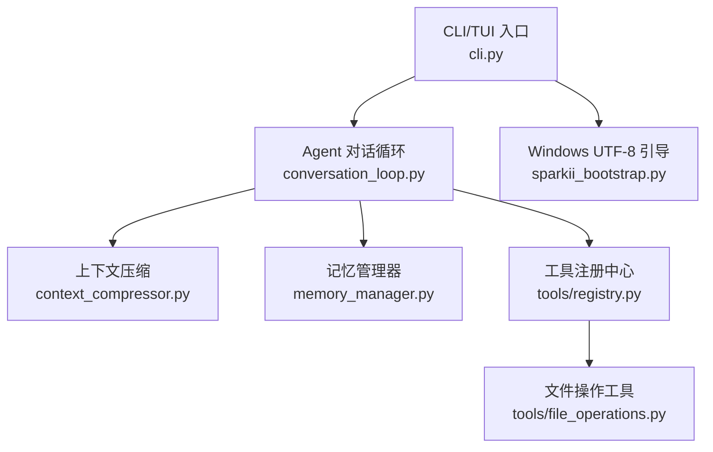
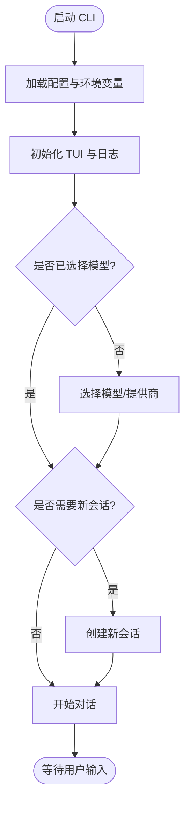
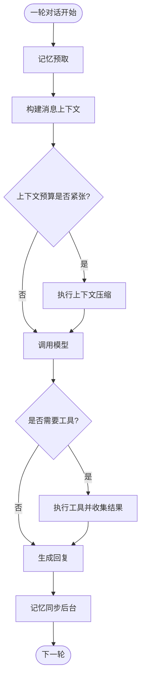
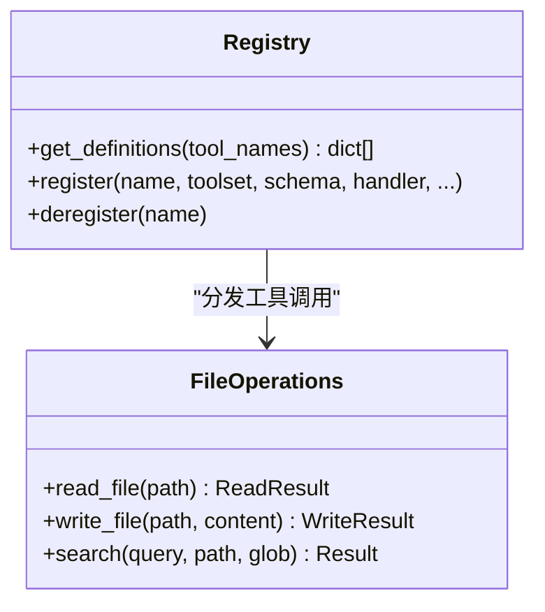
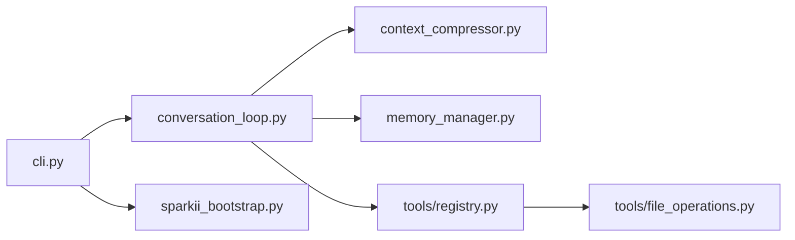

# 日常对话工作流

<cite>
**本文引用的文件**
- [README.md](file://README.md)
- [cli.py](file://cli.py)
- [sparkii_bootstrap.py](file://sparkii_bootstrap.py)
- [agent/context_compressor.py](file://agent/context_compressor.py)
- [agent/memory_manager.py](file://agent/memory_manager.py)
- [tools/registry.py](file://tools/registry.py)
- [tools/file_operations.py](file://tools/file_operations.py)
- [agent/conversation_loop.py](file://agent/conversation_loop.py)
</cite>

## 目录
1. [简介](#简介)
2. [项目结构](#项目结构)
3. [核心组件](#核心组件)
4. [架构总览](#架构总览)
5. [详细组件分析](#详细组件分析)
6. [依赖关系分析](#依赖关系分析)
7. [性能考虑](#性能考虑)
8. [故障排查指南](#故障排查指南)
9. [结论](#结论)
10. [附录](#附录)

## 简介
本指南面向初学者与进阶用户，系统讲解如何在 SparkiiDesktop（Sparkii Agent）中快速开始日常对话工作流：启动 CLI、选择模型、设置会话；深入说明上下文压缩与记忆系统的机制与最佳实践；介绍如何使用内置工具增强对话体验（文件操作、代码执行、网络搜索等）；提供常见场景示例（代码开发辅助、文档编写、数据分析）；并给出性能优化建议（上下文管理、工具调用策略、内存使用优化）。

## 项目结构
SparkiiDesktop 的核心由 CLI/TUI 入口、Agent 对话循环、上下文压缩、记忆系统、工具注册与实现组成。下图展示关键模块与交互关系。



**图表来源**
- [cli.py:1-800](file://cli.py#L1-L800)
- [agent/conversation_loop.py:1-200](file://agent/conversation_loop.py#L1-L200)
- [agent/context_compressor.py:1-800](file://agent/context_compressor.py#L1-L800)
- [agent/memory_manager.py:1-800](file://agent/memory_manager.py#L1-L800)
- [tools/registry.py:1-800](file://tools/registry.py#L1-L800)
- [tools/file_operations.py:1-200](file://tools/file_operations.py#L1-L200)
- [sparkii_bootstrap.py:1-240](file://sparkii_bootstrap.py#L1-L240)

**章节来源**
- [README.md:105-184](file://README.md#L105-L184)
- [cli.py:409-793](file://cli.py#L409-L793)

## 核心组件
- CLI/TUI 入口：负责加载配置、初始化日志、构建 TUI 界面、解析命令与快捷指令。
- Agent 对话循环：驱动一次用户请求的完整流程（模型调用、工具调度、重试、压缩、后置钩子、背景记忆同步）。
- 上下文压缩：自动将历史消息摘要化，保留头部与尾部关键信息，避免超出上下文限制。
- 记忆系统：统一接入内置与外部记忆提供者，预取与持久化用户偏好与知识。
- 工具注册中心：集中发现、注册、分发工具，支持动态 schema 与可用性检查缓存。
- 文件操作工具：跨终端后端的统一文件读写、补丁、搜索能力。

**章节来源**
- [cli.py:1-800](file://cli.py#L1-L800)
- [agent/conversation_loop.py:1-200](file://agent/conversation_loop.py#L1-L200)
- [agent/context_compressor.py:1-800](file://agent/context_compressor.py#L1-L800)
- [agent/memory_manager.py:1-800](file://agent/memory_manager.py#L1-L800)
- [tools/registry.py:1-800](file://tools/registry.py#L1-L800)
- [tools/file_operations.py:1-200](file://tools/file_operations.py#L1-L200)

## 架构总览
下图展示从用户输入到模型响应、工具执行、上下文压缩与记忆更新的端到端流程。

```mermaid
sequenceDiagram
participant U as "用户"
participant CLI as "CLI/TUI<br/>cli.py"
participant Loop as "对话循环<br/>conversation_loop.py"
participant Model as "LLM 提供商"
participant Tools as "工具注册中心<br/>tools/registry.py"
participant FileOps as "文件操作<br/>tools/file_operations.py"
participant Mem as "记忆管理器<br/>memory_manager.py"
participant Comp as "上下文压缩<br/>context_compressor.py"
U->>CLI : 输入消息/命令
CLI->>Loop : 构建会话上下文
Loop->>Model : 发送消息含工具定义
Model-->>Loop : 返回文本或工具调用
alt 需要工具
Loop->>Tools : 解析并分发工具
Tools->>FileOps : 执行文件操作
FileOps-->>Tools : 结果
Tools-->>Loop : 结构化结果
end
Loop->>Comp : 检测上下文压力并压缩
Loop->>Mem : 预取/同步记忆
Loop-->>CLI : 输出最终回复
```

**图表来源**
- [cli.py:409-793](file://cli.py#L409-L793)
- [agent/conversation_loop.py:1-200](file://agent/conversation_loop.py#L1-L200)
- [tools/registry.py:717-764](file://tools/registry.py#L717-L764)
- [tools/file_operations.py:1-200](file://tools/file_operations.py#L1-L200)
- [agent/memory_manager.py:525-694](file://agent/memory_manager.py#L525-L694)
- [agent/context_compressor.py:1-800](file://agent/context_compressor.py#L1-L800)

## 详细组件分析

### 快速开始：启动 CLI、选择模型、设置会话
- 启动 CLI：运行交互式终端界面，进入对话模式。
- 选择模型：通过命令行切换模型提供商与具体模型，无需修改代码。
- 设置会话：新建/重置会话、查看用量、压缩上下文、浏览技能等。



**图表来源**
- [cli.py:409-793](file://cli.py#L409-L793)
- [README.md:105-184](file://README.md#L105-L184)

**章节来源**
- [README.md:105-184](file://README.md#L105-L184)
- [cli.py:409-793](file://cli.py#L409-L793)

### 上下文管理机制：压缩、记忆系统与工具调用最佳实践
- 上下文压缩：当接近上下文限制时，自动对历史消息进行摘要，保留头部与尾部关键信息，避免丢失重要上下文。
- 记忆系统：在每轮对话前后预取与同步记忆，确保长期知识与用户偏好持续可用。
- 工具调用策略：优先使用轻量工具，控制工具输出大小，避免污染上下文；必要时分步调用并逐步收敛。



**图表来源**
- [agent/context_compressor.py:1-800](file://agent/context_compressor.py#L1-L800)
- [agent/memory_manager.py:525-694](file://agent/memory_manager.py#L525-L694)
- [agent/conversation_loop.py:1-200](file://agent/conversation_loop.py#L1-L200)

**章节来源**
- [agent/context_compressor.py:1-800](file://agent/context_compressor.py#L1-L800)
- [agent/memory_manager.py:1-800](file://agent/memory_manager.py#L1-L800)
- [agent/conversation_loop.py:1-200](file://agent/conversation_loop.py#L1-L200)

### 使用内置工具增强对话体验
- 文件操作：跨终端后端统一读取、写入、补丁与搜索，支持行尾与 BOM 处理、安全写路径限制。
- 代码执行：通过终端后端执行脚本，注意超时与最大调用次数限制。
- 网络搜索：结合工具网关或外部服务完成检索，注意隐私与安全策略。



**图表来源**
- [tools/registry.py:717-764](file://tools/registry.py#L717-L764)
- [tools/file_operations.py:1-200](file://tools/file_operations.py#L1-L200)

**章节来源**
- [tools/registry.py:1-800](file://tools/registry.py#L1-L800)
- [tools/file_operations.py:1-200](file://tools/file_operations.py#L1-L200)

### 常见对话场景示例
- 代码开发辅助：
  - 读取项目文件、搜索符号、执行测试脚本、生成补丁并验证。
  - 使用记忆系统记住常用约定与风格，减少重复提示。
- 文档编写：
  - 拉取模板、填充内容、搜索参考资料、格式化输出。
  - 利用上下文压缩保持长文档的结构清晰。
- 数据分析：
  - 读取数据文件、执行分析脚本、可视化结果、总结洞察。
  - 通过记忆系统保存分析步骤与结论，便于后续复用。

[本节为概念性说明，不直接分析具体文件]

## 依赖关系分析
- CLI 依赖配置加载与 TUI 库，驱动对话循环。
- 对话循环依赖上下文压缩、记忆管理与工具注册中心。
- 工具注册中心集中管理工具 schema 与分发逻辑，文件操作工具作为典型实现。
- Windows 平台通过引导模块确保 UTF-8 编码与导入路径安全。



**图表来源**
- [cli.py:409-793](file://cli.py#L409-L793)
- [agent/conversation_loop.py:1-200](file://agent/conversation_loop.py#L1-L200)
- [agent/context_compressor.py:1-800](file://agent/context_compressor.py#L1-L800)
- [agent/memory_manager.py:1-800](file://agent/memory_manager.py#L1-L800)
- [tools/registry.py:1-800](file://tools/registry.py#L1-L800)
- [tools/file_operations.py:1-200](file://tools/file_operations.py#L1-L200)
- [sparkii_bootstrap.py:1-240](file://sparkii_bootstrap.py#L1-L240)

**章节来源**
- [cli.py:409-793](file://cli.py#L409-L793)
- [agent/conversation_loop.py:1-200](file://agent/conversation_loop.py#L1-L200)
- [tools/registry.py:1-800](file://tools/registry.py#L1-L800)

## 性能考虑
- 上下文管理：
  - 合理设置压缩阈值，避免频繁压缩导致信息丢失。
  - 利用尾部保护与头部保留，确保关键上下文不被丢弃。
- 工具调用策略：
  - 控制工具输出大小，避免污染上下文。
  - 使用批量操作与分步收敛，减少往返次数。
- 内存使用优化：
  - 记忆系统后台同步，避免阻塞主流程。
  - 工具可用性检查缓存，降低重复探测开销。

[本节提供通用指导，不直接分析具体文件]

## 故障排查指南
- 常见问题：
  - 工具不可用：检查工具可用性检查缓存与依赖环境。
  - 上下文溢出：调整压缩阈值或清理历史消息。
  - 记忆同步失败：确认外部记忆提供者状态与超时设置。
- 调试建议：
  - 启用详细日志，定位错误堆栈。
  - 使用会话导出与分析工具，复盘对话轨迹。

**章节来源**
- [tools/registry.py:233-387](file://tools/registry.py#L233-L387)
- [agent/memory_manager.py:696-780](file://agent/memory_manager.py#L696-L780)
- [agent/context_compressor.py:73-95](file://agent/context_compressor.py#L73-L95)

## 结论
通过 CLI/TUI 快速启动、灵活选择模型、智能上下文压缩与记忆系统，SparkiiDesktop 提供了高效且可扩展的日常对话工作流。合理使用内置工具与优化策略，可在代码开发、文档编写与数据分析等场景中显著提升效率。建议根据实际需求调整配置与工具集，以获得最佳体验。

[本节为总结性内容，不直接分析具体文件]

## 附录
- 参考命令与配置：
  - 启动 CLI、选择模型、设置会话、查看用量与压缩上下文。
  - 配置文件位置与优先级，环境变量覆盖规则。
- 扩展与集成：
  - 插件与技能系统，MCP 集成，定时任务与自动化。

[本节为补充信息，不直接分析具体文件]