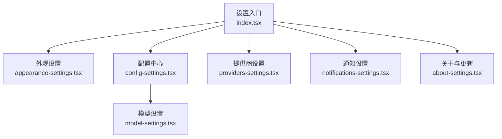
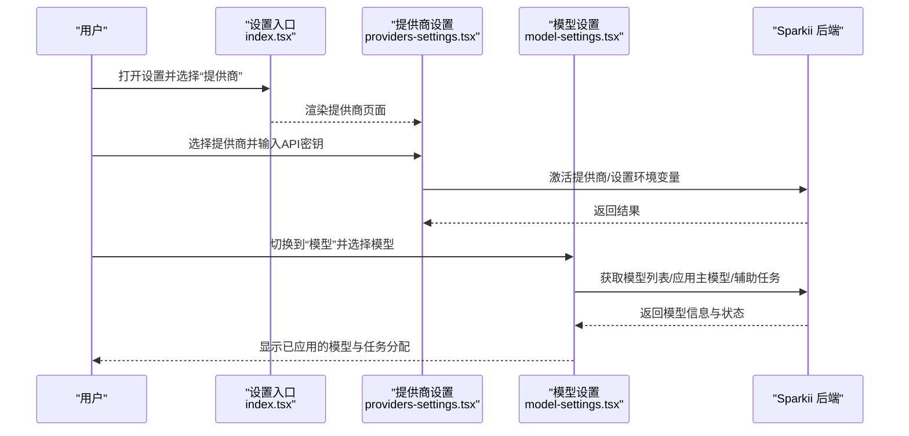
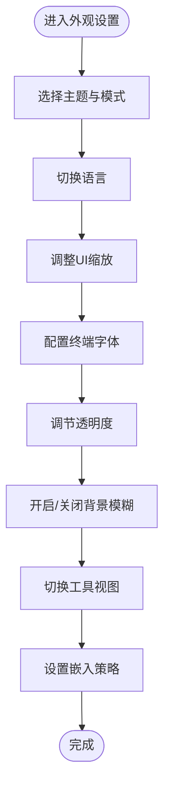
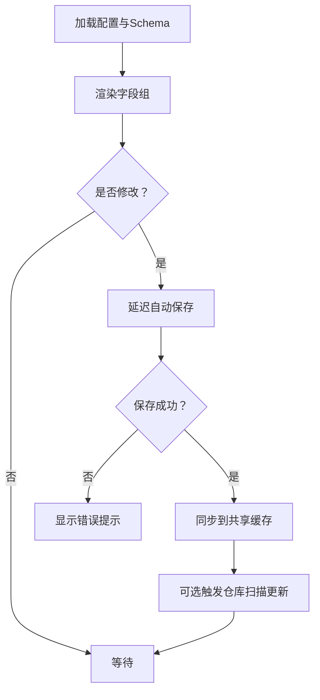
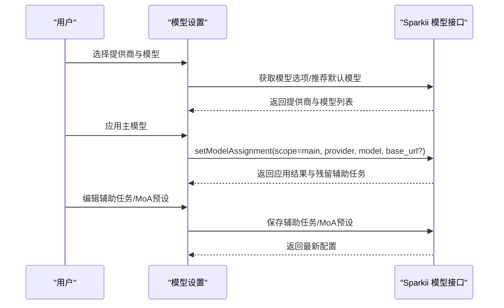
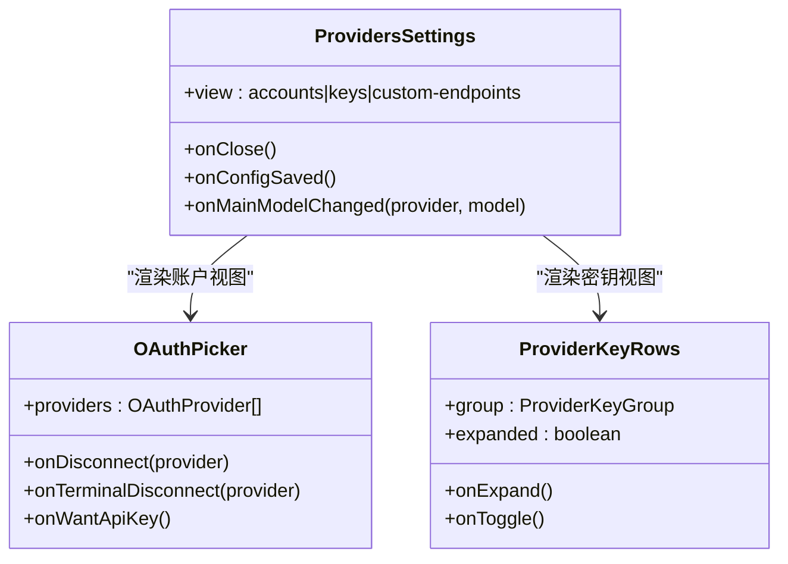
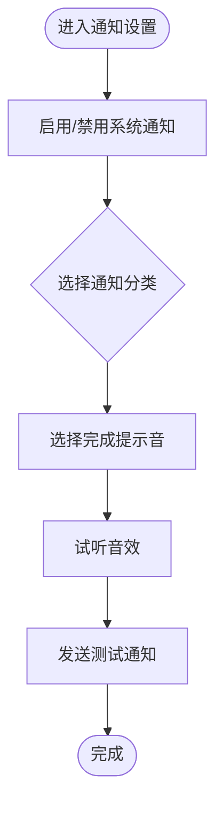
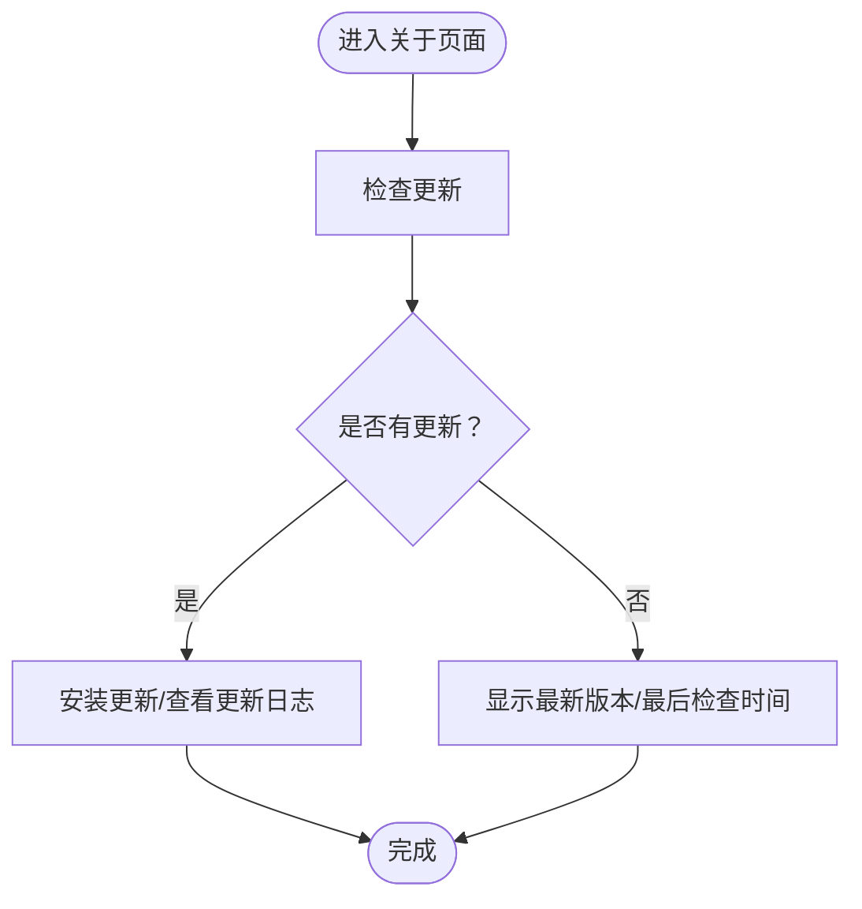
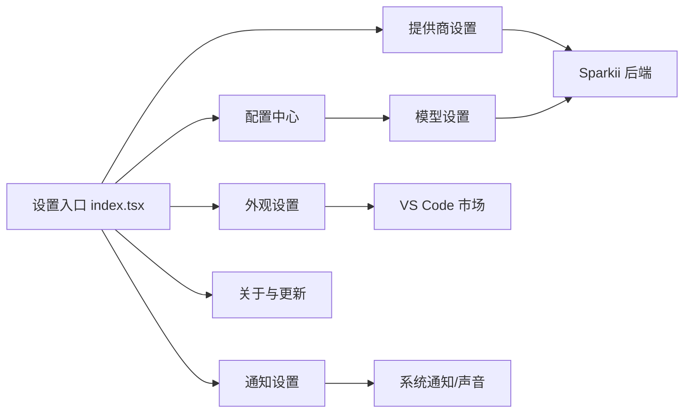

# 个性化设置

<cite>
**本文引用的文件**
- [apps/desktop/src/app/settings/index.tsx](file://apps/desktop/src/app/settings/index.tsx)
- [apps/desktop/src/app/settings/appearance-settings.tsx](file://apps/desktop/src/app/settings/appearance-settings.tsx)
- [apps/desktop/src/app/settings/config-settings.tsx](file://apps/desktop/src/app/settings/config-settings.tsx)
- [apps/desktop/src/app/settings/model-settings.tsx](file://apps/desktop/src/app/settings/model-settings.tsx)
- [apps/desktop/src/app/settings/providers-settings.tsx](file://apps/desktop/src/app/settings/providers-settings.tsx)
- [apps/desktop/src/app/settings/notifications-settings.tsx](file://apps/desktop/src/app/settings/notifications-settings.tsx)
- [apps/desktop/src/app/settings/about-settings.tsx](file://apps/desktop/src/app/settings/about-settings.tsx)
</cite>

## 目录
1. [简介](#简介)
2. [项目结构](#项目结构)
3. [核心组件](#核心组件)
4. [架构总览](#架构总览)
5. [详细组件分析](#详细组件分析)
6. [依赖关系分析](#依赖关系分析)
7. [性能考虑](#性能考虑)
8. [故障排查指南](#故障排查指南)
9. [结论](#结论)
10. [附录](#附录)

## 简介
本指南面向桌面应用用户与管理员，系统化说明“个性化设置”的组织结构与各项配置的作用与影响。内容覆盖：
- 外观与体验：主题（深色模式、颜色方案）、语言、UI缩放、终端字体、背景模糊、工具视图、嵌入策略等
- AI模型相关：提供商配置、API密钥管理、主模型与辅助任务分配、MoA预设、默认推理强度与服务等级
- 通知与声音：系统通知开关、分类控制、完成提示音选择与试听
- 备份与恢复：配置导出/导入、重置为默认值
- 企业环境：集中化配置管理的思路与建议
- 最佳实践与常见问题解决方案

## 项目结构
设置界面采用“左侧导航 + 右侧面板”的布局，通过路由参数切换不同设置页；每个设置页由独立的React组件实现，共享通用原语与状态存储。

图表来源
- [apps/desktop/src/app/settings/index.tsx:60-335](file://apps/desktop/src/app/settings/index.tsx#L60-L335)
- [apps/desktop/src/app/settings/appearance-settings.tsx:247-549](file://apps/desktop/src/app/settings/appearance-settings.tsx#L247-L549)
- [apps/desktop/src/app/settings/config-settings.tsx:58-362](file://apps/desktop/src/app/settings/config-settings.tsx#L58-L362)
- [apps/desktop/src/app/settings/model-settings.tsx:185-800](file://apps/desktop/src/app/settings/model-settings.tsx#L185-L800)
- [apps/desktop/src/app/settings/providers-settings.tsx:334-508](file://apps/desktop/src/app/settings/providers-settings.tsx#L334-L508)
- [apps/desktop/src/app/settings/notifications-settings.tsx:30-119](file://apps/desktop/src/app/settings/notifications-settings.tsx#L30-L119)
- [apps/desktop/src/app/settings/about-settings.tsx:48-183](file://apps/desktop/src/app/settings/about-settings.tsx#L48-L183)

章节来源
- [apps/desktop/src/app/settings/index.tsx:60-335](file://apps/desktop/src/app/settings/index.tsx#L60-L335)

## 核心组件
- 设置导航与路由：统一承载各设置子页面，支持导出/导入/重置配置
- 外观设置：主题、语言、缩放、终端字体、透明度、背景模糊、工具视图、嵌入策略
- 配置中心：动态渲染配置字段，自动保存草稿，支持附件大小限制等桌面级选项
- 模型设置：提供商与模型选择、API密钥激活、辅助任务分配、MoA预设、默认推理强度与服务等级
- 提供商设置：OAuth账户连接、API密钥分组管理、自定义端点
- 通知设置：系统通知开关、分类控制、完成提示音选择与预览
- 关于与更新：版本信息、检查更新、安装更新、发布说明

章节来源
- [apps/desktop/src/app/settings/index.tsx:114-142](file://apps/desktop/src/app/settings/index.tsx#L114-L142)
- [apps/desktop/src/app/settings/appearance-settings.tsx:247-549](file://apps/desktop/src/app/settings/appearance-settings.tsx#L247-L549)
- [apps/desktop/src/app/settings/config-settings.tsx:58-362](file://apps/desktop/src/app/settings/config-settings.tsx#L58-L362)
- [apps/desktop/src/app/settings/model-settings.tsx:185-800](file://apps/desktop/src/app/settings/model-settings.tsx#L185-L800)
- [apps/desktop/src/app/settings/providers-settings.tsx:334-508](file://apps/desktop/src/app/settings/providers-settings.tsx#L334-L508)
- [apps/desktop/src/app/settings/notifications-settings.tsx:30-119](file://apps/desktop/src/app/settings/notifications-settings.tsx#L30-L119)
- [apps/desktop/src/app/settings/about-settings.tsx:48-183](file://apps/desktop/src/app/settings/about-settings.tsx#L48-L183)

## 架构总览
设置界面通过路由参数驱动视图切换，各子组件从共享存储或后端接口读取/写入配置。模型与提供商相关操作通过sparkii模块提供的函数与后端交互，外观与通知类设置通过本地存储与系统能力集成。

图表来源
- [apps/desktop/src/app/settings/index.tsx:60-335](file://apps/desktop/src/app/settings/index.tsx#L60-L335)
- [apps/desktop/src/app/settings/providers-settings.tsx:334-508](file://apps/desktop/src/app/settings/providers-settings.tsx#L334-L508)
- [apps/desktop/src/app/settings/model-settings.tsx:185-800](file://apps/desktop/src/app/settings/model-settings.tsx#L185-L800)

## 详细组件分析

### 外观设置（主题、语言、缩放、终端字体、透明度、背景模糊、工具视图、嵌入策略）
- 主题与模式：支持浅色/深色模式切换，内置主题网格展示与搜索，支持从VS Code市场安装主题，按配置文件独立保存主题
- 语言：提供语言切换器，保存时显示“正在保存”状态
- UI缩放：提供预设缩放比例（如90%、100%、110%等），实时生效
- 终端字体：可配置终端字体（通过专用设置项）
- 透明度：滑块调节窗口/面板透明度百分比
- 背景模糊：开关控制背景模糊效果
- 工具视图：在“产品/技术”两种视图间切换
- 嵌入策略：对嵌入内容的行为进行控制（询问/总是/关闭），并提供重置已允许列表

图表来源
- [apps/desktop/src/app/settings/appearance-settings.tsx:247-549](file://apps/desktop/src/app/settings/appearance-settings.tsx#L247-L549)

章节来源
- [apps/desktop/src/app/settings/appearance-settings.tsx:247-549](file://apps/desktop/src/app/settings/appearance-settings.tsx#L247-L549)

### 配置中心（动态字段、自动保存、附件大小限制）
- 动态字段渲染：根据后端返回的配置schema动态生成表单字段，支持嵌套与枚举
- 自动保存：编辑草稿延迟自动保存，失败时提示错误；保存成功后同步到共享缓存
- 设备级偏好：保持屏幕常亮、全局快捷入口等桌面专属选项
- 附件大小限制：针对聊天附件/预览路径的数据URL读取上限，支持输入框调整与范围约束

图表来源
- [apps/desktop/src/app/settings/config-settings.tsx:58-362](file://apps/desktop/src/app/settings/config-settings.tsx#L58-L362)

章节来源
- [apps/desktop/src/app/settings/config-settings.tsx:58-362](file://apps/desktop/src/app/settings/config-settings.tsx#L58-L362)

### 模型设置（提供商、API密钥、主模型、辅助任务、MoA预设、默认推理强度与服务等级）
- 提供商与模型：列出可用提供商与模型，支持未配置提供商的API密钥激活或OAuth登录引导
- 主模型应用：选择提供商与模型后应用为主模型，必要时携带base_url
- 辅助任务分配：为视觉、压缩、技能中心等任务分别指定提供商与模型，支持一键重置为当前主模型
- MoA预设：参考模型与聚合模型的槽位必须完整才可保存；支持内联编辑并延迟持久化
- 默认推理强度与服务等级：基于当前主模型能力展示推理强度选项；服务等级用于快/优先通道控制

图表来源
- [apps/desktop/src/app/settings/model-settings.tsx:185-800](file://apps/desktop/src/app/settings/model-settings.tsx#L185-L800)

章节来源
- [apps/desktop/src/app/settings/model-settings.tsx:185-800](file://apps/desktop/src/app/settings/model-settings.tsx#L185-L800)

### 提供商设置（OAuth账户、API密钥、自定义端点）
- OAuth账户：展示已连接账户与未连接提供商，支持断开连接（API或终端命令）
- API密钥：按提供商分组展示环境变量键，支持搜索与展开高级覆盖项
- 自定义端点：提供OpenAI兼容端点的快速入口，便于接入本地或第三方推理服务

图表来源
- [apps/desktop/src/app/settings/providers-settings.tsx:334-508](file://apps/desktop/src/app/settings/providers-settings.tsx#L334-L508)

章节来源
- [apps/desktop/src/app/settings/providers-settings.tsx:334-508](file://apps/desktop/src/app/settings/providers-settings.tsx#L334-L508)

### 通知设置（系统通知、分类控制、完成提示音）
- 系统通知：总开关与各分类开关（如完成、错误等）
- 完成提示音：下拉选择不同音效变体，支持即时试听
- 测试通知：发送一条测试通知以验证系统能力

图表来源
- [apps/desktop/src/app/settings/notifications-settings.tsx:30-119](file://apps/desktop/src/app/settings/notifications-settings.tsx#L30-L119)

章节来源
- [apps/desktop/src/app/settings/notifications-settings.tsx:30-119](file://apps/desktop/src/app/settings/notifications-settings.tsx#L30-L119)

### 关于与更新（版本、检查更新、安装更新、发布说明）
- 版本信息：显示当前应用版本，并在自更新后刷新显示
- 更新检查：检查是否有新版本，显示上次检查时间
- 安装更新：提供立即安装与查看更新日志入口
- 自动更新：显示分支与提交信息

图表来源
- [apps/desktop/src/app/settings/about-settings.tsx:48-183](file://apps/desktop/src/app/settings/about-settings.tsx#L48-L183)

章节来源
- [apps/desktop/src/app/settings/about-settings.tsx:48-183](file://apps/desktop/src/app/settings/about-settings.tsx#L48-L183)

## 依赖关系分析
- 路由与导航：设置入口统一管理视图切换与子视图参数（提供商视图、密钥视图）
- 数据源：
  - 配置与模型：通过sparkii模块调用后端接口（获取schema、模型选项、保存配置、应用模型等）
  - 外观与通知：通过本地存储与系统能力（通知、声音、窗口透明度等）
- 外部集成：
  - VS Code市场主题安装
  - OAuth提供商登录与断开
  - 终端命令执行（部分提供商断开流程）

图表来源
- [apps/desktop/src/app/settings/index.tsx:60-335](file://apps/desktop/src/app/settings/index.tsx#L60-L335)
- [apps/desktop/src/app/settings/appearance-settings.tsx:247-549](file://apps/desktop/src/app/settings/appearance-settings.tsx#L247-L549)
- [apps/desktop/src/app/settings/config-settings.tsx:58-362](file://apps/desktop/src/app/settings/config-settings.tsx#L58-L362)
- [apps/desktop/src/app/settings/model-settings.tsx:185-800](file://apps/desktop/src/app/settings/model-settings.tsx#L185-L800)
- [apps/desktop/src/app/settings/providers-settings.tsx:334-508](file://apps/desktop/src/app/settings/providers-settings.tsx#L334-L508)
- [apps/desktop/src/app/settings/notifications-settings.tsx:30-119](file://apps/desktop/src/app/settings/notifications-settings.tsx#L30-L119)
- [apps/desktop/src/app/settings/about-settings.tsx:48-183](file://apps/desktop/src/app/settings/about-settings.tsx#L48-L183)

章节来源
- [apps/desktop/src/app/settings/index.tsx:60-335](file://apps/desktop/src/app/settings/index.tsx#L60-L335)

## 性能考虑
- 自动保存节流：配置编辑采用延迟自动保存，避免频繁写盘与网络请求
- 骨架屏占位：模型设置等耗时加载场景使用骨架屏维持页面形态，提升感知性能
- 条件渲染：语音/STT等子字段仅在启用时渲染，减少DOM复杂度
- 缓存策略：配置schema与模型选项具备合理过期时间，降低重复请求
- 内存与并发：批量并行获取模型信息、选项、辅助任务与MoA配置，但注意profile切换时的竞态保护，避免跨profile污染状态

[本节为通用性能建议，不直接分析具体文件]

## 故障排查指南
- 配置加载失败：若配置或schema加载失败，提供“刷新”按钮重试
- 自动保存失败：保存失败时弹出错误提示，确保草稿不被覆盖
- 提供商未就绪：未配置的提供商无模型列表，需先激活（API密钥或OAuth）
- 辅助任务残留：切换主模型后可能出现残留的辅助任务分配，提供一键重置为当前主模型
- 通知不可用：发送测试通知，若不支持则给出提示；确认系统通知权限与分类开关
- 更新不可达：检查网络与更新服务器可达性，查看“最后检查时间”与错误消息

章节来源
- [apps/desktop/src/app/settings/config-settings.tsx:257-294](file://apps/desktop/src/app/settings/config-settings.tsx#L257-L294)
- [apps/desktop/src/app/settings/model-settings.tsx:185-800](file://apps/desktop/src/app/settings/model-settings.tsx#L185-L800)
- [apps/desktop/src/app/settings/notifications-settings.tsx:30-119](file://apps/desktop/src/app/settings/notifications-settings.tsx#L30-L119)
- [apps/desktop/src/app/settings/about-settings.tsx:48-183](file://apps/desktop/src/app/settings/about-settings.tsx#L48-L183)

## 结论
本指南梳理了桌面应用个性化设置的整体架构与关键配置项，帮助用户与企业管理员高效完成外观、语言、通知、AI模型与提供商配置、备份恢复等操作。遵循最佳实践（如按需启用功能、合理设置附件大小限制、及时更新模型与提供商）可获得更稳定与高效的体验。

[本节为总结性内容，不直接分析具体文件]

## 附录
- 备份与恢复
  - 导出配置：在设置入口点击导出，生成JSON文件
  - 导入配置：点击导入，选择JSON文件并应用
  - 重置为默认：确认后恢复默认配置
- 企业环境集中配置建议
  - 通过CI/CD或配置管理平台分发sparkii-config.json
  - 结合环境变量与提供商密钥管理系统（如Bitwarden/OnePassword）集中管理敏感信息
  - 使用自定义端点统一接入企业内部推理服务
  - 通过提供商设置中的“本地/自定义端点”快速对接vLLM/Ollama等

章节来源
- [apps/desktop/src/app/settings/index.tsx:114-142](file://apps/desktop/src/app/settings/index.tsx#L114-L142)
- [apps/desktop/src/app/settings/providers-settings.tsx:304-332](file://apps/desktop/src/app/settings/providers-settings.tsx#L304-L332)