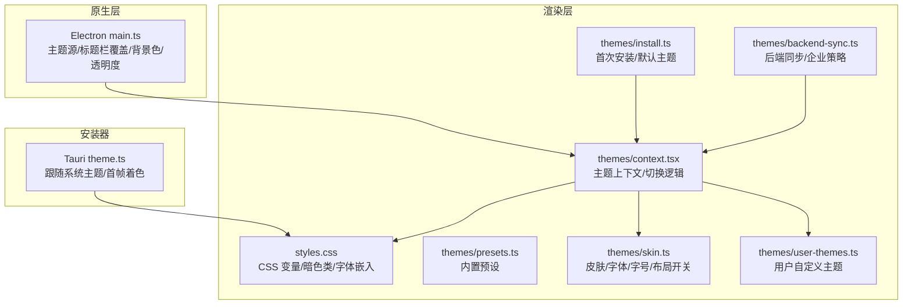
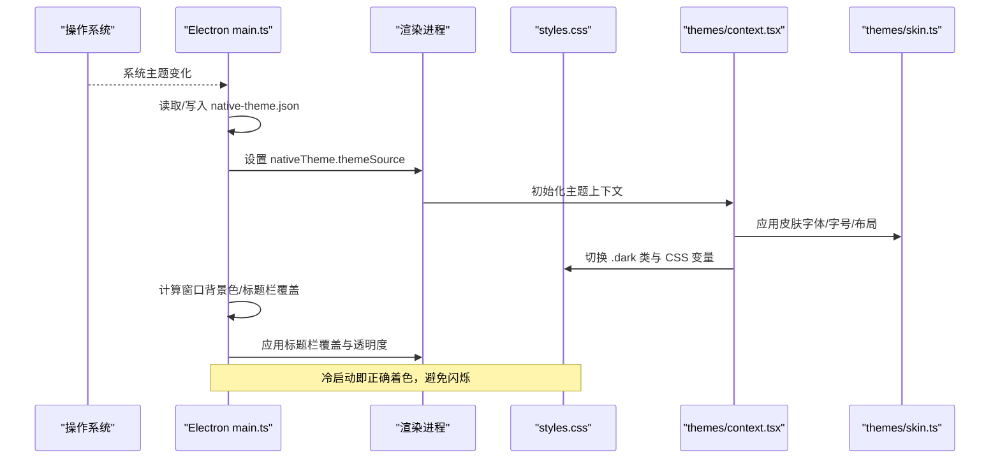
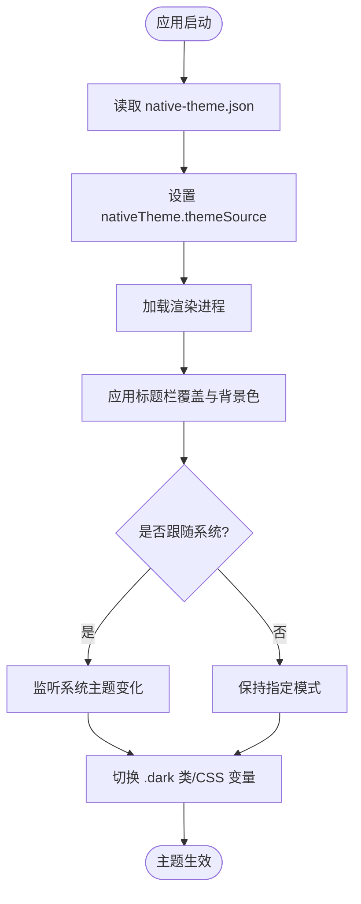
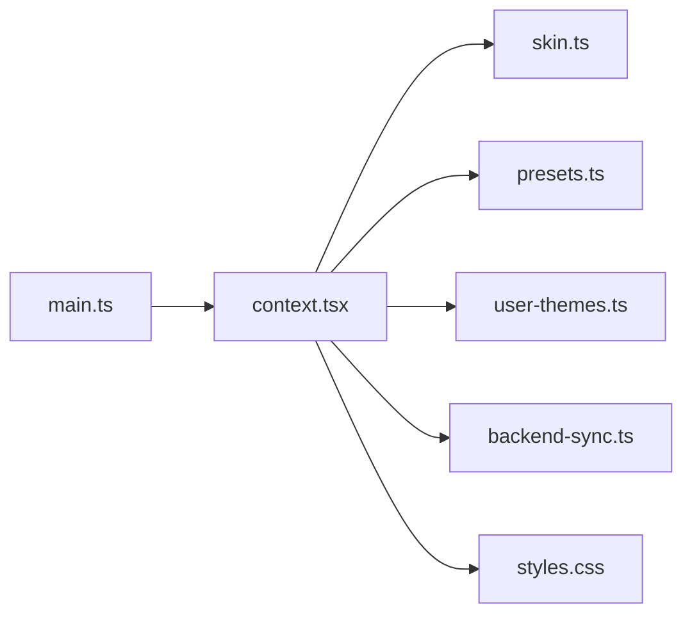

# 外观设置

<cite>
**本文引用的文件**
- [apps/desktop/electron/main.ts](file://apps/desktop/electron/main.ts)
- [apps/bootstrap-installer/src/theme.ts](file://apps/bootstrap-installer/src/theme.ts)
- [apps/desktop/src/styles.css](file://apps/desktop/src/styles.css)
- [apps/desktop/src/themes/index.ts](file://apps/desktop/src/themes/index.ts)
- [apps/desktop/src/themes/context.tsx](file://apps/desktop/src/themes/context.tsx)
- [apps/desktop/src/themes/presets.ts](file://apps/desktop/src/themes/presets.ts)
- [apps/desktop/src/themes/skin.ts](file://apps/desktop/src/themes/skin.ts)
- [apps/desktop/src/themes/user-themes.ts](file://apps/desktop/src/themes/user-themes.ts)
- [apps/desktop/src/themes/install.ts](file://apps/desktop/src/themes/install.ts)
- [apps/desktop/src/themes/backend-sync.ts](file://apps/desktop/src/themes/backend-sync.ts)
</cite>

## 目录
1. [简介](#简介)
2. [项目结构](#项目结构)
3. [核心组件](#核心组件)
4. [架构总览](#架构总览)
5. [详细组件分析](#详细组件分析)
6. [依赖关系分析](#依赖关系分析)
7. [性能考虑](#性能考虑)
8. [故障排查指南](#故障排查指南)
9. [结论](#结论)
10. [附录](#附录)

## 简介
本文件面向桌面应用的外观与主题配置，覆盖深色/浅色/自动切换、字体大小与默认字体、代码字体、颜色方案自定义、界面布局调整、图标样式等视觉相关能力；并给出不同操作系统下的适配要点与企业环境统一主题部署建议，以及常见问题解决方案与最佳实践。

## 项目结构
外观系统由三层构成：
- 原生层（Electron/Tauri）：负责窗口级主题源、标题栏覆盖、背景色、透明度等，确保冷启动不闪白、跨平台一致。
- 渲染层（CSS/JS）：通过 CSS 变量与类名切换实现主题切换，提供预设与用户自定义主题能力。
- 数据与同步层：持久化用户偏好，支持后端同步与企业策略下发。

**图表来源**
- [apps/desktop/electron/main.ts:700-853](file://apps/desktop/electron/main.ts#L700-L853)
- [apps/bootstrap-installer/src/theme.ts:1-52](file://apps/bootstrap-installer/src/theme.ts#L1-L52)
- [apps/desktop/src/styles.css:1-200](file://apps/desktop/src/styles.css#L1-L200)
- [apps/desktop/src/themes/context.tsx](file://apps/desktop/src/themes/context.tsx)
- [apps/desktop/src/themes/presets.ts](file://apps/desktop/src/themes/presets.ts)
- [apps/desktop/src/themes/skin.ts](file://apps/desktop/src/themes/skin.ts)
- [apps/desktop/src/themes/user-themes.ts](file://apps/desktop/src/themes/user-themes.ts)
- [apps/desktop/src/themes/install.ts](file://apps/desktop/src/themes/install.ts)
- [apps/desktop/src/themes/backend-sync.ts](file://apps/desktop/src/themes/backend-sync.ts)

**章节来源**
- [apps/desktop/electron/main.ts:700-853](file://apps/desktop/electron/main.ts#L700-L853)
- [apps/bootstrap-installer/src/theme.ts:1-52](file://apps/bootstrap-installer/src/theme.ts#L1-L52)
- [apps/desktop/src/styles.css:1-200](file://apps/desktop/src/styles.css#L1-L200)

## 核心组件
- 主题源与窗口外观（Electron）
  - 读取并持久化主题源（深色/浅色/系统），在冷启动时即设置 nativeTheme.themeSource，避免 macOS 下材质闪烁。
  - 根据渲染层上报的主题信息设置标题栏覆盖颜色与符号颜色，保证标题栏与内容一致。
  - 窗口背景色在渲染加载前即设置为合适的值，防止白屏闪烁。
  - 窗口透明度（0–100）映射为不透明度，跨平台安全降级。
- 安装器主题跟随（Tauri）
  - 优先使用 Tauri 窗口主题 API，回退到 prefers-color-scheme，首帧即正确着色。
- 渲染层主题系统
  - styles.css 定义全局 CSS 变量与暗色类，绑定 Tailwind 主题变量，集中管理颜色、圆角、阴影、字体族等。
  - themes/context.tsx 提供主题上下文与切换方法，驱动 UI 更新。
  - themes/presets.ts 提供内置预设主题。
  - themes/skin.ts 封装字体、字号、布局开关等“皮肤”能力。
  - themes/user-themes.ts 允许用户自定义主题并持久化。
  - themes/install.ts 处理首次安装时的默认主题选择。
  - themes/backend-sync.ts 将主题偏好与后端同步，便于企业策略下发。

**章节来源**
- [apps/desktop/electron/main.ts:700-853](file://apps/desktop/electron/main.ts#L700-L853)
- [apps/bootstrap-installer/src/theme.ts:1-52](file://apps/bootstrap-installer/src/theme.ts#L1-L52)
- [apps/desktop/src/styles.css:1-200](file://apps/desktop/src/styles.css#L1-L200)
- [apps/desktop/src/themes/context.tsx](file://apps/desktop/src/themes/context.tsx)
- [apps/desktop/src/themes/presets.ts](file://apps/desktop/src/themes/presets.ts)
- [apps/desktop/src/themes/skin.ts](file://apps/desktop/src/themes/skin.ts)
- [apps/desktop/src/themes/user-themes.ts](file://apps/desktop/src/themes/user-themes.ts)
- [apps/desktop/src/themes/install.ts](file://apps/desktop/src/themes/install.ts)
- [apps/desktop/src/themes/backend-sync.ts](file://apps/desktop/src/themes/backend-sync.ts)

## 架构总览
下图展示从用户操作到主题生效的端到端流程，涵盖 Electron 原生层与渲染层的协作。

**图表来源**
- [apps/desktop/electron/main.ts:700-853](file://apps/desktop/electron/main.ts#L700-L853)
- [apps/desktop/src/styles.css:1-200](file://apps/desktop/src/styles.css#L1-L200)
- [apps/desktop/src/themes/context.tsx](file://apps/desktop/src/themes/context.tsx)
- [apps/desktop/src/themes/skin.ts](file://apps/desktop/src/themes/skin.ts)

## 详细组件分析

### 主题模式：深色/浅色/自动切换
- 自动切换（系统跟随）
  - 安装器通过 Tauri 窗口主题 API 监听系统主题变化，首帧即着色，非 Tauri 环境回退到媒体查询。
  - Electron 主进程读取并持久化主题源，冷启动即设置 nativeTheme.themeSource，确保原生材质与标题栏立即匹配。
- 强制深色/浅色
  - 通过设置主题源为 dark/light，并在渲染层切换 .dark 类与 color-scheme，使所有基于 CSS 变量的组件即时响应。
- 标题栏与背景色
  - 根据渲染层上报的主题信息设置标题栏覆盖颜色与符号颜色；窗口背景色在渲染加载前即设置，避免白屏闪烁。

**图表来源**
- [apps/desktop/electron/main.ts:700-853](file://apps/desktop/electron/main.ts#L700-L853)
- [apps/bootstrap-installer/src/theme.ts:1-52](file://apps/bootstrap-installer/src/theme.ts#L1-L52)
- [apps/desktop/src/styles.css:1-200](file://apps/desktop/src/styles.css#L1-L200)

**章节来源**
- [apps/desktop/electron/main.ts:700-853](file://apps/desktop/electron/main.ts#L700-L853)
- [apps/bootstrap-installer/src/theme.ts:1-52](file://apps/bootstrap-installer/src/theme.ts#L1-L52)
- [apps/desktop/src/styles.css:1-200](file://apps/desktop/src/styles.css#L1-L200)

### 字体大小调节与默认字体
- 默认字体与代码字体
  - 通过 styles.css 中的 @font-face 嵌入中文字体与等宽代码字体，并提供 --font-sans 与 --font-mono 等 CSS 变量供主题与组件使用。
- 字体大小
  - 通过 skin.ts 暴露的字体缩放/字号控制项，结合 CSS 变量与 Tailwind 间距乘数，实现全局一致的字号调节。
- 多语言与显示优化
  - 针对中文等 CJK 场景提供专用字体，减少排版抖动；等宽字体采用内嵌资源，保证粗斜体度量一致。

**章节来源**
- [apps/desktop/src/styles.css:28-75](file://apps/desktop/src/styles.css#L28-L75)
- [apps/desktop/src/themes/skin.ts](file://apps/desktop/src/themes/skin.ts)

### 颜色方案自定义
- 全局颜色变量
  - styles.css 定义大量 --dt-* 与 --theme-* 变量，并通过 @theme inline 映射到 Tailwind 设计令牌，形成可组合的颜色体系。
- 预设与用户主题
  - presets.ts 提供内置主题预设；user-themes.ts 支持用户自定义主题并持久化，便于快速切换与分享。
- 亮/暗模式变量
  - 通过 :root 与 .dark 类切换变量值，实现一键换肤；阴影、边框、填充等派生颜色随主题联动。

**章节来源**
- [apps/desktop/src/styles.css:76-200](file://apps/desktop/src/styles.css#L76-L200)
- [apps/desktop/src/themes/presets.ts](file://apps/desktop/src/themes/presets.ts)
- [apps/desktop/src/themes/user-themes.ts](file://apps/desktop/src/themes/user-themes.ts)

### 界面布局调整
- 紧凑视图与滚动策略
  - styles.css 提供 compact 变体，用于在小视口时将侧边栏区域合并为单一滚动容器，提升空间利用率。
- 圆角与阴影
  - 通过 radius-* 与 shadow-* 变量统一控件外观，支持在不同主题下保持一致的层级与质感。
- 透明度与毛玻璃
  - Electron 层提供窗口透明度控制，配合标题栏覆盖与背景色，实现更沉浸的视觉效果。

**章节来源**
- [apps/desktop/src/styles.css:24-27](file://apps/desktop/src/styles.css#L24-L27)
- [apps/desktop/src/styles.css:105-149](file://apps/desktop/src/styles.css#L105-L149)
- [apps/desktop/electron/main.ts:738-788](file://apps/desktop/electron/main.ts#L738-L788)

### 图标样式
- 图标库集成
  - styles.css 引入 codicon 图标库，配合主题变量可在不同模式下保持良好对比度与可读性。
- 主题联动
  - 图标颜色可通过 CSS 变量或主题上下文进行统一控制，确保与文本和背景色协调。

**章节来源**
- [apps/desktop/src/styles.css:5-6](file://apps/desktop/src/styles.css#L5-L6)

### 企业环境下的统一主题部署
- 后端同步与策略下发
  - backend-sync.ts 负责将主题偏好与后端同步，企业可通过策略锁定主题源、禁用切换或强制特定主题。
- 首次安装与默认主题
  - install.ts 在首次安装时确定默认主题，企业可结合后端策略覆盖默认值。
- 持久化与一致性
  - 主题源与透明度等关键设置在 Electron 层持久化，确保重启后行为一致；渲染层通过 context.tsx 维护状态并驱动 UI。

**章节来源**
- [apps/desktop/src/themes/backend-sync.ts](file://apps/desktop/src/themes/backend-sync.ts)
- [apps/desktop/src/themes/install.ts](file://apps/desktop/src/themes/install.ts)
- [apps/desktop/src/themes/context.tsx](file://apps/desktop/src/themes/context.tsx)
- [apps/desktop/electron/main.ts:710-736](file://apps/desktop/electron/main.ts#L710-L736)

## 依赖关系分析
- 模块耦合
  - Electron main.ts 与渲染层通过事件与配置解耦：主进程负责原生外观，渲染层负责 UI 主题。
  - 主题上下文（context.tsx）作为中枢，聚合皮肤（skin.ts）、预设（presets.ts）、用户主题（user-themes.ts）与后端同步（backend-sync.ts）。
- 外部依赖
  - Tailwind 与 codicon 图标库提供基础样式与图标；CSS 变量体系贯穿全栈。
- 潜在循环依赖
  - 通过上下文与事件机制避免直接循环引用；主题变更以单向数据流驱动。

**图表来源**
- [apps/desktop/electron/main.ts:700-853](file://apps/desktop/electron/main.ts#L700-L853)
- [apps/desktop/src/themes/context.tsx](file://apps/desktop/src/themes/context.tsx)
- [apps/desktop/src/themes/skin.ts](file://apps/desktop/src/themes/skin.ts)
- [apps/desktop/src/themes/presets.ts](file://apps/desktop/src/themes/presets.ts)
- [apps/desktop/src/themes/user-themes.ts](file://apps/desktop/src/themes/user-themes.ts)
- [apps/desktop/src/themes/backend-sync.ts](file://apps/desktop/src/themes/backend-sync.ts)
- [apps/desktop/src/styles.css:1-200](file://apps/desktop/src/styles.css#L1-L200)

**章节来源**
- [apps/desktop/electron/main.ts:700-853](file://apps/desktop/electron/main.ts#L700-L853)
- [apps/desktop/src/themes/context.tsx](file://apps/desktop/src/themes/context.tsx)

## 性能考虑
- 首帧着色
  - 安装器与 Electron 主进程均在渲染加载前完成主题决策，避免首帧闪烁。
- 变量驱动
  - 通过 CSS 变量与 Tailwind 令牌批量更新，减少重排与重绘。
- 平台差异
  - Linux 上 setOpacity 为无操作，代码已做兼容；WSLg 环境下标题栏覆盖策略特殊处理，避免空白区域。

[本节为通用指导，无需具体文件引用]

## 故障排查指南
- 启动时出现白屏/闪白
  - 检查 Electron 主进程是否正确读取并设置 nativeTheme.themeSource，以及窗口背景色是否在渲染加载前设置。
  - 参考路径：[apps/desktop/electron/main.ts:710-803](file://apps/desktop/electron/main.ts#L710-L803)
- 标题栏颜色不一致
  - 确认渲染层上报的主题信息是否被正确解析，标题栏覆盖选项是否按平台分支设置。
  - 参考路径：[apps/desktop/electron/main.ts:809-853](file://apps/desktop/electron/main.ts#L809-L853)
- 主题切换无效
  - 检查 .dark 类与 color-scheme 是否切换成功，CSS 变量是否按预期更新。
  - 参考路径：[apps/desktop/src/styles.css:6-7](file://apps/desktop/src/styles.css#L6-L7), [apps/desktop/src/styles.css:151-200](file://apps/desktop/src/styles.css#L151-L200)
- 透明度滑块不生效
  - 确认 write/read 持久化逻辑与 applyWindowTranslucency 调用是否正常，Linux 平台会静默忽略。
  - 参考路径：[apps/desktop/electron/main.ts:738-788](file://apps/desktop/electron/main.ts#L738-L788)
- 企业策略未生效
  - 检查后端同步模块是否启用，策略下发是否覆盖本地设置。
  - 参考路径：[apps/desktop/src/themes/backend-sync.ts](file://apps/desktop/src/themes/backend-sync.ts)

**章节来源**
- [apps/desktop/electron/main.ts:710-853](file://apps/desktop/electron/main.ts#L710-L853)
- [apps/desktop/src/styles.css:6-7](file://apps/desktop/src/styles.css#L6-L7)
- [apps/desktop/src/styles.css:151-200](file://apps/desktop/src/styles.css#L151-L200)
- [apps/desktop/src/themes/backend-sync.ts](file://apps/desktop/src/themes/backend-sync.ts)

## 结论
本外观系统通过原生层与渲染层的协同，实现了跨平台的主题一致性、首帧正确着色与灵活的自定义能力。借助 CSS 变量与 Tailwind 令牌，颜色、字体、布局与图标均可统一管理；通过后端同步与企业策略，满足规模化部署需求。建议在开发中优先使用主题上下文与皮肤接口，避免硬编码样式，以提升可维护性与扩展性。

[本节为总结性内容，无需具体文件引用]

## 附录
- 常用配置项速查
  - 主题源：dark / light / system（Electron 主进程持久化）
  - 透明度：0–100（映射为窗口不透明度）
  - 字体：默认字体与代码字体通过 CSS 变量与内嵌字体提供
  - 布局：compact 变体与圆角/阴影变量
  - 企业策略：通过后端同步模块统一下发
- 最佳实践
  - 使用主题上下文切换主题，避免直接操作 DOM 类名。
  - 新增颜色或尺寸时，优先扩展 CSS 变量与 Tailwind 令牌。
  - 对平台差异进行安全降级，确保功能可用。
  - 在企业环境中，结合后端策略锁定主题与字体，保障一致性。

[本节为补充说明，无需具体文件引用]