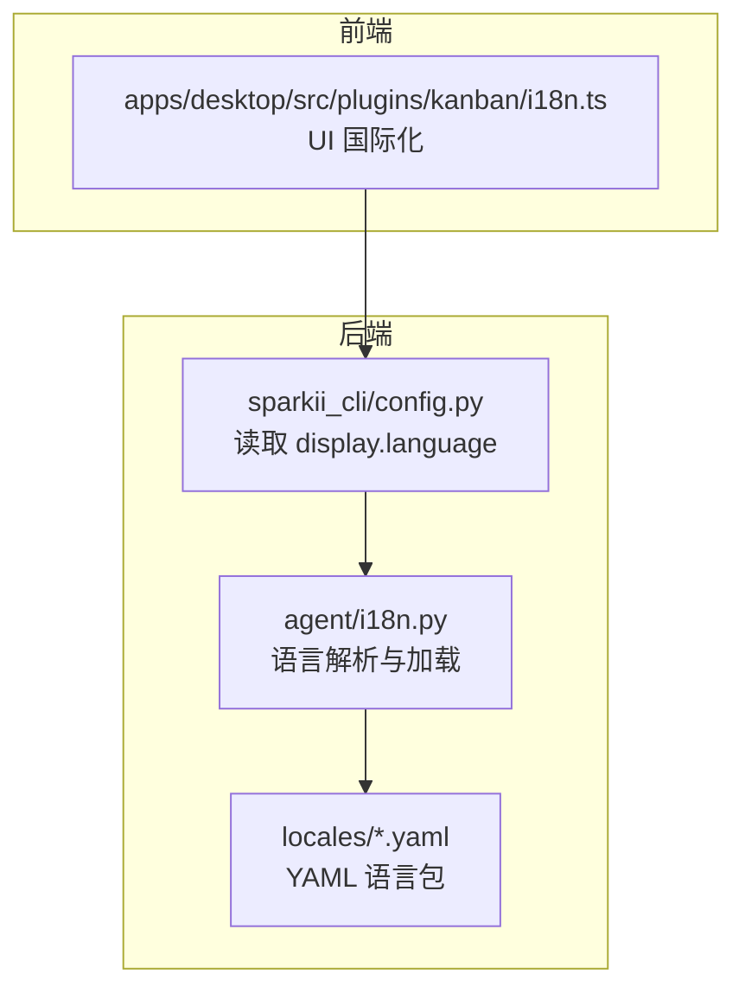
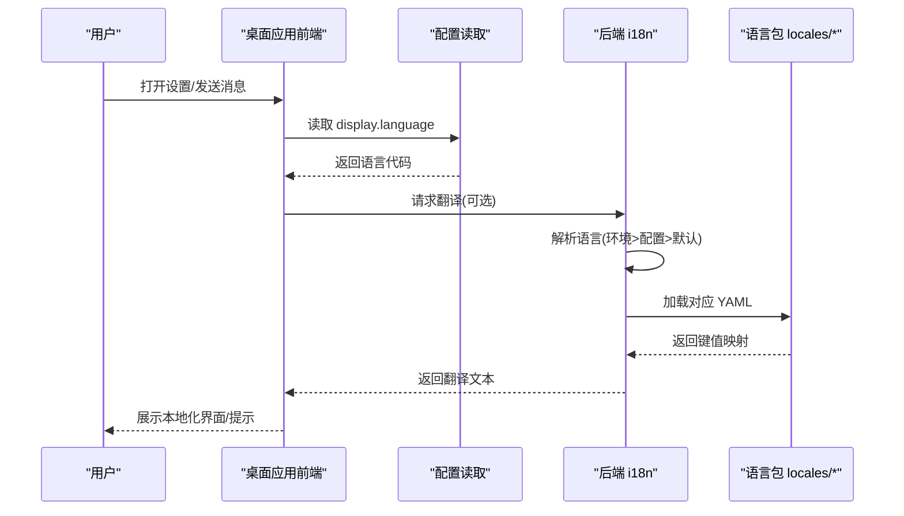
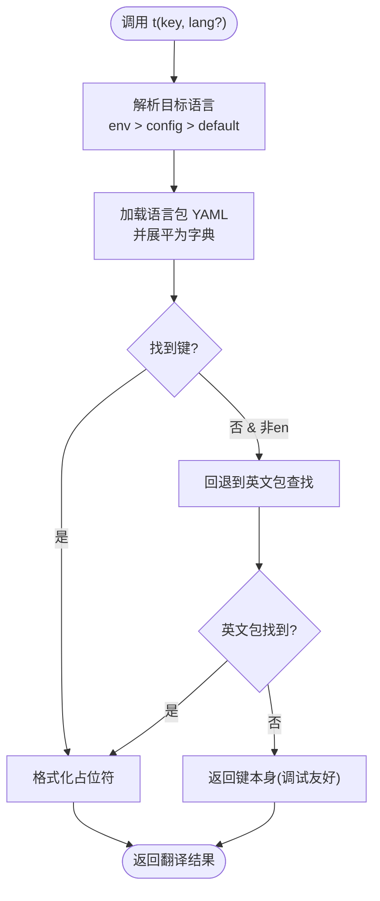

# 语言设置

<cite>
**本文引用的文件**
- [agent/i18n.py](file://agent/i18n.py)
- [locales/en.yaml](file://locales/en.yaml)
- [locales/zh.yaml](file://locales/zh.yaml)
- [sparkii_cli/config.py](file://sparkii_cli/config.py)
- [apps/desktop/src/plugins/kanban/i18n.ts](file://apps/desktop/src/plugins/kanban/i18n.ts)
</cite>

## 目录
1. [简介](#简介)
2. [项目结构](#项目结构)
3. [核心组件](#核心组件)
4. [架构总览](#架构总览)
5. [详细组件分析](#详细组件分析)
6. [依赖关系分析](#依赖关系分析)
7. [性能考虑](#性能考虑)
8. [故障排除指南](#故障排除指南)
9. [结论](#结论)
10. [附录](#附录)

## 简介
本指南面向桌面应用用户与开发者，系统说明 Sparkii 桌面端的“界面语言”和“AI对话语言”的设置方法、语言包管理机制、翻译文件格式与扩展方式，以及区域设置对日期、时间、数字格式的影响。文档同时提供常见问题排查步骤，帮助快速定位并解决语言切换问题。

## 项目结构
本项目采用“后端静态消息多语言 + 前端国际化能力”的混合方案：
- 后端（Python）通过 YAML 语言包提供 CLI/Gateway 等用户可见的静态消息本地化，支持运行时语言解析与缓存。
- 前端（TypeScript/React）在桌面应用中提供 i18n 上下文与 Hook，用于渲染界面文案。
- 配置中心统一读取 display.language 等显示相关设置，驱动语言选择。

图表来源
- [agent/i18n.py:91-118](file://agent/i18n.py#L91-L118)
- [agent/i18n.py:190-229](file://agent/i18n.py#L190-L229)
- [sparkii_cli/config.py:1-200](file://sparkii_cli/config.py#L1-L200)
- [apps/desktop/src/plugins/kanban/i18n.ts:1-200](file://apps/desktop/src/plugins/kanban/i18n.ts#L1-L200)

章节来源
- [agent/i18n.py:1-30](file://agent/i18n.py#L1-L30)
- [sparkii_cli/config.py:1-200](file://sparkii_cli/config.py#L1-L200)

## 核心组件
- 语言解析与加载器：负责从环境变量、配置文件或默认值中确定当前语言，加载对应 YAML 语言包，并提供字符串替换与回退机制。
- 语言包仓库：以 YAML 文件组织键值对，支持嵌套结构与占位符，便于维护与审阅。
- 配置读取：集中管理 display.language 等显示相关设置，供后端与前端共同使用。
- 前端国际化：为桌面端 UI 提供翻译 Hook/Provider，使界面文案随语言切换而更新。

章节来源
- [agent/i18n.py:121-143](file://agent/i18n.py#L121-L143)
- [agent/i18n.py:145-177](file://agent/i18n.py#L145-L177)
- [agent/i18n.py:190-229](file://agent/i18n.py#L190-L229)
- [apps/desktop/src/plugins/kanban/i18n.ts:1-200](file://apps/desktop/src/plugins/kanban/i18n.ts#L1-L200)

## 架构总览
下图展示了语言选择的优先级与数据流：环境变量优先于配置文件，最终落到具体语言包；前端通过配置与 i18n 上下文同步界面语言。

图表来源
- [agent/i18n.py:221-229](file://agent/i18n.py#L221-L229)
- [agent/i18n.py:145-177](file://agent/i18n.py#L145-L177)
- [sparkii_cli/config.py:1-200](file://sparkii_cli/config.py#L1-L200)

## 详细组件分析

### 后端 i18n 模块（agent/i18n.py）
- 语言优先级：显式参数 > 环境变量 SPARKII_LANGUAGE > 配置文件 display.language > 默认 en。
- 别名与规范化：支持常见别名（如 chinese -> zh、traditional-chinese -> zh-hant），未知值回退到 en。
- 语言包路径：优先使用打包目录（SPARKII_BUNDLED_LOCALES），否则回退到源码 locales 目录。
- 加载与缓存：按语言加载 YAML 并展平为点号键，进程内缓存；提供重置接口以便热更新。
- 翻译函数：t(key, lang?, **kwargs) 支持占位符格式化，缺失键时回退到 en，再缺失则返回键本身。

图表来源
- [agent/i18n.py:121-143](file://agent/i18n.py#L121-L143)
- [agent/i18n.py:145-177](file://agent/i18n.py#L145-L177)
- [agent/i18n.py:221-273](file://agent/i18n.py#L221-L273)

章节来源
- [agent/i18n.py:1-30](file://agent/i18n.py#L1-L30)
- [agent/i18n.py:91-118](file://agent/i18n.py#L91-L118)
- [agent/i18n.py:190-229](file://agent/i18n.py#L190-L229)
- [agent/i18n.py:232-273](file://agent/i18n.py#L232-L273)

### 语言包结构与格式（locales/*.yaml）
- 组织方式：以语言代码命名（如 en.yaml、zh.yaml），键为点号分隔的路径（如 gateway.model.switched）。
- 嵌套可读性：YAML 允许层级嵌套以提升可读性，内部会被展平为扁平键空间。
- 占位符：支持 {placeholder} 形式的 str.format 替换，便于动态内容注入。
- 一致性要求：新增键需同步至所有语言包，测试会校验键的一致性。

章节来源
- [locales/en.yaml:1-11](file://locales/en.yaml#L1-L11)
- [locales/zh.yaml:1-3](file://locales/zh.yaml#L1-L3)

### 前端国际化（apps/desktop/src/plugins/kanban/i18n.ts）
- 作用：为桌面端插件提供翻译能力，通常通过 Provider/Hook 暴露当前语言与翻译函数。
- 集成点：与配置层联动，确保界面文案随语言设置变化而刷新。

章节来源
- [apps/desktop/src/plugins/kanban/i18n.ts:1-200](file://apps/desktop/src/plugins/kanban/i18n.ts#L1-L200)

### 配置与语言设置（sparkii_cli/config.py）
- 配置位置：~/.sparkii/config.yaml 等，包含 display.language 等显示相关选项。
- 安全与健壮性：对配置解析失败进行备份与告警，避免静默丢失用户覆盖。
- 与 i18n 的关系：i18n 模块通过配置读取 display.language，作为语言选择的重要来源。

章节来源
- [sparkii_cli/config.py:1-200](file://sparkii_cli/config.py#L1-L200)

## 依赖关系分析
- agent/i18n.py 依赖 sparkii_cli.config 读取 display.language，并依赖 locales/*.yaml 提供翻译资源。
- 前端 i18n 模块依赖配置层获取语言设置，并在 UI 层消费翻译结果。
- 整体耦合度低：i18n 模块仅关注语言解析与翻译，配置模块专注设置读写，职责清晰。

图表来源
- [agent/i18n.py:190-229](file://agent/i18n.py#L190-L229)
- [sparkii_cli/config.py:1-200](file://sparkii_cli/config.py#L1-L200)
- [apps/desktop/src/plugins/kanban/i18n.ts:1-200](file://apps/desktop/src/plugins/kanban/i18n.ts#L1-L200)

章节来源
- [agent/i18n.py:190-229](file://agent/i18n.py#L190-L229)
- [sparkii_cli/config.py:1-200](file://sparkii_cli/config.py#L1-L200)

## 性能考虑
- 语言包缓存：每个语言的 YAML 被展平后缓存于进程内存，避免重复 IO 与解析开销。
- 配置缓存：display.language 每进程只读一次，减少频繁读取配置的代价。
- 回退策略：缺失键时快速回退到英文或键本身，避免异常分支影响主流程。
- 建议：
  - 保持语言包精简与键一致，减少回退与日志噪音。
  - 在高频路径（如审批提示、网关回复）避免额外计算，充分利用缓存。

[本节为通用性能指导，不直接分析具体文件]

## 故障排除指南
- 语言未生效
  - 检查环境变量 SPARKII_LANGUAGE 是否覆盖了预期值。
  - 确认配置文件中的 display.language 是否正确且可解析。
  - 查看 i18n 日志中是否有“catalog missing”或“format failed”的警告。
- 翻译缺失或显示键名
  - 确认目标语言包中存在对应键；若缺失将回退到英文，仍缺失则显示键名。
  - 新增键时需同步至所有语言包，并通过测试保证一致性。
- 配置解析失败
  - 若 config.yaml 解析错误，系统会生成 .bak 备份并告警；修复 YAML 后重启或重新加载配置。
- 前端语言不同步
  - 确认前端 i18n Provider/Hook 已正确订阅配置变更并触发重渲染。
  - 检查插件 i18n 模块是否正确读取 display.language。

章节来源
- [agent/i18n.py:145-177](file://agent/i18n.py#L145-L177)
- [agent/i18n.py:232-273](file://agent/i18n.py#L232-L273)
- [sparkii_cli/config.py:45-156](file://sparkii_cli/config.py#L45-L156)

## 结论
Sparkii 桌面应用通过“后端 YAML 语言包 + 前端 i18n 上下文 + 配置中心”的协作，实现了稳定、可扩展的多语言支持。用户可通过环境变量或配置文件切换界面与 AI 对话语言；开发者可基于现有模式扩展自定义语言包与翻译键。遵循键一致性与占位符规范，可显著提升本地化质量与维护效率。

[本节为总结性内容，不直接分析具体文件]

## 附录

### 如何切换界面语言与 AI 对话语言
- 界面语言（前端）
  - 修改 ~/.sparkii/config.yaml 中的 display.language 为期望的语言代码（如 zh、en、zh-hant 等）。
  - 重启桌面应用或触发配置重载，使前端 i18n 上下文刷新。
- AI 对话语言（后端静态消息）
  - 同样通过 display.language 控制；也可临时通过环境变量 SPARKII_LANGUAGE 覆盖。
  - 对于运行中的进程，可在配置变更后调用 i18n 的重置接口以热更新语言缓存。

章节来源
- [agent/i18n.py:221-229](file://agent/i18n.py#L221-L229)
- [agent/i18n.py:210-218](file://agent/i18n.py#L210-L218)
- [sparkii_cli/config.py:1-200](file://sparkii_cli/config.py#L1-L200)

### 语言包管理与扩展
- 内置语言支持：en、zh、zh-hant、ja、de、es、fr、tr、uk、af、ko、it、ga、pt、ru、hu、ar。
- 添加自定义语言包
  - 在 locales 目录下新增 <lang>.yaml，复制 en.yaml 的键结构并翻译值。
  - 如需新增键，请同步至所有语言包，确保测试通过。
- 语言别名
  - 支持常见别名（如 chinese -> zh、traditional-chinese -> zh-hant），便于用户输入容错。

章节来源
- [agent/i18n.py:43-85](file://agent/i18n.py#L43-L85)
- [locales/en.yaml:1-11](file://locales/en.yaml#L1-L11)
- [locales/zh.yaml:1-3](file://locales/zh.yaml#L1-L3)

### 翻译文件格式与最佳实践
- 键命名：使用点号分隔的路径（如 gateway.model.switched），保持语义清晰。
- 占位符：使用 {placeholder} 形式，并确保调用方传入正确的参数。
- 一致性：新增键必须同步至所有语言包，避免回退链过长。
- 可读性：YAML 可分层组织，但内部会被展平；注释可用于说明用途。

章节来源
- [agent/i18n.py:145-177](file://agent/i18n.py#L145-L177)
- [locales/en.yaml:1-11](file://locales/en.yaml#L1-L11)

### 区域设置对日期、时间、数字格式的影响
- 当前 i18n 模块聚焦于静态消息翻译，未直接实现日期、时间、数字的区域化格式化。
- 建议：
  - 在前端根据 display.language 或系统区域设置，使用本地化库格式化日期与数字。
  - 在后端如需输出本地化数值，可引入区域感知格式化逻辑，并与 i18n 模块解耦。

[本节为通用指导，不直接分析具体文件]