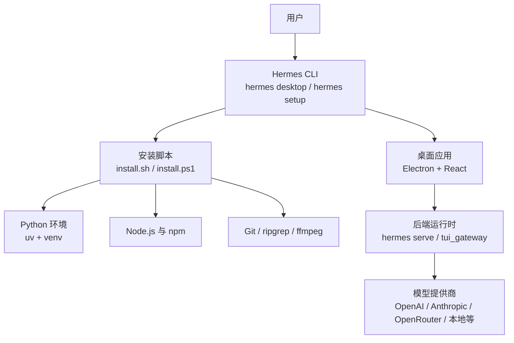
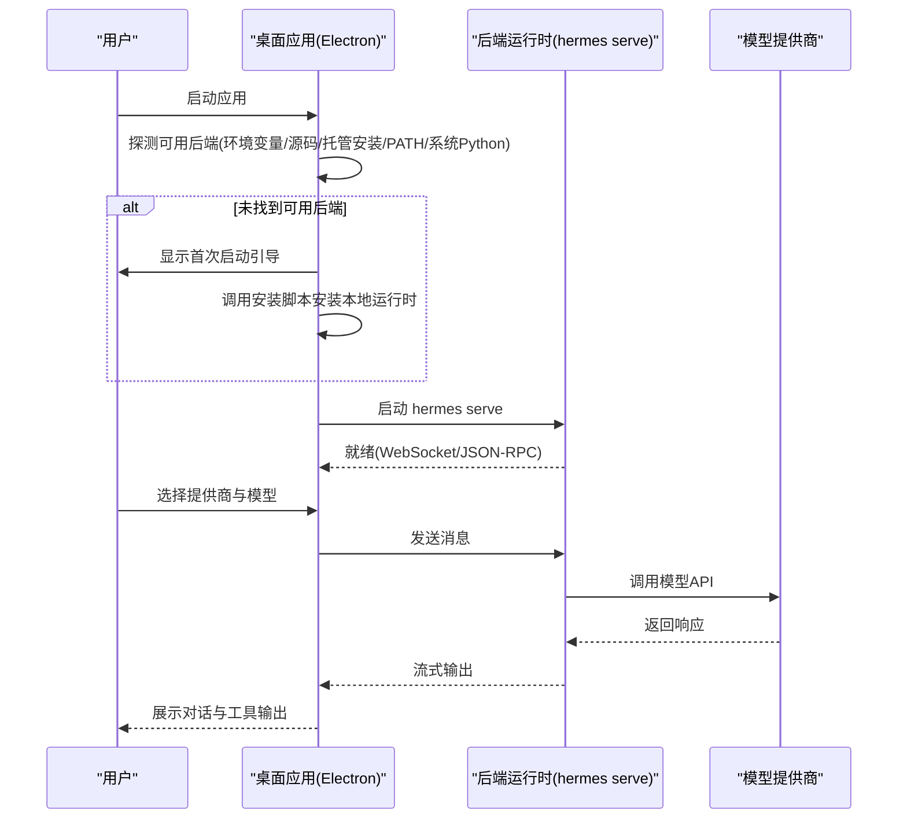
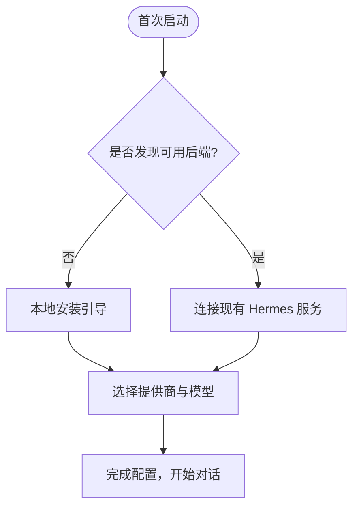
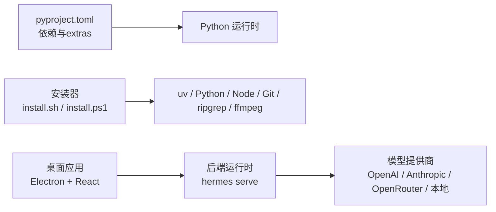

# 安装与配置

<cite>
**本文引用的文件**
- [README.md](file://README.md)
- [apps/desktop/README.md](file://apps/desktop/README.md)
- [scripts/install.sh](file://scripts/install.sh)
- [scripts/install.ps1](file://scripts/install.ps1)
- [pyproject.toml](file://pyproject.toml)
- [setup.py](file://setup.py)
- [sparkii_cli/config.py](file://sparkii_cli/config.py)
- [cli-config.yaml.example](file://cli-config.yaml.example)
</cite>

## 目录
1. [简介](#简介)
2. [项目结构](#项目结构)
3. [核心组件](#核心组件)
4. [架构总览](#架构总览)
5. [详细组件分析](#详细组件分析)
6. [依赖关系分析](#依赖关系分析)
7. [性能注意事项](#性能注意事项)
8. [故障排除指南](#故障排除指南)
9. [结论](#结论)
10. [附录](#附录)

## 简介
本指南面向首次安装和配置桌面应用（Hermes Desktop）的用户，覆盖系统要求、多种安装方式、首次启动配置流程、配置文件与环境变量、跨平台注意事项以及常见问题排查。推荐通过 Hermes CLI 一键安装并引导完成配置；也提供预构建安装包下载与手动安装路径。

## 项目结构
本项目包含 CLI、网关、TUI、桌面应用及大量插件与工具。桌面应用位于 apps/desktop，CLI 入口在 sparkii_cli，安装脚本在 scripts 下，配置示例在根目录的 cli-config.yaml.example。

图表来源
- [scripts/install.sh:1-120](file://scripts/install.sh#L1-L120)
- [scripts/install.ps1:1-120](file://scripts/install.ps1#L1-L120)
- [apps/desktop/README.md:23-117](file://apps/desktop/README.md#L23-L117)

章节来源
- [README.md:35-118](file://README.md#L35-L118)
- [apps/desktop/README.md:23-117](file://apps/desktop/README.md#L23-L117)

## 核心组件
- 安装器：跨平台脚本负责检测系统、安装 uv/Python/Node/Git/ripgrep/ffmpeg 等依赖，创建虚拟环境并准备配置。
- 桌面应用：Electron + React 前端，连接后端运行时（hermes serve/tui_gateway），支持首次运行向导、远程连接与本地安装引导。
- 配置系统：集中管理 config.yaml 与 .env，提供安全的环境变量写入限制与解析缓存。
- 模型与提供商：支持多种 LLM 提供商与自定义端点，可通过 CLI 或 GUI 选择。

章节来源
- [scripts/install.sh:1-120](file://scripts/install.sh#L1-L120)
- [scripts/install.ps1:1-120](file://scripts/install.ps1#L1-L120)
- [apps/desktop/README.md:23-117](file://apps/desktop/README.md#L23-L117)
- [sparkii_cli/config.py:1-16](file://sparkii_cli/config.py#L1-L16)
- [cli-config.yaml.example:21-65](file://cli-config.yaml.example#L21-L65)

## 架构总览
桌面应用启动时按优先级探测可用后端：环境变量指向的开发目录、当前源码检出、已完成的托管安装、PATH 中的 hermes、系统 Python 可导入运行时，最后回退到首次启动引导安装。成功后以 headless 模式运行 hermes serve，并通过 tui_gateway 暴露 JSON-RPC/WebSocket API 供渲染层使用。

图表来源
- [apps/desktop/README.md:88-117](file://apps/desktop/README.md#L88-L117)
- [scripts/install.sh:1-120](file://scripts/install.sh#L1-L120)
- [scripts/install.ps1:1-120](file://scripts/install.ps1#L1-L120)

## 详细组件分析

### 系统要求与前置依赖
- Python 3.11+（严格上限 <3.14，避免上游二进制不兼容）
- Git（用于克隆仓库与更新）
- Node.js（版本由安装器根据包声明校验，默认 22）
- ripgrep、ffmpeg（浏览器工具与媒体处理所需）
- Windows 原生安装会附带便携版 Git Bash（MinGit），无需管理员权限

章节来源
- [pyproject.toml:8-15](file://pyproject.toml#L8-L15)
- [scripts/install.sh:549-653](file://scripts/install.sh#L549-L653)
- [scripts/install.sh:655-781](file://scripts/install.sh#L655-L781)
- [scripts/install.ps1:376-391](file://scripts/install.ps1#L376-L391)
- [README.md:35-60](file://README.md#L35-L60)

### 安装方式一：通过 Hermes CLI 安装（推荐）
- Linux/macOS/WSL2/Termux：使用官方安装脚本一键安装，自动处理 uv、Python、Node、Git、ripgrep、ffmpeg 等依赖。
- Windows（PowerShell）：使用官方 PowerShell 脚本安装，内置便携 Git Bash，无需管理员权限。
- 安装完成后，执行 hermes 进入交互界面，或使用 hermes setup 一次性配置提供商、模型与工具。

章节来源
- [README.md:35-67](file://README.md#L35-L67)
- [scripts/install.sh:1-120](file://scripts/install.sh#L1-L120)
- [scripts/install.ps1:1-120](file://scripts/install.ps1#L1-L120)

### 安装方式二：预构建安装包下载
- 桌面应用提供 macOS、Windows、Linux 预构建安装包，可从官网下载。
- 安装后同样通过 hermes desktop 启动，或在首次启动时选择“连接现有 Hermes”或“本地安装引导”。

章节来源
- [apps/desktop/README.md:23-39](file://apps/desktop/README.md#L23-L39)

### 安装方式三：手动安装
- 适用于高级用户或受限环境。需自行准备 Python 3.11+、uv、Node.js、Git、ripgrep、ffmpeg，并在隔离的虚拟环境中安装依赖。
- 注意：直接 wheel/sdist 构建被阻止，推荐使用 uv sync 或 pip install -e . 进行开发式安装。

章节来源
- [setup.py:1-75](file://setup.py#L1-L75)
- [pyproject.toml:354-360](file://pyproject.toml#L354-L360)

### 首次启动配置流程
- 连接现有 Hermes 服务：若检测到已有网关，可在首次启动时选择连接，应用会测试 HTTP 与 WebSocket 连通性并保存加密连接信息。
- 本地安装引导：若无可用后端，将引导安装本地运行时，随后进入提供商与模型选择。
- 提供商与模型选择：支持 OpenAI、Anthropic、OpenRouter、Nous Portal、本地服务器（LM Studio/Ollama/vLLM/llama.cpp）等，也可自定义 OpenAI 兼容端点。

图表来源
- [apps/desktop/README.md:131-148](file://apps/desktop/README.md#L131-L148)
- [cli-config.yaml.example:21-65](file://cli-config.yaml.example#L21-L65)

章节来源
- [apps/desktop/README.md:131-148](file://apps/desktop/README.md#L131-L148)
- [cli-config.yaml.example:21-65](file://cli-config.yaml.example#L21-L65)

### 配置文件位置与结构
- 主配置文件：~/.hermes/config.yaml（或 ~/.sparkii/config.yaml，取决于安装布局），用于设置模型、终端、压缩、内存、会话策略等。
- 密钥与环境变量：~/.hermes/.env（或 ~/.sparkii/.env），存放 API Key 与平台通道配置。
- 配置加载具备缓存与并发保护，解析失败时会备份损坏文件并提示修复。

章节来源
- [sparkii_cli/config.py:1-16](file://sparkii_cli/config.py#L1-L16)
- [sparkii_cli/config.py:694-700](file://sparkii_cli/config.py#L694-L700)
- [cli-config.yaml.example:1-20](file://cli-config.yaml.example#L1-L20)

### 环境变量设置与安全限制
- 允许写入 .env 的变量包括各平台通道与提供商密钥（如 OPENAI_API_KEY、ANTHROPIC_API_KEY、DISCORD_HOME_CHANNEL 等）。
- 禁止通过配置写入器修改影响子进程执行或运行时定位的关键变量（如 PATH、PYTHONPATH、SPARKII_HOME 等），如需修改请编辑 .env 文件。
- 安装器在安装过程中会清理继承的 PYTHONPATH/PYTHONHOME，避免模块遮蔽。

章节来源
- [sparkii_cli/config.py:157-233](file://sparkii_cli/config.py#L157-L233)
- [sparkii_cli/config.py:261-327](file://sparkii_cli/config.py#L261-L327)
- [scripts/install.sh:18-33](file://scripts/install.sh#L18-L33)

### 跨平台特殊注意事项
- macOS：
  - 首次启动可能触发麦克风权限提示；如遇卡住可使用 tccutil 重置应用麦克风权限。
  - 若使用 Homebrew 管理的 Node/npm，安装器会优先使用系统或托管 Node。
- Windows：
  - 原生安装使用 PowerShell 脚本，自带 MinGit，无需管理员权限。
  - 若遇到 TLS 证书信任问题（企业代理/杀毒软件拦截 HTTPS），需设置 NODE_EXTRA_CA_CERTS 或临时关闭严格 SSL。
  - 某些杀毒软件可能误报 uv.exe，可按说明验证并添加白名单。
- Linux：
  - 安装器会根据发行版自动安装 Git 与依赖；root 安装采用 FHS 布局，代码位于 /usr/local/lib/hermes-agent，命令链接至 /usr/local/bin。
  - 容器或受限文件系统可能需要调整 SQLite journal_mode 为 delete。

章节来源
- [apps/desktop/README.md:176-200](file://apps/desktop/README.md#L176-L200)
- [scripts/install.ps1:527-554](file://scripts/install.ps1#L527-L554)
- [scripts/install.sh:419-443](file://scripts/install.sh#L419-L443)
- [cli-config.yaml.example:8-19](file://cli-config.yaml.example#L8-L19)

## 依赖关系分析
- Python 依赖通过 pyproject.toml 精确锁定，避免供应链风险；可选功能通过 extras 按需启用。
- 桌面应用依赖 Electron、React 与共享库，后端通过 hermes serve 暴露 API。
- 安装器协调 uv、Python、Node、Git、ripgrep、ffmpeg 等外部依赖的安装与版本校验。

图表来源
- [pyproject.toml:19-155](file://pyproject.toml#L19-L155)
- [scripts/install.sh:549-781](file://scripts/install.sh#L549-L781)
- [scripts/install.ps1:689-735](file://scripts/install.ps1#L689-L735)
- [apps/desktop/README.md:88-117](file://apps/desktop/README.md#L88-L117)

章节来源
- [pyproject.toml:19-155](file://pyproject.toml#L19-L155)
- [scripts/install.sh:549-781](file://scripts/install.sh#L549-L781)
- [scripts/install.ps1:689-735](file://scripts/install.ps1#L689-L735)
- [apps/desktop/README.md:88-117](file://apps/desktop/README.md#L88-L117)

## 性能注意事项
- 合理设置上下文压缩阈值与目标比例，避免过长对话导致请求过大与成本上升。
- 对本地或慢速端点适当提高超时与陈旧检测阈值，减少误判。
- 在受限环境（容器/NFS/SMB）可将 SQLite journal_mode 设为 delete 以提升稳定性。

章节来源
- [cli-config.yaml.example:407-565](file://cli-config.yaml.example#L407-L565)
- [cli-config.yaml.example:8-19](file://cli-config.yaml.example#L8-L19)

## 故障排除指南
- Windows Defender/杀毒软件误报 uv.exe：
  - 使用 GitHub CLI 验证 uv 签名与哈希，确认文件真实。
  - 将 hermes bin 目录加入白名单，而非仅针对单个文件哈希。
- TLS 证书信任失败（npm/electron 下载阶段）：
  - 设置 NODE_EXTRA_CA_CERTS 指向企业根 CA，或临时关闭 strict-ssl。
- 首次启动引导失败：
  - 删除引导完成标记与 venv 重建；macOS 可重置麦克风权限。
- 配置解析失败：
  - 检查 config.yaml 语法，查看备份的损坏文件（.corrupt.*.bak），修复后重启。

章节来源
- [README.md:68-101](file://README.md#L68-L101)
- [scripts/install.ps1:527-554](file://scripts/install.ps1#L527-L554)
- [apps/desktop/README.md:176-200](file://apps/desktop/README.md#L176-L200)
- [sparkii_cli/config.py:45-156](file://sparkii_cli/config.py#L45-L156)

## 结论
通过 Hermes CLI 的一键安装与首次启动引导，用户可以快速完成提供商与模型配置，并使用桌面应用获得流畅的对话体验。对于受限或企业环境，可借助环境变量与配置选项进行定制。遇到问题时，参考本指南的跨平台注意事项与故障排除步骤，通常能迅速定位并解决。

## 附录
- 常用命令参考：
  - hermes：启动交互界面
  - hermes model：选择提供商与模型
  - hermes tools：配置工具集
  - hermes config set/get：读写配置项
  - hermes gateway：启动消息网关
  - hermes setup：一次性设置向导
  - hermes update：更新到最新版本
  - hermes doctor：诊断问题

章节来源
- [README.md:105-118](file://README.md#L105-L118)