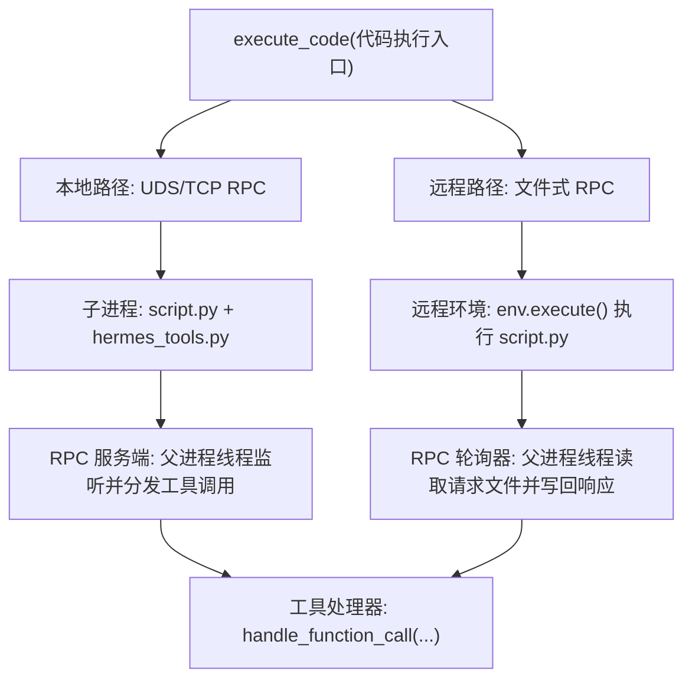
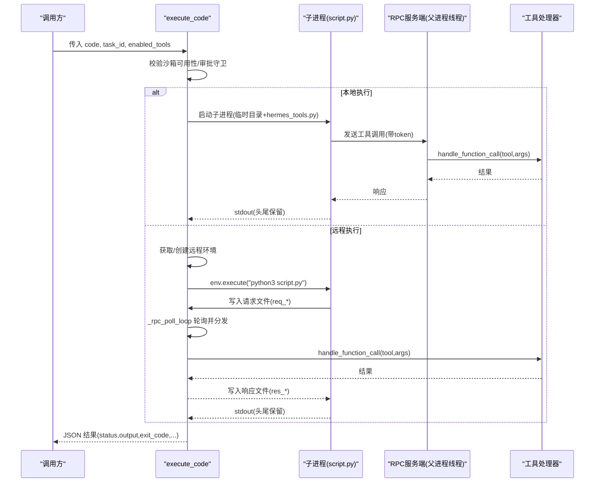
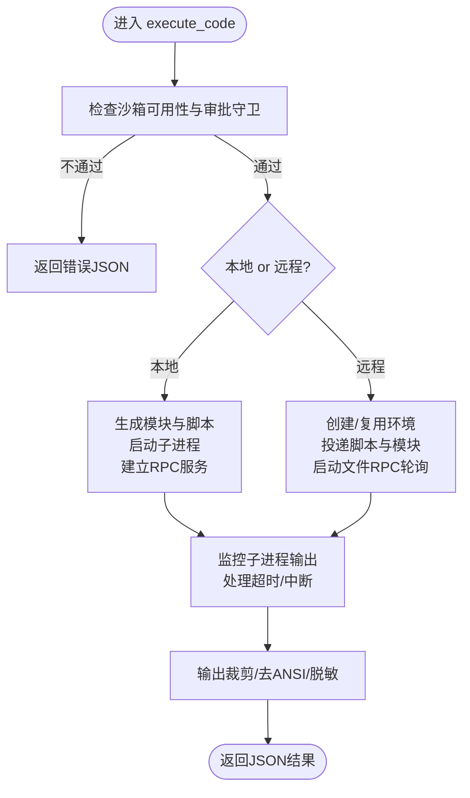
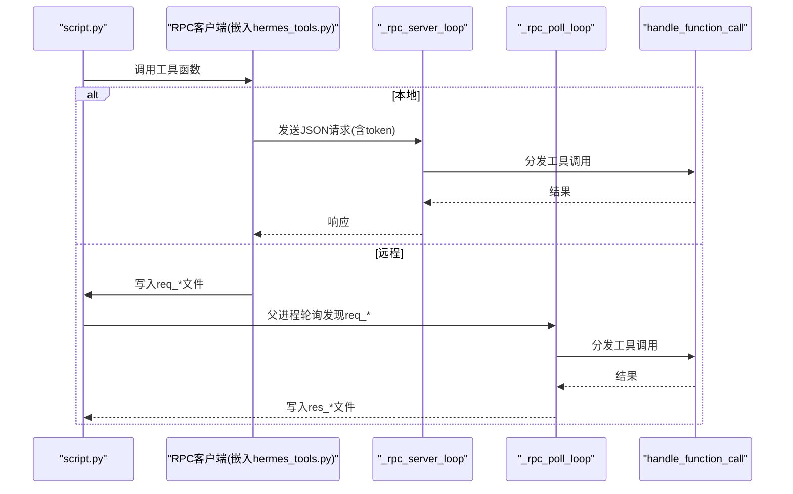
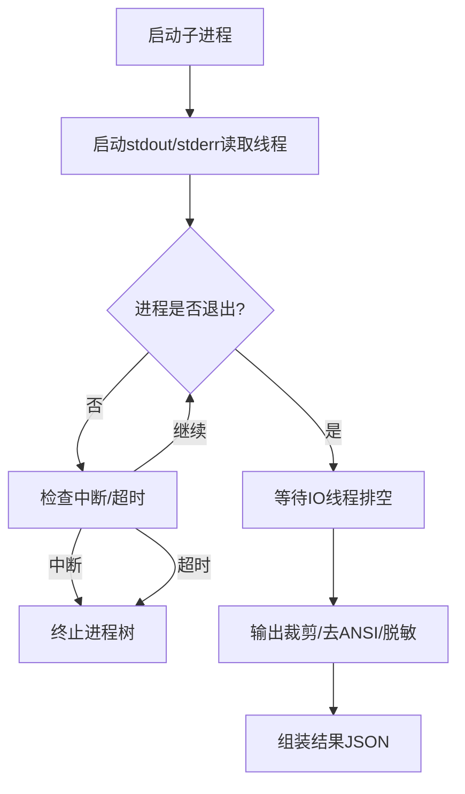
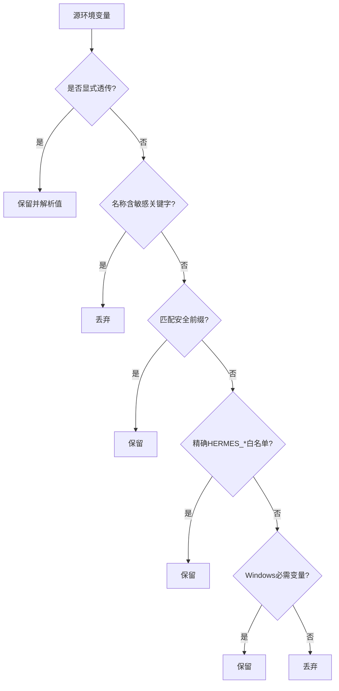
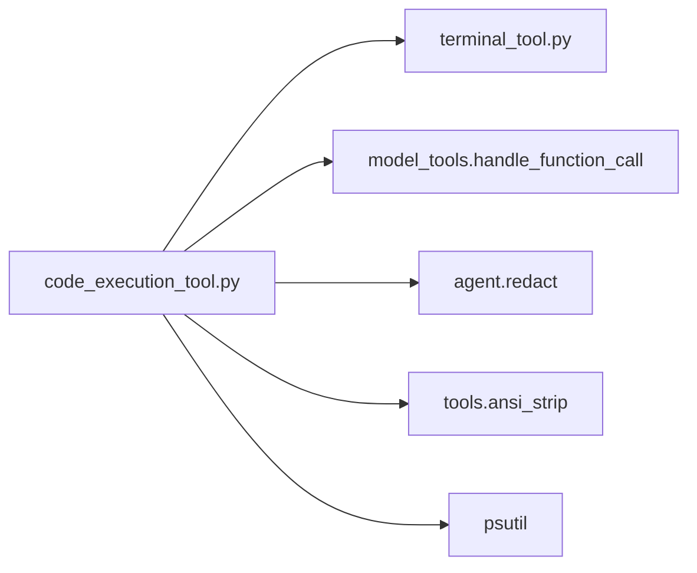

# 代码执行工具

<cite>
**本文引用的文件**
- [tools/code_execution_tool.py](file://tools/code_execution_tool.py)
- [tools/terminal_tool.py](file://tools/terminal_tool.py)
</cite>

## 目录
1. [简介](#简介)
2. [项目结构](#项目结构)
3. [核心组件](#核心组件)
4. [架构总览](#架构总览)
5. [详细组件分析](#详细组件分析)
6. [依赖关系分析](#依赖关系分析)
7. [性能考量](#性能考量)
8. [故障排查指南](#故障排查指南)
9. [结论](#结论)
10. [附录](#附录)

## 简介
本指南面向“代码执行工具”（execute_code），说明如何安全地在沙箱中运行用户提供的 Python 脚本，并通过受限的 RPC 接口调用系统工具（如终端、文件读写、搜索等）。文档覆盖：
- 支持的多语言环境：以 Python 为主，结合终端后端（本地、Docker、Modal、Vercel Sandbox、SSH 等）实现跨平台与远程执行。
- 终端交互、进程管理与输出捕获：子进程生命周期控制、超时与中断处理、stdout/stderr 头尾保留策略。
- 沙箱隔离与安全限制：环境变量清洗、工具白名单、RPC Token 校验、审批守卫、ANSI 剥离与敏感信息脱敏。
- 实际示例与最佳实践：如何编写脚本、调试错误、处理异步任务与重试。
- 环境变量配置与资源限制：超时、最大工具调用次数、输出大小上限、工作目录模式等。

## 项目结构
围绕代码执行能力，关键模块如下：
- tools/code_execution_tool.py：实现 execute_code 工具的核心逻辑，包括沙箱生成、RPC 传输（UDS/TCP/文件）、进程管理、输出裁剪、安全校验与注册。
- tools/terminal_tool.py：提供终端工具与环境管理（local/docker/modal/vercel_sandbox/ssh/singularity/daytona），被 execute_code 复用以创建和复用远程执行环境。

图表来源
- [tools/code_execution_tool.py:1256-1716](file://tools/code_execution_tool.py#L1256-L1716)
- [tools/code_execution_tool.py:800-1250](file://tools/code_execution_tool.py#L800-L1250)
- [tools/terminal_tool.py:1-35](file://tools/terminal_tool.py#L1-L35)

章节来源
- [tools/code_execution_tool.py:1-80](file://tools/code_execution_tool.py#L1-L80)
- [tools/terminal_tool.py:1-35](file://tools/terminal_tool.py#L1-L35)

## 核心组件
- 沙箱可用性与检查：check_sandbox_requirements 根据终端环境类型判断是否可用（例如 Vercel Sandbox 的特殊要求）。
- 工具白名单与 RPC 存根：SANDBOX_ALLOWED_TOOLS 限定可调用工具；generate_hermes_tools_module 动态生成 hermes_tools.py 供脚本导入。
- 两种 RPC 传输：
  - 本地：Unix Domain Socket（POSIX）或 TCP（Windows），通过 _rpc_server_loop 在父进程中接收并分发工具调用。
  - 远程：基于文件系统请求/响应文件的轮询机制，_rpc_poll_loop 在父进程中扫描并处理。
- 进程与输出管理：子进程启动、管道读取、超时/中断终止、stdout/stderr 头尾保留与截断、ANSI 剥离与敏感信息脱敏。
- 环境变量清洗：_scrub_child_env 严格过滤敏感变量，仅放行必要的环境变量与显式透传项。
- 执行模式与工作目录：project vs strict 模式决定解释器与工作目录解析策略。
- 配置加载：_load_config 轻量读取 code_execution.* 配置（timeout、max_tool_calls、mode 等）。

章节来源
- [tools/code_execution_tool.py:303-323](file://tools/code_execution_tool.py#L303-L323)
- [tools/code_execution_tool.py:62-79](file://tools/code_execution_tool.py#L62-L79)
- [tools/code_execution_tool.py:432-464](file://tools/code_execution_tool.py#L432-L464)
- [tools/code_execution_tool.py:512-642](file://tools/code_execution_tool.py#L512-L642)
- [tools/code_execution_tool.py:653-779](file://tools/code_execution_tool.py#L653-L779)
- [tools/code_execution_tool.py:922-1062](file://tools/code_execution_tool.py#L922-L1062)
- [tools/code_execution_tool.py:1497-1716](file://tools/code_execution_tool.py#L1497-L1716)
- [tools/code_execution_tool.py:209-300](file://tools/code_execution_tool.py#L209-L300)
- [tools/code_execution_tool.py:1798-1937](file://tools/code_execution_tool.py#L1798-L1937)
- [tools/code_execution_tool.py:1769-1785](file://tools/code_execution_tool.py#L1769-L1785)

## 架构总览
execute_code 将 LLM 生成的 Python 脚本放入受控环境中执行，并通过 RPC 访问受限工具集。本地路径使用 UDS/TCP 直连，远程路径通过文件交换请求/响应。所有工具调用均经过白名单、Token 校验与计数限制，最终结果经脱敏后返回给上层。

图表来源
- [tools/code_execution_tool.py:1256-1716](file://tools/code_execution_tool.py#L1256-L1716)
- [tools/code_execution_tool.py:800-1250](file://tools/code_execution_tool.py#L800-L1250)

## 详细组件分析

### 组件A：execute_code 主流程与调度
- 功能要点
  - 校验沙箱可用性、审批守卫（含 Docker 主机挂载场景）。
  - 根据终端后端选择本地或远程路径。
  - 本地：生成 hermes_tools.py 与 script.py，启动子进程，建立 UDS/TCP 连接。
  - 远程：将脚本与模块投递到远端，启动文件式 RPC 轮询线程。
  - 统一输出处理：截断、去 ANSI、敏感信息脱敏、构建结果 JSON。
- 关键参数与限制
  - 默认超时、最大工具调用次数、stdout/stderr 字节上限。
  - 工作目录模式：project（会话 CWD + venv python）或 strict（隔离 temp 目录 + 当前解释器）。
- 异常与提示
  - 常见失败类自动识别（导入错误、第三方包缺失、返回值类型误用）并提供修复提示。

图表来源
- [tools/code_execution_tool.py:1256-1716](file://tools/code_execution_tool.py#L1256-L1716)
- [tools/code_execution_tool.py:1064-1250](file://tools/code_execution_tool.py#L1064-L1250)

章节来源
- [tools/code_execution_tool.py:1256-1716](file://tools/code_execution_tool.py#L1256-L1716)
- [tools/code_execution_tool.py:1064-1250](file://tools/code_execution_tool.py#L1064-L1250)

### 组件B：RPC 传输层（本地 UDS/TCP 与远程文件式）
- 本地传输
  - 使用 Unix Domain Socket（POSIX）或 TCP（Windows），父进程线程 _rpc_server_loop 接受单个客户端连接，串行处理请求/响应。
  - 每个请求携带 token，服务端进行对比校验。
- 远程传输
  - 脚本通过写入 req_* 文件发起调用，父进程 _rpc_poll_loop 轮询读取并调用工具处理器，再将结果写入 res_* 文件。
  - 自适应轮询退避与单请求超时保护。
- 安全与限流
  - 工具白名单、调用次数限制、禁止 terminal 的后台/pty 等危险参数。

图表来源
- [tools/code_execution_tool.py:512-642](file://tools/code_execution_tool.py#L512-L642)
- [tools/code_execution_tool.py:653-779](file://tools/code_execution_tool.py#L653-L779)
- [tools/code_execution_tool.py:922-1062](file://tools/code_execution_tool.py#L922-L1062)

章节来源
- [tools/code_execution_tool.py:512-642](file://tools/code_execution_tool.py#L512-L642)
- [tools/code_execution_tool.py:653-779](file://tools/code_execution_tool.py#L653-L779)
- [tools/code_execution_tool.py:922-1062](file://tools/code_execution_tool.py#L922-L1062)

### 组件C：进程管理与输出捕获
- 子进程生命周期
  - 启动时设置最小化环境变量（清洗敏感项），注入 RPC 端点与 Token，强制 UTF-8 编码。
  - 监控循环检测中断与超时，必要时终止进程树（psutil）。
- 输出捕获策略
  - stdout：保留头部与尾部（默认最多 50KB），超出部分记录元数据并在结果中标注截断。
  - stderr：仅保留头部（默认最多 10KB），便于快速定位错误。
  - 结果输出：去除 ANSI 转义序列，并对敏感信息进行脱敏。
- 工作目录与解释器
  - project 模式优先使用会话 CWD 与 venv python；strict 模式使用隔离目录与当前解释器。

图表来源
- [tools/code_execution_tool.py:1497-1716](file://tools/code_execution_tool.py#L1497-L1716)
- [tools/code_execution_tool.py:81-135](file://tools/code_execution_tool.py#L81-L135)

章节来源
- [tools/code_execution_tool.py:1497-1716](file://tools/code_execution_tool.py#L1497-L1716)
- [tools/code_execution_tool.py:81-135](file://tools/code_execution_tool.py#L81-L135)

### 组件D：环境变量清洗与安全限制
- 规则顺序
  - 先处理显式透传变量（skill/config 声明）。
  - 屏蔽包含敏感关键字的变量名（KEY/TOKEN/SECRET/PASSWORD/WEBHOOK 等）。
  - 允许特定前缀（PATH/HOME/LANG/TERM/TMPDIR/CONDA 等）。
  - 精确放行少量 HERMES_* 操作变量。
  - Windows 额外放行系统必需变量以保证基础库正常工作。
- 委派上下文清理
  - 若来自委派子进程，进一步清理看板相关变量，防止权限泄露。
- 运行时注入
  - 为子进程注入 RPC 端点、Token、UTF-8 编码、PYTHONPATH、TZ 等必要变量。

图表来源
- [tools/code_execution_tool.py:209-300](file://tools/code_execution_tool.py#L209-L300)

章节来源
- [tools/code_execution_tool.py:209-300](file://tools/code_execution_tool.py#L209-L300)

### 组件E：终端环境与远程后端
- 支持的终端后端
  - local、docker、modal、vercel_sandbox、ssh、singularity、daytona。
- 环境复用与清理
  - 按 task_id 复用活跃环境，维护最后活动时间，后台线程负责清理。
- 容器/云沙箱资源
  - CPU/内存/磁盘配额、持久化开关、网络策略、运行时长等由配置驱动。
- Vercel Sandbox 特殊校验
  - 运行时版本、磁盘容量、认证凭据（OIDC 或 Token/Project/Team）必须满足要求。

章节来源
- [tools/terminal_tool.py:1-35](file://tools/terminal_tool.py#L1-L35)
- [tools/code_execution_tool.py:785-887](file://tools/code_execution_tool.py#L785-L887)
- [tools/terminal_tool.py:141-197](file://tools/terminal_tool.py#L141-L197)

## 依赖关系分析
- execute_code 依赖 terminal_tool 的环境管理能力，用于创建/复用远程执行环境。
- 工具调用统一经由 model_tools.handle_function_call 分发，确保权限、审计与结果格式一致。
- 输出处理依赖 ansi_strip 与 agent.redact 进行格式化清理与敏感信息脱敏。
- 进程树终止依赖 psutil。

图表来源
- [tools/code_execution_tool.py:785-887](file://tools/code_execution_tool.py#L785-L887)
- [tools/code_execution_tool.py:653-779](file://tools/code_execution_tool.py#L653-L779)
- [tools/code_execution_tool.py:1719-1767](file://tools/code_execution_tool.py#L1719-L1767)

章节来源
- [tools/code_execution_tool.py:653-779](file://tools/code_execution_tool.py#L653-L779)
- [tools/code_execution_tool.py:785-887](file://tools/code_execution_tool.py#L785-L887)
- [tools/code_execution_tool.py:1719-1767](file://tools/code_execution_tool.py#L1719-L1767)

## 性能考量
- 输出裁剪：stdout 采用头尾保留策略，避免大输出阻塞上下文窗口；stderr 仅保留头部，减少噪声。
- 轮询退避：远程文件式 RPC 使用指数退避，降低频繁 I/O 开销。
- 解释器选择：project 模式优先使用 venv python，提升依赖解析效率；strict 模式保证可重复性。
- 环境复用：同一 task_id 共享远程环境，减少冷启动成本。
- 超时与中断：细粒度监控，及时释放资源，避免僵尸进程。

[本节为通用指导，无需引用具体文件]

## 故障排查指南
- 常见错误与提示
  - 导入错误：尝试导入不在白名单的工具或内置 helper 方式错误，会给出明确修复建议。
  - 模块缺失：第三方包未安装时，建议使用 terminal() 在项目 venv 中执行或改用 stdlib。
  - 返回值类型错误：工具返回字典而非字符串，避免 json.loads 或字符串索引。
- 超时与中断
  - 超时：脚本超过配置超时将被终止，结果中包含超时提示。
  - 中断：用户新消息触发中断，结果标注执行被中断。
- 输出过大
  - stdout 被截断时会附带元数据，指示省略字节数；建议缩小输出范围或分步打印。
- 远程环境不可用
  - 检查 Python 是否可用、认证凭据是否齐全（Vercel Sandbox）、磁盘/网络配置是否符合后端要求。

章节来源
- [tools/code_execution_tool.py:377-429](file://tools/code_execution_tool.py#L377-L429)
- [tools/code_execution_tool.py:1652-1681](file://tools/code_execution_tool.py#L1652-L1681)
- [tools/code_execution_tool.py:1101-1116](file://tools/code_execution_tool.py#L1101-L1116)
- [tools/terminal_tool.py:141-197](file://tools/terminal_tool.py#L141-L197)

## 结论
execute_code 提供了安全的 Python 脚本执行沙箱，结合多种终端后端实现本地与远程执行。通过严格的变量清洗、工具白名单、RPC Token 校验与输出脱敏，保障执行过程可控且安全。配合 project/strict 模式与资源限制，可在不同场景下平衡灵活性与稳定性。

[本节为总结，无需引用具体文件]

## 附录

### 环境变量配置与资源限制
- 执行模式
  - code_execution.mode：project（默认，使用会话 CWD 与 venv python）或 strict（隔离目录与当前解释器）。
- 资源限制
  - timeout：脚本执行超时（秒），默认 300。
  - max_tool_calls：单次执行最大工具调用次数，默认 50。
  - MAX_STDOUT_BYTES/MAX_STDERR_BYTES：stdout/stderr 捕获上限（字节）。
- 终端后端
  - TERMINAL_ENV：选择 local/docker/modal/vercel_sandbox/ssh/singularity/daytona。
  - Vercel Sandbox：需配置 VERCEL_OIDC_TOKEN 或 VERCEL_TOKEN/PROJECT_ID/TEAM_ID，运行时需在支持列表内。
- 其他
  - PYTHONPATH：注入 hermes-agent 根目录与临时目录，便于 import。
  - TZ：从内部变量注入子进程，确保时间正确。
  - 显式透传：通过 skill/config 声明的变量可绕过清洗规则。

章节来源
- [tools/code_execution_tool.py:1769-1785](file://tools/code_execution_tool.py#L1769-L1785)
- [tools/code_execution_tool.py:1798-1822](file://tools/code_execution_tool.py#L1798-L1822)
- [tools/code_execution_tool.py:1849-1937](file://tools/code_execution_tool.py#L1849-L1937)
- [tools/code_execution_tool.py:209-300](file://tools/code_execution_tool.py#L209-L300)
- [tools/terminal_tool.py:141-197](file://tools/terminal_tool.py#L141-L197)

### 实际示例与最佳实践
- 执行脚本
  - 在 hermes_tools 中导入允许的工具（如 web_search、read_file、write_file、search_files、patch、terminal），打印最终结果到 stdout。
  - 使用内置 helper：json_parse、shell_quote、retry 提高鲁棒性。
- 调试代码
  - 关注 stderr 头部输出与错误提示；利用 _sandbox_failure_hint 给出的修复建议。
  - 对网络或 API 调用使用 retry 进行指数退避重试。
- 处理异步任务
  - 使用 terminal(command, workdir=...) 在会话工作目录下执行命令；避免使用 background/pty 等危险参数。
  - 对于长耗时任务，合理设置 timeout，并在脚本中定期输出进度。
- 安全与合规
  - 不要尝试访问敏感环境变量或外部机密；如需透传，请在 skill/config 中显式声明。
  - 避免在脚本中直接读取配置文件或密钥文件；如需，请使用 read_file 并通过审批流程。

章节来源
- [tools/code_execution_tool.py:329-374](file://tools/code_execution_tool.py#L329-L374)
- [tools/code_execution_tool.py:469-508](file://tools/code_execution_tool.py#L469-L508)
- [tools/code_execution_tool.py:377-429](file://tools/code_execution_tool.py#L377-L429)
- [tools/code_execution_tool.py:649-743](file://tools/code_execution_tool.py#L649-L743)