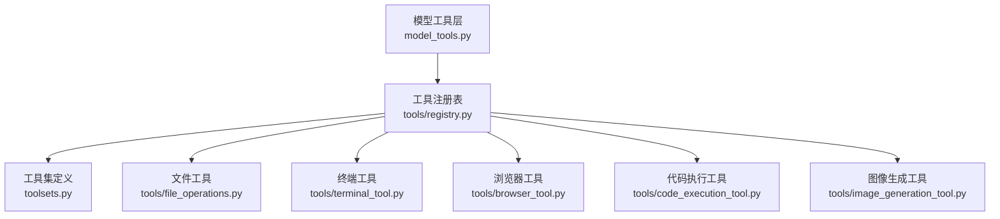
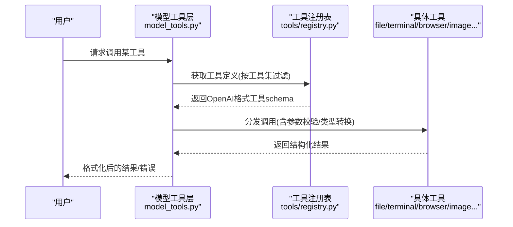
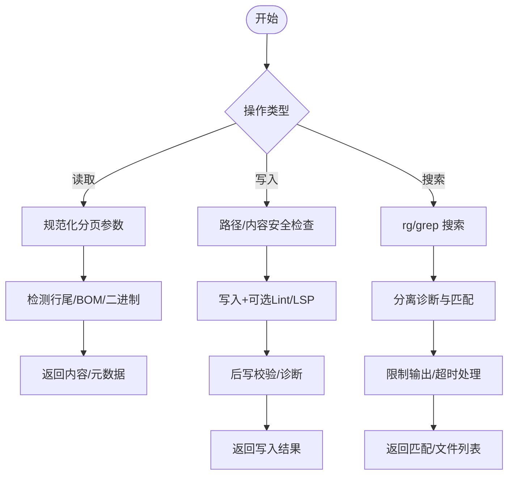
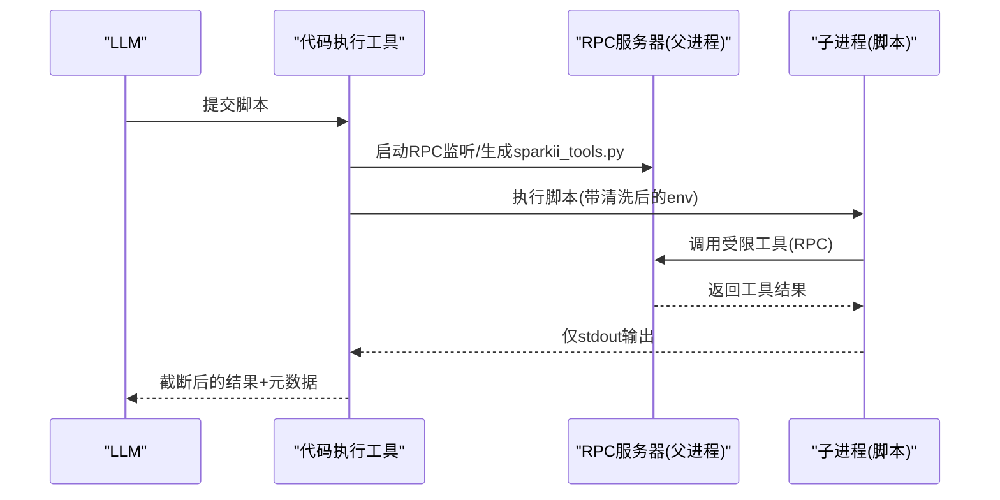
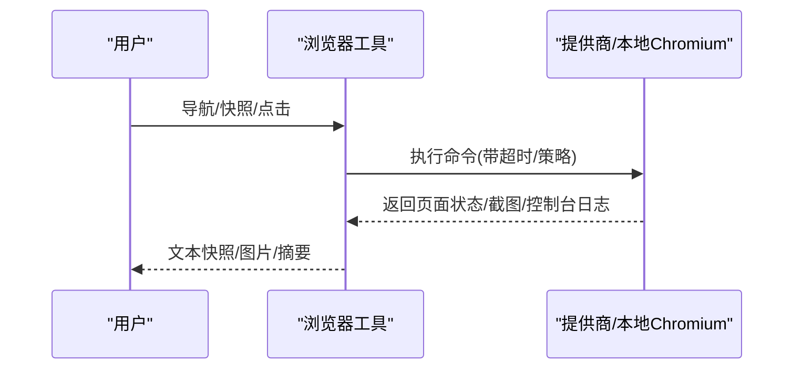
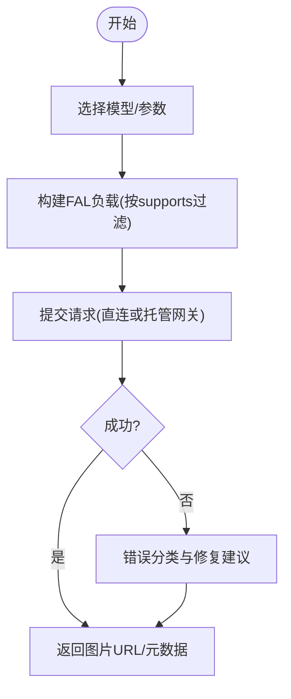
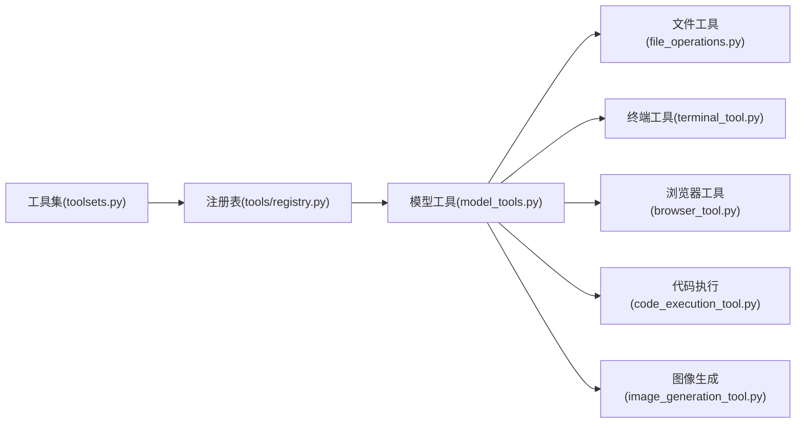

# 工具使用指南

<cite>
**本文引用的文件**
- [README.md](file://README.md)
- [tools/__init__.py](file://tools/__init__.py)
- [tools/registry.py](file://tools/registry.py)
- [toolsets.py](file://toolsets.py)
- [model_tools.py](file://model_tools.py)
- [tools/file_operations.py](file://tools/file_operations.py)
- [tools/browser_tool.py](file://tools/browser_tool.py)
- [tools/code_execution_tool.py](file://tools/code_execution_tool.py)
- [tools/image_generation_tool.py](file://tools/image_generation_tool.py)
- [tools/terminal_tool.py](file://tools/terminal_tool.py)
</cite>

## 目录
1. [简介](#简介)
2. [项目结构](#项目结构)
3. [核心组件](#核心组件)
4. [架构总览](#架构总览)
5. [详细组件分析](#详细组件分析)
6. [依赖关系分析](#依赖关系分析)
7. [性能与可用性](#性能与可用性)
8. [故障排查](#故障排查)
9. [结论](#结论)
10. [附录：配置、自定义与第三方集成](#附录：配置自定义与第三方集成)

## 简介
本指南面向桌面应用内置工具系统，帮助你在不写代码的情况下，通过自然语言调用工具完成复杂任务。你将了解：
- 工具系统的概念、注册机制与发现流程
- 如何发现和启用各类工具（按“工具集”管理）
- 核心工具的使用方法：文件操作、代码执行、浏览器控制、图像处理等
- 权限与安全限制（沙箱、命令审批、环境隔离）
- 实际场景示例（如自动化网页抓取并生成报告）
- 工具配置、自定义工具与第三方工具集成方式

## 项目结构
工具系统由“注册表 + 工具集 + 具体工具模块”构成：
- 工具注册表负责收集所有工具的元数据（名称、描述、参数模式、处理器、可用性检查）
- 工具集将工具分组，便于按场景启用或禁用
- 各工具模块实现具体能力（文件、终端、浏览器、图像等），并在导入时向注册表自注册

图表来源
- [model_tools.py:305-611](file://model_tools.py#L305-L611)
- [tools/registry.py:201-764](file://tools/registry.py#L201-L764)
- [toolsets.py:101-641](file://toolsets.py#L101-L641)

章节来源
- [tools/__init__.py:1-26](file://tools/__init__.py#L1-L26)
- [tools/registry.py:1-159](file://tools/registry.py#L1-L159)
- [toolsets.py:1-89](file://toolsets.py#L1-L89)
- [model_tools.py:1-21](file://model_tools.py#L1-L21)

## 核心组件
- 工具注册表
  - 集中维护工具元数据与处理器，支持动态刷新、别名、覆盖策略与并发安全
  - 提供工具定义获取、按工具集查询、注册/注销工具、check_fn 缓存与失效策略
- 工具集
  - 以“web、file、browser、code_execution、image_gen、desktop_ui、coding”等组合工具
  - 支持平台级默认工具集（CLI、网关、消息平台）与“姿态”工具集（如 coding）
- 模型工具层
  - 统一入口：根据启用的工具集计算最终可用工具列表，注入动态 schema，处理异步桥接与错误清理
  - 暴露 get_tool_definitions、handle_function_call 等 API

章节来源
- [tools/registry.py:414-764](file://tools/registry.py#L414-L764)
- [toolsets.py:101-641](file://toolsets.py#L101-L641)
- [model_tools.py:305-611](file://model_tools.py#L305-L611)

## 架构总览
下图展示从用户请求到工具执行的完整链路，包括工具发现、schema 组装、调度与结果返回。

图表来源
- [model_tools.py:305-611](file://model_tools.py#L305-L611)
- [tools/registry.py:717-764](file://tools/registry.py#L717-L764)

## 详细组件分析

### 文件操作工具（读取、写入、搜索）
- 能力概览
  - 读取：分页读取文本/二进制，自动处理行尾、BOM、终端围栏字符泄露
  - 写入：创建目录、原子写入、可选 LSP/Lint 诊断、后写校验
  - 搜索：内容搜索与文件名搜索，超时与诊断分离，结果可压缩为路径分组视图
  - 安全：写路径拒绝清单、前缀拒绝、敏感信息脱敏
- 典型用法
  - 读取大文件：指定 offset/limit 分页
  - 批量替换：模糊匹配替换或 V4A 多文件补丁
  - 全文检索：按正则/通配符搜索，限制输出量
- 关键实现要点
  - 抽象接口 FileOperations 屏蔽后端差异
  - 解析 rg/grep 输出，区分诊断与有效匹配
  - 内建 JSON/YAML/TOML/Python 语法检查，避免写入损坏配置

图表来源
- [tools/file_operations.py:451-515](file://tools/file_operations.py#L451-L515)
- [tools/file_operations.py:518-733](file://tools/file_operations.py#L518-L733)
- [tools/file_operations.py:358-419](file://tools/file_operations.py#L358-L419)

章节来源
- [tools/file_operations.py:159-346](file://tools/file_operations.py#L159-L346)
- [tools/file_operations.py:451-515](file://tools/file_operations.py#L451-L515)
- [tools/file_operations.py:518-733](file://tools/file_operations.py#L518-L733)

### 代码执行工具（支持多种编程语言）
- 能力概览
  - 在沙箱中运行 LLM 生成的 Python 脚本，通过 RPC 调用受限工具集合
  - 本地后端使用 Unix 域套接字（UDS），远程后端使用文件式 RPC
  - 严格的环境变量清洗、工具白名单、调用次数限制、输出截断
- 典型用法
  - 编写脚本批量处理文件、调用 web_search/read_file/terminal 等
  - 利用内置 helper（json_parse、shell_quote、retry）提升健壮性
- 安全与限制
  - SANDBOX_ALLOWED_TOOLS 限定可调用的工具
  - 环境变量按白名单/黑名单规则过滤，防止密钥泄漏
  - 对 terminal 的后台/PTY 等危险参数进行拦截

图表来源
- [tools/code_execution_tool.py:1-29](file://tools/code_execution_tool.py#L1-L29)
- [tools/code_execution_tool.py:62-79](file://tools/code_execution_tool.py#L62-L79)
- [tools/code_execution_tool.py:325-508](file://tools/code_execution_tool.py#L325-L508)
- [tools/code_execution_tool.py:510-642](file://tools/code_execution_tool.py#L510-L642)
- [tools/code_execution_tool.py:649-779](file://tools/code_execution_tool.py#L649-L779)

章节来源
- [tools/code_execution_tool.py:62-79](file://tools/code_execution_tool.py#L62-L79)
- [tools/code_execution_tool.py:209-300](file://tools/code_execution_tool.py#L209-L300)
- [tools/code_execution_tool.py:325-508](file://tools/code_execution_tool.py#L325-L508)
- [tools/code_execution_tool.py:510-642](file://tools/code_execution_tool.py#L510-L642)
- [tools/code_execution_tool.py:649-779](file://tools/code_execution_tool.py#L649-L779)

### 浏览器控制工具（网页自动化）
- 能力概览
  - 支持本地无头 Chromium 与云端后端（Browserbase/Browser Use/Firecrawl）
  - 基于无障碍树快照进行页面交互（导航、点击、输入、滚动、截图、控制台）
  - 会话隔离、自动清理、CDP 监督器、对话框策略与超时控制
- 典型用法
  - 打开网页、截取快照、定位元素并点击/输入、提取页面内容
  - 结合 vision 工具进行截图理解
- 安全与限制
  - 环境变量最小化透传，剥离敏感键
  - URL 安全策略、网站访问策略检查
  - 首次打开/冷启动超时保护

图表来源
- [tools/browser_tool.py:1-50](file://tools/browser_tool.py#L1-L50)
- [tools/browser_tool.py:125-141](file://tools/browser_tool.py#L125-L141)
- [tools/browser_tool.py:286-343](file://tools/browser_tool.py#L286-L343)
- [tools/browser_tool.py:594-650](file://tools/browser_tool.py#L594-L650)

章节来源
- [tools/browser_tool.py:1-50](file://tools/browser_tool.py#L1-L50)
- [tools/browser_tool.py:125-141](file://tools/browser_tool.py#L125-L141)
- [tools/browser_tool.py:286-343](file://tools/browser_tool.py#L286-L343)
- [tools/browser_tool.py:594-650](file://tools/browser_tool.py#L594-L650)

### 图像处理工具（生成与编辑）
- 能力概览
  - 通过 FAL.ai 接入多种图像模型（FLUX、GPT Image、Ideogram、Recraft、Qwen 等）
  - 支持文生图、图生图、参考图编辑、超分（部分模型）
  - 统一管理模型选择、参数映射、配额与计费提示
- 典型用法
  - 设置首选模型，传入提示词与尺寸/比例，生成图片
  - 使用编辑端点上传参考图进行局部修改
- 安全与限制
  - 通过 managed gateway 或直接凭据路由，失败时给出可操作建议
  - 每模型 supports 白名单过滤，避免发送不被接受的参数

图表来源
- [tools/image_generation_tool.py:76-96](file://tools/image_generation_tool.py#L76-L96)
- [tools/image_generation_tool.py:97-661](file://tools/image_generation_tool.py#L97-L661)
- [tools/image_generation_tool.py:690-766](file://tools/image_generation_tool.py#L690-L766)

章节来源
- [tools/image_generation_tool.py:76-96](file://tools/image_generation_tool.py#L76-L96)
- [tools/image_generation_tool.py:97-661](file://tools/image_generation_tool.py#L97-L661)
- [tools/image_generation_tool.py:690-766](file://tools/image_generation_tool.py#L690-L766)

### 终端与命令执行（安全边界）
- 能力概览
  - 支持本地、Docker、Modal、Vercel Sandbox 等多种后端
  - 危险命令审批、sudo 密码缓存与交互式提示、工作目录校验
  - 磁盘用量告警、超时与中断支持
- 典型用法
  - 执行 shell 命令、后台任务、容器内调试
  - 在受控环境中运行脚本或安装依赖
- 安全与限制
  - 危险命令审批、工作目录白名单字符、sudo 失败提示与缓存失效
  - 云沙箱认证与环境要求校验

章节来源
- [tools/terminal_tool.py:1-34](file://tools/terminal_tool.py#L1-L34)
- [tools/terminal_tool.py:118-197](file://tools/terminal_tool.py#L118-L197)
- [tools/terminal_tool.py:246-343](file://tools/terminal_tool.py#L246-L343)
- [tools/terminal_tool.py:375-421](file://tools/terminal_tool.py#L375-L421)
- [tools/terminal_tool.py:423-605](file://tools/terminal_tool.py#L423-L605)

## 依赖关系分析
- 工具注册表与工具集
  - 工具集定义工具名集合；注册表按 check_fn 过滤可用性
  - 工具集可包含其他工具集（组合），平台默认集复用核心工具
- 模型工具层
  - 聚合工具集、注入动态 schema、做 schema 清洗与工具搜索延迟加载
- 工具模块
  - 各自实现 handler，并通过 registry.register 自注册
  - 依赖共享安全模块（文件安全、URL 安全、批准策略）

图表来源
- [toolsets.py:101-641](file://toolsets.py#L101-L641)
- [tools/registry.py:414-764](file://tools/registry.py#L414-L764)
- [model_tools.py:305-611](file://model_tools.py#L305-L611)

章节来源
- [toolsets.py:101-641](file://toolsets.py#L101-L641)
- [tools/registry.py:414-764](file://tools/registry.py#L414-L764)
- [model_tools.py:305-611](file://model_tools.py#L305-L611)

## 性能与可用性
- 工具发现与 schema 缓存
  - 工具模块扫描采用 AST 预检与磁盘缓存，减少重复开销
  - check_fn 结果 TTL 缓存（约30秒）+ 短暂失败宽容窗口，避免瞬时抖动导致工具不可用
  - 模型工具层对 get_tool_definitions 做 memoization，降低高频调用成本
- 资源与输出限制
  - 文件读取/搜索有行数与大小上限，搜索结果可压缩显示
  - 代码执行 stdout 截断，保留头部与尾部字节计数
  - 浏览器命令超时与首次打开更长超时，避免冷启动阻塞
- 可用性提示
  - 工具集/工具可用性变化会触发缓存失效与重新探测
  - 错误信息经过裁剪与脱敏，避免污染上下文

章节来源
- [tools/registry.py:108-159](file://tools/registry.py#L108-L159)
- [tools/registry.py:233-388](file://tools/registry.py#L233-L388)
- [model_tools.py:276-388](file://model_tools.py#L276-L388)
- [tools/file_operations.py:725-733](file://tools/file_operations.py#L725-L733)
- [tools/code_execution_tool.py:74-79](file://tools/code_execution_tool.py#L74-L79)
- [tools/browser_tool.py:259-343](file://tools/browser_tool.py#L259-L343)

## 故障排查
- 工具不可用
  - 检查工具集是否启用、check_fn 是否通过（如 Docker/Playwright/CDP 依赖）
  - 查看最近一次 check_fn 缓存是否过期或被绕过
- 文件操作失败
  - 确认路径不在写拒绝清单，检查权限与磁盘空间
  - 搜索超时或正则不支持跨行时，调整参数或改用多行模式
- 代码执行报错
  - 确认脚本只调用允许的工具；环境变量被清洗；stdout 可能被截断
  - 常见错误：导入不存在模块、工具返回值类型误用
- 浏览器自动化问题
  - 首次打开超时、Chromium 缺失或沙箱失败；检查代理/依赖安装
  - CDP 覆盖地址无效或网络不可达；对话框策略导致交互阻断
- 终端命令被拒
  - 危险命令需审批；sudo 密码错误或缓存失效；工作目录包含非法字符

章节来源
- [tools/registry.py:233-388](file://tools/registry.py#L233-L388)
- [tools/file_operations.py:48-57](file://tools/file_operations.py#L48-L57)
- [tools/file_operations.py:358-419](file://tools/file_operations.py#L358-L419)
- [tools/code_execution_tool.py:209-300](file://tools/code_execution_tool.py#L209-L300)
- [tools/browser_tool.py:286-343](file://tools/browser_tool.py#L286-L343)
- [tools/terminal_tool.py:375-421](file://tools/terminal_tool.py#L375-L421)

## 结论
该工具系统通过“注册表 + 工具集 + 模块化实现”的设计，提供了强大且安全的桌面自动化能力。借助工具集与动态 schema，你可以按需启用能力；通过沙箱、审批与环境隔离，确保高风险操作可控。配合自然语言指令，即可高效完成文件处理、网页自动化、代码执行与图像生成等任务。

## 附录：配置、自定义与第三方集成
- 发现与启用工具
  - 使用 CLI 命令查看与配置工具集（例如 sparkii tools），启用/禁用特定工具集
  - 工具集定义集中在 toolsets.py，可按场景组合（如 coding、safe、debugging）
- 工具配置
  - 浏览器：cloud_provider、cdp_url、command_timeout、dialog_policy 等
  - 图像生成：image_gen.model、managed gateway 偏好
  - 终端：TERMINAL_ENV、超时、磁盘告警阈值、sudo 行为
- 自定义工具
  - 在 tools/ 下新增模块，模块级调用 registry.register 声明 schema/handler/check_fn
  - 通过工具集将新工具纳入默认或平台集
- 第三方工具集成
  - MCP 工具：通过插件/注册表动态刷新，支持工具搜索延迟加载
  - 插件体系：按命名空间绑定覆盖策略，避免意外覆盖内置工具
- 安全与权限
  - 代码执行沙箱：环境变量清洗、工具白名单、调用限额
  - 终端命令：危险命令审批、sudo 密码缓存与失效策略
  - 文件写入：拒绝路径/前缀、敏感信息脱敏
  - 浏览器：URL 安全策略、最小化环境变量透传

章节来源
- [README.md:105-137](file://README.md#L105-L137)
- [toolsets.py:101-641](file://toolsets.py#L101-L641)
- [tools/browser_tool.py:259-343](file://tools/browser_tool.py#L259-L343)
- [tools/image_generation_tool.py:690-766](file://tools/image_generation_tool.py#L690-L766)
- [tools/terminal_tool.py:118-197](file://tools/terminal_tool.py#L118-L197)
- [tools/code_execution_tool.py:209-300](file://tools/code_execution_tool.py#L209-L300)
- [tools/registry.py:562-644](file://tools/registry.py#L562-L644)