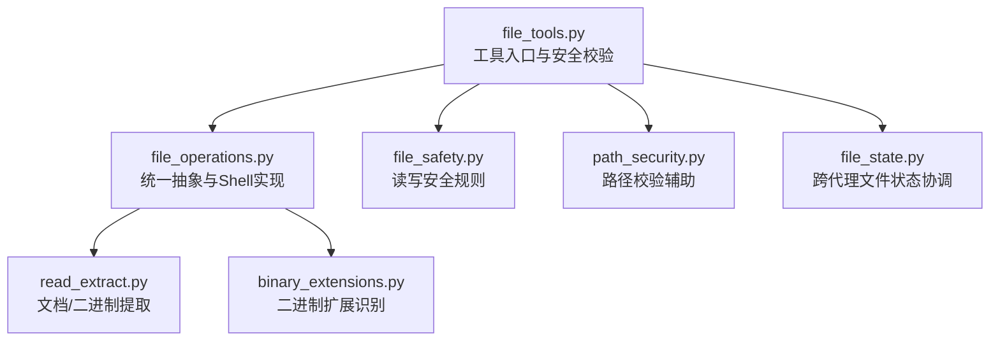
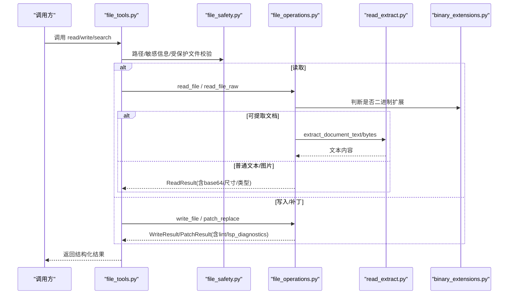
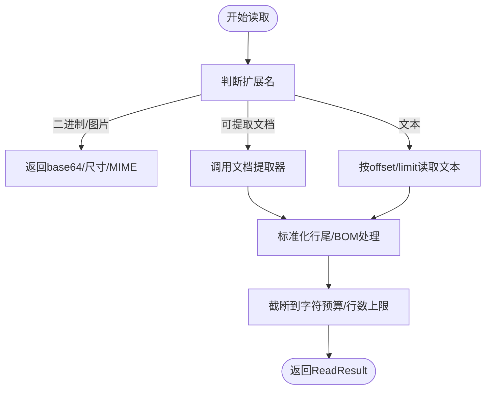
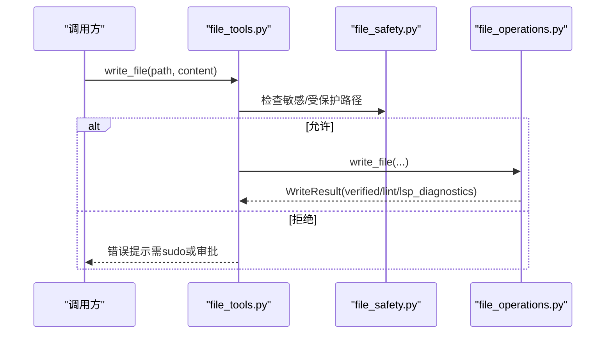
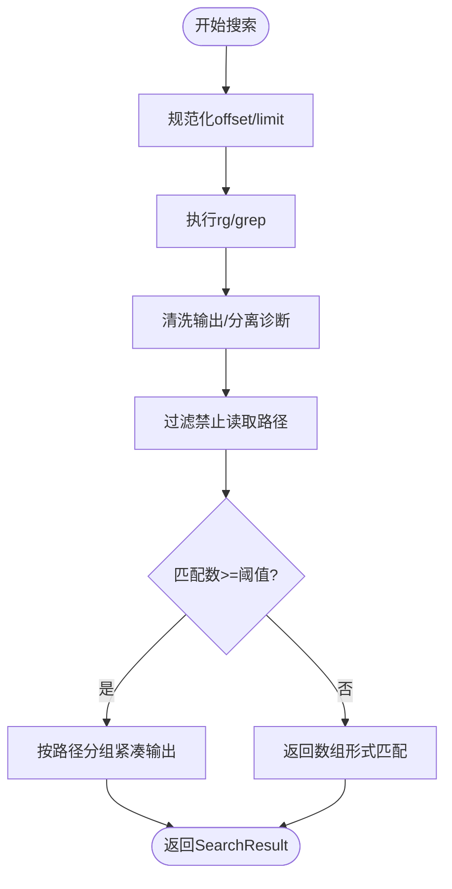
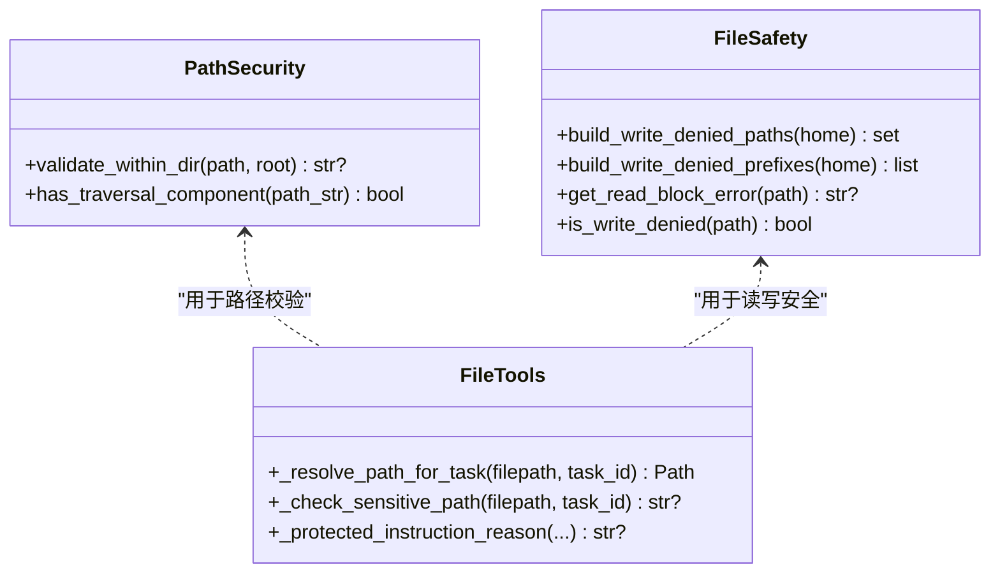
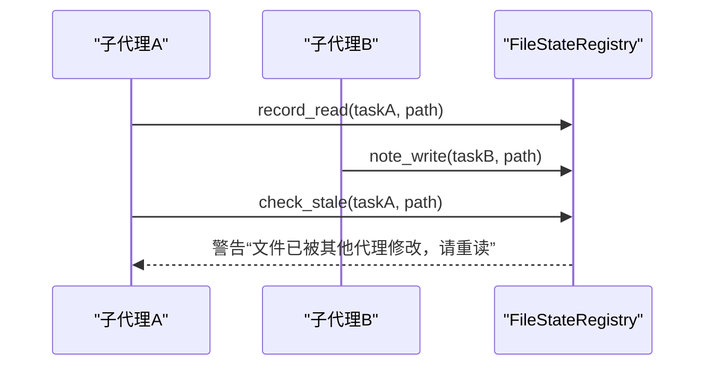
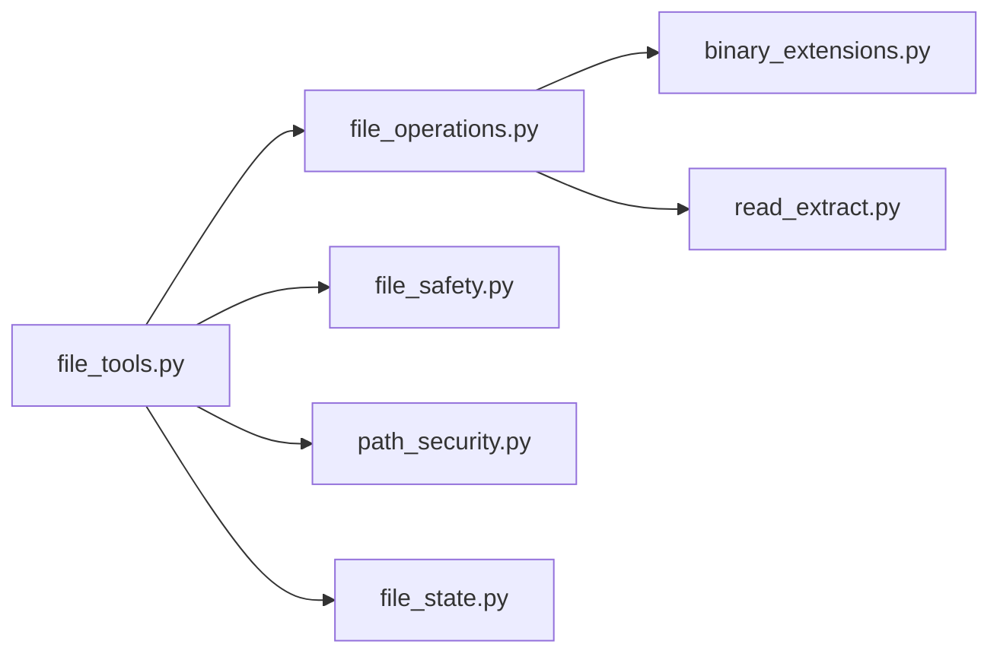

# 文件操作工具

<cite>
**本文引用的文件**
- [tools/file_operations.py](file://tools/file_operations.py)
- [tools/file_tools.py](file://tools/file_tools.py)
- [agent/file_safety.py](file://agent/file_safety.py)
- [tools/path_security.py](file://tools/path_security.py)
- [tools/read_extract.py](file://tools/read_extract.py)
- [tools/binary_extensions.py](file://tools/binary_extensions.py)
- [tools/file_state.py](file://tools/file_state.py)
</cite>

## 目录
1. [简介](#简介)
2. [项目结构](#项目结构)
3. [核心组件](#核心组件)
4. [架构总览](#架构总览)
5. [详细组件分析](#详细组件分析)
6. [依赖关系分析](#依赖关系分析)
7. [性能考虑](#性能考虑)
8. [故障排查指南](#故障排查指南)
9. [结论](#结论)
10. [附录：使用示例与最佳实践](#附录使用示例与最佳实践)

## 简介
本指南面向需要以编程方式或工具调用进行文件读取、写入、搜索与管理的使用者。内容覆盖：
- 支持的格式与编码处理（文本、PDF、图片、代码等）
- 路径安全机制与权限控制（写保护、读保护、敏感路径拦截）
- 批量处理、内容搜索、文件格式转换的实际用法
- 错误处理策略与性能优化建议

该工具集通过统一的抽象接口，屏蔽不同终端后端（本地、容器、SSH 等）的差异，提供一致的文件操作体验。

## 项目结构
围绕文件操作的核心模块分布如下：
- 统一抽象与实现：tools/file_operations.py
- 工具层封装与安全校验：tools/file_tools.py
- 安全规则与读写限制：agent/file_safety.py
- 路径校验辅助：tools/path_security.py
- 文档/二进制提取：tools/read_extract.py
- 二进制扩展识别：tools/binary_extensions.py
- 并发状态协调：tools/file_state.py

**图表来源**
- [tools/file_tools.py:1-120](file://tools/file_tools.py#L1-L120)
- [tools/file_operations.py:451-515](file://tools/file_operations.py#L451-L515)
- [agent/file_safety.py:28-80](file://agent/file_safety.py#L28-L80)
- [tools/path_security.py:15-44](file://tools/path_security.py#L15-L44)
- [tools/read_extract.py:1-54](file://tools/read_extract.py#L1-L54)
- [tools/binary_extensions.py:7-43](file://tools/binary_extensions.py#L7-L43)
- [tools/file_state.py:1-32](file://tools/file_state.py#L1-L32)

**章节来源**
- [tools/file_operations.py:1-120](file://tools/file_operations.py#L1-L120)
- [tools/file_tools.py:1-120](file://tools/file_tools.py#L1-L120)

## 核心组件
- 统一抽象接口 FileOperations：定义 read_file、write_file、patch_replace、search、delete_file、move_file 等方法，屏蔽后端差异。
- ShellFileOperations：基于 shell 命令的统一实现，支持分页读取、内容搜索、补丁应用、行尾与BOM处理、内置 LSP/语法检查。
- 工具封装 file_tools：负责路径解析、工作区锚定、设备/敏感路径拦截、受保护指令文件防护、结果过滤与提示。
- 安全规则 file_safety：构建写拒绝列表、读阻止规则、跨配置/沙箱镜像/跨 profile 的软守卫。
- 文档提取 read_extract：对 Jupyter Notebook、DOCX、XLSX 以及可选 anydoc 支持的 PDF/Office/OpenDocument/RTF/EPUB 等进行文本提取。
- 二进制扩展 binary_extensions：快速判断是否为二进制扩展，避免无意义的文本比较。
- 并发状态 file_state：记录跨子代理的读/写时间戳，防止并发编辑导致的数据覆盖与陈旧写入。

**章节来源**
- [tools/file_operations.py:451-515](file://tools/file_operations.py#L451-L515)
- [tools/file_tools.py:152-400](file://tools/file_tools.py#L152-L400)
- [agent/file_safety.py:28-178](file://agent/file_safety.py#L28-L178)
- [tools/read_extract.py:1-54](file://tools/read_extract.py#L1-L54)
- [tools/binary_extensions.py:7-43](file://tools/binary_extensions.py#L7-L43)
- [tools/file_state.py:59-216](file://tools/file_state.py#L59-L216)

## 架构总览
文件操作从工具层进入，经过安全校验与路径解析，再调用底层抽象实现执行具体操作；读取时根据扩展名选择文本或文档提取；搜索基于 rg/grep 并做输出清洗与限流；写操作包含预检、Lint/LSP 诊断与后验证。

**图表来源**
- [tools/file_tools.py:152-400](file://tools/file_tools.py#L152-L400)
- [agent/file_safety.py:194-337](file://agent/file_safety.py#L194-L337)
- [tools/file_operations.py:451-515](file://tools/file_operations.py#L451-L515)
- [tools/read_extract.py:119-133](file://tools/read_extract.py#L119-L133)
- [tools/binary_extensions.py:37-43](file://tools/binary_extensions.py#L37-L43)

## 详细组件分析

### 文件读取与分页
- 支持按 offset/limit 分页读取，自动限制最大行数与行长，避免上下文溢出。
- 自动检测并保留原始行尾（CRLF/LF），处理 UTF-8 BOM，清理终端围栏泄漏字符。
- 大文件读取会给出“建议使用偏移量”的提示，帮助模型精准定位。

**图表来源**
- [tools/file_operations.py:80-148](file://tools/file_operations.py#L80-L148)
- [tools/file_operations.py:725-768](file://tools/file_operations.py#L725-L768)
- [tools/file_tools.py:65-130](file://tools/file_tools.py#L65-L130)
- [tools/read_extract.py:119-133](file://tools/read_extract.py#L119-L133)

**章节来源**
- [tools/file_operations.py:159-177](file://tools/file_operations.py#L159-L177)
- [tools/file_operations.py:725-768](file://tools/file_operations.py#L725-L768)
- [tools/file_tools.py:65-130](file://tools/file_tools.py#L65-L130)
- [tools/read_extract.py:119-133](file://tools/read_extract.py#L119-L133)

### 文件写入与补丁
- 写前校验：敏感系统路径、Hermes 配置、受保护指令文件（如 AGENTS.md）需审批。
- 写后验证：计算 sha256 校验写入一致性；可选运行 LSP 诊断与语言级 lint。
- 补丁模式：支持模糊匹配替换与 V4A 格式补丁，自动修复相对路径在容器/主机间的一致性。

**图表来源**
- [tools/file_tools.py:676-703](file://tools/file_tools.py#L676-L703)
- [tools/file_operations.py:179-201](file://tools/file_operations.py#L179-L201)
- [agent/file_safety.py:161-178](file://agent/file_safety.py#L161-L178)

**章节来源**
- [tools/file_tools.py:676-703](file://tools/file_tools.py#L676-L703)
- [tools/file_operations.py:179-201](file://tools/file_operations.py#L179-L201)
- [agent/file_safety.py:161-178](file://agent/file_safety.py#L161-L178)

### 内容搜索与文件查找
- 支持按内容或文件名搜索，支持 glob 过滤、上下文行、分页与超时处理。
- 输出清洗：分离 rg/grep 的诊断信息与真实匹配，避免误解析。
- 结果过滤：自动移除被禁止读取的路径（凭据、缓存、环境变量等）。

**图表来源**
- [tools/file_operations.py:358-420](file://tools/file_operations.py#L358-L420)
- [tools/file_operations.py:762-768](file://tools/file_operations.py#L762-L768)
- [tools/file_tools.py:592-639](file://tools/file_tools.py#L592-L639)

**章节来源**
- [tools/file_operations.py:245-329](file://tools/file_operations.py#L245-L329)
- [tools/file_operations.py:358-420](file://tools/file_operations.py#L358-L420)
- [tools/file_tools.py:592-639](file://tools/file_tools.py#L592-L639)

### 路径安全与权限控制
- 写拒绝：精确路径与目录前缀黑名单（SSH、AWS、Kube、Docker、Azure、GCP、.env 等）。
- 读阻止：Hermes 内部缓存、凭据存储、项目 .env 等禁止直接读取。
- 工作区锚定：优先使用会话 cwd、任务覆盖、TERMINAL_CWD，避免 worktree 下误写。
- 设备/进程路径拦截：防止读取 /dev/* 或 /proc/* 导致挂起或泄露。
- 受保护指令文件：AGENTS.md、CLAUDE.md、SOUL.md、.cursorrules 等必须人工审批。

**图表来源**
- [tools/path_security.py:15-44](file://tools/path_security.py#L15-L44)
- [agent/file_safety.py:28-178](file://agent/file_safety.py#L28-L178)
- [tools/file_tools.py:676-703](file://tools/file_tools.py#L676-L703)
- [tools/file_tools.py:728-800](file://tools/file_tools.py#L728-L800)

**章节来源**
- [tools/path_security.py:15-44](file://tools/path_security.py#L15-L44)
- [agent/file_safety.py:28-178](file://agent/file_safety.py#L28-L178)
- [tools/file_tools.py:676-703](file://tools/file_tools.py#L676-L703)
- [tools/file_tools.py:728-800](file://tools/file_tools.py#L728-L800)

### 并发与一致性
- 跨子代理文件状态协调：记录每个文件的最后读取时间与最后写入者，检测陈旧写入与冲突。
- 每路径锁：保证同一文件的 read→modify→write 原子性。
- 写后提醒：若检测到其他代理修改了当前代理已读文件，提示重新读取后再写。

**图表来源**
- [tools/file_state.py:59-216](file://tools/file_state.py#L59-L216)

**章节来源**
- [tools/file_state.py:59-216](file://tools/file_state.py#L59-L216)

## 依赖关系分析
- file_tools 依赖 file_operations 提供统一能力，并组合 agent/file_safety 的安全规则。
- file_operations 依赖 binary_extensions 判断二进制扩展，依赖 read_extract 进行文档提取。
- path_security 为多工具共享的路径校验辅助。
- file_state 独立于 IO，提供进程内并发状态管理。

**图表来源**
- [tools/file_tools.py:1-23](file://tools/file_tools.py#L1-L23)
- [tools/file_operations.py:28-46](file://tools/file_operations.py#L28-L46)
- [tools/read_extract.py:1-54](file://tools/read_extract.py#L1-L54)
- [tools/binary_extensions.py:7-43](file://tools/binary_extensions.py#L7-L43)
- [tools/path_security.py:1-44](file://tools/path_security.py#L1-L44)
- [tools/file_state.py:1-32](file://tools/file_state.py#L1-L32)

**章节来源**
- [tools/file_tools.py:1-23](file://tools/file_tools.py#L1-L23)
- [tools/file_operations.py:28-46](file://tools/file_operations.py#L28-L46)

## 性能考虑
- 读取限制：默认单文件字符预算约 100K，超过则截断到完整行并提示继续读取。
- 搜索限制：默认 limit=50，支持 offset/limit 分页；rg/grep 超时以退出码 124 标识并清理输出。
- 文档提取：anydoc 支持 PDF/Office/OpenDocument/RTF/EPUB，但存在大小限制（默认 50MB），超大文件会被拒绝。
- 行尾与 BOM：检测并保留原始行尾，避免跨平台换行符不一致导致的补丁失败。
- LSP/语法检查：对 .ts/.go/.rs 等语言优先走 LSP 语义诊断，避免 shell linter 误报。

**章节来源**
- [tools/file_tools.py:53-85](file://tools/file_tools.py#L53-L85)
- [tools/file_operations.py:725-768](file://tools/file_operations.py#L725-L768)
- [tools/file_operations.py:358-420](file://tools/file_operations.py#L358-L420)
- [tools/read_extract.py:46-54](file://tools/read_extract.py#L46-L54)
- [tools/file_operations.py:522-572](file://tools/file_operations.py#L522-L572)

## 故障排查指南
- 读取被阻止：当目标为 Hermes 内部缓存、凭据文件或项目 .env 时，会返回明确的访问拒绝消息。
- 写入被拒绝：目标位于敏感系统路径或受保护指令文件时，需通过终端工具 sudo 或人工审批。
- 搜索超时：rg/grep 超时会以特定退出码返回，输出会被清理并附带限制原因。
- 并发冲突：若检测到其他代理修改了文件，会提示先重新读取再写，避免覆盖他人变更。
- 文档提取失败：对于不支持或损坏的文档，会抛出 ExtractionError，调用方可回退到二进制处理。

**章节来源**
- [agent/file_safety.py:194-337](file://agent/file_safety.py#L194-L337)
- [tools/file_tools.py:676-703](file://tools/file_tools.py#L676-L703)
- [tools/file_operations.py:358-420](file://tools/file_operations.py#L358-L420)
- [tools/file_state.py:142-216](file://tools/file_state.py#L142-L216)
- [tools/read_extract.py:61-63](file://tools/read_extract.py#L61-L63)

## 结论
该文件操作工具提供了跨终端后端的统一 API，具备强大的安全边界、丰富的格式支持与完善的并发一致性保障。通过分页读取、搜索限流、文档提取与 LSP 诊断，既能满足日常开发需求，也能在生产环境中保持稳健与可控。

## 附录：使用示例与最佳实践
- 批量处理文件
  - 使用 search(pattern, file_glob="*.py", output_mode="content") 获取匹配项，结合 offset/limit 分页处理。
  - 对每个匹配文件调用 read_file(offset, limit) 分段读取，避免一次性加载大文件。
  - 参考：[tools/file_operations.py:511-515](file://tools/file_operations.py#L511-L515)、[tools/file_operations.py:725-768](file://tools/file_operations.py#L725-L768)

- 搜索内容
  - 使用 search(pattern, target="content", context=2) 获取上下文行，便于定位问题。
  - 注意正则中的换行符匹配限制，必要时调整 pattern 或使用多行模式提示。
  - 参考：[tools/file_operations.py:358-420](file://tools/file_operations.py#L358-L420)

- 转换文件格式
  - 读取 PDF/Office/OpenDocument/RTF/EPUB：确保安装 anydoc 依赖，调用 read_file 将自动尝试文本提取。
  - 对扫描型 PDF，工具会附加覆盖率警告，指导针对空白页范围进行 OCR。
  - 参考：[tools/read_extract.py:1-54](file://tools/read_extract.py#L1-L54)、[tools/read_extract.py:198-331](file://tools/read_extract.py#L198-L331)

- 路径安全与权限
  - 避免直接写入系统敏感路径与受保护指令文件；如需修改，请使用终端工具并获取审批。
  - 使用绝对路径或在明确的工作区目录下操作，避免 worktree 下的路径歧义。
  - 参考：[tools/file_tools.py:676-703](file://tools/file_tools.py#L676-L703)、[tools/file_tools.py:728-800](file://tools/file_tools.py#L728-L800)

- 并发与一致性
  - 在多子代理场景下，遵循“先读后写”原则；若收到 stale 警告，先重新读取再写。
  - 参考：[tools/file_state.py:142-216](file://tools/file_state.py#L142-L216)