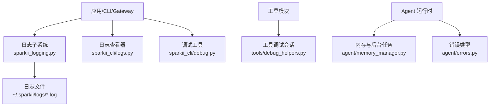
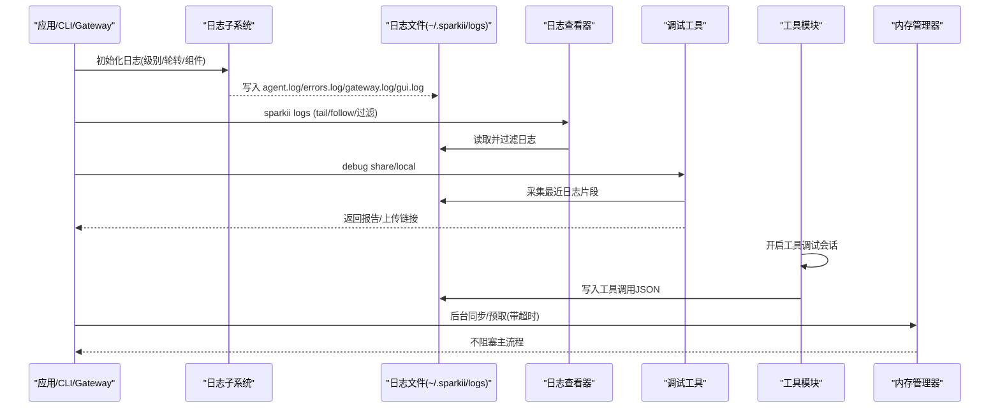
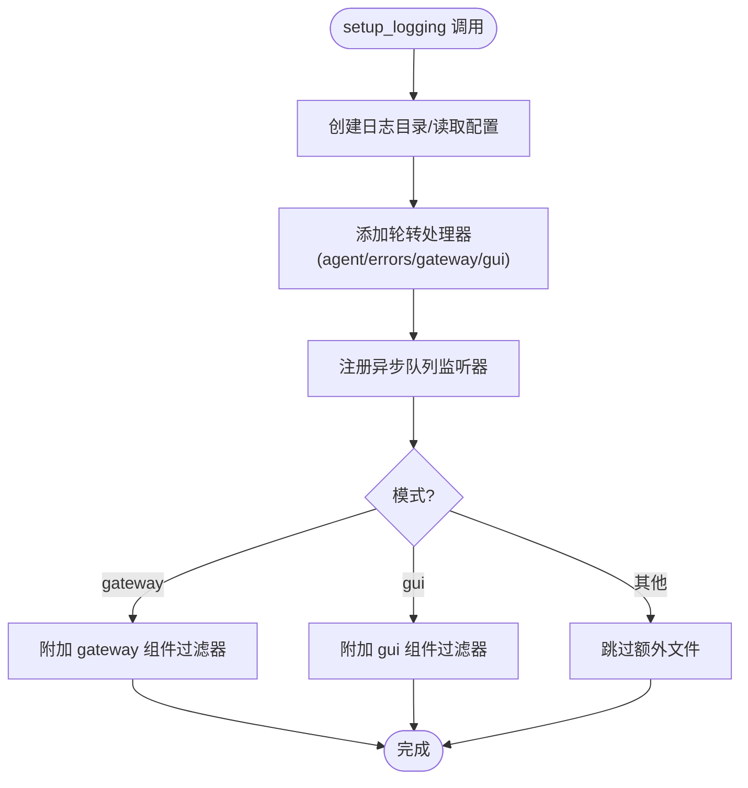
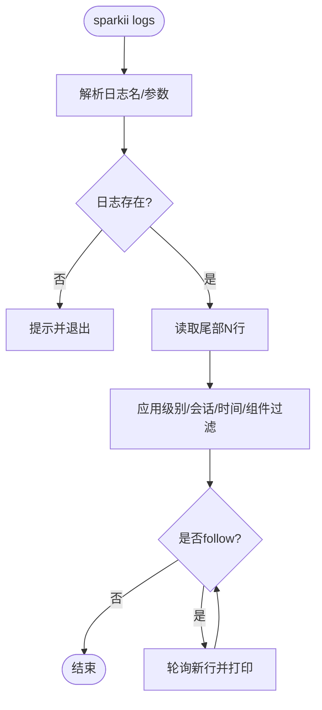
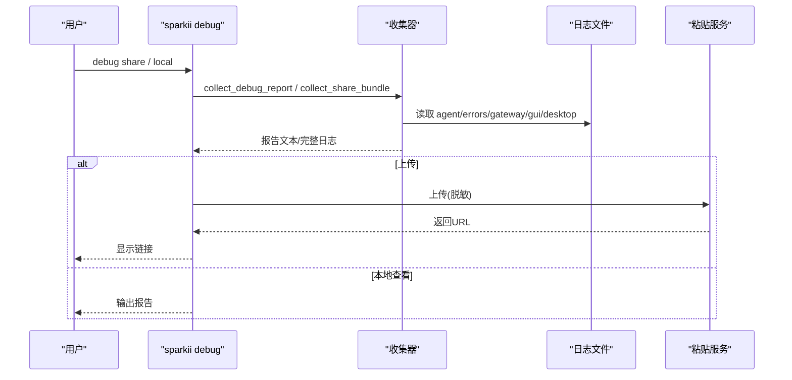
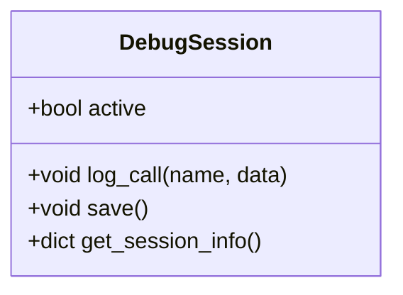
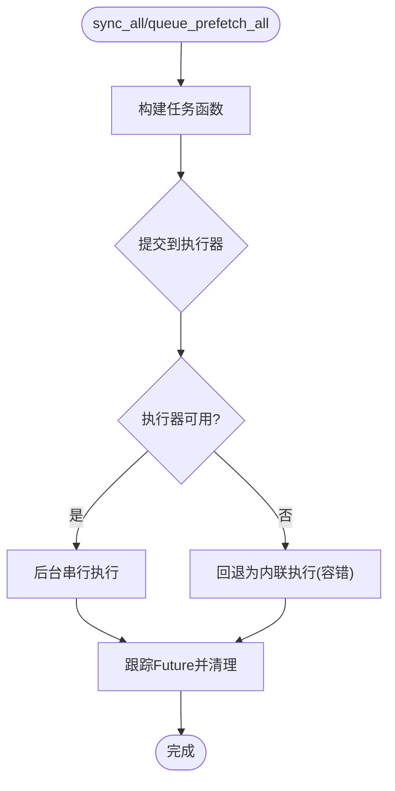
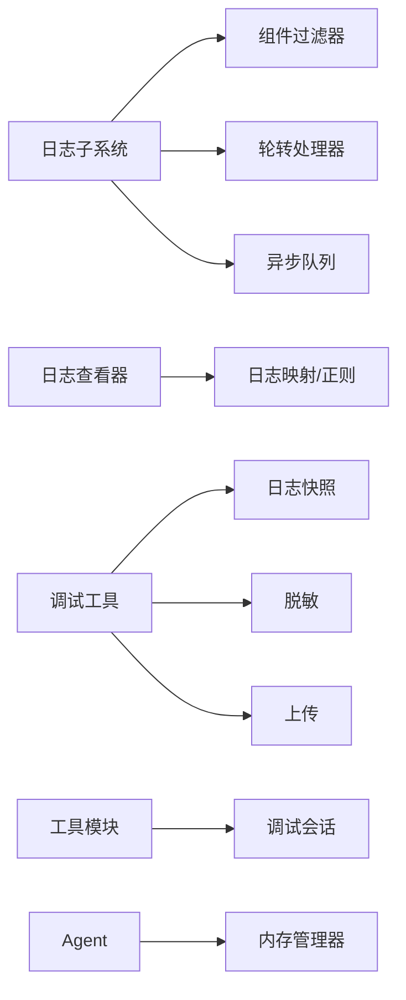

# 故障排除

<cite>
**本文引用的文件**
- [sparkii_logging.py](file://sparkii_logging.py)
- [logs.py](file://sparkii_cli/logs.py)
- [debug.py](file://sparkii_cli/debug.py)
- [debug_helpers.py](file://tools/debug_helpers.py)
- [memory_manager.py](file://agent/memory_manager.py)
- [errors.py](file://agent/errors.py)
</cite>

## 目录
1. [简介](#简介)
2. [项目结构](#项目结构)
3. [核心组件](#核心组件)
4. [架构总览](#架构总览)
5. [详细组件分析](#详细组件分析)
6. [依赖关系分析](#依赖关系分析)
7. [性能注意事项](#性能注意事项)
8. [故障排除指南](#故障排除指南)
9. [结论](#结论)
10. [附录](#附录)

## 简介
本指南面向桌面应用用户与技术支持人员，聚焦安装失败、启动异常、连接错误等常见问题，提供系统化的日志查看与分析方法（桌面应用日志、后端进程日志、网络请求日志），说明调试模式启用方式与常用工具使用，并给出内存泄漏、响应缓慢、CPU占用过高等性能问题的诊断与优化建议。同时覆盖 macOS、Windows、Linux 的常见差异与解决方案，并提供社区支持与问题反馈的最佳实践。

## 项目结构
本项目将“日志记录”“日志查看”“调试报告收集/上传”“工具级调试会话”“内存与后台任务管理”“错误类型定义”等能力分散在多个模块中：
- 日志子系统：集中式日志配置、轮转、异步队列写入、组件隔离、跨进程安全（Windows）处理
- 日志查看器：命令行查看、过滤、实时跟随
- 调试工具：打包系统信息+日志片段、脱敏上传、本地查看
- 工具调试会话：按工具维度记录调用轨迹
- 内存与后台任务：后台同步/预取、超时控制、避免阻塞主流程
- 错误类型：SSL/TLS、空流、预设缺失等

图表来源
- [sparkii_logging.py:259-376](file://sparkii_logging.py#L259-L376)
- [logs.py:31-41](file://sparkii_cli/logs.py#L31-L41)
- [debug.py:583-711](file://sparkii_cli/debug.py#L583-L711)
- [debug_helpers.py:36-106](file://tools/debug_helpers.py#L36-L106)
- [memory_manager.py:638-757](file://agent/memory_manager.py#L638-L757)
- [errors.py:1-14](file://agent/errors.py#L1-L14)

章节来源
- [sparkii_logging.py:1-800](file://sparkii_logging.py#L1-L800)
- [logs.py:1-398](file://sparkii_cli/logs.py#L1-L398)
- [debug.py:1-800](file://sparkii_cli/debug.py#L1-L800)
- [debug_helpers.py:1-106](file://tools/debug_helpers.py#L1-L106)
- [memory_manager.py:1-800](file://agent/memory_manager.py#L1-L800)
- [errors.py:1-14](file://agent/errors.py#L1-L14)

## 核心组件
- 日志子系统：统一入口设置日志级别、轮转策略、组件隔离（gateway/gui/agent/tools/cli/cron）、会话上下文注入、异步队列写入以避免事件循环阻塞；Windows 下使用并发日志处理器解决多进程锁冲突。
- 日志查看器：支持 tail/follow、级别过滤、会话过滤、时间范围过滤、组件过滤；列出可用日志文件及大小/时间。
- 调试工具：收集系统 dump + 最近日志片段，支持脱敏上传到公共粘贴服务或内部存储，生成可分享的链接；支持本地查看。
- 工具调试会话：通过环境变量开关，记录工具调用序列，输出 JSON 到 logs 目录，便于定位工具链问题。
- 内存与后台任务：后台串行执行器保证顺序写，外部预取超时保护，避免慢/卡死的外部调用阻塞主流程。
- 错误类型：明确 SSL/TLS 配置错误、空流错误、预设不存在等异常语义。

章节来源
- [sparkii_logging.py:259-376](file://sparkii_logging.py#L259-L376)
- [logs.py:145-254](file://sparkii_cli/logs.py#L145-L254)
- [debug.py:583-711](file://sparkii_cli/debug.py#L583-L711)
- [debug_helpers.py:36-106](file://tools/debug_helpers.py#L36-L106)
- [memory_manager.py:638-757](file://agent/memory_manager.py#L638-L757)
- [errors.py:1-14](file://agent/errors.py#L1-L14)

## 架构总览
下图展示了从应用/CLI/Gateway 到日志子系统、日志文件、日志查看器与调试工具的交互关系，以及工具调试会话与 Agent 运行时的集成点。

图表来源
- [sparkii_logging.py:259-376](file://sparkii_logging.py#L259-L376)
- [logs.py:145-254](file://sparkii_cli/logs.py#L145-L254)
- [debug.py:583-711](file://sparkii_cli/debug.py#L583-L711)
- [debug_helpers.py:36-106](file://tools/debug_helpers.py#L36-L106)
- [memory_manager.py:638-757](file://agent/memory_manager.py#L638-L757)

## 详细组件分析

### 日志子系统（集中式日志与轮转）
- 功能要点
  - 统一入口 setup_logging()，支持指定 home、级别、文件大小、备份数、模式（cli/gateway/gui/cron）。
  - 自动创建 agent.log、errors.log，并在 gateway/gui 模式下分别创建 gateway.log、gui.log。
  - 组件隔离：通过过滤器将不同组件日志路由到对应文件。
  - 会话上下文：set_session_context/clear_session_context 为每条日志注入会话标签，便于关联。
  - 异步队列：所有文件写入经 QueueListener 在独立线程处理，避免事件循环阻塞。
  - Windows 兼容：使用并发日志处理器避免多进程锁冲突导致的权限错误与锁超时。
  - 外部旋转检测：自定义 ManagedRotatingFileHandler 检测外部重命名/删除后自动重新打开文件。
- 典型问题与排查
  - 日志未产生：确认已运行一次应用/CLI以触发日志创建；检查 logs 目录是否存在。
  - 日志被截断或丢失：关注 errors.log 中的警告/错误；检查磁盘空间与权限。
  - Windows 锁超时：观察是否出现锁超时提示；该场景已被静默处理，不影响主流程。
  - 多进程竞争：确保各进程共享同一 home 路径；必要时调整 max_size_mb/backup_count。

图表来源
- [sparkii_logging.py:259-376](file://sparkii_logging.py#L259-L376)
- [sparkii_logging.py:415-548](file://sparkii_logging.py#L415-L548)
- [sparkii_logging.py:550-760](file://sparkii_logging.py#L550-L760)

章节来源
- [sparkii_logging.py:1-800](file://sparkii_logging.py#L1-L800)

### 日志查看器（tail/follow/过滤）
- 功能要点
  - 支持日志名映射：agent、errors、gateway、gui、desktop、mcp。
  - 支持级别过滤、会话过滤、时间范围过滤、组件过滤。
  - 支持实时跟随（polling）与 Ctrl+C 停止。
  - 列出可用日志文件及其大小与最后修改时间。
- 典型问题与排查
  - 找不到日志文件：先运行一次应用/CLI生成日志；检查权限。
  - 过滤无结果：确认会话ID、组件前缀、时间范围是否正确。
  - 大文件读取性能：内置高效尾部读取策略，避免全量加载。

图表来源
- [logs.py:145-254](file://sparkii_cli/logs.py#L145-L254)
- [logs.py:256-363](file://sparkii_cli/logs.py#L256-L363)
- [logs.py:365-398](file://sparkii_cli/logs.py#L365-L398)

章节来源
- [logs.py:1-398](file://sparkii_cli/logs.py#L1-L398)

### 调试工具（收集与上传）
- 功能要点
  - 收集系统 dump + 最近日志片段，生成摘要报告。
  - 支持脱敏上传至公共粘贴服务或内部存储，生成分享链接。
  - 支持本地查看（不上传），避免泄露敏感信息。
  - 对缺失的客户端侧日志给出友好提示（远程/容器/SSH 场景）。
- 典型问题与排查
  - 上传失败：检查网络连通性；尝试备用服务；查看 failures 列表。
  - 隐私顾虑：默认启用强制脱敏；如需原始内容可使用 --no-redact（谨慎）。
  - 远程后端：桌面端日志需从客户端机器收集；后端可能看不到 desktop.log。

图表来源
- [debug.py:583-711](file://sparkii_cli/debug.py#L583-L711)
- [debug.py:754-800](file://sparkii_cli/debug.py#L754-L800)

章节来源
- [debug.py:1-800](file://sparkii_cli/debug.py#L1-L800)

### 工具调试会话（按工具维度记录）
- 功能要点
  - 通过环境变量启用（如 WEB_TOOLS_DEBUG=true）。
  - 记录每次工具调用的时间戳、名称与数据。
  - 会话结束时保存 JSON 到 logs 目录，便于回放与定位。
- 典型问题与排查
  - 未生成调试文件：确认环境变量正确且工具模块启用了 DebugSession。
  - 文件过大：限制会话时长或减少 log_call 频率。
  - 权限/路径问题：检查 logs 目录可写性。

图表来源
- [debug_helpers.py:36-106](file://tools/debug_helpers.py#L36-L106)

章节来源
- [debug_helpers.py:1-106](file://tools/debug_helpers.py#L1-L106)

### 内存与后台任务管理（避免阻塞与超时）
- 功能要点
  - 后台串行执行器：保证写操作顺序，避免并发写导致的数据错乱。
  - 外部预取超时：防止慢/卡死的外部调用阻塞主流程。
  - 关闭时优雅 draining：避免进程退出时被阻塞。
- 典型问题与排查
  - 响应缓慢：检查外部预取是否超时；查看相关警告日志。
  - 进程退出卡顿：确认后台任务已 drain；必要时调整超时。
  - 资源耗尽：监控线程/进程数量；避免过多外部调用。

图表来源
- [memory_manager.py:638-757](file://agent/memory_manager.py#L638-L757)

章节来源
- [memory_manager.py:1-800](file://agent/memory_manager.py#L1-L800)

### 错误类型（SSL/空流/预设缺失）
- 功能要点
  - SSLConfigurationError：SSL/TLS 证书配置失败。
  - EmptyStreamError：提供者关闭流但未产出响应。
  - MoAPresetNotFoundError：持久化预设不存在于配置中。
- 典型问题与排查
  - 连接失败：优先检查 SSL/TLS 配置与证书链。
  - 流中断：检查网络稳定性与远端服务状态。
  - 配置不一致：核对预设名称与配置文件。

章节来源
- [errors.py:1-14](file://agent/errors.py#L1-L14)

## 依赖关系分析
- 日志子系统依赖：
  - 配置读取（最佳努力）：logging.level、max_size_mb、backup_count。
  - 平台差异：Windows 使用并发日志处理器；POSIX 使用标准轮转处理器。
  - 组件过滤器：gateway、agent、tools、cli、cron、gui。
- 日志查看器依赖：
  - 日志文件映射与正则解析（时间戳、级别、logger名）。
  - 组件前缀映射用于过滤。
- 调试工具依赖：
  - 日志快照采集（含 .1 轮转文件回退）。
  - 脱敏处理（强制模式）。
  - 粘贴服务上传（主备服务）。
- 工具调试会话依赖：
  - 环境变量开关。
  - logs 目录写入。
- 内存管理器依赖：
  - 后台执行器（单工作线程）。
  - 外部预取超时与线程管理。

图表来源
- [sparkii_logging.py:234-252](file://sparkii_logging.py#L234-L252)
- [sparkii_logging.py:550-760](file://sparkii_logging.py#L550-L760)
- [logs.py:31-41](file://sparkii_cli/logs.py#L31-L41)
- [debug.py:358-557](file://sparkii_cli/debug.py#L358-L557)
- [debug_helpers.py:36-106](file://tools/debug_helpers.py#L36-L106)
- [memory_manager.py:638-757](file://agent/memory_manager.py#L638-L757)

章节来源
- [sparkii_logging.py:234-252](file://sparkii_logging.py#L234-L252)
- [logs.py:31-41](file://sparkii_cli/logs.py#L31-L41)
- [debug.py:358-557](file://sparkii_cli/debug.py#L358-L557)
- [debug_helpers.py:36-106](file://tools/debug_helpers.py#L36-L106)
- [memory_manager.py:638-757](file://agent/memory_manager.py#L638-L757)

## 性能注意事项
- 日志写入性能
  - 异步队列避免事件循环阻塞；在高并发场景下保持低延迟。
  - 合理设置 max_size_mb 与 backup_count，避免频繁轮转造成 IO 压力。
- 外部调用阻塞
  - 外部预取超时保护，避免慢调用拖垮主流程；关注超时告警。
  - 后台串行执行器保证顺序写，降低并发竞争。
- 内存与线程
  - 单工作线程执行器避免线程爆炸；监控线程数量与 Future 积压。
  - 工具调试会话仅在需要时启用，避免持续写入带来开销。
- 平台差异
  - Windows 下并发日志处理器解决多进程锁冲突；注意锁超时提示。
  - POSIX 下受管模式（如 NixOS）确保组可写权限与外部旋转兼容。

[本节为通用性能指导，无需具体文件引用]

## 故障排除指南

### 安装问题
- 症状
  - 无法启动应用或 CLI。
  - 缺少必要文件或目录。
- 排查步骤
  - 确认 home 目录存在并可写（~/.sparkii）。
  - 首次运行会创建 logs 目录；若不存在，请先运行一次应用/CLI。
  - 检查权限（尤其是 Windows 多进程写入与 POSIX 组权限）。
- 参考
  - 日志目录创建与轮转：[sparkii_logging.py:259-376](file://sparkii_logging.py#L259-L376)

章节来源
- [sparkii_logging.py:259-376](file://sparkii_logging.py#L259-L376)

### 启动失败
- 症状
  - 应用闪退、CLI 报错、Gateway 无法就绪。
- 排查步骤
  - 查看 errors.log 获取关键错误。
  - 使用 debug share 收集系统信息与最近日志片段。
  - 检查 SSL/TLS 配置（SSLConfigurationError）。
- 参考
  - 错误类型：[errors.py:1-14](file://agent/errors.py#L1-L14)
  - 调试报告：[debug.py:583-711](file://sparkii_cli/debug.py#L583-L711)

章节来源
- [errors.py:1-14](file://agent/errors.py#L1-L14)
- [debug.py:583-711](file://sparkii_cli/debug.py#L583-L711)

### 连接错误
- 症状
  - 网络请求失败、流中断、远端服务不可达。
- 排查步骤
  - 检查代理/防火墙设置。
  - 查看 errors.log 与 gateway.log 中的连接错误。
  - 使用 debug share 上传报告以便进一步分析。
  - 关注 EmptyStreamError（提供者关闭流未产出响应）。
- 参考
  - 错误类型：[errors.py:1-14](file://agent/errors.py#L1-L14)
  - 调试报告：[debug.py:583-711](file://sparkii_cli/debug.py#L583-L711)

章节来源
- [errors.py:1-14](file://agent/errors.py#L1-L14)
- [debug.py:583-711](file://sparkii_cli/debug.py#L583-L711)

### 日志查看与分析
- 快速查看
  - 使用日志查看器 tail/follow 最近日志。
  - 按级别、会话、时间范围、组件过滤。
- 分析技巧
  - 通过会话标签关联同一对话的多条日志。
  - 关注 errors.log 中的 WARNING/ERROR。
  - 区分组件日志（gateway/gui/tools/cli/cron）。
- 参考
  - 日志查看器：[logs.py:145-254](file://sparkii_cli/logs.py#L145-L254)
  - 组件前缀：[sparkii_logging.py:234-252](file://sparkii_logging.py#L234-L252)

章节来源
- [logs.py:145-254](file://sparkii_cli/logs.py#L145-L254)
- [sparkii_logging.py:234-252](file://sparkii_logging.py#L234-L252)

### 调试模式启用与工具使用
- 启用方式
  - 全局调试：通过日志子系统 verbose 模式提升控制台输出级别。
  - 工具调试：设置工具环境变量（如 WEB_TOOLS_DEBUG=true）启用工具级调试会话。
- 工具使用
  - debug share：收集并上传报告（默认脱敏）。
  - debug local：仅本地查看报告。
  - sparkii logs：实时查看与过滤日志。
- 参考
  - 调试工具：[debug.py:583-711](file://sparkii_cli/debug.py#L583-L711)
  - 工具调试会话：[debug_helpers.py:36-106](file://tools/debug_helpers.py#L36-L106)

章节来源
- [debug.py:583-711](file://sparkii_cli/debug.py#L583-L711)
- [debug_helpers.py:36-106](file://tools/debug_helpers.py#L36-L106)

### 性能问题诊断与优化
- 内存泄漏
  - 现象：进程内存持续增长。
  - 排查：禁用不必要的工具调试会话；检查外部预取是否频繁失败重试；监控后台任务堆积。
  - 优化：调整外部预取超时；减少不必要的外部调用。
- 响应缓慢
  - 现象：请求耗时增加、界面卡顿。
  - 排查：查看 errors.log/gateway.log 中的超时与错误；检查网络与代理。
  - 优化：启用后台预取；合理设置日志级别以减少 IO。
- CPU 占用过高
  - 现象：长时间高 CPU。
  - 排查：检查是否有大量日志写入或频繁轮转；检查外部调用是否频繁重试。
  - 优化：增大日志文件大小与备份数；降低日志级别；优化外部调用重试策略。
- 参考
  - 后台任务与超时：[memory_manager.py:638-757](file://agent/memory_manager.py#L638-L757)
  - 日志轮转与异步队列：[sparkii_logging.py:550-760](file://sparkii_logging.py#L550-L760)

章节来源
- [memory_manager.py:638-757](file://agent/memory_manager.py#L638-L757)
- [sparkii_logging.py:550-760](file://sparkii_logging.py#L550-L760)

### 操作系统特有问题与解决方案
- Windows
  - 多进程日志写入锁冲突：使用并发日志处理器；出现锁超时会静默处理。
  - 权限问题：确保 logs 目录可写；避免其他进程锁定文件。
  - 参考：[sparkii_logging.py:42-69](file://sparkii_logging.py#L42-L69)
- macOS/Linux
  - 受管模式（如 NixOS）：确保组可写权限；外部旋转后自动重新打开文件。
  - 参考：[sparkii_logging.py:415-548](file://sparkii_logging.py#L415-L548)
- 远程/容器/SSH
  - 桌面端日志位于客户端机器；后端可能无法直接访问 desktop.log。
  - 参考：[debug.py:375-401](file://sparkii_cli/debug.py#L375-L401)

章节来源
- [sparkii_logging.py:42-69](file://sparkii_logging.py#L42-L69)
- [sparkii_logging.py:415-548](file://sparkii_logging.py#L415-L548)
- [debug.py:375-401](file://sparkii_cli/debug.py#L375-L401)

### 社区支持与问题反馈最佳实践
- 收集信息
  - 使用 debug share 生成报告与日志片段（默认脱敏）。
  - 附上操作系统版本、网络环境、代理设置。
- 提交问题
  - 提供重现步骤、期望行为与实际行为。
  - 附上错误日志（errors.log）与关键组件日志（gateway.log/gui.log）。
- 参考
  - 调试报告与上传：[debug.py:583-711](file://sparkii_cli/debug.py#L583-L711)

章节来源
- [debug.py:583-711](file://sparkii_cli/debug.py#L583-L711)

## 结论
通过统一的日志子系统、便捷的日志查看器、强大的调试工具与健壮的后台任务管理，用户可以高效定位安装、启动、连接与性能问题。结合平台差异与最佳实践，能够快速恢复服务并减少停机时间。遇到问题时，优先收集日志与系统信息，遵循脱敏原则进行分享，以获得更快速的社区支持。

## 附录
- 常用命令
  - 查看日志：sparkii logs（支持 -f、--level、--session、--since、--component）
  - 调试报告：sparkii debug share / local
  - 工具调试：设置环境变量（如 WEB_TOOLS_DEBUG=true）
- 日志文件位置
  - ~/.sparkii/logs/ 下的 agent.log、errors.log、gateway.log、gui.log、desktop.log、mcp-stderr.log

[本节为补充信息，无需具体文件引用]