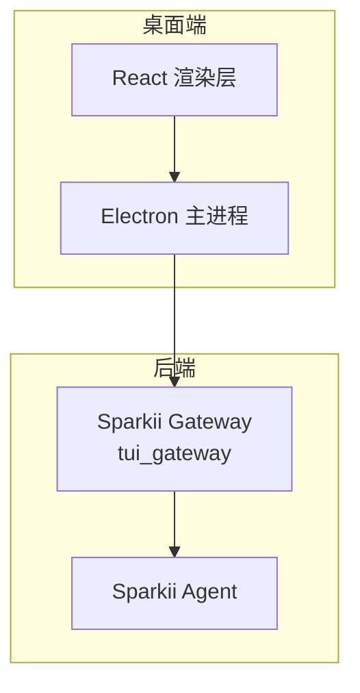
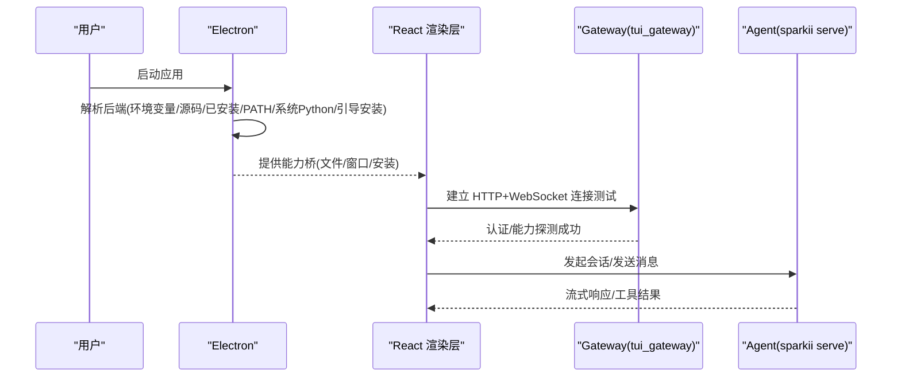
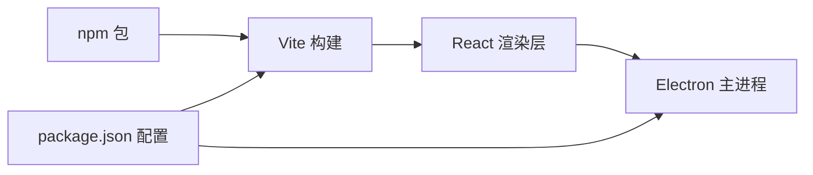

# 桌面应用使用指南

<cite>
**本文引用的文件**
- [README.md](file://README.md)
- [apps/desktop/README.md](file://apps/desktop/README.md)
- [apps/desktop/package.json](file://apps/desktop/package.json)
- [apps/desktop/DESIGN.md](file://apps/desktop/DESIGN.md)
- [apps/desktop/AGENTS.md](file://apps/desktop/AGENTS.md)
- [locales/zh.yaml](file://locales/zh.yaml)
</cite>

## 目录
1. [简介](#简介)
2. [项目结构](#项目结构)
3. [核心组件](#核心组件)
4. [架构总览](#架构总览)
5. [详细组件分析](#详细组件分析)
6. [依赖关系分析](#依赖关系分析)
7. [性能注意事项](#性能注意事项)
8. [故障排查指南](#故障排查指南)
9. [结论](#结论)
10. [附录](#附录)

## 简介
本指南面向首次或初次接触 Sparkii Desktop（基于 Sparkii Agent 的桌面客户端）的用户，提供从安装到日常使用的完整说明。内容涵盖系统要求、下载与安装步骤、界面区域说明、会话创建与管理、模型与提供商切换、内置工具使用、插件集成、个性化设置、常见问题与性能优化建议。文档力求对非技术用户友好，同时为进阶用户提供深入参考。

## 项目结构
Sparkii Desktop 是 Sparkii Agent 的原生桌面客户端，采用 Electron + React 构建，通过 tui_gateway 与后端 Sparkii Agent 通信。整体由三部分构成：
- Electron 主进程：负责本机能力（文件系统、窗口、安装更新等）和窄能力桥接
- React 渲染层：负责导航、展示与交互状态
- Sparkii Agent 后端：以 headless sparkii serve 运行，暴露 JSON-RPC/WebSocket API

图表来源
- [apps/desktop/README.md:88-122](file://apps/desktop/README.md#L88-L122)
- [apps/desktop/AGENTS.md:11-25](file://apps/desktop/AGENTS.md#L11-L25)

章节来源
- [apps/desktop/README.md:88-122](file://apps/desktop/README.md#L88-L122)
- [apps/desktop/AGENTS.md:11-25](file://apps/desktop/AGENTS.md#L11-L25)

## 核心组件
- 聊天与对话：流式响应、工具调用可视化、结构化摘要、历史消息
- 侧边预览面板：网页、文件、工具输出并排预览
- 文件浏览器：在应用内浏览工作目录
- 语音：输入与播放
- 设置与引导：提供方、模型、工具、凭据管理；首次运行向导
- 更新机制：后台检查更新，一键升级

章节来源
- [apps/desktop/README.md:10-19](file://apps/desktop/README.md#L10-L19)

## 架构总览
桌面应用通过“后端发现阶梯”定位可运行的 Sparkii 后端，并在本地或远程模式下连接 gateway。首次启动时，若未检测到可用运行时或已保存的远程连接，会引导用户选择“连接现有 Sparkii”或“本地安装”。

图表来源
- [apps/desktop/README.md:105-117](file://apps/desktop/README.md#L105-L117)
- [apps/desktop/README.md:131-148](file://apps/desktop/README.md#L131-L148)

章节来源
- [apps/desktop/README.md:105-148](file://apps/desktop/README.md#L105-L148)

## 详细组件分析

### 安装与环境要求
- 推荐方式：若已安装 Sparkii CLI，直接运行命令即可构建并启动 GUI，复用已有配置、密钥、会话和技能
- 预构建安装包：可通过官方站点获取 macOS、Windows、Linux 安装包
- 环境要求：安装器会自动处理 Python、Git、ripgrep 等依赖
- 更新：支持后台检测更新与一键升级；也可通过 CLI 更新

操作步骤
- 使用 CLI 启动桌面：执行对应命令后按提示完成首次设置
- 下载预安装包：访问官方站点，选择平台安装包进行安装
- 更新应用：通过应用内提示或 CLI 命令执行更新

章节来源
- [apps/desktop/README.md:23-55](file://apps/desktop/README.md#L23-L55)
- [apps/desktop/README.md:41-48](file://apps/desktop/README.md#L41-L48)

### 界面与功能区域
- 聊天为主界面：包含转录区与输入框，工具活动与结构化摘要在此呈现
- 侧边预览面板：并排显示网页、文件、工具输出
- 文件浏览器：在应用内浏览工作目录
- 设置与引导：提供方、模型、工具、凭据管理；首次运行向导
- 页面与覆盖层：聊天、技能、消息、工件为持久页面；设置、命令中心、定时任务、配置文件等为覆盖层

设计原则要点
- 扁平布局、无嵌套卡片；悬浮面板使用统一阴影与描边
- 单一原语控件（按钮、搜索、分段控制、开关等），避免重复造轮子
- 即时反馈：直接操作先绘制，失败时回滚可见
- 键盘优先：焦点所在表面拥有键位；Esc 关闭可关闭覆盖层

章节来源
- [apps/desktop/DESIGN.md:46-68](file://apps/desktop/DESIGN.md#L46-L68)
- [apps/desktop/DESIGN.md:70-88](file://apps/desktop/DESIGN.md#L70-L88)
- [apps/desktop/DESIGN.md:105-165](file://apps/desktop/DESIGN.md#L105-L165)
- [apps/desktop/DESIGN.md:179-221](file://apps/desktop/DESIGN.md#L179-L221)
- [apps/desktop/DESIGN.md:271-282](file://apps/desktop/DESIGN.md#L271-L282)

### 会话创建与管理
- 新建会话：通过聊天界面的“新建/重置”入口开始新对话
- 会话身份：区分稳定标识与运行时标识，避免历史丢失
- 上下文压缩：可在需要时压缩上下文，减少令牌占用
- 分支与恢复：支持会话分支与恢复，便于并行探索

章节来源
- [locales/zh.yaml:74-80](file://locales/zh.yaml#L74-L80)
- [locales/zh.yaml:92-101](file://locales/zh.yaml#L92-L101)

### 模型与提供商切换
- 通过命令或界面切换模型与提供商，无需修改代码
- 支持全局与会话级设置；可持久化保存
- 使用 Portal 可统一管理多个模型与工具网关

章节来源
- [README.md:107-118](file://README.md#L107-L118)
- [README.md:124-139](file://README.md#L124-L139)
- [locales/zh.yaml:30-47](file://locales/zh.yaml#L30-L47)

### 内置工具使用
- 文件操作：读写、预览、路径安全校验
- 代码执行：在隔离环境中执行脚本，查看输出
- 浏览器控制：云端或本地浏览器自动化，截图与交互
- 终端与日志：读取终端输出、打开预览、聚焦面板
- 其他工具：记忆、TTS、图像生成、视频生成、MCP 工具等

章节来源
- [tools/file_operations.py](file://tools/file_operations.py)
- [tools/code_execution_tool.py](file://tools/code_execution_tool.py)
- [tools/browser_tool.py](file://tools/browser_tool.py)
- [tools/read_terminal_tool.py](file://tools/read_terminal_tool.py)
- [tools/mcp_tool.py](file://tools/mcp_tool.py)

### 插件系统集成
- 插件生态：平台、模型提供商、图像/视频生成、看板、内存、Web 等插件
- 集成方式：通过插件注册表加载，扩展能力至会话与工具层
- 开发规范：遵循最小能力面、契约化接口、避免通用插件 ABI

章节来源
- [plugins/__init__.py](file://plugins/__init__.py)
- [plugins/plugin_utils.py](file://plugins/plugin_utils.py)
- [apps/desktop/AGENTS.md:145-163](file://apps/desktop/AGENTS.md#L145-L163)

### 个性化设置
- 主题与视觉：使用设计系统的颜色与阴影变量，保持统一外观
- 语言与国际化：多语言资源文件，界面文本通过 i18n 上下文获取
- 通知与反馈：错误、空态、加载中、日志视图等统一呈现
- 快捷键与行为：Esc 关闭覆盖层；焦点决定键位归属

章节来源
- [apps/desktop/DESIGN.md:89-103](file://apps/desktop/DESIGN.md#L89-L103)
- [apps/desktop/DESIGN.md:179-193](file://apps/desktop/DESIGN.md#L179-L193)
- [apps/desktop/DESIGN.md:283-290](file://apps/desktop/DESIGN.md#L283-L290)
- [apps/desktop/DESIGN.md:271-282](file://apps/desktop/DESIGN.md#L271-L282)

## 依赖关系分析
- 前端依赖：React、@assistant-ui/react、xterm、shiki、tailwind 等
- 构建与打包：Vite、Electron、electron-builder
- 运行时：Node.js 引擎版本要求；Electron 版本固定

图表来源
- [apps/desktop/package.json:10-65](file://apps/desktop/package.json#L10-L65)
- [apps/desktop/package.json:164-275](file://apps/desktop/package.json#L164-L275)

章节来源
- [apps/desktop/package.json:10-65](file://apps/desktop/package.json#L10-L65)
- [apps/desktop/package.json:164-275](file://apps/desktop/package.json#L164-L275)

## 性能注意事项
- 直接操作优先：先绘制再持久化，失败时回滚
- 热路径轻量：避免订阅重型树；指针事件每帧合并
- 昂贵表面常驻：终端、实时工具隐藏时不销毁
- 防抖动与批处理：高频更新合并，信号及时刷新
- 真实负载验证：用长转录、多面板、终端流式数据验证流畅度

章节来源
- [apps/desktop/DESIGN.md:251-269](file://apps/desktop/DESIGN.md#L251-L269)
- [apps/desktop/AGENTS.md:179-187](file://apps/desktop/AGENTS.md#L179-L187)

## 故障排查指南
- 启动失败：查看日志文件位置，包含后端输出与最近 Python 回溯
- 清理引导标记：强制重新进入首次引导流程
- 重建虚拟环境：修复损坏的 Python venv
- 权限问题：macOS 麦克风权限重置
- Windows 环境：清理引导标记与重建 venv

章节来源
- [apps/desktop/README.md:176-200](file://apps/desktop/README.md#L176-L200)

## 结论
Sparkii Desktop 将 Sparkii Agent 的强大能力封装为原生桌面体验，具备流式响应、工具可视化、文件与浏览器控制、语音与设置等功能。通过清晰的架构分层与设计系统，用户在本地或远程模式下均可获得一致且高效的交互体验。结合插件系统与多模型提供商，用户可按需扩展能力并获得个性化配置。

## 附录

### 快速上手清单
- 安装：使用 CLI 命令或下载预安装包
- 首次设置：选择提供商与模型，启用必要工具
- 开始聊天：发送消息，观察流式响应与工具活动
- 切换模型：使用命令或界面选项切换提供商与模型
- 使用工具：文件、代码执行、浏览器控制等按需启用
- 个性化：调整主题、语言、通知等设置

章节来源
- [apps/desktop/README.md:23-55](file://apps/desktop/README.md#L23-L55)
- [README.md:107-118](file://README.md#L107-L118)