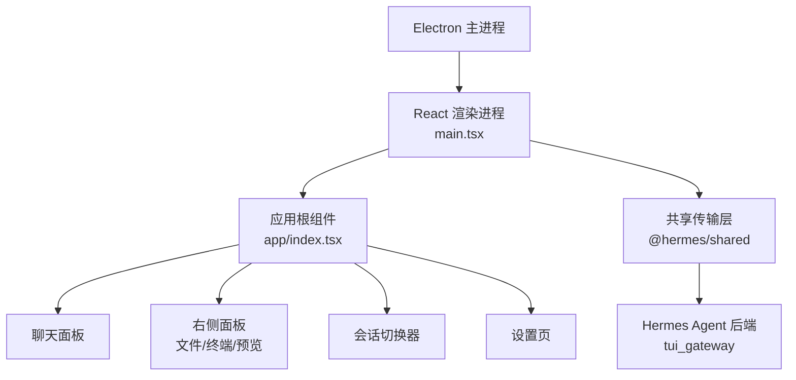
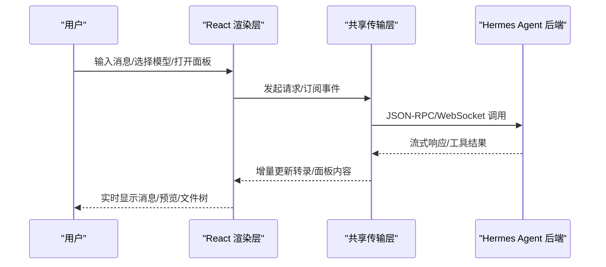
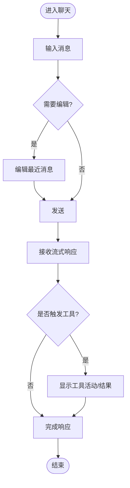
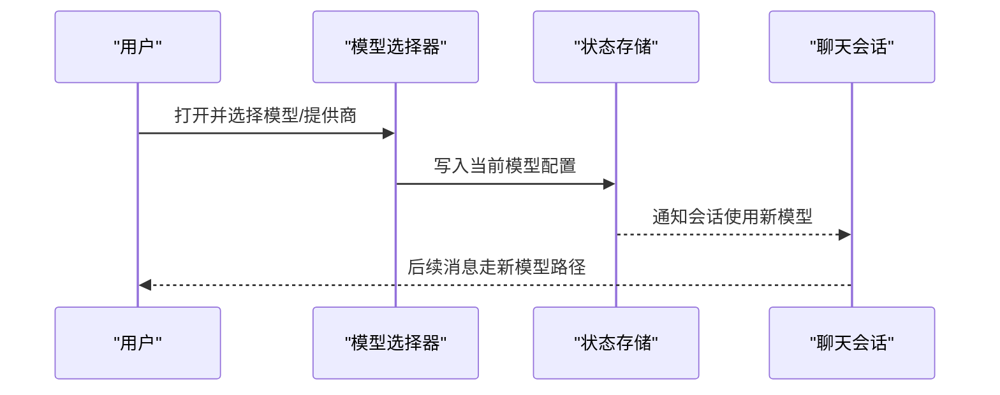
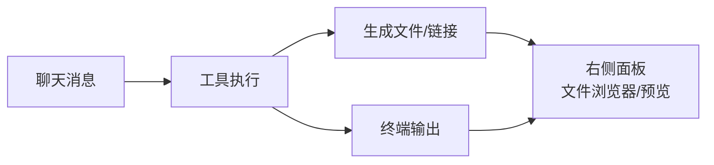
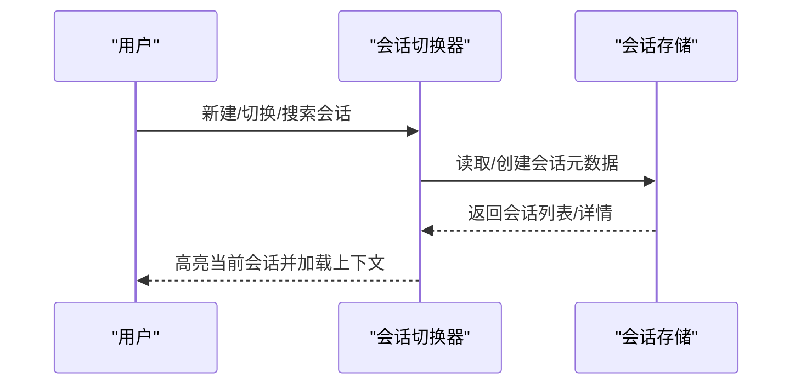
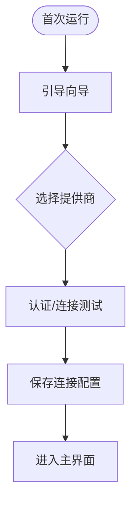
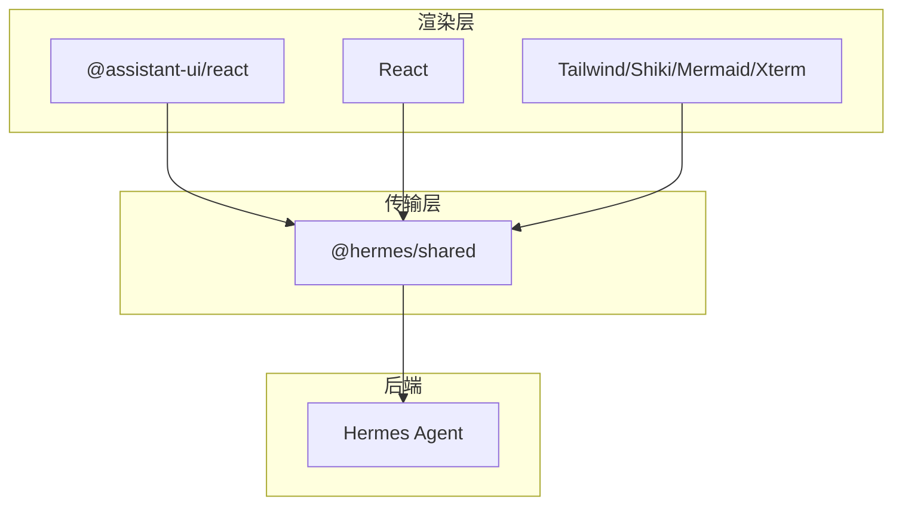

# 界面操作指南

<cite>
**本文引用的文件**
- [apps/desktop/README.md](file://apps/desktop/README.md)
- [apps/desktop/package.json](file://apps/desktop/package.json)
- [apps/desktop/src/main.tsx](file://apps/desktop/src/main.tsx)
- [apps/desktop/src/app/index.tsx](file://apps/desktop/src/app/index.tsx)
- [apps/desktop/src/components/chat/composer-dock.ts](file://apps/desktop/src/components/chat/composer-dock.ts)
- [apps/desktop/src/components/model-picker.tsx](file://apps/desktop/src/components/model-picker.tsx)
- [apps/desktop/src/app/right-sidebar/index.tsx](file://apps/desktop/src/app/right-sidebar/index.tsx)
- [apps/desktop/src/app/right-sidebar/files/index.tsx](file://apps/desktop/src/app/right-sidebar/files/index.tsx)
- [apps/desktop/src/app/right-sidebar/terminal/index.tsx](file://apps/desktop/src/app/right-sidebar/terminal/index.tsx)
- [apps/desktop/src/app/session/session-switcher.tsx](file://apps/desktop/src/app/session/session-switcher.tsx)
- [apps/desktop/src/app/settings/index.tsx](file://apps/desktop/src/app/settings/index.tsx)
</cite>

## 目录
1. [简介](#简介)
2. [项目结构](#项目结构)
3. [核心组件](#核心组件)
4. [架构总览](#架构总览)
5. [详细组件分析](#详细组件分析)
6. [依赖关系分析](#依赖关系分析)
7. [性能注意事项](#性能注意事项)
8. [故障排查指南](#故障排查指南)
9. [结论](#结论)
10. [附录](#附录)

## 简介
本指南面向首次使用 Sparkii（Hermes Desktop）桌面应用的用户，帮助你在几分钟内完成安装与上手。你将了解主界面的各个区域：聊天窗口、工具面板、文件浏览器、预览窗格等；学会创建与管理会话、切换 AI 模型与提供商；掌握消息输入、发送、编辑以及流式响应的显示方式；熟悉侧边栏的项目切换、会话历史与设置入口；并学习快捷键、拖拽、多窗口管理等高级特性。

## 项目结构
Sparkii 桌面应用由三层组成：
- Electron 外壳：负责进程管理、原生能力（文件系统、窗口）、预加载桥接。
- React 渲染层：负责路由、面板布局、交互状态与对话转录展示。
- Hermes Agent 后端：以无头 hermes serve 进程运行，通过 JSON-RPC/WebSocket 暴露 tui_gateway API。

启动流程要点：
- 应用入口在 main.tsx，挂载根组件并配置国际化、主题、查询客户端与路由。
- 应用根 index.tsx 采用贡献驱动模式，将面板、标题栏/状态栏项、快捷键、调色板命令、路由与主题统一注册到贡献注册表，核心功能与插件共用同一套扩展机制。
- 包配置定义了开发、构建、打包与平台目标，支持 macOS/Windows/Linux 的安装器生成。

图表来源
- [apps/desktop/src/main.tsx:16-82](file://apps/desktop/src/main.tsx#L16-L82)
- [apps/desktop/src/app/index.tsx:1-7](file://apps/desktop/src/app/index.tsx#L1-L7)
- [apps/desktop/package.json:13-65](file://apps/desktop/package.json#L13-L65)

章节来源
- [apps/desktop/README.md:88-122](file://apps/desktop/README.md#L88-L122)
- [apps/desktop/package.json:13-65](file://apps/desktop/package.json#L13-L65)
- [apps/desktop/src/main.tsx:16-82](file://apps/desktop/src/main.tsx#L16-L82)
- [apps/desktop/src/app/index.tsx:1-7](file://apps/desktop/src/app/index.tsx#L1-L7)

## 核心组件
- 聊天窗口：基于 @assistant-ui/react 的转录组件，支持流式响应、结构化工具摘要与工具活动实时显示。
- 工具面板：右侧面板包含文件浏览器、终端输出与预览窗格，可随对话内容动态打开。
- 文件浏览器：浏览工作区目录，支持快速预览与常用操作。
- 预览窗格：渲染网页、文件与工具输出，与聊天并列显示。
- 会话切换器：在侧边栏或浮层中切换不同会话与项目上下文。
- 模型选择器：在顶部或浮层中选择不同的 AI 模型与提供商。
- 设置页：管理提供商、模型、工具与凭据，完成首次运行引导。

章节来源
- [apps/desktop/README.md:10-19](file://apps/desktop/README.md#L10-L19)
- [apps/desktop/package.json:67-136](file://apps/desktop/package.json#L67-L136)

## 架构总览
桌面应用通过共享传输层连接后端服务，渲染层仅关注 UI 与交互。首次启动时，Electron 会解析并验证可用的后端运行时，若本地不可用则提供远程连接或引导安装。远程模式下，执行边界位于远端网关，所有工具、终端与文件操作均在远端执行。

图表来源
- [apps/desktop/README.md:95-122](file://apps/desktop/README.md#L95-L122)
- [apps/desktop/src/main.tsx:16-82](file://apps/desktop/src/main.tsx#L16-L82)

## 详细组件分析

### 聊天窗口与消息输入
- 输入与发送：在聊天输入框键入消息后发送，支持多行输入与附件。
- 编辑：可对最近一条消息进行编辑并重发。
- 流式响应：AI 回复以流式增量呈现，工具调用过程与结果逐步可见。
- 快捷操作：可通过快捷键聚焦输入框、发送消息、撤销编辑等（具体组合键可在“设置”中查看或自定义）。

图表来源
- [apps/desktop/src/components/chat/composer-dock.ts](file://apps/desktop/src/components/chat/composer-dock.ts)
- [apps/desktop/package.json:67-136](file://apps/desktop/package.json#L67-L136)

章节来源
- [apps/desktop/src/components/chat/composer-dock.ts](file://apps/desktop/src/components/chat/composer-dock.ts)
- [apps/desktop/package.json:67-136](file://apps/desktop/package.json#L67-L136)

### 模型与提供商切换
- 位置：通常在顶部工具栏或浮层中打开“模型选择器”。
- 操作：选择不同提供商与模型，确认后即时生效于新会话或当前会话。
- 提示：切换为软工作区变更，不会冷启动后端；已保存的连接与会话数据会被安全刷新。

图表来源
- [apps/desktop/src/components/model-picker.tsx](file://apps/desktop/src/components/model-picker.tsx)
- [apps/desktop/README.md:131-159](file://apps/desktop/README.md#L131-L159)

章节来源
- [apps/desktop/src/components/model-picker.tsx](file://apps/desktop/src/components/model-picker.tsx)
- [apps/desktop/README.md:131-159](file://apps/desktop/README.md#L131-L159)

### 右侧面板：文件浏览器、终端与预览
- 文件浏览器：浏览工作区目录，点击文件即可在预览窗格中查看。
- 终端：查看工具执行的终端输出，便于调试与排错。
- 预览窗格：渲染网页、代码片段与工具输出，支持缩放与滚动。
- 联动：当工具产生文件或网页链接时，自动在右侧面板打开对应预览。

图表来源
- [apps/desktop/src/app/right-sidebar/index.tsx](file://apps/desktop/src/app/right-sidebar/index.tsx)
- [apps/desktop/src/app/right-sidebar/files/index.tsx](file://apps/desktop/src/app/right-sidebar/files/index.tsx)
- [apps/desktop/src/app/right-sidebar/terminal/index.tsx](file://apps/desktop/src/app/right-sidebar/terminal/index.tsx)

章节来源
- [apps/desktop/src/app/right-sidebar/index.tsx](file://apps/desktop/src/app/right-sidebar/index.tsx)
- [apps/desktop/src/app/right-sidebar/files/index.tsx](file://apps/desktop/src/app/right-sidebar/files/index.tsx)
- [apps/desktop/src/app/right-sidebar/terminal/index.tsx](file://apps/desktop/src/app/right-sidebar/terminal/index.tsx)

### 会话管理与切换
- 新建会话：在侧边栏或主界面点击“新建会话”，可选择默认项目与工作目录。
- 切换会话：通过会话切换器在不同会话间快速跳转，保留各自上下文。
- 项目切换：在侧边栏切换项目，影响文件浏览器与工具的工作目录。
- 历史与搜索：支持按时间、关键词检索历史会话。

图表来源
- [apps/desktop/src/app/session/session-switcher.tsx](file://apps/desktop/src/app/session/session-switcher.tsx)
- [apps/desktop/README.md:150-159](file://apps/desktop/README.md#L150-L159)

章节来源
- [apps/desktop/src/app/session/session-switcher.tsx](file://apps/desktop/src/app/session/session-switcher.tsx)
- [apps/desktop/README.md:150-159](file://apps/desktop/README.md#L150-L159)

### 设置与首次运行引导
- 首次运行：引导你选择提供商与模型，完成认证与连接测试。
- 提供商管理：添加/编辑/删除不同 AI 提供商的配置。
- 工具与凭据：启用/禁用工具，管理密钥与 OAuth 登录。
- 更新检查：后台检查更新并提供一键升级。

图表来源
- [apps/desktop/README.md:131-149](file://apps/desktop/README.md#L131-L149)
- [apps/desktop/src/app/settings/index.tsx](file://apps/desktop/src/app/settings/index.tsx)

章节来源
- [apps/desktop/README.md:131-149](file://apps/desktop/README.md#L131-L149)
- [apps/desktop/src/app/settings/index.tsx](file://apps/desktop/src/app/settings/index.tsx)

### 快捷键、拖拽与多窗口
- 快捷键：聚焦输入框、发送消息、打开命令面板、切换面板等（可在“设置”中查看与自定义）。
- 拖拽：支持从文件浏览器拖拽文件到聊天输入框或编辑器。
- 多窗口：支持独立浮窗（如快速入口、唤醒指示器等），便于多任务处理。

章节来源
- [apps/desktop/src/main.tsx:40-48](file://apps/desktop/src/main.tsx#L40-L48)
- [apps/desktop/package.json:67-136](file://apps/desktop/package.json#L67-L136)

## 依赖关系分析
- 渲染层依赖：React、@assistant-ui/react、Tailwind、Shiki、Mermaid、Xterm 等用于聊天、代码高亮、图表与终端。
- 传输层：@hermes/shared 提供与后端的通信抽象。
- 构建与打包：Vite + Electron Builder，支持多平台安装包生成。

图表来源
- [apps/desktop/package.json:67-136](file://apps/desktop/package.json#L67-L136)

章节来源
- [apps/desktop/package.json:67-136](file://apps/desktop/package.json#L67-L136)

## 性能注意事项
- 流式响应与大量事件下，避免不必要的重渲染；应用已优化全局 TooltipProvider 以减少无关重绘。
- 大文件预览建议使用分页或懒加载；终端输出过长时可考虑截断或导出日志。
- 切换模型/连接为软工作区变更，避免冷启动带来的卡顿。

章节来源
- [apps/desktop/src/main.tsx:56-71](file://apps/desktop/src/main.tsx#L56-L71)
- [apps/desktop/README.md:155-159](file://apps/desktop/README.md#L155-L159)

## 故障排查指南
- 启动失败：查看 HERMES_HOME/logs/desktop.log，定位后端输出与 Python 回溯。
- 麦克风权限（macOS）：若音频无法录制，尝试重置麦克风权限。
- 重新安装环境：清理引导标记与虚拟环境，重新引导安装。
- 远程模式：确认网关可达且 WebSocket 连通；保存的连接会在下次启动自动复用。

章节来源
- [apps/desktop/README.md:176-200](file://apps/desktop/README.md#L176-L200)

## 结论
通过本指南，你可以快速掌握 Sparkii 桌面应用的核心操作：创建与管理会话、切换模型与提供商、使用聊天与右侧面板、利用快捷键与拖拽提升效率，并在遇到问题时进行基础排查。建议结合“设置”中的帮助与社区文档进一步探索高级功能。

## 附录
- 安装与更新：通过 CLI 或官网下载预构建安装器；支持一键更新。
- 开发模式：在仓库根目录安装依赖后，进入 apps/desktop 运行开发服务器。
- 构建与打包：使用提供的脚本生成各平台安装包。

章节来源
- [apps/desktop/README.md:23-86](file://apps/desktop/README.md#L23-L86)
- [apps/desktop/package.json:13-65](file://apps/desktop/package.json#L13-L65)