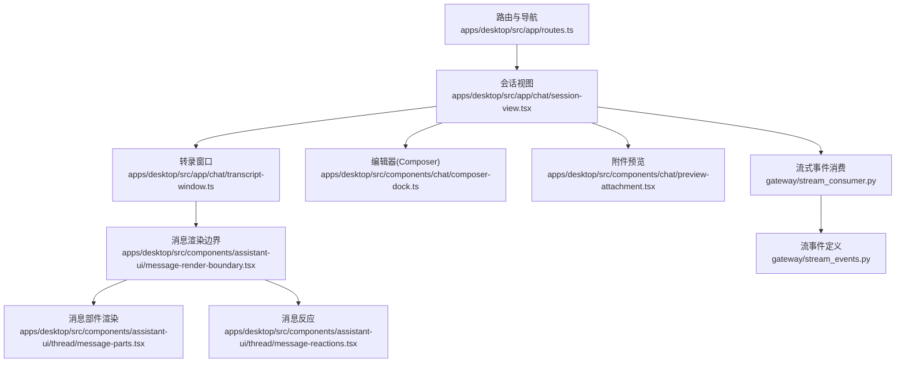
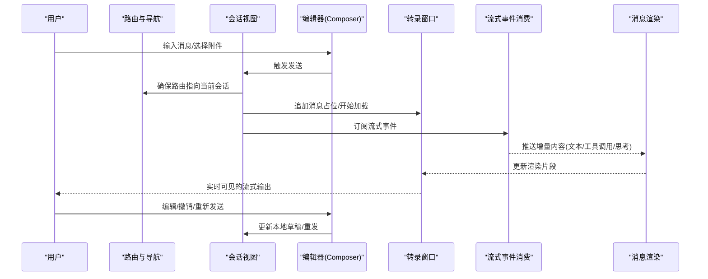
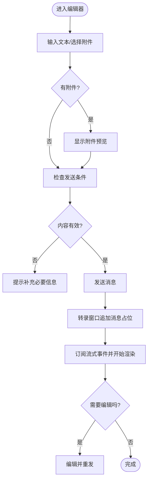
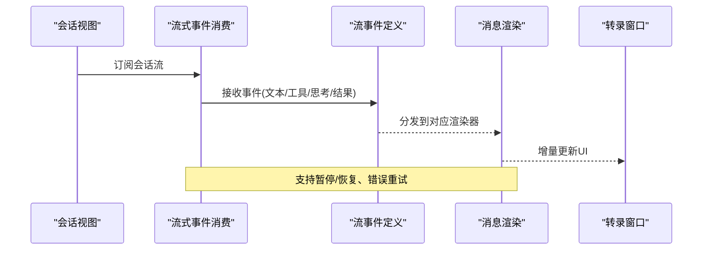
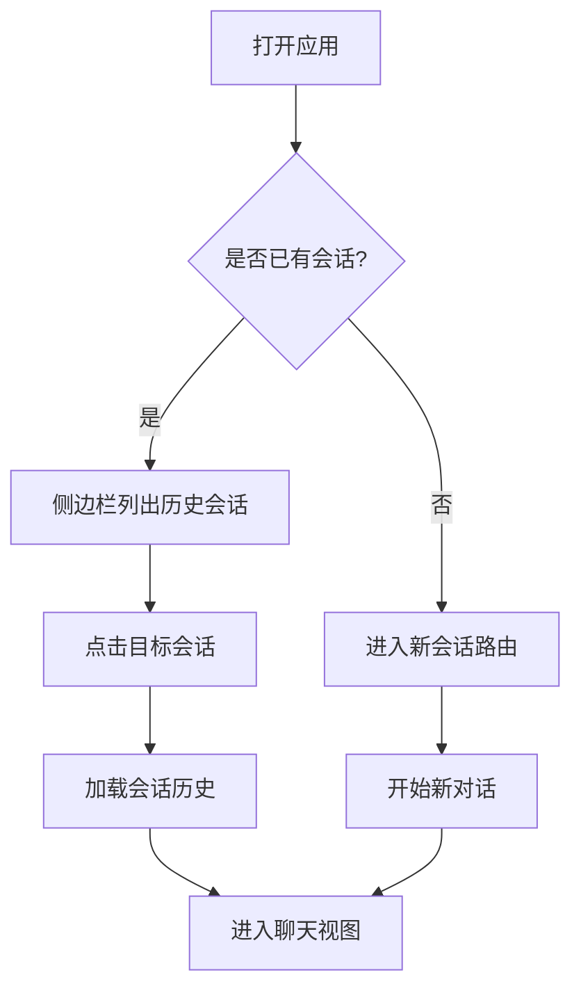
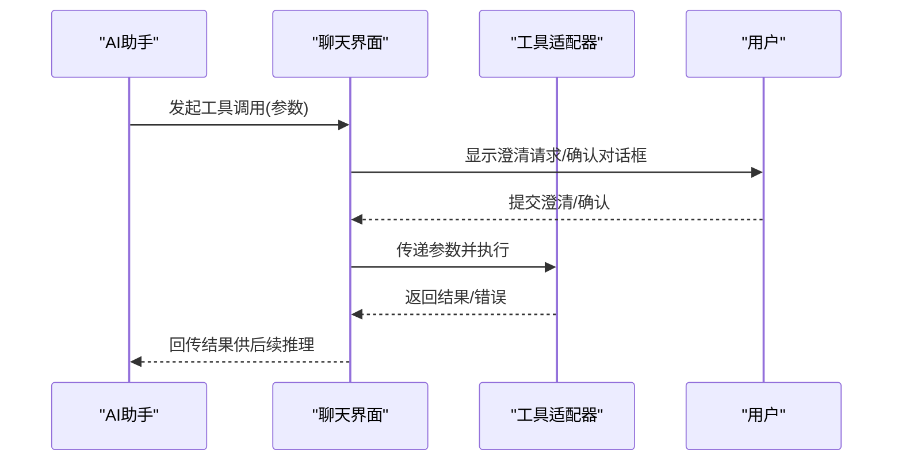
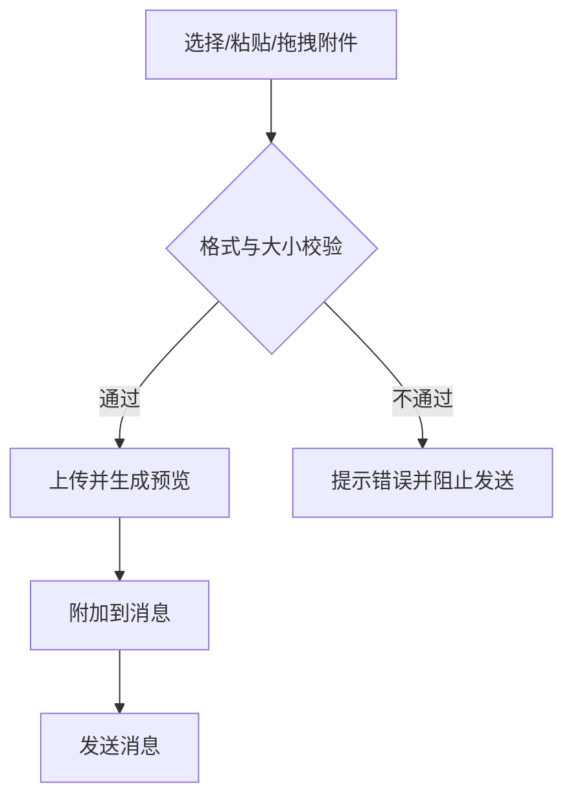
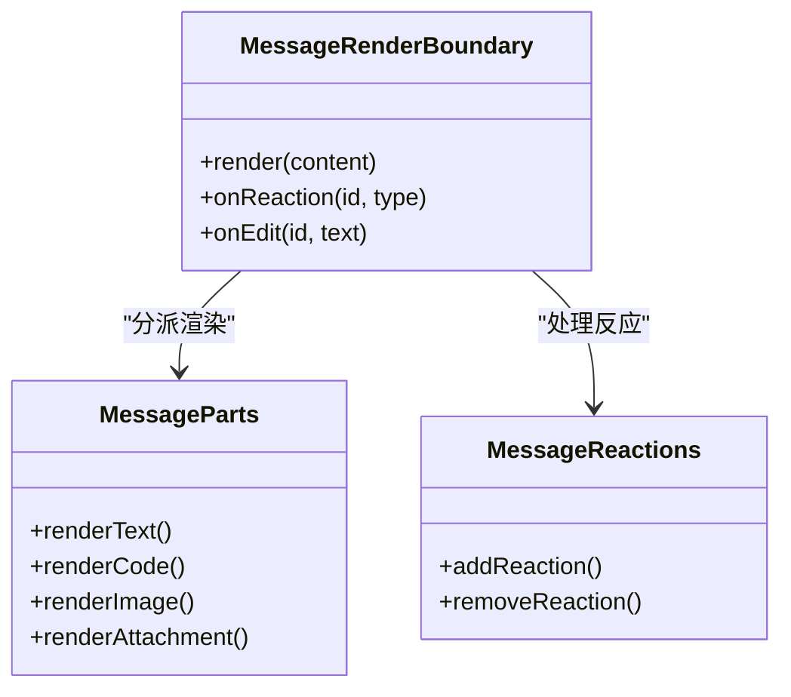
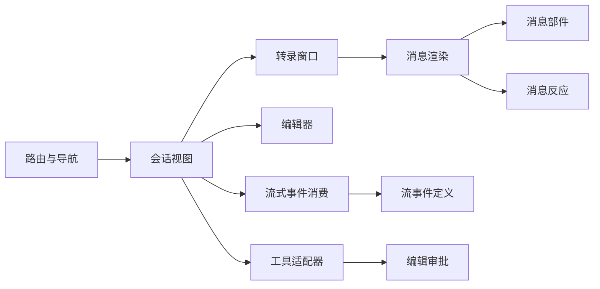

# 聊天界面操作

<cite>
**本文引用的文件**
- [routes.ts](file://apps/desktop/src/app/routes.ts)
- [index.tsx](file://apps/desktop/src/app/chat/index.tsx)
- [session-view.tsx](file://apps/desktop/src/app/chat/session-view.tsx)
- [transcript-window.ts](file://apps/desktop/src/app/chat/transcript-window.ts)
- [thread-loading.ts](file://apps/desktop/src/app/chat/thread-loading.ts)
- [composer-dock.ts](file://apps/desktop/src/components/chat/composer-dock.ts)
- [message-render-boundary.tsx](file://apps/desktop/src/components/assistant-ui/message-render-boundary.tsx)
- [message-parts.tsx](file://apps/desktop/src/components/assistant-ui/thread/message-parts.tsx)
- [message-reactions.tsx](file://apps/desktop/src/components/assistant-ui/thread/message-reactions.tsx)
- [preview-attachment.tsx](file://apps/desktop/src/components/chat/preview-attachment.tsx)
- [edit_approval.ts](file://acp_adapter/edit_approval.ts)
- [tools.py](file://acp_adapter/tools.py)
- [stream_events.py](file://gateway/stream_events.py)
- [stream_consumer.py](file://gateway/stream_consumer.py)
</cite>

## 目录
1. [简介](#简介)
2. [项目结构](#项目结构)
3. [核心组件](#核心组件)
4. [架构总览](#架构总览)
5. [详细组件分析](#详细组件分析)
6. [依赖关系分析](#依赖关系分析)
7. [性能注意事项](#性能注意事项)
8. [故障排查指南](#故障排查指南)
9. [结论](#结论)
10. [附录：快捷键与操作步骤](#附录快捷键与操作步骤)

## 简介
本指南面向桌面端聊天界面的使用者，聚焦对话窗口的日常操作：消息输入、发送、编辑；流式响应的显示与交互；会话的创建、切换与管理；工具调用的内联展示与交互（澄清请求、确认对话框）；文件附件的上传与处理；以及常用快捷键。文档同时提供架构图与时序图，帮助理解数据流与控制流，便于快速上手与排障。

## 项目结构
聊天功能由“路由与导航”“会话视图”“转录窗口”“编辑器（Composer）”“消息渲染”“流式事件消费”等模块协作完成。关键路径如下：
- 路由与导航：定义新会话与会话页面路由，决定工作区是否显示完整页面或聊天。
- 会话视图：承载当前会话的消息列表、输入框、侧边栏等。
- 转录窗口：负责消息历史滚动、加载状态与渲染边界。
- 编辑器（Composer）：消息输入、附件选择、发送与编辑。
- 消息渲染：将不同内容类型（文本、代码、图片、附件、反应等）渲染为可交互UI。
- 流式事件：后端以事件流形式推送增量内容，前端逐步更新显示。

**图表来源**
- [routes.ts:1-264](file://apps/desktop/src/app/routes.ts#L1-L264)
- [session-view.tsx](file://apps/desktop/src/app/chat/session-view.tsx)
- [transcript-window.ts](file://apps/desktop/src/app/chat/transcript-window.ts)
- [composer-dock.ts](file://apps/desktop/src/components/chat/composer-dock.ts)
- [message-render-boundary.tsx](file://apps/desktop/src/components/assistant-ui/message-render-boundary.tsx)
- [message-parts.tsx](file://apps/desktop/src/components/assistant-ui/thread/message-parts.tsx)
- [message-reactions.tsx](file://apps/desktop/src/components/assistant-ui/thread/message-reactions.tsx)
- [preview-attachment.tsx](file://apps/desktop/src/components/chat/preview-attachment.tsx)
- [stream_consumer.py](file://gateway/stream_consumer.py)
- [stream_events.py](file://gateway/stream_events.py)

**章节来源**
- [routes.ts:1-264](file://apps/desktop/src/app/routes.ts#L1-L264)

## 核心组件
- 路由与导航
  - 定义新会话路由与会话路由前缀，支持从路由解析会话ID，并判断是否为“新会话”。
  - 在工作区显示非聊天页面时，自动前置工作区面板，避免遮挡。
- 会话视图
  - 组合消息列表、输入框、侧边栏、工具调用区域等，管理会话生命周期与状态。
- 转录窗口
  - 维护消息历史滚动、加载态、底部对齐按钮等，保证长对话体验流畅。
- 编辑器（Composer）
  - 提供多行输入、附件选择、发送、撤销、编辑等功能入口。
- 消息渲染
  - 统一渲染边界，按内容类型分派到具体部件（代码、图片、附件、反应等）。
- 流式事件
  - 消费后端增量事件，实时更新消息内容，支持思考过程、工具调用、最终结果等。

**章节来源**
- [routes.ts:1-264](file://apps/desktop/src/app/routes.ts#L1-L264)
- [session-view.tsx](file://apps/desktop/src/app/chat/session-view.tsx)
- [transcript-window.ts](file://apps/desktop/src/app/chat/transcript-window.ts)
- [composer-dock.ts](file://apps/desktop/src/components/chat/composer-dock.ts)
- [message-render-boundary.tsx](file://apps/desktop/src/components/assistant-ui/message-render-boundary.tsx)
- [message-parts.tsx](file://apps/desktop/src/components/assistant-ui/thread/message-parts.tsx)
- [message-reactions.tsx](file://apps/desktop/src/components/assistant-ui/thread/message-reactions.tsx)
- [preview-attachment.tsx](file://apps/desktop/src/components/chat/preview-attachment.tsx)
- [stream_consumer.py](file://gateway/stream_consumer.py)
- [stream_events.py](file://gateway/stream_events.py)

## 架构总览
下图展示了从用户输入到流式响应更新的端到端流程，包括路由、会话视图、编辑器、转录窗口、消息渲染与流式事件消费。

**图表来源**
- [routes.ts:1-264](file://apps/desktop/src/app/routes.ts#L1-L264)
- [session-view.tsx](file://apps/desktop/src/app/chat/session-view.tsx)
- [transcript-window.ts](file://apps/desktop/src/app/chat/transcript-window.ts)
- [composer-dock.ts](file://apps/desktop/src/components/chat/composer-dock.ts)
- [stream_consumer.py](file://gateway/stream_consumer.py)
- [stream_events.py](file://gateway/stream_events.py)

## 详细组件分析

### 消息输入、发送与编辑
- 输入与附件
  - 在编辑器中支持多行输入与附件选择；附件会在消息上方或输入区附近预览，便于确认。
  - 支持粘贴图片、拖拽文件等常见方式（取决于平台能力）。
- 发送
  - 通过编辑器发送按钮或快捷键触发；发送后转录窗口立即显示“正在生成”的状态。
- 编辑
  - 对已发送消息可进行编辑并重发；编辑会替换对应消息条目并继续流式输出。
- 撤销
  - 支持撤销最近一次编辑或发送动作，恢复至上一稳定状态。

**图表来源**
- [composer-dock.ts](file://apps/desktop/src/components/chat/composer-dock.ts)
- [transcript-window.ts](file://apps/desktop/src/app/chat/transcript-window.ts)
- [preview-attachment.tsx](file://apps/desktop/src/components/chat/preview-attachment.tsx)

**章节来源**
- [composer-dock.ts](file://apps/desktop/src/components/chat/composer-dock.ts)
- [transcript-window.ts](file://apps/desktop/src/app/chat/transcript-window.ts)
- [preview-attachment.tsx](file://apps/desktop/src/components/chat/preview-attachment.tsx)

### 流式响应的显示与交互
- 显示方式
  - 后端以事件流形式推送增量内容，前端消费并逐步更新消息，实现“打字机”效果。
  - 支持多种内容类型：纯文本、代码块、思考过程、工具调用、最终结果等。
- 交互方式
  - 在流式过程中仍可继续输入（草稿保存），但通常建议等待关键阶段完成后再编辑。
  - 对于工具调用，可在消息内直接进行确认或澄清，无需跳转页面。
- 错误与中断
  - 若流中断或出错，转录窗口会显示错误摘要并提供重试或取消选项。

**图表来源**
- [stream_consumer.py](file://gateway/stream_consumer.py)
- [stream_events.py](file://gateway/stream_events.py)
- [message-render-boundary.tsx](file://apps/desktop/src/components/assistant-ui/message-render-boundary.tsx)
- [transcript-window.ts](file://apps/desktop/src/app/chat/transcript-window.ts)

**章节来源**
- [stream_consumer.py](file://gateway/stream_consumer.py)
- [stream_events.py](file://gateway/stream_events.py)
- [message-render-boundary.tsx](file://apps/desktop/src/components/assistant-ui/message-render-boundary.tsx)
- [transcript-window.ts](file://apps/desktop/src/app/chat/transcript-window.ts)

### 会话创建、切换与管理
- 创建新会话
  - 通过路由进入新会话页；或在侧边栏点击“新建会话”。
  - 新会话默认无历史消息，可直接开始对话。
- 切换会话
  - 在侧边栏点击目标会话即可切换；路由会更新为对应会话ID。
  - 切换时转录窗口会加载该会话的历史消息。
- 管理历史
  - 支持搜索、筛选、导出（视插件能力而定）。
  - 可折叠/展开长对话中的工具调用与思考过程，提升可读性。

**图表来源**
- [routes.ts:1-264](file://apps/desktop/src/app/routes.ts#L1-L264)
- [session-view.tsx](file://apps/desktop/src/app/chat/session-view.tsx)

**章节来源**
- [routes.ts:1-264](file://apps/desktop/src/app/routes.ts#L1-L264)
- [session-view.tsx](file://apps/desktop/src/app/chat/session-view.tsx)

### 工具调用的内联显示与交互
- 内联显示
  - 工具调用在消息中以可折叠区块呈现，包含参数、执行状态、结果摘要。
  - 支持“思考过程”与“最终结果”分段显示，便于追踪推理链。
- 交互方式
  - 澄清请求：当工具需要更多信息时，会在消息中弹出澄清表单，用户填写后继续。
  - 确认对话框：涉及写操作或敏感行为时，弹出确认框，需用户明确同意。
- 失败与重试
  - 工具执行失败会显示错误原因，并提供重试或替代方案。

**图表来源**
- [tools.py](file://acp_adapter/tools.py)
- [edit_approval.ts](file://acp_adapter/edit_approval.ts)
- [message-parts.tsx](file://apps/desktop/src/components/assistant-ui/thread/message-parts.tsx)

**章节来源**
- [tools.py](file://acp_adapter/tools.py)
- [edit_approval.ts](file://acp_adapter/edit_approval.ts)
- [message-parts.tsx](file://apps/desktop/src/components/assistant-ui/thread/message-parts.tsx)

### 文件附件的上传与处理
- 上传方式
  - 支持拖拽、粘贴、选择文件等方式添加附件；图片会自动预览。
- 处理流程
  - 附件随消息一起发送；后端可能进行安全校验与格式转换。
  - 大文件或特殊格式可能异步处理，界面会显示进度或占位。
- 查看与管理
  - 在消息中可查看附件缩略图或下载链接；支持删除或替换。

**图表来源**
- [preview-attachment.tsx](file://apps/desktop/src/components/chat/preview-attachment.tsx)

**章节来源**
- [preview-attachment.tsx](file://apps/desktop/src/components/chat/preview-attachment.tsx)

### 消息渲染与反应
- 渲染边界
  - 统一的消息渲染边界负责安全与性能优化，避免重渲染开销。
- 内容类型
  - 文本、代码高亮、图片、附件、表格、链接等。
- 反应与互动
  - 支持对消息添加反应（点赞、收藏等），便于标记重要内容。

**图表来源**
- [message-render-boundary.tsx](file://apps/desktop/src/components/assistant-ui/message-render-boundary.tsx)
- [message-parts.tsx](file://apps/desktop/src/components/assistant-ui/thread/message-parts.tsx)
- [message-reactions.tsx](file://apps/desktop/src/components/assistant-ui/thread/message-reactions.tsx)

**章节来源**
- [message-render-boundary.tsx](file://apps/desktop/src/components/assistant-ui/message-render-boundary.tsx)
- [message-parts.tsx](file://apps/desktop/src/components/assistant-ui/thread/message-parts.tsx)
- [message-reactions.tsx](file://apps/desktop/src/components/assistant-ui/thread/message-reactions.tsx)

## 依赖关系分析
- 路由与会话视图强耦合：路由决定会话ID与视图模式，会话视图据此加载历史与状态。
- 编辑器与转录窗口协作：编辑器负责输入与发送，转录窗口负责历史滚动与加载态。
- 消息渲染与流式事件解耦：渲染边界只关注内容类型，流式事件消费负责增量更新。
- 工具适配器与编辑审批：工具调用通过适配器执行，编辑类操作需经审批流程。

**图表来源**
- [routes.ts:1-264](file://apps/desktop/src/app/routes.ts#L1-L264)
- [session-view.tsx](file://apps/desktop/src/app/chat/session-view.tsx)
- [transcript-window.ts](file://apps/desktop/src/app/chat/transcript-window.ts)
- [composer-dock.ts](file://apps/desktop/src/components/chat/composer-dock.ts)
- [message-render-boundary.tsx](file://apps/desktop/src/components/assistant-ui/message-render-boundary.tsx)
- [message-parts.tsx](file://apps/desktop/src/components/assistant-ui/thread/message-parts.tsx)
- [message-reactions.tsx](file://apps/desktop/src/components/assistant-ui/thread/message-reactions.tsx)
- [stream_consumer.py](file://gateway/stream_consumer.py)
- [stream_events.py](file://gateway/stream_events.py)
- [tools.py](file://acp_adapter/tools.py)
- [edit_approval.ts](file://acp_adapter/edit_approval.ts)

**章节来源**
- [routes.ts:1-264](file://apps/desktop/src/app/routes.ts#L1-L264)
- [session-view.tsx](file://apps/desktop/src/app/chat/session-view.tsx)
- [transcript-window.ts](file://apps/desktop/src/app/chat/transcript-window.ts)
- [composer-dock.ts](file://apps/desktop/src/components/chat/composer-dock.ts)
- [message-render-boundary.tsx](file://apps/desktop/src/components/assistant-ui/message-render-boundary.tsx)
- [message-parts.tsx](file://apps/desktop/src/components/assistant-ui/thread/message-parts.tsx)
- [message-reactions.tsx](file://apps/desktop/src/components/assistant-ui/thread/message-reactions.tsx)
- [stream_consumer.py](file://gateway/stream_consumer.py)
- [stream_events.py](file://gateway/stream_events.py)
- [tools.py](file://acp_adapter/tools.py)
- [edit_approval.ts](file://acp_adapter/edit_approval.ts)

## 性能注意事项
- 流式渲染
  - 增量更新减少重绘，注意避免在高频事件中执行昂贵计算。
- 长对话
  - 转录窗口采用虚拟滚动或分页加载，避免一次性渲染全部历史。
- 附件处理
  - 大文件异步处理，优先显示占位与进度，降低阻塞。
- 工具调用
  - 超时与重试策略应合理配置，避免频繁重试导致雪崩。

[本节为通用指导，不直接分析具体文件]

## 故障排查指南
- 流式输出卡住
  - 检查网络连接与后端服务状态；尝试刷新会话或重新订阅流。
  - 查看浏览器控制台是否有WebSocket错误或超时日志。
- 工具调用失败
  - 确认权限与凭据配置；查看工具适配器的错误摘要。
  - 使用“重试”或“更换工具”选项恢复。
- 附件无法上传
  - 检查文件格式与大小限制；尝试压缩或转换格式。
  - 查看网络请求是否被拦截或跨域限制。
- 会话切换异常
  - 确认路由与会话ID匹配；清除缓存后重试。

**章节来源**
- [stream_consumer.py](file://gateway/stream_consumer.py)
- [stream_events.py](file://gateway/stream_events.py)
- [tools.py](file://acp_adapter/tools.py)
- [edit_approval.ts](file://acp_adapter/edit_approval.ts)

## 结论
本指南系统梳理了聊天界面的核心操作与底层机制，覆盖消息输入发送、流式响应、会话管理、工具调用与附件处理等关键场景。通过图示与步骤说明，帮助用户高效掌握聊天功能，并在遇到问题时快速定位与解决。

[本节为总结，不直接分析具体文件]

## 附录：快捷键与操作步骤
- 发送消息
  - 在编辑器中按下回车键发送；如需换行可使用组合键。
- 撤销操作
  - 使用撤销快捷键回退最近一次编辑或发送。
- 插入附件
  - 拖拽文件到输入区或点击附件按钮选择文件。
- 创建新会话
  - 点击侧边栏“新建会话”或使用命令面板创建。
- 切换会话
  - 在侧边栏点击目标会话；或通过命令面板搜索并跳转。
- 编辑消息
  - 在消息上点击编辑按钮修改内容并重发。
- 工具调用交互
  - 在消息内点击“澄清”或“确认”按钮完成交互。
- 截图与记录
  - 使用系统截图工具记录问题；必要时附上控制台日志以便排查。

[本节为操作指引，不直接分析具体文件]