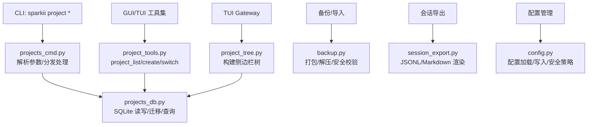
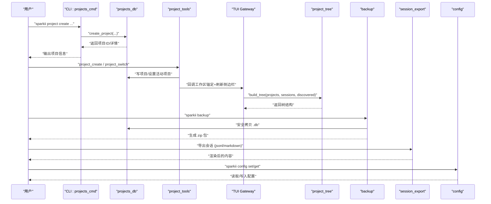
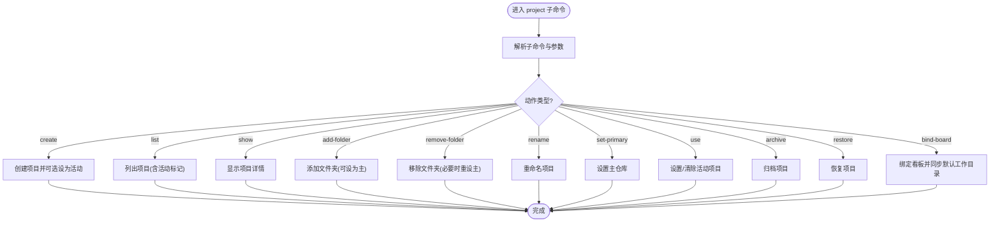
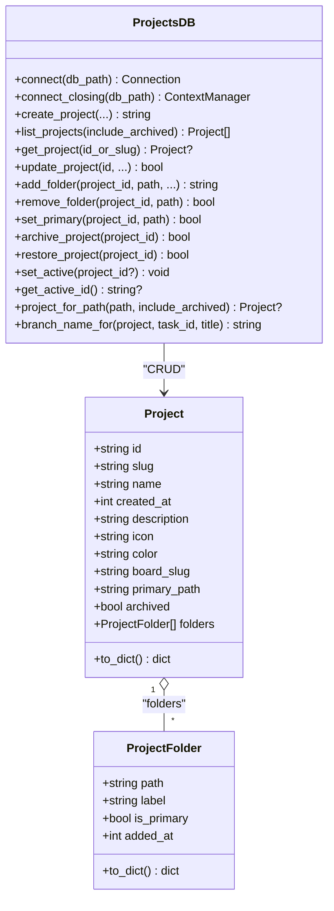
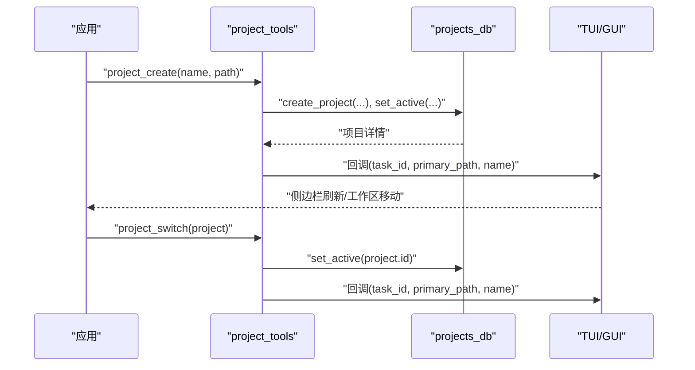
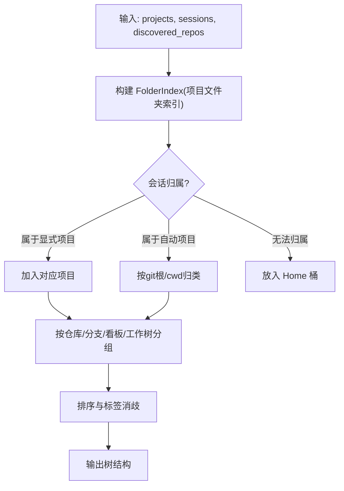
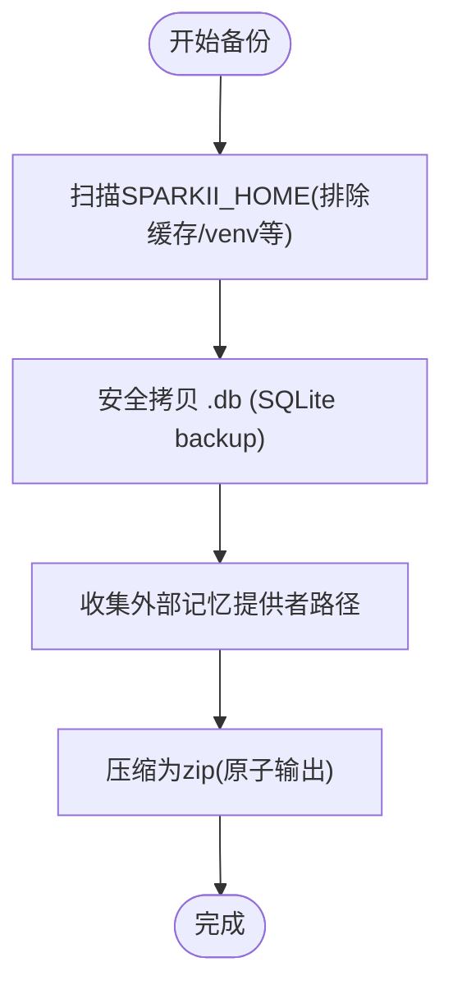
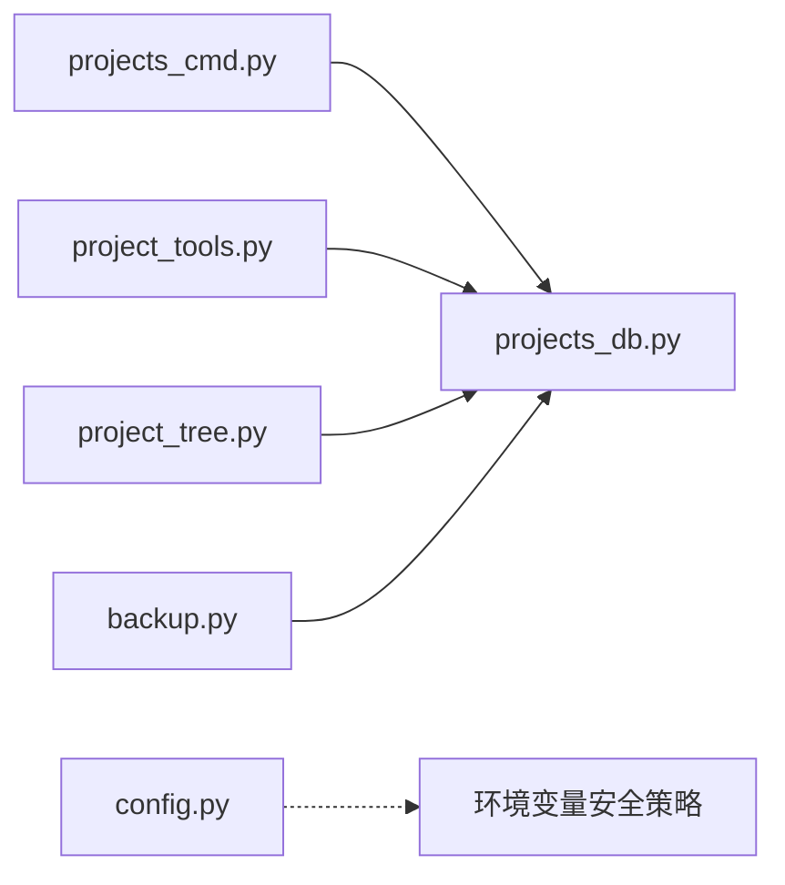

# 项目管理操作

<cite>
**本文引用的文件**
- [sparkii_cli/projects_cmd.py](file://sparkii_cli/projects_cmd.py)
- [sparkii_cli/projects_db.py](file://sparkii_cli/projects_db.py)
- [tools/project_tools.py](file://tools/project_tools.py)
- [tui_gateway/project_tree.py](file://tui_gateway/project_tree.py)
- [sparkii_cli/backup.py](file://sparkii_cli/backup.py)
- [sparkii_cli/session_export.py](file://sparkii_cli/session_export.py)
- [sparkii_cli/config.py](file://sparkii_cli/config.py)
</cite>

## 目录
1. [简介](#简介)
2. [项目结构](#项目结构)
3. [核心组件](#核心组件)
4. [架构总览](#架构总览)
5. [详细组件分析](#详细组件分析)
6. [依赖关系分析](#依赖关系分析)
7. [性能考虑](#性能考虑)
8. [故障排查指南](#故障排查指南)
9. [结论](#结论)
10. [附录](#附录)

## 简介
本操作指南面向“侧边栏的项目列表管理与项目切换”，覆盖以下目标：
- 如何添加新项目、配置工作目录、设置项目上下文
- 项目间的隔离机制与数据共享方式
- 项目的导入导出（配置文件与会话历史迁移）
- 项目模板与自定义项目结构
- 项目设置（权限、环境变量等）
- 常见场景示例（团队协作、多项目切换）

## 项目结构
本项目通过“项目（Project）”作为用户可命名的多文件夹工作区，用于在桌面端侧边栏中分组会话、绑定看板任务与工作树。关键实现包括：
- CLI 命令层：提供创建、列出、显示、增删文件夹、重命名、设置主仓库、归档/恢复、绑定看板等操作入口
- 持久化存储：按 Profile 的 SQLite 数据库 projects.db，维护项目元数据、文件夹映射、活动项目指针、发现缓存等
- 工具集暴露：为 GUI/TUI 会话提供 project_list / project_create / project_switch 工具，支持创建/切换后自动锚定工作区并刷新侧边栏
- 侧边栏树构建：将项目、仓库、分支/看板/工作树、会话聚合为统一的树形结构，保证与旧客户端兼容且可测试

图表来源
- [sparkii_cli/projects_cmd.py:22-141](file://sparkii_cli/projects_cmd.py#L22-L141)
- [sparkii_cli/projects_db.py:44-179](file://sparkii_cli/projects_db.py#L44-L179)
- [tools/project_tools.py:69-131](file://tools/project_tools.py#L69-L131)
- [tui_gateway/project_tree.py:537-769](file://tui_gateway/project_tree.py#L537-L769)
- [sparkii_cli/backup.py:581-795](file://sparkii_cli/backup.py#L581-L795)
- [sparkii_cli/session_export.py:21-60](file://sparkii_cli/session_export.py#L21-L60)
- [sparkii_cli/config.py:1-15](file://sparkii_cli/config.py#L1-L15)

章节来源
- [sparkii_cli/projects_cmd.py:22-141](file://sparkii_cli/projects_cmd.py#L22-L141)
- [sparkii_cli/projects_db.py:44-179](file://sparkii_cli/projects_db.py#L44-L179)
- [tools/project_tools.py:69-131](file://tools/project_tools.py#L69-L131)
- [tui_gateway/project_tree.py:537-769](file://tui_gateway/project_tree.py#L537-L769)

## 核心组件
- 项目命令层（CLI）
  - 提供 create/list/show/add-folder/remove-folder/rename/set-primary/use/archive/restore/bind-board 等子命令
  - 统一错误码与帮助输出，封装连接与项目解析
- 项目数据库（projects_db）
  - 按 Profile 存储 projects.db，包含 projects、project_folders、project_meta、discovered_repos 等表
  - 提供 CRUD、活动项目指针、路径归属判定、分支名生成、发现缓存等能力
- 工具集（project_tools）
  - 暴露 project_list / project_create / project_switch 三个工具，供 GUI/TUI 调用
  - 创建/切换后回调工作区锚定与侧边栏刷新
- 侧边栏树构建（project_tree）
  - 将项目、仓库、分支/看板/工作树、会话聚合成树，支持显式项目、自动项目、Home 桶
  - 保持与旧客户端 ID/键兼容，确保 UI 状态稳定
- 备份与导入（backup）
  - 对 SPARKII_HOME 进行 zip 打包，排除缓存/虚拟环境等再生成目录
  - 使用 SQLite backup API 安全拷贝 .db，导入时跳过易冲突的运行时文件
- 会话导出（session_export）
  - 支持 JSONL 与 Markdown 两种格式，支持仅导出用户提示
- 配置管理（config）
  - 提供 config get/set/unset/edit/wizard 等能力
  - 对敏感环境变量写入进行白名单/黑名单控制，避免危险变量被覆盖

章节来源
- [sparkii_cli/projects_cmd.py:22-141](file://sparkii_cli/projects_cmd.py#L22-L141)
- [sparkii_cli/projects_db.py:57-96](file://sparkii_cli/projects_db.py#L57-L96)
- [tools/project_tools.py:134-189](file://tools/project_tools.py#L134-L189)
- [tui_gateway/project_tree.py:537-769](file://tui_gateway/project_tree.py#L537-L769)
- [sparkii_cli/backup.py:581-795](file://sparkii_cli/backup.py#L581-L795)
- [sparkii_cli/session_export.py:21-60](file://sparkii_cli/session_export.py#L21-L60)
- [sparkii_cli/config.py:1-15](file://sparkii_cli/config.py#L1-L15)

## 架构总览
下图展示了从 CLI/GUI 到数据库与侧边栏的完整链路，以及备份/导入与配置管理的集成点。

图表来源
- [sparkii_cli/projects_cmd.py:108-141](file://sparkii_cli/projects_cmd.py#L108-L141)
- [sparkii_cli/projects_db.py:322-386](file://sparkii_cli/projects_db.py#L322-L386)
- [tools/project_tools.py:91-131](file://tools/project_tools.py#L91-L131)
- [tui_gateway/project_tree.py:537-769](file://tui_gateway/project_tree.py#L537-L769)
- [sparkii_cli/backup.py:581-795](file://sparkii_cli/backup.py#L581-L795)
- [sparkii_cli/session_export.py:21-60](file://sparkii_cli/session_export.py#L21-L60)
- [sparkii_cli/config.py:1-15](file://sparkii_cli/config.py#L1-L15)

## 详细组件分析

### 项目命令层（CLI）
- 功能要点
  - 创建项目：支持名称、slug、描述、图标、颜色、绑定看板、是否立即设为活动项目
  - 管理文件夹：添加/移除/设为主仓库；首次添加或显式设置会更新 primary_path
  - 活动项目：use 子命令设置/清除当前活动项目
  - 归档/恢复：软删除与恢复，便于清理不活跃项目
  - 看板绑定：绑定看板 slug，并尝试同步默认工作目录到项目主仓库
- 错误处理
  - 未找到项目返回非零退出码；参数非法抛出 ValueError 并打印错误
- 与看板集成
  - 绑定看板后尝试将看板默认工作目录指向项目主仓库，失败不影响绑定结果

图表来源
- [sparkii_cli/projects_cmd.py:22-141](file://sparkii_cli/projects_cmd.py#L22-L141)
- [sparkii_cli/projects_cmd.py:191-336](file://sparkii_cli/projects_cmd.py#L191-L336)

章节来源
- [sparkii_cli/projects_cmd.py:22-141](file://sparkii_cli/projects_cmd.py#L22-L141)
- [sparkii_cli/projects_cmd.py:191-336](file://sparkii_cli/projects_cmd.py#L191-L336)

### 项目数据库（projects_db）
- 数据模型
  - projects：项目元数据（id、slug、name、description、icon、color、board_slug、primary_path、created_at、archived）
  - project_folders：项目包含的文件夹（path、label、is_primary、added_at），外键关联 projects
  - project_meta：键值对，保存 active_id、repo_discovery_policy 等
  - discovered_repos：文件系统扫描得到的 git 根缓存（root、label、last_seen）
- 关键能力
  - 连接管理：WAL 模式与回退策略，幂等初始化与列迁移
  - 活动项目指针：set_active/get_active_id
  - 路径归属：project_for_path 基于最长前缀匹配确定项目
  - 分支名生成：branch_name_for 生成确定性分支名（project-slug/task-id[-title]）
  - 发现策略：reconcile/clear discovered repos，避免陈旧条目污染视图
- 复杂度
  - 列表/查询 O(N) 行级扫描；路径归属采用索引与排序优化，适合大规模项目/会话

图表来源
- [sparkii_cli/projects_db.py:57-96](file://sparkii_cli/projects_db.py#L57-L96)
- [sparkii_cli/projects_db.py:219-262](file://sparkii_cli/projects_db.py#L219-L262)
- [sparkii_cli/projects_db.py:322-386](file://sparkii_cli/projects_db.py#L322-L386)
- [sparkii_cli/projects_db.py:733-783](file://sparkii_cli/projects_db.py#L733-L783)

章节来源
- [sparkii_cli/projects_db.py:57-96](file://sparkii_cli/projects_db.py#L57-L96)
- [sparkii_cli/projects_db.py:219-262](file://sparkii_cli/projects_db.py#L219-L262)
- [sparkii_cli/projects_db.py:322-386](file://sparkii_cli/projects_db.py#L322-L386)
- [sparkii_cli/projects_db.py:733-783](file://sparkii_cli/projects_db.py#L733-L783)

### 工具集（project_tools）
- 暴露工具
  - project_list：列出项目与活动项目
  - project_create：创建项目并切换到该项目的上下文
  - project_switch：切换到已有项目
- 工作区锚定
  - 通过回调函数通知 TUI/GUI 重新锚定会话工作目录并刷新侧边栏
- 解析策略
  - 支持按 id/slug/name 精确匹配，其次大小写不敏感的 slug/name 模糊匹配

图表来源
- [tools/project_tools.py:69-131](file://tools/project_tools.py#L69-L131)
- [tools/project_tools.py:134-189](file://tools/project_tools.py#L134-L189)

章节来源
- [tools/project_tools.py:69-131](file://tools/project_tools.py#L69-L131)
- [tools/project_tools.py:134-189](file://tools/project_tools.py#L134-L189)

### 侧边栏树构建（project_tree）
- 分组规则
  - 显式项目优先：用户创建的项目始终可见，即使无会话
  - 自动项目：来自会话的 git 根或 cwd 启发式归类
  - Home 桶：无法归属的会话归入“Home”
- 仓库与车道
  - 主分支车道、看板聚合车道、链接工作树车道
  - 去重与标签歧义消除，保证 UI 稳定性
- 性能与健壮性
  - 使用 FolderIndex 加速路径归属匹配
  - 对已删除工作树进行兄弟节点探测，避免幽灵项目

图表来源
- [tui_gateway/project_tree.py:537-769](file://tui_gateway/project_tree.py#L537-L769)

章节来源
- [tui_gateway/project_tree.py:537-769](file://tui_gateway/project_tree.py#L537-L769)

### 备份与导入（backup）
- 备份
  - 扫描 SPARKII_HOME，排除缓存/虚拟环境/代码库等再生成目录
  - 使用 SQLite backup API 安全拷贝 .db，避免 WAL/共享内存不一致
  - 收集外部记忆提供者声明的路径（_external/ 前缀）
- 导入
  - 解压 zip，跳过易冲突的运行时文件（gateway_state.json、进程锁/PID 等）
  - 对 .db 文件进行完整性校验，失败则丢弃
- 安全与性能
  - 原子输出路径，避免部分写入
  - 跨进程锁防止并发备份

图表来源
- [sparkii_cli/backup.py:581-795](file://sparkii_cli/backup.py#L581-L795)

章节来源
- [sparkii_cli/backup.py:581-795](file://sparkii_cli/backup.py#L581-L795)

### 会话导出（session_export）
- 支持格式
  - JSONL：每行一个会话对象，或仅用户提示
  - Markdown：可读性更好的对话导出
- 用途
  - 审计、复盘、导入到记忆/提示词库工具

章节来源
- [sparkii_cli/session_export.py:21-60](file://sparkii_cli/session_export.py#L21-L60)
- [sparkii_cli/session_export.py:101-178](file://sparkii_cli/session_export.py#L101-L178)

### 配置管理（config）
- 能力
  - 查看/编辑/设置/取消配置项
  - 运行设置向导
- 安全策略
  - 对可能影响子进程执行环境的环境变量进行严格限制（如 LD_*、PYTHON*、PATH、GIT_*、BROWSER/EDITOR/VISUAL/PAGER、SHELL、SPARKII_* 特定项）
  - 解析失败时保留损坏配置的备份，避免丢失用户覆盖

章节来源
- [sparkii_cli/config.py:1-15](file://sparkii_cli/config.py#L1-L15)
- [sparkii_cli/config.py:158-200](file://sparkii_cli/config.py#L158-L200)

## 依赖关系分析
- CLI 与数据库
  - projects_cmd 通过 projects_db 进行所有持久化操作
- 工具集与数据库
  - project_tools 直接调用 projects_db 的 CRUD 与活动项目设置
- 侧边栏与数据库
  - project_tree 依赖 projects_db 提供的项目与文件夹信息，结合会话与发现缓存构建 UI 树
- 备份与数据库
  - backup 使用 SQLite backup API 安全拷贝 .db，并在导入时验证完整性
- 配置与安全
  - config 模块对敏感环境变量写入进行白名单/黑名单控制，保障系统安全

图表来源
- [sparkii_cli/projects_cmd.py:108-141](file://sparkii_cli/projects_cmd.py#L108-L141)
- [sparkii_cli/projects_db.py:44-179](file://sparkii_cli/projects_db.py#L44-L179)
- [tools/project_tools.py:69-131](file://tools/project_tools.py#L69-L131)
- [tui_gateway/project_tree.py:537-769](file://tui_gateway/project_tree.py#L537-L769)
- [sparkii_cli/backup.py:581-795](file://sparkii_cli/backup.py#L581-L795)
- [sparkii_cli/config.py:158-200](file://sparkii_cli/config.py#L158-L200)

章节来源
- [sparkii_cli/projects_cmd.py:108-141](file://sparkii_cli/projects_cmd.py#L108-L141)
- [sparkii_cli/projects_db.py:44-179](file://sparkii_cli/projects_db.py#L44-L179)
- [tools/project_tools.py:69-131](file://tools/project_tools.py#L69-L131)
- [tui_gateway/project_tree.py:537-769](file://tui_gateway/project_tree.py#L537-L769)
- [sparkii_cli/backup.py:581-795](file://sparkii_cli/backup.py#L581-L795)
- [sparkii_cli/config.py:158-200](file://sparkii_cli/config.py#L158-L200)

## 性能考虑
- 数据库
  - 使用 WAL 模式提升并发读性能；连接关闭避免 FD 泄漏
  - 路径归属使用索引与排序，减少全表扫描
- 侧边栏
  - FolderIndex 将 O(sessions × projects) 降为近似 O(sessions)
  - 预览会话数量限制，避免大数据量传输
- 备份
  - 排除大量缓存/虚拟环境目录，显著减少扫描与压缩时间
  - 原子输出与跨进程锁，提高可靠性

[本节为通用指导，无需具体文件引用]

## 故障排查指南
- 项目不存在或参数错误
  - CLI 会打印错误并返回非零退出码；检查项目 id/slug/name 是否正确
- 活动项目未生效
  - 确认已通过 use 子命令设置；检查 projects_db 中的 active_id
- 侧边栏未刷新
  - 确认 tool 回调已触发；检查 TUI/GUI 是否收到回调并刷新
- 备份失败
  - 检查磁盘空间与权限；查看是否有其他备份在进行（锁文件）
  - 若 .db 安全拷贝失败，查看日志中的错误信息
- 导入后异常
  - 检查是否跳过了运行时文件；验证 .db 完整性
- 配置解析失败
  - 查看备份的损坏配置文件；修复 YAML 后重启

章节来源
- [sparkii_cli/projects_cmd.py:144-170](file://sparkii_cli/projects_cmd.py#L144-L170)
- [sparkii_cli/projects_db.py:155-179](file://sparkii_cli/projects_db.py#L155-L179)
- [sparkii_cli/backup.py:581-795](file://sparkii_cli/backup.py#L581-L795)
- [sparkii_cli/config.py:45-156](file://sparkii_cli/config.py#L45-L156)

## 结论
本项目通过清晰的 CLI、稳健的数据库、可扩展的工具集与健壮的侧边栏树构建，提供了完善的项目管理能力。配合备份/导入与会话导出，可实现完整的迁移与协作流程。配置管理的安全策略保障了系统的稳定与安全。建议在实际使用中遵循最佳实践，合理组织项目结构，定期备份，谨慎修改配置。

[本节为总结，无需具体文件引用]

## 附录

### 常用操作速查
- 创建项目并设置工作目录
  - 使用 CLI 的 create 子命令，指定名称与文件夹路径，可选择立即设为活动项目
- 切换项目
  - 使用 use 子命令或通过工具集 project_switch
- 添加/移除文件夹
  - add-folder/remove-folder；可将某文件夹设为主仓库
- 归档/恢复
  - archive/restore 子命令
- 绑定看板
  - bind-board；将看板默认工作目录同步到项目主仓库
- 备份/导入
  - backup 生成 zip；import 恢复（跳过运行时文件）
- 导出会话
  - session_export 支持 JSONL/Markdown

[本节为概览，无需具体文件引用]