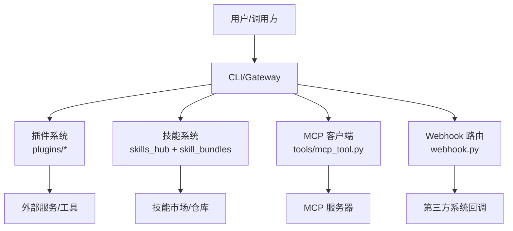
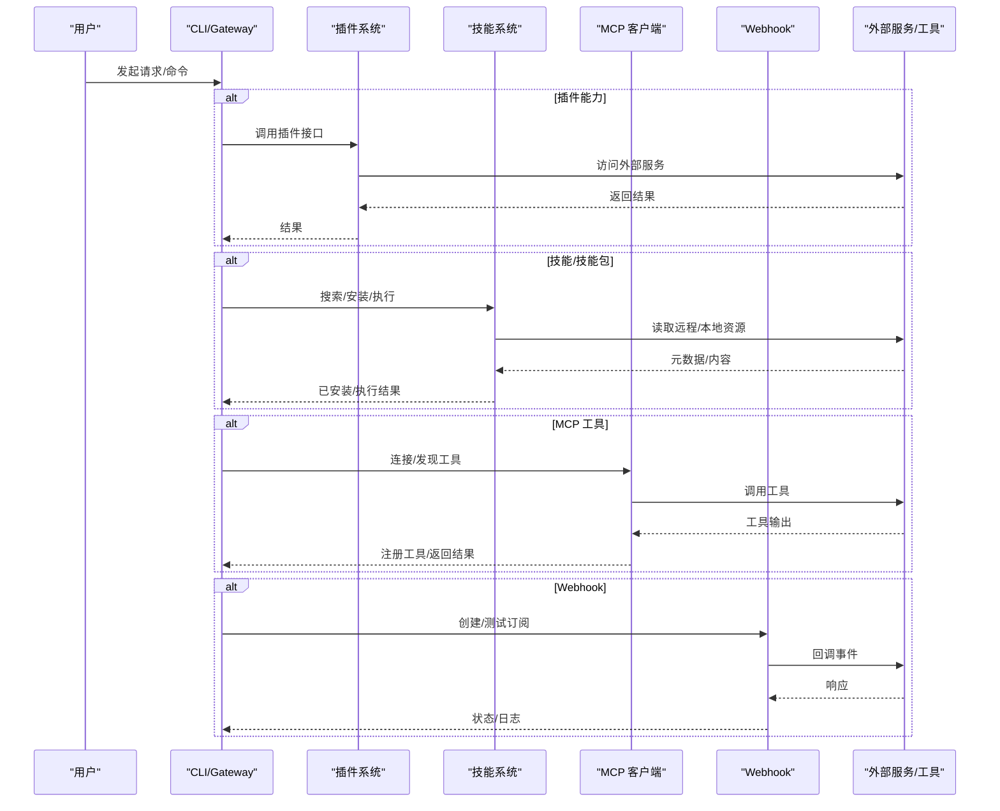
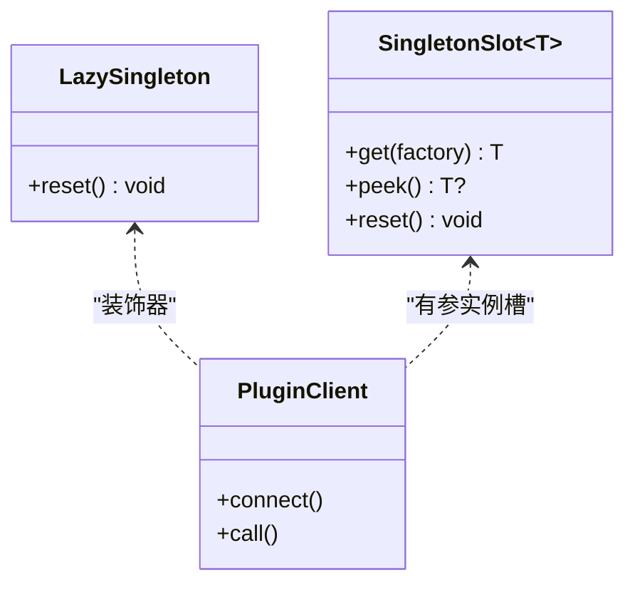
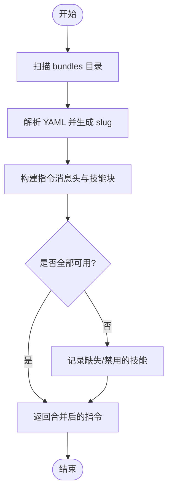
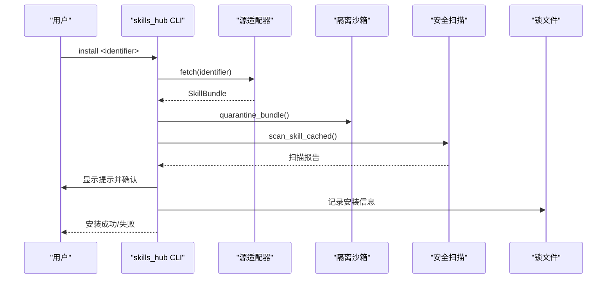
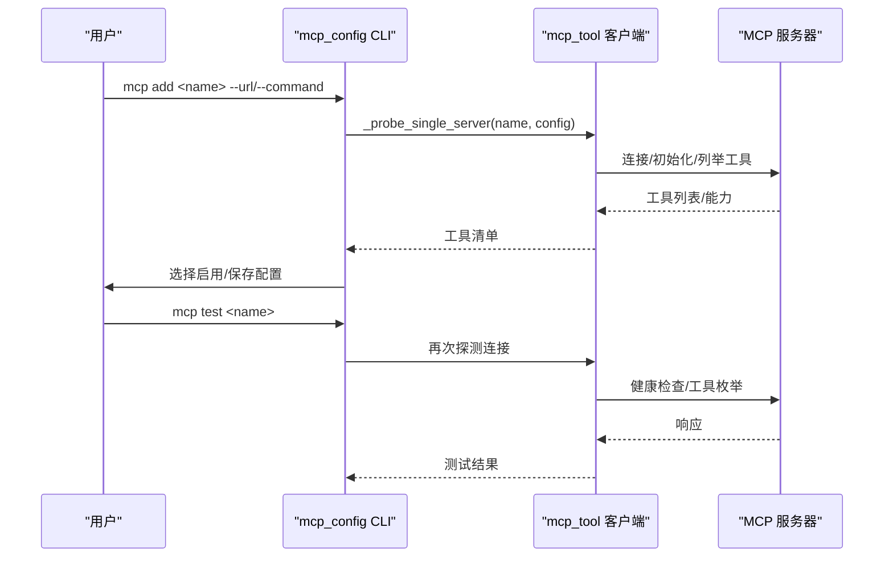
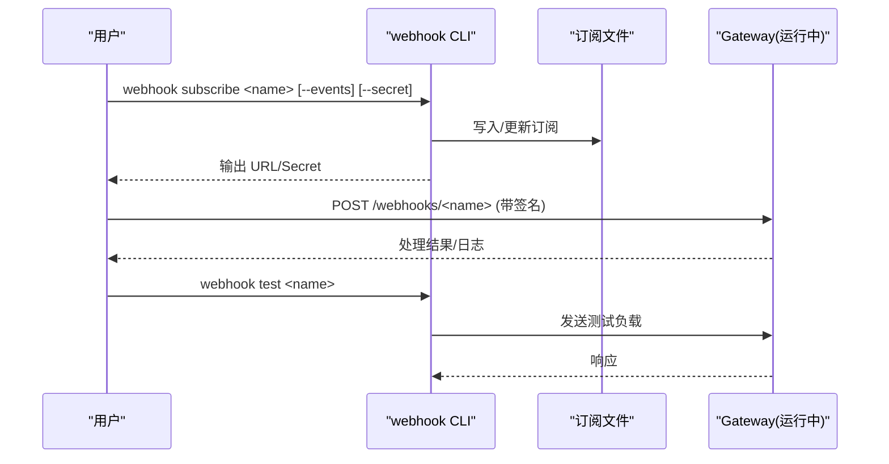
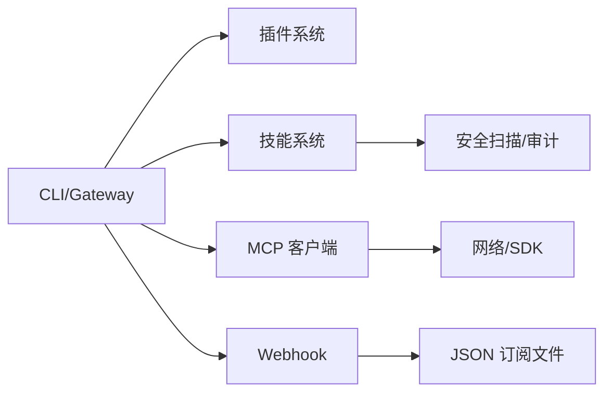

# 集成与扩展

<cite>
**本文引用的文件**
- [README.md](file://README.md)
- [agent/skill_bundles.py](file://agent/skill_bundles.py)
- [sparkii_cli/mcp_config.py](file://sparkii_cli/mcp_config.py)
- [tools/mcp_tool.py](file://tools/mcp_tool.py)
- [sparkii_cli/skills_hub.py](file://sparkii_cli/skills_hub.py)
- [tools/skills_hub.py](file://tools/skills_hub.py)
- [sparkii_cli/webhook.py](file://sparkii_cli/webhook.py)
- [plugins/plugin_utils.py](file://plugins/plugin_utils.py)
</cite>

## 目录
1. [简介](#简介)
2. [项目结构](#项目结构)
3. [核心组件](#核心组件)
4. [架构总览](#架构总览)
5. [详细组件分析](#详细组件分析)
6. [依赖关系分析](#依赖关系分析)
7. [性能考量](#性能考量)
8. [故障排查指南](#故障排查指南)
9. [结论](#结论)
10. [附录](#附录)

## 简介
本指南面向桌面应用集成与扩展，聚焦以下主题：
- 插件系统架构与工作原理
- 官方插件的安装与使用
- 技能包（Skill Bundles）的安装与管理（从技能市场获取、本地开发、版本管理）
- MCP（Model Context Protocol）集成方法（连接外部服务与工具）
- Webhook 与 API 集成配置（与其他系统的自动化工作流）
- 自定义插件开发（接口规范、环境搭建、测试与发布流程）
- 企业级集成最佳实践与安全考虑

## 项目结构
本项目围绕“插件/技能/MCP/Webhook”四大扩展面组织代码：
- 插件体系位于 plugins/，提供浏览器、模型提供商、平台接入、可观测性等能力；共享并发原语在 plugins/plugin_utils.py。
- 技能系统与技能包：agent/skill_bundles.py 负责技能包加载与组合；CLI 与库层在 sparkii_cli/skills_hub.py 与 tools/skills_hub.py。
- MCP 集成：tools/mcp_tool.py 实现客户端连接、工具发现与注册；sparkii_cli/mcp_config.py 提供 CLI 生命周期管理。
- Webhook：sparkii_cli/webhook.py 提供动态订阅、持久化与测试。
- 根 README 提供快速安装、入门命令与文档入口。

图表来源
- [README.md:105-183](file://README.md#L105-L183)
- [plugins/plugin_utils.py:1-30](file://plugins/plugin_utils.py#L1-L30)
- [agent/skill_bundles.py:1-41](file://agent/skill_bundles.py#L1-L41)
- [sparkii_cli/skills_hub.py:1-14](file://sparkii_cli/skills_hub.py#L1-L14)
- [tools/skills_hub.py:1-14](file://tools/skills_hub.py#L1-L14)
- [tools/mcp_tool.py:1-95](file://tools/mcp_tool.py#L1-L95)
- [sparkii_cli/mcp_config.py:1-9](file://sparkii_cli/mcp_config.py#L1-L9)
- [sparkii_cli/webhook.py:1-11](file://sparkii_cli/webhook.py#L1-L11)

章节来源
- [README.md:105-183](file://README.md#L105-L183)

## 核心组件
- 插件系统：通过 plugins/* 模块化扩展能力，提供线程安全的单例与懒加载工具，避免多进程/多线程下的竞态问题。
- 技能与技能包：支持将多个技能打包为一条斜杠命令一次性加载，便于组合复杂任务；提供搜索、安装、隔离扫描、审计日志等完整生命周期。
- MCP 集成：统一对接 stdio/HTTP/SSE 的 MCP 服务器，自动发现工具并注册到工具注册表，支持鉴权、超时、重连、安全过滤等。
- Webhook：动态创建订阅、持久化到 JSON、HMAC 签名校验、可选直接投递或触发 Agent 处理。

章节来源
- [plugins/plugin_utils.py:1-30](file://plugins/plugin_utils.py#L1-L30)
- [agent/skill_bundles.py:1-41](file://agent/skill_bundles.py#L1-L41)
- [tools/mcp_tool.py:1-95](file://tools/mcp_tool.py#L1-L95)
- [sparkii_cli/webhook.py:1-11](file://sparkii_cli/webhook.py#L1-L11)

## 架构总览
下图展示从用户到各扩展能力的调用路径与数据流向。

图表来源
- [tools/mcp_tool.py:1-95](file://tools/mcp_tool.py#L1-L95)
- [sparkii_cli/skills_hub.py:1-14](file://sparkii_cli/skills_hub.py#L1-L14)
- [agent/skill_bundles.py:1-41](file://agent/skill_bundles.py#L1-L41)
- [sparkii_cli/webhook.py:1-11](file://sparkii_cli/webhook.py#L1-L11)

## 详细组件分析

### 插件系统与并发安全
- 设计要点
  - 提供 lazy_singleton 装饰器与 SingletonSlot 类，确保在多线程环境下只初始化一次，避免资源泄漏和竞态。
  - 适用于插件中常见的“全局客户端/连接池”模式。
- 使用建议
  - 对无参工厂函数使用 @lazy_singleton。
  - 对有参构建逻辑使用 SingletonSlot.get(factory)。
  - 测试或清理时调用 reset() 重置缓存。

图表来源
- [plugins/plugin_utils.py:43-81](file://plugins/plugin_utils.py#L43-L81)
- [plugins/plugin_utils.py:84-136](file://plugins/plugin_utils.py#L84-L136)

章节来源
- [plugins/plugin_utils.py:1-30](file://plugins/plugin_utils.py#L1-L30)
- [plugins/plugin_utils.py:43-81](file://plugins/plugin_utils.py#L43-L81)
- [plugins/plugin_utils.py:84-136](file://plugins/plugin_utils.py#L84-L136)

### 技能包（Skill Bundles）
- 功能概述
  - 将多个技能以 YAML 形式组合为一个斜杠命令，一次性注入上下文，提升复杂任务效率。
  - 支持按平台禁用、缺失技能提示、增量刷新与缓存。
- 关键流程
  - 扫描 bundles 目录 → 解析 YAML → 生成 slug → 构建用户消息 → 加载技能内容。
  - 支持保存/删除/列出 bundle，并在变更时刷新缓存。

图表来源
- [agent/skill_bundles.py:66-113](file://agent/skill_bundles.py#L66-L113)
- [agent/skill_bundles.py:116-165](file://agent/skill_bundles.py#L116-L165)
- [agent/skill_bundles.py:168-205](file://agent/skill_bundles.py#L168-L205)
- [agent/skill_bundles.py:253-368](file://agent/skill_bundles.py#L253-L368)

章节来源
- [agent/skill_bundles.py:1-41](file://agent/skill_bundles.py#L1-L41)
- [agent/skill_bundles.py:66-113](file://agent/skill_bundles.py#L66-L113)
- [agent/skill_bundles.py:116-165](file://agent/skill_bundles.py#L116-L165)
- [agent/skill_bundles.py:168-205](file://agent/skill_bundles.py#L168-L205)
- [agent/skill_bundles.py:253-368](file://agent/skill_bundles.py#L253-L368)

### 技能市场（Skills Hub）
- 能力概览
  - 统一搜索/浏览/安装技能，支持多源（官方、GitHub、社区等），具备隔离沙箱、安全扫描、审计日志、锁文件追踪。
  - 支持 URL 安装、交互式命名/分类选择、蓝图（自动化）检测与提示。
- 安装流程（简化）
  - 解析标识符 → 拉取 Bundle → 隔离沙箱 → 安全扫描 → 策略校验 → 确认安装 → 写入锁文件 → 刷新缓存。

图表来源
- [sparkii_cli/skills_hub.py:490-793](file://sparkii_cli/skills_hub.py#L490-L793)
- [tools/skills_hub.py:130-153](file://tools/skills_hub.py#L130-L153)
- [tools/skills_hub.py:294-339](file://tools/skills_hub.py#L294-L339)

章节来源
- [sparkii_cli/skills_hub.py:1-14](file://sparkii_cli/skills_hub.py#L1-L14)
- [sparkii_cli/skills_hub.py:490-793](file://sparkii_cli/skills_hub.py#L490-L793)
- [tools/skills_hub.py:1-14](file://tools/skills_hub.py#L1-L14)
- [tools/skills_hub.py:130-153](file://tools/skills_hub.py#L130-L153)
- [tools/skills_hub.py:294-339](file://tools/skills_hub.py#L294-L339)

### MCP（Model Context Protocol）集成
- 能力概览
  - 支持 stdio、HTTP/StreamableHTTP、SSE 三种传输；自动发现工具并注册；支持鉴权（Bearer/OAuth）、超时、重连、keepalive、错误脱敏、描述注入检测等。
  - CLI 提供 add/remove/list/test/configure/login 等生命周期管理。
- 典型流程（添加并测试 MCP 服务器）

图表来源
- [sparkii_cli/mcp_config.py:415-617](file://sparkii_cli/mcp_config.py#L415-L617)
- [sparkii_cli/mcp_config.py:721-782](file://sparkii_cli/mcp_config.py#L721-L782)
- [tools/mcp_tool.py:1-95](file://tools/mcp_tool.py#L1-L95)

章节来源
- [sparkii_cli/mcp_config.py:1-9](file://sparkii_cli/mcp_config.py#L1-L9)
- [sparkii_cli/mcp_config.py:415-617](file://sparkii_cli/mcp_config.py#L415-L617)
- [sparkii_cli/mcp_config.py:721-782](file://sparkii_cli/mcp_config.py#L721-L782)
- [tools/mcp_tool.py:1-95](file://tools/mcp_tool.py#L1-L95)

### Webhook 与 API 集成
- 能力概览
  - 动态创建订阅（名称、事件、密钥、投递目标、脚本等），持久化到 JSON，热重载。
  - 支持 HMAC-SHA256 签名验证，提供测试发送与列表查看。
- 订阅创建与测试流程

图表来源
- [sparkii_cli/webhook.py:140-224](file://sparkii_cli/webhook.py#L140-L224)
- [sparkii_cli/webhook.py:267-308](file://sparkii_cli/webhook.py#L267-L308)

章节来源
- [sparkii_cli/webhook.py:1-11](file://sparkii_cli/webhook.py#L1-L11)
- [sparkii_cli/webhook.py:140-224](file://sparkii_cli/webhook.py#L140-L224)
- [sparkii_cli/webhook.py:267-308](file://sparkii_cli/webhook.py#L267-L308)

### 自定义插件开发指南
- 接口规范与环境搭建
  - 在 plugins/ 下新增模块，遵循现有约定（如 plugin.yaml、provider.py）。
  - 使用 plugins/plugin_utils.py 提供的 lazy_singleton/SingletonSlot 保证线程安全。
  - 参考 README 中的快速安装与 CLI 命令进行本地调试。
- 开发与测试
  - 使用 CLI 启动 gateway 或 TUI，结合 skills/mcp/webhook 进行端到端验证。
  - 利用隔离沙箱与审计日志（技能侧）保障安全性；MCP 侧可利用 test 命令验证连通性。
- 发布流程
  - 技能可通过 Skills Hub 发布至 GitHub/官方源；插件随仓库分发或通过平台机制加载。
  - 遵循安全扫描与审计要求，确保元数据与依赖清晰。

章节来源
- [plugins/plugin_utils.py:1-30](file://plugins/plugin_utils.py#L1-L30)
- [README.md:105-183](file://README.md#L105-L183)

## 依赖关系分析
- 组件耦合
  - CLI/Gateway 作为编排层，协调插件、技能、MCP、Webhook。
  - 技能系统依赖安全扫描与锁文件；MCP 客户端依赖底层 SDK 与网络栈；Webhook 依赖配置文件与文件系统。
- 外部依赖
  - MCP 依赖 mcp Python SDK（可选）；Skills Hub 依赖 httpx/yaml；Webhook 依赖标准库与原子替换工具。

图表来源
- [tools/mcp_tool.py:1-95](file://tools/mcp_tool.py#L1-L95)
- [tools/skills_hub.py:294-339](file://tools/skills_hub.py#L294-L339)
- [sparkii_cli/webhook.py:51-80](file://sparkii_cli/webhook.py#L51-L80)

章节来源
- [tools/mcp_tool.py:1-95](file://tools/mcp_tool.py#L1-L95)
- [tools/skills_hub.py:294-339](file://tools/skills_hub.py#L294-L339)
- [sparkii_cli/webhook.py:51-80](file://sparkii_cli/webhook.py#L51-L80)

## 性能考量
- 技能包加载
  - 使用 mtime 缓存减少重复扫描；按需加载缺失/禁用技能，避免阻塞。
- MCP 连接
  - 指数退避重连、keepalive 保活、分页限制防止无限遍历；stderr 重定向避免终端污染。
- Webhook
  - 原子写入与权限控制降低竞争与泄露风险；测试命令用于快速验证。

[本节为通用指导，不直接分析具体文件]

## 故障排查指南
- 技能安装被阻断
  - 检查安全扫描报告与策略；确认来源可信度与路径合法性。
- MCP 连接失败
  - 使用 mcp test 命令诊断；检查鉴权、超时、网络可达性与能力探测。
- Webhook 无法接收
  - 确认 Gateway 已运行；核对订阅 URL、Secret 与签名；使用 webhook test 发送测试负载。

章节来源
- [sparkii_cli/skills_hub.py:650-689](file://sparkii_cli/skills_hub.py#L650-L689)
- [sparkii_cli/mcp_config.py:721-782](file://sparkii_cli/mcp_config.py#L721-L782)
- [sparkii_cli/webhook.py:267-308](file://sparkii_cli/webhook.py#L267-L308)

## 结论
本项目提供了完善的插件、技能、MCP 与 Webhook 扩展体系，覆盖从发现、安装、连接到调用的全链路。通过严格的沙箱与安全策略、健壮的连接管理与清晰的 CLI 工具链，既满足个人开发者的高效集成，也支撑企业级场景的安全与稳定性需求。

[本节为总结性内容，不直接分析具体文件]

## 附录
- 快速上手
  - 安装与基础命令参考 README。
  - 通过 skills hub 浏览与安装技能；通过 mcp add/test 连接外部工具；通过 webhook subscribe 创建回调。
- 企业最佳实践
  - 使用受信任源与最小权限原则；集中管理密钥（环境变量/.env）；定期审计与更新；对 MCP 与 Webhook 启用鉴权与限流。

章节来源
- [README.md:105-183](file://README.md#L105-L183)