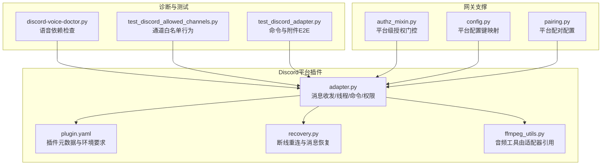
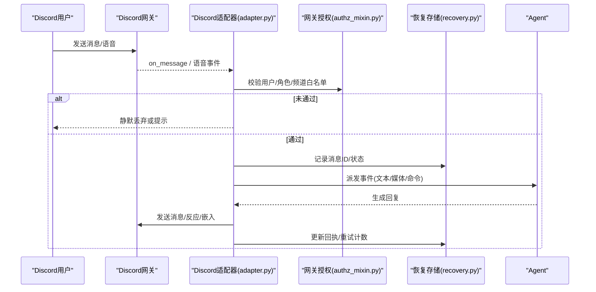
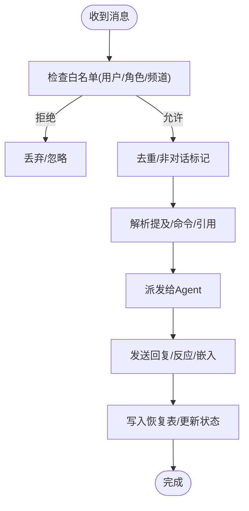
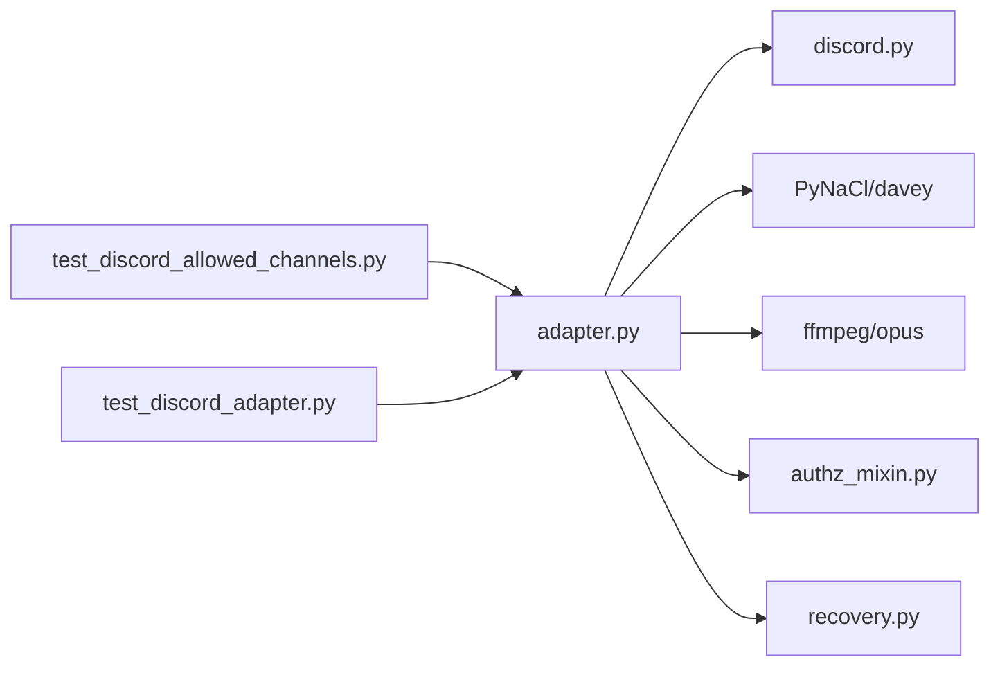

# Discord服务器集成

<cite>
**本文引用的文件**
- [adapter.py](file://plugins/platforms/discord/adapter.py)
- [plugin.yaml](file://plugins/platforms/discord/plugin.yaml)
- [recovery.py](file://plugins/platforms/discord/recovery.py)
- [discord-voice-doctor.py](file://scripts/discord-voice-doctor.py)
- [test_discord_allowed_channels.py](file://tests/gateway/test_discord_allowed_channels.py)
- [test_discord_adapter.py](file://tests/e2e/test_discord_adapter.py)
- [authz_mixin.py](file://gateway/authz_mixin.py)
- [config.py](file://gateway/config.py)
- [pairing.py](file://gateway/pairing.py)
</cite>

## 目录
1. [简介](#简介)
2. [项目结构](#项目结构)
3. [核心组件](#核心组件)
4. [架构总览](#架构总览)
5. [详细组件分析](#详细组件分析)
6. [依赖关系分析](#依赖关系分析)
7. [性能与速率限制](#性能与速率限制)
8. [故障排除指南](#故障排除指南)
9. [结论](#结论)
10. [附录：配置清单与示例](#附录：配置清单与示例)

## 简介
本指南面向需要在Discord服务器中集成并运行机器人（Bot）的开发者与运维人员。内容涵盖在Discord开发者门户创建应用与Bot、配置OAuth2权限与邀请链接；解释Discord特有功能（角色权限、频道类型、嵌入消息、反应表情等）；说明服务器设置、成员管理、权限组配置；提供完整的环境变量与配置文件示例；并给出API速率限制、连接池、消息缓存等性能优化建议，以及常见问题的排查方法。

## 项目结构
本项目通过“平台插件”的方式接入Discord，核心位于 plugins/platforms/discord 目录，包含适配器、语音工具、恢复机制等；配套脚本用于诊断语音能力；测试覆盖通道白名单、命令识别、附件处理等关键路径；网关层提供授权、配置、配对等支撑。

图表来源
- [adapter.py:1-170](file://plugins/platforms/discord/adapter.py#L1-L170)
- [plugin.yaml:1-35](file://plugins/platforms/discord/plugin.yaml#L1-L35)
- [recovery.py:1-113](file://plugins/platforms/discord/recovery.py#L1-L113)
- [discord-voice-doctor.py:1-120](file://scripts/discord-voice-doctor.py#L1-L120)
- [test_discord_allowed_channels.py:1-75](file://tests/gateway/test_discord_allowed_channels.py#L1-L75)
- [test_discord_adapter.py:1-156](file://tests/e2e/test_discord_adapter.py#L1-L156)
- [authz_mixin.py:500-580](file://gateway/authz_mixin.py#L500-L580)
- [config.py:580-590](file://gateway/config.py#L580-L590)
- [pairing.py:60-80](file://gateway/pairing.py#L60-L80)

章节来源
- [adapter.py:1-170](file://plugins/platforms/discord/adapter.py#L1-L170)
- [plugin.yaml:1-35](file://plugins/platforms/discord/plugin.yaml#L1-L35)
- [recovery.py:1-113](file://plugins/platforms/discord/recovery.py#L1-L113)
- [discord-voice-doctor.py:1-120](file://scripts/discord-voice-doctor.py#L1-L120)
- [test_discord_allowed_channels.py:1-75](file://tests/gateway/test_discord_allowed_channels.py#L1-L75)
- [test_discord_adapter.py:1-156](file://tests/e2e/test_discord_adapter.py#L1-L156)
- [authz_mixin.py:500-580](file://gateway/authz_mixin.py#L500-L580)
- [config.py:580-590](file://gateway/config.py#L580-L590)
- [pairing.py:60-80](file://gateway/pairing.py#L60-L80)

## 核心组件
- Discord适配器（adapter.py）
  - 基于 discord.py 实现消息接收、发送、线程、Slash命令、权限门控、提及过滤、附件下载与缓存、语音采集与解码等。
  - 内置非对话消息去噪、命令同步限流、安全URL校验、UTF-16长度截断等健壮性逻辑。
- 插件元数据（plugin.yaml）
  - 声明插件名称、版本、描述、必需/可选环境变量（如 DISCORD_BOT_TOKEN、DISCORD_ALLOWED_USERS 等）。
- 恢复存储（recovery.py）
  - 使用SQLite记录已处理消息、扫描游标与重试状态，支持断线后补发与幂等投递。
- 语音诊断（discord-voice-doctor.py）
  - 检查Python包、系统工具（opus/ffmpeg）、环境变量、Bot权限是否满足语音模式需求。
- 网关授权与配置（authz_mixin.py, config.py, pairing.py）
  - 将平台级授权策略（允许用户/角色/频道）与配置键映射到Discord环境。

章节来源
- [adapter.py:1-170](file://plugins/platforms/discord/adapter.py#L1-L170)
- [plugin.yaml:1-35](file://plugins/platforms/discord/plugin.yaml#L1-L35)
- [recovery.py:1-113](file://plugins/platforms/discord/recovery.py#L1-L113)
- [discord-voice-doctor.py:1-120](file://scripts/discord-voice-doctor.py#L1-L120)
- [authz_mixin.py:500-580](file://gateway/authz_mixin.py#L500-L580)
- [config.py:580-590](file://gateway/config.py#L580-L590)
- [pairing.py:60-80](file://gateway/pairing.py#L60-L80)

## 架构总览
下图展示从Discord客户端到Agent的核心调用链，包括消息进入、权限校验、命令解析、回复发送与恢复机制。

图表来源
- [adapter.py:1-170](file://plugins/platforms/discord/adapter.py#L1-L170)
- [recovery.py:1-113](file://plugins/platforms/discord/recovery.py#L1-L113)
- [authz_mixin.py:500-580](file://gateway/authz_mixin.py#L500-L580)

## 详细组件分析

### 适配器（adapter.py）
- 功能要点
  - 依赖检测与懒加载：首次使用时按需安装 discord.py 相关依赖。
  - 安全与兼容：对图片URL进行重定向防护与安全校验；对Discord Markdown链接做转义与防预览优化；对组件字段按UTF-16预算截断。
  - 权限门控：支持用户ID、角色ID、频道ID白名单，支持通配符“*”；DM与服务器频道差异化处理。
  - 命令与线程：自动线程、Slash命令注册与同步、提及剥离、命令参数解析。
  - 媒体与附件：下载、缓存、类型推断、大小限制。
  - 语音：捕获RTP包、NaCl解密、DAVE端到端加密、Opus解码、静音检测、多路缓冲。
  - 恢复：持久化消息ID集合与扫描游标，保障重启后不丢消息。
- 关键流程（消息处理）

图表来源
- [adapter.py:1-170](file://plugins/platforms/discord/adapter.py#L1-L170)
- [recovery.py:1-113](file://plugins/platforms/discord/recovery.py#L1-L113)

章节来源
- [adapter.py:1-170](file://plugins/platforms/discord/adapter.py#L1-L170)
- [recovery.py:1-113](file://plugins/platforms/discord/recovery.py#L1-L113)

### 插件元数据（plugin.yaml）
- 定义插件标识、版本、描述与所需环境变量。
- 必需：DISCORD_BOT_TOKEN
- 可选：DISCORD_ALLOWED_USERS、DISCORD_ALLOW_ALL_USERS、DISCORD_HOME_CHANNEL、DISCORD_HOME_CHANNEL_NAME 等

章节来源
- [plugin.yaml:1-35](file://plugins/platforms/discord/plugin.yaml#L1-L35)

### 恢复存储（recovery.py）
- 使用SQLite维护消息回执、扫描游标与重试信息，支持过期清理与并发访问保护。
- 为断线重连后的补发与幂等投递提供基础。

章节来源
- [recovery.py:1-113](file://plugins/platforms/discord/recovery.py#L1-L113)

### 语音诊断（discord-voice-doctor.py）
- 检查Python包（discord.py、PyNaCl、davey等）、系统工具（opus、ffmpeg）、环境变量（令牌、STT/TTS密钥）、Bot权限（连接、说话、查看频道、发送消息等）。
- 输出逐项检查结果，便于快速定位问题。

章节来源
- [discord-voice-doctor.py:1-120](file://scripts/discord-voice-doctor.py#L1-L120)
- [discord-voice-doctor.py:281-367](file://scripts/discord-voice-doctor.py#L281-L367)

### 网关授权与配置
- authz_mixin.py：将平台级授权策略（允许用户/角色/频道）映射到Discord环境变量，统一门控入口。
- config.py：定义平台配置键（如 DISCORD_BOT_TOKEN）的默认值与读取位置。
- pairing.py：平台配对时使用的允许用户列表键名。

章节来源
- [authz_mixin.py:500-580](file://gateway/authz_mixin.py#L500-L580)
- [config.py:580-590](file://gateway/config.py#L580-L590)
- [pairing.py:60-80](file://gateway/pairing.py#L60-L80)

## 依赖关系分析
- 外部依赖
  - discord.py：消息收发、事件驱动、语音通道。
  - PyNaCl/davey：语音RTP解密与端到端加密。
  - ffmpeg/opus：音频编解码。
- 内部依赖
  - 网关授权模块：统一权限门控。
  - 恢复存储：保证消息投递幂等与可恢复。
  - 测试套件：验证通道白名单、命令识别、附件处理等行为。

图表来源
- [adapter.py:1-170](file://plugins/platforms/discord/adapter.py#L1-L170)
- [test_discord_allowed_channels.py:1-75](file://tests/gateway/test_discord_allowed_channels.py#L1-L75)
- [test_discord_adapter.py:1-156](file://tests/e2e/test_discord_adapter.py#L1-L156)

章节来源
- [adapter.py:1-170](file://plugins/platforms/discord/adapter.py#L1-L170)
- [test_discord_allowed_channels.py:1-75](file://tests/gateway/test_discord_allowed_channels.py#L1-L75)
- [test_discord_adapter.py:1-156](file://tests/e2e/test_discord_adapter.py#L1-L156)

## 性能与速率限制
- API速率限制
  - Slash命令全局上限为100条，注册时需控制数量以避免整体失败。
  - 消息发送与历史查询需遵循Discord限制，必要时退避重试。
- 连接与传输
  - WebSocket连接异常时具备超时与中止机制，避免阻塞启动流程。
  - 语音通道采用独立接收器与解码器，按SSRC隔离缓冲与状态。
- 缓存与去重
  - 图片/音频/文档下载后进行本地缓存，减少重复网络请求。
  - 非对话消息（状态提示）通过持久化ID集合去重，避免刷屏。
- UTF-16限制
  - 组件字段按UTF-16预算截断，防止Discord拒绝超长消息。

章节来源
- [adapter.py:72-88](file://plugins/platforms/discord/adapter.py#L72-L88)
- [adapter.py:232-267](file://plugins/platforms/discord/adapter.py#L232-L267)
- [adapter.py:525-800](file://plugins/platforms/discord/adapter.py#L525-L800)
- [adapter.py:171-210](file://plugins/platforms/discord/adapter.py#L171-L210)

## 故障排除指南
- Bot离线/无法启动
  - 检查网络代理/防火墙、SOCKS错误；确认 ready 等待超时与任务退出异常被正确上报。
  - 参考启动等待与异常处理逻辑。
- 权限错误
  - 使用语音诊断脚本检查Bot权限（连接、说话、查看频道、发送消息等），并在服务器角色中授予相应权限。
  - 检查用户/角色/频道白名单配置是否正确。
- 消息丢失/重复
  - 启用恢复存储，确保重启后能补发未回执的消息；检查非对话消息去重是否生效。
- 语音不可用
  - 检查依赖包（discord.py[voice]、PyNaCl、davey）、系统库（opus、ffmpeg）与环境变量（STT/TTS密钥）。
  - 若出现RTP/解密/Opus解码错误，查看日志中的调试信息并逐步定位。

章节来源
- [adapter.py:232-267](file://plugins/platforms/discord/adapter.py#L232-L267)
- [discord-voice-doctor.py:281-367](file://scripts/discord-voice-doctor.py#L281-L367)
- [recovery.py:1-113](file://plugins/platforms/discord/recovery.py#L1-L113)
- [test_discord_allowed_channels.py:1-75](file://tests/gateway/test_discord_allowed_channels.py#L1-L75)

## 结论
通过平台插件方式，本项目将Discord深度集成到Agent工作流中，提供消息、命令、线程、媒体、语音等全链路能力，并以恢复存储与权限门控保障稳定性与安全性。配合诊断脚本与测试用例，可快速定位与修复常见问题。生产部署时建议严格配置白名单、合理设置速率限制与缓存策略，并定期巡检权限与依赖。

## 附录：配置清单与示例
- 必需环境变量
  - DISCORD_BOT_TOKEN：Discord Bot令牌
- 可选环境变量
  - DISCORD_ALLOWED_USERS：允许的用户ID列表（逗号分隔）
  - DISCORD_ALLOWED_ROLES：允许的角色ID列表（逗号分隔）
  - DISCORD_ALLOWED_CHANNELS：允许的频道ID列表（支持“*”通配）
  - DISCORD_IGNORED_CHANNELS：忽略的频道ID列表（支持“*”通配）
  - DISCORD_FREE_RESPONSE_CHANNELS：免提及频道列表（支持“*”通配）
  - DISCORD_NO_THREAD_CHANNELS：禁止自动建线程的频道
  - DISCORD_MISSED_MESSAGE_BACKFILL_CHANNELS：断线补发目标频道
  - DISCORD_ALLOW_ALL_USERS：开发模式允许所有用户
  - DISCORD_ALLOW_BOTS：允许其他Bot触发
  - DISCORD_HOME_CHANNEL / DISCORD_HOME_CHANNEL_NAME：默认通知频道
- 服务器与角色设置
  - 在Discord开发者门户创建应用并添加Bot，获取令牌。
  - 在服务器中为Bot角色授予必要权限（连接、说话、查看频道、发送消息、嵌入链接、附加文件、读取历史等）。
  - 如需邀请链接，可在应用OAuth2页面生成并选择相应权限范围。
- 渠道白名单行为
  - 当设置为“*”时，表示允许/忽略/自由响应所有频道；否则仅匹配显式列出的频道ID。
- 测试参考
  - 通道白名单通配与精确匹配行为见测试用例。
  - 命令识别与附件处理见E2E测试。

章节来源
- [plugin.yaml:12-35](file://plugins/platforms/discord/plugin.yaml#L12-L35)
- [test_discord_allowed_channels.py:16-40](file://tests/gateway/test_discord_allowed_channels.py#L16-L40)
- [test_discord_adapter.py:30-81](file://tests/e2e/test_discord_adapter.py#L30-L81)
- [discord-voice-doctor.py:281-367](file://scripts/discord-voice-doctor.py#L281-L367)