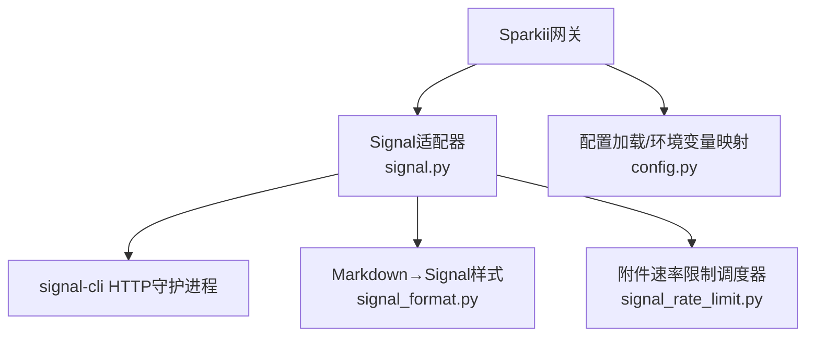
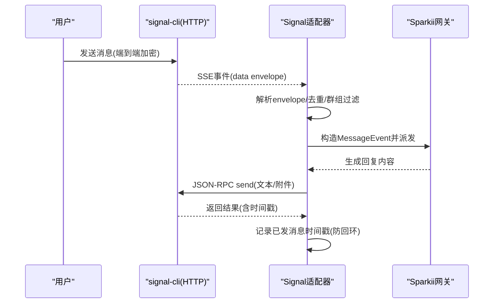
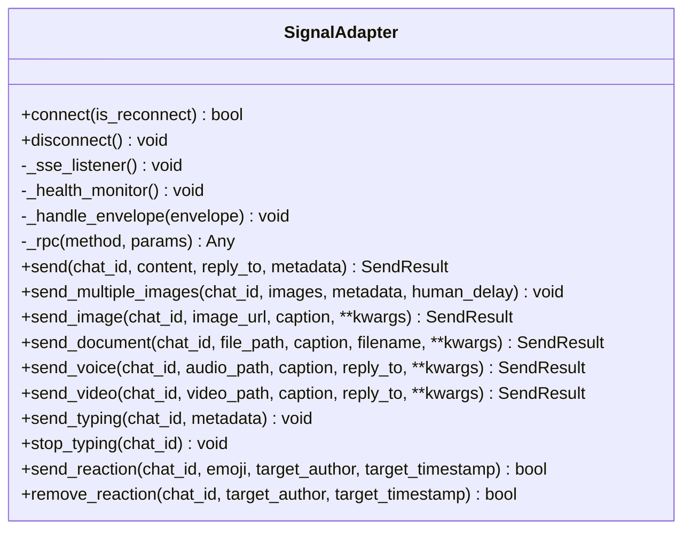
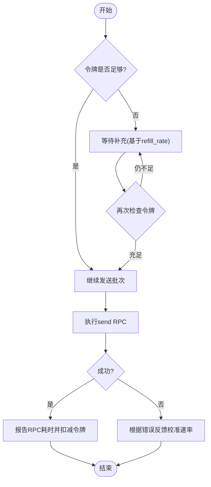
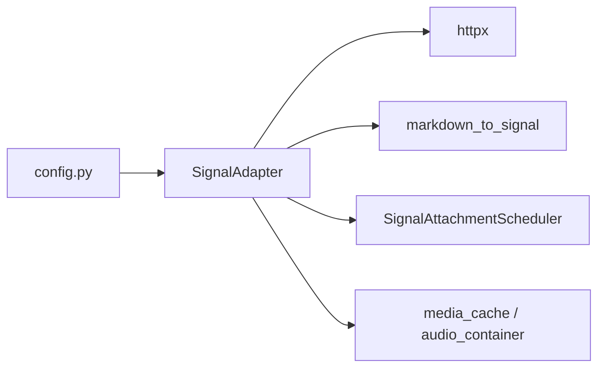

# Signal客户端集成

<cite>
**本文引用的文件**
- [gateway/platforms/signal.py](file://gateway/platforms/signal.py)
- [gateway/platforms/signal_format.py](file://gateway/platforms/signal_format.py)
- [gateway/platforms/signal_rate_limit.py](file://gateway/platforms/signal_rate_limit.py)
- [gateway/config.py](file://gateway/config.py)
- [website/docs/user-guide/messaging/signal.md](file://website/docs/user-guide/messaging/signal.md)
</cite>

## 目录
1. [简介](#简介)
2. [项目结构](#项目结构)
3. [核心组件](#核心组件)
4. [架构总览](#架构总览)
5. [详细组件分析](#详细组件分析)
6. [依赖关系分析](#依赖关系分析)
7. [性能与限流](#性能与限流)
8. [配置示例与环境变量](#配置示例与环境变量)
9. [故障排除指南](#故障排除指南)
10. [结论](#结论)

## 简介
本指南面向需要在系统中集成Signal通信能力的开发者，覆盖从安装signal-cli、启动HTTP模式守护进程、到通过Sparkii网关的Signal适配器完成消息收发、媒体处理、群组策略、速率限制与连接健康监控等全链路流程。文档同时解释Signal特有的端到端加密、自毁消息（由Signal协议保障）、群组聊天、文件共享、联系人标识解析、消息格式转换、以及SSE长连接与自动重连机制。

## 项目结构
Signal集成的关键代码位于网关平台适配层：
- 适配器主实现：gateway/platforms/signal.py
- Markdown→Signal原生样式转换：gateway/platforms/signal_format.py
- 附件发送速率限制调度器：gateway/platforms/signal_rate_limit.py
- 环境变量到平台配置的桥接：gateway/config.py
- 用户指南与排错参考：website/docs/user-guide/messaging/signal.md

图表来源
- [gateway/platforms/signal.py:1-12](file://gateway/platforms/signal.py#L1-L12)
- [gateway/platforms/signal_format.py:1-23](file://gateway/platforms/signal_format.py#L1-L23)
- [gateway/platforms/signal_rate_limit.py:1-39](file://gateway/platforms/signal_rate_limit.py#L1-L39)
- [gateway/config.py:2007-2024](file://gateway/config.py#L2007-L2024)

章节来源
- [gateway/platforms/signal.py:1-12](file://gateway/platforms/signal.py#L1-L12)
- [gateway/platforms/signal_format.py:1-23](file://gateway/platforms/signal_format.py#L1-L23)
- [gateway/platforms/signal_rate_limit.py:1-39](file://gateway/platforms/signal_rate_limit.py#L1-L39)
- [gateway/config.py:2007-2024](file://gateway/config.py#L2007-L2024)

## 核心组件
- SignalAdapter：负责与signal-cli HTTP API交互，维护SSE事件流、健康检查、消息收发、媒体处理、打字指示器、反应（表情）等。
- Markdown→Signal转换器：将Markdown文本转换为Signal原生bodyRanges样式，确保在接收端正确渲染加粗、斜体、删除线、等宽等。
- 附件速率限制调度器：模拟服务端令牌桶，协调批量图片发送，避免触发Signal服务器侧的速率限制。
- 配置桥接：将环境变量（如SIGNAL_HTTP_URL、SIGNAL_ACCOUNT等）注入平台配置，启用Signal通道。

章节来源
- [gateway/platforms/signal.py:253-341](file://gateway/platforms/signal.py#L253-L341)
- [gateway/platforms/signal_format.py:12-23](file://gateway/platforms/signal_format.py#L12-L23)
- [gateway/platforms/signal_rate_limit.py:170-183](file://gateway/platforms/signal_rate_limit.py#L170-L183)
- [gateway/config.py:2007-2024](file://gateway/config.py#L2007-L2024)

## 架构总览
Signal适配器通过SSE订阅来自signal-cli的事件流，使用JSON-RPC进行发送与查询；所有出站媒体走统一的附件API并受速率限制调度器约束；配置由环境变量驱动，便于容器化部署与多实例隔离。

图表来源
- [gateway/platforms/signal.py:347-382](file://gateway/platforms/signal.py#L347-L382)
- [gateway/platforms/signal.py:426-489](file://gateway/platforms/signal.py#L426-L489)
- [gateway/platforms/signal.py:536-769](file://gateway/platforms/signal.py#L536-L769)
- [gateway/platforms/signal.py:1053-1093](file://gateway/platforms/signal.py#L1053-L1093)

## 详细组件分析

### Signal适配器（SignalAdapter）
- 生命周期管理：connect()建立HTTP客户端与健康检查，启动SSE监听与健康监控任务；disconnect()取消任务并释放资源。
- 入站消息处理：_handle_envelope()解析dataMessage/editMessage/storyMessage，支持“仅我”同步消息、群组白名单、@提及过滤、引用上下文提取、附件下载与类型判定。
- 出站消息发送：send()将Markdown转为Signal原生样式并通过JSON-RPC发送；send_image/send_document/send_voice/send_video统一走附件发送路径；send_multiple_images分片发送并配合速率限制调度器。
- 打字指示器：周期性刷新，针对不可达目标实施退避与静默，避免日志风暴。
- 反应与引用：支持send_reaction/remove_reaction；通过时间戳缓存识别对己方消息的回复，避免误判。

图表来源
- [gateway/platforms/signal.py:253-341](file://gateway/platforms/signal.py#L253-L341)
- [gateway/platforms/signal.py:347-419](file://gateway/platforms/signal.py#L347-L419)
- [gateway/platforms/signal.py:426-531](file://gateway/platforms/signal.py#L426-L531)
- [gateway/platforms/signal.py:536-769](file://gateway/platforms/signal.py#L536-L769)
- [gateway/platforms/signal.py:929-1006](file://gateway/platforms/signal.py#L929-L1006)
- [gateway/platforms/signal.py:1053-1093](file://gateway/platforms/signal.py#L1053-L1093)
- [gateway/platforms/signal.py:1176-1366](file://gateway/platforms/signal.py#L1176-L1366)
- [gateway/platforms/signal.py:1367-1508](file://gateway/platforms/signal.py#L1367-L1508)
- [gateway/platforms/signal.py:1558-1599](file://gateway/platforms/signal.py#L1558-L1599)

章节来源
- [gateway/platforms/signal.py:253-341](file://gateway/platforms/signal.py#L253-L341)
- [gateway/platforms/signal.py:347-419](file://gateway/platforms/signal.py#L347-L419)
- [gateway/platforms/signal.py:426-531](file://gateway/platforms/signal.py#L426-L531)
- [gateway/platforms/signal.py:536-769](file://gateway/platforms/signal.py#L536-L769)
- [gateway/platforms/signal.py:929-1006](file://gateway/platforms/signal.py#L929-L1006)
- [gateway/platforms/signal.py:1053-1093](file://gateway/platforms/signal.py#L1053-L1093)
- [gateway/platforms/signal.py:1176-1366](file://gateway/platforms/signal.py#L1176-L1366)
- [gateway/platforms/signal.py:1367-1508](file://gateway/platforms/signal.py#L1367-L1508)
- [gateway/platforms/signal.py:1558-1599](file://gateway/platforms/signal.py#L1558-L1599)

### Markdown→Signal样式转换
- 将Markdown中的加粗、斜体、删除线、等宽、标题等转换为Signal bodyRanges（UTF-16单位），保证在Signal客户端呈现为原生样式而非可见标记字符。
- 列表符号规范化，避免以“- * +”原样显示。

章节来源
- [gateway/platforms/signal_format.py:12-23](file://gateway/platforms/signal_format.py#L12-L23)
- [gateway/platforms/signal_format.py:29-46](file://gateway/platforms/signal_format.py#L29-L46)
- [gateway/platforms/signal_format.py:50-72](file://gateway/platforms/signal_format.py#L50-L72)
- [gateway/platforms/signal_format.py:74-140](file://gateway/platforms/signal_format.py#L74-L140)

### 附件速率限制调度器
- 令牌桶模型：容量与服务端一致，按重试提示校准补充速率，避免批量上传触发429。
- 并发安全：通过异步锁串行化acquire调用，保证FIFO公平性。
- 反馈机制：捕获服务端的retry_after，动态调整补充速率，并在RPC完成后扣减令牌。

图表来源
- [gateway/platforms/signal_rate_limit.py:170-183](file://gateway/platforms/signal_rate_limit.py#L170-L183)
- [gateway/platforms/signal_rate_limit.py:200-227](file://gateway/platforms/signal_rate_limit.py#L200-L227)
- [gateway/platforms/signal_rate_limit.py:228-277](file://gateway/platforms/signal_rate_limit.py#L228-L277)
- [gateway/platforms/signal_rate_limit.py:279-328](file://gateway/platforms/signal_rate_limit.py#L279-L328)

章节来源
- [gateway/platforms/signal_rate_limit.py:170-183](file://gateway/platforms/signal_rate_limit.py#L170-L183)
- [gateway/platforms/signal_rate_limit.py:200-227](file://gateway/platforms/signal_rate_limit.py#L200-L227)
- [gateway/platforms/signal_rate_limit.py:228-277](file://gateway/platforms/signal_rate_limit.py#L228-L277)
- [gateway/platforms/signal_rate_limit.py:279-328](file://gateway/platforms/signal_rate_limit.py#L279-L328)

### 配置与环境变量桥接
- 当设置SIGNAL_HTTP_URL与SIGNAL_ACCOUNT时，自动启用Signal平台并写入extra字段（http_url、account、ignore_stories）。
- 可配置SIGNAL_HOME_CHANNEL作为默认投递目标。

章节来源
- [gateway/config.py:2007-2024](file://gateway/config.py#L2007-L2024)

## 依赖关系分析
- 外部依赖：signal-cli需以HTTP模式运行并提供REST API；Java 17+运行时。
- 内部依赖：
  - httpx用于HTTP/SSE通信。
  - media_cache与tools.audio_container用于附件类型推断与缓存。
  - signal_format用于文本样式转换。
  - signal_rate_limit用于附件发送限速。

图表来源
- [gateway/platforms/signal.py:14-49](file://gateway/platforms/signal.py#L14-L49)
- [gateway/platforms/signal_format.py:1-23](file://gateway/platforms/signal_format.py#L1-L23)
- [gateway/platforms/signal_rate_limit.py:170-183](file://gateway/platforms/signal_rate_limit.py#L170-L183)
- [gateway/config.py:2007-2024](file://gateway/config.py#L2007-L2024)

章节来源
- [gateway/platforms/signal.py:14-49](file://gateway/platforms/signal.py#L14-L49)
- [gateway/platforms/signal_format.py:1-23](file://gateway/platforms/signal_format.py#L1-L23)
- [gateway/platforms/signal_rate_limit.py:170-183](file://gateway/platforms/signal_rate_limit.py#L170-L183)
- [gateway/config.py:2007-2024](file://gateway/config.py#L2007-L2024)

## 性能与限流
- 附件大小上限：单附件最大100MB。
- 每消息附件上限：32个（遵循Signal客户端源码限制）。
- 批量发送超时：按附件数量动态计算，避免大附件批处理被截断。
- 速率限制：令牌桶容量与服务端一致，遇到429时根据retry_after校准补充速率，必要时通知用户延迟。
- 健康监控：SSE空闲超过阈值会主动探测daemon健康，必要时强制重连。

章节来源
- [gateway/platforms/signal.py:66-73](file://gateway/platforms/signal.py#L66-L73)
- [gateway/platforms/signal.py:495-531](file://gateway/platforms/signal.py#L495-L531)
- [gateway/platforms/signal_rate_limit.py:33-38](file://gateway/platforms/signal_rate_limit.py#L33-L38)
- [gateway/platforms/signal_rate_limit.py:152-163](file://gateway/platforms/signal_rate_limit.py#L152-L163)
- [gateway/platforms/signal_rate_limit.py:308-328](file://gateway/platforms/signal_rate_limit.py#L308-L328)

## 配置示例与环境变量
以下为常用环境变量与说明（可直接写入运行环境或配置文件）：
- SIGNAL_HTTP_URL：signal-cli HTTP端点地址（必填）
- SIGNAL_ACCOUNT：机器人账号（E.164手机号或服务ID，必填）
- SIGNAL_ALLOWED_USERS：允许私聊的用户列表（逗号分隔）
- SIGNAL_GROUP_ALLOWED_USERS：允许的群组ID列表或“*”表示全部（留空则禁用群组）
- SIGNAL_IGNORE_STORIES：忽略故事消息（默认true）
- SIGNAL_REQUIRE_MENTION：在群组中仅响应@提及（可选）
- SIGNAL_HOME_CHANNEL：默认投递目标（可选）

章节来源
- [website/docs/user-guide/messaging/signal.md:97-120](file://website/docs/user-guide/messaging/signal.md#L97-L120)
- [website/docs/user-guide/messaging/signal.md:124-143](file://website/docs/user-guide/messaging/signal.md#L124-L143)
- [website/docs/user-guide/messaging/signal.md:249-259](file://website/docs/user-guide/messaging/signal.md#L249-L259)
- [gateway/config.py:2007-2024](file://gateway/config.py#L2007-L2024)

## 故障排除指南
常见问题与定位要点：
- 无法连接signal-cli：确认daemon已启动且端口可达；检查SIGNAL_HTTP_URL是否正确。
- 收不到消息：核对SIGNAL_ALLOWED_USERS是否包含发送者号码；群组消息需配置SIGNAL_GROUP_ALLOWED_USERS。
- 连接频繁断开：查看signal-cli日志；确保Java版本满足要求；适配器会自动重连并指数退避。
- 群组消息被忽略：未配置群组白名单时会忽略；设置为具体groupId或“*”以启用。
- 重复消息：确保同一号码仅一个signal-cli实例监听；适配器内置回环过滤（基于发送时间戳与同步消息）。
- 附件发送失败/限速：关注批量发送日志与调度器状态；必要时降低并发或等待retry_after后重试。

章节来源
- [website/docs/user-guide/messaging/signal.md:221-232](file://website/docs/user-guide/messaging/signal.md#L221-L232)
- [gateway/platforms/signal.py:347-382](file://gateway/platforms/signal.py#L347-L382)
- [gateway/platforms/signal.py:426-489](file://gateway/platforms/signal.py#L426-L489)
- [gateway/platforms/signal.py:599-610](file://gateway/platforms/signal.py#L599-L610)
- [gateway/platforms/signal.py:1176-1366](file://gateway/platforms/signal.py#L1176-L1366)

## 结论
通过Sparkii网关的Signal适配器，可以稳定地接入Signal生态，利用其端到端加密与隐私保护特性，实现安全的消息收发、群组协作与媒体共享。结合Markdown→原生样式转换、附件速率限制调度器与健康监控，能够在复杂网络与高并发场景下保持良好体验。建议在生产环境中严格配置访问控制、合理设置群组白名单与用户白名单，并持续观察日志与调度器状态以优化吞吐与稳定性。