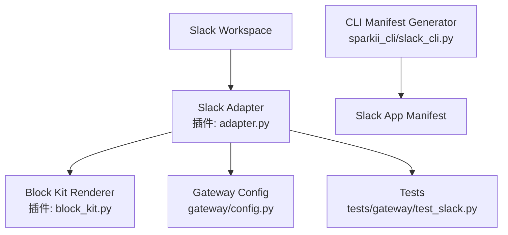
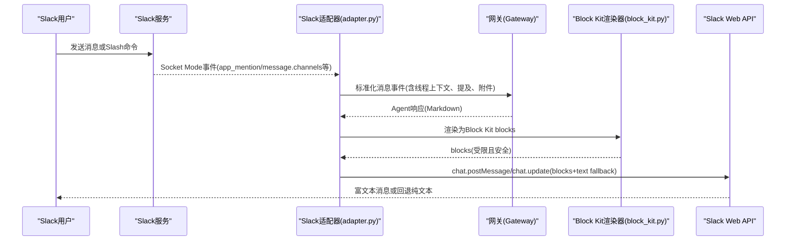
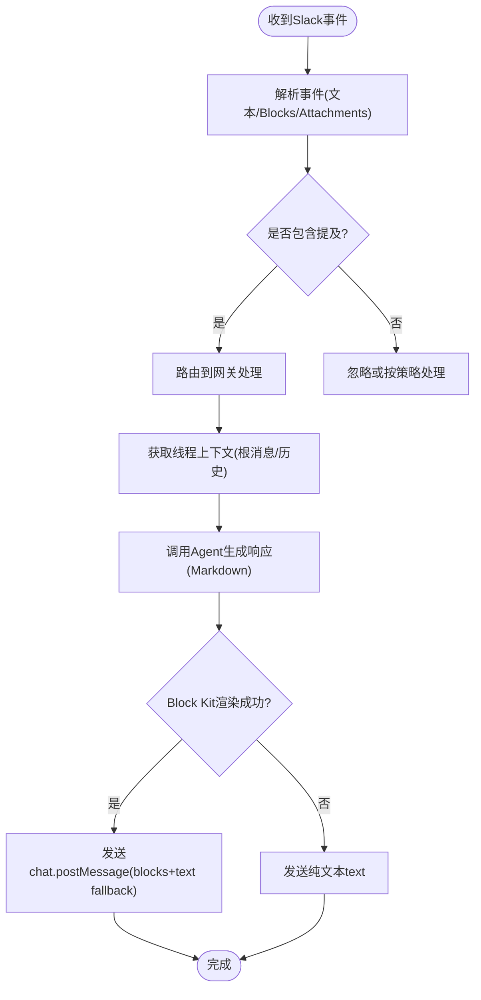
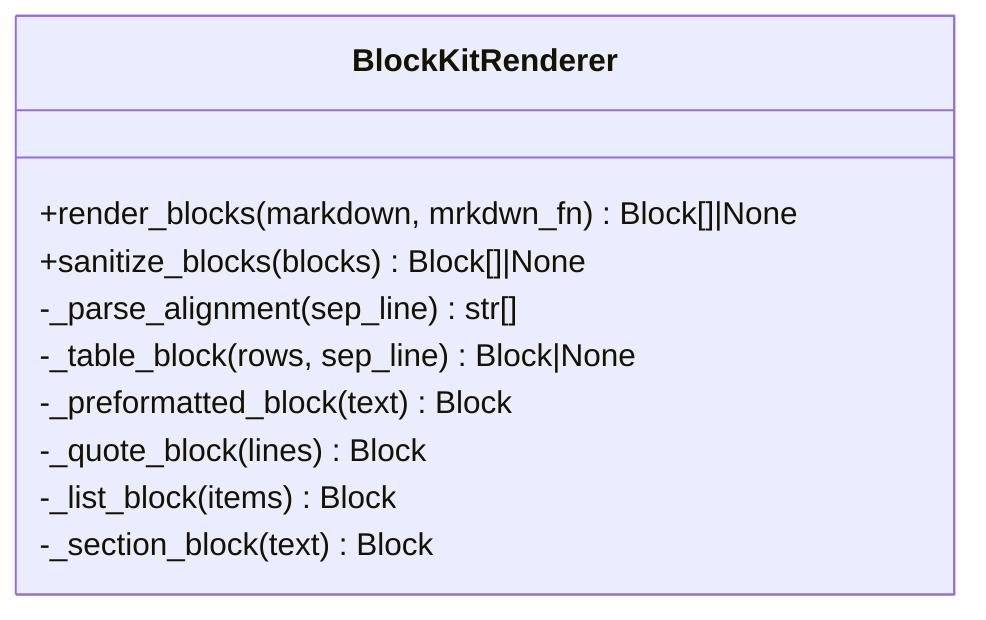
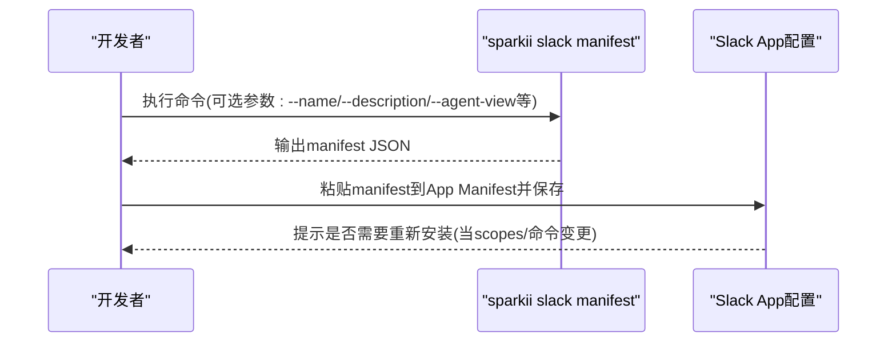
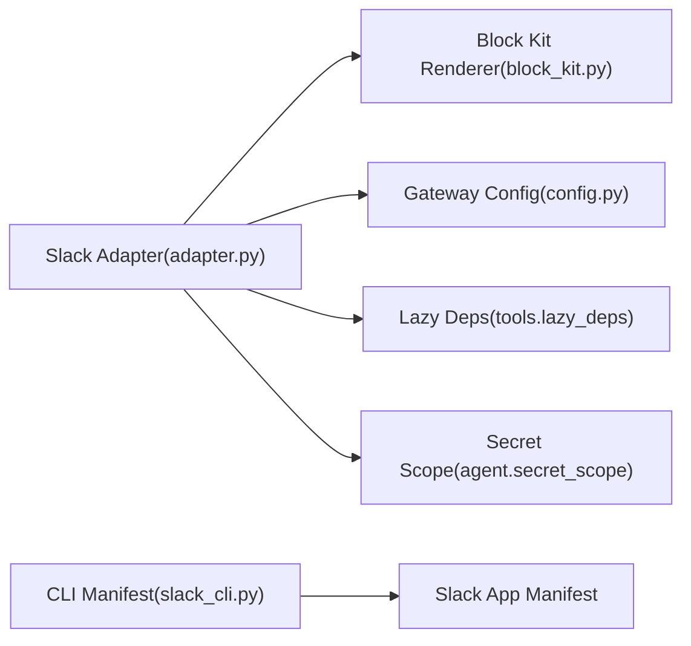

# Slack频道集成

<cite>
**本文引用的文件**
- [plugins/platforms/slack/adapter.py](file://plugins/platforms/slack/adapter.py)
- [plugins/platforms/slack/block_kit.py](file://plugins/platforms/slack/block_kit.py)
- [sparkii_cli/slack_cli.py](file://sparkii_cli/slack_cli.py)
- [sparkii_cli/subcommands/slack.py](file://sparkii_cli/subcommands/slack.py)
- [gateway/config.py](file://gateway/config.py)
- [tests/gateway/test_slack.py](file://tests/gateway/test_slack.py)
</cite>

## 目录
1. [简介](#简介)
2. [项目结构](#项目结构)
3. [核心组件](#核心组件)
4. [架构总览](#架构总览)
5. [详细组件分析](#详细组件分析)
6. [依赖关系分析](#依赖关系分析)
7. [性能与限制](#性能与限制)
8. [故障排查指南](#故障排查指南)
9. [结论](#结论)
10. [附录：配置清单与示例](#附录配置清单与示例)

## 简介
本指南面向需要在Slack中集成并运行该项目的用户与运维人员，覆盖从创建Slack应用、配置Bot权限与事件订阅，到启用Socket Mode、消息路由、Block Kit富文本渲染、Slash命令、工作流扩展、以及常见问题处理的全流程。文档基于代码库中的Slack平台适配器、Block Kit渲染器、CLI清单生成器与网关配置模块进行说明，确保每一步都有明确的实现依据与可追溯的文件来源。

## 项目结构
与Slack集成相关的核心代码主要分布在以下位置：
- 平台适配器：负责接收Slack事件、发送消息、处理Slash命令、线程上下文、文件与音视频处理等
- Block Kit渲染器：将Agent的Markdown响应转换为Slack Block Kit富文本结构，并遵守Slack的结构限制
- CLI清单生成器：自动生成Slack应用清单（包含OAuth范围、事件订阅、Socket Mode、Slash命令等）
- 网关配置：定义平台开关、环境变量映射、回复模式、输入状态指示等
- 测试用例：覆盖忽略频道、消息去重、Block Kit适配、认证绕过等场景

**图表来源**
- [plugins/platforms/slack/adapter.py:1-120](file://plugins/platforms/slack/adapter.py#L1-L120)
- [plugins/platforms/slack/block_kit.py:1-42](file://plugins/platforms/slack/block_kit.py#L1-L42)
- [sparkii_cli/slack_cli.py:30-163](file://sparkii_cli/slack_cli.py#L30-L163)
- [gateway/config.py:580-636](file://gateway/config.py#L580-L636)
- [tests/gateway/test_slack.py:1-100](file://tests/gateway/test_slack.py#L1-L100)

**章节来源**
- [plugins/platforms/slack/adapter.py:1-120](file://plugins/platforms/slack/adapter.py#L1-L120)
- [plugins/platforms/slack/block_kit.py:1-42](file://plugins/platforms/slack/block_kit.py#L1-L42)
- [sparkii_cli/slack_cli.py:30-163](file://sparkii_cli/slack_cli.py#L30-L163)
- [gateway/config.py:580-636](file://gateway/config.py#L580-L636)
- [tests/gateway/test_slack.py:1-100](file://tests/gateway/test_slack.py#L1-L100)

## 核心组件
- Slack平台适配器（adapter.py）
  - 使用slack-bolt的异步App与Socket Mode处理器接收消息、Slash命令、反应事件
  - 支持线程上下文缓存、消息去重、代理设置、音频格式映射、Block Kit提及提取
  - 提供发送路径、消息格式化、附件与文件处理、错误体大小限制读取
- Block Kit渲染器（block_kit.py）
  - 将Markdown解析为Slack Block Kit blocks，支持标题、分隔线、引用、列表、表格、代码块
  - 严格遵循Slack限制（最大blocks数、section文本长度、table行列与字符上限），超限回退为等宽文本
  - 提供sanitize_blocks对出站payload做安全裁剪，避免invalid_blocks导致整条消息失败
- CLI清单生成器（slack_cli.py）
  - 生成完整Slack应用清单，包括显示信息、Bot用户、Slash命令、OAuth范围、事件订阅、Socket Mode
  - 支持assistant_view或agent_view两种消息体验，并可仅输出slash_commands片段用于合并
- 网关配置（config.py）
  - 定义平台令牌环境变量映射（SLACK_BOT_TOKEN）、回复模式、输入状态指示、重启通知等
  - 提供PlatformConfig数据类，支持序列化与反序列化，便于YAML/JSON配置

**章节来源**
- [plugins/platforms/slack/adapter.py:1-120](file://plugins/platforms/slack/adapter.py#L1-L120)
- [plugins/platforms/slack/block_kit.py:1-42](file://plugins/platforms/slack/block_kit.py#L1-L42)
- [sparkii_cli/slack_cli.py:30-163](file://sparkii_cli/slack_cli.py#L30-L163)
- [gateway/config.py:580-636](file://gateway/config.py#L580-L636)

## 架构总览
下图展示了Slack集成的端到端调用链：用户在Slack中通过频道或DM发送消息或Slash命令，适配器接收事件后进入网关处理，Agent生成响应后由Block Kit渲染器转换为富文本blocks，最终通过Slack API发送回频道或线程。

**图表来源**
- [plugins/platforms/slack/adapter.py:1-120](file://plugins/platforms/slack/adapter.py#L1-L120)
- [plugins/platforms/slack/block_kit.py:368-535](file://plugins/platforms/slack/block_kit.py#L368-L535)
- [sparkii_cli/slack_cli.py:30-163](file://sparkii_cli/slack_cli.py#L30-L163)

## 详细组件分析

### Slack平台适配器（adapter.py）
- 功能要点
  - 使用AsyncApp与AsyncSocketModeHandler建立长连接，接收app_mention、message.channels/im/mpim、reaction_added/removed等事件
  - 支持Slash命令处理，并通过contextvar记录调用者user_id以匹配并发命令的响应
  - 线程上下文缓存：获取thread根消息与历史，控制图片下载数量，避免冷启动时上下文过大
  - 消息去重：针对Socket Mode重投递窗口延长TTL，防止重复回复
  - 代理与SSRF防护：解析并应用代理URL，排除特定主机；对URL进行安全校验
  - 音频格式映射：将Slack语音消息的容器类型映射为STT后端支持的扩展名
  - Block Kit提及提取：从rich_text_quote之外的元素中提取用户提及，避免转发内容误触发
  - 错误体限制：读取错误响应体时限制字节数，避免大响应阻塞
- 关键数据结构
  - _ThreadContextCache：缓存线程上下文内容、父消息作者、原始replies负载
  - MessageDeduplicator：基于LRU与TTL的消息去重
- 错误处理
  - 对网络异常、SDK导入失败、渲染异常等进行防御性处理，保证消息不丢失
  - 在send路径中，若blocks渲染失败则回退到纯文本text

**图表来源**
- [plugins/platforms/slack/adapter.py:254-380](file://plugins/platforms/slack/adapter.py#L254-L380)
- [plugins/platforms/slack/adapter.py:399-533](file://plugins/platforms/slack/adapter.py#L399-L533)
- [plugins/platforms/slack/adapter.py:748-770](file://plugins/platforms/slack/adapter.py#L748-L770)

**章节来源**
- [plugins/platforms/slack/adapter.py:1-120](file://plugins/platforms/slack/adapter.py#L1-L120)
- [plugins/platforms/slack/adapter.py:254-380](file://plugins/platforms/slack/adapter.py#L254-L380)
- [plugins/platforms/slack/adapter.py:399-533](file://plugins/platforms/slack/adapter.py#L399-L533)
- [plugins/platforms/slack/adapter.py:748-770](file://plugins/platforms/slack/adapter.py#L748-L770)

### Block Kit渲染器（block_kit.py）
- 功能要点
  - 将Markdown段落、代码块、引用、列表、表格、标题等转换为对应的Block Kit结构
  - 表格优先尝试原生table块，超出Slack限制（行/列/字符）时回退为等宽文本
  - 严格遵循Slack限制：最大blocks数、section文本长度、header文本长度
  - sanitize_blocks对出站payload进行安全裁剪，避免空元素、超长文本、非法column_settings导致invalid_blocks
- 设计约束
  - 任何渲染异常都返回None，调用方回退到纯文本，确保消息不丢失
  - 每个blocks必须附带text fallback，用于通知、屏幕阅读器与旧客户端

**图表来源**
- [plugins/platforms/slack/block_kit.py:368-535](file://plugins/platforms/slack/block_kit.py#L368-L535)
- [plugins/platforms/slack/block_kit.py:591-689](file://plugins/platforms/slack/block_kit.py#L591-L689)

**章节来源**
- [plugins/platforms/slack/block_kit.py:1-42](file://plugins/platforms/slack/block_kit.py#L1-L42)
- [plugins/platforms/slack/block_kit.py:368-535](file://plugins/platforms/slack/block_kit.py#L368-L535)
- [plugins/platforms/slack/block_kit.py:591-689](file://plugins/platforms/slack/block_kit.py#L591-L689)

### CLI清单生成器（slack_cli.py）
- 功能要点
  - 生成完整的Slack应用清单，包含display_information、features（bot_user、slash_commands、assistant_view或agent_view）、oauth_config.scopes、settings.event_subscriptions、interactivity、socket_mode_enabled
  - 默认启用assistant_view，可通过参数切换为agent_view或关闭AI助手模式
  - 自动注入必要的OAuth范围（如app_mentions:read、channels:history、chat:write、files:read/write等）与事件订阅（如app_mention、message.*、reaction_*等）
  - 支持仅输出slash_commands数组以便合并到现有清单
- 使用方式
  - 通过命令行生成manifest JSON，粘贴到Slack应用的“Features → App Manifest → Edit”中保存
  - 保存后若scopes或命令变更，Slack会提示重新安装应用

**图表来源**
- [sparkii_cli/slack_cli.py:30-163](file://sparkii_cli/slack_cli.py#L30-L163)
- [sparkii_cli/slack_cli.py:166-283](file://sparkii_cli/slack_cli.py#L166-L283)

**章节来源**
- [sparkii_cli/slack_cli.py:30-163](file://sparkii_cli/slack_cli.py#L30-L163)
- [sparkii_cli/slack_cli.py:166-283](file://sparkii_cli/slack_cli.py#L166-L283)
- [sparkii_cli/subcommands/slack.py:12-94](file://sparkii_cli/subcommands/slack.py#L12-L94)

### 网关配置（config.py）
- 功能要点
  - 平台令牌环境变量映射：Platform.SLACK对应SLACK_BOT_TOKEN
  - PlatformConfig支持reply_to_mode（off/first/all）、typing_indicator、gateway_restart_notification、typing_status_text等
  - 支持channel_overrides与extra字段，便于细粒度配置
- 使用建议
  - 在网关配置中启用Slack平台并设置token
  - 根据需求调整回复模式与输入状态指示，避免对用户造成干扰

**章节来源**
- [gateway/config.py:580-636](file://gateway/config.py#L580-L636)

## 依赖关系分析
- 外部依赖
  - slack-bolt与slack-sdk：用于Socket Mode与Web API调用
  - aiohttp：用于HTTP请求与代理
- 内部依赖
  - gateway.platforms.base：消息事件、发送结果、代理与SSRF防护工具
  - agent.secret_scope：读取密钥（如SLACK_BOT_TOKEN）
  - tools.lazy_deps：懒加载依赖，首次使用时安装并绑定模块
- 耦合与内聚
  - 适配器与渲染器解耦：渲染器为纯函数，无外部状态，便于测试与回退
  - 适配器与网关紧密耦合：通过标准化事件与发送接口交互
  - CLI与网关命令注册解耦：通过COMMAND_REGISTRY动态生成Slash命令

**图表来源**
- [plugins/platforms/slack/adapter.py:23-66](file://plugins/platforms/slack/adapter.py#L23-L66)
- [plugins/platforms/slack/adapter.py:286-323](file://plugins/platforms/slack/adapter.py#L286-L323)
- [sparkii_cli/slack_cli.py:30-163](file://sparkii_cli/slack_cli.py#L30-L163)

**章节来源**
- [plugins/platforms/slack/adapter.py:23-66](file://plugins/platforms/slack/adapter.py#L23-L66)
- [plugins/platforms/slack/adapter.py:286-323](file://plugins/platforms/slack/adapter.py#L286-L323)
- [sparkii_cli/slack_cli.py:30-163](file://sparkii_cli/slack_cli.py#L30-L163)

## 性能与限制
- 消息去重与重投递
  - Socket Mode重投递窗口较长，适配器将去重TTL设置为1小时，避免重复回复
- 文本与Blocks限制
  - section文本最大3000字符，header文本最大150字符，blocks总数最大50
  - 表格块限制：最多100行、20列、单元格总字符不超过10000；超限回退为等宽文本
- 音频与转录
  - 将Slack语音消息容器类型映射为STT后端支持的扩展名，确保转录成功率
- 代理与SSRF
  - 支持代理URL配置，排除特定主机；对URL进行安全校验，防止SSRF攻击

**章节来源**
- [plugins/platforms/slack/adapter.py:748-770](file://plugins/platforms/slack/adapter.py#L748-L770)
- [plugins/platforms/slack/block_kit.py:34-42](file://plugins/platforms/slack/block_kit.py#L34-L42)
- [plugins/platforms/slack/block_kit.py:295-340](file://plugins/platforms/slack/block_kit.py#L295-L340)
- [plugins/platforms/slack/adapter.py:772-800](file://plugins/platforms/slack/adapter.py#L772-L800)

## 故障排查指南
- 权限不足
  - 检查OAuth范围是否包含必要权限（如app_mentions:read、channels:history、chat:write、files:read/write等）
  - 确认事件订阅已启用（如app_mention、message.*、reaction_*等）
  - 参考清单生成器的默认范围与事件，按需调整
- 消息格式错误
  - 若出现invalid_blocks，检查blocks是否超过限制或包含空元素
  - 使用sanitize_blocks对出站payload进行安全裁剪，避免失败
  - 对于复杂表格，若超出限制将回退为等宽文本，确保消息可达
- 连接问题
  - 确认Socket Mode已启用，并配置了正确的Bot Token与应用Token
  - 检查代理配置是否正确，排除Slack相关主机
  - 查看Socket Mode任务取消与超时逻辑，避免长时间阻塞
- 忽略频道
  - 若配置ignored_channels，适配器将阻止向这些频道发送消息，需检查配置
- 测试验证
  - 使用测试用例验证适配器行为，如忽略频道、消息去重、Block Kit适配等

**章节来源**
- [sparkii_cli/slack_cli.py:79-128](file://sparkii_cli/slack_cli.py#L79-L128)
- [plugins/platforms/slack/block_kit.py:591-689](file://plugins/platforms/slack/block_kit.py#L591-L689)
- [plugins/platforms/slack/adapter.py:665-745](file://plugins/platforms/slack/adapter.py#L665-L745)
- [tests/gateway/test_slack.py:116-140](file://tests/gateway/test_slack.py#L116-L140)

## 结论
本项目提供了完整的Slack集成能力，涵盖从应用清单生成、权限与事件配置、Socket Mode连接、消息路由与富文本渲染，到性能优化与故障排查的全链路支持。通过模块化设计与严格的限制处理，确保在高负载与复杂场景下仍能稳定运行。建议在生产环境中结合测试用例与日志监控，持续验证配置与行为。

## 附录：配置清单与示例
- 环境变量
  - SLACK_BOT_TOKEN：Bot令牌，用于认证与API调用
  - SLACK_APP_TOKEN：应用令牌，用于Socket Mode（如适用）
  - SLACK_DEDUP_TTL_SECONDS：自定义消息去重窗口（秒）
- OAuth范围（示例）
  - app_mentions:read、channels:history、channels:read、chat:write、commands、files:read、files:write、groups:history、groups:read、im:history、im:read、im:write、mpim:history、mpim:read、reactions:read、users:read
- 事件订阅（示例）
  - app_mention、message.channels、message.groups、message.im、message.mpim、reaction_added、reaction_removed
- Socket Mode
  - 在Slack应用中启用Socket Mode，并配置事件URL（由适配器通过Socket Mode处理）
- 回复模式
  - reply_to_mode：off/first/all，控制是否在线程中回复
- 输入状态指示
  - typing_indicator：是否显示“正在输入”状态
  - typing_status_text：自定义状态文本（如“正在思考...”）
- 忽略频道
  - ignored_channels：配置频道ID，适配器将阻止向这些频道发送消息

**章节来源**
- [gateway/config.py:580-636](file://gateway/config.py#L580-L636)
- [sparkii_cli/slack_cli.py:79-128](file://sparkii_cli/slack_cli.py#L79-L128)
- [tests/gateway/test_slack.py:116-140](file://tests/gateway/test_slack.py#L116-L140)