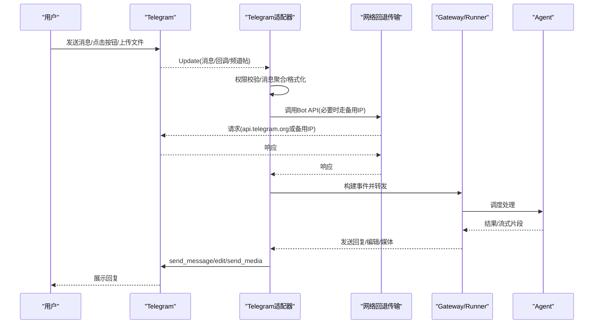
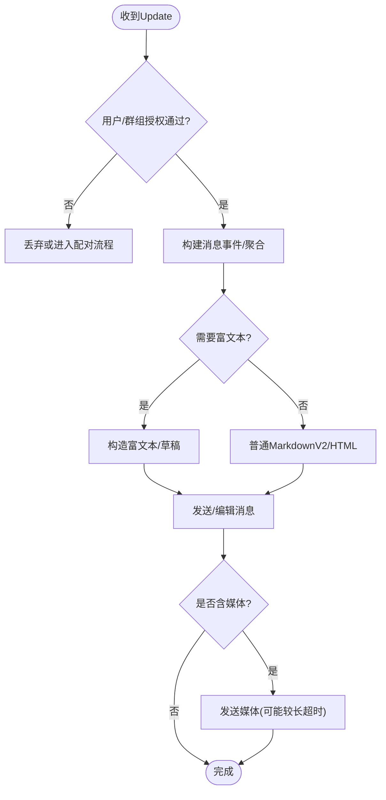
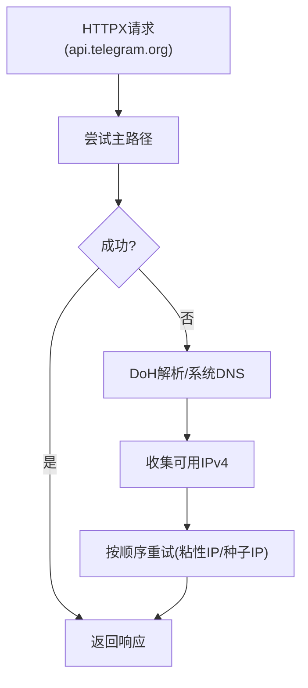
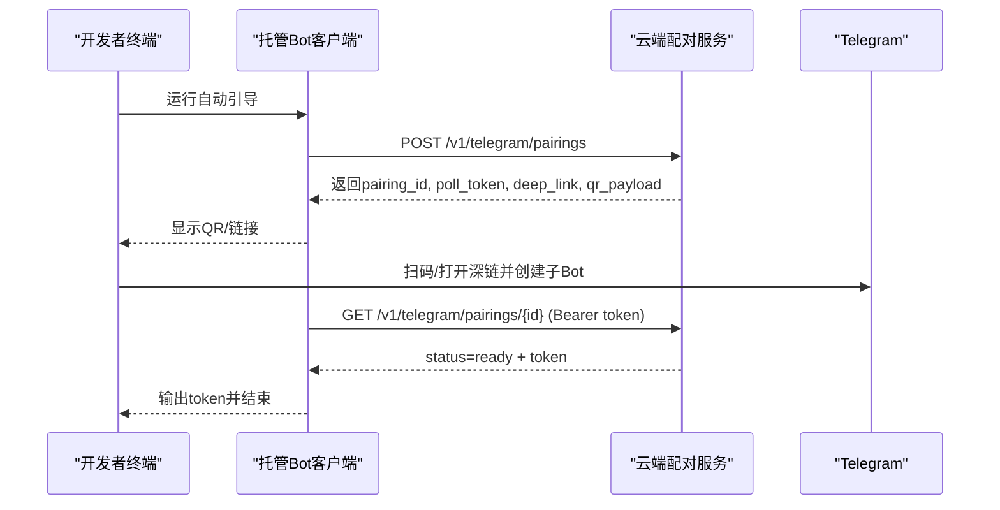
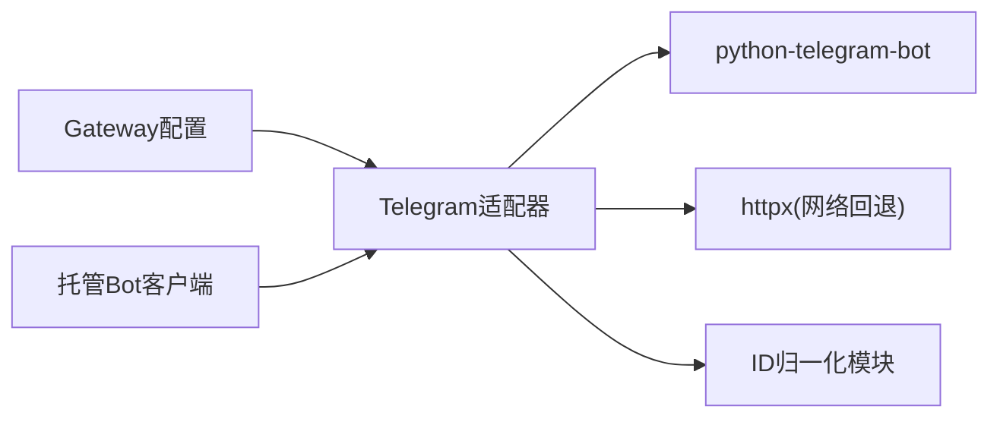

# Telegram Bot集成

<cite>
**本文引用的文件**
- [plugins/platforms/telegram/adapter.py](file://plugins/platforms/telegram/adapter.py)
- [plugins/platforms/telegram/plugin.yaml](file://plugins/platforms/telegram/plugin.yaml)
- [plugins/platforms/telegram/telegram_network.py](file://plugins/platforms/telegram/telegram_network.py)
- [plugins/platforms/telegram/telegram_ids.py](file://plugins/platforms/telegram/telegram_ids.py)
- [sparkii_cli/telegram_managed_bot.py](file://sparkii_cli/telegram_managed_bot.py)
- [gateway/config.py](file://gateway/config.py)
- [tests/gateway/test_telegram_connect.py](file://tests/gateway/test_telegram_connect.py)
- [tests/gateway/test_telegram_auth_check.py](file://tests/gateway/test_telegram_auth_check.py)
- [tests/gateway/test_telegram_channel_posts.py](file://tests/gateway/test_telegram_channel_posts.py)
</cite>

## 目录
1. [简介](#简介)
2. [项目结构](#项目结构)
3. [核心组件](#核心组件)
4. [架构总览](#架构总览)
5. [详细组件分析](#详细组件分析)
6. [依赖关系分析](#依赖关系分析)
7. [性能与限制](#性能与限制)
8. [故障排查指南](#故障排查指南)
9. [结论](#结论)
10. [附录：配置与环境变量示例](#附录配置与环境变量示例)

## 简介
本指南面向需要在系统中集成Telegram Bot的开发者，覆盖从创建Bot、获取Token、选择Webhook或长轮询模式，到Markdown/HTML格式、内联键盘、回调按钮、文件上传、用户权限管理、群组与频道订阅等完整流程。同时提供环境变量与安全配置建议、错误处理策略、API限制与重试机制、消息去重以及常见问题解决方案。

## 项目结构
本项目通过插件化方式接入Telegram平台，核心由以下模块组成：
- Telegram适配器：负责消息收发、格式化、媒体处理、回调与命令路由、连接生命周期管理等
- 网络层：提供DNS不可达时的备用IP直连能力，保持TLS/SNI不变
- ID归一化：统一chat_id与@username的处理
- 托管Bot引导：通过云端服务自动创建子Bot并安全获取Token
- 配置与环境：集中声明必需与可选环境变量

```mermaid
graph TB
subgraph "Telegram平台"
TBot["Telegram Bot"]
API["Telegram Bot API"]
end
subgraph "Hermes/Gateway"
Adapter["Telegram适配器<br/>plugins/platforms/telegram/adapter.py"]
Net["网络回退传输<br/>plugins/platforms/telegram/telegram_network.py"]
IDs["ID归一化<br/>plugins/platforms/telegram/telegram_ids.py"]
CLI["托管Bot引导<br/>sparkii_cli/telegram_managed_bot.py"]
Cfg["平台配置<br/>gateway/config.py"]
end
TBot < --> API
API --> Adapter
Adapter --> Net
Adapter --> IDs
CLI --> Adapter
Cfg --> Adapter
```

图表来源
- [plugins/platforms/telegram/adapter.py:633-800](file://plugins/platforms/telegram/adapter.py#L633-L800)
- [plugins/platforms/telegram/telegram_network.py:52-166](file://plugins/platforms/telegram/telegram_network.py#L52-L166)
- [plugins/platforms/telegram/telegram_ids.py:23-52](file://plugins/platforms/telegram/telegram_ids.py#L23-L52)
- [sparkii_cli/telegram_managed_bot.py:166-359](file://sparkii_cli/telegram_managed_bot.py#L166-L359)
- [gateway/config.py:584-584](file://gateway/config.py#L584-L584)

章节来源
- [plugins/platforms/telegram/adapter.py:633-800](file://plugins/platforms/telegram/adapter.py#L633-L800)
- [plugins/platforms/telegram/telegram_network.py:52-166](file://plugins/platforms/telegram/telegram_network.py#L52-L166)
- [plugins/platforms/telegram/telegram_ids.py:23-52](file://plugins/platforms/telegram/telegram_ids.py#L23-L52)
- [sparkii_cli/telegram_managed_bot.py:166-359](file://sparkii_cli/telegram_managed_bot.py#L166-L359)
- [gateway/config.py:584-584](file://gateway/config.py#L584-L584)

## 核心组件
- Telegram适配器（TelegramAdapter）
  - 负责长轮询启动、消息聚合、MarkdownV2/HTML渲染、富文本消息、编辑与分片、媒体发送、回调与命令处理、权限校验、心跳与恢复等
  - 关键常量与行为：最大消息长度、富文本上限、是否支持代码块、是否拆分长消息、是否需要最终编辑标志、流式编辑降级策略等
- 网络回退传输（TelegramFallbackTransport）
  - 在api.telegram.org不可达时，基于DoH或种子IP进行TCP直连重试，保持Host与SNI不变
- ID归一化（telegram_ids）
  - 将chat_id统一为Bot API可接受的数值或@username字符串
- 托管Bot引导（telegram_managed_bot）
  - 通过云端配对服务生成深链/二维码，引导用户在Telegram中创建子Bot并返回Token
- 配置与环境（plugin.yaml、config.py）
  - 声明必需环境变量TELEGRAM_BOT_TOKEN及若干可选环境变量；Gateway侧将平台与密钥名绑定

章节来源
- [plugins/platforms/telegram/adapter.py:633-800](file://plugins/platforms/telegram/adapter.py#L633-L800)
- [plugins/platforms/telegram/telegram_network.py:52-166](file://plugins/platforms/telegram/telegram_network.py#L52-L166)
- [plugins/platforms/telegram/telegram_ids.py:23-52](file://plugins/platforms/telegram/telegram_ids.py#L23-L52)
- [sparkii_cli/telegram_managed_bot.py:166-359](file://sparkii_cli/telegram_managed_bot.py#L166-L359)
- [plugins/platforms/telegram/plugin.yaml:1-36](file://plugins/platforms/telegram/plugin.yaml#L1-L36)
- [gateway/config.py:584-584](file://gateway/config.py#L584-L584)

## 架构总览
下图展示了从Telegram事件到Hermes/Gateway再到Agent的端到端流程，包括网络回退、权限校验、消息聚合与响应发送。



图表来源
- [plugins/platforms/telegram/adapter.py:633-800](file://plugins/platforms/telegram/adapter.py#L633-L800)
- [plugins/platforms/telegram/telegram_network.py:105-166](file://plugins/platforms/telegram/telegram_network.py#L105-L166)

## 详细组件分析

### Telegram适配器（消息、格式、媒体、回调）
- 消息接收与聚合
  - 对快速连续的消息进行批处理聚合，避免客户端分片导致的重复处理
  - 支持论坛主题thread_id、频道channel_post、位置/媒体等类型
- 格式化与富文本
  - 支持MarkdownV2与HTML；对表格、任务列表等进行兼容转换
  - 富文本消息（Rich Messages）默认关闭，可按需开启；超长内容自动降级为传统分片路径
- 媒体发送
  - 图片、视频、音频、文档等；视频发送有更长读取超时以应对转码
  - 语音/音频时长探测，确保播放时间正确显示
- 回调与命令
  - 内联键盘与回调按钮处理；命令路由与权限前置检查
- 连接与生命周期
  - 长轮询启动、健康检查、心跳、异常恢复；对卡死场景提供线程级超时与堆栈诊断
  - 停止/断开阶段设置超时保护，防止阻塞整个重连队列



图表来源
- [plugins/platforms/telegram/adapter.py:633-800](file://plugins/platforms/telegram/adapter.py#L633-L800)

章节来源
- [plugins/platforms/telegram/adapter.py:633-800](file://plugins/platforms/telegram/adapter.py#L633-L800)

### 网络回退传输（DNS不可达/连接失败）
- 当主路径api.telegram.org不可用时，使用DoH查询或种子IP进行TCP直连重试
- 保持逻辑主机名与TLS SNI不变，确保证书校验通过
- 连接池大小受限，避免文件描述符耗尽；失败后主动释放坏连接



图表来源
- [plugins/platforms/telegram/telegram_network.py:196-306](file://plugins/platforms/telegram/telegram_network.py#L196-L306)
- [plugins/platforms/telegram/telegram_network.py:52-166](file://plugins/platforms/telegram/telegram_network.py#L52-L166)

章节来源
- [plugins/platforms/telegram/telegram_network.py:52-166](file://plugins/platforms/telegram/telegram_network.py#L52-L166)
- [plugins/platforms/telegram/telegram_network.py:196-306](file://plugins/platforms/telegram/telegram_network.py#L196-L306)

### ID归一化（chat_id与@username）
- 将chat_id统一为数值或@username字符串，避免int()转换失败
- 提供稳定键用于状态持久化与字典索引

章节来源
- [plugins/platforms/telegram/telegram_ids.py:23-52](file://plugins/platforms/telegram/telegram_ids.py#L23-L52)

### 托管Bot引导（自动创建子Bot）
- 通过云端配对服务创建配对记录，生成深链/二维码
- 用户在Telegram中确认创建子Bot，服务端轮询返回Token
- 本地仅保存一次Token，便于后续配置



图表来源
- [sparkii_cli/telegram_managed_bot.py:166-359](file://sparkii_cli/telegram_managed_bot.py#L166-L359)

章节来源
- [sparkii_cli/telegram_managed_bot.py:166-359](file://sparkii_cli/telegram_managed_bot.py#L166-L359)

### 权限管理与群组/频道配置
- 允许名单与群组白名单：支持DM与群组分别配置
- 未授权DM行为：可选择“忽略”或“进入配对流程”
- 频道订阅：频道post通过effective_message转换为事件，保留频道身份以便按ID放行
- 提及与观察：支持require_mention与observe_unmentioned_group_messages等选项

章节来源
- [tests/gateway/test_telegram_auth_check.py:74-316](file://tests/gateway/test_telegram_auth_check.py#L74-L316)
- [tests/gateway/test_telegram_channel_posts.py:135-150](file://tests/gateway/test_telegram_channel_posts.py#L135-L150)

## 依赖关系分析
- 适配器依赖python-telegram-bot库；缺失时标记为致命且不可重试的错误
- 网络层依赖httpx与外部DoH服务；具备代理检测与连接池限制
- 配置层将平台与密钥名绑定，确保运行时能正确读取Token



图表来源
- [tests/gateway/test_telegram_connect.py:43-57](file://tests/gateway/test_telegram_connect.py#L43-L57)
- [plugins/platforms/telegram/adapter.py:395-458](file://plugins/platforms/telegram/adapter.py#L395-L458)
- [gateway/config.py:584-584](file://gateway/config.py#L584-L584)

章节来源
- [tests/gateway/test_telegram_connect.py:43-57](file://tests/gateway/test_telegram_connect.py#L43-L57)
- [plugins/platforms/telegram/adapter.py:395-458](file://plugins/platforms/telegram/adapter.py#L395-L458)
- [gateway/config.py:584-584](file://gateway/config.py#L584-L584)

## 性能与限制
- 消息长度与富文本上限
  - 单条消息长度限制与富文本字符上限；超长内容自动分片或降级
- 媒体发送超时
  - 视频等媒体发送因服务端转码而具有更长的读取超时预算
- 批处理与延迟
  - 文本与媒体批处理延迟可调，平衡首包时延与聚合效果
- 连接与重连
  - 长轮询启动与健康检查带超时；异常恢复包含心跳与强制升级路径
- 速率限制与重试
  - 针对Telegram侧限流与临时错误进行退避与重试；最终编辑失败时直接降级为重新发送

[本节为通用性能讨论，不直接分析具体文件]

## 故障排查指南
- 连接超时/不可达
  - 启用网络回退传输，自动发现备用IP；检查代理设置与防火墙
  - 关注日志中的“sticky fallback IP”提示，确认是否已切换到备用路径
- 缺少依赖或Token
  - 若python-telegram-bot未安装或Token缺失，connect会返回致命错误且不可重试
  - 使用托管Bot引导流程获取Token，或通过命令行手动配置
- 权限不足
  - 检查allow_from/group_allow_from/allowed_chats等配置；未授权DM可配置为进入配对流程
- 频道消息未处理
  - 确认通道post通过effective_message被识别；频道无from_user时需按频道ID放行
- 富文本渲染异常
  - 如客户端不支持富文本，将自动降级为MarkdownV2；可关闭rich_messages以保持一致性
- 长轮询卡死
  - 内部已设置多层超时与堆栈诊断；如遇长时间无输出，查看线程堆栈定位阻塞点

章节来源
- [plugins/platforms/telegram/telegram_network.py:105-166](file://plugins/platforms/telegram/telegram_network.py#L105-L166)
- [tests/gateway/test_telegram_connect.py:43-57](file://tests/gateway/test_telegram_connect.py#L43-L57)
- [tests/gateway/test_telegram_auth_check.py:74-316](file://tests/gateway/test_telegram_auth_check.py#L74-L316)
- [tests/gateway/test_telegram_channel_posts.py:135-150](file://tests/gateway/test_telegram_channel_posts.py#L135-L150)
- [plugins/platforms/telegram/adapter.py:633-800](file://plugins/platforms/telegram/adapter.py#L633-L800)

## 结论
本集成方案通过适配器、网络回退、ID归一化与托管Bot引导，提供了高可用的Telegram Bot接入能力。结合严格的权限控制、丰富的格式与媒体支持、完善的错误处理与恢复机制，可满足生产环境对稳定性与可维护性的要求。建议在生产部署中合理配置环境变量与权限白名单，并根据业务需求开启富文本与观察未提及消息等功能。

[本节为总结性内容，不直接分析具体文件]

## 附录：配置与环境变量示例
- 必需环境变量
  - TELEGRAM_BOT_TOKEN：从@BotFather获取的Bot Token
- 可选环境变量
  - TELEGRAM_ALLOWED_USERS：逗号分隔的允许用户ID
  - TELEGRAM_ALLOW_ALL_USERS：开发环境允许所有用户（谨慎使用）
  - TELEGRAM_HOME_CHANNEL：定时任务/通知默认投递的聊天ID
  - TELEGRAM_HOME_CHANNEL_NAME：主页频道显示名称
- 安全建议
  - 使用托管Bot引导流程获取Token，避免手工复制泄露
  - 严格配置allow_from/group_allow_from/allowed_chats，最小权限原则
  - 在生产环境关闭不必要的调试与日志敏感信息输出
- 常见配置项说明
  - rich_messages/rich_drafts：按需开启富文本与草稿预览
  - typing_cooldown_seconds：打字指示的冷却间隔，避免频繁调用
  - 文本/媒体批处理延迟：根据用户体验与API限制调优

章节来源
- [plugins/platforms/telegram/plugin.yaml:13-36](file://plugins/platforms/telegram/plugin.yaml#L13-L36)
- [gateway/config.py:584-584](file://gateway/config.py#L584-L584)
- [sparkii_cli/telegram_managed_bot.py:166-359](file://sparkii_cli/telegram_managed_bot.py#L166-L359)