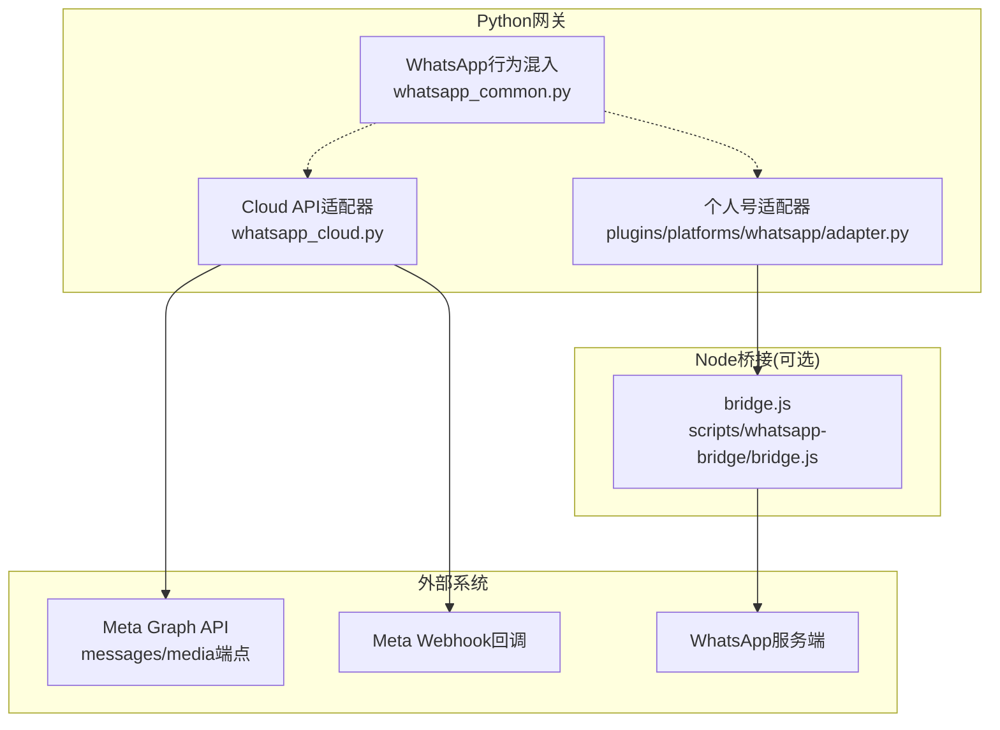
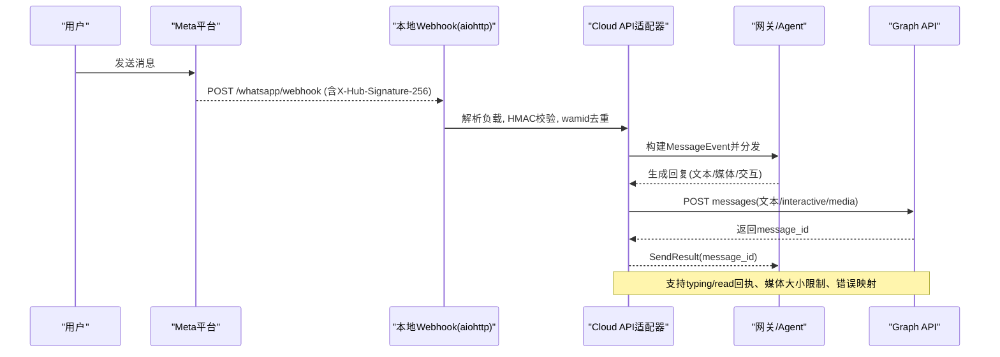
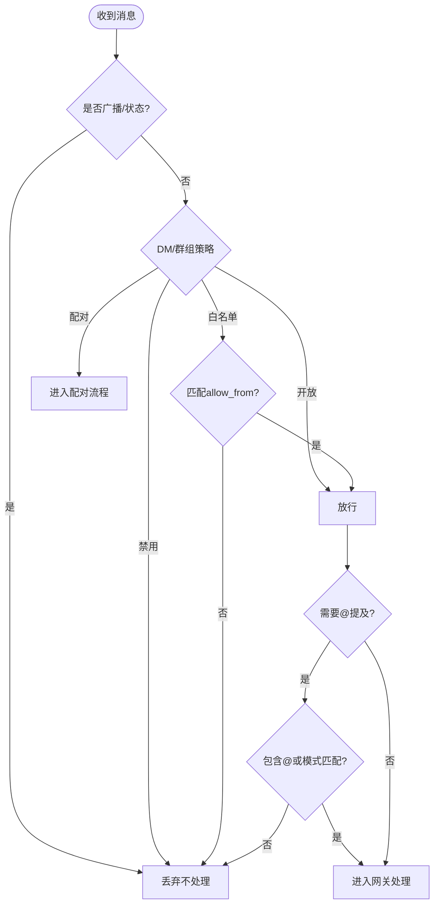
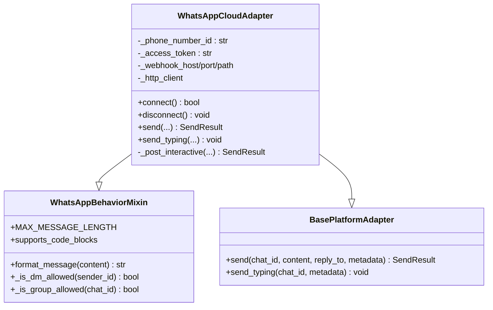
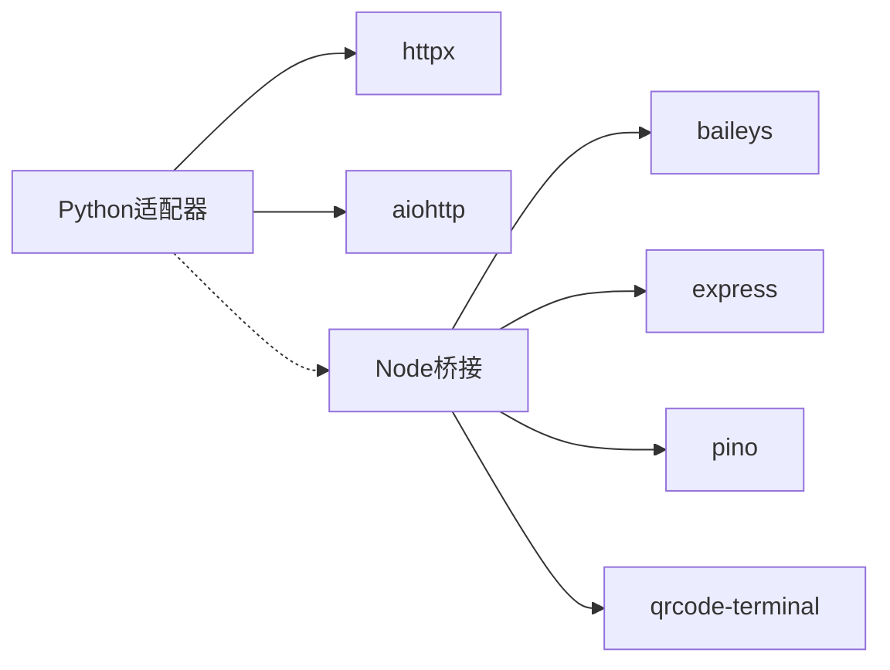

# WhatsApp Business集成

<cite>
**本文引用的文件**
- [whatsapp_cloud.py](file://gateway/platforms/whatsapp_cloud.py)
- [whatsapp_common.py](file://gateway/platforms/whatsapp_common.py)
- [whatsapp_identity.py](file://gateway/whatsapp_identity.py)
- [setup_whatsapp_cloud.py](file://sparkii_cli/setup_whatsapp_cloud.py)
- [adapter.py](file://plugins/platforms/whatsapp/adapter.py)
- [bridge.js](file://scripts/whatsapp-bridge/bridge.js)
- [package.json](file://scripts/whatsapp-bridge/package.json)
</cite>

## 目录
1. [简介](#简介)
2. [项目结构](#项目结构)
3. [核心组件](#核心组件)
4. [架构总览](#架构总览)
5. [详细组件分析](#详细组件分析)
6. [依赖关系分析](#依赖关系分析)
7. [性能与限制](#性能与限制)
8. [故障排除指南](#故障排除指南)
9. [结论](#结论)
10. [附录：配置清单与示例](#附录配置清单与示例)

## 简介
本指南面向需要在系统中集成WhatsApp Business（Meta WhatsApp Cloud API）的开发者与运维人员。内容涵盖：
- Facebook开发者账户与WhatsApp Business API准备
- 电话号码ID、访问令牌、Webhook验证等关键配置
- 消息类型与能力：文本、媒体、模板、交互式消息
- 审批流程、费率与计费、消息历史与状态跟踪
- 完整配置示例与环境变量说明
- 错误处理、重试机制、速率限制与常见问题排查

## 项目结构
本项目提供两套WhatsApp接入路径：
- 官方Cloud API适配器：通过Graph API发送消息，使用aiohttp内置Webhook服务接收回调
- 个人号桥接适配器：通过Node.js进程运行Baileys桥接，暴露HTTP接口供Python网关调度

图表来源
- [whatsapp_cloud.py:203-495](file://gateway/platforms/whatsapp_cloud.py#L203-L495)
- [adapter.py:381-800](file://plugins/platforms/whatsapp/adapter.py#L381-L800)
- [bridge.js:1-200](file://scripts/whatsapp-bridge/bridge.js#L1-L200)

章节来源
- [whatsapp_cloud.py:1-120](file://gateway/platforms/whatsapp_cloud.py#L1-L120)
- [adapter.py:1-100](file://plugins/platforms/whatsapp/adapter.py#L1-L100)
- [bridge.js:1-120](file://scripts/whatsapp-bridge/bridge.js#L1-L120)

## 核心组件
- WhatsApp行为混入层：统一DM/群组策略、@提及检测、Markdown转WhatsApp语法、消息分片与长度预算
- Cloud API适配器：基于Graph API的消息发送、Webhook接收、HMAC签名校验、wamid去重、交互消息（按钮/列表）、媒体上传/下载、打字指示与已读回执
- 身份规范化：统一JID/LID/电话号码形式，确保授权与会话键一致
- 个人号桥接适配器：管理Node桥接进程生命周期、自动安装依赖、健康检查、消息轮询、媒体缓存安全校验
- 交互式设置向导：引导填写Phone Number ID、Access Token、App Secret、Verify Token、收件人白名单，并输出后续步骤

章节来源
- [whatsapp_common.py:64-126](file://gateway/platforms/whatsapp_common.py#L64-L126)
- [whatsapp_cloud.py:203-355](file://gateway/platforms/whatsapp_cloud.py#L203-L355)
- [whatsapp_identity.py:48-207](file://gateway/whatsapp_identity.py#L48-L207)
- [adapter.py:381-800](file://plugins/platforms/whatsapp/adapter.py#L381-L800)
- [setup_whatsapp_cloud.py:232-542](file://sparkii_cli/setup_whatsapp_cloud.py#L232-L542)

## 架构总览
下图展示Cloud API路径下的端到端调用链：用户消息经Meta回调至本地Webhook，适配器进行签名校验与去重后进入网关；回复消息通过Graph API发送，支持文本、媒体与交互消息。

图表来源
- [whatsapp_cloud.py:435-495](file://gateway/platforms/whatsapp_cloud.py#L435-L495)
- [whatsapp_cloud.py:513-589](file://gateway/platforms/whatsapp_cloud.py#L513-L589)
- [whatsapp_cloud.py:607-660](file://gateway/platforms/whatsapp_cloud.py#L607-L660)
- [whatsapp_cloud.py:678-735](file://gateway/platforms/whatsapp_cloud.py#L678-L735)

## 详细组件分析

### WhatsApp行为混入层（whatsapp_common.py）
- 负责DM/群组策略、@提及检测、引用机器人消息识别、广播/频道过滤
- Markdown到WhatsApp语法的转换（粗体、斜体、删除线、代码块保护、链接转换）
- 出站消息分片与长度预算，避免超长消息导致不可读
- 允许列表动态读取与匹配，兼容LID/JID/电话号码多种形态

图表来源
- [whatsapp_common.py:190-213](file://gateway/platforms/whatsapp_common.py#L190-L213)
- [whatsapp_common.py:254-289](file://gateway/platforms/whatsapp_common.py#L254-L289)
- [whatsapp_common.py:390-423](file://gateway/platforms/whatsapp_common.py#L390-L423)

章节来源
- [whatsapp_common.py:64-126](file://gateway/platforms/whatsapp_common.py#L64-L126)
- [whatsapp_common.py:210-289](file://gateway/platforms/whatsapp_common.py#L210-L289)
- [whatsapp_common.py:390-423](file://gateway/platforms/whatsapp_common.py#L390-L423)
- [whatsapp_common.py:424-499](file://gateway/platforms/whatsapp_common.py#L424-L499)

### Cloud API适配器（whatsapp_cloud.py）
- 连接阶段：校验依赖、初始化HTTP客户端、启动aiohttp Webhook服务（健康检查、验证、回调）
- 出站消息：文本分片发送、上下文引用、rich_sent_store记录以便回引
- 交互消息：按钮/列表，内部状态缓存，支持澄清、审批、确认等场景
- 媒体能力：按类型限制大小、MIME扩展映射、语音opus转码与MP3回退
- 打字指示与已读回执：绑定最新wamid，失败静默降级
- 安全：HMAC签名校验、wamid去重、请求体大小限制

图表来源
- [whatsapp_common.py:64-126](file://gateway/platforms/whatsapp_common.py#L64-L126)
- [whatsapp_cloud.py:203-355](file://gateway/platforms/whatsapp_cloud.py#L203-L355)
- [whatsapp_cloud.py:435-495](file://gateway/platforms/whatsapp_cloud.py#L435-L495)
- [whatsapp_cloud.py:513-589](file://gateway/platforms/whatsapp_cloud.py#L513-L589)
- [whatsapp_cloud.py:607-660](file://gateway/platforms/whatsapp_cloud.py#L607-L660)
- [whatsapp_cloud.py:678-735](file://gateway/platforms/whatsapp_cloud.py#L678-L735)

章节来源
- [whatsapp_cloud.py:1-120](file://gateway/platforms/whatsapp_cloud.py#L1-L120)
- [whatsapp_cloud.py:203-355](file://gateway/platforms/whatsapp_cloud.py#L203-L355)
- [whatsapp_cloud.py:435-495](file://gateway/platforms/whatsapp_cloud.py#L435-L495)
- [whatsapp_cloud.py:513-589](file://gateway/platforms/whatsapp_cloud.py#L513-L589)
- [whatsapp_cloud.py:607-660](file://gateway/platforms/whatsapp_cloud.py#L607-L660)
- [whatsapp_cloud.py:678-735](file://gateway/platforms/whatsapp_cloud.py#L678-L735)

### 身份规范化（whatsapp_identity.py）
- 将JID/LID/电话号码标准化为稳定数字标识
- 通过桥接会话映射文件展开别名集合，保证授权与会话键一致性
- 对外提供to_whatsapp_jid工具，用于出站目标规范化

章节来源
- [whatsapp_identity.py:48-119](file://gateway/whatsapp_identity.py#L48-L119)
- [whatsapp_identity.py:121-207](file://gateway/whatsapp_identity.py#L121-L207)

### 个人号桥接适配器（plugins/platforms/whatsapp/adapter.py）
- 管理Node桥接进程生命周期：自动安装依赖、健康检查、复用或重启旧进程
- 环境变量注入：跨多Profile隔离WHATSAPP_*配置，传递缓存目录
- 消息轮询与批量去抖：减少重复触发Agent调用
- 媒体安全校验：仅允许来自受信任缓存目录的文件路径

章节来源
- [adapter.py:358-800](file://plugins/platforms/whatsapp/adapter.py#L358-L800)

### Node桥接（scripts/whatsapp-bridge/bridge.js）
- 基于Baileys连接WhatsApp，暴露HTTP端点供Python适配器调用
- 支持文本、媒体、位置、投票、打字指示等
- 发送队列串行化，避免并发发送导致的错乱
- 脚本哈希上报，便于Python侧检测陈旧进程并重启

章节来源
- [bridge.js:1-200](file://scripts/whatsapp-bridge/bridge.js#L1-L200)
- [package.json:1-20](file://scripts/whatsapp-bridge/package.json#L1-L20)

### 交互式设置向导（sparkii_cli/setup_whatsapp_cloud.py）
- 字段形状校验：Phone Number ID、Access Token、App Secret、App/WABA ID
- 自动生成Verify Token，指导配置Meta Webhook回调
- 输出后续步骤：启动tunnel、启动网关、验证连通性、添加收件人白名单

章节来源
- [setup_whatsapp_cloud.py:52-157](file://sparkii_cli/setup_whatsapp_cloud.py#L52-L157)
- [setup_whatsapp_cloud.py:232-542](file://sparkii_cli/setup_whatsapp_cloud.py#L232-L542)

## 依赖关系分析
- Python侧依赖：aiohttp（Webhook服务）、httpx（Graph API调用）
- Node侧依赖：@whiskeysockets/baileys（WhatsApp协议）、express（HTTP服务）、pino（日志）、qrcode-terminal（二维码）
- 运行时依赖：Node.js环境、ffmpeg（可选，用于语音格式转换）

图表来源
- [whatsapp_cloud.py:57-71](file://gateway/platforms/whatsapp_cloud.py#L57-L71)
- [package.json:10-15](file://scripts/whatsapp-bridge/package.json#L10-L15)

章节来源
- [whatsapp_cloud.py:57-71](file://gateway/platforms/whatsapp_cloud.py#L57-L71)
- [package.json:1-20](file://scripts/whatsapp-bridge/package.json#L1-L20)

## 性能与限制
- 媒体大小限制：图片5MB、视频16MB、音频16MB、文档100MB、贴纸100KB/500KB
- 消息长度：最大约4096字符，超出自动分片
- Webhook负载上限：3MB
- wamid去重缓存：最多5000条，FIFO淘汰
- 交互状态缓存：最多1000项，FIFO淘汰
- 打字指示/已读回执：最佳努力，失败静默降级
- 发送超时：Node桥接默认60秒，可配置

章节来源
- [whatsapp_cloud.py:98-118](file://gateway/platforms/whatsapp_cloud.py#L98-L118)
- [whatsapp_cloud.py:103-106](file://gateway/platforms/whatsapp_cloud.py#L103-L106)
- [whatsapp_cloud.py:188-190](file://gateway/platforms/whatsapp_cloud.py#L188-L190)
- [bridge.js:120-127](file://scripts/whatsapp-bridge/bridge.js#L120-L127)

## 故障排除指南
- 认证失败
  - 现象：Graph API返回401/400
  - 排查：确认Access Token以“EAA”开头且长度合理；Phone Number ID为15-17位数字而非手机号；App Secret为32位十六进制
  - 参考：[setup_whatsapp_cloud.py:52-157](file://sparkii_cli/setup_whatsapp_cloud.py#L52-L157)
- Webhook未收到或拒绝
  - 现象：POST回调返回503或无响应
  - 排查：设置App Secret启用HMAC校验；配置Verify Token并通过GET订阅握手；确保公网HTTPS可达
  - 参考：[whatsapp_cloud.py:484-495](file://gateway/platforms/whatsapp_cloud.py#L484-L495)、[setup_whatsapp_cloud.py:410-503](file://sparkii_cli/setup_whatsapp_cloud.py#L410-L503)
- 模板消息被拒
  - 现象：发送模板失败或状态为rejected
  - 排查：在Meta商务管理器中提交模板并等待审批；确保模板语言与参数正确；注意24小时对话窗口限制
  - 参考：[whatsapp_cloud.py:661-676](file://gateway/platforms/whatsapp_cloud.py#L661-L676)
- 消息发送限制
  - 现象：频繁发送被限流或失败
  - 排查：控制发送频率；利用分片与延迟；关注Graph API错误码与重试策略
  - 参考：[whatsapp_cloud.py:557-570](file://gateway/platforms/whatsapp_cloud.py#L557-L570)
- 媒体上传失败
  - 现象：超过大小限制或MIME不匹配
  - 排查：检查类型与大小；确保扩展名与MIME对应；语音note需opus或回退mp3
  - 参考：[whatsapp_cloud.py:108-150](file://gateway/platforms/whatsapp_cloud.py#L108-L150)
- 个人号桥接异常
  - 现象：桥接进程崩溃或未连接
  - 排查：检查Node.js版本与依赖安装；查看bridge.log；确认creds.json存在并完成配对
  - 参考：[adapter.py:515-554](file://plugins/platforms/whatsapp/adapter.py#L515-L554)

章节来源
- [setup_whatsapp_cloud.py:52-157](file://sparkii_cli/setup_whatsapp_cloud.py#L52-L157)
- [whatsapp_cloud.py:484-495](file://gateway/platforms/whatsapp_cloud.py#L484-L495)
- [whatsapp_cloud.py:661-676](file://gateway/platforms/whatsapp_cloud.py#L661-L676)
- [whatsapp_cloud.py:557-570](file://gateway/platforms/whatsapp_cloud.py#L557-L570)
- [whatsapp_cloud.py:108-150](file://gateway/platforms/whatsapp_cloud.py#L108-L150)
- [adapter.py:515-554](file://plugins/platforms/whatsapp/adapter.py#L515-L554)

## 结论
本项目提供了生产级与个人号两种WhatsApp接入方案。Cloud API适配器具备完善的Webhook安全校验、媒体处理、交互消息与状态反馈能力；个人号桥接适配器则通过Node进程实现灵活的个人号自动化。结合交互式设置向导与身份规范化模块，可快速完成从账户准备到上线运行的全流程。建议在生产环境中优先采用Cloud API，并严格遵循安全与限流实践。

## 附录：配置清单与示例
- 必需环境变量
  - WHATSAPP_CLOUD_PHONE_NUMBER_ID：15-17位数字ID（非手机号）
  - WHATSAPP_CLOUD_ACCESS_TOKEN：以“EAA”开头的访问令牌
- 可选环境变量
  - WHATSAPP_CLOUD_APP_SECRET：32位十六进制，用于HMAC校验
  - WHATSAPP_CLOUD_VERIFY_TOKEN：用于Webhook GET订阅验证
  - WHATSAPP_CLOUD_WEBHOOK_HOST/PORT/PATH：Webhook监听地址与路径
  - WHATSAPP_CLOUD_API_VERSION：Graph API版本
  - WHATSAPP_CLOUD_ALLOW_ALL_USERS：开启开放DM（谨慎使用）
  - WHATSAPP_CLOUD_ALLOWED_USERS/ALLOW_FROM：收件人白名单
  - WHATSAPP_DM_POLICY/GROUP_POLICY：DM与群组策略
- 典型配置步骤
  - 在Meta开发者后台创建应用并启用WhatsApp
  - 生成临时或永久访问令牌
  - 配置Webhook回调URL与Verify Token
  - 启动cloudflared隧道与网关，验证连通性
  - 添加测试号码到收件人白名单并发送测试消息
- 参考命令与验证
  - 通过curl验证Webhook GET订阅握手
  - 访问健康检查端点确认verify token配置状态
  - 发送测试消息并观察message_id与状态

章节来源
- [setup_whatsapp_cloud.py:232-542](file://sparkii_cli/setup_whatsapp_cloud.py#L232-L542)
- [whatsapp_cloud.py:27-39](file://gateway/platforms/whatsapp_cloud.py#L27-L39)
- [whatsapp_cloud.py:484-495](file://gateway/platforms/whatsapp_cloud.py#L484-L495)