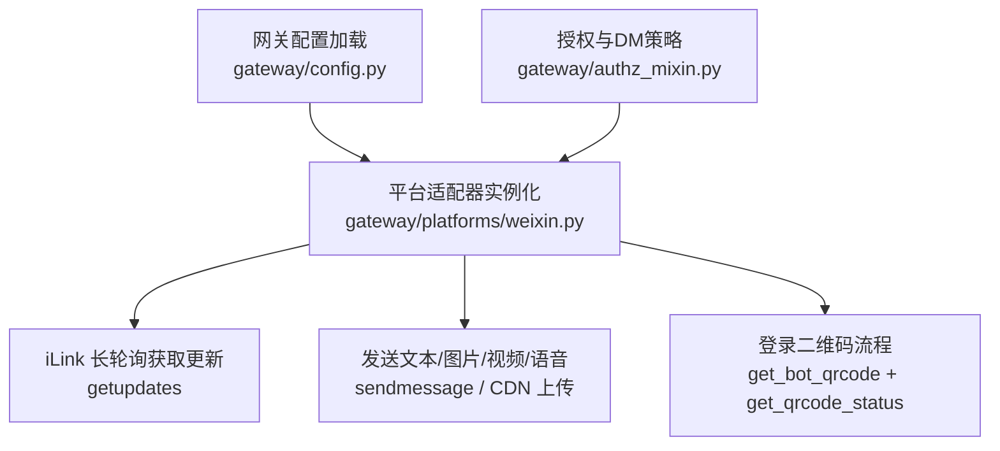
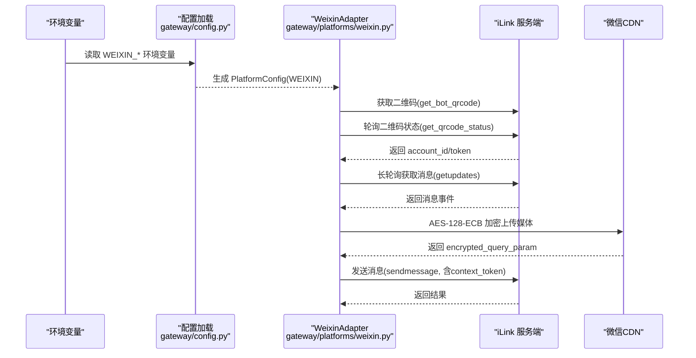
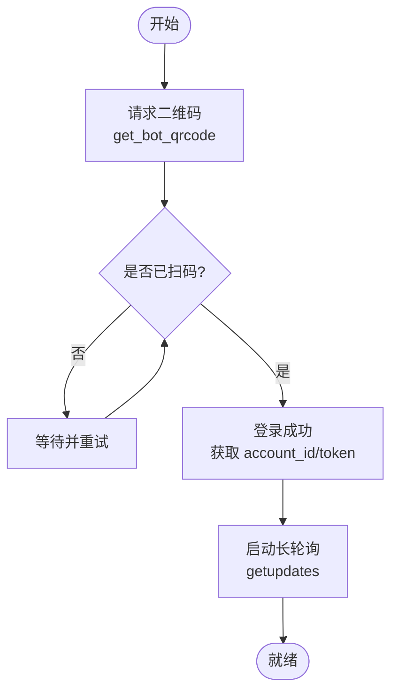
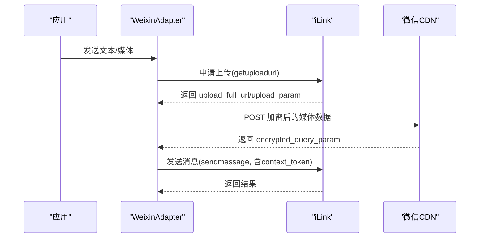
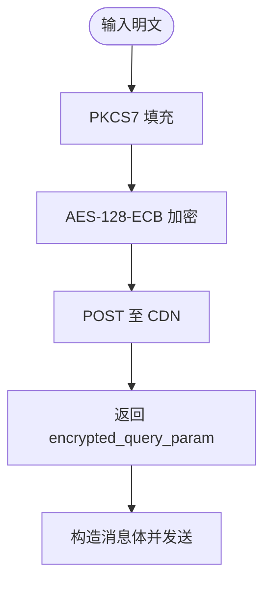
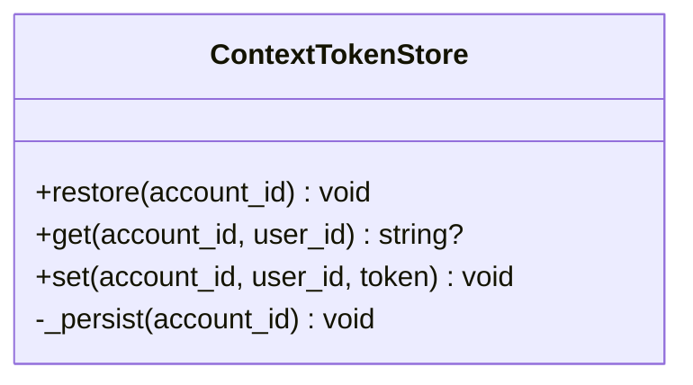
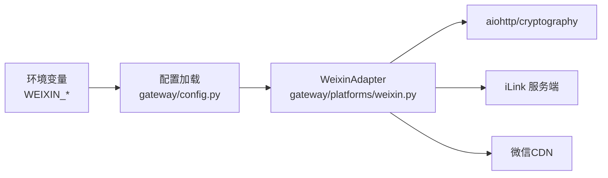

# 微信公众号集成

<cite>
**本文引用的文件**
- [gateway/platforms/weixin.py](file://gateway/platforms/weixin.py)
- [gateway/config.py](file://gateway/config.py)
- [gateway/authz_mixin.py](file://gateway/authz_mixin.py)
- [agent/prompt_builder.py](file://agent/prompt_builder.py)
</cite>

## 目录
1. [简介](#简介)
2. [项目结构](#项目结构)
3. [核心组件](#核心组件)
4. [架构总览](#架构总览)
5. [详细组件分析](#详细组件分析)
6. [依赖关系分析](#依赖关系分析)
7. [性能与并发](#性能与并发)
8. [故障排查指南](#故障排查指南)
9. [结论](#结论)
10. [附录：配置清单与示例键位](#附录配置清单与示例键位)

## 简介
本指南面向希望在现有系统中接入“微信个人号（通过 iLink Bot API）”的开发者。仓库已提供微信平台的适配器实现，涵盖消息收发、媒体上传下载、会话上下文管理、登录二维码流程、频率限制处理等能力。本文基于仓库代码梳理接入步骤、安全机制、API 限制与常见问题排错方法，并给出与环境变量相关的配置要点。

注意：仓库中未包含“微信公众平台（服务号/订阅号）”的官方服务器回调、模板消息、微信支付等实现；若需对接公众号官方能力，请结合本文的通用思路在平台层扩展。

## 项目结构
围绕微信集成，仓库主要涉及以下位置：
- 平台适配器：gateway/platforms/weixin.py（iLink 协议封装、消息收发、媒体处理、登录流程、错误码处理）
- 平台配置加载：gateway/config.py（环境变量到平台配置的映射，启用 WEIXIN 平台）
- 授权与 DM 策略：gateway/authz_mixin.py（未授权私聊行为、允许列表控制）
- 提示词适配：agent/prompt_builder.py（WeCom/Weixin 等平台上下文提示）

图示来源
- [gateway/config.py:2332-2372](file://gateway/config.py#L2332-L2372)
- [gateway/platforms/weixin.py:447-466](file://gateway/platforms/weixin.py#L447-L466)
- [gateway/platforms/weixin.py:2144-2240](file://gateway/platforms/weixin.py#L2144-L2240)
- [gateway/platforms/weixin.py:1060-1168](file://gateway/platforms/weixin.py#L1060-L1168)
- [gateway/authz_mixin.py:831-888](file://gateway/authz_mixin.py#L831-L888)

章节来源
- [gateway/config.py:2332-2372](file://gateway/config.py#L2332-L2372)
- [gateway/platforms/weixin.py:447-466](file://gateway/platforms/weixin.py#L447-L466)
- [gateway/platforms/weixin.py:2144-2240](file://gateway/platforms/weixin.py#L2144-L2240)
- [gateway/platforms/weixin.py:1060-1168](file://gateway/platforms/weixin.py#L1060-L1168)
- [gateway/authz_mixin.py:831-888](file://gateway/authz_mixin.py#L831-L888)

## 核心组件
- WeixinAdapter（平台适配器）
  - 负责与 iLink 服务端交互：长轮询拉取消息、发送消息、获取配置（打字票）、获取上传地址、二维码登录等。
  - 媒体处理：AES-128-ECB 加密上传、CDN 下载解密、MIME 类型推断、语音特殊参数。
  - 会话上下文：持久化 context_token，保证同一对话链路的连续性。
  - 错误处理：识别会话过期、频率限制、超时等，进行退避重试或清理。
- 配置加载器（config.py）
  - 将环境变量映射为平台配置项，启用 WEIXIN 平台，注入 token、account_id、base_url、cdn_base_url、dm_policy、group_policy、allow_from 等。
- 授权与访问控制（authz_mixin.py）
  - 根据 dm_policy、allowlist 决定未授权私聊的处理策略（忽略/配对/放行）。
- 提示词适配（prompt_builder.py）
  - 针对 WeCom/Weixin 等平台生成合适的系统提示，指导模型输出格式。

章节来源
- [gateway/platforms/weixin.py:1-116](file://gateway/platforms/weixin.py#L1-L116)
- [gateway/platforms/weixin.py:298-346](file://gateway/platforms/weixin.py#L298-L346)
- [gateway/platforms/weixin.py:447-466](file://gateway/platforms/weixin.py#L447-L466)
- [gateway/platforms/weixin.py:2144-2240](file://gateway/platforms/weixin.py#L2144-L2240)
- [gateway/config.py:2332-2372](file://gateway/config.py#L2332-L2372)
- [gateway/authz_mixin.py:831-888](file://gateway/authz_mixin.py#L831-L888)
- [agent/prompt_builder.py:942-953](file://agent/prompt_builder.py#L942-L953)

## 架构总览
下图展示了从配置加载到消息收发的端到端流程，包括登录、长轮询、发送文本与媒体、CDN 加密传输等关键环节。

图示来源
- [gateway/config.py:2332-2372](file://gateway/config.py#L2332-L2372)
- [gateway/platforms/weixin.py:447-466](file://gateway/platforms/weixin.py#L447-L466)
- [gateway/platforms/weixin.py:2144-2240](file://gateway/platforms/weixin.py#L2144-L2240)
- [gateway/platforms/weixin.py:1060-1168](file://gateway/platforms/weixin.py#L1060-L1168)

## 详细组件分析

### 登录与会话建立（二维码登录）
- 通过 iLink 接口获取二维码并轮询扫码状态，成功后获得 account_id 与 token。
- 登录成功后，使用 token 发起长轮询以接收消息。

图示来源
- [gateway/platforms/weixin.py:1060-1168](file://gateway/platforms/weixin.py#L1060-L1168)

章节来源
- [gateway/platforms/weixin.py:1060-1168](file://gateway/platforms/weixin.py#L1060-L1168)

### 消息收发流程（文本与媒体）
- 文本消息：调用 sendmessage，携带 context_token 保持会话上下文。
- 媒体消息：先向 iLink 申请上传地址，本地用 AES-128-ECB 加密后上传至 CDN，再调用 sendmessage 附带加密参数与密钥信息。

图示来源
- [gateway/platforms/weixin.py:2144-2240](file://gateway/platforms/weixin.py#L2144-L2240)
- [gateway/platforms/weixin.py:468-502](file://gateway/platforms/weixin.py#L468-L502)

章节来源
- [gateway/platforms/weixin.py:468-502](file://gateway/platforms/weixin.py#L468-L502)
- [gateway/platforms/weixin.py:2144-2240](file://gateway/platforms/weixin.py#L2144-L2240)

### 媒体加密与下载
- 上行：AES-128-ECB 加密，PKCS7 填充，上传至微信 CDN，返回加密查询参数。
- 下行：从 CDN 下载密文，按 aes_key_b64 解密得到明文。

图示来源
- [gateway/platforms/weixin.py:204-228](file://gateway/platforms/weixin.py#L204-L228)
- [gateway/platforms/weixin.py:581-606](file://gateway/platforms/weixin.py#L581-L606)
- [gateway/platforms/weixin.py:661-683](file://gateway/platforms/weixin.py#L661-L683)

章节来源
- [gateway/platforms/weixin.py:204-228](file://gateway/platforms/weixin.py#L204-L228)
- [gateway/platforms/weixin.py:581-606](file://gateway/platforms/weixin.py#L581-L606)
- [gateway/platforms/weixin.py:661-683](file://gateway/platforms/weixin.py#L661-L683)

### 会话上下文（context_token）持久化
- 每个账号对每个聊天对象维护一个 context_token，落盘持久化，重启后可恢复，确保多轮对话连贯性。

图示来源
- [gateway/platforms/weixin.py:298-346](file://gateway/platforms/weixin.py#L298-L346)

章节来源
- [gateway/platforms/weixin.py:298-346](file://gateway/platforms/weixin.py#L298-L346)

### 授权与私聊策略
- 支持 dm_policy（pairing/allowlist/disabled）与 allowlist 环境变量控制未授权私聊行为。
- 当存在 allowlist 时，默认忽略未知用户私聊，避免噪音与信息泄露。

章节来源
- [gateway/authz_mixin.py:831-888](file://gateway/authz_mixin.py#L831-L888)
- [gateway/config.py:2350-2361](file://gateway/config.py#L2350-L2361)

### 提示词适配
- 针对不同平台（如 WeCom/Weixin）生成系统提示，指导模型输出格式与附件说明。

章节来源
- [agent/prompt_builder.py:942-953](file://agent/prompt_builder.py#L942-L953)

## 依赖关系分析
- 运行时依赖：aiohttp（HTTP 客户端）、cryptography（AES 加解密），在适配器中按需导入并提供降级逻辑。
- 外部服务：iLink 服务端、微信 CDN（novac2c.cdn.weixin.qq.com 等白名单域名）。
- 配置来源：环境变量（WEIXIN_TOKEN、WEIXIN_ACCOUNT_ID、WEIXIN_BASE_URL、WEIXIN_CDN_BASE_URL、WEIXIN_DM_POLICY、WEIXIN_GROUP_POLICY、WEIXIN_ALLOWED_USERS、WEIXIN_GROUP_ALLOWED_USERS 等）。

图示来源
- [gateway/config.py:2332-2372](file://gateway/config.py#L2332-L2372)
- [gateway/platforms/weixin.py:38-56](file://gateway/platforms/weixin.py#L38-L56)
- [gateway/platforms/weixin.py:624-634](file://gateway/platforms/weixin.py#L624-L634)

章节来源
- [gateway/platforms/weixin.py:38-56](file://gateway/platforms/weixin.py#L38-L56)
- [gateway/platforms/weixin.py:624-634](file://gateway/platforms/weixin.py#L624-L634)
- [gateway/config.py:2332-2372](file://gateway/config.py#L2332-L2372)

## 性能与并发
- 连接池与超时：使用 aiohttp 的 TCPConnector，设置较短 keepalive 时间，配合 enable_cleanup_closed 减少 CLOSE_WAIT 残留。
- 超时控制：所有网络调用均通过 asyncio.wait_for 设置超时，避免阻塞。
- 频率限制与退避：识别 iLink 的频率限制与“会话过期”错误码，采用指数退避与重试策略。
- 媒体上传：优先使用 upload_full_url 直传 CDN，失败回退到由 upload_param 构造的 URL；上传前进行 AES 加密，减小带宽占用。
- 消息去重：内置消息去重器，降低重复处理概率。

章节来源
- [gateway/platforms/weixin.py:137-165](file://gateway/platforms/weixin.py#L137-L165)
- [gateway/platforms/weixin.py:400-444](file://gateway/platforms/weixin.py#L400-L444)
- [gateway/platforms/weixin.py:110-127](file://gateway/platforms/weixin.py#L110-L127)
- [gateway/platforms/weixin.py:2144-2240](file://gateway/platforms/weixin.py#L2144-L2240)

## 故障排查指南
- 签名验证失败（iLink 认证）
  - 检查 WEIXIN_TOKEN 是否正确配置，且与当前账号匹配。
  - 确认 base_url 与 cdn_base_url 指向正确的环境。
  - 参考：[gateway/config.py:2332-2372](file://gateway/config.py#L2332-L2372)
- 消息接收异常（长轮询无响应）
  - 检查 getupdates 超时与重试逻辑，关注网络连通性与代理设置。
  - 参考：[gateway/platforms/weixin.py:447-466](file://gateway/platforms/weixin.py#L447-L466)
- 权限不足（未授权私聊被忽略）
  - 检查 WEIXIN_ALLOWED_USERS、WEIXIN_GROUP_ALLOWED_USERS 是否配置导致默认忽略。
  - 可通过 dm_policy 调整为 pairing 或 allowlist。
  - 参考：[gateway/authz_mixin.py:831-888](file://gateway/authz_mixin.py#L831-L888), [gateway/config.py:2350-2361](file://gateway/config.py#L2350-L2361)
- 媒体无法显示（图片灰块/无法播放）
  - 检查 aes_key 编码方式是否为 base64(hex_string)，避免直接 base64(raw_bytes)。
  - 检查 CDN 域名是否在白名单内。
  - 参考：[gateway/platforms/weixin.py:2189-2206](file://gateway/platforms/weixin.py#L2189-L2206), [gateway/platforms/weixin.py:624-634](file://gateway/platforms/weixin.py#L624-L634)
- 频率限制（-2）与会话过期（-14）
  - 自动退避重试；若持续失败，重新扫码登录获取新 token。
  - 参考：[gateway/platforms/weixin.py:110-127](file://gateway/platforms/weixin.py#L110-L127)

章节来源
- [gateway/config.py:2332-2372](file://gateway/config.py#L2332-L2372)
- [gateway/platforms/weixin.py:447-466](file://gateway/platforms/weixin.py#L447-L466)
- [gateway/authz_mixin.py:831-888](file://gateway/authz_mixin.py#L831-L888)
- [gateway/platforms/weixin.py:2189-2206](file://gateway/platforms/weixin.py#L2189-L2206)
- [gateway/platforms/weixin.py:624-634](file://gateway/platforms/weixin.py#L624-L634)
- [gateway/platforms/weixin.py:110-127](file://gateway/platforms/weixin.py#L110-L127)

## 结论
仓库已提供完整的微信个人号（iLink）接入能力，覆盖登录、消息收发、媒体加密传输、会话上下文、频率限制与错误恢复等关键路径。对于“微信公众平台（服务号/订阅号）”的官方能力（菜单、模板消息、素材管理、支付等），当前仓库未包含对应实现；可在平台层按本文思路扩展。建议在生产环境中严格配置环境变量与访问控制策略，并结合日志与监控定位问题。

## 附录：配置清单与示例键位
以下为与微信集成相关的环境变量键位及用途（仅列出仓库实际使用的键名）：
- WEIXIN_TOKEN：iLink 认证令牌
- WEIXIN_ACCOUNT_ID：微信账号标识
- WEIXIN_BASE_URL：iLink 服务端基础地址
- WEIXIN_CDN_BASE_URL：微信 CDN 基础地址
- WEIXIN_DM_POLICY：私聊策略（pairing/allowlist/disabled）
- WEIXIN_GROUP_POLICY：群聊策略
- WEIXIN_ALLOWED_USERS：允许的私聊用户列表
- WEIXIN_GROUP_ALLOWED_USERS：允许的群聊用户列表
- WEIXIN_HOME_CHANNEL：首页频道（可选）

章节来源
- [gateway/config.py:2332-2372](file://gateway/config.py#L2332-L2372)