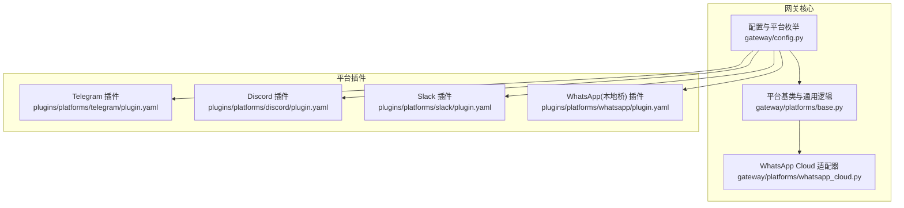
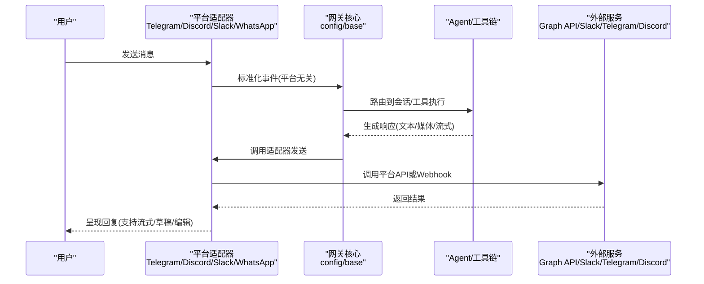
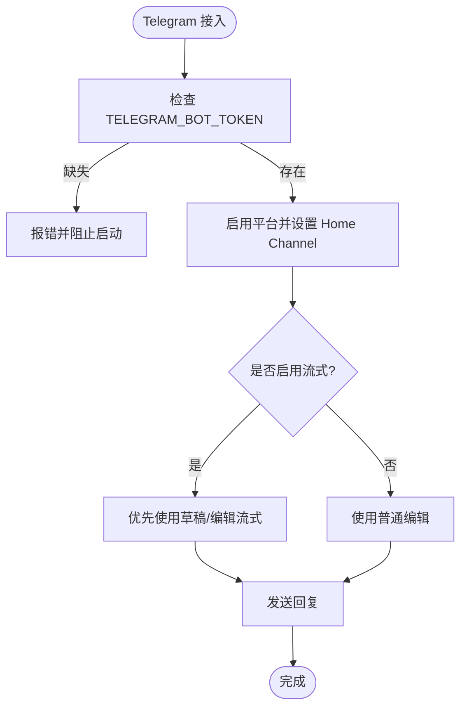
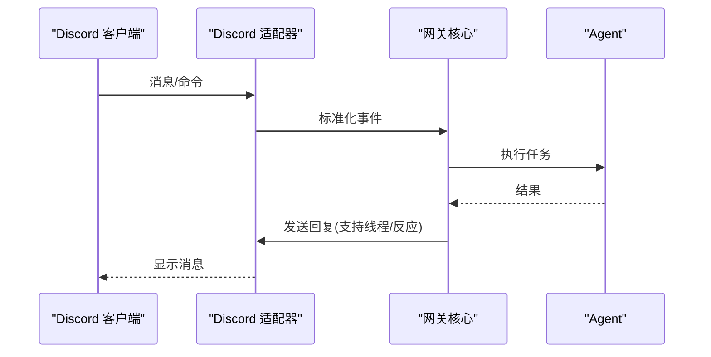
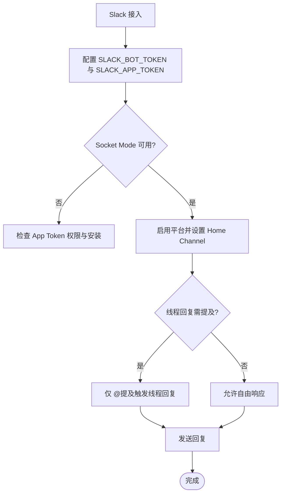
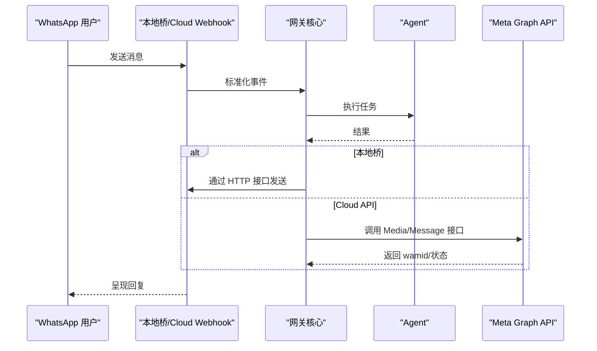
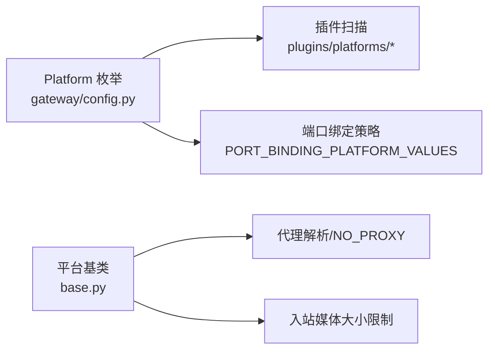

# 消息平台集成指南

<cite>
**本文引用的文件**
- [gateway/config.py](file://gateway/config.py)
- [gateway/platforms/base.py](file://gateway/platforms/base.py)
- [gateway/platforms/whatsapp_cloud.py](file://gateway/platforms/whatsapp_cloud.py)
- [plugins/platforms/telegram/plugin.yaml](file://plugins/platforms/telegram/plugin.yaml)
- [plugins/platforms/discord/plugin.yaml](file://plugins/platforms/discord/plugin.yaml)
- [plugins/platforms/slack/plugin.yaml](file://plugins/platforms/slack/plugin.yaml)
- [plugins/platforms/whatsapp/plugin.yaml](file://plugins/platforms/whatsapp/plugin.yaml)
</cite>

## 目录
1. [简介](#简介)
2. [项目结构](#项目结构)
3. [核心组件](#核心组件)
4. [架构总览](#架构总览)
5. [详细组件分析](#详细组件分析)
6. [依赖关系分析](#依赖关系分析)
7. [性能考虑](#性能考虑)
8. [故障排除指南](#故障排除指南)
9. [结论](#结论)
10. [附录](#附录)

## 简介
本指南面向需要在网关中接入多种消息平台的用户与运维人员，覆盖 Telegram Bot、Discord 服务器、Slack 频道、WhatsApp（含 WhatsApp Cloud）等平台的配置与连接方法。文档同时说明网关服务的启动与配置要点（端口、认证、权限）、各平台特殊要求与限制（API 密钥、机器人创建、群组权限）、消息路由与会话隔离策略，以及常见问题定位与优化建议。

## 项目结构
本项目将“平台适配器”与“网关核心”解耦：
- 平台适配器位于 plugins/platforms/*，每个平台一个插件目录，包含 adapter 实现与 plugin.yaml 声明（所需环境变量、可选能力）。
- 网关核心位于 gateway/，负责统一配置加载、平台枚举、会话管理、流式输出、媒体处理、端口绑定校验等。
- 内置平台与插件平台通过统一的 Platform 枚举与注册机制发现并启用。

**图示来源**
- [gateway/config.py:272-417](file://gateway/config.py#L272-L417)
- [gateway/platforms/base.py:1-120](file://gateway/platforms/base.py#L1-L120)
- [gateway/platforms/whatsapp_cloud.py:1-120](file://gateway/platforms/whatsapp_cloud.py#L1-L120)
- [plugins/platforms/telegram/plugin.yaml:1-36](file://plugins/platforms/telegram/plugin.yaml#L1-L36)
- [plugins/platforms/discord/plugin.yaml:1-35](file://plugins/platforms/discord/plugin.yaml#L1-L35)
- [plugins/platforms/slack/plugin.yaml:1-46](file://plugins/platforms/slack/plugin.yaml#L1-L46)
- [plugins/platforms/whatsapp/plugin.yaml:1-34](file://plugins/platforms/whatsapp/plugin.yaml#L1-L34)

**章节来源**
- [gateway/config.py:272-417](file://gateway/config.py#L272-L417)
- [gateway/platforms/base.py:1-120](file://gateway/platforms/base.py#L1-L120)

## 核心组件
- 平台枚举与配置模型
  - Platform 枚举集中定义所有支持的平台值，包括内置与动态发现的插件平台。
  - PlatformConfig 描述单个平台的启用开关、令牌、家频道、回复线程模式、打字指示器、通道级覆盖等。
  - HomeChannel 表示默认投递目标（平台+聊天ID+名称，可带线程ID与身份溯源信息）。
  - SessionResetPolicy 控制会话重置策略（按日/空闲/两者/从不），避免上下文意外丢失。
  - StreamingConfig 控制流式编辑/草稿传输策略与阈值，适配不同平台能力。

- 端口绑定与监听
  - PORT_BINDING_PLATFORM_VALUES 列出需要绑定 TCP 端口的平台（如 webhook、api_server、msgraph_webhook、feishu、wecom_callback、bluebubbles、sms、whatsapp_cloud、line）。
  - platform_binds_port() 根据平台与连接模式判断是否实际绑定端口（例如飞书在 webhook 模式下才绑定）。

- 代理与网络
  - base.py 提供代理解析、NO_PROXY 匹配、aiohttp/命令式客户端的代理参数构造、SSRF 重定向防护、入站媒体大小限制等。

**章节来源**
- [gateway/config.py:272-417](file://gateway/config.py#L272-L417)
- [gateway/config.py:420-541](file://gateway/config.py#L420-L541)
- [gateway/config.py:593-800](file://gateway/config.py#L593-L800)
- [gateway/platforms/base.py:255-549](file://gateway/platforms/base.py#L255-L549)
- [gateway/platforms/base.py:707-800](file://gateway/platforms/base.py#L707-L800)

## 架构总览
下图展示从消息到达至回发的整体流程，涵盖平台适配器、网关核心与外部服务交互。

**图示来源**
- [gateway/platforms/base.py:78-151](file://gateway/platforms/base.py#L78-L151)
- [gateway/platforms/whatsapp_cloud.py:1-120](file://gateway/platforms/whatsapp_cloud.py#L1-L120)
- [gateway/config.py:593-800](file://gateway/config.py#L593-L800)

## 详细组件分析

### Telegram 集成
- 关键要求
  - 必需环境变量：TELEGRAM_BOT_TOKEN（来自 @BotFather）。
  - 可选：允许用户白名单、允许全部用户（开发用）、Home Channel ID/名称。
- 特性与限制
  - 支持主题/话题、流式编辑、原生媒体、内联键盘、斜杠命令、通知模式、提及门控、按用户/聊天白名单。
  - 文本长度受 UTF-16 单位限制，需截断保护。
- 配置要点
  - 在 config 中启用 telegram 平台并设置 token；如需默认投递目标，配置 home_channel。
  - 可通过 channel_overrides 为不同频道设置模型/提供者/系统提示词。

**图示来源**
- [plugins/platforms/telegram/plugin.yaml:13-36](file://plugins/platforms/telegram/plugin.yaml#L13-L36)
- [gateway/config.py:593-800](file://gateway/config.py#L593-L800)
- [gateway/platforms/base.py:202-253](file://gateway/platforms/base.py#L202-L253)

**章节来源**
- [plugins/platforms/telegram/plugin.yaml:13-36](file://plugins/platforms/telegram/plugin.yaml#L13-L36)
- [gateway/config.py:593-800](file://gateway/config.py#L593-L800)
- [gateway/platforms/base.py:202-253](file://gateway/platforms/base.py#L202-L253)

### Discord 集成
- 关键要求
  - 必需环境变量：DISCORD_BOT_TOKEN（来自开发者应用）。
  - 可选：允许用户白名单、允许全部用户（开发用）、Home Channel ID/名称。
- 特性与限制
  - 支持语音模式、斜杠命令、自由响应频道、角色级 DM 鉴权、线程、反应、频道技能绑定。
- 配置要点
  - 启用 discord 平台并设置 token；按需配置 home_channel。
  - 可在 channel_overrides 中针对不同频道切换模型/提供者/系统提示词。

**图示来源**
- [plugins/platforms/discord/plugin.yaml:12-35](file://plugins/platforms/discord/plugin.yaml#L12-L35)
- [gateway/config.py:593-800](file://gateway/config.py#L593-L800)

**章节来源**
- [plugins/platforms/discord/plugin.yaml:12-35](file://plugins/platforms/discord/plugin.yaml#L12-L35)
- [gateway/config.py:593-800](file://gateway/config.py#L593-L800)

### Slack 集成
- 关键要求
  - 必需环境变量：SLACK_BOT_TOKEN（xoxb-...）、SLACK_APP_TOKEN（Socket Mode，xapp-...）。
  - 可选：允许用户白名单、允许全部用户（开发用）、Home Channel ID/名称、线程回复是否需要提及。
- 特性与限制
  - 基于 Socket Mode 的 Bolt 连接；支持斜杠命令、线程、mrkdwn、审批块、自由响应频道、提及门控、频道技能绑定。
- 配置要点
  - 启用 slack 平台并设置双令牌；按需配置 home_channel。
  - 可通过 channel_overrides 对不同频道差异化配置。

**图示来源**
- [plugins/platforms/slack/plugin.yaml:12-46](file://plugins/platforms/slack/plugin.yaml#L12-L46)
- [gateway/config.py:593-800](file://gateway/config.py#L593-L800)

**章节来源**
- [plugins/platforms/slack/plugin.yaml:12-46](file://plugins/platforms/slack/plugin.yaml#L12-L46)
- [gateway/config.py:593-800](file://gateway/config.py#L593-L800)

### WhatsApp 集成（本地桥与 Cloud API）
- 本地桥（WhatsApp Web 客户端）
  - 必需环境变量：WHATSAPP_ENABLED（需 Node.js 桥运行）。
  - 可选：允许用户白名单、允许全部用户（开发用）、Home Channel ID/名称。
  - 特点：DM/群组策略、提及门控、自由响应聊天、按用户白名单。
- WhatsApp Cloud API（官方 Meta 企业版）
  - 必需环境变量：WHATSAPP_CLOUD_PHONE_NUMBER_ID、WHATSAPP_CLOUD_ACCESS_TOKEN。
  - 可选：App ID/Secret、WABA ID、Verify Token、Webhook Host/Port/Path、API Version。
  - 特点：Webhook 接收（HMAC 验证、wamid 去重）、媒体上传/下载、语音笔记 Opus 转换、24 小时对话窗口与模板回退。
  - 端口：默认监听 8090（可配置），属于需绑定端口的平台之一。

**图示来源**
- [plugins/platforms/whatsapp/plugin.yaml:12-34](file://plugins/platforms/whatsapp/plugin.yaml#L12-L34)
- [gateway/platforms/whatsapp_cloud.py:27-120](file://gateway/platforms/whatsapp_cloud.py#L27-L120)
- [gateway/config.py:384-417](file://gateway/config.py#L384-L417)

**章节来源**
- [plugins/platforms/whatsapp/plugin.yaml:12-34](file://plugins/platforms/whatsapp/plugin.yaml#L12-L34)
- [gateway/platforms/whatsapp_cloud.py:27-120](file://gateway/platforms/whatsapp_cloud.py#L27-L120)
- [gateway/config.py:384-417](file://gateway/config.py#L384-L417)

## 依赖关系分析
- 平台枚举与插件发现
  - Platform 枚举支持动态成员创建，扫描 plugins/platforms 下带有 plugin.yaml/yml 的目录以识别插件平台。
- 端口绑定策略
  - 某些平台必须绑定端口（webhook/api_server/msgraph_webhook/feishu/wecom_callback/bluebubbles/sms/whatsapp_cloud/line），多 Profile 场景下由默认 Profile 统一持有监听并通过 /p/<profile>/ 前缀分发。
- 代理与网络
  - 支持平台级代理变量、全局 HTTPS/HTTP/ALL_PROXY、macOS 系统代理自动检测；NO_PROXY/no_proxy 支持通配符、CIDR、主机名后缀匹配。
- 入站媒体安全
  - 入站媒体缓冲有上限（默认 128 MiB），防止恶意大文件或超大附件导致 OOM。

**图示来源**
- [gateway/config.py:272-417](file://gateway/config.py#L272-L417)
- [gateway/platforms/base.py:255-549](file://gateway/platforms/base.py#L255-L549)
- [gateway/platforms/base.py:707-800](file://gateway/platforms/base.py#L707-L800)

**章节来源**
- [gateway/config.py:272-417](file://gateway/config.py#L272-L417)
- [gateway/platforms/base.py:255-549](file://gateway/platforms/base.py#L255-L549)
- [gateway/platforms/base.py:707-800](file://gateway/platforms/base.py#L707-L800)

## 性能考虑
- 流式输出
  - 通过 StreamingConfig 选择传输方式（auto/draft/edit/off），合理设置 edit_interval、buffer_threshold、cursor 与 fresh_final_after_seconds，平衡体验与速率限制。
- 入站媒体限制
  - 通过 gateway.max_inbound_media_bytes 控制最大入站媒体大小，避免内存峰值过高。
- 代理与 DNS
  - 使用 SOCKS 时建议启用远程 DNS（rdns=True）以避免污染；必要时通过 NO_PROXY 跳过内部地址。
- 会话重置
  - 合理配置 SessionResetPolicy，避免长会话占用过多上下文；对后台进程最长存活时间进行限制，防止僵尸进程阻塞重置。

[本节为通用指导，不直接分析具体文件]

## 故障排除指南
- 连接失败
  - 检查平台必需环境变量是否配置正确（如 TELEGRAM_BOT_TOKEN、DISCORD_BOT_TOKEN、SLACK_BOT_TOKEN/SLACK_APP_TOKEN、WhatsApp Cloud 的 Phone Number ID 与 Access Token）。
  - 对于需要绑定端口的平台（如 WhatsApp Cloud），确认端口未被占用且防火墙放行。
- 消息丢失
  - 检查入站媒体大小限制是否过小导致丢弃；调整 gateway.max_inbound_media_bytes。
  - 检查代理配置是否正确，必要时通过 NO_PROXY 绕过内部地址。
- 权限错误
  - Slack：确认 Socket Mode 的 App Token 具备 connections:write 等必要权限。
  - Discord：确认 Bot 已添加到服务器并拥有相应频道权限。
  - Telegram：确认 Bot 已被加入群组/频道且具有发消息权限。
- 流式异常
  - 若平台不支持草稿流式，将 transport 设置为 edit；调整 edit_interval 与 buffer_threshold 以规避速率限制。

**章节来源**
- [plugins/platforms/telegram/plugin.yaml:13-36](file://plugins/platforms/telegram/plugin.yaml#L13-L36)
- [plugins/platforms/discord/plugin.yaml:12-35](file://plugins/platforms/discord/plugin.yaml#L12-L35)
- [plugins/platforms/slack/plugin.yaml:12-46](file://plugins/platforms/slack/plugin.yaml#L12-L46)
- [plugins/platforms/whatsapp/plugin.yaml:12-34](file://plugins/platforms/whatsapp/plugin.yaml#L12-L34)
- [gateway/platforms/whatsapp_cloud.py:27-120](file://gateway/platforms/whatsapp_cloud.py#L27-L120)
- [gateway/platforms/base.py:707-800](file://gateway/platforms/base.py#L707-L800)

## 结论
通过统一的平台枚举与适配器抽象，本项目实现了多消息平台的灵活接入与一致化体验。结合配置模型（PlatformConfig/HomeChannel/SessionResetPolicy/StreamingConfig）与网络与安全能力（代理、入站媒体限制、端口绑定校验），可快速部署并稳定运行于生产环境。建议在生产中严格遵循最小权限原则、合理配置会话重置与流式参数，并结合监控与日志持续优化。

[本节为总结性内容，不直接分析具体文件]

## 附录
- 常见环境变量速查
  - Telegram：TELEGRAM_BOT_TOKEN、TELEGRAM_ALLOWED_USERS、TELEGRAM_ALLOW_ALL_USERS、TELEGRAM_HOME_CHANNEL、TELEGRAM_HOME_CHANNEL_NAME
  - Discord：DISCORD_BOT_TOKEN、DISCORD_ALLOWED_USERS、DISCORD_ALLOW_ALL_USERS、DISCORD_HOME_CHANNEL、DISCORD_HOME_CHANNEL_NAME
  - Slack：SLACK_BOT_TOKEN、SLACK_APP_TOKEN、SLACK_ALLOWED_USERS、SLACK_ALLOW_ALL_USERS、SLACK_HOME_CHANNEL、SLACK_HOME_CHANNEL_NAME、SLACK_THREAD_REQUIRE_MENTION
  - WhatsApp（本地桥）：WHATSAPP_ENABLED、WHATSAPP_ALLOWED_USERS、WHATSAPP_ALLOW_ALL_USERS、WHATSAPP_HOME_CHANNEL、WHATSAPP_HOME_CHANNEL_NAME
  - WhatsApp Cloud：WHATSAPP_CLOUD_PHONE_NUMBER_ID、WHATSAPP_CLOUD_ACCESS_TOKEN、WHATSAPP_CLOUD_APP_ID、WHATSAPP_CLOUD_APP_SECRET、WHATSAPP_CLOUD_WABA_ID、WHATSAPP_CLOUD_VERIFY_TOKEN、WHATSAPP_CLOUD_WEBHOOK_HOST、WHATSAPP_CLOUD_WEBHOOK_PORT、WHATSAPP_CLOUD_WEBHOOK_PATH、WHATSAPP_CLOUD_API_VERSION

- 配置示例路径（参考）
  - 平台启用与令牌：见各平台 plugin.yaml 的 requires_env/optional_env 字段
  - 流式与媒体限制：见 gateway/config.py 中的 StreamingConfig 与 base.py 的入站媒体限制函数
  - 端口绑定：见 PORT_BINDING_PLATFORM_VALUES 与 platform_binds_port()

**章节来源**
- [plugins/platforms/telegram/plugin.yaml:13-36](file://plugins/platforms/telegram/plugin.yaml#L13-L36)
- [plugins/platforms/discord/plugin.yaml:12-35](file://plugins/platforms/discord/plugin.yaml#L12-L35)
- [plugins/platforms/slack/plugin.yaml:12-46](file://plugins/platforms/slack/plugin.yaml#L12-L46)
- [plugins/platforms/whatsapp/plugin.yaml:12-34](file://plugins/platforms/whatsapp/plugin.yaml#L12-L34)
- [gateway/config.py:593-800](file://gateway/config.py#L593-L800)
- [gateway/platforms/base.py:707-800](file://gateway/platforms/base.py#L707-L800)
- [gateway/config.py:384-417](file://gateway/config.py#L384-L417)