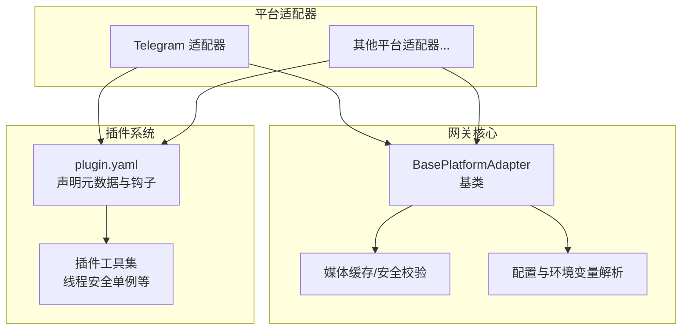
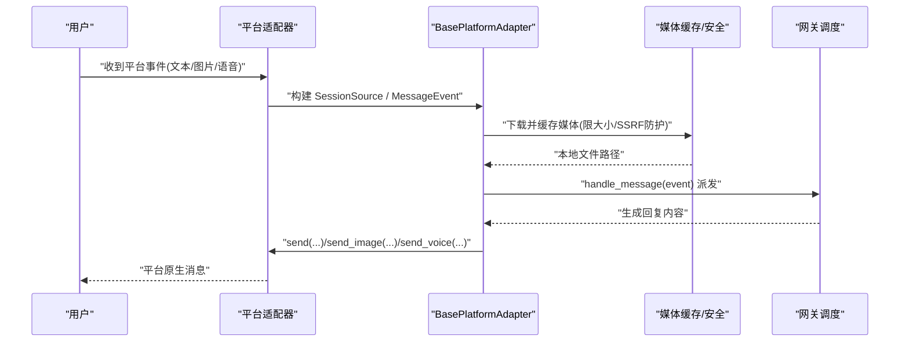
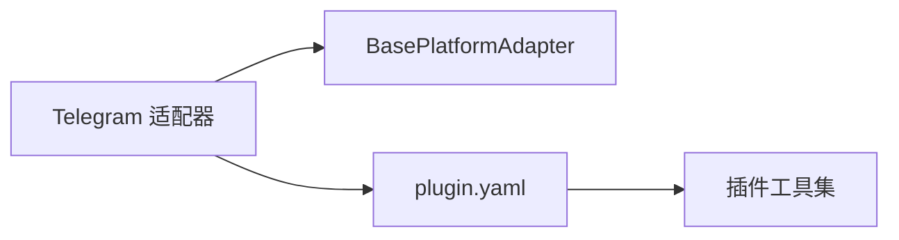

# 自定义平台开发

<cite>
**本文引用的文件**
- [gateway/platforms/base.py](file://gateway/platforms/base.py)
- [gateway/platforms/ADDING_A_PLATFORM.md](file://gateway/platforms/ADDING_A_PLATFORM.md)
- [plugins/plugin_utils.py](file://plugins/plugin_utils.py)
- [plugins/platforms/telegram/adapter.py](file://plugins/platforms/telegram/adapter.py)
- [plugins/platforms/telegram/plugin.yaml](file://plugins/platforms/telegram/plugin.yaml)
</cite>

## 目录
1. [简介](#简介)
2. [项目结构](#项目结构)
3. [核心组件](#核心组件)
4. [架构总览](#架构总览)
5. [详细组件分析](#详细组件分析)
6. [依赖关系分析](#依赖关系分析)
7. [性能考量](#性能考量)
8. [故障排查指南](#故障排查指南)
9. [结论](#结论)
10. [附录](#附录)

## 简介
本指南面向希望为消息网关扩展新平台的开发者，系统讲解如何基于平台基类实现自定义适配器，涵盖必需方法与可选扩展点、消息格式转换、用户身份映射、会话管理、插件注册机制、配置管理、依赖注入等关键能力。并提供从简单 Echo Bot 到复杂多功能机器人的完整开发示例，以及测试策略、调试技巧、性能优化与发布分发建议，帮助你将平台集成贡献到项目中。

## 项目结构
本项目采用“核心网关 + 多平台适配器”的架构：
- 核心网关负责会话、路由、调度、安全与通用能力（如媒体缓存、代理、流式 TTS）。
- 平台适配器位于 gateway/platforms 或 plugins/platforms，继承自统一基类，实现具体平台协议。
- 插件化路径推荐社区与第三方接入，无需修改核心代码即可注册平台。

图表来源
- [gateway/platforms/base.py:1-1200](file://gateway/platforms/base.py#L1-L1200)
- [plugins/platforms/telegram/plugin.yaml](file://plugins/platforms/telegram/plugin.yaml)
- [plugins/plugin_utils.py:1-136](file://plugins/plugin_utils.py#L1-L136)

章节来源
- [gateway/platforms/ADDING_A_PLATFORM.md:1-120](file://gateway/platforms/ADDING_A_PLATFORM.md#L1-L120)
- [gateway/platforms/base.py:1-200](file://gateway/platforms/base.py#L1-L200)

## 核心组件
- 平台基类 BasePlatformAdapter：定义所有平台必须实现的接口与通用行为，包括连接生命周期、消息发送、类型指示、聊天信息获取、消息处理派发、附件缓存、流式 TTS、代理与网络限制等。
- 插件系统：通过 plugin.yaml 声明平台元数据、环境变量、钩子函数；在 register(ctx) 中调用 ctx.register_platform() 完成注册，零侵入核心。
- 配置与环境变量：支持 YAML 配置与环境变量覆盖，提供 apply_yaml_config_fn、env_enablement_fn 等钩子以适配不同平台的配置模型。
- 依赖注入与并发工具：插件可使用线程安全的懒加载单例与槽位工具，避免全局单例竞态问题。

章节来源
- [gateway/platforms/base.py:1-200](file://gateway/platforms/base.py#L1-L200)
- [gateway/platforms/ADDING_A_PLATFORM.md:5-75](file://gateway/platforms/ADDING_A_PLATFORM.md#L5-L75)
- [plugins/plugin_utils.py:1-136](file://plugins/plugin_utils.py#L1-L136)

## 架构总览
下图展示从平台事件到消息发送的整体流程，体现基类提供的通用能力与各平台适配器的职责边界。

图表来源
- [gateway/platforms/base.py:700-920](file://gateway/platforms/base.py#L700-L920)
- [gateway/platforms/base.py:960-1070](file://gateway/platforms/base.py#L960-L1070)

## 详细组件分析

### 平台基类与必需方法
- 必需方法
  - __init__(config): 解析配置并初始化状态，需调用 super().__init__(config, Platform.YOUR_PLATFORM)。
  - connect(): 建立连接并启动监听，成功返回 True。
  - disconnect(): 停止监听、关闭连接、取消任务。
  - send(chat_id, text, ...): 发送文本消息。
  - send_typing(chat_id): 发送正在输入指示。
  - send_image(chat_id, image_url, caption): 发送图片。
  - get_chat_info(chat_id): 返回聊天信息 {name, type, chat_id}。
- 可选方法（基类提供默认桩）
  - send_document/send_voice/send_video/send_animation/send_image_file 等。
- 交互 UX（若平台支持按钮/菜单）
  - send_clarify/send_exec_approval/send_slash_confirm/send_model_picker/send_choice_picker 等，提升用户体验。

章节来源
- [gateway/platforms/ADDING_A_PLATFORM.md:87-145](file://gateway/platforms/ADDING_A_PLATFORM.md#L87-L145)
- [gateway/platforms/base.py:1-200](file://gateway/platforms/base.py#L1-L200)

### 消息格式转换与会话管理
- 会话源 SessionSource：用于标识用户与聊天上下文，必要时可添加额外身份字段并在 to_dict/from_dict/build_source 中保持一致性。
- 消息事件 MessageEvent/MessageType：统一入站消息抽象，便于跨平台处理。
- 线程与回复锚点：根据平台特性计算 reply_to 与 thread metadata，确保回复正确路由。

章节来源
- [gateway/platforms/ADDING_A_PLATFORM.md:207-212](file://gateway/platforms/ADDING_A_PLATFORM.md#L207-L212)
- [gateway/platforms/base.py:78-151](file://gateway/platforms/base.py#L78-L151)

### 插件注册机制与配置管理
- 插件路径（推荐）：在 ~/.sparkii/plugins/ 或 plugins/platforms/ 下创建 plugin.yaml 与 adapter.py，在 register(ctx) 中调用 ctx.register_platform() 完成注册。
- 钩子函数
  - env_enablement_fn：在适配器构造前从环境变量填充 PlatformConfig.extra。
  - apply_yaml_config_fn：将平台 YAML 键转换为环境变量或 extra，允许插件拥有自己的 YAML schema。
  - cron_deliver_env_var：为定时任务投递指定目标通道。
  - standalone_sender_fn：进程外投递（供 cron 使用）。
- 配置优先级：环境变量 > YAML 覆盖 > 默认值。

章节来源
- [gateway/platforms/ADDING_A_PLATFORM.md:5-75](file://gateway/platforms/ADDING_A_PLATFORM.md#L5-L75)
- [gateway/platforms/ADDING_A_PLATFORM.md:148-173](file://gateway/platforms/ADDING_A_PLATFORM.md#L148-L173)

### 依赖注入与并发工具
- lazy_singleton：装饰器，提供线程安全的懒加载单例访问器，附带 reset() 用于测试/清理。
- SingletonSlot：带参数的线程安全懒加载槽位，适用于按配置构建不同实例的场景。

章节来源
- [plugins/plugin_utils.py:43-136](file://plugins/plugin_utils.py#L43-L136)

### 媒体缓存与安全
- 入站媒体限流：读取 HTTP 响应体时进行 Content-Length 预检与分块累计校验，防止超大负载导致 OOM。
- 本地缓存：图片/音频/视频/文档/截图分别有独立缓存目录与清理工具。
- SSRF 防护：下载 URL 前进行安全检查，并对重定向目标再次验证。
- 出站媒体交付安全：严格模式与宽松模式，结合白名单根目录、最近生产时间窗口、敏感路径黑名单，防止泄露系统/凭据文件。

章节来源
- [gateway/platforms/base.py:700-920](file://gateway/platforms/base.py#L700-L920)
- [gateway/platforms/base.py:960-1122](file://gateway/platforms/base.py#L960-L1122)
- [gateway/platforms/base.py:1124-1463](file://gateway/platforms/base.py#L1124-L1463)

### 代理与网络限制
- 代理解析：优先平台环境变量，其次 HTTPS_PROXY/HTTP_PROXY/ALL_PROXY，最后 macOS 系统代理自动检测；支持 NO_PROXY/no_proxy 匹配。
- aiohttp/命令客户端代理参数构造：支持 SOCKS 与 HTTP 代理，强制远程 DNS 解析通过代理。

章节来源
- [gateway/platforms/base.py:290-517](file://gateway/platforms/base.py#L290-L517)

### 流式 TTS
- 流式句柄与格式描述：StreamingTTSHandle 与 AudioFormat 描述 PCM 流格式与播放状态。
- 每轮抑制：基于 session_key 与 turn_marker 生成抑制键，避免重复回放。
- 输出路径选择：根据平台要求选择 .ogg 或 .mp3，保证容器兼容性。

章节来源
- [gateway/platforms/base.py:570-637](file://gateway/platforms/base.py#L570-L637)
- [gateway/platforms/base.py:176-200](file://gateway/platforms/base.py#L176-L200)

### 开发示例

#### 简单 Echo Bot（Telegram 插件示例）
- 步骤
  - 在 plugins/platforms/your_platform 下创建 adapter.py 与 plugin.yaml。
  - adapter.py 继承 BasePlatformAdapter，实现 connect/disconnect/send/get_chat_info 等必需方法。
  - plugin.yaml 声明平台名称、所需环境变量、可选钩子。
  - 在 register(ctx) 中调用 ctx.register_platform() 完成注册。
- 参考实现
  - 参见 Telegram 插件结构与注册方式。

章节来源
- [plugins/platforms/telegram/adapter.py](file://plugins/platforms/telegram/adapter.py)
- [plugins/platforms/telegram/plugin.yaml](file://plugins/platforms/telegram/plugin.yaml)
- [gateway/platforms/ADDING_A_PLATFORM.md:5-75](file://gateway/platforms/ADDING_A_PLATFORM.md#L5-L75)

#### 复杂多功能机器人（含按钮交互、定时投递、媒体处理）
- 交互按钮：实现 send_clarify/send_exec_approval/send_slash_confirm 等，配合入站回调路由至对应解析器。
- 定时投递：设置 cron_deliver_env_var 与 standalone_sender_fn，使 cron 任务能独立于网关进程投递消息。
- 媒体处理：使用 cache_image_from_bytes/url、cache_audio_from_bytes/url 等工具，遵循入站大小限制与 SSRF 防护。
- 会话与线程：利用 build_source 与 _reply_anchor_for_event/_platform_name 等工具确保正确的回复与线程路由。

章节来源
- [gateway/platforms/ADDING_A_PLATFORM.md:113-145](file://gateway/platforms/ADDING_A_PLATFORM.md#L113-L145)
- [gateway/platforms/base.py:78-151](file://gateway/platforms/base.py#L78-L151)
- [gateway/platforms/base.py:700-920](file://gateway/platforms/base.py#L700-L920)

## 依赖关系分析
- 平台适配器对基类的强依赖：所有平台均继承 BasePlatformAdapter，复用媒体缓存、代理、会话与流式 TTS 等能力。
- 插件系统与核心解耦：通过 plugin.yaml 与 register(ctx) 完成注册，不修改核心代码。
- 并发工具被插件广泛使用：lazy_singleton 与 SingletonSlot 避免全局单例竞态。

图表来源
- [gateway/platforms/base.py:1-200](file://gateway/platforms/base.py#L1-L200)
- [plugins/plugin_utils.py:1-136](file://plugins/plugin_utils.py#L1-L136)
- [plugins/platforms/telegram/plugin.yaml](file://plugins/platforms/telegram/plugin.yaml)

章节来源
- [gateway/platforms/base.py:1-200](file://gateway/platforms/base.py#L1-L200)
- [plugins/plugin_utils.py:1-136](file://plugins/plugin_utils.py#L1-L136)

## 性能考量
- 入站媒体大小限制：通过 validate_inbound_media_size 与 _read_httpx_body_with_limit 控制内存峰值，避免 OOM。
- 重试与退避：媒体下载失败时指数退避重试，提高鲁棒性。
- 代理与 DNS：SOCKS 代理强制远程 DNS 解析，绕过污染并提升连通性。
- 流式 TTS：按平台选择合适容器格式，减少转码开销。
- 缓存清理：定期清理过期媒体缓存，释放磁盘空间。

章节来源
- [gateway/platforms/base.py:700-920](file://gateway/platforms/base.py#L700-L920)
- [gateway/platforms/base.py:960-1122](file://gateway/platforms/base.py#L960-L1122)
- [gateway/platforms/base.py:290-517](file://gateway/platforms/base.py#L290-L517)

## 故障排查指南
- 常见问题
  - 依赖未满足：检查 check_<platform>_requirements 是否通过。
  - 配置未生效：确认环境变量与 YAML 覆盖顺序，必要时使用 apply_yaml_config_fn 调整。
  - 媒体无法送达：检查出站媒体交付安全策略（严格模式/白名单/最近时间窗口/敏感路径黑名单）。
  - 代理连接失败：确认代理 URL 与 NO_PROXY/no_proxy 匹配是否正确。
- 调试技巧
  - 启用日志并脱敏敏感标识，避免泄露凭据。
  - 使用插件工具的单例 reset() 重置状态以便复测。
  - 针对重连场景，实现指数退避+抖动，避免雪崩。

章节来源
- [gateway/platforms/ADDING_A_PLATFORM.md:127-145](file://gateway/platforms/ADDING_A_PLATFORM.md#L127-L145)
- [gateway/platforms/base.py:1124-1463](file://gateway/platforms/base.py#L1124-L1463)
- [plugins/plugin_utils.py:43-136](file://plugins/plugin_utils.py#L43-L136)

## 结论
通过统一的平台基类与插件化注册机制，开发者可以以最小改动快速接入新平台。基类提供了媒体缓存、安全校验、代理、流式 TTS、会话管理等通用能力，显著降低重复实现成本。遵循本文档的规范与实践，可实现从简单 Echo Bot 到复杂多功能机器人的平滑演进，并以插件形式贡献到项目中。

## 附录

### 内置集成清单（仅核心贡献者）
- 平台枚举与环境变量加载：在 config 中添加平台枚举与环境变量映射。
- 适配器工厂：在运行时创建适配器并检查依赖。
- 授权映射：加入允许列表与全量允许开关。
- 系统提示词：告知 Agent 当前平台能力。
- 工具集与定时投递：注册平台名以便工具与 cron 使用。
- 渠道目录与状态显示：完善 CLI 状态与向导。
- 测试：覆盖枚举、配置、初始化、辅助函数、会话序列化、授权、工具路由等。

章节来源
- [gateway/platforms/ADDING_A_PLATFORM.md:148-390](file://gateway/platforms/ADDING_A_PLATFORM.md#L148-L390)

### 快速验证
- 运行测试套件，确保无回归。
- 搜索平台关键字，确认所有集成点均已更新。

章节来源
- [gateway/platforms/ADDING_A_PLATFORM.md:392-405](file://gateway/platforms/ADDING_A_PLATFORM.md#L392-L405)